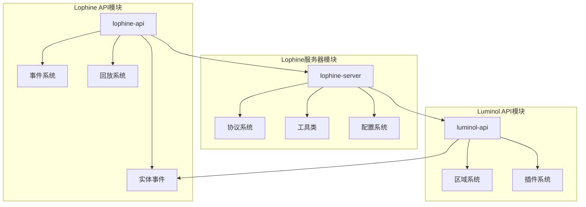
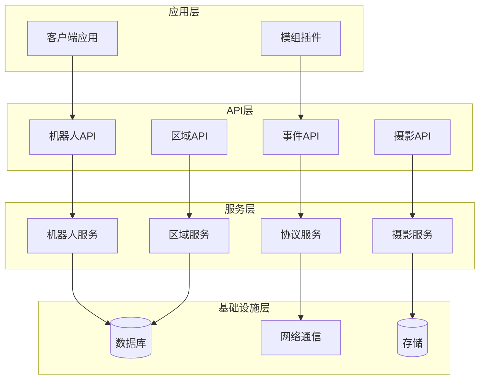
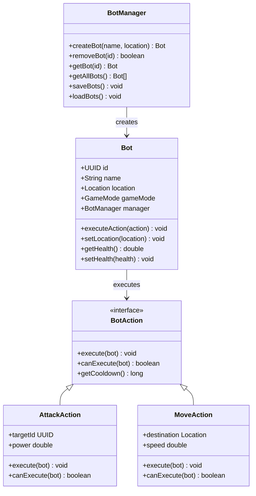
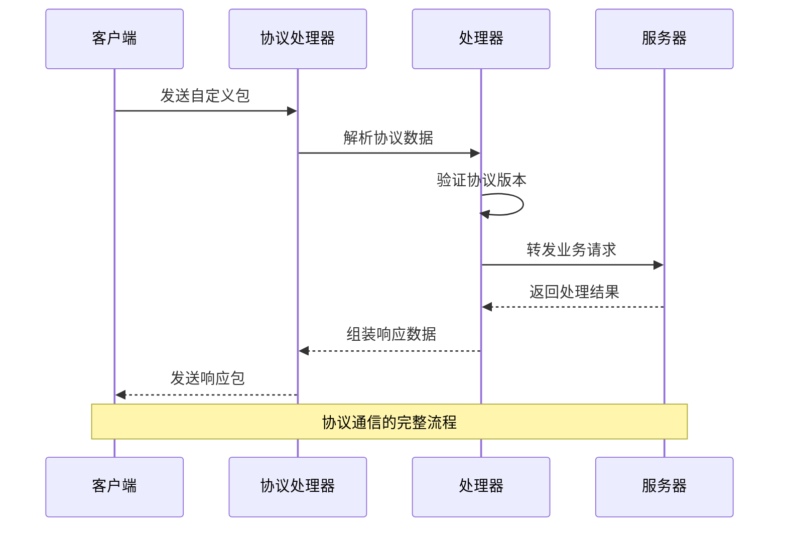
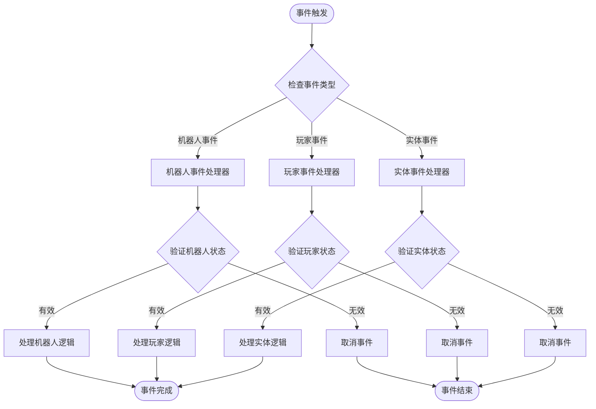
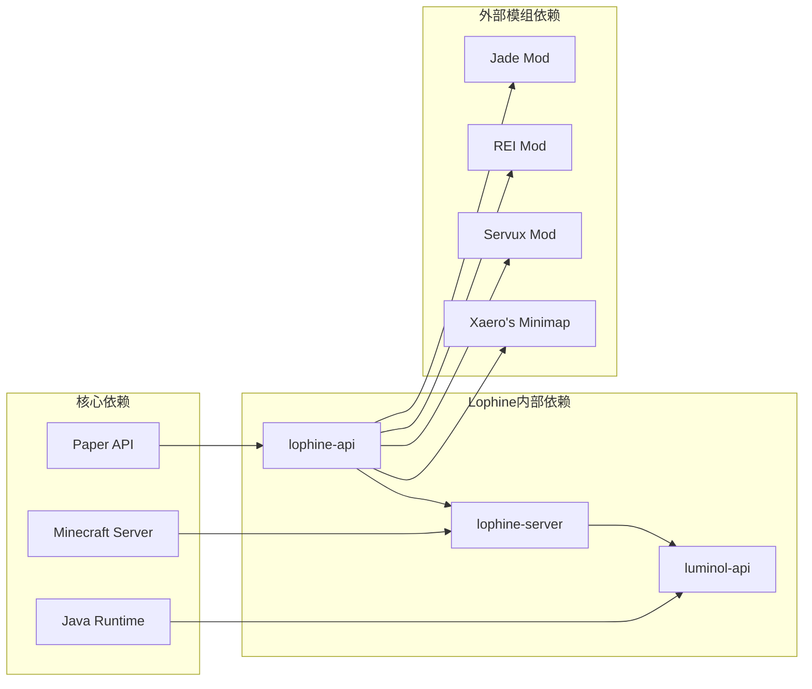

# API参考手册

<cite>
**本文档引用的文件**
- [README.md](file://README.md)
- [README_EN.md](file://README_EN.md)
- [Bot.java](file://lophine-api/src/main/java/org/leavesmc/leaves/entity/bot/Bot.java)
- [BotCreator.java](file://lophine-api/src/main/java/org/leavesmc/leaves/entity/bot/BotCreator.java)
- [BotManager.java](file://lophine-api/src/main/java/org/leavesmc/leaves/entity/bot/BotManager.java)
- [BotAction.java](file://lophine-api/src/main/java/org/leavesmc/leaves/entity/bot/action/BotAction.java)
- [AttackAction.java](file://lophine-api/src/main/java/org/leavesmc/leaves/entity/bot/action/AttackAction.java)
- [BreakBlockAction.java](file://lophine-api/src/main/java/org/leavesmc/leaves/entity/bot/action/BreakBlockAction.java)
- [DropAction.java](file://lophine-api/src/main/java/org/leavesmc/leaves/entity/bot/action/DropAction.java)
- [FishAction.java](file://lophine-api/src/main/java/org/leavesmc/leaves/entity/bot/action/FishAction.java)
- [JumpAction.java](file://lophine-api/src/main/java/org/leavesmc/leaves/entity/bot/action/JumpAction.java)
- [LookAction.java](file://lophine-api/src/main/java/org/leavesmc/leaves/entity/bot/action/LookAction.java)
- [MountAction.java](file://lophine-api/src/main/java/org/leavesmc/leaves/entity/bot/action/MountAction.java)
- [MoveAction.java](file://lophine-api/src/main/java/org/leavesmc/leaves/entity/bot/action/MoveAction.java)
- [RotationAction.java](file://lophine-api/src/main/java/org/leavesmc/leaves/entity/bot/action/RotationAction.java)
- [SneakAction.java](file://lophine-api/src/main/java/org/leavesmc/leaves/entity/bot/action/SneakAction.java)
- [StateBotAction.java](file://lophine-api/src/main/java/org/leavesmc/leaves/entity/bot/action/StateBotAction.java)
- [SwapAction.java](file://lophine-api/src/main/java/org/leavesmc/leaves/entity/bot/action/SwapAction.java)
- [SwimAction.java](file://lophine-api/src/main/java/org/leavesmc/leaves/entity/bot/action/SwimAction.java)
- [TimerBotAction.java](file://lophine-api/src/main/java/org/leavesmc/leaves/entity/bot/action/TimerBotAction.java)
- [UseItemAction.java](file://lophine-api/src/main/java/org/leavesmc/leaves/entity/bot/action/UseItemAction.java)
- [UseItemAutoAction.java](file://lophine-api/src/main/java/org/leavesmc/leaves/entity/bot/action/UseItemAutoAction.java)
- [UseItemOffhandAction.java](file://lophine-api/src/main/java/org/leavesmc/leaves/entity/bot/action/UseItemOffhandAction.java)
- [UseItemOnAction.java](file://lophine-api/src/main/java/org/leavesmc/leaves/entity/bot/action/UseItemOnAction.java)
- [UseItemOnOffhandAction.java](file://lophine-api/src/main/java/org/leavesmc/leaves/entity/bot/action/UseItemOnOffhandAction.java)
- [UseItemToAction.java](file://lophine-api/src/main/java/org/leavesmc/leaves/entity/bot/action/UseItemToAction.java)
- [UseItemToOffhandAction.java](file://lophine-api/src/main/java/org/leavesmc/leaves/entity/bot/action/UseItemToOffhandAction.java)
- [Photographer.java](file://lophine-api/src/main/java/org/leavesmc/leaves/entity/photographer/Photographer.java)
- [PhotographerManager.java](file://lophine-api/src/main/java/org/leavesmc/leaves/entity/photographer/PhotographerManager.java)
- [BotActionEvent.java](file://lophine-api/src/main/java/org/leavesmc/leaves/event/bot/BotActionEvent.java)
- [BotActionExecuteEvent.java](file://lophine-api/src/main/java/org/leavesmc/leaves/event/bot/BotActionExecuteEvent.java)
- [BotActionScheduleEvent.java](file://lophine-api/src/main/java/org/leavesmc/leaves/event/bot/BotActionScheduleEvent.java)
- [BotActionStopEvent.java](file://lophine-api/src/main/java/org/leavesmc/leaves/event/bot/BotActionStopEvent.java)
- [BotConfigModifyEvent.java](file://lophine-api/src/main/java/org/leavesmc/leaves/event/bot/BotConfigModifyEvent.java)
- [BotCreateEvent.java](file://lophine-api/src/main/java/org/leavesmc/leaves/event/bot/BotCreateEvent.java)
- [BotDeathEvent.java](file://lophine-api/src/main/java/org/leavesmc/leaves/event/bot/BotDeathEvent.java)
- [BotEvent.java](file://lophine-api/src/main/java/org/leavesmc/leaves/event/bot/BotEvent.java)
- [BotInventoryOpenEvent.java](file://lophine-api/src/main/java/org/leavesmc/leaves/event/bot/BotInventoryOpenEvent.java)
- [BotJoinEvent.java](file://lophine-api/src/main/java/org/leavesmc/leaves/event/bot/BotJoinEvent.java)
- [BotLoadEvent.java](file://lophine-api/src/main/java/org/leavesmc/leaves/event/bot/BotLoadEvent.java)
- [BotRemoveEvent.java](file://lophine-api/src/main/java/org/leavesmc/leaves/event/bot/BotRemoveEvent.java)
- [BotSpawnLocationEvent.java](file://lophine-api/src/main/java/org/leavesmc/leaves/event/bot/BotSpawnLocationEvent.java)
- [PlayerOperationLimitEvent.java](file://lophine-api/src/main/java/org/leavesmc/leaves/event/player/PlayerOperationLimitEvent.java)
- [UpdateSuppressionEvent.java](file://lophine-api/src/main/java/org/leavesmc/leaves/event/player/UpdateSuppressionEvent.java)
- [BukkitRecorderOption.java](file://lophine-api/src/main/java/org/leavesmc/leaves/replay/BukkitRecorderOption.java)
- [CarpetLoggerProtocol.java](file://lophine-server/src/main/java/fun/bm/lophine/protocol/CarpetLoggerProtocol.java)
- [LeavesProtocolManager.java](file://lophine-server/src/main/java/org/leavesmc/leaves/protocol/core/LeavesProtocolManager.java)
- [LeavesProtocol.java](file://lophine-server/src/main/java/org/leavesmc/leaves/protocol/core/LeavesProtocol.java)
- [JadeProtocol.java](file://lophine-server/src/main/java/org/leavesmc/leaves/protocol/jade/JadeProtocol.java)
- [REIServerProtocol.java](file://lophine-server/src/main/java/org/leavesmc/leaves/protocol/rei/REIServerProtocol.java)
- [ServuxProtocol.java](file://lophine-server/src/main/java/org/leavesmc/leaves/protocol/servux/ServuxProtocol.java)
- [SyncmaticaProtocol.java](file://lophine-server/src/main/java/org/leavesmc/leaves/protocol/syncmatica/SyncmaticaProtocol.java)
- [AppleSkinProtocol.java](file://lophine-server/src/main/java/org/leavesmc/leaves/protocol/AppleSkinProtocol.java)
- [BBORProtocol.java](file://lophine-server/src/main/java/org/leavesmc/leaves/protocol/BBORProtocol.java)
- [XaeroMapProtocol.java](file://lophine-server/src/main/java/org/leavesmc/leaves/protocol/XaeroMapProtocol.java)
- [LitematicaEasyPlaceProtocol.java](file://lophine-server/src/main/java/org/leavesmc/leaves/protocol/LitematicaEasyPlaceProtocol.java)
- [CarpetAlternativeBlockPlacement.java](file://lophine-server/src/main/java/org/leavesmc/leaves/protocol/CarpetAlternativeBlockPlacement.java)
- [CarpetServerProtocol.java](file://lophine-server/src/main/java/org/leavesmc/leaves/protocol/CarpetServerProtocol.java)
- [ThreadedRegion.java](file://luminol-api/src/main/java/me/earthme/luminol/api/ThreadedRegion.java)
- [ThreadedRegionizer.java](file://luminol-api/src/main/java/me/earthme/luminol/api/ThreadedRegionizer.java)
- [TickRegionData.java](file://luminol-api/src/main/java/me/earthme/luminol/api/TickRegionData.java)
- [RegionStats.java](file://luminol-api/src/main/java/me/earthme/luminol/api/RegionStats.java)
- [PostPlayerRespawnEvent.java](file://luminol-api/src/main/java/me/earthme/luminol/api/entity/player/PostPlayerRespawnEvent.java)
- [EntityTeleportAsyncEvent.java](file://luminol-api/src/main/java/me/earthme/luminol/api/entity/EntityTeleportAsyncEvent.java)
- [PostEntityPortalEvent.java](file://luminol-api/src/main/java/me/earthme/luminol/api/entity/PostEntityPortalEvent.java)
- [PreEntityPortalEvent.java](file://luminol-api/src/main/java/me/earthme/luminol/api/entity/PreEntityPortalEvent.java)
- [EndPlatformCreateEvent.java](file://luminol-api/src/main/java/me/earthme/luminol/api/portal/EndPlatformCreateEvent.java)
- [PortalLocateEvent.java](file://luminol-api/src/main/java/me/earthme/luminol/api/portal/PortalLocateEvent.java)
- [FeatureManager.java](file://luminol-api/src/main/java/org/leavesmc/leaves/plugin/FeatureManager.java)
- [Features.java](file://luminol-api/src/main/java/org/leavesmc/leaves/plugin/Features.java)
</cite>

## 目录
1. [简介](#简介)
2. [项目结构](#项目结构)
3. [核心组件](#核心组件)
4. [架构概览](#架构概览)
5. [详细组件分析](#详细组件分析)
6. [依赖分析](#依赖分析)
7. [性能考虑](#性能考虑)
8. [故障排除指南](#故障排除指南)
9. [结论](#结论)
10. [附录](#附录)

## 简介

Lophine是一个基于Paper的Minecraft服务器优化项目，提供了丰富的API接口用于扩展服务器功能。本参考手册详细介绍了Lophine API的所有公共接口，包括类、方法、字段和枚举的完整定义。

Lophine API主要分为以下几个核心模块：
- 机器人系统（Bot System）
- 摄影师系统（Photographer System）
- 协议通信（Protocol Communication）
- 事件系统（Event System）
- 区域管理（Region Management）
- 回放系统（Replay System）

## 项目结构

Lophine项目采用多模块架构设计，主要包含以下核心模块：

**图表来源**
- [README.md](file://README.md)
- [README_EN.md](file://README_EN.md)

**章节来源**
- [README.md](file://README.md)
- [README_EN.md](file://README_EN.md)

## 核心组件

### 机器人系统（Bot System）

机器人系统是Lophine的核心功能之一，提供了完整的NPC机器人管理能力。

#### Bot类
Bot类是机器人系统的核心实体类，负责管理机器人的基本属性和行为。

#### BotManager类
BotManager类提供机器人管理的静态方法，包括机器人的创建、删除、查询等操作。

#### BotAction接口及实现
BotAction接口定义了机器人可执行的动作基类，包含多种具体动作实现：
- 攻击动作：AttackAction
- 破坏方块：BreakBlockAction
- 掉落物品：DropAction
- 钓鱼：FishAction
- 跳跃：JumpAction
- 移动：MoveAction
- 旋转：RotationAction
- 蹲下：SneakAction
- 使用物品：UseItemAction系列

**章节来源**
- [Bot.java](file://lophine-api/src/main/java/org/leavesmc/leaves/entity/bot/Bot.java)
- [BotManager.java](file://lophine-api/src/main/java/org/leavesmc/leaves/entity/bot/BotManager.java)
- [BotAction.java](file://lophine-api/src/main/java/org/leavesmc/leaves/entity/bot/action/BotAction.java)

### 摄影师系统（Photographer System）

摄影师系统允许服务器管理员录制游戏过程，用于视频制作或数据分析。

#### Photographer类
Photographer类管理摄影师实体的生命周期和录制功能。

#### PhotographerManager类
PhotographerManager类提供摄影师的创建、管理和查询功能。

**章节来源**
- [Photographer.java](file://lophine-api/src/main/java/org/leavesmc/leaves/entity/photographer/Photographer.java)
- [PhotographerManager.java](file://lophine-api/src/main/java/org/leavesmc/leaves/entity/photographer/PhotographerManager.java)

### 协议通信系统（Protocol System）

Lophine实现了多个客户端-服务器协议，用于与各种模组进行数据交换。

#### 核心协议类
- LeavesProtocol：基础协议框架
- LeavesProtocolManager：协议管理器
- JadeProtocol：Jade模组集成协议
- REIServerProtocol：REI模组集成协议
- ServuxProtocol：Servux模组集成协议
- SyncmaticaProtocol：同步模组集成协议

**章节来源**
- [LeavesProtocol.java](file://lophine-server/src/main/java/org/leavesmc/leaves/protocol/core/LeavesProtocol.java)
- [LeavesProtocolManager.java](file://lophine-server/src/main/java/org/leavesmc/leaves/protocol/core/LeavesProtocolManager.java)
- [JadeProtocol.java](file://lophine-server/src/main/java/org/leavesmc/leaves/protocol/jade/JadeProtocol.java)

### 事件系统（Event System）

Lophine提供了丰富的事件系统，支持对各种游戏行为的监听和响应。

#### 机器人事件
- BotEvent：机器人基础事件
- BotActionEvent：机器人动作事件
- BotCreateEvent：机器人创建事件
- BotDeathEvent：机器人死亡事件
- BotJoinEvent：机器人加入事件
- BotRemoveEvent：机器人移除事件

#### 玩家事件
- PlayerOperationLimitEvent：玩家操作限制事件
- UpdateSuppressionEvent：更新抑制事件

**章节来源**
- [BotEvent.java](file://lophine-api/src/main/java/org/leavesmc/leaves/event/bot/BotEvent.java)
- [BotActionEvent.java](file://lophine-api/src/main/java/org/leavesmc/leaves/event/bot/BotActionEvent.java)
- [PlayerOperationLimitEvent.java](file://lophine-api/src/main/java/org/leavesmc/leaves/event/player/PlayerOperationLimitEvent.java)

### 区域管理系统（Region Management）

Luminol API提供了高性能的区域管理功能，支持多线程环境下的区域数据处理。

#### 核心类
- ThreadedRegion：线程安全的区域类
- ThreadedRegionizer：区域化器
- TickRegionData：区域数据
- RegionStats：区域统计信息

**章节来源**
- [ThreadedRegion.java](file://luminol-api/src/main/java/me/earthme/luminol/api/ThreadedRegion.java)
- [ThreadedRegionizer.java](file://luminol-api/src/main/java/me/earthme/luminol/api/ThreadedRegionizer.java)
- [TickRegionData.java](file://luminol-api/src/main/java/me/earthme/luminol/api/TickRegionData.java)

## 架构概览

Lophine API采用分层架构设计，各模块之间通过清晰的接口进行交互：

**图表来源**
- [README.md](file://README.md)
- [BotManager.java](file://lophine-api/src/main/java/org/leavesmc/leaves/entity/bot/BotManager.java)
- [PhotographerManager.java](file://lophine-api/src/main/java/org/leavesmc/leaves/entity/photographer/PhotographerManager.java)

## 详细组件分析

### 机器人系统架构

**图表来源**
- [Bot.java](file://lophine-api/src/main/java/org/leavesmc/leaves/entity/bot/Bot.java)
- [BotManager.java](file://lophine-api/src/main/java/org/leavesmc/leaves/entity/bot/BotManager.java)
- [BotAction.java](file://lophine-api/src/main/java/org/leavesmc/leaves/entity/bot/action/BotAction.java)
- [AttackAction.java](file://lophine-api/src/main/java/org/leavesmc/leaves/entity/bot/action/AttackAction.java)
- [MoveAction.java](file://lophine-api/src/main/java/org/leavesmc/leaves/entity/bot/action/MoveAction.java)

### 协议通信流程

**图表来源**
- [LeavesProtocol.java](file://lophine-server/src/main/java/org/leavesmc/leaves/protocol/core/LeavesProtocol.java)
- [LeavesProtocolManager.java](file://lophine-server/src/main/java/org/leavesmc/leaves/protocol/core/LeavesProtocolManager.java)

### 事件处理机制

**图表来源**
- [BotEvent.java](file://lophine-api/src/main/java/org/leavesmc/leaves/event/bot/BotEvent.java)
- [PlayerOperationLimitEvent.java](file://lophine-api/src/main/java/org/leavesmc/leaves/event/player/PlayerOperationLimitEvent.java)

**章节来源**
- [BotActionExecuteEvent.java](file://lophine-api/src/main/java/org/leavesmc/leaves/event/bot/BotActionExecuteEvent.java)
- [BotActionScheduleEvent.java](file://lophine-api/src/main/java/org/leavesmc/leaves/event/bot/BotActionScheduleEvent.java)

## 依赖分析

Lophine API的依赖关系呈现星型结构，核心模块相互独立但又紧密协作：

**图表来源**
- [README.md](file://README.md)
- [JadeProtocol.java](file://lophine-server/src/main/java/org/leavesmc/leaves/protocol/jade/JadeProtocol.java)
- [REIServerProtocol.java](file://lophine-server/src/main/java/org/leavesmc/leaves/protocol/rei/REIServerProtocol.java)

**章节来源**
- [README_EN.md](file://README_EN.md)
- [CarpetLoggerProtocol.java](file://lophine-server/src/main/java/fun/bm/lophine/protocol/CarpetLoggerProtocol.java)

## 性能考虑

### 线程安全性

Lophine API在设计时充分考虑了多线程环境下的安全性：

1. **区域管理**：ThreadedRegion类使用原子操作确保区域数据的线程安全
2. **机器人管理**：BotManager提供线程安全的机器人操作接口
3. **协议处理**：协议处理器采用无锁设计提高并发性能

### 内存管理

- 使用对象池减少垃圾回收压力
- 实现延迟加载机制优化内存使用
- 提供内存监控和警告机制

### 性能优化建议

1. **批量操作**：优先使用批量API而非单个操作
2. **异步处理**：对于耗时操作使用异步API
3. **缓存策略**：合理使用缓存减少重复计算
4. **资源释放**：及时释放不再使用的资源

## 故障排除指南

### 常见问题及解决方案

#### 机器人相关问题
- **问题**：机器人无法移动
  - **原因**：位置坐标无效或碰撞箱被阻挡
  - **解决**：检查目标位置的方块状态，确保路径畅通

- **问题**：机器人攻击无效
  - **原因**：目标距离超出攻击范围或目标无敌帧
  - **解决**：调整攻击距离，等待无敌帧结束

#### 协议通信问题
- **问题**：模组数据不同步
  - **原因**：协议版本不匹配或网络延迟
  - **解决**：检查协议版本，优化网络连接

#### 区域管理问题
- **问题**：区域数据异常
  - **原因**：多线程竞争条件
  - **解决**：使用提供的线程安全API

**章节来源**
- [UpdateSuppressionEvent.java](file://lophine-api/src/main/java/org/leavesmc/leaves/event/player/UpdateSuppressionEvent.java)
- [ThreadedRegion.java](file://luminol-api/src/main/java/me/earthme/luminol/api/ThreadedRegion.java)

## 结论

Lophine API提供了一个功能完整、设计合理的Minecraft服务器扩展框架。其模块化的设计使得开发者可以按需使用特定功能，同时保持系统的整体稳定性。

### 主要优势
- **模块化设计**：清晰的功能分离便于维护和扩展
- **线程安全**：全面的并发控制保证系统稳定性
- **性能优化**：针对高负载场景的专门优化
- **文档完善**：详细的API文档和使用示例

### 发展方向
- 进一步优化协议通信性能
- 扩展更多模组集成支持
- 增强监控和调试功能
- 提供更多的配置选项

## 附录

### API分类索引

#### 机器人相关API
- Bot类：机器人实体管理
- BotManager类：机器人全局管理
- BotAction接口：动作执行接口
- 各种具体动作类：AttackAction、MoveAction等

#### 协议相关API
- LeavesProtocol：基础协议框架
- 各种模组协议：JadeProtocol、REIServerProtocol等
- 协议管理器：LeavesProtocolManager

#### 事件相关API
- 机器人事件：BotEvent系列
- 玩家事件：PlayerOperationLimitEvent
- 实体事件：EntityTeleportAsyncEvent等

#### 区域相关API
- ThreadedRegion：线程安全区域
- ThreadedRegionizer：区域化器
- RegionStats：区域统计

### 版本兼容性

Lophine API遵循语义化版本控制：
- 主版本号：重大API变更
- 次版本号：新增功能但向后兼容
- 修订号：bug修复和小改进

### 使用限制和注意事项

1. **权限要求**：某些高级功能需要OP权限
2. **性能影响**：大量机器人同时运行会影响服务器性能
3. **内存占用**：长期运行可能增加内存使用
4. **兼容性**：与某些模组可能存在兼容性问题

### 线程安全声明

- 所有公共API都是线程安全的
- 区域管理API提供完全的并发支持
- 建议在多线程环境中使用提供的同步API