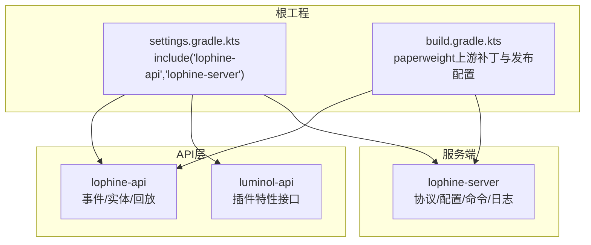
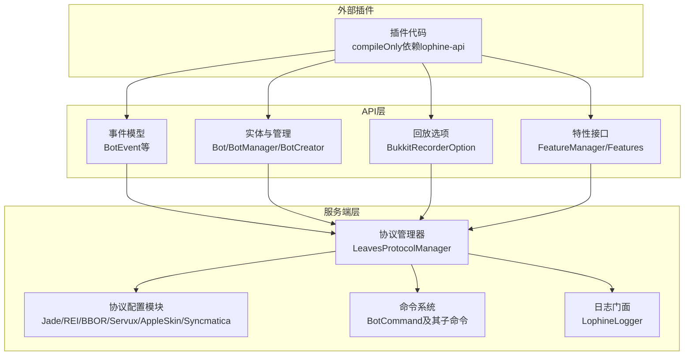
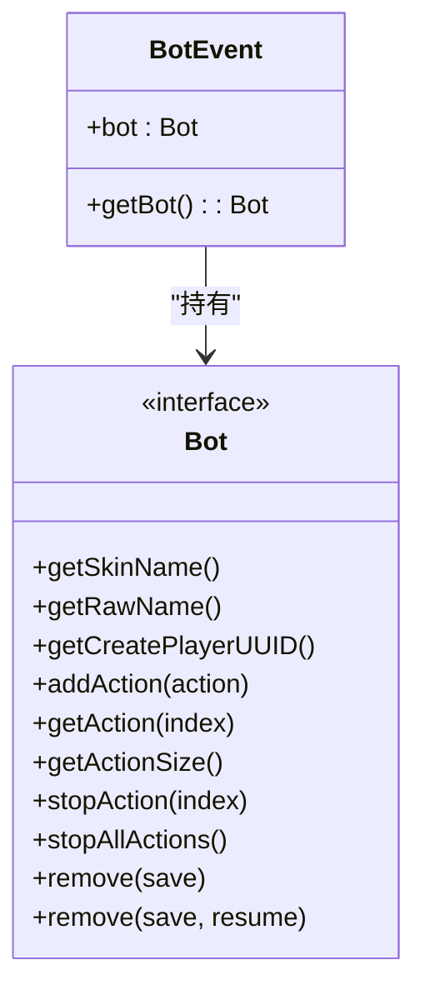
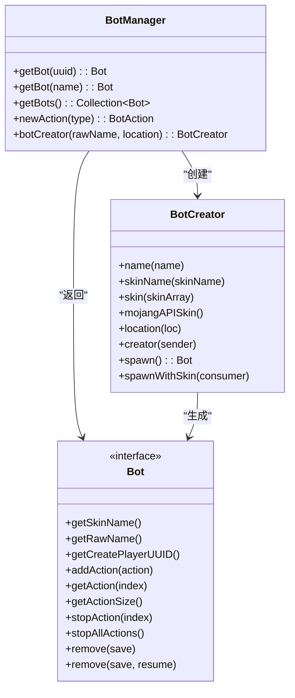
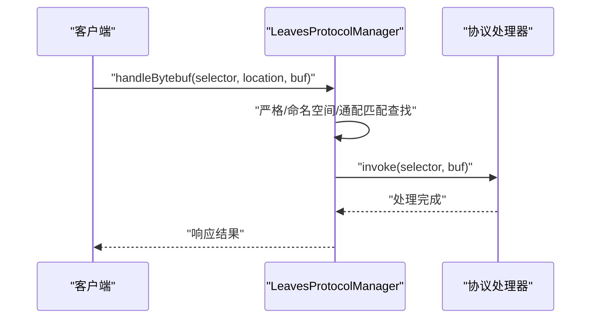
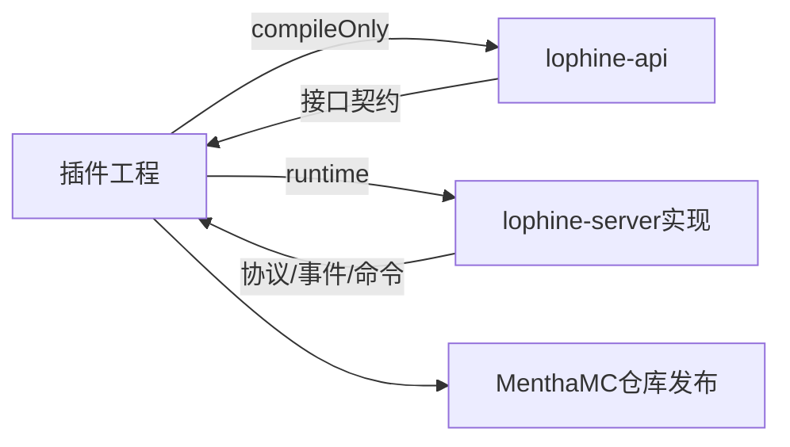

# API开发指南

<cite>
**本文引用的文件**   
- [README.md](file://README.md)
- [build.gradle.kts](file://build.gradle.kts)
- [settings.gradle.kts](file://settings.gradle.kts)
- [BotEvent.java](file://lophine-api/src/main/java/org/leavesmc/leaves/event/bot/BotEvent.java)
- [BukkitRecorderOption.java](file://lophine-api/src/main/java/org/leavesmc/leaves/replay/BukkitRecorderOption.java)
- [Bot.java](file://lophine-api/src/main/java/org/leavesmc/leaves/entity/bot/Bot.java)
- [BotManager.java](file://lophine-api/src/main/java/org/leavesmc/leaves/entity/bot/BotManager.java)
- [BotCreator.java](file://lophine-api/src/main/java/org/leavesmc/leaves/entity/bot/BotCreator.java)
- [BotCommand.java](file://lophine-server/src/main/java/org/leavesmc/leaves/command/bot/BotCommand.java)
- [LeavesProtocolManager.java](file://lophine-server/src/main/java/org/leavesmc/leaves/protocol/core/LeavesProtocolManager.java)
- [FeatureManager.java](file://luminol-api/src/main/java/org/leavesmc/leaves/plugin/FeatureManager.java)
- [Features.java](file://luminol-api/src/main/java/org/leavesmc/leaves/plugin/Features.java)
- [REIServerProtocolConfig.java](file://lophine-server/src/main/java/fun/bm/lophine/config/modules/function/protocol/REIServerProtocolConfig.java)
- [JadeProtocolConfig.java](file://lophine-server/src/main/java/fun/bm/lophine/config/modules/function/protocol/JadeProtocolConfig.java)
- [BBORProtocolConfig.java](file://lophine-server/src/main/java/fun/bm/lophine/config/modules/function/protocol/BBORProtocolConfig.java)
- [ServuxProtocolConfig.java](file://lophine-server/src/main/java/fun/bm/lophine/config/modules/function/protocol/ServuxProtocolConfig.java)
- [AppleSkinProtocolConfig.java](file://lophine-server/src/main/java/fun/bm/lophine/config/modules/function/protocol/AppleSkinProtocolConfig.java)
- [SyncmaticaProtocolConfig.java](file://lophine-server/src/main/java/fun/bm/lophine/config/modules/function/protocol/SyncmaticaProtocolConfig.java)
- [LophineLogger.java](file://lophine-server/src/main/java/fun/bm/lophine/LophineLogger.java)
</cite>

## 目录
1. [引言](#引言)
2. [项目结构](#项目结构)
3. [核心组件](#核心组件)
4. [架构总览](#架构总览)
5. [详细组件分析](#详细组件分析)
6. [依赖关系分析](#依赖关系分析)
7. [性能考量](#性能考量)
8. [故障排查指南](#故障排查指南)
9. [结论](#结论)
10. [附录](#附录)

## 引言
本指南面向希望在Lophine平台上进行API开发与插件扩展的开发者，系统阐述API架构、事件系统、协议框架、命令体系与插件开发流程，并提供从项目搭建到打包分发的全流程实践建议。Lophine基于Paper/Folia生态，提供可配置的原版特性、TPS可视化、Folia兼容修复以及多种生电功能增强，同时通过lophine-api与luminol-api对外暴露能力。

## 项目结构
仓库采用多模块Gradle工程组织，核心模块包括：
- lophine-api：对外API与事件模型、假人实体与管理器、回放选项等
- lophine-server：服务端实现、协议系统、配置模块、命令体系
- luminol-api：基础插件能力抽象（特性开关、插件接口）

图表来源
- [settings.gradle.kts:1-25](file://settings.gradle.kts#L1-L25)
- [build.gradle.kts:46-109](file://build.gradle.kts#L46-L109)

章节来源
- [settings.gradle.kts:1-25](file://settings.gradle.kts#L1-L25)
- [build.gradle.kts:46-109](file://build.gradle.kts#L46-L109)

## 核心组件
- 事件系统：以BotEvent为核心，围绕假人生命周期与动作事件展开，支持同步/异步事件。
- 实体与管理：Bot接口定义假人行为契约；BotManager提供查询与实例化；BotCreator提供链式构造与异步皮肤加载。
- 协议系统：LeavesProtocolManager集中注册与分发自定义协议处理器，支持严格匹配、命名空间匹配与通配匹配。
- 插件特性：FeatureManager与Features枚举提供特性可用性检查与标识。
- 回放与录制：BukkitRecorderOption定义录制参数（天气、时间、聊天忽略等）。
- 命令体系：BotCommand作为根节点聚合子命令，统一权限注册与路由。

章节来源
- [BotEvent.java:24-49](file://lophine-api/src/main/java/org/leavesmc/leaves/event/bot/BotEvent.java#L24-L49)
- [Bot.java:27-103](file://lophine-api/src/main/java/org/leavesmc/leaves/entity/bot/Bot.java#L27-L103)
- [BotManager.java:28-65](file://lophine-api/src/main/java/org/leavesmc/leaves/entity/bot/BotManager.java#L28-L65)
- [BotCreator.java:28-69](file://lophine-api/src/main/java/org/leavesmc/leaves/entity/bot/BotCreator.java#L28-L69)
- [LeavesProtocolManager.java:57-319](file://lophine-server/src/main/java/org/leavesmc/leaves/protocol/core/LeavesProtocolManager.java#L57-L319)
- [FeatureManager.java:10-14](file://luminol-api/src/main/java/org/leavesmc/leaves/plugin/FeatureManager.java#L10-L14)
- [Features.java:8-13](file://luminol-api/src/main/java/org/leavesmc/leaves/plugin/Features.java#L8-L13)
- [BukkitRecorderOption.java:20-35](file://lophine-api/src/main/java/org/leavesmc/leaves/replay/BukkitRecorderOption.java#L20-L35)
- [BotCommand.java:29-58](file://lophine-server/src/main/java/org/leavesmc/leaves/command/bot/BotCommand.java#L29-L58)

## 架构总览
Lophine的API开发遵循“接口定义（API层）+ 服务端实现（服务端层）+ 可插拔协议（协议系统）”的分层设计。插件通过compileOnly依赖lophine-api，仅在编译期可见API；运行时由服务端提供实现与协议处理。

图表来源
- [README.md:53-86](file://README.md#L53-L86)
- [LeavesProtocolManager.java:57-319](file://lophine-server/src/main/java/org/leavesmc/leaves/protocol/core/LeavesProtocolManager.java#L57-L319)
- [REIServerProtocolConfig.java:8-12](file://lophine-server/src/main/java/fun/bm/lophine/config/modules/function/protocol/REIServerProtocolConfig.java#L8-L12)
- [JadeProtocolConfig.java:8-12](file://lophine-server/src/main/java/fun/bm/lophine/config/modules/function/protocol/JadeProtocolConfig.java#L8-L12)
- [BBORProtocolConfig.java:8-12](file://lophine-server/src/main/java/fun/bm/lophine/config/modules/function/protocol/BBORProtocolConfig.java#L8-L12)
- [ServuxProtocolConfig.java:12-24](file://lophine-server/src/main/java/fun/bm/lophine/config/modules/function/protocol/ServuxProtocolConfig.java#L12-L24)
- [AppleSkinProtocolConfig.java:8-16](file://lophine-server/src/main/java/fun/bm/lophine/config/modules/function/protocol/AppleSkinProtocolConfig.java#L8-L16)
- [SyncmaticaProtocolConfig.java:13-28](file://lophine-server/src/main/java/fun/bm/lophine/config/modules/function/protocol/SyncmaticaProtocolConfig.java#L13-L28)
- [LophineLogger.java:6-8](file://lophine-server/src/main/java/fun/bm/lophine/LophineLogger.java#L6-L8)

## 详细组件分析

### 事件系统：BotEvent与假人事件族
- 设计要点
  - BotEvent继承Bukkit Event，支持同步/异步构造，持有Bot实例。
  - 各类假人事件（创建、销毁、配置修改、动作执行/调度/停止、加入/加载/移除、库存打开、出生点等）围绕生命周期与动作展开。
- 使用方法
  - 订阅事件：在插件中注册监听器，接收对应BotEvent子类。
  - 事件传播：由Bukkit事件系统按优先级与异步标记传播。
  - 处理机制：在监听回调中获取事件中的Bot实例，执行业务逻辑。
- 最佳实践
  - 异步事件需谨慎处理，避免阻塞主线程。
  - 对动作类事件，尽量在必要时短路，减少重复计算。

图表来源
- [BotEvent.java:27-49](file://lophine-api/src/main/java/org/leavesmc/leaves/event/bot/BotEvent.java#L27-L49)
- [Bot.java:30-103](file://lophine-api/src/main/java/org/leavesmc/leaves/entity/bot/Bot.java#L30-L103)

章节来源
- [BotEvent.java:24-49](file://lophine-api/src/main/java/org/leavesmc/leaves/event/bot/BotEvent.java#L24-L49)

### 实体与管理：Bot、BotManager、BotCreator
- 设计要点
  - Bot接口扩展Player，新增皮肤名、原始名称、创建者UUID等字段与动作管理方法。
  - BotManager提供按UUID/名称查询、遍历在线假人、创建动作实例、构造BotCreator。
  - BotCreator支持链式设置名称、皮肤、位置、创建者，并提供同步spawn与异步spawnWithSkin两种创建方式。
- 使用方法
  - 通过Bukkit.getBotManager()获取BotManager，再使用botCreator构建Bot。
  - 通过Bot.addAction添加动作序列，通过stopAllActions停止当前动作。
- 最佳实践
  - 异步皮肤加载需传入回调，避免阻塞。
  - 动作索引访问需先检查getActionSize，防止越界。

图表来源
- [BotManager.java:31-65](file://lophine-api/src/main/java/org/leavesmc/leaves/entity/bot/BotManager.java#L31-L65)
- [BotCreator.java:28-69](file://lophine-api/src/main/java/org/leavesmc/leaves/entity/bot/BotCreator.java#L28-L69)
- [Bot.java:30-103](file://lophine-api/src/main/java/org/leavesmc/leaves/entity/bot/Bot.java#L30-L103)

章节来源
- [BotManager.java:28-65](file://lophine-api/src/main/java/org/leavesmc/leaves/entity/bot/BotManager.java#L28-L65)
- [BotCreator.java:28-69](file://lophine-api/src/main/java/org/leavesmc/leaves/entity/bot/BotCreator.java#L28-L69)
- [Bot.java:27-103](file://lophine-api/src/main/java/org/leavesmc/leaves/entity/bot/Bot.java#L27-L103)

### 协议系统：LeavesProtocolManager与协议配置
- 设计要点
  - LeavesProtocolManager维护严格匹配、命名空间匹配、通配匹配三类接收器注册表，支持字节流处理、定时器触发、玩家进出与服务端重载事件分发。
  - 协议配置模块（如Jade、REI、BBOR、Servux、AppleSkin、Syncmatica）通过注解声明启用开关与参数，部分配置在加载后触发协议初始化。
- 使用方法
  - 插件通过注册器向LeavesProtocolManager注册自定义协议处理器，选择合适的匹配策略。
  - 在配置模块中开启所需协议，确保运行时生效。
- 最佳实践
  - 严格匹配用于稳定协议，命名空间匹配用于生态扩展，通配匹配用于通用拦截。
  - 定时器按间隔触发，注意避免高频操作导致性能抖动。

图表来源
- [LeavesProtocolManager.java:246-264](file://lophine-server/src/main/java/org/leavesmc/leaves/protocol/core/LeavesProtocolManager.java#L246-L264)

章节来源
- [LeavesProtocolManager.java:57-319](file://lophine-server/src/main/java/org/leavesmc/leaves/protocol/core/LeavesProtocolManager.java#L57-L319)
- [JadeProtocolConfig.java:8-12](file://lophine-server/src/main/java/fun/bm/lophine/config/modules/function/protocol/JadeProtocolConfig.java#L8-L12)
- [REIServerProtocolConfig.java:8-12](file://lophine-server/src/main/java/fun/bm/lophine/config/modules/function/protocol/REIServerProtocolConfig.java#L8-L12)
- [BBORProtocolConfig.java:8-12](file://lophine-server/src/main/java/fun/bm/lophine/config/modules/function/protocol/BBORProtocolConfig.java#L8-L12)
- [ServuxProtocolConfig.java:12-24](file://lophine-server/src/main/java/fun/bm/lophine/config/modules/function/protocol/ServuxProtocolConfig.java#L12-L24)
- [AppleSkinProtocolConfig.java:8-16](file://lophine-server/src/main/java/fun/bm/lophine/config/modules/function/protocol/AppleSkinProtocolConfig.java#L8-L16)
- [SyncmaticaProtocolConfig.java:13-28](file://lophine-server/src/main/java/fun/bm/lophine/config/modules/function/protocol/SyncmaticaProtocolConfig.java#L13-L28)

### 插件特性与可用性检查
- FeatureManager提供特性集合与可用性判断；Features定义了mixin、fakeplayer、photographer、recorder等特性标识。
- 插件可在运行时查询特性是否可用，决定是否启用相关功能。

章节来源
- [FeatureManager.java:10-14](file://luminol-api/src/main/java/org/leavesmc/leaves/plugin/FeatureManager.java#L10-L14)
- [Features.java:8-13](file://luminol-api/src/main/java/org/leavesmc/leaves/plugin/Features.java#L8-L13)

### 回放与录制：BukkitRecorderOption
- 提供录制服务器名、强制天气、强制时间、忽略聊天等选项，便于回放与记录场景控制。

章节来源
- [BukkitRecorderOption.java:20-35](file://lophine-api/src/main/java/org/leavesmc/leaves/replay/BukkitRecorderOption.java#L20-L35)

### 命令体系：BotCommand与权限
- BotCommand作为根节点聚合多个子命令，统一注册权限前缀，便于精细化授权。

章节来源
- [BotCommand.java:29-58](file://lophine-server/src/main/java/org/leavesmc/leaves/command/bot/BotCommand.java#L29-L58)

## 依赖关系分析
- 依赖声明与仓库
  - API使用compileOnly依赖lophine-api，服务端负责实现与打包。
  - 仓库包含Paper公共仓库与MenthaMC私有仓库，发布至MenthaMC快照仓库。
- 发布与补丁
  - 通过paperweight上游补丁与本地patch目录合并，生成paper-api与folia-api。
- 日志与工具
  - 服务端使用LogUtils与SLF4J门面统一日志入口。

图表来源
- [README.md:53-86](file://README.md#L53-L86)
- [build.gradle.kts:43-99](file://build.gradle.kts#L43-L99)

章节来源
- [README.md:53-86](file://README.md#L53-L86)
- [build.gradle.kts:43-99](file://build.gradle.kts#L43-L99)

## 性能考量
- 事件处理
  - 异步事件避免阻塞主线程；动作调度与定时器按需触发，避免高频轮询。
- 协议处理
  - 字节流处理应尽量轻量，避免大包解析；严格/命名空间匹配优先于通配匹配。
- 假人管理
  - 批量操作时复用BotManager视图，减少临时对象分配；动作索引访问前检查大小。
- 日志
  - 使用统一日志门面，避免频繁格式化字符串。

## 故障排查指南
- 事件未触发
  - 检查监听器是否正确注册；确认事件类型与异步标记匹配。
- 假人无法创建
  - 核对BotCreator参数（名称、皮肤、位置、创建者）；异步皮肤加载需等待回调。
- 协议不生效
  - 检查对应协议配置模块的enabled开关；确认协议ID匹配策略（严格/命名空间/通配）。
- 权限问题
  - 确认命令权限前缀已注册；子命令权限按需授予。
- 日志定位
  - 使用统一日志入口输出关键路径与异常堆栈，便于快速定位。

章节来源
- [LophineLogger.java:6-8](file://lophine-server/src/main/java/fun/bm/lophine/LophineLogger.java#L6-L8)
- [BotCommand.java:46-57](file://lophine-server/src/main/java/org/leavesmc/leaves/command/bot/BotCommand.java#L46-L57)

## 结论
Lophine提供了清晰的API边界与强大的服务端实现，结合事件系统、协议框架与命令体系，能够支撑丰富的插件扩展。开发者应遵循接口契约、合理使用异步与缓存、关注性能与日志，确保插件在Folia/Paper生态下的稳定性与可维护性。

## 附录

### 插件开发全流程（从零到上线）
- 项目搭建
  - 新建Gradle/Maven工程，添加MenthaMC仓库与lophine-api compileOnly依赖。
  - 参考根工程的Java Toolchain与编码配置，保持一致的构建环境。
- 接口适配
  - 在插件中实现监听器与命令处理器，使用BotManager/Bot/BotCreator等API。
  - 通过FeatureManager检查特性可用性，动态启用功能。
- 协议接入
  - 在LeavesProtocolManager注册自定义协议处理器，选择合适匹配策略。
  - 在相应协议配置模块中开启功能，确保运行时生效。
- 调试与测试
  - 使用统一日志输出关键路径；在异步场景下验证回调与超时。
  - 利用命令体系进行交互式验证，逐步放开权限范围。
- 打包与分发
  - 使用Gradle发布至MenthaMC仓库；遵循版本号语义化管理。
  - 提供最小可复现示例与配置清单，便于用户部署。

章节来源
- [README.md:53-86](file://README.md#L53-L86)
- [build.gradle.kts:46-109](file://build.gradle.kts#L46-L109)
- [FeatureManager.java:10-14](file://luminol-api/src/main/java/org/leavesmc/leaves/plugin/FeatureManager.java#L10-L14)
- [Features.java:8-13](file://luminol-api/src/main/java/org/leavesmc/leaves/plugin/Features.java#L8-L13)
- [LeavesProtocolManager.java:57-319](file://lophine-server/src/main/java/org/leavesmc/leaves/protocol/core/LeavesProtocolManager.java#L57-L319)