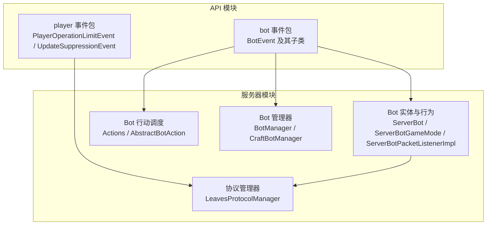
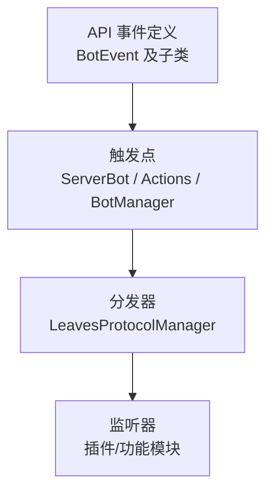
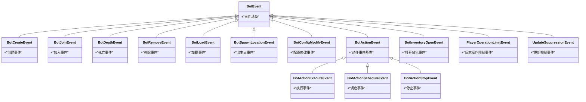
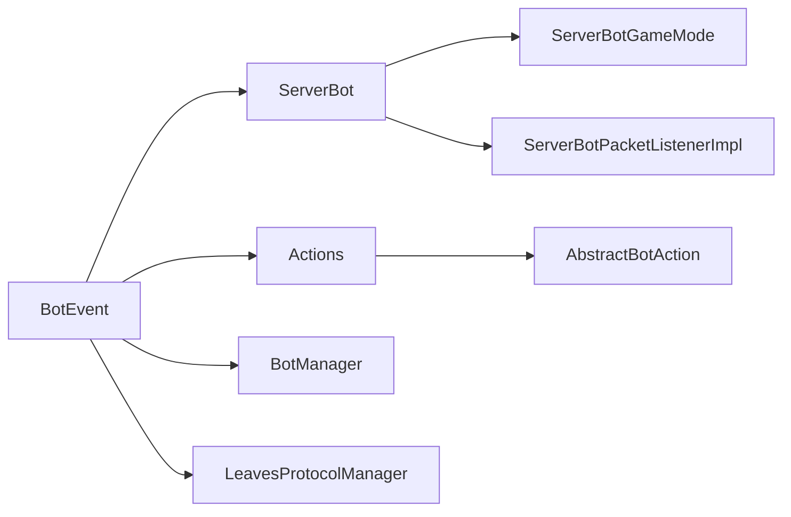

# 事件系统

<cite>
**本文引用的文件**
- [BotEvent.java](file://lophine-api/src/main/java/org/leavesmc/leaves/event/bot/BotEvent.java)
- [BotCreateEvent.java](file://lophine-api/src/main/java/org/leavesmc/leaves/event/bot/BotCreateEvent.java)
- [BotJoinEvent.java](file://lophine-api/src/main/java/org/leavesmc/leaves/event/bot/BotJoinEvent.java)
- [BotDeathEvent.java](file://lophine-api/src/main/java/org/leavesmc/leaves/event/bot/BotDeathEvent.java)
- [BotRemoveEvent.java](file://lophine-api/src/main/java/org/leavesmc/leaves/event/bot/BotRemoveEvent.java)
- [BotLoadEvent.java](file://lophine-api/src/main/java/org/leavesmc/leaves/event/bot/BotLoadEvent.java)
- [BotSpawnLocationEvent.java](file://lophine-api/src/main/java/org/leavesmc/leaves/event/bot/BotSpawnLocationEvent.java)
- [BotConfigModifyEvent.java](file://lophine-api/src/main/java/org/leavesmc/leaves/event/bot/BotConfigModifyEvent.java)
- [BotActionEvent.java](file://lophine-api/src/main/java/org/leavesmc/leaves/event/bot/BotActionEvent.java)
- [BotActionExecuteEvent.java](file://lophine-api/src/main/java/org/leavesmc/leaves/event/bot/BotActionExecuteEvent.java)
- [BotActionScheduleEvent.java](file://lophine-api/src/main/java/org/leavesmc/leaves/event/bot/BotActionScheduleEvent.java)
- [BotActionStopEvent.java](file://lophine-api/src/main/java/org/leavesmc/leaves/event/bot/BotActionStopEvent.java)
- [BotInventoryOpenEvent.java](file://lophine-api/src/main/java/org/leavesmc/leaves/event/bot/BotInventoryOpenEvent.java)
- [PlayerOperationLimitEvent.java](file://lophine-api/src/main/java/org/leavesmc/leaves/event/player/PlayerOperationLimitEvent.java)
- [UpdateSuppressionEvent.java](file://lophine-api/src/main/java/org/leavesmc/leaves/event/player/UpdateSuppressionEvent.java)
- [LeavesProtocolManager.java](file://lophine-server/src/main/java/org/leavesmc/leaves/protocol/core/LeavesProtocolManager.java)
- [BotManager.java](file://lophine-api/src/main/java/org/leavesmc/leaves/entity/bot/BotManager.java)
- [CraftBotManager.java](file://lophine-api/src/main/java/org/leavesmc/leaves/entity/bot/CraftBotManager.java)
- [ServerBot.java](file://lophine-server/src/main/java/org/leavesmc/leaves/bot/ServerBot.java)
- [ServerBotGameMode.java](file://lophine-server/src/main/java/org/leavesmc/leaves/bot/ServerBotGameMode.java)
- [ServerBotPacketListenerImpl.java](file://lophine-server/src/main/java/org/leavesmc/leaves/bot/ServerBotPacketListenerImpl.java)
- [Actions.java](file://lophine-server/src/main/java/org/leavesmc/leaves/bot/agent/Actions.java)
- [AbstractBotAction.java](file://lophine-server/src/main/java/org/leavesmc/leaves/bot/agent/actions/AbstractBotAction.java)
- [BotUtil.java](file://lophine-server/src/main/java/org/leavesmc/leaves/bot/BotUtil.java)
- [LeavesConfig.java](file://lophine-server/src/main/java/org/leavesmc/leaves/LeavesConfig.java)
- [README.md](file://README.md)
</cite>

## 目录
1. [简介](#简介)
2. [项目结构](#项目结构)
3. [核心组件](#核心组件)
4. [架构总览](#架构总览)
5. [详细组件分析](#详细组件分析)
6. [依赖关系分析](#依赖关系分析)
7. [性能考量](#性能考量)
8. [故障排查指南](#故障排查指南)
9. [结论](#结论)
10. [附录](#附录)

## 简介
本文件面向Lophine事件系统，系统性阐述事件基类与继承体系、事件类型与触发时机、参数传递与处理流程、同步/异步事件差异、监听器注册与注销、事件优先级与取消机制，并提供可操作的最佳实践与常见陷阱规避建议。文档以仓库中实际存在的事件定义与相关服务实现为依据，确保内容可追溯、可验证。

## 项目结构
Lophine事件系统主要位于API模块的bot与player包内，同时在服务器端存在事件驱动的协议管理器与Bot实体管理器等配套组件。下图给出与事件系统直接相关的模块关系概览：

图表来源
- [BotEvent.java](file://lophine-api/src/main/java/org/leavesmc/leaves/event/bot/BotEvent.java)
- [LeavesProtocolManager.java](file://lophine-server/src/main/java/org/leavesmc/leaves/protocol/core/LeavesProtocolManager.java)
- [BotManager.java](file://lophine-api/src/main/java/org/leavesmc/leaves/entity/bot/BotManager.java)
- [CraftBotManager.java](file://lophine-api/src/main/java/org/leavesmc/leaves/entity/bot/CraftBotManager.java)
- [ServerBot.java](file://lophine-server/src/main/java/org/leavesmc/leaves/bot/ServerBot.java)
- [Actions.java](file://lophine-server/src/main/java/org/leavesmc/leaves/bot/agent/Actions.java)

章节来源
- [README.md](file://README.md)

## 核心组件
- 事件基类：BotEvent
  - 设计定位：作为所有Bot相关事件的抽象基类，统一事件生命周期与上下文接口（如获取事件源、是否被取消等）。
  - 继承体系：BotCreateEvent、BotJoinEvent、BotDeathEvent、BotRemoveEvent、BotLoadEvent、BotSpawnLocationEvent、BotConfigModifyEvent、BotActionEvent及其派生事件（执行、调度、停止、库存打开等）。
- 玩家事件：PlayerOperationLimitEvent、UpdateSuppressionEvent
  - 作用：对玩家操作限制与更新抑制状态进行事件化表达，便于插件或功能模块感知与干预。
- 协议管理器：LeavesProtocolManager
  - 职责：集中注册与分发协议层回调（如玩家加入、重载、字节流处理、定时器），为事件系统提供底层通道与调度能力。
- Bot实体与管理：ServerBot、BotManager、CraftBotManager
  - 职责：承载Bot实体状态、行为调度与生命周期管理，是Bot事件的实际触发者。

章节来源
- [BotEvent.java](file://lophine-api/src/main/java/org/leavesmc/leaves/event/bot/BotEvent.java)
- [BotCreateEvent.java](file://lophine-api/src/main/java/org/leavesmc/leaves/event/bot/BotCreateEvent.java)
- [BotJoinEvent.java](file://lophine-api/src/main/java/org/leavesmc/leaves/event/bot/BotJoinEvent.java)
- [BotDeathEvent.java](file://lophine-api/src/main/java/org/leavesmc/leaves/event/bot/BotDeathEvent.java)
- [BotRemoveEvent.java](file://lophine-api/src/main/java/org/leavesmc/leaves/event/bot/BotRemoveEvent.java)
- [BotLoadEvent.java](file://lophine-api/src/main/java/org/leavesmc/leaves/event/bot/BotLoadEvent.java)
- [BotSpawnLocationEvent.java](file://lophine-api/src/main/java/org/leavesmc/leaves/event/bot/BotSpawnLocationEvent.java)
- [BotConfigModifyEvent.java](file://lophine-api/src/main/java/org/leavesmc/leaves/event/bot/BotConfigModifyEvent.java)
- [BotActionEvent.java](file://lophine-api/src/main/java/org/leavesmc/leaves/event/bot/BotActionEvent.java)
- [BotActionExecuteEvent.java](file://lophine-api/src/main/java/org/leavesmc/leaves/event/bot/BotActionExecuteEvent.java)
- [BotActionScheduleEvent.java](file://lophine-api/src/main/java/org/leavesmc/leaves/event/bot/BotActionScheduleEvent.java)
- [BotActionStopEvent.java](file://lophine-api/src/main/java/org/leavesmc/leaves/event/bot/BotActionStopEvent.java)
- [BotInventoryOpenEvent.java](file://lophine-api/src/main/java/org/leavesmc/leaves/event/bot/BotInventoryOpenEvent.java)
- [PlayerOperationLimitEvent.java](file://lophine-api/src/main/java/org/leavesmc/leaves/event/player/PlayerOperationLimitEvent.java)
- [UpdateSuppressionEvent.java](file://lophine-api/src/main/java/org/leavesmc/leaves/event/player/UpdateSuppressionEvent.java)
- [LeavesProtocolManager.java](file://lophine-server/src/main/java/org/leavesmc/leaves/protocol/core/LeavesProtocolManager.java)
- [BotManager.java](file://lophine-api/src/main/java/org/leavesmc/leaves/entity/bot/BotManager.java)
- [CraftBotManager.java](file://lophine-api/src/main/java/org/leavesmc/leaves/entity/bot/CraftBotManager.java)
- [ServerBot.java](file://lophine-server/src/main/java/org/leavesmc/leaves/bot/ServerBot.java)

## 架构总览
事件系统采用“事件定义（API）+ 触发点（服务器/实体）+ 分发器（协议管理器）”的三层架构：
- 定义层：在API模块中声明Bot与Player事件类型，统一事件契约。
- 触发层：在服务器端实体与行为逻辑中，于关键节点构造并发布事件。
- 分发层：通过LeavesProtocolManager等管理器集中注册回调，按需分发到监听器。

图表来源
- [BotEvent.java](file://lophine-api/src/main/java/org/leavesmc/leaves/event/bot/BotEvent.java)
- [LeavesProtocolManager.java](file://lophine-server/src/main/java/org/leavesmc/leaves/protocol/core/LeavesProtocolManager.java)
- [ServerBot.java](file://lophine-server/src/main/java/org/leavesmc/leaves/bot/ServerBot.java)
- [Actions.java](file://lophine-server/src/main/java/org/leavesmc/leaves/bot/agent/Actions.java)

## 详细组件分析

### 事件基类与继承体系
BotEvent作为所有Bot事件的基类，统一了事件的基本属性与行为。其子类覆盖Bot生命周期、配置变更、动作执行与交互等场景。

图表来源
- [BotEvent.java](file://lophine-api/src/main/java/org/leavesmc/leaves/event/bot/BotEvent.java)
- [BotCreateEvent.java](file://lophine-api/src/main/java/org/leavesmc/leaves/event/bot/BotCreateEvent.java)
- [BotJoinEvent.java](file://lophine-api/src/main/java/org/leavesmc/leaves/event/bot/BotJoinEvent.java)
- [BotDeathEvent.java](file://lophine-api/src/main/java/org/leavesmc/leaves/event/bot/BotDeathEvent.java)
- [BotRemoveEvent.java](file://lophine-api/src/main/java/org/leavesmc/leaves/event/bot/BotRemoveEvent.java)
- [BotLoadEvent.java](file://lophine-api/src/main/java/org/leavesmc/leaves/event/bot/BotLoadEvent.java)
- [BotSpawnLocationEvent.java](file://lophine-api/src/main/java/org/leavesmc/leaves/event/bot/BotSpawnLocationEvent.java)
- [BotConfigModifyEvent.java](file://lophine-api/src/main/java/org/leavesmc/leaves/event/bot/BotConfigModifyEvent.java)
- [BotActionEvent.java](file://lophine-api/src/main/java/org/leavesmc/leaves/event/bot/BotActionEvent.java)
- [BotActionExecuteEvent.java](file://lophine-api/src/main/java/org/leavesmc/leaves/event/bot/BotActionExecuteEvent.java)
- [BotActionScheduleEvent.java](file://lophine-api/src/main/java/org/leavesmc/leaves/event/bot/BotActionScheduleEvent.java)
- [BotActionStopEvent.java](file://lophine-api/src/main/java/org/leavesmc/leaves/event/bot/BotActionStopEvent.java)
- [BotInventoryOpenEvent.java](file://lophine-api/src/main/java/org/leavesmc/leaves/event/bot/BotInventoryOpenEvent.java)
- [PlayerOperationLimitEvent.java](file://lophine-api/src/main/java/org/leavesmc/leaves/event/player/PlayerOperationLimitEvent.java)
- [UpdateSuppressionEvent.java](file://lophine-api/src/main/java/org/leavesmc/leaves/event/player/UpdateSuppressionEvent.java)

章节来源
- [BotEvent.java](file://lophine-api/src/main/java/org/leavesmc/leaves/event/bot/BotEvent.java)

### 各事件类型与触发时机
- 生命周期事件
  - 创建：Bot实体初始化完成时触发，用于插件进行初始化扩展。
  - 加载：从存档恢复或加载数据时触发，用于恢复上下文。
  - 加入：Bot进入世界或连接生效时触发，用于广播与资源分配。
  - 死亡：Bot生命值归零或被移除时触发，用于清理与统计。
  - 移除：显式从系统中移除Bot时触发，用于资源回收。
- 配置与位置
  - 配置修改：Bot配置项变更时触发，用于同步外部系统。
  - 出生点：Bot出生位置确定时触发，用于记录与追踪。
- 动作相关
  - 动作事件基类：统一动作事件的上下文。
  - 执行：具体动作开始执行时触发，用于前置校验与日志。
  - 调度：动作被安排到调度队列时触发，用于限流与优先级控制。
  - 停止：动作被中断或取消时触发，用于状态回滚。
  - 库存打开：Bot打开容器/背包时触发，用于权限与审计。
- 玩家相关
  - 操作限制：玩家操作频率或范围受限时触发，用于风控与提示。
  - 更新抑制：区块/实体更新被抑制时触发，用于兼容与降噪。

章节来源
- [BotCreateEvent.java](file://lophine-api/src/main/java/org/leavesmc/leaves/event/bot/BotCreateEvent.java)
- [BotLoadEvent.java](file://lophine-api/src/main/java/org/leavesmc/leaves/event/bot/BotLoadEvent.java)
- [BotJoinEvent.java](file://lophine-api/src/main/java/org/leavesmc/leaves/event/bot/BotJoinEvent.java)
- [BotDeathEvent.java](file://lophine-api/src/main/java/org/leavesmc/leaves/event/bot/BotDeathEvent.java)
- [BotRemoveEvent.java](file://lophine-api/src/main/java/org/leavesmc/leaves/event/bot/BotRemoveEvent.java)
- [BotConfigModifyEvent.java](file://lophine-api/src/main/java/org/leavesmc/leaves/event/bot/BotConfigModifyEvent.java)
- [BotSpawnLocationEvent.java](file://lophine-api/src/main/java/org/leavesmc/leaves/event/bot/BotSpawnLocationEvent.java)
- [BotActionEvent.java](file://lophine-api/src/main/java/org/leavesmc/leaves/event/bot/BotActionEvent.java)
- [BotActionExecuteEvent.java](file://lophine-api/src/main/java/org/leavesmc/leaves/event/bot/BotActionExecuteEvent.java)
- [BotActionScheduleEvent.java](file://lophine-api/src/main/java/org/leavesmc/leaves/event/bot/BotActionScheduleEvent.java)
- [BotActionStopEvent.java](file://lophine-api/src/main/java/org/leavesmc/leaves/event/bot/BotActionStopEvent.java)
- [BotInventoryOpenEvent.java](file://lophine-api/src/main/java/org/leavesmc/leaves/event/bot/BotInventoryOpenEvent.java)
- [PlayerOperationLimitEvent.java](file://lophine-api/src/main/java/org/leavesmc/leaves/event/player/PlayerOperationLimitEvent.java)
- [UpdateSuppressionEvent.java](file://lophine-api/src/main/java/org/leavesmc/leaves/event/player/UpdateSuppressionEvent.java)

### 参数传递与处理流程
- 参数传递
  - 事件对象封装当前上下文（如Bot实例、玩家、坐标、配置键值等），监听器通过访问器获取所需信息。
  - 动作事件携带动作类型、目标、参数集合；生命周期事件携带实体标识与时间戳。
- 处理流程
  - 触发：在服务器端实体逻辑的关键节点构造事件对象并提交。
  - 分发：由协议管理器或事件总线按监听器注册顺序分发。
  - 响应：监听器根据业务需求决定是否消费、修改或取消事件。

章节来源
- [LeavesProtocolManager.java](file://lophine-server/src/main/java/org/leavesmc/leaves/protocol/core/LeavesProtocolManager.java)
- [ServerBot.java](file://lophine-server/src/main/java/org/leavesmc/leaves/bot/ServerBot.java)
- [Actions.java](file://lophine-server/src/main/java/org/leavesmc/leaves/bot/agent/Actions.java)

### 同步与异步事件
- 同步事件
  - 在关键路径上阻塞等待监听器处理结果，适用于需要强一致性的场景（如权限校验、状态校验）。
- 异步事件
  - 不阻塞主线程，适合耗时任务（如日志上报、远端通知），但需注意线程安全与幂等性。
- 使用建议
  - 对状态变更与安全性敏感的事件优先使用同步，确保前置条件满足后再继续。
  - 对非关键路径与IO密集型任务使用异步，提升吞吐。

章节来源
- [LeavesProtocolManager.java](file://lophine-server/src/main/java/org/leavesmc/leaves/protocol/core/LeavesProtocolManager.java)

### 监听器注册与注销
- 注册
  - 通过协议管理器或事件总线提供的注册方法，将监听器绑定到指定事件类型与优先级。
  - 通常支持按插件域隔离注册，避免跨插件冲突。
- 注销
  - 插件卸载或功能关闭时，主动注销对应监听器，释放资源并防止内存泄漏。
- 最佳实践
  - 明确监听器生命周期，与插件生命周期绑定。
  - 对高并发场景下的注册/注销操作加锁或使用原子操作。

章节来源
- [LeavesProtocolManager.java](file://lophine-server/src/main/java/org/leavesmc/leaves/protocol/core/LeavesProtocolManager.java)

### 事件优先级与取消机制
- 优先级
  - 监听器可设置优先级，系统按优先级顺序调用，高优先监听器可影响后续监听器的行为。
- 取消
  - 事件对象提供取消标记，监听器可在必要时取消事件，阻止默认行为继续执行。
- 注意事项
  - 取消应谨慎使用，仅在明确业务语义下生效，避免破坏系统一致性。
  - 优先级与取消组合使用时，需保证监听器内部逻辑幂等与可回滚。

章节来源
- [BotEvent.java](file://lophine-api/src/main/java/org/leavesmc/leaves/event/bot/BotEvent.java)

### 事件处理示例（步骤化）
以下为通用示例步骤，不包含具体代码片段，请按路径定位实现细节：
- 监听Bot创建事件
  - 步骤1：在插件中注册BotCreateEvent监听器。
  - 步骤2：在回调中读取事件中的Bot实例与创建参数。
  - 步骤3：执行初始化逻辑（如注入自定义数据、注册额外处理器）。
  - 步骤4：根据需要返回或取消事件以影响后续流程。
  - 参考路径：[BotCreateEvent.java](file://lophine-api/src/main/java/org/leavesmc/leaves/event/bot/BotCreateEvent.java)，[LeavesProtocolManager.java](file://lophine-server/src/main/java/org/leavesmc/leaves/protocol/core/LeavesProtocolManager.java)
- 监听Bot动作执行事件
  - 步骤1：注册BotActionExecuteEvent监听器。
  - 步骤2：在回调中判断动作类型与目标，决定放行或拦截。
  - 步骤3：必要时修改动作参数或记录审计日志。
  - 参考路径：[BotActionExecuteEvent.java](file://lophine-api/src/main/java/org/leavesmc/leaves/event/bot/BotActionExecuteEvent.java)，[AbstractBotAction.java](file://lophine-server/src/main/java/org/leavesmc/leaves/bot/agent/actions/AbstractBotAction.java)
- 监听玩家操作限制事件
  - 步骤1：注册PlayerOperationLimitEvent监听器。
  - 步骤2：根据限制类型与阈值决定提示或阻断。
  - 步骤3：记录日志并可选择取消事件以放宽限制。
  - 参考路径：[PlayerOperationLimitEvent.java](file://lophine-api/src/main/java/org/leavesmc/leaves/event/player/PlayerOperationLimitEvent.java)

章节来源
- [BotCreateEvent.java](file://lophine-api/src/main/java/org/leavesmc/leaves/event/bot/BotCreateEvent.java)
- [BotActionExecuteEvent.java](file://lophine-api/src/main/java/org/leavesmc/leaves/event/bot/BotActionExecuteEvent.java)
- [PlayerOperationLimitEvent.java](file://lophine-api/src/main/java/org/leavesmc/leaves/event/player/PlayerOperationLimitEvent.java)
- [AbstractBotAction.java](file://lophine-server/src/main/java/org/leavesmc/leaves/bot/agent/actions/AbstractBotAction.java)
- [LeavesProtocolManager.java](file://lophine-server/src/main/java/org/leavesmc/leaves/protocol/core/LeavesProtocolManager.java)

## 依赖关系分析
事件系统与服务器端Bot实体、行动调度与协议管理器紧密耦合，形成如下依赖链：

图表来源
- [BotEvent.java](file://lophine-api/src/main/java/org/leavesmc/leaves/event/bot/BotEvent.java)
- [ServerBot.java](file://lophine-server/src/main/java/org/leavesmc/leaves/bot/ServerBot.java)
- [Actions.java](file://lophine-server/src/main/java/org/leavesmc/leaves/bot/agent/Actions.java)
- [AbstractBotAction.java](file://lophine-server/src/main/java/org/leavesmc/leaves/bot/agent/actions/AbstractBotAction.java)
- [ServerBotGameMode.java](file://lophine-server/src/main/java/org/leavesmc/leaves/bot/ServerBotGameMode.java)
- [ServerBotPacketListenerImpl.java](file://lophine-server/src/main/java/org/leavesmc/leaves/bot/ServerBotPacketListenerImpl.java)
- [LeavesProtocolManager.java](file://lophine-server/src/main/java/org/leavesmc/leaves/protocol/core/LeavesProtocolManager.java)

章节来源
- [LeavesProtocolManager.java](file://lophine-server/src/main/java/org/leavesmc/leaves/protocol/core/LeavesProtocolManager.java)
- [ServerBot.java](file://lophine-server/src/main/java/org/leavesmc/leaves/bot/ServerBot.java)
- [Actions.java](file://lophine-server/src/main/java/org/leavesmc/leaves/bot/agent/Actions.java)

## 性能考量
- 事件风暴防护
  - 对高频事件（如动作调度/执行）设置速率限制与批量处理，避免监听器过载。
- 异步化策略
  - 将耗时处理迁移到异步监听器，保留同步监听器处理关键路径。
- 优先级与短路
  - 高优先级监听器快速判定并短路后续处理，减少无效计算。
- 内存与GC
  - 避免在事件对象中持有大对象引用，及时释放临时资源。

## 故障排查指南
- 事件未触发
  - 检查触发点是否正确构造并提交事件；确认监听器已注册且未被注销。
  - 参考路径：[ServerBot.java](file://lophine-server/src/main/java/org/leavesmc/leaves/bot/ServerBot.java)，[LeavesProtocolManager.java](file://lophine-server/src/main/java/org/leavesmc/leaves/protocol/core/LeavesProtocolManager.java)
- 监听器无响应
  - 确认事件类型匹配、优先级设置合理、监听器生命周期有效。
  - 参考路径：[LeavesProtocolManager.java](file://lophine-server/src/main/java/org/leavesmc/leaves/protocol/core/LeavesProtocolManager.java)
- 事件被意外取消
  - 检查监听器取消逻辑，确保仅在明确业务语义下取消事件。
  - 参考路径：[BotEvent.java](file://lophine-api/src/main/java/org/leavesmc/leaves/event/bot/BotEvent.java)
- 性能问题
  - 审视监听器数量与复杂度，拆分热点事件，引入异步处理。
  - 参考路径：[Actions.java](file://lophine-server/src/main/java/org/leavesmc/leaves/bot/agent/Actions.java)

章节来源
- [ServerBot.java](file://lophine-server/src/main/java/org/leavesmc/leaves/bot/ServerBot.java)
- [LeavesProtocolManager.java](file://lophine-server/src/main/java/org/leavesmc/leaves/protocol/core/LeavesProtocolManager.java)
- [BotEvent.java](file://lophine-api/src/main/java/org/leavesmc/leaves/event/bot/BotEvent.java)
- [Actions.java](file://lophine-server/src/main/java/org/leavesmc/leaves/bot/agent/Actions.java)

## 结论
Lophine事件系统以BotEvent为核心，覆盖Bot全生命周期与动作执行等关键场景，并通过LeavesProtocolManager实现统一分发。结合同步/异步策略、优先级与取消机制，能够灵活支撑插件生态与功能扩展。遵循本文最佳实践与排错建议，可显著提升事件系统的稳定性与可维护性。

## 附录
- 配置参考
  - 服务器配置项可能影响事件行为（如更新抑制、操作限制等），请结合实际配置文件进行验证。
  - 参考路径：[LeavesConfig.java](file://lophine-server/src/main/java/org/leavesmc/leaves/LeavesConfig.java)