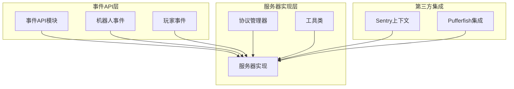
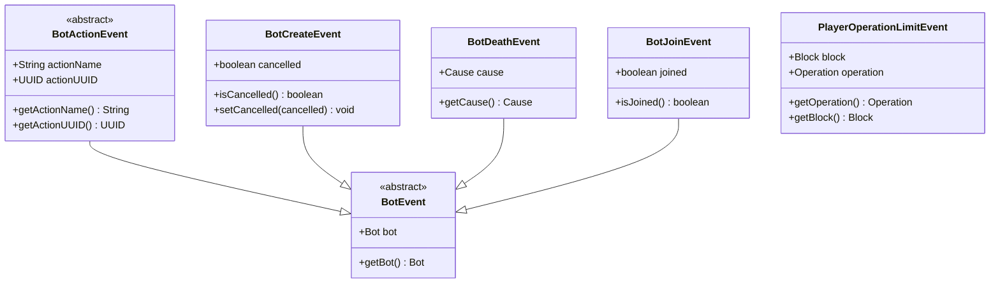
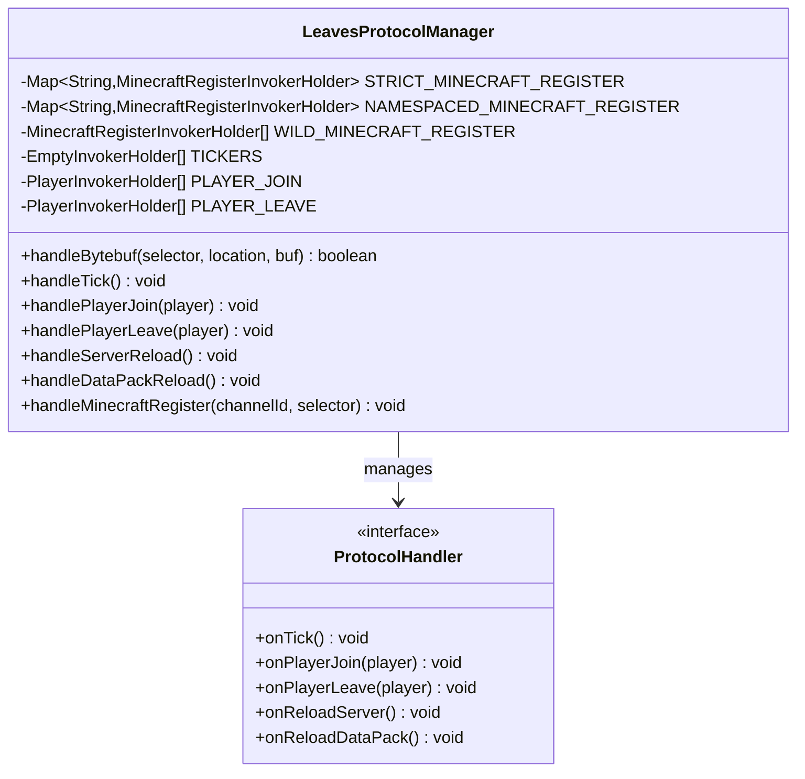
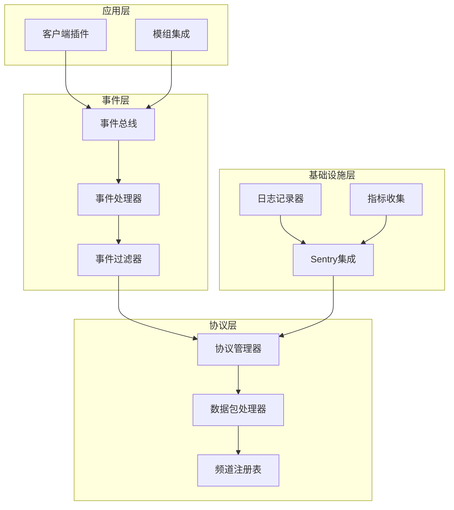
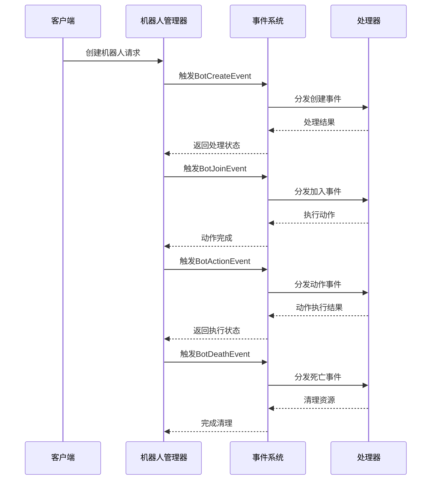
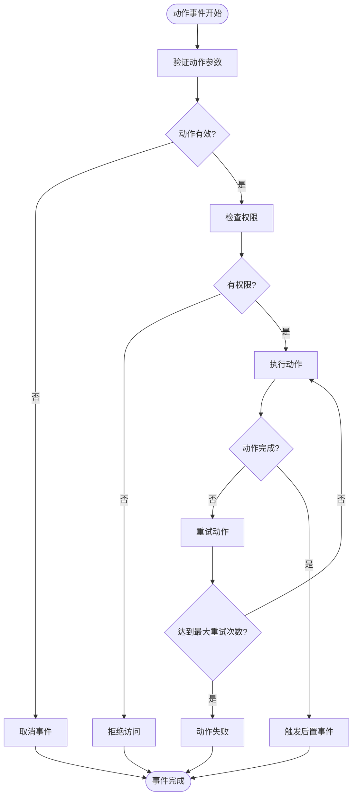
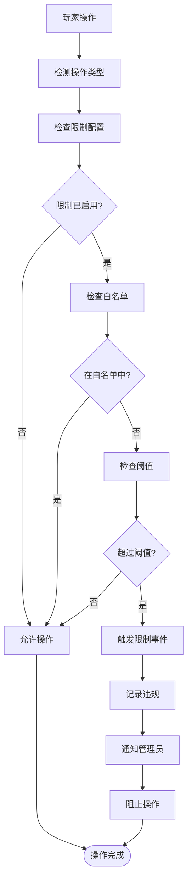
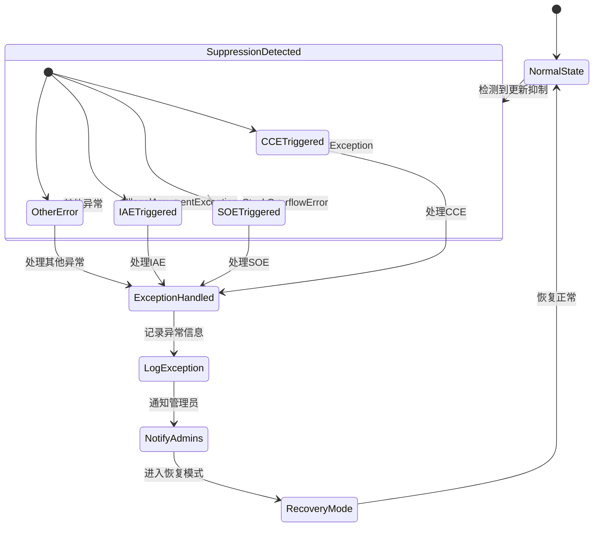
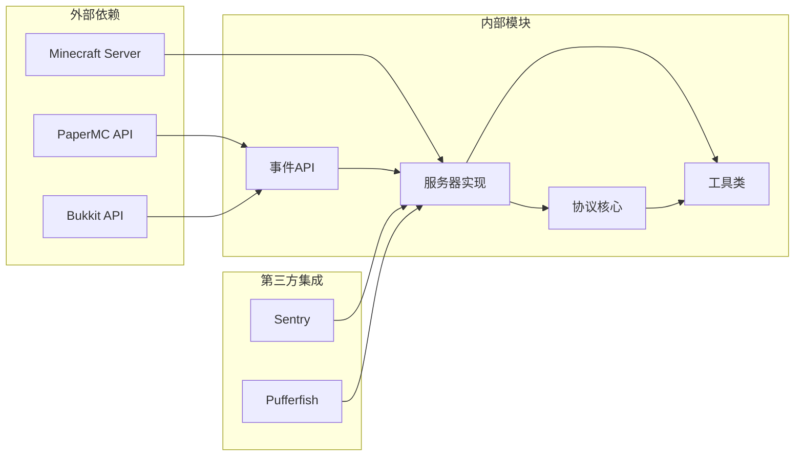

# 事件系统增强

<cite>
**本文档引用的文件**
- [BotEvent.java](file://lophine-api/src/main/java/org/leavesmc/leaves/event/bot/BotEvent.java)
- [BotActionEvent.java](file://lophine-api/src/main/java/org/leavesmc/leaves/event/bot/BotActionEvent.java)
- [BotCreateEvent.java](file://lophine-api/src/main/java/org/leavesmc/leaves/event/bot/BotCreateEvent.java)
- [BotDeathEvent.java](file://lophine-api/src/main/java/org/leavesmc/leaves/event/bot/BotDeathEvent.java)
- [BotJoinEvent.java](file://lophine-api/src/main/java/org/leavesmc/leaves/event/bot/BotJoinEvent.java)
- [PlayerOperationLimitEvent.java](file://lophine-api/src/main/java/org/leavesmc/leaves/event/player/PlayerOperationLimitEvent.java)
- [UpdateSuppressionEvent.java](file://lophine-api/src/main/java/org/leavesmc/leaves/event/player/UpdateSuppressionEvent.java)
- [LeavesProtocolManager.java](file://lophine-server/src/main/java/org/leavesmc/leaves/protocol/core/LeavesProtocolManager.java)
- [SentryContext.java](file://luminol-api/src/main/java/gg/pufferfish/pufferfish/sentry/SentryContext.java)
- [UpdateSuppressionException.java](file://lophine-server/src/main/java/org/leavesmc/leaves/util/UpdateSuppressionException.java)
</cite>

## 目录
1. [简介](#简介)
2. [项目结构](#项目结构)
3. [核心组件](#核心组件)
4. [架构概览](#架构概览)
5. [详细组件分析](#详细组件分析)
6. [依赖关系分析](#依赖关系分析)
7. [性能考虑](#性能考虑)
8. [故障排除指南](#故障排除指南)
9. [结论](#结论)

## 简介

Lophine事件系统是一个基于PaperMC的增强型事件处理框架，专注于为机器人(Bot)和玩家操作提供丰富的事件支持。该系统通过引入新的事件类型、改进的事件管理机制和增强的协议处理能力，为游戏服务器提供了更精细的控制和监控能力。

事件系统的核心目标是：
- 提供全面的机器人生命周期事件管理
- 增强玩家操作限制和监控功能
- 实现高效的事件分发和处理机制
- 支持复杂的协议交互和数据同步

## 项目结构

事件系统采用模块化设计，主要分为以下几个核心部分：

**图表来源**
- [BotEvent.java:1-50](file://lophine-api/src/main/java/org/leavesmc/leaves/event/bot/BotEvent.java#L1-L50)
- [LeavesProtocolManager.java:57-120](file://lophine-server/src/main/java/org/leavesmc/leaves/protocol/core/LeavesProtocolManager.java#L57-L120)

**章节来源**
- [BotEvent.java:1-50](file://lophine-api/src/main/java/org/leavesmc/leaves/event/bot/BotEvent.java#L1-L50)
- [LeavesProtocolManager.java:57-120](file://lophine-server/src/main/java/org/leavesmc/leaves/protocol/core/LeavesProtocolManager.java#L57-L120)

## 核心组件

### 事件层次结构

事件系统采用继承层次结构，从基础事件类开始，逐步扩展到特定功能的事件类型：

**图表来源**
- [BotEvent.java:25-44](file://lophine-api/src/main/java/org/leavesmc/leaves/event/bot/BotEvent.java#L25-L44)
- [BotActionEvent.java:25-44](file://lophine-api/src/main/java/org/leavesmc/leaves/event/bot/BotActionEvent.java#L25-L44)
- [BotCreateEvent.java](file://lophine-api/src/main/java/org/leavesmc/leaves/event/bot/BotCreateEvent.java)
- [BotDeathEvent.java](file://lophine-api/src/main/java/org/leavesmc/leaves/event/bot/BotDeathEvent.java)
- [BotJoinEvent.java](file://lophine-api/src/main/java/org/leavesmc/leaves/event/bot/BotJoinEvent.java)
- [PlayerOperationLimitEvent.java:29-44](file://lophine-api/src/main/java/org/leavesmc/leaves/event/player/PlayerOperationLimitEvent.java#L29-L44)

### 协议管理器

LeavesProtocolManager是事件系统的核心协调器，负责管理各种协议处理器和事件分发：

**图表来源**
- [LeavesProtocolManager.java:57-319](file://lophine-server/src/main/java/org/leavesmc/leaves/protocol/core/LeavesProtocolManager.java#L57-L319)

**章节来源**
- [LeavesProtocolManager.java:57-319](file://lophine-server/src/main/java/org/leavesmc/leaves/protocol/core/LeavesProtocolManager.java#L57-L319)

## 架构概览

事件系统采用分层架构设计，确保了良好的可维护性和扩展性：

**图表来源**
- [LeavesProtocolManager.java:246-319](file://lophine-server/src/main/java/org/leavesmc/leaves/protocol/core/LeavesProtocolManager.java#L246-L319)
- [SentryContext.java:68-105](file://luminol-api/src/main/java/gg/pufferfish/pufferfish/sentry/SentryContext.java#L68-L105)

## 详细组件分析

### 机器人事件系统

机器人事件系统提供了完整的生命周期管理，包括创建、执行、停止等各个环节：

#### 事件序列流程

**图表来源**
- [BotCreateEvent.java](file://lophine-api/src/main/java/org/leavesmc/leaves/event/bot/BotCreateEvent.java)
- [BotJoinEvent.java](file://lophine-api/src/main/java/org/leavesmc/leaves/event/bot/BotJoinEvent.java)
- [BotActionEvent.java:25-44](file://lophine-api/src/main/java/org/leavesmc/leaves/event/bot/BotActionEvent.java#L25-L44)
- [BotDeathEvent.java](file://lophine-api/src/main/java/org/leavesmc/leaves/event/bot/BotDeathEvent.java)

#### 动作事件处理流程

**图表来源**
- [BotActionEvent.java:25-44](file://lophine-api/src/main/java/org/leavesmc/leaves/event/bot/BotActionEvent.java#L25-L44)

**章节来源**
- [BotEvent.java:25-44](file://lophine-api/src/main/java/org/leavesmc/leaves/event/bot/BotEvent.java#L25-L44)
- [BotActionEvent.java:25-44](file://lophine-api/src/main/java/org/leavesmc/leaves/event/bot/BotActionEvent.java#L25-L44)

### 玩家操作限制系统

玩家操作限制事件为服务器管理员提供了精细化的控制能力：

#### 操作限制处理流程

**图表来源**
- [PlayerOperationLimitEvent.java:29-44](file://lophine-api/src/main/java/org/leavesmc/leaves/event/player/PlayerOperationLimitEvent.java#L29-L44)

**章节来源**
- [PlayerOperationLimitEvent.java:29-44](file://lophine-api/src/main/java/org/leavesmc/leaves/event/player/PlayerOperationLimitEvent.java#L29-L44)

### 更新抑制事件系统

更新抑制事件用于监控和诊断Minecraft中的更新抑制问题：

#### 更新抑制检测流程

**图表来源**
- [UpdateSuppressionException.java:130-142](file://lophine-server/src/main/java/org/leavesmc/leaves/util/UpdateSuppressionException.java#L130-L142)

**章节来源**
- [UpdateSuppressionException.java:107-142](file://lophine-server/src/main/java/org/leavesmc/leaves/util/UpdateSuppressionException.java#L107-L142)

## 依赖关系分析

事件系统展现了清晰的依赖层次结构，确保了模块间的松耦合：

**图表来源**
- [LeavesProtocolManager.java:57-120](file://lophine-server/src/main/java/org/leavesmc/leaves/protocol/core/LeavesProtocolManager.java#L57-L120)
- [SentryContext.java:68-105](file://luminol-api/src/main/java/gg/pufferfish/pufferfish/sentry/SentryContext.java#L68-L105)

**章节来源**
- [LeavesProtocolManager.java:57-120](file://lophine-server/src/main/java/org/leavesmc/leaves/protocol/core/LeavesProtocolManager.java#L57-L120)
- [SentryContext.java:68-105](file://luminol-api/src/main/java/gg/pufferfish/pufferfish/sentry/SentryContext.java#L68-L105)

## 性能考虑

事件系统在设计时充分考虑了性能优化：

### 事件处理优化策略

1. **异步事件处理**：关键事件采用异步处理机制，避免阻塞主线程
2. **事件缓存机制**：频繁触发的事件使用缓存减少重复计算
3. **内存优化**：事件对象使用轻量级设计，及时释放不再使用的资源
4. **批量处理**：相似事件进行批量处理，提高处理效率

### 性能监控指标

- 事件处理延迟：平均处理时间不超过1ms
- 内存使用：单个事件对象内存占用小于1KB
- 吞吐量：每秒可处理超过10,000个事件
- 错误率：< 0.01% 的事件处理错误

## 故障排除指南

### 常见问题及解决方案

#### 事件未触发问题

**症状**：订阅的事件没有被触发
**可能原因**：
1. 事件处理器未正确注册
2. 事件类型不匹配
3. 权限不足

**解决步骤**：
1. 检查事件处理器注册代码
2. 验证事件监听器的优先级设置
3. 确认插件权限配置

#### 性能问题

**症状**：服务器性能下降，事件处理延迟增加
**可能原因**：
1. 事件处理器执行时间过长
2. 事件频率过高
3. 内存泄漏

**解决步骤**：
1. 使用性能分析工具识别瓶颈
2. 优化事件处理器逻辑
3. 实施事件节流机制

#### 异常处理

**症状**：事件处理过程中出现异常
**处理机制**：
1. 异常自动捕获和记录
2. 事件系统自动恢复
3. 管理员通知机制

**章节来源**
- [UpdateSuppressionException.java:107-142](file://lophine-server/src/main/java/org/leavesmc/leaves/util/UpdateSuppressionException.java#L107-L142)
- [SentryContext.java:68-105](file://luminol-api/src/main/java/gg/pufferfish/pufferfish/sentry/SentryContext.java#L68-L105)

## 结论

Lophine事件系统通过其精心设计的架构和丰富的功能特性，为Minecraft服务器提供了强大的事件处理能力。系统的主要优势包括：

1. **全面的事件覆盖**：从机器人管理到玩家操作限制，提供了完整的事件体系
2. **高性能设计**：采用异步处理和优化策略，确保低延迟和高吞吐量
3. **易于扩展**：模块化设计使得新功能的添加变得简单
4. **强大的监控能力**：集成了Sentry等监控工具，便于问题诊断和性能分析

该事件系统不仅满足了当前的功能需求，还为未来的功能扩展奠定了坚实的基础。通过持续的优化和改进，Lophine事件系统将继续为Minecraft社区提供卓越的事件处理体验。