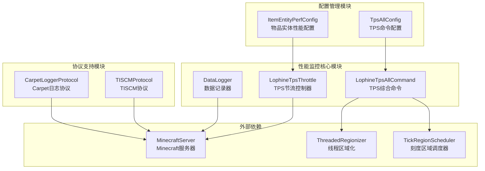
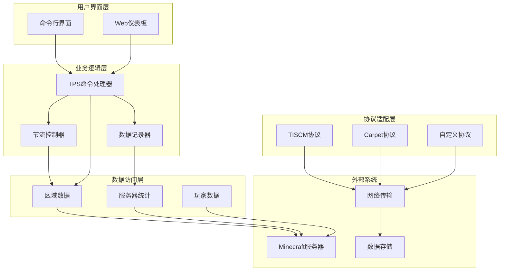
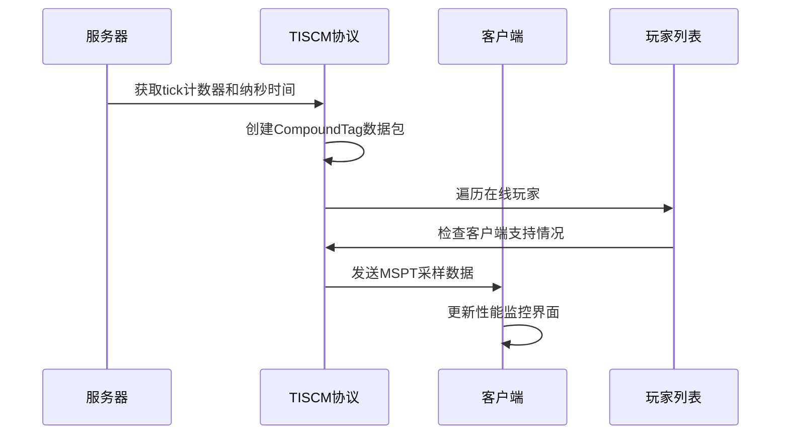
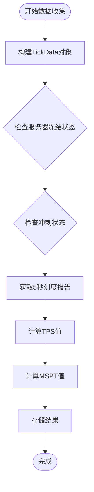
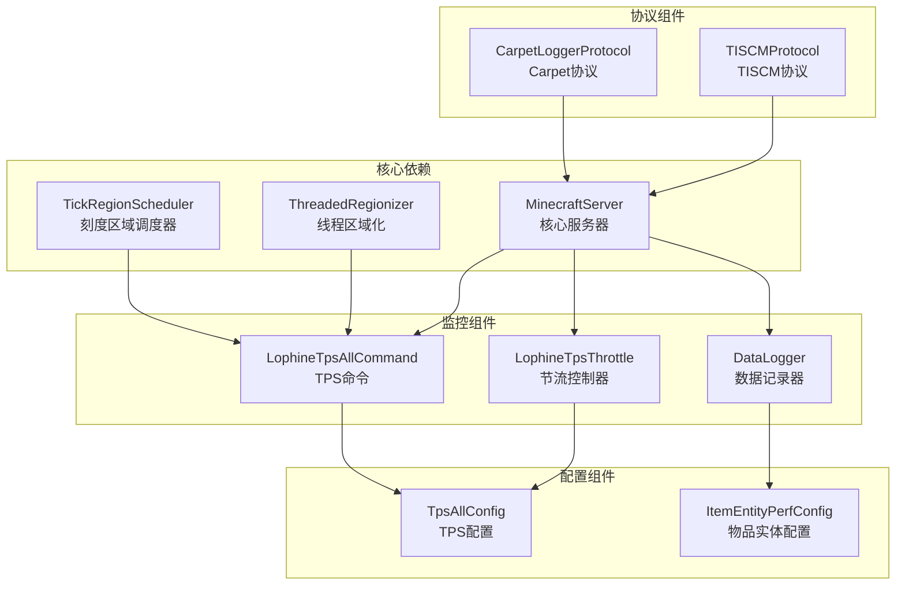

# 性能监控API

<cite>
**本文档引用的文件**
- [LophineTpsThrottle.java](file://lophine-server/src/main/java/fun/bm/lophine/utils/LophineTpsThrottle.java)
- [LophineTpsAllCommand.java](file://lophine-server/src/main/java/fun/bm/lophine/feature/LophineTpsAllCommand.java)
- [TISCMProtocol.java](file://lophine-server/src/main/java/fun/bm/lophine/protocol/tiscm/TISCMProtocol.java)
- [CarpetLoggerProtocol.java](file://lophine-server/src/main/java/fun/bm/lophine/protocol/CarpetLoggerProtocol.java)
- [DataLogger.java](file://lophine-server/src/main/java/org/leavesmc/leaves/protocol/servux/logger/DataLogger.java)
- [TpsAllConfig.java](file://lophine-server/src/main/java/fun/bm/lophine/config/modules/function/TpsAllConfig.java)
- [ItemEntityPerfConfig.java](file://lophine-server/src/main/java/fun/bm/lophine/config/modules/misc/ItemEntityPerfConfig.java)
</cite>

## 目录
1. [简介](#简介)
2. [项目结构](#项目结构)
3. [核心组件](#核心组件)
4. [架构概览](#架构概览)
5. [详细组件分析](#详细组件分析)
6. [依赖关系分析](#依赖关系分析)
7. [性能考虑](#性能考虑)
8. [故障排除指南](#故障排除指南)
9. [结论](#结论)

## 简介

Lophine项目的性能监控API是一套完整的服务器性能监测和优化系统，主要围绕TPS（每秒刻数）监控、MSPT（每刻毫秒数）测量以及智能节流机制构建。该系统为大型Minecraft服务器提供了精细化的性能监控能力，帮助管理员和开发者实时了解服务器运行状态并进行性能优化。

系统的核心功能包括：
- 实时TPS和MSPT监控
- 区域级性能统计
- 智能节流控制
- 多协议兼容的数据传输
- 可配置的性能参数调优

## 项目结构

Lophine性能监控API的代码组织遵循模块化设计原则，主要分布在以下目录结构中：



**图表来源**
- [LophineTpsThrottle.java:1-56](file://lophine-server/src/main/java/fun/bm/lophine/utils/LophineTpsThrottle.java#L1-L56)
- [LophineTpsAllCommand.java:1-101](file://lophine-server/src/main/java/fun/bm/lophine/feature/LophineTpsAllCommand.java#L1-L101)

**章节来源**
- [LophineTpsThrottle.java:1-56](file://lophine-server/src/main/java/fun/bm/lophine/utils/LophineTpsThrottle.java#L1-L56)
- [LophineTpsAllCommand.java:1-101](file://lophine-server/src/main/java/fun/bm/lophine/feature/LophineTpsAllCommand.java#L1-L101)

## 核心组件

### TPS节流控制器

LophineTpsThrottle是整个性能监控系统的核心组件，负责根据当前服务器TPS动态调整各种生电功能的工作强度。

**关键特性：**
- 基于当前TPS计算节流因子
- 支持自定义良好TPS和危险TPS阈值
- 提供线性插值算法确保平滑过渡
- 防止在高延迟情况下进一步恶化性能

**算法实现：**
```mermaid
flowchart TD
Start([开始节流计算]) --> GetTPS[获取当前TPS值]
GetTPS --> CheckGood{TPS >= 良好阈值?}
CheckGood --> |是| Return1[返回1.0 (全速)]
CheckGood --> |否| CheckBad{TPS <= 危险阈值?}
CheckBad --> |是| Return0[返回0.0 (完全停止)]
CheckBad --> |否| Interpolate[线性插值计算]
Interpolate --> ReturnFactor[返回节流因子]
Return1 --> End([结束])
Return0 --> End
ReturnFactor --> End
```

**图表来源**
- [LophineTpsThrottle.java:25-38](file://lophine-server/src/main/java/fun/bm/lophine/utils/LophineTpsThrottle.java#L25-L38)

### TPS综合命令系统

LophineTpsAllCommand提供了一个全面的性能监控命令，能够显示当前区域的详细性能指标。

**监控指标：**
- TPS值（5秒窗口平均）
- MSPT值（每刻毫秒数）
- 区域使用率百分比
- 区域统计信息（区块、玩家、实体数量）

**颜色编码系统：**
- 绿色：性能优秀（TPS ≥ 19.5，MSPT ≤ 25ms）
- 黄色：性能正常（TPS ≥ 18.0，MSPT ≤ 40ms）
- 橙色：性能警告（TPS ≥ 15.0，MSPT ≤ 50ms）
- 红色：性能严重问题（TPS < 15.0，MSPT > 50ms）

**章节来源**
- [LophineTpsAllCommand.java:51-101](file://lophine-server/src/main/java/fun/bm/lophine/feature/LophineTpsAllCommand.java#L51-L101)

## 架构概览

Lophine性能监控API采用分层架构设计，各组件之间通过清晰的接口进行交互：



**图表来源**
- [LophineTpsAllCommand.java:32-49](file://lophine-server/src/main/java/fun/bm/lophine/feature/LophineTpsAllCommand.java#L32-L49)
- [TISCMProtocol.java:40-57](file://lophine-server/src/main/java/fun/bm/lophine/protocol/tiscm/TISCMProtocol.java#L40-L57)

## 详细组件分析

### TISCM协议集成

TISCMProtocol实现了与TISCM（Tick Interval Statistics and Monitoring Client）的协议兼容，用于向客户端广播MSPT采样数据。

**协议特性：**
- 支持版本2的协议格式
- 广播MSPT指标样本
- 客户端支持检测机制
- 条件性数据同步

**数据传输流程：**


**图表来源**
- [TISCMProtocol.java:40-57](file://lophine-server/src/main/java/fun/bm/lophine/protocol/tiscm/TISCMProtocol.java#L40-L57)

**章节来源**
- [TISCMProtocol.java:30-57](file://lophine-server/src/main/java/fun/bm/lophine/protocol/tiscm/TISCMProtocol.java#L30-L57)

### 数据记录器系统

DataLogger类提供了灵活的数据收集和处理框架，特别针对TPS和MSPT数据进行了优化。

**核心功能：**
- 编码器支持CompoundTag格式
- 实时性能数据构建
- 多种数据类型的统一处理
- 异步任务调度机制

**数据处理流程：**


**图表来源**
- [DataLogger.java:117-124](file://lophine-server/src/main/java/org/leavesmc/leaves/protocol/servux/logger/DataLogger.java#L117-L124)

**章节来源**
- [DataLogger.java:103-124](file://lophine-server/src/main/java/org/leavesmc/leaves/protocol/servux/logger/DataLogger.java#L103-L124)

### 配置管理系统

系统提供了多个配置模块来微调性能监控行为：

**TpsAllConfig配置：**
- 控制/tpsall命令的行为
- 设置输出格式和样式
- 配置权限要求

**ItemEntityPerfConfig配置：**
- 物品实体合并范围优化
- 支持跨管道合并
- 防止不必要合并

**章节来源**
- [TpsAllConfig.java:1-26](file://lophine-server/src/main/java/fun/bm/lophine/config/modules/function/TpsAllConfig.java#L1-L26)
- [ItemEntityPerfConfig.java:17-26](file://lophine-server/src/main/java/fun/bm/lophine/config/modules/misc/ItemEntityPerfConfig.java#L17-L26)

## 依赖关系分析

性能监控API的依赖关系体现了清晰的分层设计：



**图表来源**
- [LophineTpsThrottle.java:3](file://lophine-server/src/main/java/fun/bm/lophine/utils/LophineTpsThrottle.java#L3)
- [LophineTpsAllCommand.java:3](file://lophine-server/src/main/java/fun/bm/lophine/feature/LophineTpsAllCommand.java#L3)

**章节来源**
- [LophineTpsThrottle.java:1-56](file://lophine-server/src/main/java/fun/bm/lophine/utils/LophineTpsThrottle.java#L1-L56)
- [LophineTpsAllCommand.java:1-101](file://lophine-server/src/main/java/fun/bm/lophine/feature/LophineTpsAllCommand.java#L1-L101)

## 性能考虑

### 内存使用优化

系统采用了多种内存优化策略：
- 使用原始数组存储TPS数据，避免对象创建开销
- 缓存计算结果，减少重复计算
- 条件性数据同步，避免不必要的网络传输

### 计算效率

- TPS计算采用高效的数学转换公式
- 节流因子计算使用简单的线性插值
- 区域数据聚合使用批量操作

### 网络传输优化

- TISCM协议支持条件性数据发送
- 客户端支持检测避免无效传输
- 数据压缩和格式优化

## 故障排除指南

### 常见问题及解决方案

**TPS数据显示异常：**
- 检查服务器启动时间是否足够长
- 验证权限配置是否正确
- 确认线程区域化功能是否启用

**节流功能失效：**
- 检查TPS阈值配置是否合理
- 验证节流因子计算逻辑
- 确认相关功能是否支持节流

**协议通信问题：**
- 检查客户端支持检测
- 验证协议版本兼容性
- 确认网络连接状态

**章节来源**
- [LophineTpsAllCommand.java:83-86](file://lophine-server/src/main/java/fun/bm/lophine/feature/LophineTpsAllCommand.java#L83-L86)

## 结论

Lophine性能监控API提供了一套完整、高效且易于使用的服务器性能监控解决方案。通过TPS节流控制、多维度性能指标监控和灵活的协议支持，该系统能够有效帮助管理员维护服务器稳定运行。

**主要优势：**
- 实时性能监控和可视化
- 智能节流机制防止性能雪崩
- 多协议兼容性支持
- 可配置的参数调优
- 轻量级设计不影响服务器性能

该系统为大型Minecraft服务器的性能管理提供了强有力的技术支撑，是服务器运维不可或缺的重要工具。