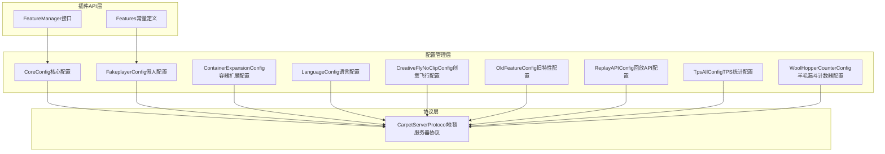
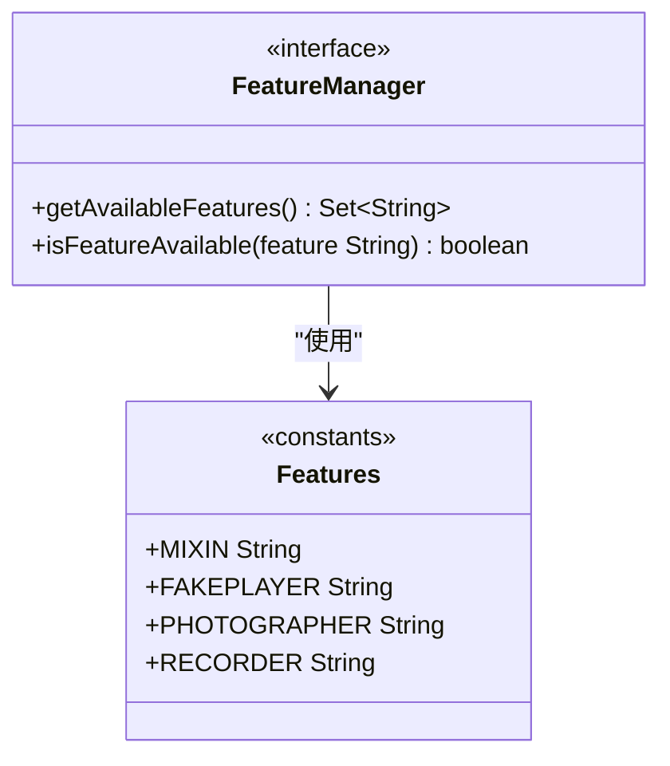
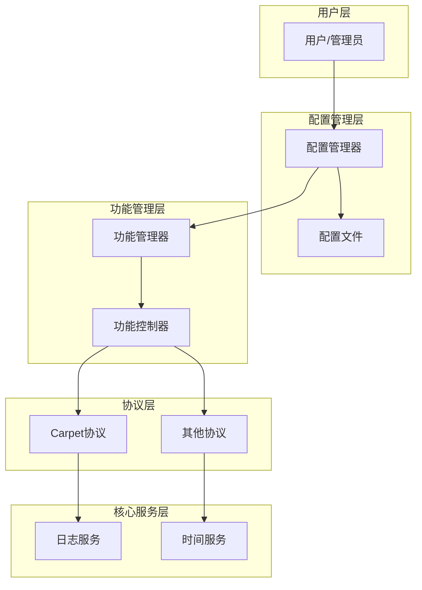
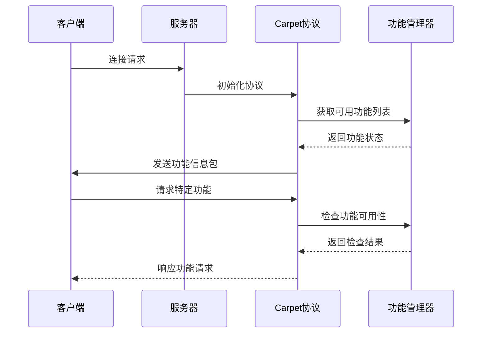
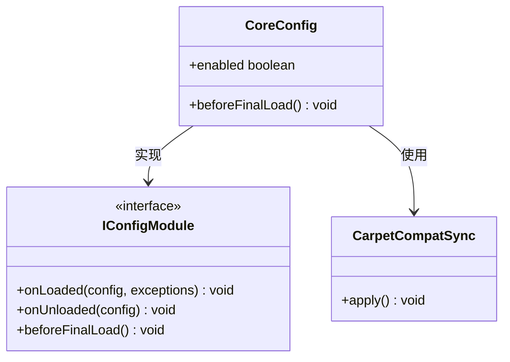
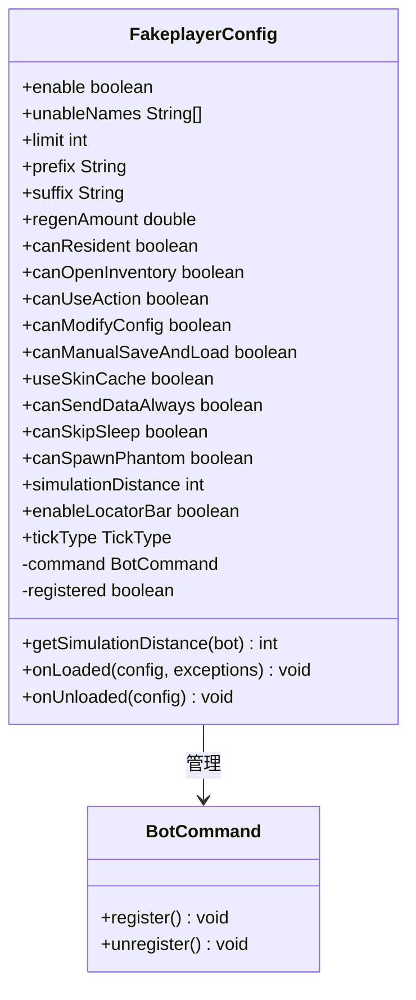
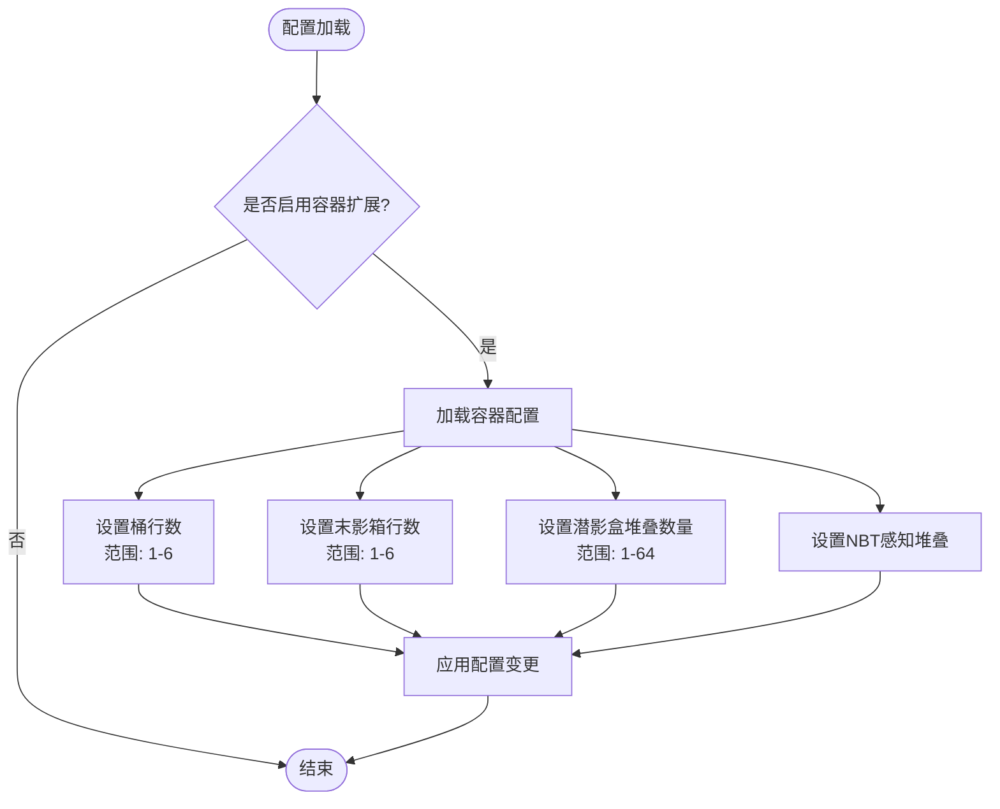
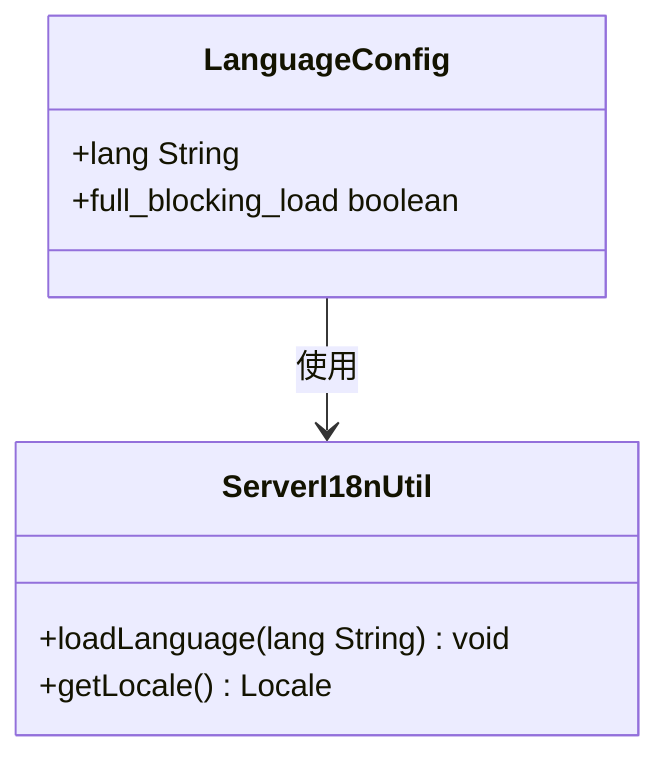
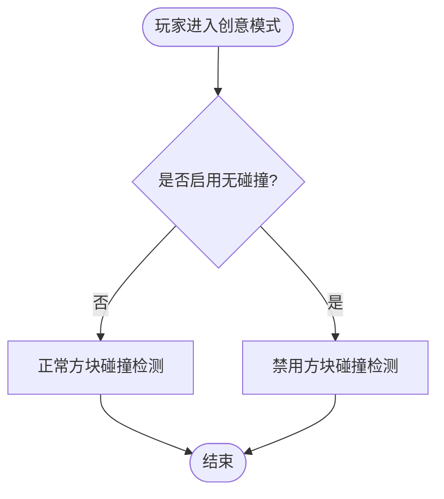
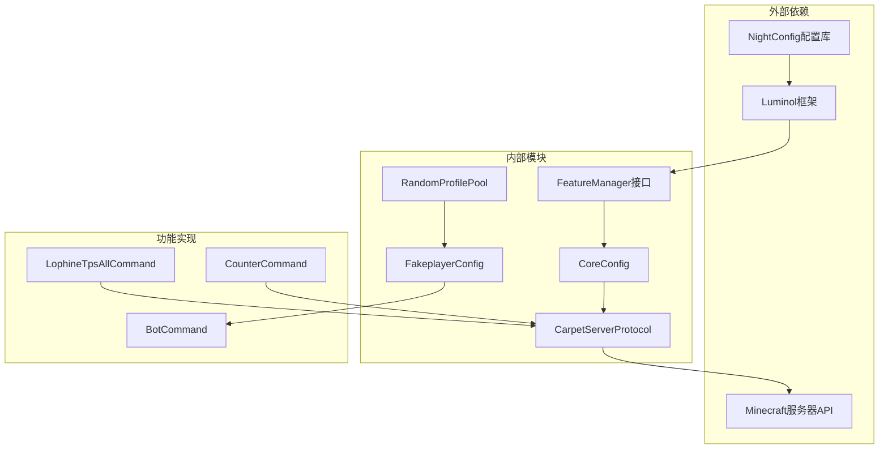

# 插件功能管理

<cite>
**本文档引用的文件**
- [FeatureManager.java](file://luminol-api/src/main/java/org/leavesmc/leaves/plugin/FeatureManager.java)
- [Features.java](file://luminol-api/src/main/java/org/leavesmc/leaves/plugin/Features.java)
- [CoreConfig.java](file://lophine-server/src/main/java/fun/bm/lophine/carpet/config/modules/CoreConfig.java)
- [FakeplayerConfig.java](file://lophine-server/src/main/java/fun/bm/lophine/config/modules/function/FakeplayerConfig.java)
- [ContainerExpansionConfig.java](file://lophine-server/src/main/java/fun/bm/lophine/config/modules/function/ContainerExpansionConfig.java)
- [LanguageConfig.java](file://lophine-server/src/main/java/fun/bm/lophine/config/modules/function/LanguageConfig.java)
- [CreativeFlyNoClipConfig.java](file://lophine-server/src/main/java/fun/bm/lophine/config/modules/function/CreativeFlyNoClipConfig.java)
- [OldFeatureConfig.java](file://lophine-server/src/main/java/fun/bm/lophine/config/modules/function/OldFeatureConfig.java)
- [ReplayAPIConfig.java](file://lophine-server/src/main/java/fun/bm/lophine/config/modules/function/ReplayAPIConfig.java)
- [TpsAllConfig.java](file://lophine-server/src/main/java/fun/bm/lophine/config/modules/function/TpsAllConfig.java)
- [WoolHopperCounterConfig.java](file://lophine-server/src/main/java/fun/bm/lophine/config/modules/function/WoolHopperCounterConfig.java)
- [CarpetServerProtocol.java](file://lophine-server/src/main/java/org/leavesmc/leaves/protocol/CarpetServerProtocol.java)
</cite>

## 目录
1. [简介](#简介)
2. [项目结构](#项目结构)
3. [核心组件](#核心组件)
4. [架构概览](#架构概览)
5. [详细组件分析](#详细组件分析)
6. [依赖关系分析](#依赖关系分析)
7. [性能考虑](#性能考虑)
8. [故障排除指南](#故障排除指南)
9. [结论](#结论)

## 简介

Lophine项目的插件功能管理系统是一个基于配置驱动的功能管理框架，通过统一的接口定义和模块化配置实现对各种功能特性的控制。该系统支持多种功能类型，包括假人功能、摄影功能、录制功能等，并提供了灵活的配置管理和动态加载机制。

系统的核心设计理念是通过标准化的接口和配置类来管理不同的功能模块，每个功能模块都可以独立启用或禁用，同时保持与其他模块的兼容性。这种设计使得Lophine能够在不修改核心代码的情况下扩展新的功能特性。

## 项目结构

Lophine项目的插件功能管理系统主要分布在以下目录结构中：

**图表来源**
- [FeatureManager.java:1-15](file://luminol-api/src/main/java/org/leavesmc/leaves/plugin/FeatureManager.java#L1-L15)
- [Features.java:1-14](file://luminol-api/src/main/java/org/leavesmc/leaves/plugin/Features.java#L1-L14)
- [CoreConfig.java:1-30](file://lophine-server/src/main/java/fun/bm/lophine/carpet/config/modules/CoreConfig.java#L1-L30)

**章节来源**
- [FeatureManager.java:1-15](file://luminol-api/src/main/java/org/leavesmc/leaves/plugin/FeatureManager.java#L1-L15)
- [Features.java:1-14](file://luminol-api/src/main/java/org/leavesmc/leaves/plugin/Features.java#L1-L14)

## 核心组件

### 功能管理接口

系统的核心是`FeatureManager`接口，它定义了功能可用性的检查方法：

**图表来源**
- [FeatureManager.java:10-14](file://luminol-api/src/main/java/org/leavesmc/leaves/plugin/FeatureManager.java#L10-L14)
- [Features.java:8-13](file://luminol-api/src/main/java/org/leavesmc/leaves/plugin/Features.java#L8-L13)

### 配置模块系统

系统采用模块化的配置管理方式，每个功能特性都有对应的配置类：

| 配置类别 | 配置类 | 主要功能 |
|---------|--------|----------|
| 根配置 | CoreConfig | 核心功能开关和兼容性同步 |
| 函数配置 | FakeplayerConfig | 假人功能配置 |
| 函数配置 | ContainerExpansionConfig | 容器扩展配置 |
| 函数配置 | LanguageConfig | 语言本地化配置 |
| 函数配置 | CreativeFlyNoClipConfig | 创意飞行无碰撞配置 |
| 函数配置 | OldFeatureConfig | 旧版本特性配置 |
| 函数配置 | ReplayAPIConfig | 回放API配置 |
| 函数配置 | TpsAllConfig | TPS统计命令配置 |
| 函数配置 | WoolHopperCounterConfig | 羊毛漏斗计数器配置 |

**章节来源**
- [CoreConfig.java:9-29](file://lophine-server/src/main/java/fun/bm/lophine/carpet/config/modules/CoreConfig.java#L9-L29)
- [FakeplayerConfig.java:15-111](file://lophine-server/src/main/java/fun/bm/lophine/config/modules/function/FakeplayerConfig.java#L15-L111)

## 架构概览

Lophine插件功能管理系统的整体架构采用分层设计，从底层的配置管理到上层的功能提供形成了清晰的层次结构：

**图表来源**
- [CarpetServerProtocol.java:22-57](file://lophine-server/src/main/java/org/leavesmc/leaves/protocol/CarpetServerProtocol.java#L22-L57)

### 协议通信流程

系统通过Carpet协议实现客户端与服务器之间的功能同步：

**图表来源**
- [CarpetServerProtocol.java:37-52](file://lophine-server/src/main/java/org/leavesmc/leaves/protocol/CarpetServerProtocol.java#L37-L52)

## 详细组件分析

### 核心配置管理

CoreConfig作为系统的核心配置类，负责管理地毯(modifier)功能的整体开关：

**图表来源**
- [CoreConfig.java:14-29](file://lophine-server/src/main/java/fun/bm/lophine/carpet/config/modules/CoreConfig.java#L14-L29)

CoreConfig的主要特性包括：
- 全局功能开关控制
- 自动兼容性同步机制
- 配置加载前的预处理

**章节来源**
- [CoreConfig.java:15-28](file://lophine-server/src/main/java/fun/bm/lophine/carpet/config/modules/CoreConfig.java#L15-L28)

### 假人功能配置

FakeplayerConfig提供了完整的假人功能配置选项：

**图表来源**
- [FakeplayerConfig.java:16-111](file://lophine-server/src/main/java/fun/bm/lophine/config/modules/function/FakeplayerConfig.java#L16-L111)

假人功能的关键配置项包括：
- 基础功能开关和数量限制
- 命名规则和权限控制
- 游戏行为模拟设置
- 数据传输和缓存策略

**章节来源**
- [FakeplayerConfig.java:17-92](file://lophine-server/src/main/java/fun/bm/lophine/config/modules/function/FakeplayerConfig.java#L17-L92)

### 容器扩展配置

ContainerExpansionConfig实现了容器容量的扩展功能：

**图表来源**
- [ContainerExpansionConfig.java:12-38](file://lophine-server/src/main/java/fun/bm/lophine/config/modules/function/ContainerExpansionConfig.java#L12-L38)

**章节来源**
- [ContainerExpansionConfig.java:14-37](file://lophine-server/src/main/java/fun/bm/lophine/config/modules/function/ContainerExpansionConfig.java#L14-L37)

### 语言本地化配置

LanguageConfig提供了多语言支持功能：

**图表来源**
- [LanguageConfig.java:11-24](file://lophine-server/src/main/java/fun/bm/lophine/config/modules/function/LanguageConfig.java#L11-L24)

语言配置的主要特点：
- 支持多种语言标识符
- 可选择阻塞式语言加载模式
- 提供启动性能优化选项

**章节来源**
- [LanguageConfig.java:12-23](file://lophine-server/src/main/java/fun/bm/lophine/config/modules/function/LanguageConfig.java#L12-L23)

### 创意飞行无碰撞配置

CreativeFlyNoClipConfig实现了创意模式飞行时的无碰撞效果：

**图表来源**
- [CreativeFlyNoClipConfig.java:15-25](file://lophine-server/src/main/java/fun/bm/lophine/config/modules/function/CreativeFlyNoClipConfig.java#L15-L25)

**章节来源**
- [CreativeFlyNoClipConfig.java:16-24](file://lophine-server/src/main/java/fun/bm/lophine/config/modules/function/CreativeFlyNoClipConfig.java#L16-L24)

## 依赖关系分析

系统各组件之间的依赖关系呈现清晰的层次结构：

**图表来源**
- [FakeplayerConfig.java:96-109](file://lophine-server/src/main/java/fun/bm/lophine/config/modules/function/FakeplayerConfig.java#L96-L109)
- [TpsAllConfig.java:29-44](file://lophine-server/src/main/java/fun/bm/lophine/config/modules/function/TpsAllConfig.java#L29-L44)

### 关键依赖链路

1. **配置加载链路**: NightConfig → Luminol框架 → 各功能配置类
2. **功能注册链路**: 配置类 → 命令注册器 → 服务器命令系统
3. **协议通信链路**: 功能配置 → 协议处理器 → 客户端同步

**章节来源**
- [ReplayAPIConfig.java:30-34](file://lophine-server/src/main/java/fun/bm/lophine/config/modules/function/ReplayAPIConfig.java#L30-L34)

## 性能考虑

### 配置加载优化

系统在配置加载方面采用了多项优化措施：

- **延迟初始化**: 大多数功能采用按需加载策略，避免不必要的资源消耗
- **缓存机制**: 假人皮肤和摄影配置采用缓存策略减少重复计算
- **异步处理**: 语言文件加载支持非阻塞模式以提高启动速度

### 内存管理

- **对象池**: 使用RandomProfilePool管理摄影配置对象，减少内存分配
- **弱引用**: 在可能的情况下使用弱引用避免内存泄漏
- **及时释放**: 配置卸载时确保所有资源得到正确释放

### 网络通信优化

- **增量更新**: 仅发送变化的功能状态给客户端
- **压缩传输**: 对协议数据进行适当的压缩处理
- **批量处理**: 将多个功能状态合并为单个网络包传输

## 故障排除指南

### 常见问题及解决方案

#### 配置加载失败

**症状**: 功能无法正常启用或配置无效

**排查步骤**:
1. 检查配置文件格式是否正确
2. 验证配置值是否在允许范围内
3. 查看服务器日志中的错误信息
4. 确认相关依赖模块是否已正确加载

#### 功能冲突

**症状**: 多个功能同时启用导致异常

**解决方法**:
1. 检查功能间的兼容性设置
2. 临时禁用冲突的功能进行测试
3. 更新到最新版本的Lophine
4. 联系社区获取支持

#### 性能问题

**症状**: 服务器性能下降或卡顿

**优化建议**:
1. 调整相关配置参数（如限速、缓存大小）
2. 检查是否有过多的功能同时启用
3. 监控服务器资源使用情况
4. 考虑升级硬件配置

**章节来源**
- [WoolHopperCounterConfig.java:22-33](file://lophine-server/src/main/java/fun/bm/lophine/config/modules/function/WoolHopperCounterConfig.java#L22-L33)

## 结论

Lophine项目的插件功能管理系统展现了优秀的软件架构设计，通过标准化的接口定义、模块化的配置管理和灵活的协议通信机制，实现了对多种功能特性的有效管理。

系统的主要优势包括：

1. **高度模块化**: 每个功能都是独立的模块，可以单独启用或禁用
2. **配置驱动**: 通过配置文件实现功能的动态控制
3. **协议兼容**: 与Carpet等外部协议保持良好的兼容性
4. **性能优化**: 采用多种优化技术确保系统运行效率
5. **易于扩展**: 新功能可以通过简单的接口实现快速集成

未来的发展方向包括进一步完善功能间的协调机制、增强系统的监控和诊断能力，以及持续优化性能表现。该系统为Lophine项目提供了坚实的功能基础，也为其他类似项目提供了优秀的参考模板。