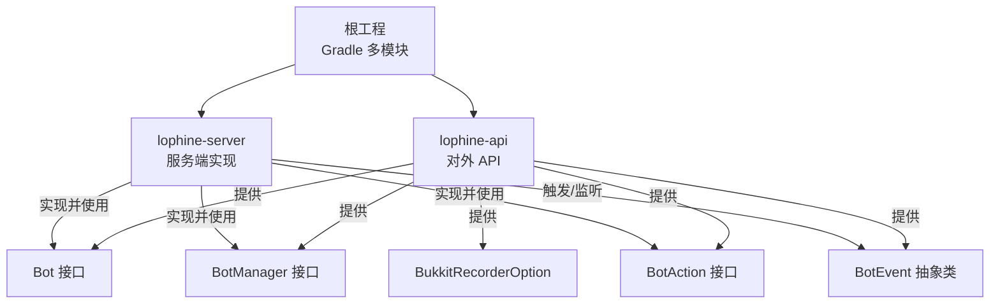
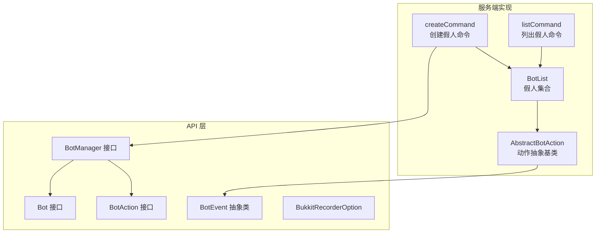
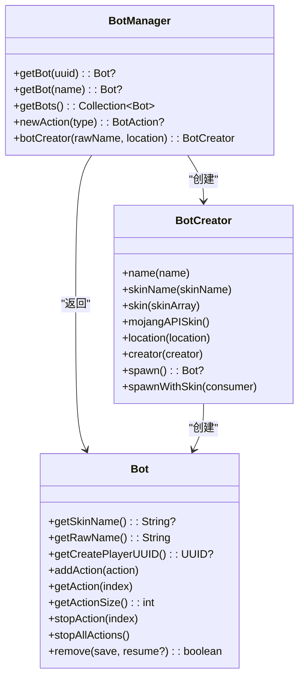
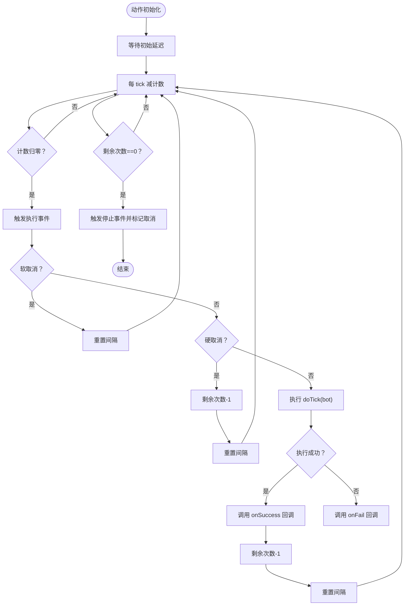
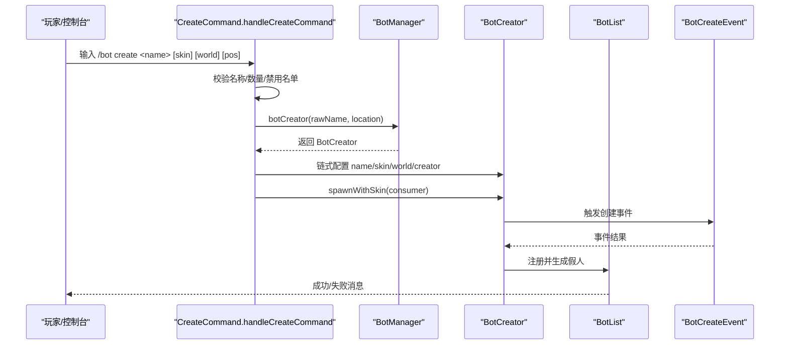
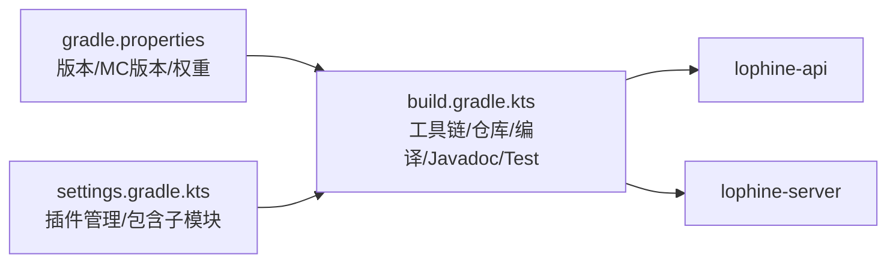

# 插件开发

<cite>
**本文引用的文件**
- [README.md](file://README.md)
- [build.gradle.kts](file://build.gradle.kts)
- [settings.gradle.kts](file://settings.gradle.kts)
- [gradle.properties](file://gradle.properties)
- [lophine-api/src/main/java/org/leavesmc/leaves/entity/bot/Bot.java](file://lophine-api/src/main/java/org/leavesmc/leaves/entity/bot/Bot.java)
- [lophine-api/src/main/java/org/leavesmc/leaves/entity/bot/BotCreator.java](file://lophine-api/src/main/java/org/leavesmc/leaves/entity/bot/BotCreator.java)
- [lophine-api/src/main/java/org/leavesmc/leaves/entity/bot/BotManager.java](file://lophine-api/src/main/java/org/leavesmc/leaves/entity/bot/BotManager.java)
- [lophine-api/src/main/java/org/leavesmc/leaves/entity/bot/action/BotAction.java](file://lophine-api/src/main/java/org/leavesmc/leaves/entity/bot/action/BotAction.java)
- [lophine-api/src/main/java/org/leavesmc/leaves/event/bot/BotEvent.java](file://lophine-api/src/main/java/org/leavesmc/leaves/event/bot/BotEvent.java)
- [lophine-api/src/main/java/org/leavesmc/leaves/replay/BukkitRecorderOption.java](file://lophine-api/src/main/java/org/leavesmc/leaves/replay/BukkitRecorderOption.java)
- [lophine-server/src/main/java/org/leavesmc/leaves/command/bot/subcommands/CreateCommand.java](file://lophine-server/src/main/java/org/leavesmc/leaves/command/bot/subcommands/CreateCommand.java)
- [lophine-server/src/main/java/org/leavesmc/leaves/command/bot/subcommands/ListCommand.java](file://lophine-server/src/main/java/org/leavesmc/leaves/command/bot/subcommands/ListCommand.java)
- [lophine-server/src/main/java/org/leavesmc/leaves/bot/agent/actions/AbstractBotAction.java](file://lophine-server/src/main/java/org/leavesmc/leaves/bot/agent/actions/AbstractBotAction.java)
</cite>

## 目录
1. [简介](#简介)
2. [项目结构](#项目结构)
3. [核心组件](#核心组件)
4. [架构总览](#架构总览)
5. [组件详解](#组件详解)
6. [依赖关系分析](#依赖关系分析)
7. [性能考量](#性能考量)
8. [故障排查指南](#故障排查指南)
9. [结论](#结论)
10. [附录](#附录)

## 简介
本指南面向希望基于 Lophine 开发插件的开发者，系统讲解如何搭建项目、引入依赖、理解并使用 Lophine API（尤其是 Bot 相关能力）、遵循最佳实践进行生命周期与资源管理、实现与核心系统的集成与兼容、完成打包测试发布以及调试与辅助方法。文档同时提供从“Hello World”到复杂功能的开发示例路径指引，帮助你高效落地。

## 项目结构
仓库采用多模块 Gradle 结构，核心模块包括：
- lophine-api：对外暴露的 API（Bot 接口、事件、回放选项等）
- lophine-server：服务端实现（命令、协议、Bot 执行器等）

图表来源
- [settings.gradle.kts:23-25](file://settings.gradle.kts#L23-L25)
- [lophine-api/src/main/java/org/leavesmc/leaves/entity/bot/Bot.java:30](file://lophine-api/src/main/java/org/leavesmc/leaves/entity/bot/Bot.java#L30)
- [lophine-api/src/main/java/org/leavesmc/leaves/entity/bot/BotManager.java:31](file://lophine-api/src/main/java/org/leavesmc/leaves/entity/bot/BotManager.java#L31)
- [lophine-api/src/main/java/org/leavesmc/leaves/entity/bot/action/BotAction.java:31](file://lophine-api/src/main/java/org/leavesmc/leaves/entity/bot/action/BotAction.java#L31)
- [lophine-api/src/main/java/org/leavesmc/leaves/event/bot/BotEvent.java:27](file://lophine-api/src/main/java/org/leavesmc/leaves/event/bot/BotEvent.java#L27)
- [lophine-api/src/main/java/org/leavesmc/leaves/replay/BukkitRecorderOption.java:20](file://lophine-api/src/main/java/org/leavesmc/leaves/replay/BukkitRecorderOption.java#L20)

章节来源
- [settings.gradle.kts:21-25](file://settings.gradle.kts#L21-L25)
- [build.gradle.kts:46-109](file://build.gradle.kts#L46-L109)

## 核心组件
- Bot 接口：代表一个假人实体，提供皮肤名、原始名称、创建者 UUID、动作管理与移除等能力。
- BotManager 接口：提供按 UUID/名称查询假人、创建假人构造器、创建新动作实例的能力。
- BotCreator 接口：链式配置假人名称、皮肤、位置、创建者等，并支持异步加载皮肤后回调。
- BotAction 接口：定义动作的名称、UUID、取消状态及成功/失败/停止回调。
- BotEvent 抽象类：所有与假人相关的事件基类，统一持有假人对象。
- BukkitRecorderOption：回放录制选项（如天气、时间、聊天忽略等）。

章节来源
- [lophine-api/src/main/java/org/leavesmc/leaves/entity/bot/Bot.java:30-103](file://lophine-api/src/main/java/org/leavesmc/leaves/entity/bot/Bot.java#L30-L103)
- [lophine-api/src/main/java/org/leavesmc/leaves/entity/bot/BotManager.java:31-65](file://lophine-api/src/main/java/org/leavesmc/leaves/entity/bot/BotManager.java#L31-L65)
- [lophine-api/src/main/java/org/leavesmc/leaves/entity/bot/BotCreator.java:28-69](file://lophine-api/src/main/java/org/leavesmc/leaves/entity/bot/BotCreator.java#L28-L69)
- [lophine-api/src/main/java/org/leavesmc/leaves/entity/bot/action/BotAction.java:31-102](file://lophine-api/src/main/java/org/leavesmc/leaves/entity/bot/action/BotAction.java#L31-L102)
- [lophine-api/src/main/java/org/leavesmc/leaves/event/bot/BotEvent.java:27-49](file://lophine-api/src/main/java/org/leavesmc/leaves/event/bot/BotEvent.java#L27-L49)
- [lophine-api/src/main/java/org/leavesmc/leaves/replay/BukkitRecorderOption.java:20-35](file://lophine-api/src/main/java/org/leavesmc/leaves/replay/BukkitRecorderOption.java#L20-L35)

## 架构总览
Lophine 的插件开发围绕“API 模块 + 服务端实现”的分层展开。API 模块提供稳定的接口契约，服务端模块负责具体执行与事件处理。Bot 功能通过命令入口进入，经由 BotManager/BotCreator 创建假人，再由服务端执行器调度 BotAction 生命周期。

图表来源
- [lophine-server/src/main/java/org/leavesmc/leaves/command/bot/subcommands/CreateCommand.java:45-90](file://lophine-server/src/main/java/org/leavesmc/leaves/command/bot/subcommands/CreateCommand.java#L45-L90)
- [lophine-server/src/main/java/org/leavesmc/leaves/command/bot/subcommands/ListCommand.java:47-69](file://lophine-server/src/main/java/org/leavesmc/leaves/command/bot/subcommands/ListCommand.java#L47-L69)
- [lophine-server/src/main/java/org/leavesmc/leaves/bot/agent/actions/AbstractBotAction.java:40-159](file://lophine-server/src/main/java/org/leavesmc/leaves/bot/agent/actions/AbstractBotAction.java#L40-L159)
- [lophine-api/src/main/java/org/leavesmc/leaves/entity/bot/BotManager.java:31-65](file://lophine-api/src/main/java/org/leavesmc/leaves/entity/bot/BotManager.java#L31-L65)
- [lophine-api/src/main/java/org/leavesmc/leaves/entity/bot/Bot.java:30-103](file://lophine-api/src/main/java/org/leavesmc/leaves/entity/bot/Bot.java#L30-L103)

## 组件详解

### Bot 接口与生命周期
- 关键点：获取皮肤名、原始名称、创建者 UUID；添加/停止单个/全部动作；移除假人（支持保存与恢复）。
- 最佳实践：在移除前持久化必要数据；避免在主线程做阻塞操作；合理设置动作间隔与次数。

章节来源
- [lophine-api/src/main/java/org/leavesmc/leaves/entity/bot/Bot.java:30-103](file://lophine-api/src/main/java/org/leavesmc/leaves/entity/bot/Bot.java#L30-L103)

### BotManager 与 BotCreator
- BotManager：按 UUID/名称检索假人；批量视图；创建动作实例；获取 BotCreator。
- BotCreator：链式配置名称、皮肤（Mojang API 异步）、位置、创建者；同步创建或异步回调。

图表来源
- [lophine-api/src/main/java/org/leavesmc/leaves/entity/bot/BotManager.java:31-65](file://lophine-api/src/main/java/org/leavesmc/leaves/entity/bot/BotManager.java#L31-L65)
- [lophine-api/src/main/java/org/leavesmc/leaves/entity/bot/BotCreator.java:28-69](file://lophine-api/src/main/java/org/leavesmc/leaves/entity/bot/BotCreator.java#L28-L69)
- [lophine-api/src/main/java/org/leavesmc/leaves/entity/bot/Bot.java:30-103](file://lophine-api/src/main/java/org/leavesmc/leaves/entity/bot/Bot.java#L30-L103)

章节来源
- [lophine-api/src/main/java/org/leavesmc/leaves/entity/bot/BotManager.java:31-65](file://lophine-api/src/main/java/org/leavesmc/leaves/entity/bot/BotManager.java#L31-L65)
- [lophine-api/src/main/java/org/leavesmc/leaves/entity/bot/BotCreator.java:28-69](file://lophine-api/src/main/java/org/leavesmc/leaves/entity/bot/BotCreator.java#L28-L69)

### BotAction 接口与执行流程
- 关键点：动作名称与 UUID；取消标志；成功/失败/停止回调；初始延迟、间隔、重复次数；保存/加载状态。
- 执行流程：初始化 -> 每 tick 计数 -> 触发执行事件 -> 执行 doTick -> 成功/失败回调 -> 更新剩余次数与间隔 -> 停止事件。

图表来源
- [lophine-server/src/main/java/org/leavesmc/leaves/bot/agent/actions/AbstractBotAction.java:87-194](file://lophine-server/src/main/java/org/leavesmc/leaves/bot/agent/actions/AbstractBotAction.java#L87-L194)

章节来源
- [lophine-api/src/main/java/org/leavesmc/leaves/entity/bot/action/BotAction.java:31-102](file://lophine-api/src/main/java/org/leavesmc/leaves/entity/bot/action/BotAction.java#L31-L102)
- [lophine-server/src/main/java/org/leavesmc/leaves/bot/agent/actions/AbstractBotAction.java:40-265](file://lophine-server/src/main/java/org/leavesmc/leaves/bot/agent/actions/AbstractBotAction.java#L40-L265)

### 命令与交互示例（创建与列出）
- 创建命令：解析名称、皮肤名、世界、坐标，校验命名与数量限制，触发创建流程。
- 列表命令：按世界聚合显示假人列表与总数、上限提示。

图表来源
- [lophine-server/src/main/java/org/leavesmc/leaves/command/bot/subcommands/CreateCommand.java:52-90](file://lophine-server/src/main/java/org/leavesmc/leaves/command/bot/subcommands/CreateCommand.java#L52-L90)
- [lophine-api/src/main/java/org/leavesmc/leaves/entity/bot/BotManager.java:64](file://lophine-api/src/main/java/org/leavesmc/leaves/entity/bot/BotManager.java#L64)
- [lophine-api/src/main/java/org/leavesmc/leaves/entity/bot/BotCreator.java:30-68](file://lophine-api/src/main/java/org/leavesmc/leaves/entity/bot/BotCreator.java#L30-L68)

章节来源
- [lophine-server/src/main/java/org/leavesmc/leaves/command/bot/subcommands/CreateCommand.java:45-164](file://lophine-server/src/main/java/org/leavesmc/leaves/command/bot/subcommands/CreateCommand.java#L45-L164)
- [lophine-server/src/main/java/org/leavesmc/leaves/command/bot/subcommands/ListCommand.java:47-112](file://lophine-server/src/main/java/org/leavesmc/leaves/command/bot/subcommands/ListCommand.java#L47-L112)

### 回放录制选项
- 提供服务器名称、强制天气、强制时间、忽略聊天等录制参数，便于回放一致性。

章节来源
- [lophine-api/src/main/java/org/leavesmc/leaves/replay/BukkitRecorderOption.java:20-35](file://lophine-api/src/main/java/org/leavesmc/leaves/replay/BukkitRecorderOption.java#L20-L35)

## 依赖关系分析
- 构建系统：根工程使用 Gradle，启用工具链 Java 21，统一仓库（Paper、MenthaMC），发布到私有仓库。
- 子项目：lophine-api、lophine-server 双模块，共享 Java Toolchain 与编码设置。
- API 与服务端：API 模块提供接口契约，服务端模块实现并消费这些接口，形成清晰的分层。

图表来源
- [gradle.properties:1-18](file://gradle.properties#L1-L18)
- [build.gradle.kts:46-109](file://build.gradle.kts#L46-L109)
- [settings.gradle.kts:1-25](file://settings.gradle.kts#L1-L25)

章节来源
- [build.gradle.kts:1-118](file://build.gradle.kts#L1-L118)
- [settings.gradle.kts:1-25](file://settings.gradle.kts#L1-L25)
- [gradle.properties:1-18](file://gradle.properties#L1-L18)

## 性能考量
- 动作调度：合理设置初始延迟、间隔与重复次数，避免高频密集 tick；必要时使用软取消/硬取消策略。
- 事件开销：减少不必要的事件监听与广播；在动作执行中捕获异常并记录日志，避免异常传播影响主线程。
- 资源管理：及时释放动作回调引用，避免内存泄漏；在移除假人前持久化关键状态。
- I/O 与网络：皮肤加载等异步任务需在后台线程执行，避免阻塞主循环。

## 故障排查指南
- 命令参数校验失败：检查名称长度与字符集、是否已存在、是否在禁用名单、是否超过上限。
- 皮肤加载失败：确认 Mojang API 可达性与异步回调是否正确注册。
- 动作未执行：检查执行事件是否被软取消/硬取消；确认 doTick 是否抛出异常；核对剩余次数与间隔。
- 日志定位：关注动作执行异常日志与更新抑制异常处理。

章节来源
- [lophine-server/src/main/java/org/leavesmc/leaves/command/bot/subcommands/CreateCommand.java:92-115](file://lophine-server/src/main/java/org/leavesmc/leaves/command/bot/subcommands/CreateCommand.java#L92-L115)
- [lophine-server/src/main/java/org/leavesmc/leaves/bot/agent/actions/AbstractBotAction.java:136-143](file://lophine-server/src/main/java/org/leavesmc/leaves/bot/agent/actions/AbstractBotAction.java#L136-L143)

## 结论
通过 Lophine 的 API 与服务端实现，你可以安全地扩展假人系统，实现从简单创建、列表展示到复杂动作调度与事件联动的各类插件功能。建议严格遵循接口契约、注意生命周期与资源管理、利用命令与事件进行解耦，并结合回放选项保证一致性与可测试性。

## 附录

### 项目搭建与依赖配置
- 使用 Gradle，Java Toolchain 21，仓库包含 Paper 与 MenthaMC。
- API 依赖：compileOnly 引入 lophine-api 或 luminol-api（根据需要选择）。
- 发布配置：可发布到 MenthaMC 私有仓库（凭环境变量鉴权）。

章节来源
- [build.gradle.kts:46-109](file://build.gradle.kts#L46-L109)
- [README.md:55-86](file://README.md#L55-L86)

### 开发示例路径
- Hello World 插件：新建一个仅输出“Hello Lophine”的命令插件，验证构建与运行。
- 基础假人插件：使用 BotManager/BotCreator 创建假人，绑定一个简单动作（如移动/旋转），打印执行结果。
- 复杂功能插件：组合多个动作与事件监听，实现定时任务、条件判断、状态持久化与回放导出。

### 打包、测试与发布
- 打包：使用 Gradle 构建，确保 reproducible 输出顺序与时间戳。
- 测试：启用 JUnit 平台，观察测试日志输出。
- 发布：配置私有仓库凭据，发布到 MenthaMC 快照仓库。

章节来源
- [build.gradle.kts:66-87](file://build.gradle.kts#L66-L87)
- [build.gradle.kts:89-99](file://build.gradle.kts#L89-L99)

### 调试与开发辅助
- 命令行调试：通过 /bot create/list 等命令快速验证功能。
- 事件监听：订阅 BotEvent 家族事件，观察生命周期与执行状态。
- 回放导出：使用回放选项进行录制与回放，辅助问题复现与回归测试。

章节来源
- [lophine-api/src/main/java/org/leavesmc/leaves/event/bot/BotEvent.java:27-49](file://lophine-api/src/main/java/org/leavesmc/leaves/event/bot/BotEvent.java#L27-L49)
- [lophine-api/src/main/java/org/leavesmc/leaves/replay/BukkitRecorderOption.java:20-35](file://lophine-api/src/main/java/org/leavesmc/leaves/replay/BukkitRecorderOption.java#L20-L35)