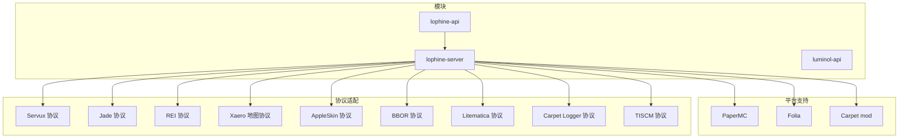
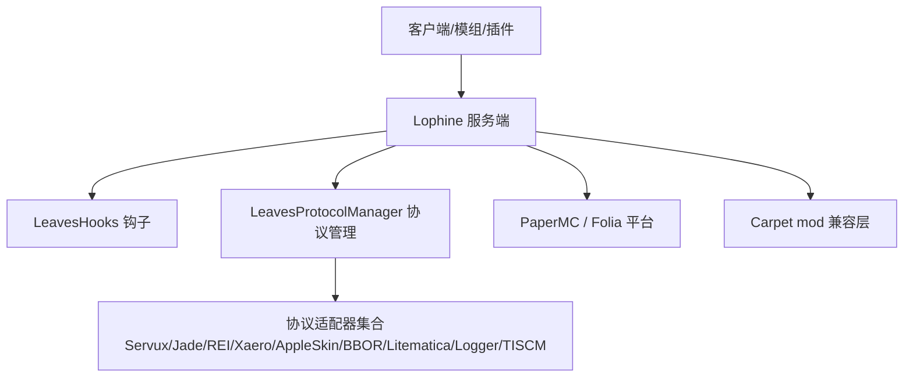
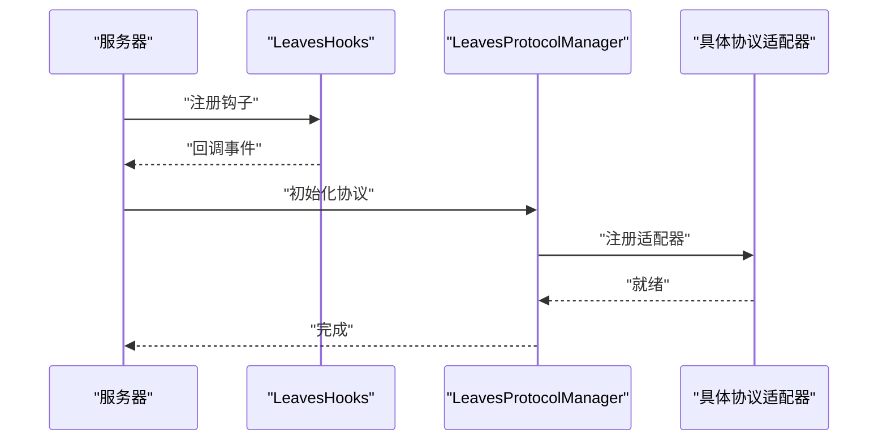
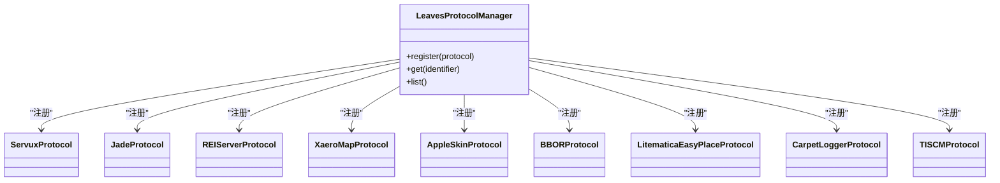
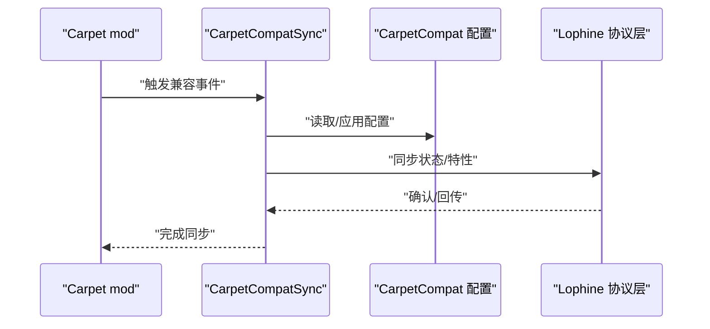
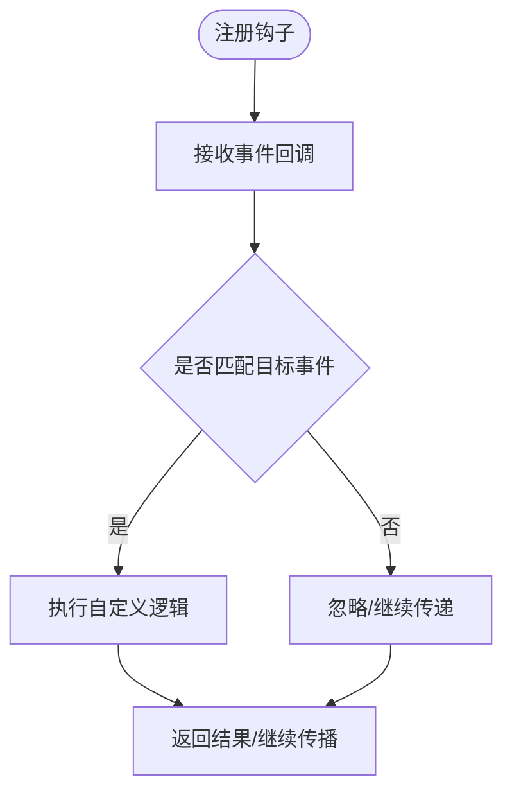
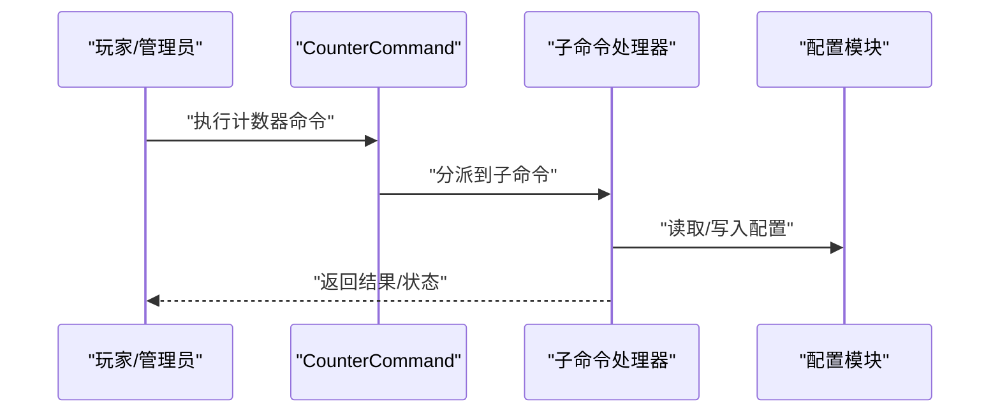
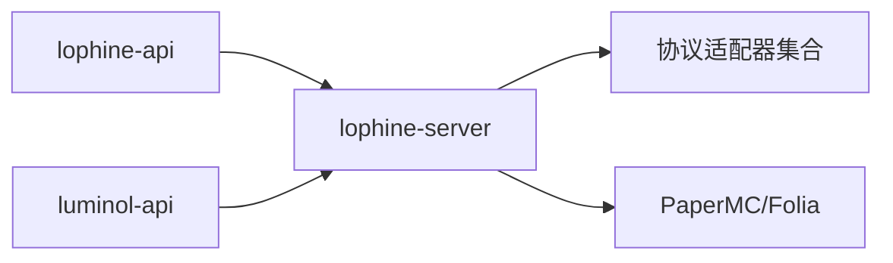

# 集成指南

<cite>
**本文引用的文件**
- [README.md](file://README.md)
- [carpet-compat-status.md](file://docs/carpet-compat-status.md)
- [LeavesHooks.java](file://lophine-server/src/main/java/org/leavesmc/leaves/region/LeavesHooks.java)
- [LeavesProtocolManager.java](file://lophine-server/src/main/java/org/leavesmc/leaves/protocol/core/LeavesProtocolManager.java)
- [BotManager.java](file://lophine-api/src/main/java/org/leavesmc/leaves/entity/bot/BotManager.java)
- [CarpetCompatSync.java](file://lophine-server/src/main/java/fun/bm/lophine/carpet/CarpetCompatSync.java)
- [CounterCommand.java](file://lophine-server/src/main/java/fun/bm/lophine/command/counter/CounterCommand.java)
- [LeavesConfig.java](file://lophine-server/src/main/java/org/leavesmc/leaves/LeavesConfig.java)
- [ServuxProtocol.java](file://lophine-server/src/main/java/org/leavesmc/leaves/protocol/servux/ServuxProtocol.java)
- [JadeProtocol.java](file://lophine-server/src/main/java/org/leavesmc/leaves/protocol/jade/JadeProtocol.java)
- [REIServerProtocol.java](file://lophine-server/src/main/java/org/leavesmc/leaves/protocol/rei/REIServerProtocol.java)
- [XaeroMapProtocol.java](file://lophine-server/src/main/java/org/leavesmc/leaves/protocol/XaeroMapProtocol.java)
- [AppleSkinProtocol.java](file://lophine-server/src/main/java/org/leavesmc/leaves/protocol/AppleSkinProtocol.java)
- [BBORProtocol.java](file://lophine-server/src/main/java/org/leavesmc/leaves/protocol/BBORProtocol.java)
- [LitematicaEasyPlaceProtocol.java](file://lophine-server/src/main/java/org/leavesmc/leaves/protocol/LitematicaEasyPlaceProtocol.java)
- [CarpetLoggerProtocol.java](file://lophine-server/src/main/java/org/leavesmc/leaves/protocol/CarpetLoggerProtocol.java)
- [TISCMProtocol.java](file://lophine-server/src/main/java/org/leavesmc/leaves/protocol/tiscm/TISCMProtocol.java)
- [build.gradle.kts](file://build.gradle.kts)
- [settings.gradle.kts](file://settings.gradle.kts)
</cite>

## 目录
1. [简介](#简介)
2. [项目结构](#项目结构)
3. [核心组件](#核心组件)
4. [架构总览](#架构总览)
5. [详细组件分析](#详细组件分析)
6. [依赖关系分析](#依赖关系分析)
7. [性能考虑](#性能考虑)
8. [故障排除指南](#故障排除指南)
9. [结论](#结论)
10. [附录](#附录)

## 简介
本指南面向需要在PaperMC、Folia以及各类模组/插件生态中集成Lophine的管理员与开发者。内容涵盖：
- 与PaperMC/Folia服务器平台的集成方式与兼容性要求
- 与第三方插件（如Servux、Jade、REI、Xaero、AppleSkin、BBOR、Litematica等）的协议兼容与功能扩展
- 与Carpet mod的集成指南与兼容性处理方案
- Lophine钩子系统（LeavesHooks）的使用方法与扩展机制
- 集成过程中的常见问题与解决方案
- 集成测试的方法与工具
- 版本升级时的集成变更与迁移策略
- 完整的集成示例与配置说明

## 项目结构
Lophine采用多模块结构，核心模块包括：
- lophine-api：对外API与实体管理（如Bot）
- lophine-server：服务端实现、协议适配器、钩子系统、配置与命令
- luminol-api：区域化与线程化基础设施（用于Folia支持）

**图表来源**
- [LeavesProtocolManager.java](file://lophine-server/src/main/java/org/leavesmc/leaves/protocol/core/LeavesProtocolManager.java)
- [LeavesHooks.java](file://lophine-server/src/main/java/org/leavesmc/leaves/region/LeavesHooks.java)
- [ServuxProtocol.java](file://lophine-server/src/main/java/org/leavesmc/leaves/protocol/servux/ServuxProtocol.java)
- [JadeProtocol.java](file://lophine-server/src/main/java/org/leavesmc/leaves/protocol/jade/JadeProtocol.java)
- [REIServerProtocol.java](file://lophine-server/src/main/java/org/leavesmc/leaves/protocol/rei/REIServerProtocol.java)
- [XaeroMapProtocol.java](file://lophine-server/src/main/java/org/leavesmc/leaves/protocol/XaeroMapProtocol.java)
- [AppleSkinProtocol.java](file://lophine-server/src/main/java/org/leavesmc/leaves/protocol/AppleSkinProtocol.java)
- [BBORProtocol.java](file://lophine-server/src/main/java/org/leavesmc/leaves/protocol/BBORProtocol.java)
- [LitematicaEasyPlaceProtocol.java](file://lophine-server/src/main/java/org/leavesmc/leaves/protocol/LitematicaEasyPlaceProtocol.java)
- [CarpetLoggerProtocol.java](file://lophine-server/src/main/java/org/leavesmc/leaves/protocol/CarpetLoggerProtocol.java)
- [TISCMProtocol.java](file://lophine-server/src/main/java/org/leavesmc/leaves/protocol/tiscm/TISCMProtocol.java)

**章节来源**
- [README.md](file://README.md)
- [settings.gradle.kts](file://settings.gradle.kts)
- [build.gradle.kts](file://build.gradle.kts)

## 核心组件
- 钩子系统（LeavesHooks）：提供对服务器生命周期事件的接入点，便于在不修改原版逻辑的情况下扩展行为。
- 协议管理器（LeavesProtocolManager）：集中注册与管理各类客户端-服务端协议适配器，实现跨模组/插件的功能互通。
- Bot系统：通过BotManager统一管理假人实体及其行为，支持动作调度、配置与持久化。
- 配置与命令：通过LeavesConfig与命令系统暴露可调参数与运维操作（如计数器命令）。

**章节来源**
- [LeavesHooks.java](file://lophine-server/src/main/java/org/leavesmc/leaves/region/LeavesHooks.java)
- [LeavesProtocolManager.java](file://lophine-server/src/main/java/org/leavesmc/leaves/protocol/core/LeavesProtocolManager.java)
- [BotManager.java](file://lophine-api/src/main/java/org/leavesmc/leaves/entity/bot/BotManager.java)
- [LeavesConfig.java](file://lophine-server/src/main/java/org/leavesmc/leaves/LeavesConfig.java)

## 架构总览
下图展示了Lophine在不同平台与协议栈中的位置与交互关系：

**图表来源**
- [LeavesProtocolManager.java](file://lophine-server/src/main/java/org/leavesmc/leaves/protocol/core/LeavesProtocolManager.java)
- [LeavesHooks.java](file://lophine-server/src/main/java/org/leavesmc/leaves/region/LeavesHooks.java)
- [CarpetCompatSync.java](file://lophine-server/src/main/java/fun/bm/lophine/carpet/CarpetCompatSync.java)

## 详细组件分析

### PaperMC/Folia 集成
- 平台适配：Lophine通过patches与模块化构建在PaperMC与Folia上运行。Folia支持由luminol-api提供的区域化与线程化能力支撑。
- 钩子接入：LeavesHooks提供关键生命周期钩子，可在不侵入原版代码的前提下扩展服务器行为。
- 命令与配置：通过命令系统与配置模块暴露运维能力，确保在不同平台上的可用性一致。

**图表来源**
- [LeavesHooks.java](file://lophine-server/src/main/java/org/leavesmc/leaves/region/LeavesHooks.java)
- [LeavesProtocolManager.java](file://lophine-server/src/main/java/org/leavesmc/leaves/protocol/core/LeavesProtocolManager.java)

**章节来源**
- [README.md](file://README.md)
- [LeavesHooks.java](file://lophine-server/src/main/java/org/leavesmc/leaves/region/LeavesHooks.java)
- [LeavesConfig.java](file://lophine-server/src/main/java/org/leavesmc/leaves/LeavesConfig.java)

### 第三方插件集成（协议兼容性与功能扩展）
Lophine通过LeavesProtocolManager集中管理协议适配器，实现与多个客户端模组/插件的互通：
- Servux：实体数据、HUD数据、结构同步等
- Jade：方块/实体信息展示
- REI：配方与合成显示
- Xaero 地图：小地图与导航
- AppleSkin：食物与饱食度可视化
- BBOR：区块渲染边界
- Litematica：设计蓝图放置与同步
- Carpet Logger：日志输出
- TISCM：时间与世界管理

**图表来源**
- [LeavesProtocolManager.java](file://lophine-server/src/main/java/org/leavesmc/leaves/protocol/core/LeavesProtocolManager.java)
- [ServuxProtocol.java](file://lophine-server/src/main/java/org/leavesmc/leaves/protocol/servux/ServuxProtocol.java)
- [JadeProtocol.java](file://lophine-server/src/main/java/org/leavesmc/leaves/protocol/jade/JadeProtocol.java)
- [REIServerProtocol.java](file://lophine-server/src/main/java/org/leavesmc/leaves/protocol/rei/REIServerProtocol.java)
- [XaeroMapProtocol.java](file://lophine-server/src/main/java/org/leavesmc/leaves/protocol/XaeroMapProtocol.java)
- [AppleSkinProtocol.java](file://lophine-server/src/main/java/org/leavesmc/leaves/protocol/AppleSkinProtocol.java)
- [BBORProtocol.java](file://lophine-server/src/main/java/org/leavesmc/leaves/protocol/BBORProtocol.java)
- [LitematicaEasyPlaceProtocol.java](file://lophine-server/src/main/java/org/leavesmc/leaves/protocol/LitematicaEasyPlaceProtocol.java)
- [CarpetLoggerProtocol.java](file://lophine-server/src/main/java/org/leavesmc/leaves/protocol/CarpetLoggerProtocol.java)
- [TISCMProtocol.java](file://lophine-server/src/main/java/org/leavesmc/leaves/protocol/tiscm/TISCMProtocol.java)

**章节来源**
- [LeavesProtocolManager.java](file://lophine-server/src/main/java/org/leavesmc/leaves/protocol/core/LeavesProtocolManager.java)

### 与Carpet mod的集成
- 兼容层：提供CarpetCompatSync与相关帮助类，确保与Carpet特性（如计算器、交互更新、无延迟刷怪等）协同工作。
- 配置模块：通过Carpet相关配置模块启用或调整兼容行为。
- 日志协议：CarpetLoggerProtocol用于与Carpet的日志输出机制对接。

**图表来源**
- [CarpetCompatSync.java](file://lophine-server/src/main/java/fun/bm/lophine/carpet/CarpetCompatSync.java)
- [CarpetLoggerProtocol.java](file://lophine-server/src/main/java/org/leavesmc/leaves/protocol/CarpetLoggerProtocol.java)

**章节来源**
- [carpet-compat-status.md](file://docs/carpet-compat-status.md)
- [CarpetCompatSync.java](file://lophine-server/src/main/java/fun/bm/lophine/carpet/CarpetCompatSync.java)

### Lophine钩子系统（LeavesHooks）使用与扩展
- 使用方法：在服务器启动阶段注册钩子，监听事件并在回调中执行自定义逻辑。
- 扩展机制：通过事件分发与条件判断，允许第三方模块安全地接入而不影响核心流程。
- 典型场景：服务器生命周期事件、区域化任务调度、性能监控与统计。

**图表来源**
- [LeavesHooks.java](file://lophine-server/src/main/java/org/leavesmc/leaves/region/LeavesHooks.java)

**章节来源**
- [LeavesHooks.java](file://lophine-server/src/main/java/org/leavesmc/leaves/region/LeavesHooks.java)

### 计数器命令与配置
- 计数器命令：提供显示、重置、切换等子命令，用于统计与监控。
- 配置模块：通过配置项控制计数器行为与显示范围。

**图表来源**
- [CounterCommand.java](file://lophine-server/src/main/java/fun/bm/lophine/command/counter/CounterCommand.java)
- [LeavesConfig.java](file://lophine-server/src/main/java/org/leavesmc/leaves/LeavesConfig.java)

**章节来源**
- [CounterCommand.java](file://lophine-server/src/main/java/fun/bm/lophine/command/counter/CounterCommand.java)
- [LeavesConfig.java](file://lophine-server/src/main/java/org/leavesmc/leaves/LeavesConfig.java)

## 依赖关系分析
- 模块依赖：lophine-api为lophine-server提供实体与事件API；luminol-api为Folia提供区域化基础。
- 协议依赖：各协议适配器依赖LeavesProtocolManager进行注册与发现。
- 平台依赖：PaperMC/Folia通过patches与模块化构建集成。

**图表来源**
- [settings.gradle.kts](file://settings.gradle.kts)
- [build.gradle.kts](file://build.gradle.kts)

**章节来源**
- [settings.gradle.kts](file://settings.gradle.kts)
- [build.gradle.kts](file://build.gradle.kts)

## 性能考虑
- 区域化与线程化：利用luminol-api的区域化能力降低锁竞争，提升大规模世界与高并发下的稳定性。
- 协议适配优化：通过协议管理器集中注册与按需加载，减少不必要的初始化开销。
- 钩子回调：避免在钩子中执行阻塞操作，必要时异步处理以保证主线程流畅。

## 故障排除指南
- 协议未生效：检查协议是否已通过LeavesProtocolManager注册，并确认客户端/模组版本兼容。
- 与Carpet冲突：核对carpet-compat-status，按状态调整配置或禁用冲突特性。
- Folia兼容性：确认使用了正确的luminol-api版本与对应patches。
- 假人功能异常：检查BotManager相关配置与权限设置。

**章节来源**
- [carpet-compat-status.md](file://docs/carpet-compat-status.md)
- [LeavesProtocolManager.java](file://lophine-server/src/main/java/org/leavesmc/leaves/protocol/core/LeavesProtocolManager.java)
- [LeavesHooks.java](file://lophine-server/src/main/java/org/leavesmc/leaves/region/LeavesHooks.java)

## 结论
Lophine通过模块化设计与协议适配器体系，实现了对PaperMC/Folia平台及多种客户端模组/插件的良好兼容。借助LeavesHooks与LeavesProtocolManager，用户可以安全地扩展服务器功能并与其他生态无缝协作。建议在生产环境中结合配置与命令系统进行精细化管控，并定期关注版本更新与兼容状态。

## 附录

### 集成测试方法与工具
- 单元测试：针对协议适配器与钩子回调编写最小化测试用例。
- 集成测试：在PaperMC/Folia环境中部署，验证协议互通与功能完整性。
- 性能测试：使用区域化与线程化特性进行压力测试，评估吞吐与延迟。

### 版本升级与迁移策略
- 兼容性检查：对照carpet-compat-status与协议适配器变更记录，识别破坏性改动。
- 渐进式迁移：先在测试环境启用新特性，再逐步推广至生产。
- 回滚预案：保留旧版本配置与补丁，确保快速回退。

### 完整集成示例与配置说明
- 示例一：启用Servux协议
  - 在协议管理器中注册Servux适配器
  - 配置相关参数以启用实体数据同步
- 示例二：启用Jade协议
  - 注册Jade适配器并配置展示优先级
  - 调整权限与可见性设置
- 示例三：启用Carpet兼容
  - 启用CarpetCompatSync并调整配置模块
  - 对照兼容状态文档排查冲突

**章节来源**
- [LeavesProtocolManager.java](file://lophine-server/src/main/java/org/leavesmc/leaves/protocol/core/LeavesProtocolManager.java)
- [carpet-compat-status.md](file://docs/carpet-compat-status.md)