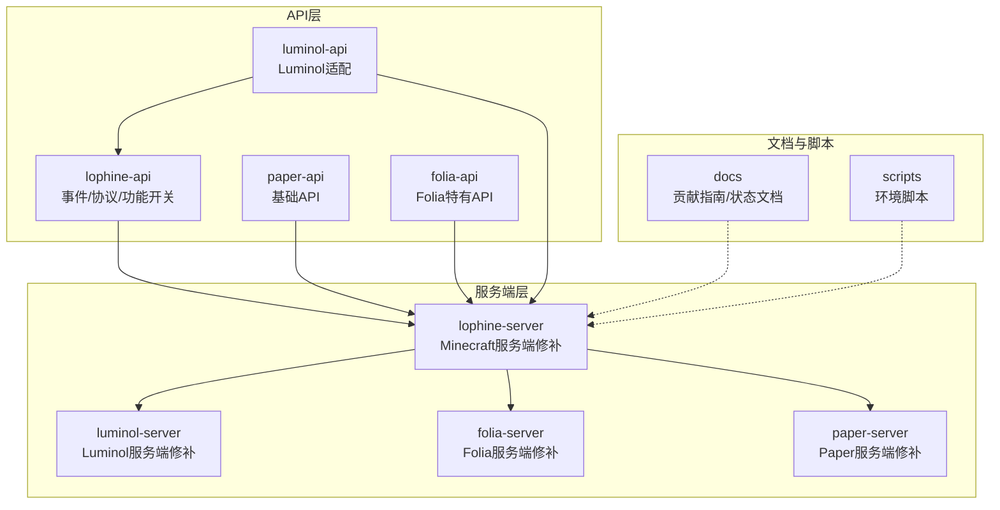
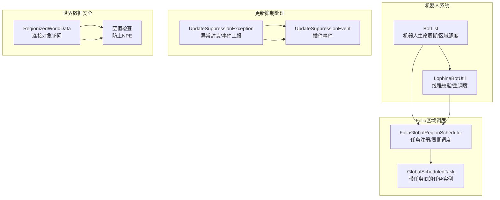
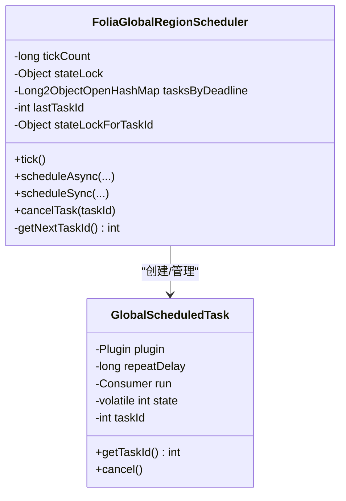
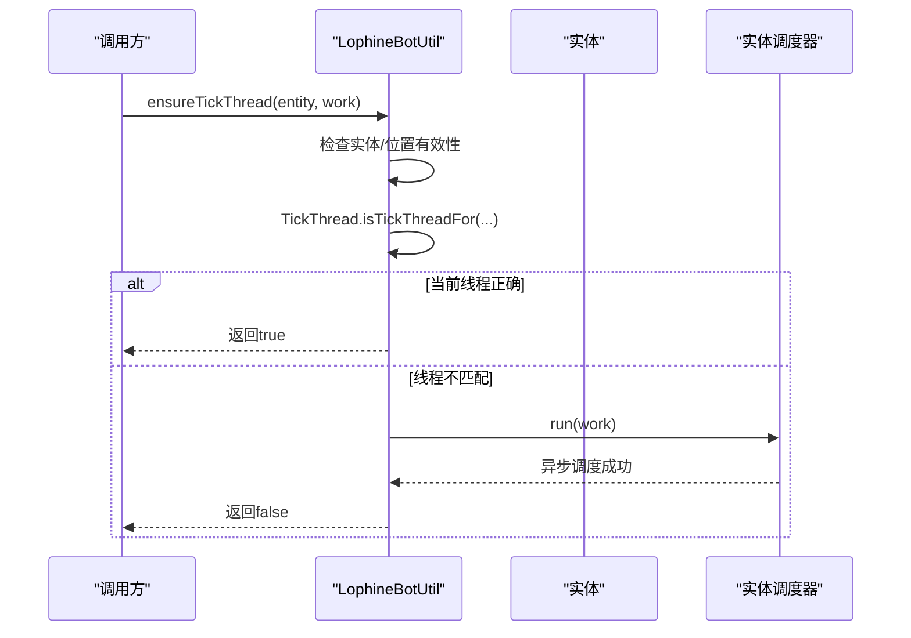
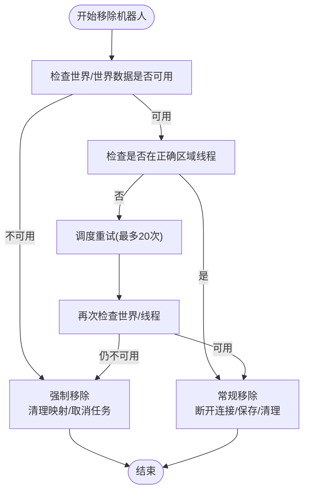
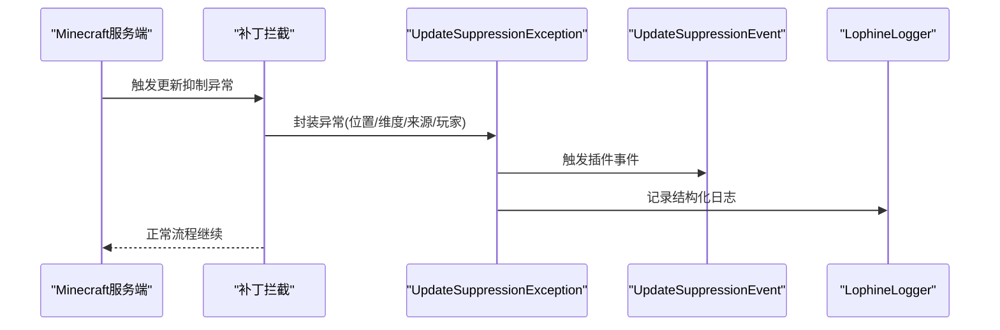
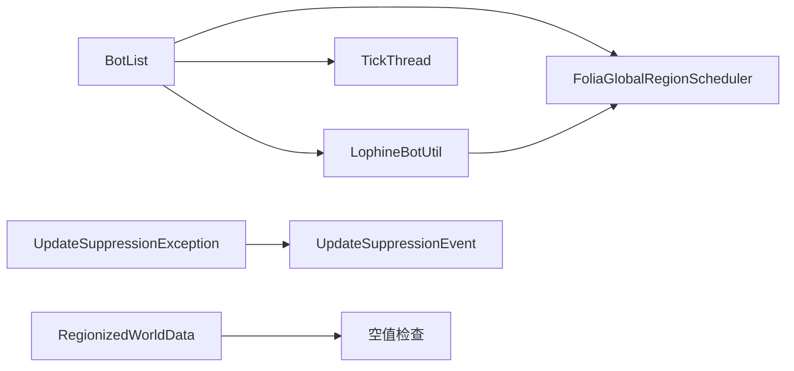

# Folia兼容性

<cite>
**本文引用的文件**
- [BotList.java](file://lophine-server/src/main/java/org/leavesmc/leaves/bot/BotList.java)
- [LophineBotUtil.java](file://lophine-server/src/main/java/org/leavesmc/leaves/bot/LophineBotUtil.java)
- [UpdateSuppressionException.java](file://lophine-server/src/main/java/org/leavesmc/leaves/util/UpdateSuppressionException.java)
- [UpdateSuppressionCrashFixConfig.java](file://lophine-server/src/main/java/fun/bm/lophine/config/modules/fixes/UpdateSuppressionCrashFixConfig.java)
- [UpdateSuppressionEvent.java](file://lophine-api/src/main/java/org/leavesmc/leaves/event/player/UpdateSuppressionEvent.java)
- [0005-Add-cancel-task-by-task-id-in-FoliaGlobalRegionSched.patch](file://lophine-server/paper-patches/features/0005-Add-cancel-task-by-task-id-in-FoliaGlobalRegionSched.patch)
- [0032-Leaves-Catch-update-suppression-crash.patch](file://lophine-server/minecraft-patches/features/0032-Leaves-Catch-update-suppression-crash.patch)
- [0041-Add-null-check-in-RegionizedWorldData-conections.patch](file://lophine-server/minecraft-patches/features/0041-Add-null-check-in-RegionizedWorldData-conections.patch)
- [0001-Rebrand-to-Lophine.patch](file://lophine-server/paper-patches/features/0001-Rebrand-to-Lophine.patch)
- [CONTRIBUTING.md](file://docs/CONTRIBUTING.md)
</cite>

## 目录
1. [引言](#引言)
2. [项目结构](#项目结构)
3. [核心组件](#核心组件)
4. [架构总览](#架构总览)
5. [详细组件分析](#详细组件分析)
6. [依赖关系分析](#依赖关系分析)
7. [性能考量](#性能考量)
8. [故障排除指南](#故障排除指南)
9. [结论](#结论)
10. [附录](#附录)

## 引言
本技术文档聚焦于Lophine在Folia平台上的兼容性设计与实现，系统阐述Folia多线程区域化架构带来的挑战、Lophine的专项优化与修复方案、更新抑制机制的处理策略、Folia特有API使用规范、常见兼容性问题的诊断与解决方法，以及与传统Paper服务器的差异与迁移注意事项。文档同时提供性能调优建议与最佳实践，帮助开发者在Folia环境下稳定运行Lophine功能。

## 项目结构
Lophine采用“补丁驱动”的多模块架构，围绕Folia/Paper生态进行扩展与适配：
- lophine-api：面向API层的扩展，包括事件、协议与功能开关等。
- lophine-server：对Minecraft服务端逻辑的修补与增强，覆盖区域调度、更新抑制、世界数据安全访问等。
- luminol-api：Luminol生态相关API适配，便于在Luminol/Folia环境中统一管理。
- 文档与脚本：提供贡献指南、构建流程与环境准备说明。

图表来源
- [CONTRIBUTING.md:31-67](file://docs/CONTRIBUTING.md#L31-L67)

章节来源
- [CONTRIBUTING.md:31-67](file://docs/CONTRIBUTING.md#L31-L67)

## 核心组件
- 区域调度与任务取消：通过为全局区域调度器增加任务ID与按ID取消能力，确保在Folia环境下可精确管理异步任务生命周期。
- 机器人线程安全工具：提供实体与位置级别的线程校验与重调度，避免跨区域线程访问导致的数据损坏或崩溃。
- 更新抑制异常处理：捕获并结构化报告更新抑制错误，触发自定义事件以便插件层处理，同时记录日志与位置信息。
- 世界数据空值保护：在涉及连接对象访问时增加空值检查，防止因玩家或世界卸载引发的空指针异常。
- 品牌兼容声明：在构建信息中声明对Folia品牌的兼容，确保客户端/协议交互正常。

章节来源
- [0005-Add-cancel-task-by-task-id-in-FoliaGlobalRegionSched.patch:1-101](file://lophine-server/paper-patches/features/0005-Add-cancel-task-by-task-id-in-FoliaGlobalRegionSched.patch#L1-L101)
- [LophineBotUtil.java:10-113](file://lophine-server/src/main/java/org/leavesmc/leaves/bot/LophineBotUtil.java#L10-L113)
- [UpdateSuppressionException.java:34-143](file://lophine-server/src/main/java/org/leavesmc/leaves/util/UpdateSuppressionException.java#L34-L143)
- [0041-Add-null-check-in-RegionizedWorldData-conections.patch:1-6](file://lophine-server/minecraft-patches/features/0041-Add-null-check-in-RegionizedWorldData-conections.patch#L1-L6)
- [0001-Rebrand-to-Lophine.patch:77-83](file://lophine-server/paper-patches/features/0001-Rebrand-to-Lophine.patch#L77-L83)

## 架构总览
下图展示Lophine在Folia环境中的关键交互：实体/任务调度、区域线程校验、更新抑制异常处理与世界数据安全访问。

图表来源
- [0005-Add-cancel-task-by-task-id-in-FoliaGlobalRegionSched.patch:42-100](file://lophine-server/paper-patches/features/0005-Add-cancel-task-by-task-id-in-FoliaGlobalRegionSched.patch#L42-L100)
- [BotList.java:214-262](file://lophine-server/src/main/java/org/leavesmc/leaves/bot/BotList.java#L214-L262)
- [LophineBotUtil.java:41-85](file://lophine-server/src/main/java/org/leavesmc/leaves/bot/LophineBotUtil.java#L41-L85)
- [UpdateSuppressionException.java:86-105](file://lophine-server/src/main/java/org/leavesmc/leaves/util/UpdateSuppressionException.java#L86-L105)
- [0041-Add-null-check-in-RegionizedWorldData-conections.patch:1-6](file://lophine-server/minecraft-patches/features/0041-Add-null-check-in-RegionizedWorldData-conections.patch#L1-L6)

## 详细组件分析

### 区域调度与任务取消（FoliaGlobalRegionScheduler增强）
- 新增任务ID生成与分配，确保每个任务具备唯一标识。
- 提供按任务ID取消任务的方法，便于在机器人移除等场景中精准清理。
- 将内部任务类可见性调整为对外可用，以支持外部模块进行任务管理。

图表来源
- [0005-Add-cancel-task-by-task-id-in-FoliaGlobalRegionSched.patch:42-100](file://lophine-server/paper-patches/features/0005-Add-cancel-task-by-task-id-in-FoliaGlobalRegionSched.patch#L42-L100)

章节来源
- [0005-Add-cancel-task-by-task-id-in-FoliaGlobalRegionSched.patch:1-101](file://lophine-server/paper-patches/features/0005-Add-cancel-task-by-task-id-in-FoliaGlobalRegionSched.patch#L1-L101)

### 机器人线程安全工具（LophineBotUtil）
- 实体级线程校验：若当前线程非实体所在区域的Tick线程，则通过实体调度器将工作重调度到正确区域。
- 位置级线程校验：对给定位置进行区域归属校验，出现不匹配时记录限频警告并提示重调度。
- 防抖与速率控制：对重复线程不匹配进行限频，避免刷屏与过度调度。

图表来源
- [LophineBotUtil.java:41-61](file://lophine-server/src/main/java/org/leavesmc/leaves/bot/LophineBotUtil.java#L41-L61)

章节来源
- [LophineBotUtil.java:10-113](file://lophine-server/src/main/java/org/leavesmc/leaves/bot/LophineBotUtil.java#L10-L113)

### 机器人生命周期与区域调度（BotList）
- 创建与放置：在目标区域Tick线程上执行实体添加与加入消息广播；若不在正确线程，通过区域任务队列排队执行。
- 移除与清理：在移除前检查世界数据可用性；若世界已卸载，回退到仅清理内存映射与取消任务的“强制移除”流程。
- 批量移除：对跨区域的机器人进行重试与上限控制，避免无限循环与服务器停机风险。

图表来源
- [BotList.java:267-389](file://lophine-server/src/main/java/org/leavesmc/leaves/bot/BotList.java#L267-L389)
- [BotList.java:422-453](file://lophine-server/src/main/java/org/leavesmc/leaves/bot/BotList.java#L422-L453)

章节来源
- [BotList.java:214-262](file://lophine-server/src/main/java/org/leavesmc/leaves/bot/BotList.java#L214-L262)
- [BotList.java:267-389](file://lophine-server/src/main/java/org/leavesmc/leaves/bot/BotList.java#L267-L389)
- [BotList.java:422-453](file://lophine-server/src/main/java/org/leavesmc/leaves/bot/BotList.java#L422-L453)

### 更新抑制异常处理（UpdateSuppressionException）
- 结构化封装：收集位置、维度、来源方块与玩家信息，形成可读的消息字符串。
- 事件上报：构造并触发插件层事件，便于上层监控与告警。
- 日志输出：以统一格式记录异常类型、位置与来源，辅助定位问题。

图表来源
- [0032-Leaves-Catch-update-suppression-crash.patch:63-212](file://lophine-server/minecraft-patches/features/0032-Leaves-Catch-update-suppression-crash.patch#L63-L212)
- [UpdateSuppressionException.java:86-105](file://lophine-server/src/main/java/org/leavesmc/leaves/util/UpdateSuppressionException.java#L86-L105)
- [UpdateSuppressionEvent.java:28-64](file://lophine-api/src/main/java/org/leavesmc/leaves/event/player/UpdateSuppressionEvent.java#L28-L64)

章节来源
- [UpdateSuppressionException.java:34-143](file://lophine-server/src/main/java/org/leavesmc/leaves/util/UpdateSuppressionException.java#L34-L143)
- [UpdateSuppressionCrashFixConfig.java:1-13](file://lophine-server/src/main/java/fun/bm/lophine/config/modules/fixes/UpdateSuppressionCrashFixConfig.java#L1-L13)

### 世界数据安全访问（RegionizedWorldData连接对象）
- 空值检查：在访问连接对象前进行空值判断，避免因玩家或世界卸载导致的空指针异常。
- 风险规避：在函数式补丁中增加防御性检查，降低崩溃概率。

章节来源
- [0041-Add-null-check-in-RegionizedWorldData-conections.patch:1-6](file://lophine-server/minecraft-patches/features/0041-Add-null-check-in-RegionizedWorldData-conections.patch#L1-L6)

### 品牌兼容声明（构建信息）
- 在构建信息中声明对Folia品牌的兼容，确保客户端/协议交互正常。

章节来源
- [0001-Rebrand-to-Lophine.patch:77-83](file://lophine-server/paper-patches/features/0001-Rebrand-to-Lophine.patch#L77-L83)

## 依赖关系分析
- BotList依赖Folia区域调度器与TickThread进行区域线程校验与任务调度。
- LophineBotUtil为BotList等组件提供通用的线程安全保障。
- 更新抑制异常处理链路贯穿补丁拦截、异常封装、事件上报与日志记录。
- 世界数据安全访问补丁降低因卸载导致的NPE风险。

图表来源
- [BotList.java:214-262](file://lophine-server/src/main/java/org/leavesmc/leaves/bot/BotList.java#L214-L262)
- [LophineBotUtil.java:41-85](file://lophine-server/src/main/java/org/leavesmc/leaves/bot/LophineBotUtil.java#L41-L85)
- [UpdateSuppressionException.java:86-105](file://lophine-server/src/main/java/org/leavesmc/leaves/util/UpdateSuppressionException.java#L86-L105)
- [0041-Add-null-check-in-RegionizedWorldData-conections.patch:1-6](file://lophine-server/minecraft-patches/features/0041-Add-null-check-in-RegionizedWorldData-conections.patch#L1-L6)

章节来源
- [BotList.java:214-262](file://lophine-server/src/main/java/org/leavesmc/leaves/bot/BotList.java#L214-L262)
- [LophineBotUtil.java:41-85](file://lophine-server/src/main/java/org/leavesmc/leaves/bot/LophineBotUtil.java#L41-L85)
- [UpdateSuppressionException.java:86-105](file://lophine-server/src/main/java/org/leavesmc/leaves/util/UpdateSuppressionException.java#L86-L105)
- [0041-Add-null-check-in-RegionizedWorldData-conections.patch:1-6](file://lophine-server/minecraft-patches/features/0041-Add-null-check-in-RegionizedWorldData-conections.patch#L1-L6)

## 性能考量
- 任务ID化与按ID取消：减少全表扫描与误删，提升任务管理效率与稳定性。
- 线程校验与重调度：避免跨线程写入导致的锁竞争与回滚成本，提高整体吞吐。
- 更新抑制事件化：将异常转化为可观察事件，便于异步处理与降噪。
- 限频警告：防止日志风暴，降低I/O压力。
- 批量移除上限控制：避免长时间阻塞与资源占用，保障服务器稳定性。

## 故障排除指南
- 症状：机器人创建/移除失败或服务器崩溃
  - 排查要点：确认是否在正确区域线程执行；检查世界数据是否可用；查看线程不匹配警告日志。
  - 处理建议：使用实体调度器重调度；在世界卸载场景下采用强制移除；必要时开启更新抑制修复配置。
- 症状：更新抑制导致崩溃
  - 排查要点：关注更新抑制异常事件与日志；核对异常类型与发生位置。
  - 处理建议：启用更新抑制修复配置；在补丁拦截处进行结构化解析与事件上报。
- 症状：世界卸载后访问连接对象报错
  - 排查要点：确认访问前是否进行空值检查。
  - 处理建议：遵循现有空值检查补丁逻辑，避免直接访问可能为空的对象。

章节来源
- [BotList.java:267-389](file://lophine-server/src/main/java/org/leavesmc/leaves/bot/BotList.java#L267-L389)
- [LophineBotUtil.java:92-108](file://lophine-server/src/main/java/org/leavesmc/leaves/bot/LophineBotUtil.java#L92-L108)
- [UpdateSuppressionException.java:86-105](file://lophine-server/src/main/java/org/leavesmc/leaves/util/UpdateSuppressionException.java#L86-L105)
- [UpdateSuppressionCrashFixConfig.java:1-13](file://lophine-server/src/main/java/fun/bm/lophine/config/modules/fixes/UpdateSuppressionCrashFixConfig.java#L1-L13)
- [0041-Add-null-check-in-RegionizedWorldData-conections.patch:1-6](file://lophine-server/minecraft-patches/features/0041-Add-null-check-in-RegionizedWorldData-conections.patch#L1-L6)

## 结论
Lophine通过任务ID化、线程安全工具、更新抑制事件化与世界数据空值保护等手段，有效解决了Folia多线程区域化架构带来的挑战。这些优化不仅提升了系统稳定性与可观测性，也为迁移与维护提供了清晰的边界与路径。建议在生产环境中结合配置项与日志策略，持续监控区域调度与更新抑制事件，以获得最佳性能与可靠性。

## 附录

### Folia特有API使用指南与限制
- 区域调度器
  - 使用实体调度器在正确区域线程执行操作，避免跨线程写入。
  - 通过任务ID取消特定任务，避免全表扫描与误删。
- 线程校验
  - 在执行任何区域相关操作前，先进行线程归属校验。
  - 若不匹配，立即通过调度器重调度，而非阻塞等待。
- 世界数据访问
  - 在访问连接对象前进行空值检查，防止NPE。
- 品牌兼容
  - 确保构建信息声明对Folia品牌的兼容，避免协议交互异常。

章节来源
- [0005-Add-cancel-task-by-task-id-in-FoliaGlobalRegionSched.patch:42-100](file://lophine-server/paper-patches/features/0005-Add-cancel-task-by-task-id-in-FoliaGlobalRegionSched.patch#L42-L100)
- [LophineBotUtil.java:41-85](file://lophine-server/src/main/java/org/leavesmc/leaves/bot/LophineBotUtil.java#L41-L85)
- [0041-Add-null-check-in-RegionizedWorldData-conections.patch:1-6](file://lophine-server/minecraft-patches/features/0041-Add-null-check-in-RegionizedWorldData-conections.patch#L1-L6)
- [0001-Rebrand-to-Lophine.patch:77-83](file://lophine-server/paper-patches/features/0001-Rebrand-to-Lophine.patch#L77-L83)

### 与传统Paper服务器的差异与迁移注意事项
- 差异
  - Paper采用单线程或有限线程模型；Folia采用区域化多线程模型，严格要求区域线程归属。
  - Folia需要更严格的线程校验与重调度机制。
- 迁移建议
  - 全面审查涉及世界/实体/区块的操作，确保在正确区域线程执行。
  - 替换直接线程切换为调度器重调度，使用任务ID进行精细化管理。
  - 启用更新抑制修复配置，并在上层监听更新抑制事件。
  - 在所有可能访问连接对象的路径增加空值检查。

章节来源
- [LophineBotUtil.java:10-27](file://lophine-server/src/main/java/org/leavesmc/leaves/bot/LophineBotUtil.java#L10-L27)
- [UpdateSuppressionCrashFixConfig.java:1-13](file://lophine-server/src/main/java/fun/bm/lophine/config/modules/fixes/UpdateSuppressionCrashFixConfig.java#L1-L13)
- [0032-Leaves-Catch-update-suppression-crash.patch:63-212](file://lophine-server/minecraft-patches/features/0032-Leaves-Catch-update-suppression-crash.patch#L63-L212)