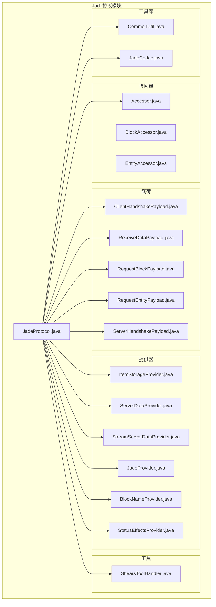
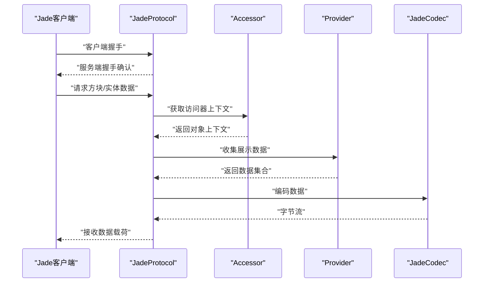
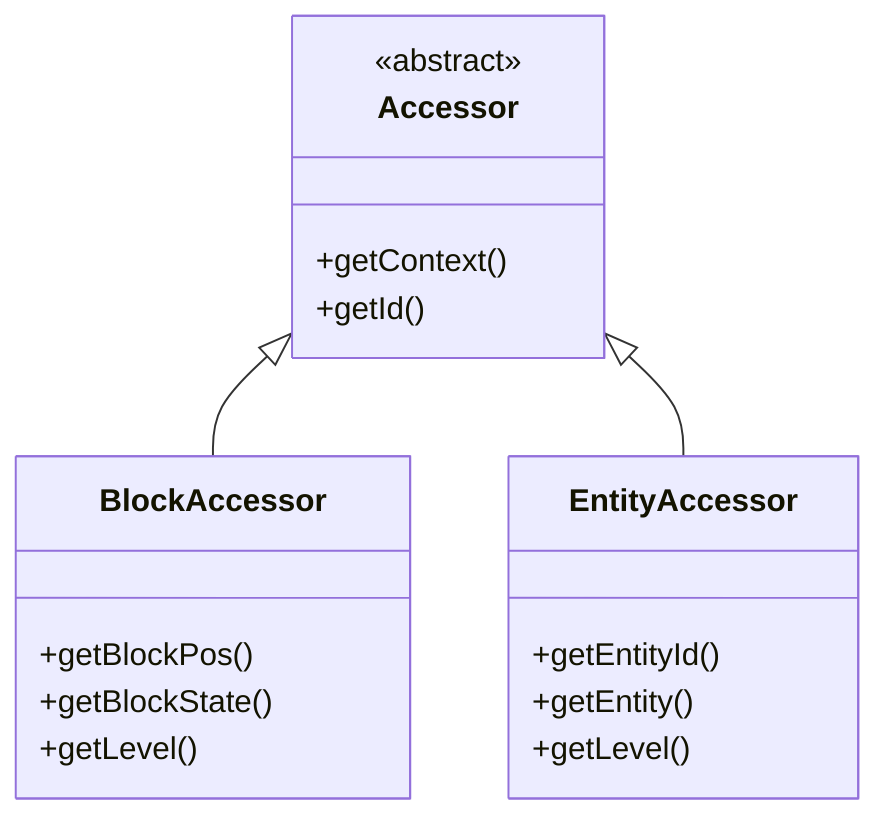
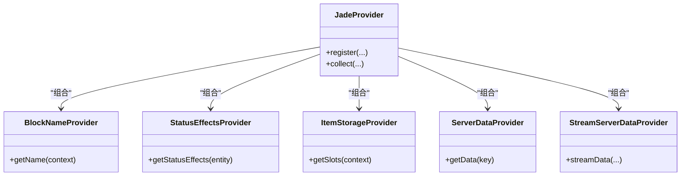
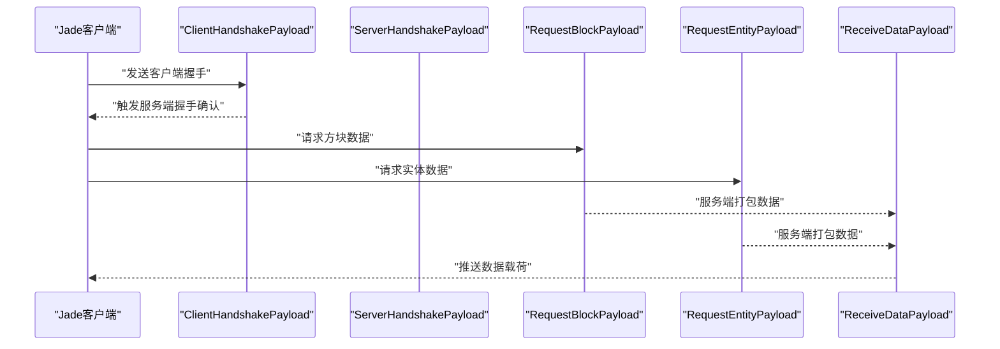
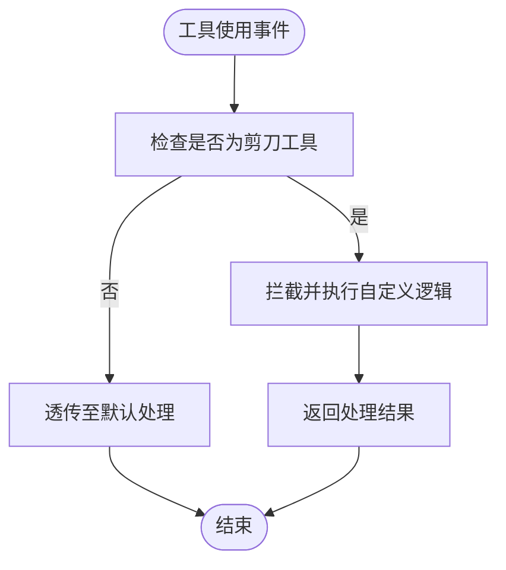
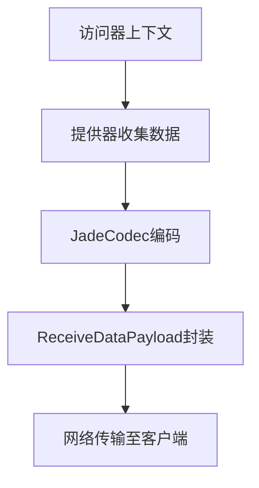
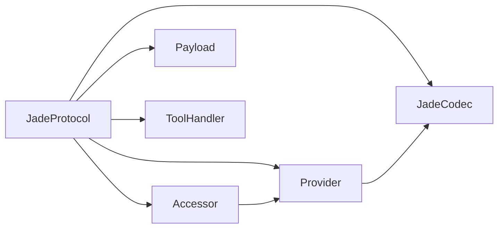

# Jade协议支持

<cite>
**本文引用的文件**
- [JadeProtocol.java](file://lophine-server/src/main/java/org/leavesmc/leaves/protocol/jade/JadeProtocol.java)
- [Accessor.java](file://lophine-server/src/main/java/org/leavesmc/leaves/protocol/jade/accessor/Accessor.java)
- [BlockAccessor.java](file://lophine-server/src/main/java/org/leavesmc/leaves/protocol/jade/accessor/BlockAccessor.java)
- [EntityAccessor.java](file://lophine-server/src/main/java/org/leavesmc/leaves/protocol/jade/accessor/EntityAccessor.java)
- [JadeProtocolConfig.java](file://lophine-server/src/main/java/fun/bm/lophine/config/modules/function/protocol/JadeProtocolConfig.java)
- [ClientHandshakePayload.java](file://lophine-server/src/main/java/org/leavesmc/leaves/protocol/jade/payload/ClientHandshakePayload.java)
- [ReceiveDataPayload.java](file://lophine-server/src/main/java/org/leavesmc/leaves/protocol/jade/payload/ReceiveDataPayload.java)
- [RequestBlockPayload.java](file://lophine-server/src/main/java/org/leavesmc/leaves/protocol/jade/payload/RequestBlockPayload.java)
- [RequestEntityPayload.java](file://lophine-server/src/main/java/org/leavesmc/leaves/protocol/jade/payload/RequestEntityPayload.java)
- [ServerHandshakePayload.java](file://lophine-server/src/main/java/org/leavesmc/leaves/protocol/jade/payload/ServerHandshakePayload.java)
- [ShearsToolHandler.java](file://lophine-server/src/main/java/org/leavesmc/leaves/protocol/jade/tool/ShearsToolHandler.java)
- [CommonUtil.java](file://lophine-server/src/main/java/org/leavesmc/leaves/protocol/jade/util/CommonUtil.java)
- [JadeCodec.java](file://lophine-server/src/main/java/org/leavesmc/leaves/protocol/jade/util/JadeCodec.java)
- [ItemStorageProvider.java](file://lophine-server/src/main/java/org/leavesmc/leaves/protocol/jade/provider/ItemStorageProvider.java)
- [ServerDataProvider.java](file://lophine-server/src/main/java/org/leavesmc/leaves/protocol/jade/provider/ServerDataProvider.java)
- [StreamServerDataProvider.java](file://lophine-server/src/main/java/org/leavesmc/leaves/protocol/jade/provider/StreamServerDataProvider.java)
- [JadeProvider.java](file://lophine-server/src/main/java/org/leavesmc/leaves/protocol/jade/provider/JadeProvider.java)
- [BlockNameProvider.java](file://lophine-server/src/main/java/org/leavesmc/leaves/protocol/jade/provider/block/BlockNameProvider.java)
- [StatusEffectsProvider.java](file://lophine-server/src/main/java/org/leavesmc/leaves/protocol/jade/provider/entity/StatusEffectsProvider.java)
</cite>

## 目录
1. [简介](#简介)
2. [项目结构](#项目结构)
3. [核心组件](#核心组件)
4. [架构总览](#架构总览)
5. [详细组件分析](#详细组件分析)
6. [依赖关系分析](#依赖关系分析)
7. [性能考虑](#性能考虑)
8. [故障排除指南](#故障排除指南)
9. [结论](#结论)
10. [附录](#附录)

## 简介
本文件面向Lophine服务器中Jade协议（Jade Protocol）的支持实现，系统性阐述其架构设计、数据流与传输机制，以及与Jade Mod客户端的交互协议。重点覆盖以下方面：
- 方块信息获取与实体信息展示的提供器体系
- Accessor访问器模式在服务端的实现与职责划分
- 工具处理机制（如剪刀工具）
- 数据收集、编码与传输流程
- 配置项与性能优化建议
- 扩展开发方法与兼容性处理

## 项目结构
Jade协议相关代码位于服务端模块的协议包内，采用分层组织：核心协议类、访问器、提供器、载荷、工具与通用工具库。

图表来源
- [JadeProtocol.java:68-272](file://lophine-server/src/main/java/org/leavesmc/leaves/protocol/jade/JadeProtocol.java#L68-L272)
- [Accessor.java:17-200](file://lophine-server/src/main/java/org/leavesmc/leaves/protocol/jade/accessor/Accessor.java#L17-L200)
- [BlockAccessor.java:17-200](file://lophine-server/src/main/java/org/leavesmc/leaves/protocol/jade/accessor/BlockAccessor.java#L17-L200)
- [EntityAccessor.java:17-200](file://lophine-server/src/main/java/org/leavesmc/leaves/protocol/jade/accessor/EntityAccessor.java#L17-L200)
- [ClientHandshakePayload.java:17-200](file://lophine-server/src/main/java/org/leavesmc/leaves/protocol/jade/payload/ClientHandshakePayload.java#L17-L200)
- [ReceiveDataPayload.java:17-200](file://lophine-server/src/main/java/org/leavesmc/leaves/protocol/jade/payload/ReceiveDataPayload.java#L17-L200)
- [RequestBlockPayload.java:17-200](file://lophine-server/src/main/java/org/leavesmc/leaves/protocol/jade/payload/RequestBlockPayload.java#L17-L200)
- [RequestEntityPayload.java:17-200](file://lophine-server/src/main/java/org/leavesmc/leaves/protocol/jade/payload/RequestEntityPayload.java#L17-L200)
- [ServerHandshakePayload.java:17-200](file://lophine-server/src/main/java/org/leavesmc/leaves/protocol/jade/payload/ServerHandshakePayload.java#L17-L200)
- [ShearsToolHandler.java:17-200](file://lophine-server/src/main/java/org/leavesmc/leaves/protocol/jade/tool/ShearsToolHandler.java#L17-L200)
- [CommonUtil.java:17-200](file://lophine-server/src/main/java/org/leavesmc/leaves/protocol/jade/util/CommonUtil.java#L17-L200)
- [JadeCodec.java:17-200](file://lophine-server/src/main/java/org/leavesmc/leaves/protocol/jade/util/JadeCodec.java#L17-L200)
- [ItemStorageProvider.java:17-200](file://lophine-server/src/main/java/org/leavesmc/leaves/protocol/jade/provider/ItemStorageProvider.java#L17-L200)
- [ServerDataProvider.java:17-200](file://lophine-server/src/main/java/org/leavesmc/leaves/protocol/jade/provider/ServerDataProvider.java#L17-L200)
- [StreamServerDataProvider.java:17-200](file://lophine-server/src/main/java/org/leavesmc/leaves/protocol/jade/provider/StreamServerDataProvider.java#L17-L200)
- [JadeProvider.java:17-200](file://lophine-server/src/main/java/org/leavesmc/leaves/protocol/jade/provider/JadeProvider.java#L17-L200)
- [BlockNameProvider.java:17-200](file://lophine-server/src/main/java/org/leavesmc/leaves/protocol/jade/provider/block/BlockNameProvider.java#L17-L200)
- [StatusEffectsProvider.java:17-200](file://lophine-server/src/main/java/org/leavesmc/leaves/protocol/jade/provider/entity/StatusEffectsProvider.java#L17-L200)

章节来源
- [JadeProtocol.java:68-272](file://lophine-server/src/main/java/org/leavesmc/leaves/protocol/jade/JadeProtocol.java#L68-L272)

## 核心组件
- 协议注册与入口：通过注解注册命名空间为“jade”的协议实现，统一管理握手、请求与响应流程。
- 访问器模式：抽象出对世界对象（方块/实体）的访问接口，屏蔽底层差异，便于扩展与测试。
- 提供器体系：按领域拆分（方块名称、实体状态效果、物品存储、服务端数据等），实现关注点分离。
- 载荷定义：封装客户端与服务端之间的消息格式，确保数据一致性与可扩展性。
- 工具处理：针对特定工具（如剪刀）提供行为拦截与自定义逻辑。
- 编码与传输：基于通用编解码器进行序列化与网络传输。

章节来源
- [JadeProtocol.java:68-272](file://lophine-server/src/main/java/org/leavesmc/leaves/protocol/jade/JadeProtocol.java#L68-L272)
- [Accessor.java:17-200](file://lophine-server/src/main/java/org/leavesmc/leaves/protocol/jade/accessor/Accessor.java#L17-L200)
- [BlockAccessor.java:17-200](file://lophine-server/src/main/java/org/leavesmc/leaves/protocol/jade/accessor/BlockAccessor.java#L17-L200)
- [EntityAccessor.java:17-200](file://lophine-server/src/main/java/org/leavesmc/leaves/protocol/jade/accessor/EntityAccessor.java#L17-L200)
- [ItemStorageProvider.java:17-200](file://lophine-server/src/main/java/org/leavesmc/leaves/protocol/jade/provider/ItemStorageProvider.java#L17-L200)
- [ServerDataProvider.java:17-200](file://lophine-server/src/main/java/org/leavesmc/leaves/protocol/jade/provider/ServerDataProvider.java#L17-L200)
- [StreamServerDataProvider.java:17-200](file://lophine-server/src/main/java/org/leavesmc/leaves/protocol/jade/provider/StreamServerDataProvider.java#L17-L200)
- [JadeProvider.java:17-200](file://lophine-server/src/main/java/org/leavesmc/leaves/protocol/jade/provider/JadeProvider.java#L17-L200)
- [BlockNameProvider.java:17-200](file://lophine-server/src/main/java/org/leavesmc/leaves/protocol/jade/provider/block/BlockNameProvider.java#L17-L200)
- [StatusEffectsProvider.java:17-200](file://lophine-server/src/main/java/org/leavesmc/leaves/protocol/jade/provider/entity/StatusEffectsProvider.java#L17-L200)
- [ClientHandshakePayload.java:17-200](file://lophine-server/src/main/java/org/leavesmc/leaves/protocol/jade/payload/ClientHandshakePayload.java#L17-L200)
- [ReceiveDataPayload.java:17-200](file://lophine-server/src/main/java/org/leavesmc/leaves/protocol/jade/payload/ReceiveDataPayload.java#L17-L200)
- [RequestBlockPayload.java:17-200](file://lophine-server/src/main/java/org/leavesmc/leaves/protocol/jade/payload/RequestBlockPayload.java#L17-L200)
- [RequestEntityPayload.java:17-200](file://lophine-server/src/main/java/org/leavesmc/leaves/protocol/jade/payload/RequestEntityPayload.java#L17-L200)
- [ServerHandshakePayload.java:17-200](file://lophine-server/src/main/java/org/leavesmc/leaves/protocol/jade/payload/ServerHandshakePayload.java#L17-L200)
- [ShearsToolHandler.java:17-200](file://lophine-server/src/main/java/org/leavesmc/leaves/protocol/jade/tool/ShearsToolHandler.java#L17-L200)
- [CommonUtil.java:17-200](file://lophine-server/src/main/java/org/leavesmc/leaves/protocol/jade/util/CommonUtil.java#L17-L200)
- [JadeCodec.java:17-200](file://lophine-server/src/main/java/org/leavesmc/leaves/protocol/jade/util/JadeCodec.java#L17-L200)

## 架构总览
Jade协议采用“协议+访问器+提供器+载荷+工具+编解码”的分层架构，核心流程如下：
- 客户端发起握手，服务端返回握手确认
- 客户端请求方块或实体数据，服务端通过访问器获取对象上下文
- 提供器收集所需信息并交由编解码器序列化
- 服务端发送数据载荷给客户端
- 工具处理模块根据上下文决定是否拦截或修改工具行为

图表来源
- [JadeProtocol.java:68-272](file://lophine-server/src/main/java/org/leavesmc/leaves/protocol/jade/JadeProtocol.java#L68-L272)
- [ClientHandshakePayload.java:17-200](file://lophine-server/src/main/java/org/leavesmc/leaves/protocol/jade/payload/ClientHandshakePayload.java#L17-L200)
- [ReceiveDataPayload.java:17-200](file://lophine-server/src/main/java/org/leavesmc/leaves/protocol/jade/payload/ReceiveDataPayload.java#L17-L200)
- [RequestBlockPayload.java:17-200](file://lophine-server/src/main/java/org/leavesmc/leaves/protocol/jade/payload/RequestBlockPayload.java#L17-L200)
- [RequestEntityPayload.java:17-200](file://lophine-server/src/main/java/org/leavesmc/leaves/protocol/jade/payload/RequestEntityPayload.java#L17-L200)
- [ServerHandshakePayload.java:17-200](file://lophine-server/src/main/java/org/leavesmc/leaves/protocol/jade/payload/ServerHandshakePayload.java#L17-L200)
- [JadeCodec.java:17-200](file://lophine-server/src/main/java/org/leavesmc/leaves/protocol/jade/util/JadeCodec.java#L17-L200)

## 详细组件分析

### 访问器模式（Accessor）
访问器用于抽象对世界对象的访问，屏蔽底层差异，便于扩展与测试。主要职责：
- 统一接口：对外暴露一致的访问能力
- 上下文封装：将对象与其上下文（位置、世界、维度等）绑定
- 可扩展性：新增对象类型时仅需实现对应访问器

图表来源
- [Accessor.java:17-200](file://lophine-server/src/main/java/org/leavesmc/leaves/protocol/jade/accessor/Accessor.java#L17-L200)
- [BlockAccessor.java:17-200](file://lophine-server/src/main/java/org/leavesmc/leaves/protocol/jade/accessor/BlockAccessor.java#L17-L200)
- [EntityAccessor.java:17-200](file://lophine-server/src/main/java/org/leavesmc/leaves/protocol/jade/accessor/EntityAccessor.java#L17-L200)

章节来源
- [Accessor.java:17-200](file://lophine-server/src/main/java/org/leavesmc/leaves/protocol/jade/accessor/Accessor.java#L17-L200)
- [BlockAccessor.java:17-200](file://lophine-server/src/main/java/org/leavesmc/leaves/protocol/jade/accessor/BlockAccessor.java#L17-L200)
- [EntityAccessor.java:17-200](file://lophine-server/src/main/java/org/leavesmc/leaves/protocol/jade/accessor/EntityAccessor.java#L17-L200)

### 提供器体系（Provider）
提供器负责从访问器上下文中收集展示所需的信息，按领域拆分：
- 方块名称提供器：用于显示方块的本地化名称
- 实体状态效果提供器：用于显示实体的状态效果列表
- 物品存储提供器：用于展示容器类方块的物品存储信息
- 服务端数据提供器：用于同步服务端自定义数据
- 流式服务端数据提供器：用于批量或流式数据传输
- Jade提供器：作为顶层聚合器，协调多个提供器

图表来源
- [JadeProvider.java:17-200](file://lophine-server/src/main/java/org/leavesmc/leaves/protocol/jade/provider/JadeProvider.java#L17-L200)
- [BlockNameProvider.java:17-200](file://lophine-server/src/main/java/org/leavesmc/leaves/protocol/jade/provider/block/BlockNameProvider.java#L17-L200)
- [StatusEffectsProvider.java:17-200](file://lophine-server/src/main/java/org/leavesmc/leaves/protocol/jade/provider/entity/StatusEffectsProvider.java#L17-L200)
- [ItemStorageProvider.java:17-200](file://lophine-server/src/main/java/org/leavesmc/leaves/protocol/jade/provider/ItemStorageProvider.java#L17-L200)
- [ServerDataProvider.java:17-200](file://lophine-server/src/main/java/org/leavesmc/leaves/protocol/jade/provider/ServerDataProvider.java#L17-L200)
- [StreamServerDataProvider.java:17-200](file://lophine-server/src/main/java/org/leavesmc/leaves/protocol/jade/provider/StreamServerDataProvider.java#L17-L200)

章节来源
- [JadeProvider.java:17-200](file://lophine-server/src/main/java/org/leavesmc/leaves/protocol/jade/provider/JadeProvider.java#L17-L200)
- [BlockNameProvider.java:17-200](file://lophine-server/src/main/java/org/leavesmc/leaves/protocol/jade/provider/block/BlockNameProvider.java#L17-L200)
- [StatusEffectsProvider.java:17-200](file://lophine-server/src/main/java/org/leavesmc/leaves/protocol/jade/provider/entity/StatusEffectsProvider.java#L17-L200)
- [ItemStorageProvider.java:17-200](file://lophine-server/src/main/java/org/leavesmc/leaves/protocol/jade/provider/ItemStorageProvider.java#L17-L200)
- [ServerDataProvider.java:17-200](file://lophine-server/src/main/java/org/leavesmc/leaves/protocol/jade/provider/ServerDataProvider.java#L17-L200)
- [StreamServerDataProvider.java:17-200](file://lophine-server/src/main/java/org/leavesmc/leaves/protocol/jade/provider/StreamServerDataProvider.java#L17-L200)

### 载荷与握手流程
握手与数据请求/接收通过专用载荷类实现，确保消息格式稳定且可扩展：
- 客户端握手载荷：用于建立会话
- 服务端握手载荷：用于确认会话
- 请求方块载荷：客户端请求某方块信息
- 请求实体载荷：客户端请求某实体信息
- 接收数据载荷：服务端向客户端推送数据

图表来源
- [ClientHandshakePayload.java:17-200](file://lophine-server/src/main/java/org/leavesmc/leaves/protocol/jade/payload/ClientHandshakePayload.java#L17-L200)
- [ServerHandshakePayload.java:17-200](file://lophine-server/src/main/java/org/leavesmc/leaves/protocol/jade/payload/ServerHandshakePayload.java#L17-L200)
- [RequestBlockPayload.java:17-200](file://lophine-server/src/main/java/org/leavesmc/leaves/protocol/jade/payload/RequestBlockPayload.java#L17-L200)
- [RequestEntityPayload.java:17-200](file://lophine-server/src/main/java/org/leavesmc/leaves/protocol/jade/payload/RequestEntityPayload.java#L17-L200)
- [ReceiveDataPayload.java:17-200](file://lophine-server/src/main/java/org/leavesmc/leaves/protocol/jade/payload/ReceiveDataPayload.java#L17-L200)

章节来源
- [ClientHandshakePayload.java:17-200](file://lophine-server/src/main/java/org/leavesmc/leaves/protocol/jade/payload/ClientHandshakePayload.java#L17-L200)
- [ServerHandshakePayload.java:17-200](file://lophine-server/src/main/java/org/leavesmc/leaves/protocol/jade/payload/ServerHandshakePayload.java#L17-L200)
- [RequestBlockPayload.java:17-200](file://lophine-server/src/main/java/org/leavesmc/leaves/protocol/jade/payload/RequestBlockPayload.java#L17-L200)
- [RequestEntityPayload.java:17-200](file://lophine-server/src/main/java/org/leavesmc/leaves/protocol/jade/payload/RequestEntityPayload.java#L17-L200)
- [ReceiveDataPayload.java:17-200](file://lophine-server/src/main/java/org/leavesmc/leaves/protocol/jade/payload/ReceiveDataPayload.java#L17-L200)

### 工具处理机制（ShearsToolHandler）
工具处理模块用于拦截或修改特定工具的行为，例如剪刀工具：
- 拦截工具使用事件
- 根据上下文执行自定义逻辑
- 返回处理结果以影响客户端体验

图表来源
- [ShearsToolHandler.java:17-200](file://lophine-server/src/main/java/org/leavesmc/leaves/protocol/jade/tool/ShearsToolHandler.java#L17-L200)

章节来源
- [ShearsToolHandler.java:17-200](file://lophine-server/src/main/java/org/leavesmc/leaves/protocol/jade/tool/ShearsToolHandler.java#L17-L200)

### 数据收集、编码与传输流程
- 数据收集：访问器提供上下文，提供器按领域收集信息
- 编码：使用通用编解码器将数据序列化为字节流
- 传输：通过协议载荷发送到客户端

图表来源
- [JadeCodec.java:17-200](file://lophine-server/src/main/java/org/leavesmc/leaves/protocol/jade/util/JadeCodec.java#L17-L200)
- [ReceiveDataPayload.java:17-200](file://lophine-server/src/main/java/org/leavesmc/leaves/protocol/jade/payload/ReceiveDataPayload.java#L17-L200)

章节来源
- [JadeCodec.java:17-200](file://lophine-server/src/main/java/org/leavesmc/leaves/protocol/jade/util/JadeCodec.java#L17-L200)
- [ReceiveDataPayload.java:17-200](file://lophine-server/src/main/java/org/leavesmc/leaves/protocol/jade/payload/ReceiveDataPayload.java#L17-L200)

### 配置选项与使用指南
Jade协议支持通过配置模块启用/禁用与参数调整：
- 启用开关：通过配置类控制协议是否生效
- 功能分类：位于协议功能模块下，便于集中管理

章节来源
- [JadeProtocolConfig.java:7-8](file://lophine-server/src/main/java/fun/bm/lophine/config/modules/function/protocol/JadeProtocolConfig.java#L7-L8)

### 扩展开发方法
- 新增提供器：实现相应接口并在顶层提供器中注册
- 新增访问器：实现访问器接口以适配新的对象类型
- 新增载荷：定义新的消息格式并注册到协议处理器
- 新增工具处理：实现工具拦截逻辑并注册到工具处理链

章节来源
- [JadeProvider.java:17-200](file://lophine-server/src/main/java/org/leavesmc/leaves/protocol/jade/provider/JadeProvider.java#L17-L200)
- [Accessor.java:17-200](file://lophine-server/src/main/java/org/leavesmc/leaves/protocol/jade/accessor/Accessor.java#L17-L200)
- [ClientHandshakePayload.java:17-200](file://lophine-server/src/main/java/org/leavesmc/leaves/protocol/jade/payload/ClientHandshakePayload.java#L17-L200)
- [ShearsToolHandler.java:17-200](file://lophine-server/src/main/java/org/leavesmc/leaves/protocol/jade/tool/ShearsToolHandler.java#L17-L200)

## 依赖关系分析
Jade协议内部各组件之间存在清晰的依赖关系，遵循高内聚、低耦合的设计原则：
- 协议类依赖访问器、提供器、载荷与编解码器
- 访问器与提供器相互独立，通过协议类协调
- 工具处理模块独立于主数据流，仅在需要时介入

图表来源
- [JadeProtocol.java:68-272](file://lophine-server/src/main/java/org/leavesmc/leaves/protocol/jade/JadeProtocol.java#L68-L272)
- [Accessor.java:17-200](file://lophine-server/src/main/java/org/leavesmc/leaves/protocol/jade/accessor/Accessor.java#L17-L200)
- [JadeCodec.java:17-200](file://lophine-server/src/main/java/org/leavesmc/leaves/protocol/jade/util/JadeCodec.java#L17-L200)

章节来源
- [JadeProtocol.java:68-272](file://lophine-server/src/main/java/org/leavesmc/leaves/protocol/jade/JadeProtocol.java#L68-L272)

## 性能考虑
- 提供器聚合：通过顶层提供器统一调度，减少重复计算
- 编解码优化：使用高效的编解码器，避免大对象频繁序列化
- 访问器缓存：对常用上下文进行缓存，降低查询成本
- 工具处理短路：仅在必要时拦截工具事件，避免无谓开销
- 分片传输：对于大量数据采用流式或分片传输策略

## 故障排除指南
- 握手失败：检查客户端与服务端版本兼容性与协议注册状态
- 数据为空：确认提供器是否正确注册与收集数据
- 工具无效：验证工具处理模块是否被正确调用
- 编码异常：检查编解码器与载荷字段映射是否一致

章节来源
- [ClientHandshakePayload.java:17-200](file://lophine-server/src/main/java/org/leavesmc/leaves/protocol/jade/payload/ClientHandshakePayload.java#L17-L200)
- [ReceiveDataPayload.java:17-200](file://lophine-server/src/main/java/org/leavesmc/leaves/protocol/jade/payload/ReceiveDataPayload.java#L17-L200)
- [JadeCodec.java:17-200](file://lophine-server/src/main/java/org/leavesmc/leaves/protocol/jade/util/JadeCodec.java#L17-L200)

## 结论
Jade协议在Lophine中通过清晰的分层架构实现了与Jade Mod客户端的高效交互。访问器模式提供了稳定的对象访问接口，提供器体系实现了关注点分离，载荷与编解码器保证了数据的一致性与可扩展性。配合配置化管理与工具处理机制，整体具备良好的可维护性与扩展性。

## 附录
- 兼容性处理：通过配置开关与版本校验确保与不同版本Jade客户端的兼容
- 最佳实践：优先使用提供器聚合、缓存热点上下文、避免不必要的序列化