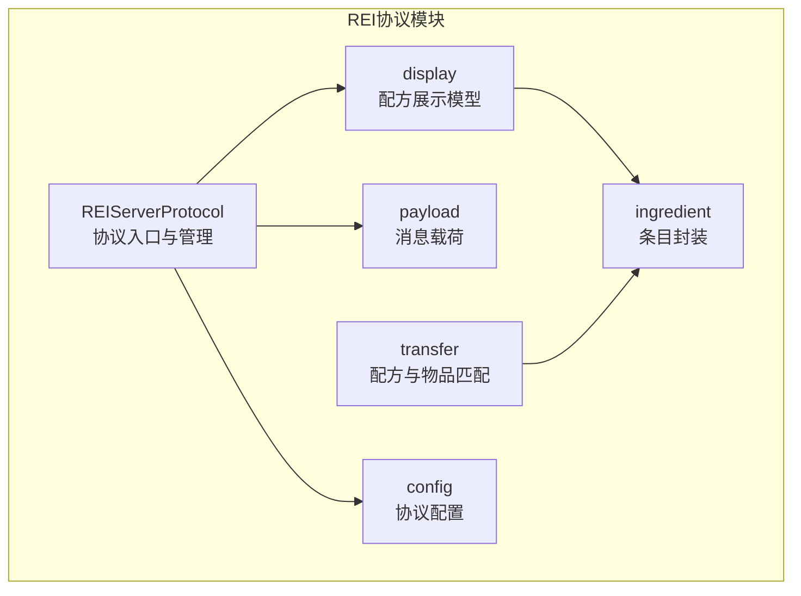
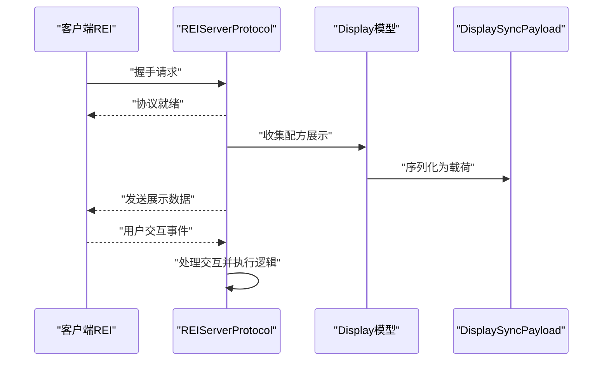
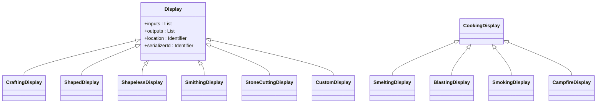
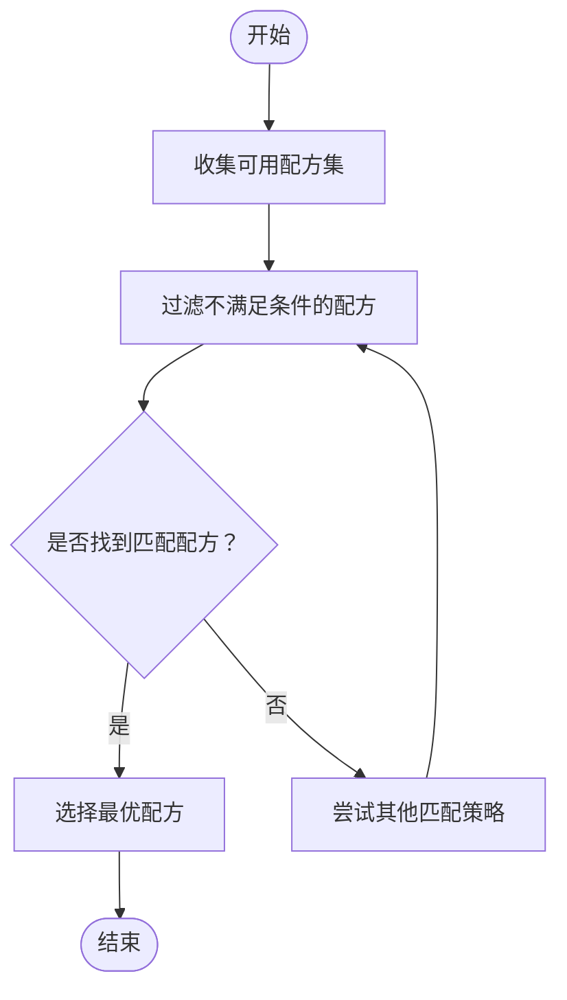
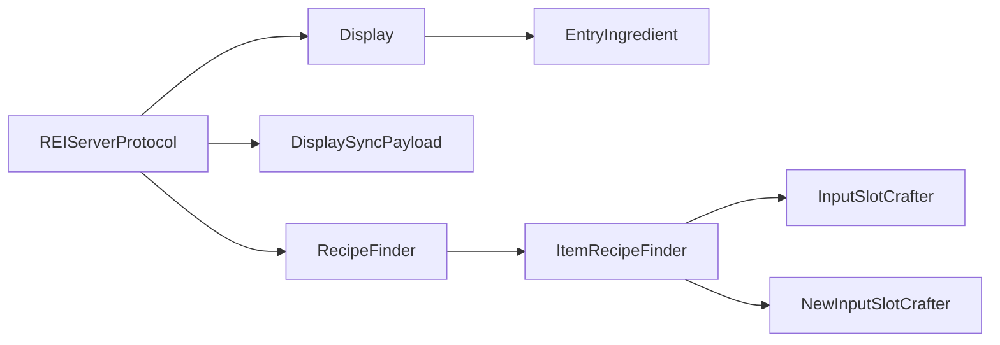

# REI协议支持

<cite>
**本文档引用的文件**
- [REIServerProtocol.java](file://lophine-server/src/main/java/org/leavesmc/leaves/protocol/rei/REIServerProtocol.java)
- [Display.java](file://lophine-server/src/main/java/org/leavesmc/leaves/protocol/rei/display/Display.java)
- [CraftingDisplay.java](file://lophine-server/src/main/java/org/leavesmc/leaves/protocol/rei/display/CraftingDisplay.java)
- [SmeltingDisplay.java](file://lophine-server/src/main/java/org/leavesmc/leaves/protocol/rei/display/SmeltingDisplay.java)
- [BlastingDisplay.java](file://lophine-server/src/main/java/org/leavesmc/leaves/protocol/rei/display/BlastingDisplay.java)
- [SmokingDisplay.java](file://lophine-server/src/main/java/org/leavesmc/leaves/protocol/rei/display/SmokingDisplay.java)
- [CampfireDisplay.java](file://lophine-server/src/main/java/org/leavesmc/leaves/protocol/rei/display/CampfireDisplay.java)
- [CookingDisplay.java](file://lophine-server/src/main/java/org/leavesmc/leaves/protocol/rei/display/CookingDisplay.java)
- [ShapedDisplay.java](file://lophine-server/src/main/java/org/leavesmc/leaves/protocol/rei/display/ShapedDisplay.java)
- [ShapelessDisplay.java](file://lophine-server/src/main/java/org/leavesmc/leaves/protocol/rei/display/ShapelessDisplay.java)
- [SmithingDisplay.java](file://lophine-server/src/main/java/org/leavesmc/leaves/protocol/rei/display/SmithingDisplay.java)
- [StoneCuttingDisplay.java](file://lophine-server/src/main/java/org/leavesmc/leaves/protocol/rei/display/StoneCuttingDisplay.java)
- [EntryIngredient.java](file://lophine-server/src/main/java/org/leavesmc/leaves/protocol/rei/ingredient/EntryIngredient.java)
- [DisplaySyncPayload.java](file://lophine-server/src/main/java/org/leavesmc/leaves/protocol/rei/payload/DisplaySyncPayload.java)
- [RecipeFinder.java](file://lophine-server/src/main/java/org/leavesmc/leaves/protocol/rei/transfer/RecipeFinder.java)
- [ItemRecipeFinder.java](file://lophine-server/src/main/java/org/leavesmc/leaves/protocol/rei/transfer/ItemRecipeFinder.java)
- [InputSlotCrafter.java](file://lophine-server/src/main/java/org/leavesmc/leaves/protocol/rei/transfer/slot/InputSlotCrafter.java)
- [NewInputSlotCrafter.java](file://lophine-server/src/main/java/org/leavesmc/leaves/protocol/rei/transfer/slot/NewInputSlotCrafter.java)
- [REIServerProtocolConfig.java](file://lophine-server/src/main/java/fun/bm/lophine/config/modules/function/protocol/REIServerProtocolConfig.java)
</cite>

## 目录
1. [简介](#简介)
2. [项目结构](#项目结构)
3. [核心组件](#核心组件)
4. [架构总览](#架构总览)
5. [详细组件分析](#详细组件分析)
6. [依赖关系分析](#依赖关系分析)
7. [性能考虑](#性能考虑)
8. [故障排除指南](#故障排除指南)
9. [结论](#结论)
10. [附录](#附录)

## 简介
本文件面向Lophine服务器中REI（Roughly Enough Items）协议的支持实现，系统性阐述REIServerProtocol的工作原理与机制，覆盖配方展示、物品传输与交互处理；详解REI协议的数据结构与消息格式；梳理Display接口族（如CraftingDisplay、SmeltingDisplay等）的设计与用途；解析RecipeFinder配方查找算法与ItemRecipeFinder物品匹配机制；给出REI协议配置项的说明与使用建议；并提供与客户端REI模组的兼容性与同步机制说明，以及集成示例与最佳实践。

## 项目结构
REI协议支持位于服务器模块的协议包下，采用按功能域分层的组织方式：
- 协议入口与管理：REIServerProtocol负责注册、握手、消息分发与生命周期管理
- 展示模型：display包定义了各类配方展示对象（如CraftingDisplay、SmeltingDisplay等），统一序列化标识与数据结构
- 数据载荷：payload包承载客户端-服务端之间的消息交换（如DisplaySyncPayload）
- 物品与配方：ingredient包封装REI条目（EntryIngredient），transfer包实现配方查找与物品匹配（RecipeFinder、ItemRecipeFinder）
- 配置：config.modules.function.protocol.REIServerProtocolConfig提供可调参数

**图表来源**
- [REIServerProtocol.java](file://lophine-server/src/main/java/org/leavesmc/leaves/protocol/rei/REIServerProtocol.java)
- [Display.java](file://lophine-server/src/main/java/org/leavesmc/leaves/protocol/rei/display/Display.java)
- [DisplaySyncPayload.java](file://lophine-server/src/main/java/org/leavesmc/leaves/protocol/rei/payload/DisplaySyncPayload.java)
- [EntryIngredient.java](file://lophine-server/src/main/java/org/leavesmc/leaves/protocol/rei/ingredient/EntryIngredient.java)
- [RecipeFinder.java](file://lophine-server/src/main/java/org/leavesmc/leaves/protocol/rei/transfer/RecipeFinder.java)
- [ItemRecipeFinder.java](file://lophine-server/src/main/java/org/leavesmc/leaves/protocol/rei/transfer/ItemRecipeFinder.java)
- [REIServerProtocolConfig.java](file://lophine-server/src/main/java/fun/bm/lophine/config/modules/function/protocol/REIServerProtocolConfig.java)

**章节来源**
- [REIServerProtocol.java](file://lophine-server/src/main/java/org/leavesmc/leaves/protocol/rei/REIServerProtocol.java)
- [REIServerProtocolConfig.java](file://lophine-server/src/main/java/fun/bm/lophine/config/modules/function/protocol/REIServerProtocolConfig.java)

## 核心组件
- 协议入口与管理：REIServerProtocol负责协议注册、握手流程、消息接收与分发、生命周期控制
- 展示模型：Display及其子类统一描述配方展示数据，包含输入输出条目、序列化标识与位置信息
- 条目封装：EntryIngredient封装REI条目，支持序列化与匹配
- 消息载荷：DisplaySyncPayload承载展示数据的同步消息
- 匹配算法：RecipeFinder与ItemRecipeFinder提供配方查找与物品匹配能力
- 配置：REIServerProtocolConfig提供协议相关开关与行为参数

**章节来源**
- [REIServerProtocol.java](file://lophine-server/src/main/java/org/leavesmc/leaves/protocol/rei/REIServerProtocol.java)
- [Display.java](file://lophine-server/src/main/java/org/leavesmc/leaves/protocol/rei/display/Display.java)
- [EntryIngredient.java](file://lophine-server/src/main/java/org/leavesmc/leaves/protocol/rei/ingredient/EntryIngredient.java)
- [DisplaySyncPayload.java](file://lophine-server/src/main/java/org/leavesmc/leaves/protocol/rei/payload/DisplaySyncPayload.java)
- [RecipeFinder.java](file://lophine-server/src/main/java/org/leavesmc/leaves/protocol/rei/transfer/RecipeFinder.java)
- [ItemRecipeFinder.java](file://lophine-server/src/main/java/org/leavesmc/leaves/protocol/rei/transfer/ItemRecipeFinder.java)
- [REIServerProtocolConfig.java](file://lophine-server/src/main/java/fun/bm/lophine/config/modules/function/protocol/REIServerProtocolConfig.java)

## 架构总览
REI协议在服务器侧以REIServerProtocol为核心，通过自定义载荷与展示模型与客户端REI进行双向通信。整体流程如下：
- 客户端发起握手请求
- 服务器完成协议注册与初始化
- 服务器周期性或按需推送展示数据（DisplaySyncPayload）
- 客户端渲染并交互，触发后续操作（如点击、拖拽等）

**图表来源**
- [REIServerProtocol.java](file://lophine-server/src/main/java/org/leavesmc/leaves/protocol/rei/REIServerProtocol.java)
- [DisplaySyncPayload.java](file://lophine-server/src/main/java/org/leavesmc/leaves/protocol/rei/payload/DisplaySyncPayload.java)
- [Display.java](file://lophine-server/src/main/java/org/leavesmc/leaves/protocol/rei/display/Display.java)

## 详细组件分析

### 协议入口与管理：REIServerProtocol
- 职责：注册协议标识、处理握手、接收与分发消息、维护会话状态
- 关键点：基于自定义载荷的注册与转发，确保与客户端REI版本兼容
- 生命周期：初始化、运行、关闭阶段分别承担不同职责

**章节来源**
- [REIServerProtocol.java](file://lophine-server/src/main/java/org/leavesmc/leaves/protocol/rei/REIServerProtocol.java)

### 展示模型：Display接口族
Display作为所有配方展示的抽象基类，定义了输入输出条目、序列化标识与位置信息等通用字段。各具体实现覆盖不同配方类型：
- CraftingDisplay：工作台合成配方
- SmeltingDisplay：熔炉配方
- BlastingDisplay：高炉配方
- SmokingDisplay：烟熏配方
- CampfireDisplay：营火配方
- CookingDisplay：烹饪配方基类（被上述多种烹饪类型继承）
- ShapedDisplay：有图案合成配方
- ShapelessDisplay：无图案合成配方
- SmithingDisplay：锻造配方
- StoneCuttingDisplay：切石配方
- CustomDisplay：自定义配方展示

**图表来源**
- [Display.java](file://lophine-server/src/main/java/org/leavesmc/leaves/protocol/rei/display/Display.java)
- [CraftingDisplay.java](file://lophine-server/src/main/java/org/leavesmc/leaves/protocol/rei/display/CraftingDisplay.java)
- [SmeltingDisplay.java](file://lophine-server/src/main/java/org/leavesmc/leaves/protocol/rei/display/SmeltingDisplay.java)
- [BlastingDisplay.java](file://lophine-server/src/main/java/org/leavesmc/leaves/protocol/rei/display/BlastingDisplay.java)
- [SmokingDisplay.java](file://lophine-server/src/main/java/org/leavesmc/leaves/protocol/rei/display/SmokingDisplay.java)
- [CampfireDisplay.java](file://lophine-server/src/main/java/org/leavesmc/leaves/protocol/rei/display/CampfireDisplay.java)
- [CookingDisplay.java](file://lophine-server/src/main/java/org/leavesmc/leaves/protocol/rei/display/CookingDisplay.java)
- [ShapedDisplay.java](file://lophine-server/src/main/java/org/leavesmc/leaves/protocol/rei/display/ShapedDisplay.java)
- [ShapelessDisplay.java](file://lophine-server/src/main/java/org/leavesmc/leaves/protocol/rei/display/ShapelessDisplay.java)
- [SmithingDisplay.java](file://lophine-server/src/main/java/org/leavesmc/leaves/protocol/rei/display/SmithingDisplay.java)
- [StoneCuttingDisplay.java](file://lophine-server/src/main/java/org/leavesmc/leaves/protocol/rei/display/StoneCuttingDisplay.java)

**章节来源**
- [Display.java](file://lophine-server/src/main/java/org/leavesmc/leaves/protocol/rei/display/Display.java)
- [CraftingDisplay.java](file://lophine-server/src/main/java/org/leavesmc/leaves/protocol/rei/display/CraftingDisplay.java)
- [SmeltingDisplay.java](file://lophine-server/src/main/java/org/leavesmc/leaves/protocol/rei/display/SmeltingDisplay.java)
- [BlastingDisplay.java](file://lophine-server/src/main/java/org/leavesmc/leaves/protocol/rei/display/BlastingDisplay.java)
- [SmokingDisplay.java](file://lophine-server/src/main/java/org/leavesmc/leaves/protocol/rei/display/SmokingDisplay.java)
- [CampfireDisplay.java](file://lophine-server/src/main/java/org/leavesmc/leaves/protocol/rei/display/CampfireDisplay.java)
- [CookingDisplay.java](file://lophine-server/src/main/java/org/leavesmc/leaves/protocol/rei/display/CookingDisplay.java)
- [ShapedDisplay.java](file://lophine-server/src/main/java/org/leavesmc/leaves/protocol/rei/display/ShapedDisplay.java)
- [ShapelessDisplay.java](file://lophine-server/src/main/java/org/leavesmc/leaves/protocol/rei/display/ShapelessDisplay.java)
- [SmithingDisplay.java](file://lophine-server/src/main/java/org/leavesmc/leaves/protocol/rei/display/SmithingDisplay.java)
- [StoneCuttingDisplay.java](file://lophine-server/src/main/java/org/leavesmc/leaves/protocol/rei/display/StoneCuttingDisplay.java)

### 条目封装：EntryIngredient
- 职责：封装REI条目，支持序列化与匹配，作为Display输入输出的基础单元
- 关键点：提供条目的标准化表示，便于跨配方类型复用与序列化

**章节来源**
- [EntryIngredient.java](file://lophine-server/src/main/java/org/leavesmc/leaves/protocol/rei/ingredient/EntryIngredient.java)

### 消息载荷：DisplaySyncPayload
- 职责：承载展示数据的同步消息，包含序列化后的展示对象集合
- 关键点：用于服务器向客户端推送配方展示列表，触发渲染与交互

**章节来源**
- [DisplaySyncPayload.java](file://lophine-server/src/main/java/org/leavesmc/leaves/protocol/rei/payload/DisplaySyncPayload.java)

### 配方查找与物品匹配：RecipeFinder与ItemRecipeFinder
- RecipeFinder：通用配方查找器，负责在可用配方集中定位匹配的配方
- ItemRecipeFinder：基于物品的配方匹配器，结合输入槽位与物品条目进行匹配
- 输入槽位适配：InputSlotCrafter与NewInputSlotCrafter提供不同版本的槽位适配策略

**图表来源**
- [RecipeFinder.java](file://lophine-server/src/main/java/org/leavesmc/leaves/protocol/rei/transfer/RecipeFinder.java)
- [ItemRecipeFinder.java](file://lophine-server/src/main/java/org/leavesmc/leaves/protocol/rei/transfer/ItemRecipeFinder.java)
- [InputSlotCrafter.java](file://lophine-server/src/main/java/org/leavesmc/leaves/protocol/rei/transfer/slot/InputSlotCrafter.java)
- [NewInputSlotCrafter.java](file://lophine-server/src/main/java/org/leavesmc/leaves/protocol/rei/transfer/slot/NewInputSlotCrafter.java)

**章节来源**
- [RecipeFinder.java](file://lophine-server/src/main/java/org/leavesmc/leaves/protocol/rei/transfer/RecipeFinder.java)
- [ItemRecipeFinder.java](file://lophine-server/src/main/java/org/leavesmc/leaves/protocol/rei/transfer/ItemRecipeFinder.java)
- [InputSlotCrafter.java](file://lophine-server/src/main/java/org/leavesmc/leaves/protocol/rei/transfer/slot/InputSlotCrafter.java)
- [NewInputSlotCrafter.java](file://lophine-server/src/main/java/org/leavesmc/leaves/protocol/rei/transfer/slot/NewInputSlotCrafter.java)

### 配置选项：REIServerProtocolConfig
- 职责：提供REI协议相关的行为开关与参数配置，便于在运行时调整协议行为
- 建议：根据服务器规模与性能需求合理设置，避免过度推送导致网络压力

**章节来源**
- [REIServerProtocolConfig.java](file://lophine-server/src/main/java/fun/bm/lophine/config/modules/function/protocol/REIServerProtocolConfig.java)

## 依赖关系分析
REI协议模块内部依赖关系清晰，遵循“协议入口—展示模型—条目封装—消息载荷—匹配算法”的层次化设计，降低耦合度并提升可扩展性。

**图表来源**
- [REIServerProtocol.java](file://lophine-server/src/main/java/org/leavesmc/leaves/protocol/rei/REIServerProtocol.java)
- [Display.java](file://lophine-server/src/main/java/org/leavesmc/leaves/protocol/rei/display/Display.java)
- [EntryIngredient.java](file://lophine-server/src/main/java/org/leavesmc/leaves/protocol/rei/ingredient/EntryIngredient.java)
- [DisplaySyncPayload.java](file://lophine-server/src/main/java/org/leavesmc/leaves/protocol/rei/payload/DisplaySyncPayload.java)
- [RecipeFinder.java](file://lophine-server/src/main/java/org/leavesmc/leaves/protocol/rei/transfer/RecipeFinder.java)
- [ItemRecipeFinder.java](file://lophine-server/src/main/java/org/leavesmc/leaves/protocol/rei/transfer/ItemRecipeFinder.java)
- [InputSlotCrafter.java](file://lophine-server/src/main/java/org/leavesmc/leaves/protocol/rei/transfer/slot/InputSlotCrafter.java)
- [NewInputSlotCrafter.java](file://lophine-server/src/main/java/org/leavesmc/leaves/protocol/rei/transfer/slot/NewInputSlotCrafter.java)

**章节来源**
- [REIServerProtocol.java](file://lophine-server/src/main/java/org/leavesmc/leaves/protocol/rei/REIServerProtocol.java)
- [Display.java](file://lophine-server/src/main/java/org/leavesmc/leaves/protocol/rei/display/Display.java)
- [EntryIngredient.java](file://lophine-server/src/main/java/org/leavesmc/leaves/protocol/rei/ingredient/EntryIngredient.java)
- [DisplaySyncPayload.java](file://lophine-server/src/main/java/org/leavesmc/leaves/protocol/rei/payload/DisplaySyncPayload.java)
- [RecipeFinder.java](file://lophine-server/src/main/java/org/leavesmc/leaves/protocol/rei/transfer/RecipeFinder.java)
- [ItemRecipeFinder.java](file://lophine-server/src/main/java/org/leavesmc/leaves/protocol/rei/transfer/ItemRecipeFinder.java)
- [InputSlotCrafter.java](file://lophine-server/src/main/java/org/leavesmc/leaves/protocol/rei/transfer/slot/InputSlotCrafter.java)
- [NewInputSlotCrafter.java](file://lophine-server/src/main/java/org/leavesmc/leaves/protocol/rei/transfer/slot/NewInputSlotCrafter.java)

## 性能考虑
- 展示数据推送频率：避免频繁全量推送，建议按需增量更新
- 条目序列化开销：优化EntryIngredient的序列化与反序列化路径
- 配方查找复杂度：RecipeFinder应尽量减少不必要的遍历，优先使用索引或缓存
- 网络带宽：合理设置推送批次大小，避免单次载荷过大
- 客户端渲染压力：控制同时展示的配方数量，避免UI卡顿

## 故障排除指南
- 握手失败：检查协议标识与版本兼容性，确认REIServerProtocol已正确注册
- 展示为空：核查Display集合生成逻辑与过滤条件，确保存在可用配方
- 匹配异常：验证ItemRecipeFinder的输入槽位与条目匹配规则，检查RecipeFinder的筛选条件
- 序列化错误：确认EntryIngredient与Display的序列化标识一致，避免跨版本不兼容
- 性能问题：评估推送频率与批次大小，必要时启用缓存与增量更新

**章节来源**
- [REIServerProtocol.java](file://lophine-server/src/main/java/org/leavesmc/leaves/protocol/rei/REIServerProtocol.java)
- [DisplaySyncPayload.java](file://lophine-server/src/main/java/org/leavesmc/leaves/protocol/rei/payload/DisplaySyncPayload.java)
- [RecipeFinder.java](file://lophine-server/src/main/java/org/leavesmc/leaves/protocol/rei/transfer/RecipeFinder.java)
- [ItemRecipeFinder.java](file://lophine-server/src/main/java/org/leavesmc/leaves/protocol/rei/transfer/ItemRecipeFinder.java)

## 结论
Lophine的REI协议支持通过清晰的层次化架构实现了配方展示、物品传输与交互处理的完整闭环。Display接口族提供了对多类型配方的统一建模，RecipeFinder与ItemRecipeFinder保证了高效的配方查找与匹配，配合可配置的协议参数与消息载荷，既满足了与客户端REI模组的兼容性，又兼顾了性能与可维护性。建议在生产环境中结合业务场景合理配置推送策略与匹配算法，持续监控性能指标并迭代优化。

## 附录
- 集成步骤建议：
  1) 在服务器启动时注册REIServerProtocol
  2) 收集可用配方并转换为Display对象
  3) 将Display序列化为DisplaySyncPayload并推送至客户端
  4) 处理客户端交互事件并执行相应逻辑
- 最佳实践：
  - 使用增量更新而非全量推送
  - 对常用配方建立索引，加速RecipeFinder查询
  - 控制单次推送的展示数量，避免UI过载
  - 保持EntryIngredient与Display序列化标识稳定，避免版本迁移问题