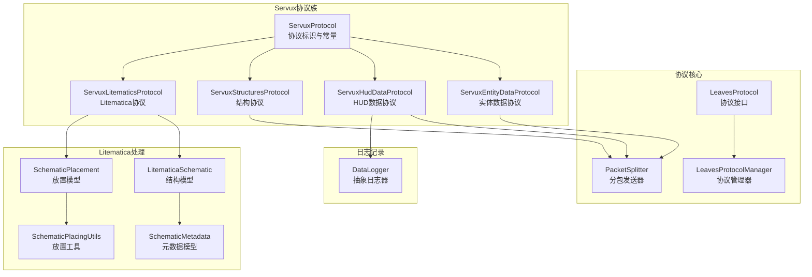
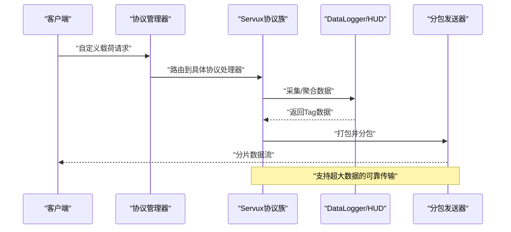
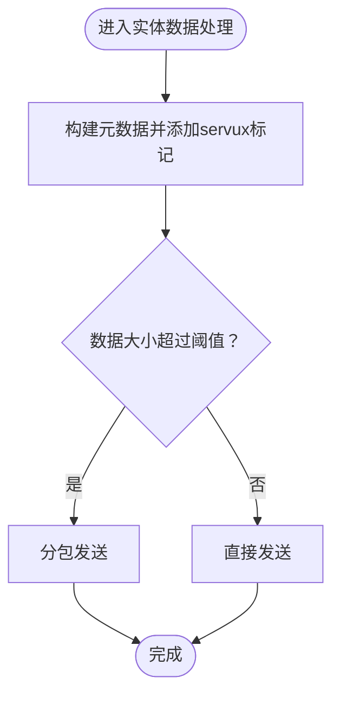
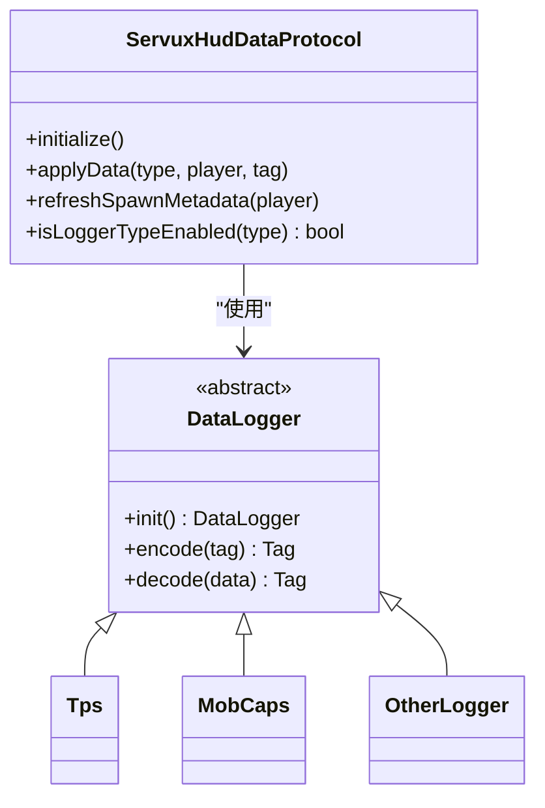
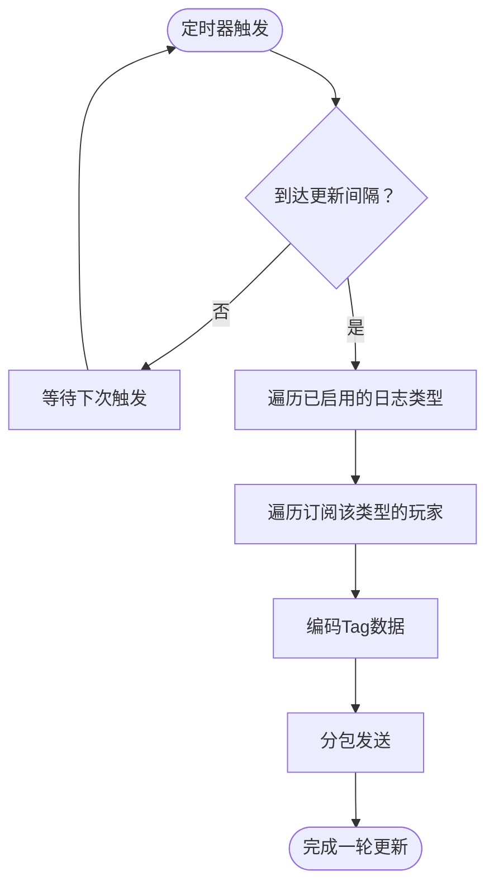
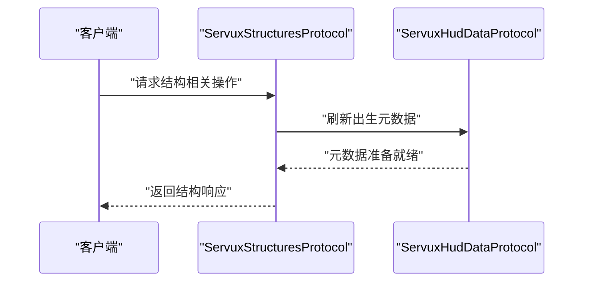
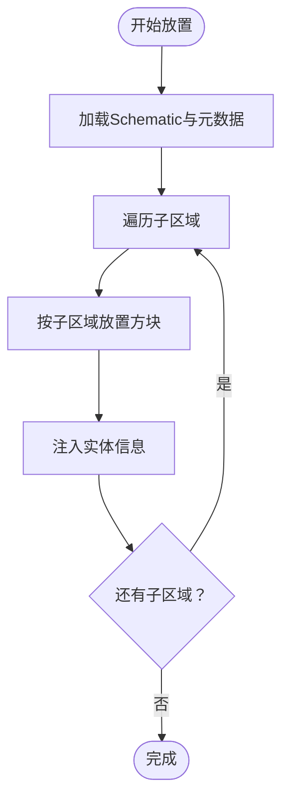
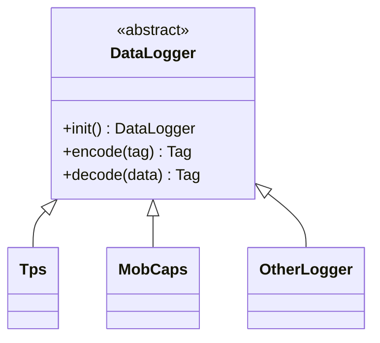
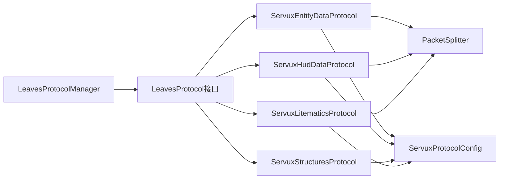

# Servux协议支持

<cite>
**本文引用的文件**
- [ServuxProtocol.java](file://lophine-server/src/main/java/org/leavesmc/leaves/protocol/servux/ServuxProtocol.java)
- [ServuxEntityDataProtocol.java](file://lophine-server/src/main/java/org/leavesmc/leaves/protocol/servux/ServuxEntityDataProtocol.java)
- [ServuxHudDataProtocol.java](file://lophine-server/src/main/java/org/leavesmc/leaves/protocol/servux/ServuxHudDataProtocol.java)
- [ServuxStructuresProtocol.java](file://lophine-server/src/main/java/org/leavesmc/leaves/protocol/servux/ServuxStructuresProtocol.java)
- [ServuxLitematicsProtocol.java](file://lophine-server/src/main/java/org/leavesmc/leaves/protocol/servux/litematics/ServuxLitematicsProtocol.java)
- [LitematicaSchematic.java](file://lophine-server/src/main/java/org/leavesmc/leaves/protocol/servux/litematics/LitematicaSchematic.java)
- [SchematicMetadata.java](file://lophine-server/src/main/java/org/leavesmc/leaves/protocol/servux/litematics/SchematicMetadata.java)
- [SchematicPlacement.java](file://lophine-server/src/main/java/org/leavesmc/leaves/protocol/servux/litematics/placement/SchematicPlacement.java)
- [SchematicPlacingUtils.java](file://lophine-server/src/main/java/org/leavesmc/leaves/protocol/servux/litematics/utils/SchematicPlacingUtils.java)
- [DataLogger.java](file://lophine-server/src/main/java/org/leavesmc/leaves/protocol/servux/logger/DataLogger.java)
- [ServuxProtocolConfig.java](file://lophine-server/src/main/java/fun/bm/lophine/config/modules/function/protocol/ServuxProtocolConfig.java)
- [LeavesProtocol.java](file://lophine-server/src/main/java/org/leavesmc/leaves/protocol/core/LeavesProtocol.java)
- [LeavesProtocolManager.java](file://lophine-server/src/main/java/org/leavesmc/leaves/protocol/core/LeavesProtocolManager.java)
- [PacketSplitter.java](file://lophine-server/src/main/java/org/leavesmc/leaves/protocol/servux/PacketSplitter.java)
</cite>

## 目录
1. [引言](#引言)
2. [项目结构](#项目结构)
3. [核心组件](#核心组件)
4. [架构总览](#架构总览)
5. [详细组件分析](#详细组件分析)
6. [依赖关系分析](#依赖关系分析)
7. [性能考虑](#性能考虑)
8. [故障排除指南](#故障排除指南)
9. [结论](#结论)
10. [附录](#附录)

## 引言
本文件系统性阐述Lophine对Servux协议的支持，覆盖整体架构、子协议职责、Litematica结构数据处理、Schematic元数据管理、DataLogger数据记录体系、传输协议与数据格式规范、集成与配置方法、与Servux服务端的通信机制与数据同步策略，并提供故障排除与性能优化建议。目标是帮助开发者与运维人员快速理解并正确使用Servux协议能力。

## 项目结构
Servux协议在Lophine中以模块化方式组织，核心位于服务器端协议层，按功能划分为实体数据、HUD数据、结构（Litematica）与日志记录四个主要子协议，配合通用的协议注册与分包发送工具。



图示来源
- [LeavesProtocol.java](file://lophine-server/src/main/java/org/leavesmc/leaves/protocol/core/LeavesProtocol.java)
- [LeavesProtocolManager.java](file://lophine-server/src/main/java/org/leavesmc/leaves/protocol/core/LeavesProtocolManager.java)
- [PacketSplitter.java](file://lophine-server/src/main/java/org/leavesmc/leaves/protocol/servux/PacketSplitter.java)
- [ServuxProtocol.java](file://lophine-server/src/main/java/org/leavesmc/leaves/protocol/servux/ServuxProtocol.java)
- [ServuxEntityDataProtocol.java](file://lophine-server/src/main/java/org/leavesmc/leaves/protocol/servux/ServuxEntityDataProtocol.java)
- [ServuxHudDataProtocol.java](file://lophine-server/src/main/java/org/leavesmc/leaves/protocol/servux/ServuxHudDataProtocol.java)
- [ServuxStructuresProtocol.java](file://lophine-server/src/main/java/org/leavesmc/leaves/protocol/servux/ServuxStructuresProtocol.java)
- [ServuxLitematicsProtocol.java](file://lophine-server/src/main/java/org/leavesmc/leaves/protocol/servux/litematics/ServuxLitematicsProtocol.java)
- [LitematicaSchematic.java](file://lophine-server/src/main/java/org/leavesmc/leaves/protocol/servux/litematics/LitematicaSchematic.java)
- [SchematicMetadata.java](file://lophine-server/src/main/java/org/leavesmc/leaves/protocol/servux/litematics/SchematicMetadata.java)
- [SchematicPlacement.java](file://lophine-server/src/main/java/org/leavesmc/leaves/protocol/servux/litematics/placement/SchematicPlacement.java)
- [SchematicPlacingUtils.java](file://lophine-server/src/main/java/org/leavesmc/leaves/protocol/servux/litematics/utils/SchematicPlacingUtils.java)
- [DataLogger.java](file://lophine-server/src/main/java/org/leavesmc/leaves/protocol/servux/logger/DataLogger.java)

章节来源
- [ServuxProtocol.java](file://lophine-server/src/main/java/org/leavesmc/leaves/protocol/servux/ServuxProtocol.java)
- [ServuxEntityDataProtocol.java](file://lophine-server/src/main/java/org/leavesmc/leaves/protocol/servux/ServuxEntityDataProtocol.java)
- [ServuxHudDataProtocol.java](file://lophine-server/src/main/java/org/leavesmc/leaves/protocol/servux/ServuxHudDataProtocol.java)
- [ServuxStructuresProtocol.java](file://lophine-server/src/main/java/org/leavesmc/leaves/protocol/servux/ServuxStructuresProtocol.java)
- [ServuxLitematicsProtocol.java](file://lophine-server/src/main/java/org/leavesmc/leaves/protocol/servux/litematics/ServuxLitematicsProtocol.java)
- [LitematicaSchematic.java](file://lophine-server/src/main/java/org/leavesmc/leaves/protocol/servux/litematics/LitematicaSchematic.java)
- [SchematicMetadata.java](file://lophine-server/src/main/java/org/leavesmc/leaves/protocol/servux/litematics/SchematicMetadata.java)
- [SchematicPlacement.java](file://lophine-server/src/main/java/org/leavesmc/leaves/protocol/servux/litematics/placement/SchematicPlacement.java)
- [SchematicPlacingUtils.java](file://lophine-server/src/main/java/org/leavesmc/leaves/protocol/servux/litematics/utils/SchematicPlacingUtils.java)
- [DataLogger.java](file://lophine-server/src/main/java/org/leavesmc/leaves/protocol/servux/logger/DataLogger.java)
- [ServuxProtocolConfig.java](file://lophine-server/src/main/java/fun/bm/lophine/config/modules/function/protocol/ServuxProtocolConfig.java)
- [LeavesProtocol.java](file://lophine-server/src/main/java/org/leavesmc/leaves/protocol/core/LeavesProtocol.java)
- [LeavesProtocolManager.java](file://lophine-server/src/main/java/org/leavesmc/leaves/protocol/core/LeavesProtocolManager.java)
- [PacketSplitter.java](file://lophine-server/src/main/java/org/leavesmc/leaves/protocol/servux/PacketSplitter.java)

## 核心组件
- 协议标识与常量：定义Servux协议的命名空间与版本字符串，作为所有子协议通道的基础标识。
- 实体数据协议：负责向客户端推送实体相关的可视化或调试数据，包含分包发送与元数据标记。
- HUD数据协议：负责HUD相关数据的收集、过滤、聚合与分发，支持多种日志类型与更新周期控制。
- 结构协议：协调与Litematica相关的结构请求与响应流程。
- Litematica协议：封装Schematic的序列化/反序列化、元数据读取与分包传输。
- 数据记录器（DataLogger）：抽象各类日志类型的采集与编码，支持按类型初始化与并发存储。
- 协议管理与注册：通过统一接口注册各子协议，确保生命周期与事件分发一致。
- 分包发送器：对大包进行拆分与重装，保证网络传输稳定性。

章节来源
- [ServuxProtocol.java](file://lophine-server/src/main/java/org/leavesmc/leaves/protocol/servux/ServuxProtocol.java)
- [ServuxEntityDataProtocol.java](file://lophine-server/src/main/java/org/leavesmc/leaves/protocol/servux/ServuxEntityDataProtocol.java)
- [ServuxHudDataProtocol.java](file://lophine-server/src/main/java/org/leavesmc/leaves/protocol/servux/ServuxHudDataProtocol.java)
- [ServuxStructuresProtocol.java](file://lophine-server/src/main/java/org/leavesmc/leaves/protocol/servux/ServuxStructuresProtocol.java)
- [ServuxLitematicsProtocol.java](file://lophine-server/src/main/java/org/leavesmc/leaves/protocol/servux/litematics/ServuxLitematicsProtocol.java)
- [DataLogger.java](file://lophine-server/src/main/java/org/leavesmc/leaves/protocol/servux/logger/DataLogger.java)
- [LeavesProtocol.java](file://lophine-server/src/main/java/org/leavesmc/leaves/protocol/core/LeavesProtocol.java)
- [LeavesProtocolManager.java](file://lophine-server/src/main/java/org/leavesmc/leaves/protocol/core/LeavesProtocolManager.java)
- [PacketSplitter.java](file://lophine-server/src/main/java/org/leavesmc/leaves/protocol/servux/PacketSplitter.java)

## 架构总览
下图展示Servux协议在Lophine中的总体交互：客户端通过自定义频道发起请求，服务器端根据协议类型路由到对应处理器；处理器完成数据组装后，使用分包器进行安全传输；同时HUD协议可结合DataLogger进行周期性数据记录与共享。



图示来源
- [LeavesProtocolManager.java](file://lophine-server/src/main/java/org/leavesmc/leaves/protocol/core/LeavesProtocolManager.java)
- [ServuxEntityDataProtocol.java](file://lophine-server/src/main/java/org/leavesmc/leaves/protocol/servux/ServuxEntityDataProtocol.java)
- [ServuxHudDataProtocol.java](file://lophine-server/src/main/java/org/leavesmc/leaves/protocol/servux/ServuxHudDataProtocol.java)
- [ServuxLitematicsProtocol.java](file://lophine-server/src/main/java/org/leavesmc/leaves/protocol/servux/litematics/ServuxLitematicsProtocol.java)
- [PacketSplitter.java](file://lophine-server/src/main/java/org/leavesmc/leaves/protocol/servux/PacketSplitter.java)

## 详细组件分析

### Servux实体数据协议（ServuxEntityDataProtocol）
- 职责：向客户端推送实体相关的可视化/调试数据，包含元数据标记与分包发送。
- 关键点：
  - 使用协议通道标识符进行消息路由。
  - 在发送前添加“servux”版本标记，便于客户端识别。
  - 对大数据采用分包发送，避免单包过大导致丢包或超时。
  - 配置开关控制是否启用该协议。
- 处理流程：



图示来源
- [ServuxEntityDataProtocol.java](file://lophine-server/src/main/java/org/leavesmc/leaves/protocol/servux/ServuxEntityDataProtocol.java)
- [PacketSplitter.java](file://lophine-server/src/main/java/org/leavesmc/leaves/protocol/servux/PacketSplitter.java)

章节来源
- [ServuxEntityDataProtocol.java](file://lophine-server/src/main/java/org/leavesmc/leaves/protocol/servux/ServuxEntityDataProtocol.java)
- [ServuxProtocolConfig.java](file://lophine-server/src/main/java/fun/bm/lophine/config/modules/function/protocol/ServuxProtocolConfig.java)

### Servux HUD数据协议（ServuxHudDataProtocol）
- 职责：周期性采集与分发HUD相关数据，支持多种日志类型、按玩家粒度隔离与并发存储。
- 关键点：
  - 内置日志器集合，按类型初始化并缓存。
  - 维护“玩家→日志类型列表”的映射，决定每个玩家订阅哪些数据。
  - 提供按类型启用/禁用的检查逻辑，支持基于配置的白名单过滤。
  - 支持元数据与日志协议双通道，可选择是否共享种子等信息。
  - 基于时间戳的更新间隔控制，避免频繁刷新。
- 类关系图：



图示来源
- [ServuxHudDataProtocol.java](file://lophine-server/src/main/java/org/leavesmc/leaves/protocol/servux/ServuxHudDataProtocol.java)
- [DataLogger.java](file://lophine-server/src/main/java/org/leavesmc/leaves/protocol/servux/logger/DataLogger.java)

- 处理流程（周期性更新）：



图示来源
- [ServuxHudDataProtocol.java](file://lophine-server/src/main/java/org/leavesmc/leaves/protocol/servux/ServuxHudDataProtocol.java)
- [PacketSplitter.java](file://lophine-server/src/main/java/org/leavesmc/leaves/protocol/servux/PacketSplitter.java)

章节来源
- [ServuxHudDataProtocol.java](file://lophine-server/src/main/java/org/leavesmc/leaves/protocol/servux/ServuxHudDataProtocol.java)
- [DataLogger.java](file://lophine-server/src/main/java/org/leavesmc/leaves/protocol/servux/logger/DataLogger.java)
- [ServuxProtocolConfig.java](file://lophine-server/src/main/java/fun/bm/lophine/config/modules/function/protocol/ServuxProtocolConfig.java)

### Servux结构协议（ServuxStructuresProtocol）
- 职责：协调结构相关请求与响应，例如请求生成/刷新特定元数据。
- 关键点：
  - 在协议处理中包含对“请求生成出生元数据”的分支处理，用于触发HUD侧的刷新。
- 流程示意：



图示来源
- [ServuxStructuresProtocol.java](file://lophine-server/src/main/java/org/leavesmc/leaves/protocol/servux/ServuxStructuresProtocol.java)
- [ServuxHudDataProtocol.java](file://lophine-server/src/main/java/org/leavesmc/leaves/protocol/servux/ServuxHudDataProtocol.java)

章节来源
- [ServuxStructuresProtocol.java](file://lophine-server/src/main/java/org/leavesmc/leaves/protocol/servux/ServuxStructuresProtocol.java)

### Litematica结构与元数据处理
- LitematicaSchematic：封装子区域集合与Schematic元数据，提供从NBT读取的静态工厂方法。
- SchematicMetadata：记录名称、作者、描述、包围盒尺寸、创建/修改时间、Minecraft数据版本、Schema、文件类型、区域数量、总体积、总方块数、缩略图像素数据等。
- SchematicPlacement：承载Schematic与原点位置、名称，支持从NBT恢复。
- SchematicPlacingUtils：提供放置逻辑工具，按子区域与实体信息进行批量放置与实体注入。
- 数据模型图：

```mermaid
erDiagram
LITEMATICA_SCHEMATIC {
map<string, subregion> subRegions
schematicmetadata metadata
}
SCHEMATIC_METADATA {
string name
string author
string description
vec3i enclosingSize
long timeCreated
long timeModified
int minecraftDataVersion
int version
enum schema
enum fileType
int regionCount
long totalVolume
long totalBlocks
bytes thumbnailPixelData
}
SUBREGION {
string name
list<entityinfo> entities
list<blockinfo> blocks
}
LITEMATICA_SCHEMATIC ||--o{ SUBREGION : "包含"
LITEMATICA_SCHEMATIC }o--|| SCHEMATIC_METADATA : "拥有"
```

图示来源
- [LitematicaSchematic.java](file://lophine-server/src/main/java/org/leavesmc/leaves/protocol/servux/litematics/LitematicaSchematic.java)
- [SchematicMetadata.java](file://lophine-server/src/main/java/org/leavesmc/leaves/protocol/servux/litematics/SchematicMetadata.java)

- 处理流程（放置与实体注入）：



图示来源
- [SchematicPlacingUtils.java](file://lophine-server/src/main/java/org/leavesmc/leaves/protocol/servux/litematics/utils/SchematicPlacingUtils.java)
- [SchematicPlacement.java](file://lophine-server/src/main/java/org/leavesmc/leaves/protocol/servux/litematics/placement/SchematicPlacement.java)

章节来源
- [ServuxLitematicsProtocol.java](file://lophine-server/src/main/java/org/leavesmc/leaves/protocol/servux/litematics/ServuxLitematicsProtocol.java)
- [LitematicaSchematic.java](file://lophine-server/src/main/java/org/leavesmc/leaves/protocol/servux/litematics/LitematicaSchematic.java)
- [SchematicMetadata.java](file://lophine-server/src/main/java/org/leavesmc/leaves/protocol/servux/litematics/SchematicMetadata.java)
- [SchematicPlacement.java](file://lophine-server/src/main/java/org/leavesmc/leaves/protocol/servux/litematics/placement/SchematicPlacement.java)
- [SchematicPlacingUtils.java](file://lophine-server/src/main/java/org/leavesmc/leaves/protocol/servux/litematics/utils/SchematicPlacingUtils.java)

### 数据记录系统（DataLogger）
- 抽象类：定义类型枚举、工厂函数、编解码接口与初始化方法。
- 典型实现：TPS、生物群系容量等日志类型，均继承自DataLogger<Tag>。
- 并发存储：使用优化的并发表结构，按类型→玩家→Tag进行存储，支持高并发读写。
- 类层次图：



图示来源
- [DataLogger.java](file://lophine-server/src/main/java/org/leavesmc/leaves/protocol/servux/logger/DataLogger.java)

章节来源
- [DataLogger.java](file://lophine-server/src/main/java/org/leavesmc/leaves/protocol/servux/logger/DataLogger.java)

## 依赖关系分析
- 协议注册：所有Servux子协议实现LeavesProtocol接口并通过LeavesProtocolManager进行注册，确保统一的生命周期与事件分发。
- 通道与标识：各协议通过ServuxProtocol.id()生成唯一通道标识，避免冲突。
- 分包策略：实体数据、HUD数据、Litematica协议均依赖PacketSplitter进行大包拆分，保障传输可靠性。
- 配置耦合：ServuxProtocolConfig提供全局开关与参数，影响协议启用状态、更新间隔、日志类型白名单等。



图示来源
- [LeavesProtocolManager.java](file://lophine-server/src/main/java/org/leavesmc/leaves/protocol/core/LeavesProtocolManager.java)
- [LeavesProtocol.java](file://lophine-server/src/main/java/org/leavesmc/leaves/protocol/core/LeavesProtocol.java)
- [ServuxEntityDataProtocol.java](file://lophine-server/src/main/java/org/leavesmc/leaves/protocol/servux/ServuxEntityDataProtocol.java)
- [ServuxHudDataProtocol.java](file://lophine-server/src/main/java/org/leavesmc/leaves/protocol/servux/ServuxHudDataProtocol.java)
- [ServuxStructuresProtocol.java](file://lophine-server/src/main/java/org/leavesmc/leaves/protocol/servux/ServuxStructuresProtocol.java)
- [ServuxLitematicsProtocol.java](file://lophine-server/src/main/java/org/leavesmc/leaves/protocol/servux/litematics/ServuxLitematicsProtocol.java)
- [PacketSplitter.java](file://lophine-server/src/main/java/org/leavesmc/leaves/protocol/servux/PacketSplitter.java)
- [ServuxProtocolConfig.java](file://lophine-server/src/main/java/fun/bm/lophine/config/modules/function/protocol/ServuxProtocolConfig.java)

章节来源
- [LeavesProtocolManager.java](file://lophine-server/src/main/java/org/leavesmc/leaves/protocol/core/LeavesProtocolManager.java)
- [LeavesProtocol.java](file://lophine-server/src/main/java/org/leavesmc/leaves/protocol/core/LeavesProtocol.java)
- [ServuxProtocolConfig.java](file://lophine-server/src/main/java/fun/bm/lophine/config/modules/function/protocol/ServuxProtocolConfig.java)
- [PacketSplitter.java](file://lophine-server/src/main/java/org/leavesmc/leaves/protocol/servux/PacketSplitter.java)

## 性能考虑
- 分包传输：对大体量数据（如实体数据、Litematica结构）采用分包发送，降低丢包率与内存峰值。
- 更新节流：HUD协议通过配置的更新间隔与按玩家粒度的订阅列表，避免不必要的重复计算与网络开销。
- 并发存储：DataLogger使用优化的并发表，减少锁竞争，提升多线程场景下的吞吐。
- 元数据复用：实体与HUD协议在发送前统一添加“servux”标记，便于客户端快速识别与缓存。
- 建议：
  - 合理设置HUD更新间隔，避免过于频繁的全量刷新。
  - 控制启用的日志类型数量，优先保留关键指标。
  - 对超大Schematic采用分批放置与异步注入策略，避免主线程阻塞。

[本节为通用性能指导，无需引用具体文件]

## 故障排除指南
- 客户端无法识别协议：
  - 确认服务器端已在实体与HUD协议中添加“servux”标记。
  - 检查ServuxProtocolConfig的启用状态与通道标识是否一致。
- 数据不更新或延迟严重：
  - 核对HUD更新间隔配置与当前tick计数是否满足触发条件。
  - 检查订阅列表中是否存在目标玩家与日志类型。
- 传输失败或丢包：
  - 确认大包已通过PacketSplitter进行分包发送。
  - 适当降低单次数据量或提高网络缓冲区配置。
- Litematica放置异常：
  - 校验Schematic元数据完整性与Schema版本匹配。
  - 检查子区域与实体列表是否为空或越界。

章节来源
- [ServuxEntityDataProtocol.java](file://lophine-server/src/main/java/org/leavesmc/leaves/protocol/servux/ServuxEntityDataProtocol.java)
- [ServuxHudDataProtocol.java](file://lophine-server/src/main/java/org/leavesmc/leaves/protocol/servux/ServuxHudDataProtocol.java)
- [ServuxLitematicsProtocol.java](file://lophine-server/src/main/java/org/leavesmc/leaves/protocol/servux/litematics/ServuxLitematicsProtocol.java)
- [PacketSplitter.java](file://lophine-server/src/main/java/org/leavesmc/leaves/protocol/servux/PacketSplitter.java)
- [ServuxProtocolConfig.java](file://lophine-server/src/main/java/fun/bm/lophine/config/modules/function/protocol/ServuxProtocolConfig.java)

## 结论
Lophine对Servux协议的支持通过模块化的子协议设计实现了清晰的职责分离：实体数据协议负责可视化/调试信息推送，HUD协议负责周期性数据采集与分发，结构协议与Litematica协议共同完成Schematic的解析与放置，DataLogger体系则提供了可扩展的日志采集框架。配合分包发送与配置驱动的启用策略，整体方案在功能完整性与性能稳定性之间取得了良好平衡。

[本节为总结性内容，无需引用具体文件]

## 附录

### 数据格式与传输协议规范（概要）
- 通道命名：统一使用ServuxProtocol.id("...")生成通道标识，避免冲突。
- 版本标记：在实体与HUD数据中添加“servux”字段，便于客户端识别版本兼容性。
- 分包策略：对超过阈值的数据采用分包发送，确保网络可靠性。
- NBT结构：Litematica协议使用标准NBT结构，包含元数据与子区域信息，遵循Minecraft数据版本与Schema约定。

章节来源
- [ServuxProtocol.java](file://lophine-server/src/main/java/org/leavesmc/leaves/protocol/servux/ServuxProtocol.java)
- [ServuxEntityDataProtocol.java](file://lophine-server/src/main/java/org/leavesmc/leaves/protocol/servux/ServuxEntityDataProtocol.java)
- [ServuxHudDataProtocol.java](file://lophine-server/src/main/java/org/leavesmc/leaves/protocol/servux/ServuxHudDataProtocol.java)
- [ServuxLitematicsProtocol.java](file://lophine-server/src/main/java/org/leavesmc/leaves/protocol/servux/litematics/ServuxLitematicsProtocol.java)
- [LitematicaSchematic.java](file://lophine-server/src/main/java/org/leavesmc/leaves/protocol/servux/litematics/LitematicaSchematic.java)
- [SchematicMetadata.java](file://lophine-server/src/main/java/org/leavesmc/leaves/protocol/servux/litematics/SchematicMetadata.java)
- [PacketSplitter.java](file://lophine-server/src/main/java/org/leavesmc/leaves/protocol/servux/PacketSplitter.java)

### 集成与配置方法
- 启用Servux协议：在ServuxProtocolConfig中开启相应协议开关（实体、HUD、结构、Litematica）。
- 配置HUD更新：设置更新间隔与日志类型白名单，控制数据推送频率与范围。
- 元数据共享：根据需要开启HUD元数据共享与种子共享选项。
- 分包阈值：根据网络环境调整分包阈值，平衡传输效率与稳定性。

章节来源
- [ServuxProtocolConfig.java](file://lophine-server/src/main/java/fun/bm/lophine/config/modules/function/protocol/ServuxProtocolConfig.java)
- [ServuxHudDataProtocol.java](file://lophine-server/src/main/java/org/leavesmc/leaves/protocol/servux/ServuxHudDataProtocol.java)
- [ServuxEntityDataProtocol.java](file://lophine-server/src/main/java/org/leavesmc/leaves/protocol/servux/ServuxEntityDataProtocol.java)
- [ServuxLitematicsProtocol.java](file://lophine-server/src/main/java/org/leavesmc/leaves/protocol/servux/litematics/ServuxLitematicsProtocol.java)