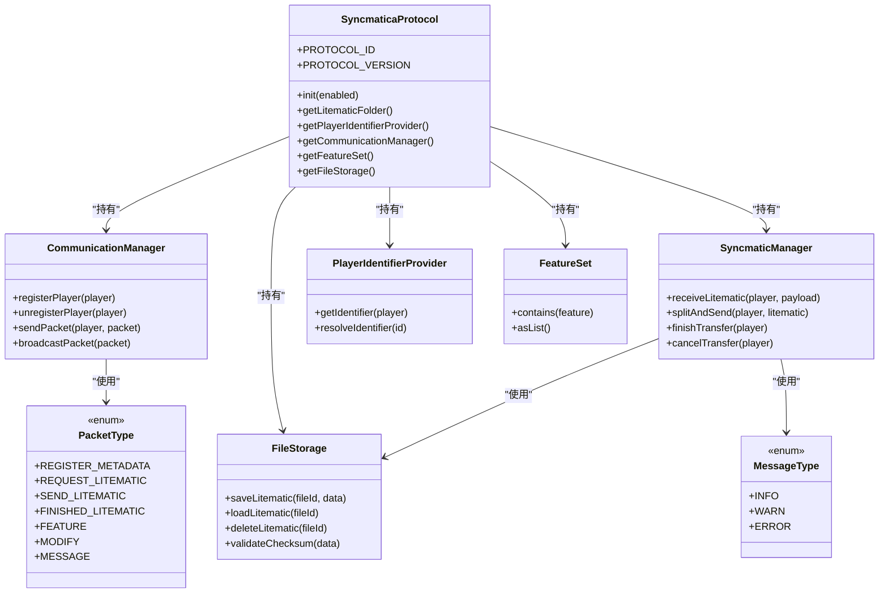
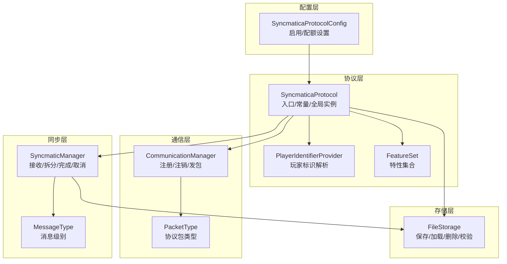
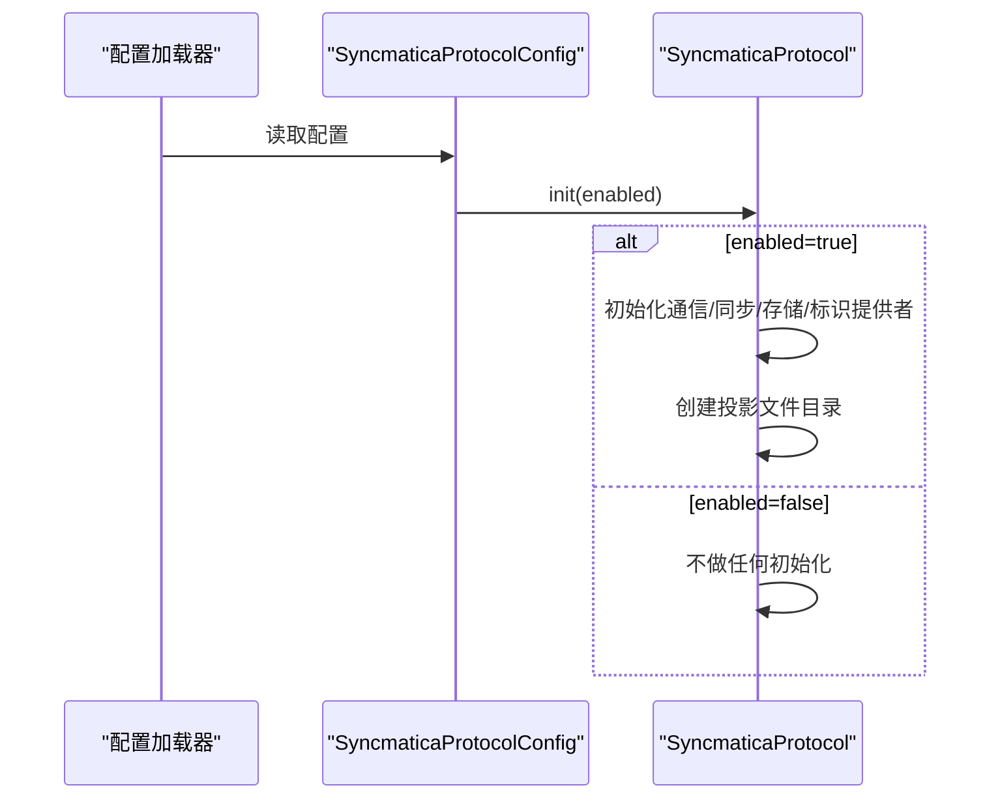
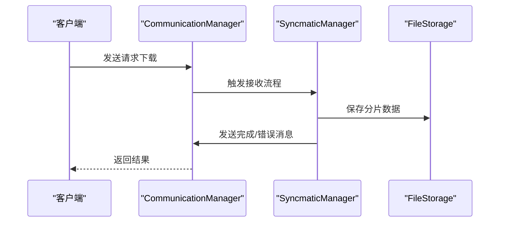
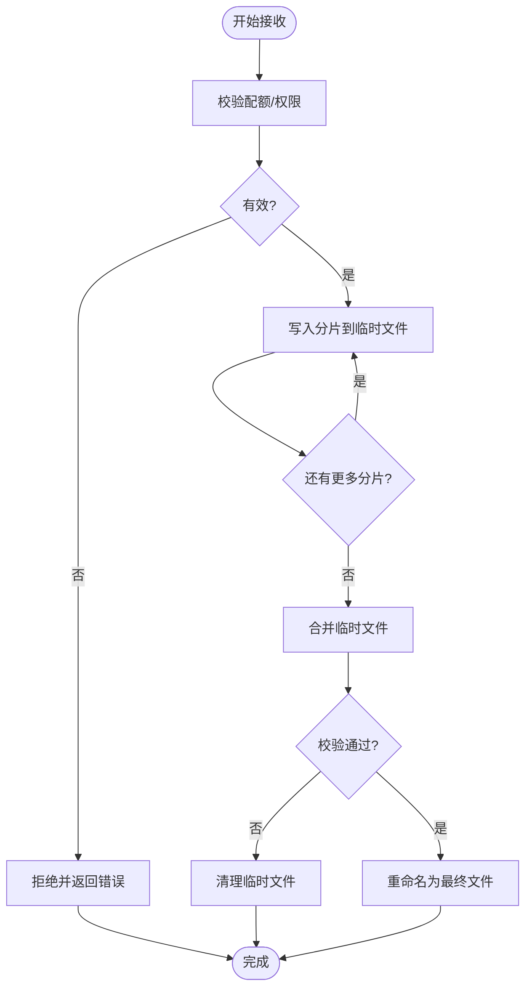
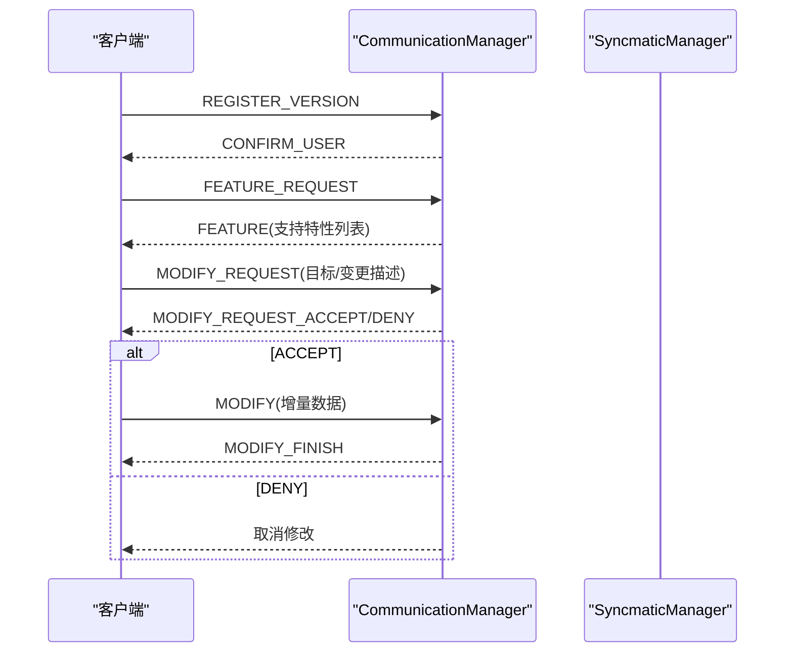
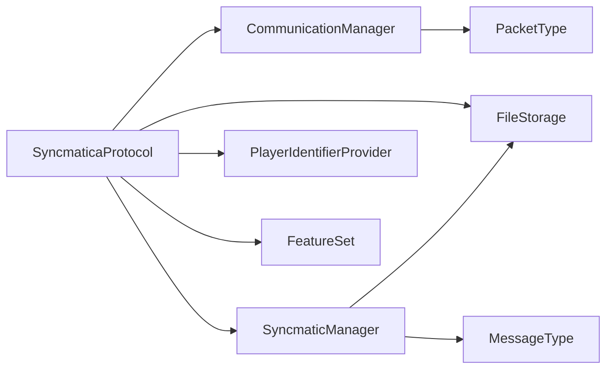

# Syncmatica协议支持

<cite>
**本文引用的文件**
- [SyncmaticaProtocol.java](file://lophine-server/src/main/java/org/leavesmc/leaves/protocol/syncmatica/SyncmaticaProtocol.java)
- [SyncmaticaProtocolConfig.java](file://lophine-server/src/main/java/fun/bm/lophine/config/modules/function/protocol/SyncmaticaProtocolConfig.java)
- [PacketType.java](file://lophine-server/src/main/java/org/leavesmc/leaves/protocol/syncmatica/PacketType.java)
- [Feature.java](file://lophine-server/src/main/java/org/leavesmc/leaves/protocol/syncmatica/Feature.java)
- [CommunicationManager.java](file://lophine-server/src/main/java/org/leavesmc/leaves/protocol/syncmatica/CommunicationManager.java)
- [SyncmaticManager.java](file://lophine-server/src/main/java/org/leavesmc/leaves/protocol/syncmatica/SyncmaticManager.java)
- [FileStorage.java](file://lophine-server/src/main/java/org/leavesmc/leaves/protocol/syncmatica/FileStorage.java)
- [PlayerIdentifierProvider.java](file://lophine-server/src/main/java/org/leavesmc/leaves/protocol/syncmatica/PlayerIdentifierProvider.java)
- [MessageType.java](file://lophine-server/src/main/java/org/leavesmc/leaves/protocol/syncmatica/MessageType.java)
- [SyncmaticaPayload.java](file://lophine-server/src/main/java/org/leavesmc/leaves/protocol/syncmatica/SyncmaticaPayload.java)
- [SubRegionData.java](file://lophine-server/src/main/java/org/leavesmc/leaves/protocol/syncmatica/SubRegionData.java)
- [SubRegionPlacementModification.java](file://lophine-server/src/main/java/org/leavesmc/leaves/protocol/syncmatica/SubRegionPlacementModification.java)
- [LocalLitematicState.java](file://lophine-server/src/main/java/org/leavesmc/leaves/protocol/syncmatica/LocalLitematicState.java)
- [ServerPosition.java](file://lophine-server/src/main/java/org/leavesmc/leaves/protocol/syncmatica/ServerPosition.java)
- [ServerPlacement.java](file://lophine-server/src/main/java/org/leavesmc/leaves/protocol/syncmatica/ServerPlacement.java)
- [0024-Leaves-Syncmatica-Protocol.patch](file://lophine-server/minecraft-patches/features/0024-Leaves-Syncmatica-Protocol.patch)
</cite>

## 目录
1. [简介](#简介)
2. [项目结构](#项目结构)
3. [核心组件](#核心组件)
4. [架构总览](#架构总览)
5. [详细组件分析](#详细组件分析)
6. [依赖关系分析](#依赖关系分析)
7. [性能考虑](#性能考虑)
8. [故障排除指南](#故障排除指南)
9. [结论](#结论)
10. [附录](#附录)

## 简介
本文件面向Lophine中对Syncmatica协议的支持，系统性阐述其设计理念、实现架构与运行机制。Syncmatica协议用于在服务器与客户端之间进行“投影”（litematic）文件的发现、传输与同步，支持特性协商、配额限制、版本注册与用户确认等能力。该实现以模块化方式组织：通过配置模块启用/禁用功能；通过通信管理器协调消息流；通过同步管理器处理投影文件的接收、分片与合并；通过文件存储层持久化与校验；通过特征集与消息类型枚举统一协议语义。

## 项目结构
Syncmatica协议相关代码主要位于以下位置：
- 协议核心与工具类：org.leavesmc.leaves.protocol.syncmatica
- 配置模块：fun.bm.lophine.config.modules.function.protocol
- Minecraft补丁：lophine-server/minecraft-patches/features/0024-Leaves-Syncmatica-Protocol.patch

下图展示关键类之间的关系与职责划分：

图表来源
- [SyncmaticaProtocol.java:34-120](file://lophine-server/src/main/java/org/leavesmc/leaves/protocol/syncmatica/SyncmaticaProtocol.java#L34-L120)
- [CommunicationManager.java](file://lophine-server/src/main/java/org/leavesmc/leaves/protocol/syncmatica/CommunicationManager.java)
- [SyncmaticManager.java](file://lophine-server/src/main/java/org/leavesmc/leaves/protocol/syncmatica/SyncmaticManager.java)
- [FileStorage.java](file://lophine-server/src/main/java/org/leavesmc/leaves/protocol/syncmatica/FileStorage.java)
- [PlayerIdentifierProvider.java](file://lophine-server/src/main/java/org/leavesmc/leaves/protocol/syncmatica/PlayerIdentifierProvider.java)
- [Feature.java:22-40](file://lophine-server/src/main/java/org/leavesmc/leaves/protocol/syncmatica/Feature.java#L22-L40)
- [PacketType.java:22-47](file://lophine-server/src/main/java/org/leavesmc/leaves/protocol/syncmatica/PacketType.java#L22-L47)
- [MessageType.java](file://lophine-server/src/main/java/org/leavesmc/leaves/protocol/syncmatica/MessageType.java)

章节来源
- [SyncmaticaProtocol.java:34-120](file://lophine-server/src/main/java/org/leavesmc/leaves/protocol/syncmatica/SyncmaticaProtocol.java#L34-L120)
- [SyncmaticaProtocolConfig.java:13-28](file://lophine-server/src/main/java/fun/bm/lophine/config/modules/function/protocol/SyncmaticaProtocolConfig.java#L13-L28)

## 核心组件
- 协议入口与常量
  - 协议标识与版本号定义，确保与客户端兼容
  - 投影文件默认存储目录
  - 全局单例：玩家标识提供者、通信管理器、特性集、同步管理器、文件存储
- 配置模块
  - 支持启用/禁用协议
  - 可选配额限制（字节）
  - 启动时根据配置初始化协议
- 特性与消息
  - 特性集：CORE、FEATURE、MODIFY、MESSAGE、QUOTA、DEBUG、CORE_EX
  - 消息类型：INFO、WARN、ERROR
- 数据模型
  - 子区域数据与放置修改
  - 服务端位置与放置信息
  - 本地litematic状态

章节来源
- [SyncmaticaProtocol.java:34-120](file://lophine-server/src/main/java/org/leavesmc/leaves/protocol/syncmatica/SyncmaticaProtocol.java#L34-L120)
- [Feature.java:22-40](file://lophine-server/src/main/java/org/leavesmc/leaves/protocol/syncmatica/Feature.java#L22-L40)
- [MessageType.java](file://lophine-server/src/main/java/org/leavesmc/leaves/protocol/syncmatica/MessageType.java)
- [SubRegionData.java](file://lophine-server/src/main/java/org/leavesmc/leaves/protocol/syncmatica/SubRegionData.java)
- [SubRegionPlacementModification.java](file://lophine-server/src/main/java/org/leavesmc/leaves/protocol/syncmatica/SubRegionPlacementModification.java)
- [LocalLitematicState.java](file://lophine-server/src/main/java/org/leavesmc/leaves/protocol/syncmatica/LocalLitematicState.java)
- [ServerPosition.java](file://lophine-server/src/main/java/org/leavesmc/leaves/protocol/syncmatica/ServerPosition.java)
- [ServerPlacement.java](file://lophine-server/src/main/java/org/leavesmc/leaves/protocol/syncmatica/ServerPlacement.java)

## 架构总览
Syncmatica协议采用“协议入口 + 管理器 + 存储层”的分层设计：
- 协议入口负责生命周期管理与全局资源初始化
- 通信管理器负责与玩家建立连接、发送/广播协议包
- 同步管理器负责投影文件的接收、拆分、合并与完成通知
- 文件存储层负责安全落盘、校验与清理
- 配置模块在启动阶段决定是否启用协议及配额策略

图表来源
- [SyncmaticaProtocolConfig.java:13-28](file://lophine-server/src/main/java/fun/bm/lophine/config/modules/function/protocol/SyncmaticaProtocolConfig.java#L13-L28)
- [SyncmaticaProtocol.java:34-120](file://lophine-server/src/main/java/org/leavesmc/leaves/protocol/syncmatica/SyncmaticaProtocol.java#L34-L120)
- [CommunicationManager.java](file://lophine-server/src/main/java/org/leavesmc/leaves/protocol/syncmatica/CommunicationManager.java)
- [PacketType.java:22-47](file://lophine-server/src/main/java/org/leavesmc/leaves/protocol/syncmatica/PacketType.java#L22-L47)
- [SyncmaticManager.java](file://lophine-server/src/main/java/org/leavesmc/leaves/protocol/syncmatica/SyncmaticManager.java)
- [MessageType.java](file://lophine-server/src/main/java/org/leavesmc/leaves/protocol/syncmatica/MessageType.java)
- [FileStorage.java](file://lophine-server/src/main/java/org/leavesmc/leaves/protocol/syncmatica/FileStorage.java)

## 详细组件分析

### 协议入口与初始化
- 负责声明协议标识与版本，确保与客户端一致
- 初始化全局实例：通信管理器、同步管理器、文件存储、玩家标识提供者、特性集
- 提供投影文件目录访问接口
- 通过配置模块在启动时按需启用

图表来源
- [SyncmaticaProtocolConfig.java:25-27](file://lophine-server/src/main/java/fun/bm/lophine/config/modules/function/protocol/SyncmaticaProtocolConfig.java#L25-L27)
- [SyncmaticaProtocol.java:34-120](file://lophine-server/src/main/java/org/leavesmc/leaves/protocol/syncmatica/SyncmaticaProtocol.java#L34-L120)

章节来源
- [SyncmaticaProtocol.java:34-120](file://lophine-server/src/main/java/org/leavesmc/leaves/protocol/syncmatica/SyncmaticaProtocol.java#L34-L120)
- [SyncmaticaProtocolConfig.java:13-28](file://lophine-server/src/main/java/fun/bm/lophine/config/modules/function/protocol/SyncmaticaProtocolConfig.java#L13-L28)

### 通信管理器
- 职责：维护玩家会话、注册/注销、向指定玩家或全体广播协议包
- 与PacketType配合，封装不同消息类型的发送逻辑
- 与SyncmaticManager协作，驱动投影文件传输流程

图表来源
- [CommunicationManager.java](file://lophine-server/src/main/java/org/leavesmc/leaves/protocol/syncmatica/CommunicationManager.java)
- [SyncmaticManager.java](file://lophine-server/src/main/java/org/leavesmc/leaves/protocol/syncmatica/SyncmaticManager.java)
- [FileStorage.java](file://lophine-server/src/main/java/org/leavesmc/leaves/protocol/syncmatica/FileStorage.java)

章节来源
- [CommunicationManager.java](file://lophine-server/src/main/java/org/leavesmc/leaves/protocol/syncmatica/CommunicationManager.java)
- [PacketType.java:22-47](file://lophine-server/src/main/java/org/leavesmc/leaves/protocol/syncmatica/PacketType.java#L22-L47)

### 同步管理器与文件存储
- 接收流程：验证配额与校验，按序写入临时文件，完成后重命名为正式文件
- 分片策略：将大文件拆分为多个片段，逐段传输，避免一次性超载
- 完成与取消：在收到完成包后合并并校验，失败则回滚或清理
- 存储策略：基于文件ID与校验和保证一致性，支持删除与清理

图表来源
- [SyncmaticManager.java](file://lophine-server/src/main/java/org/leavesmc/leaves/protocol/syncmatica/SyncmaticManager.java)
- [FileStorage.java](file://lophine-server/src/main/java/org/leavesmc/leaves/protocol/syncmatica/FileStorage.java)

章节来源
- [SyncmaticManager.java](file://lophine-server/src/main/java/org/leavesmc/leaves/protocol/syncmatica/SyncmaticManager.java)
- [FileStorage.java](file://lophine-server/src/main/java/org/leavesmc/leaves/protocol/syncmatica/FileStorage.java)

### 特性管理与版本控制
- 特性集：CORE、FEATURE、MODIFY、MESSAGE、QUOTA、DEBUG、CORE_EX
- 版本注册：通过REGISTER_VERSION与CONFIRM_USER建立版本与用户信任链
- 特性协商：通过FEATURE_REQUEST与FEATURE交换双方支持的能力列表
- 修改流程：MODIFY_REQUEST/ACCEPT/DENY/MODIFY/MODIFY_FINISH形成完整的协作修改闭环

图表来源
- [PacketType.java:22-47](file://lophine-server/src/main/java/org/leavesmc/leaves/protocol/syncmatica/PacketType.java#L22-L47)
- [Feature.java:22-40](file://lophine-server/src/main/java/org/leavesmc/leaves/protocol/syncmatica/Feature.java#L22-L40)

章节来源
- [Feature.java:22-40](file://lophine-server/src/main/java/org/leavesmc/leaves/protocol/syncmatica/Feature.java#L22-L40)
- [PacketType.java:22-47](file://lophine-server/src/main/java/org/leavesmc/leaves/protocol/syncmatica/PacketType.java#L22-L47)

### 数据交换格式与消息类型
- 协议包类型：涵盖元数据注册、下载请求、分片发送、完成确认、取消、移除、版本注册、用户确认、特性请求/响应、修改请求/接受/拒绝/完成、通用消息
- 消息类型：INFO/WARN/ERROR用于承载协议内日志与告警
- 载荷结构：通过SyncmaticaPayload封装具体字段，结合PacketType与MessageType实现强类型消息

章节来源
- [PacketType.java:22-47](file://lophine-server/src/main/java/org/leavesmc/leaves/protocol/syncmatica/PacketType.java#L22-L47)
- [MessageType.java](file://lophine-server/src/main/java/org/leavesmc/leaves/protocol/syncmatica/MessageType.java)
- [SyncmaticaPayload.java](file://lophine-server/src/main/java/org/leavesmc/leaves/protocol/syncmatica/SyncmaticaPayload.java)

### 配置选项与使用方法
- enabled：启用/禁用Syncmatica协议支持
- useQuota：是否启用投影文件大小配额
- quotaLimit：配额上限（字节），默认40MB
- 使用步骤：
  1) 在配置文件中设置enabled=true
  2) 如需限制文件大小，设置useQuota=true并调整quotaLimit
  3) 重启服务端使配置生效
  4) 客户端通过协议ID与版本号发起握手与特性协商

章节来源
- [SyncmaticaProtocolConfig.java:15-23](file://lophine-server/src/main/java/fun/bm/lophine/config/modules/function/protocol/SyncmaticaProtocolConfig.java#L15-L23)

### 集成示例与最佳实践
- 客户端交互流程建议：
  - 首先发送REGISTER_VERSION并等待CONFIRM_USER
  - 发送FEATURE_REQUEST获取服务器支持的特性集
  - 对需要共享的投影文件，先发送REGISTER_METADATA
  - 请求下载时发送REQUEST_LITEMATIC，随后按顺序接收SEND_LITEMATIC，最后发送RECEIVED_LITEMATIC并在收到FINISHED_LITEMATIC后结束
  - 若中途出现异常，发送CANCEL_LITEMATIC终止传输
- 最佳实践：
  - 传输前预估文件大小，结合useQuota避免超限
  - 大文件优先采用分片传输，减少内存占用
  - 使用MODIFY流程进行增量更新，降低带宽与时间成本
  - 记录MESSAGE类型日志以便排障

章节来源
- [PacketType.java:22-47](file://lophine-server/src/main/java/org/leavesmc/leaves/protocol/syncmatica/PacketType.java#L22-L47)
- [SyncmaticaProtocolConfig.java:15-23](file://lophine-server/src/main/java/fun/bm/lophine/config/modules/function/protocol/SyncmaticaProtocolConfig.java#L15-L23)

## 依赖关系分析
- 内部耦合
  - SyncmaticaProtocol作为聚合根，依赖CommunicationManager、SyncmaticManager、FileStorage、PlayerIdentifierProvider、FeatureSet
  - CommunicationManager依赖PacketType进行消息路由
  - SyncmaticManager依赖FileStorage与MessageType进行数据持久化与日志分级
- 外部依赖
  - 配置框架：NightConfig与Luminol配置模块
  - 工具库：Apache Commons IO（文件名处理）、JDK NIO（文件操作）

图表来源
- [SyncmaticaProtocol.java:34-120](file://lophine-server/src/main/java/org/leavesmc/leaves/protocol/syncmatica/SyncmaticaProtocol.java#L34-L120)
- [CommunicationManager.java](file://lophine-server/src/main/java/org/leavesmc/leaves/protocol/syncmatica/CommunicationManager.java)
- [SyncmaticManager.java](file://lophine-server/src/main/java/org/leavesmc/leaves/protocol/syncmatica/SyncmaticManager.java)
- [FileStorage.java](file://lophine-server/src/main/java/org/leavesmc/leaves/protocol/syncmatica/FileStorage.java)
- [PacketType.java:22-47](file://lophine-server/src/main/java/org/leavesmc/leaves/protocol/syncmatica/PacketType.java#L22-L47)
- [MessageType.java](file://lophine-server/src/main/java/org/leavesmc/leaves/protocol/syncmatica/MessageType.java)

章节来源
- [SyncmaticaProtocol.java:34-120](file://lophine-server/src/main/java/org/leavesmc/leaves/protocol/syncmatica/SyncmaticaProtocol.java#L34-L120)

## 性能考虑
- 分片传输：将大文件拆分为小块，降低峰值内存与网络拥塞风险
- 配额限制：useQuota与quotaLimit可防止恶意或异常文件导致资源耗尽
- 校验与缓存：文件存储层基于校验和与临时文件策略提升可靠性与恢复能力
- 广播与定向：通信管理器支持广播与定向发送，减少不必要的网络开销

## 故障排除指南
- 无法下载/传输中断
  - 检查是否收到CANCEL_LITEMATIC或客户端主动取消
  - 查看MESSAGE日志定位错误级别（ERROR/WARN/INFO）
- 文件损坏或不完整
  - 确认FINISHED_LITEMATIC是否到达
  - 检查FileStorage的校验与重命名流程
- 权限/配额问题
  - 确认useQuota与quotaLimit配置
  - 检查服务器磁盘空间与文件权限
- 版本/特性不匹配
  - 确保客户端使用与PROTOCOL_VERSION一致的版本
  - 通过FEATURE请求确认服务器支持的特性集

章节来源
- [MessageType.java](file://lophine-server/src/main/java/org/leavesmc/leaves/protocol/syncmatica/MessageType.java)
- [PacketType.java:22-47](file://lophine-server/src/main/java/org/leavesmc/leaves/protocol/syncmatica/PacketType.java#L22-L47)
- [SyncmaticaProtocolConfig.java:15-23](file://lophine-server/src/main/java/fun/bm/lophine/config/modules/function/protocol/SyncmaticaProtocolConfig.java#L15-L23)

## 结论
Lophine对Syncmatica协议的支持以清晰的分层架构实现了从握手、特性协商到文件传输与版本控制的全链路能力。通过配置模块灵活启停，通过通信与同步管理器保障可靠传输，通过文件存储层确保一致性与可恢复性。结合配额限制与日志分级，可在生产环境中稳定运行并便于排障。

## 附录
- 补丁参考：Minecraft补丁0024引入了Syncmatica协议相关支持，确保与上游版本的兼容性与差异点可控
- 建议在部署前进行充分测试，覆盖大文件分片、并发传输、取消与重试等场景

章节来源
- [0024-Leaves-Syncmatica-Protocol.patch](file://lophine-server/minecraft-patches/features/0024-Leaves-Syncmatica-Protocol.patch)