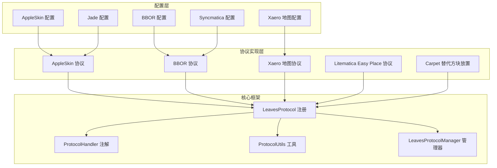
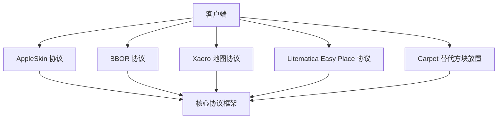
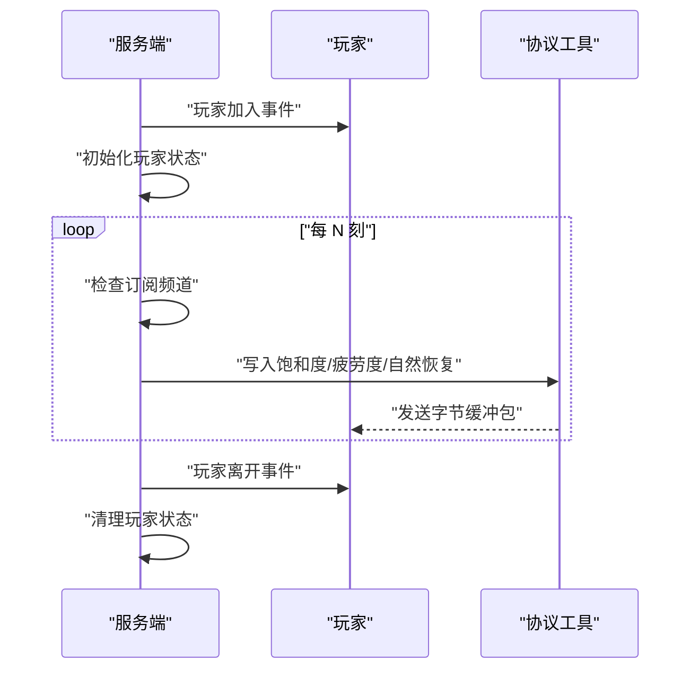
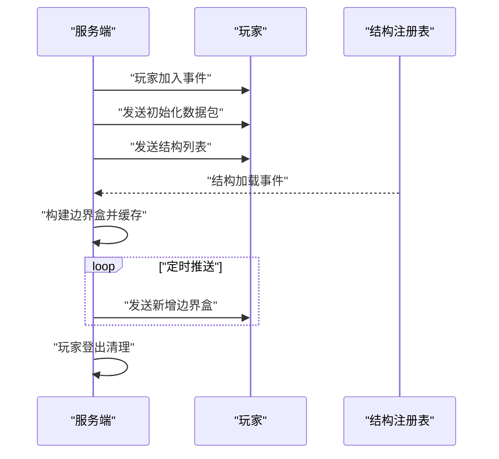
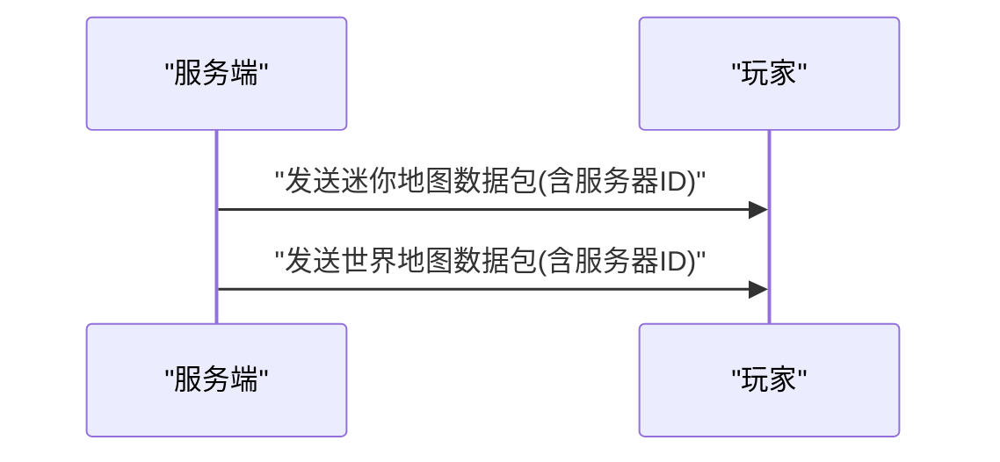
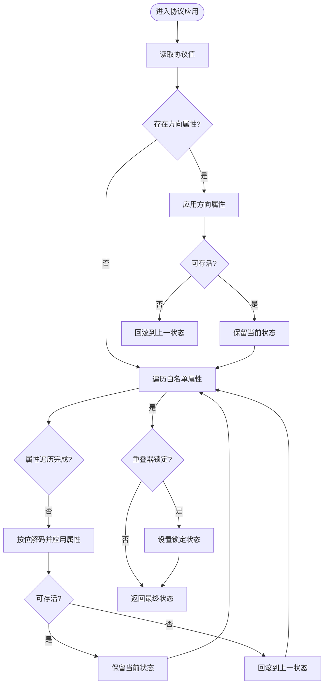
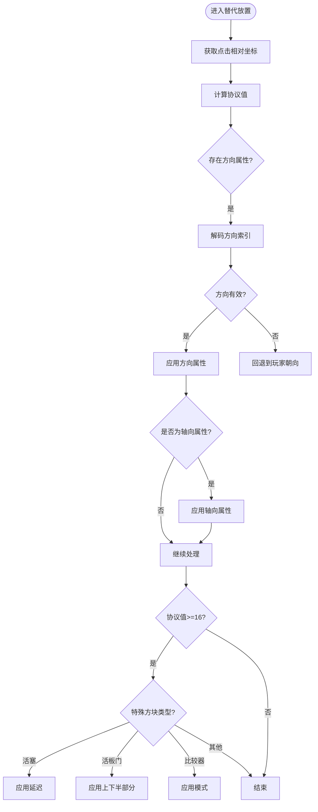
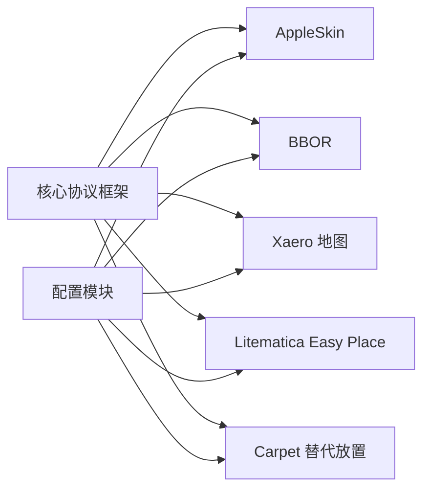

# 其他协议支持

<cite>
**本文引用的文件**
- [AppleSkin 协议实现](file://lophine-server/src/main/java/org/leavesmc/leaves/protocol/AppleSkinProtocol.java)
- [AppleSkin 配置](file://lophine-server/src/main/java/fun/bm/lophine/config/modules/function/protocol/AppleSkinProtocolConfig.java)
- [BBOR 协议实现](file://lophine-server/src/main/java/org/leavesmc/leaves/protocol/BBORProtocol.java)
- [BBOR 配置](file://lophine-server/src/main/java/fun/bm/lophine/config/modules/function/protocol/BBORProtocolConfig.java)
- [Xaero 地图协议实现](file://lophine-server/src/main/java/org/leavesmc/leaves/protocol/XaeroMapProtocol.java)
- [Xaero 地图配置](file://lophine-server/src/main/java/fun/bm/lophine/config/modules/function/protocol/XaeroMapProtocolConfig.java)
- [Litematica Easy Place 协议实现](file://lophine-server/src/main/java/org/leavesmc/leaves/protocol/LitematicaEasyPlaceProtocol.java)
- [Carpet 替代方块放置实现](file://lophine-server/src/main/java/org/leavesmc/leaves/protocol/CarpetAlternativeBlockPlacement.java)
- [同步协议核心模块](file://lophine-server/src/main/java/org/leavesmc/leaves/protocol/core/LeavesProtocol.java)
- [协议工具类](file://lophine-server/src/main/java/org/leavesmc/leaves/protocol/core/ProtocolUtils.java)
- [协议处理器注解](file://lophine-server/src/main/java/org/leavesmc/leaves/protocol/core/ProtocolHandler.java)
- [协议管理器](file://lophine-server/src/main/java/org/leavesmc/leaves/protocol/core/LeavesProtocolManager.java)
- [Servux Litematics 模型](file://lophine-server/src/main/java/org/leavesmc/leaves/protocol/servux/litematics/LitematicaSchematic.java)
</cite>

## 目录
1. [简介](#简介)
2. [项目结构](#项目结构)
3. [核心组件](#核心组件)
4. [架构总览](#架构总览)
5. [详细组件分析](#详细组件分析)
6. [依赖关系分析](#依赖关系分析)
7. [性能考虑](#性能考虑)
8. [故障排除指南](#故障排除指南)
9. [结论](#结论)
10. [附录](#附录)

## 简介
本文件面向 Lophine 的“其他协议支持”功能，系统性介绍以下五类协议的实现与使用：AppleSkin 营养信息显示协议、BBOR 区块渲染协议、Xaero 地图协议、Litematica Easy Place 协议以及 Carpet 替代方块放置协议。内容涵盖各协议的功能特性、适用场景、技术实现细节、配置与集成指南、使用示例、常见问题解决、协议间协作与冲突处理机制，以及扩展与定制开发指导。

## 项目结构
- 协议实现位于服务器模块的协议包中，采用统一的协议注册与生命周期管理框架。
- 配置模块位于功能配置目录下，每个协议拥有独立的配置类，便于启用/禁用与参数调整。
- 核心协议框架提供注册、事件回调、数据包发送等通用能力。

图表来源
- [AppleSkin 协议实现:39-145](file://lophine-server/src/main/java/org/leavesmc/leaves/protocol/AppleSkinProtocol.java#L39-L145)
- [BBOR 协议实现:47-246](file://lophine-server/src/main/java/org/leavesmc/leaves/protocol/BBORProtocol.java#L47-L246)
- [Xaero 地图协议实现:28-64](file://lophine-server/src/main/java/org/leavesmc/leaves/protocol/XaeroMapProtocol.java#L28-L64)
- [Litematica Easy Place 协议实现:45-244](file://lophine-server/src/main/java/org/leavesmc/leaves/protocol/LitematicaEasyPlaceProtocol.java#L45-L244)
- [Carpet 替代方块放置实现:36-171](file://lophine-server/src/main/java/org/leavesmc/leaves/protocol/CarpetAlternativeBlockPlacement.java#L36-L171)
- [同步协议核心模块](file://lophine-server/src/main/java/org/leavesmc/leaves/protocol/core/LeavesProtocol.java)
- [协议工具类](file://lophine-server/src/main/java/org/leavesmc/leaves/protocol/core/ProtocolUtils.java)
- [协议处理器注解](file://lophine-server/src/main/java/org/leavesmc/leaves/protocol/core/ProtocolHandler.java)
- [协议管理器](file://lophine-server/src/main/java/org/leavesmc/leaves/protocol/core/LeavesProtocolManager.java)
- [AppleSkin 配置:8-16](file://lophine-server/src/main/java/fun/bm/lophine/config/modules/function/protocol/AppleSkinProtocolConfig.java#L8-L16)
- [BBOR 配置:8-13](file://lophine-server/src/main/java/fun/bm/lophine/config/modules/function/protocol/BBORProtocolConfig.java#L8-L13)
- [Xaero 地图配置:10-17](file://lophine-server/src/main/java/fun/bm/lophine/config/modules/function/protocol/XaeroMapProtocolConfig.java#L10-L17)

章节来源
- [AppleSkin 协议实现:1-146](file://lophine-server/src/main/java/org/leavesmc/leaves/protocol/AppleSkinProtocol.java#L1-L146)
- [BBOR 协议实现:1-247](file://lophine-server/src/main/java/org/leavesmc/leaves/protocol/BBORProtocol.java#L1-L247)
- [Xaero 地图协议实现:1-65](file://lophine-server/src/main/java/org/leavesmc/leaves/protocol/XaeroMapProtocol.java#L1-L65)
- [Litematica Easy Place 协议实现:1-244](file://lophine-server/src/main/java/org/leavesmc/leaves/protocol/LitematicaEasyPlaceProtocol.java#L1-L244)
- [Carpet 替代方块放置实现:1-171](file://lophine-server/src/main/java/org/leavesmc/leaves/protocol/CarpetAlternativeBlockPlacement.java#L1-L171)
- [AppleSkin 配置:1-17](file://lophine-server/src/main/java/fun/bm/lophine/config/modules/function/protocol/AppleSkinProtocolConfig.java#L1-L17)
- [BBOR 配置:1-14](file://lophine-server/src/main/java/fun/bm/lophine/config/modules/function/protocol/BBORProtocolConfig.java#L1-L14)
- [Xaero 地图配置:1-18](file://lophine-server/src/main/java/fun/bm/lophine/config/modules/function/protocol/XaeroMapProtocolConfig.java#L1-L18)

## 核心组件
- 协议注册与生命周期：通过统一的协议注册注解与处理器，实现按事件触发的数据同步或行为拦截。
- 数据包发送：基于字节缓冲区的自定义数据包发送，确保客户端与服务端协议交互的稳定性。
- 配置驱动：每个协议均提供独立配置项，支持启用/禁用与关键参数调节（如同步频率）。

章节来源
- [同步协议核心模块](file://lophine-server/src/main/java/org/leavesmc/leaves/protocol/core/LeavesProtocol.java)
- [协议工具类](file://lophine-server/src/main/java/org/leavesmc/leaves/protocol/core/ProtocolUtils.java)
- [协议处理器注解](file://lophine-server/src/main/java/org/leavesmc/leaves/protocol/core/ProtocolHandler.java)

## 架构总览
下图展示各协议在系统中的位置与交互关系：

图表来源
- [AppleSkin 协议实现:39-145](file://lophine-server/src/main/java/org/leavesmc/leaves/protocol/AppleSkinProtocol.java#L39-L145)
- [BBOR 协议实现:47-246](file://lophine-server/src/main/java/org/leavesmc/leaves/protocol/BBORProtocol.java#L47-L246)
- [Xaero 地图协议实现:28-64](file://lophine-server/src/main/java/org/leavesmc/leaves/protocol/XaeroMapProtocol.java#L28-L64)
- [Litematica Easy Place 协议实现:45-244](file://lophine-server/src/main/java/org/leavesmc/leaves/protocol/LitematicaEasyPlaceProtocol.java#L45-L244)
- [Carpet 替代方块放置实现:36-171](file://lophine-server/src/main/java/org/leavesmc/leaves/protocol/CarpetAlternativeBlockPlacement.java#L36-L171)
- [同步协议核心模块](file://lophine-server/src/main/java/org/leavesmc/leaves/protocol/core/LeavesProtocol.java)

## 详细组件分析

### AppleSkin 营养信息显示协议
- 功能特点
  - 实时向客户端推送玩家饱和度、疲劳度与自然生命恢复状态。
  - 基于游戏规则与玩家状态进行增量更新，降低网络开销。
  - 支持最小变化阈值过滤，避免频繁小幅度波动导致的冗余传输。
- 技术实现
  - 使用协议注册注解标识命名空间，按玩家加入/离开事件初始化/清理状态。
  - 定时器周期性检查订阅频道，仅在状态变化时发送数据包。
  - 通过工具类封装字节缓冲区写入，保证数据序列化一致性。
- 适用场景
  - 需要客户端实时显示饥饿与健康相关状态的模组或插件。
- 配置与集成
  - 启用开关与同步间隔（以游戏刻为单位）可在配置中设置。
  - 集成时需确保客户端已订阅对应频道，服务端将自动推送。
- 使用示例
  - 在服务端启动后，玩家登录即开始同步；退出时自动清理。
- 常见问题
  - 若未看到数据更新，检查是否正确订阅频道及配置的同步间隔。
  - 服务器重载后会自动重新初始化所有玩家的订阅状态。

图表来源
- [AppleSkin 协议实现:61-117](file://lophine-server/src/main/java/org/leavesmc/leaves/protocol/AppleSkinProtocol.java#L61-L117)
- [协议工具类](file://lophine-server/src/main/java/org/leavesmc/leaves/protocol/core/ProtocolUtils.java)

章节来源
- [AppleSkin 协议实现:1-146](file://lophine-server/src/main/java/org/leavesmc/leaves/protocol/AppleSkinProtocol.java#L1-L146)
- [AppleSkin 配置:1-17](file://lophine-server/src/main/java/fun/bm/lophine/config/modules/function/protocol/AppleSkinProtocolConfig.java#L1-L17)

### BBOR 区块渲染协议
- 功能特点
  - 向客户端广播结构边界盒（BoundingBox），用于可视化结构范围。
  - 支持世界种子与重生点信息初始化，以及结构列表同步。
  - 通过维度缓存减少重复广播，提升性能。
- 技术实现
  - 订阅事件触发后，为玩家初始化客户端并发送结构列表。
  - 结构加载时构建边界盒并缓存，定时向订阅玩家推送新增边界盒。
  - 提供全局初始化与登出清理逻辑，确保状态一致性。
- 适用场景
  - 需要在客户端可视化结构范围的模组或工具。
- 配置与集成
  - 仅启用开关，无额外参数。
  - 集成时需确保客户端订阅“subscribe”消息以接收边界盒。
- 使用示例
  - 服务器启动后，玩家登录即收到初始化数据；结构生成后自动推送边界盒。
- 常见问题
  - 若客户端未显示结构边界，检查是否正确订阅以及数据包是否被过滤。

图表来源
- [BBOR 协议实现:84-191](file://lophine-server/src/main/java/org/leavesmc/leaves/protocol/BBORProtocol.java#L84-L191)
- [BBOR 协议实现:112-147](file://lophine-server/src/main/java/org/leavesmc/leaves/protocol/BBORProtocol.java#L112-L147)

章节来源
- [BBOR 协议实现:1-247](file://lophine-server/src/main/java/org/leavesmc/leaves/protocol/BBORProtocol.java#L1-L247)
- [BBOR 配置:1-14](file://lophine-server/src/main/java/fun/bm/lophine/config/modules/function/protocol/BBORProtocolConfig.java#L1-L14)

### Xaero 地图协议
- 功能特点
  - 向客户端发送服务器 ID，使 Xaero 迷你地图与世界地图能够识别服务器。
  - 支持两个命名空间（迷你地图与世界地图）的统一处理。
- 技术实现
  - 在启用状态下，向玩家发送包含服务器 ID 的数据包。
  - 通过工具类封装字节缓冲区写入，保证格式一致。
- 适用场景
  - 使用 Xaero 地图模组的服务器需要识别服务器身份。
- 配置与集成
  - 启用开关与随机生成的服务器 ID 可在配置中设置。
  - 集成时确保客户端安装 Xaero 并正确解析服务器 ID。
- 使用示例
  - 服务器启动后，玩家登录即收到服务器 ID；退出时不再发送。
- 常见问题
  - 若地图无法识别服务器，检查启用状态与服务器 ID 是否正确。

图表来源
- [Xaero 地图协议实现:47-58](file://lophine-server/src/main/java/org/leavesmc/leaves/protocol/XaeroMapProtocol.java#L47-L58)

章节来源
- [Xaero 地图协议实现:1-65](file://lophine-server/src/main/java/org/leavesmc/leaves/protocol/XaeroMapProtocol.java#L1-L65)
- [Xaero 地图配置:1-18](file://lophine-server/src/main/java/fun/bm/lophine/config/modules/function/protocol/XaeroMapProtocolConfig.java#L1-L18)

### Litematica Easy Place 协议
- 功能特点
  - 基于点击位置与协议值对目标方块状态进行多属性解码与应用。
  - 白名单属性集覆盖朝向、半径、类型、延迟等多种属性。
  - 对床、活塞等特殊方块进行兼容性处理，确保可放置性。
- 技术实现
  - 解析协议值，逐位提取方向与属性索引，按顺序尝试应用。
  - 应用过程中验证方块能否存活，失败则回滚至上一状态。
  - 特殊处理包括重叠器锁定状态与楼梯上下半部分切换。
- 适用场景
  - 需要通过协议值快速设置方块属性的自动化或辅助工具。
- 配置与集成
  - 该协议为纯逻辑实现，不依赖外部配置；与 Carpet 替代放置协议配合使用效果更佳。
- 使用示例
  - 在放置上下界传送门时，可通过协议值一次性设置朝向与延迟。
- 常见问题
  - 若属性设置无效，检查协议值与白名单属性是否匹配。
  - 对床等特殊方块，确保床头位置可替换。

图表来源
- [Litematica Easy Place 协议实现:73-154](file://lophine-server/src/main/java/org/leavesmc/leaves/protocol/LitematicaEasyPlaceProtocol.java#L73-L154)

章节来源
- [Litematica Easy Place 协议实现:1-244](file://lophine-server/src/main/java/org/leavesmc/leaves/protocol/LitematicaEasyPlaceProtocol.java#L1-L244)

### Carpet 替代方块放置协议
- 功能特点
  - 通过点击位置相对坐标计算协议值，实现方向与属性的快速设置。
  - 针对多种方块类型（如活塞、重叠器、活板门、比较器等）提供专门处理。
- 技术实现
  - 提取首个方向属性，按位解码方向索引并应用。
  - 对轴向属性、延迟、模式等进行范围校验与安全应用。
  - 对床、活板门等特殊方块进行位置与状态验证。
- 适用场景
  - 需要快速批量设置方块属性的自动化工具或脚本。
- 配置与集成
  - 该协议为纯逻辑实现，不依赖外部配置；与 Litematica Easy Place 协议配合使用可覆盖更多属性场景。
- 使用示例
  - 在放置活塞时，通过协议值设置朝向与延迟。
- 常见问题
  - 若设置无效，检查协议值与方块属性是否匹配。
  - 对床等方块，确保床头位置可替换。

图表来源
- [Carpet 替代方块放置实现:38-105](file://lophine-server/src/main/java/org/leavesmc/leaves/protocol/CarpetAlternativeBlockPlacement.java#L38-L105)

章节来源
- [Carpet 替代方块放置实现:1-171](file://lophine-server/src/main/java/org/leavesmc/leaves/protocol/CarpetAlternativeBlockPlacement.java#L1-L171)

## 依赖关系分析
- 组件耦合
  - 协议实现依赖核心框架提供的注册、事件与数据包发送能力。
  - 配置模块通过静态字段影响协议行为，但不直接参与协议逻辑。
- 外部依赖
  - 协议实现依赖 Minecraft 的注册表、维度与结构系统。
  - 字节缓冲区序列化依赖工具类，确保跨版本兼容性。
- 协议协作
  - AppleSkin 与 Jade 协议均可向客户端推送健康/结构信息，但职责不同。
  - BBOR 与 Syncmatica 协议均涉及结构信息同步，需注意重复广播与冲突处理。

图表来源
- [同步协议核心模块](file://lophine-server/src/main/java/org/leavesmc/leaves/protocol/core/LeavesProtocol.java)
- [协议工具类](file://lophine-server/src/main/java/org/leavesmc/leaves/protocol/core/ProtocolUtils.java)
- [AppleSkin 配置:8-16](file://lophine-server/src/main/java/fun/bm/lophine/config/modules/function/protocol/AppleSkinProtocolConfig.java#L8-L16)
- [BBOR 配置:8-13](file://lophine-server/src/main/java/fun/bm/lophine/config/modules/function/protocol/BBORProtocolConfig.java#L8-L13)
- [Xaero 地图配置:10-17](file://lophine-server/src/main/java/fun/bm/lophine/config/modules/function/protocol/XaeroMapProtocolConfig.java#L10-L17)

章节来源
- [协议管理器](file://lophine-server/src/main/java/org/leavesmc/leaves/protocol/core/LeavesProtocolManager.java)
- [协议处理器注解](file://lophine-server/src/main/java/org/leavesmc/leaves/protocol/core/ProtocolHandler.java)

## 性能考虑
- AppleSkin
  - 通过最小变化阈值与增量更新减少网络流量；同步间隔可调以平衡实时性与性能。
- BBOR
  - 维护维度级边界盒缓存，避免重复广播；仅推送新增结构，降低 CPU 与带宽占用。
- Litematica Easy Place 与 Carpet 替代放置
  - 属性应用采用白名单策略，限制解码复杂度；失败回滚避免无效状态传播。
- 通用建议
  - 合理设置同步间隔与缓存大小，避免过度频繁的数据包发送。
  - 在高负载环境下优先启用增量更新与缓存策略。

## 故障排除指南
- 协议未生效
  - 检查对应配置的启用开关是否开启。
  - 确认客户端是否正确订阅协议频道或消息。
- 数据不同步
  - AppleSkin：确认同步间隔设置合理，且玩家处于在线状态。
  - BBOR：确认结构已加载并缓存，定时推送任务正常运行。
- 方块放置异常
  - Litematica Easy Place：检查协议值与白名单属性是否匹配，特殊方块需满足可替换条件。
  - Carpet 替代放置：确认协议值范围与方块属性约束，避免非法设置。
- 冲突处理
  - 当多个协议同时推送结构信息时，优先使用 BBOR 的缓存机制避免重复广播。
  - 若客户端出现重复或冲突数据，建议关闭多余协议或调整同步策略。

章节来源
- [AppleSkin 协议实现:77-117](file://lophine-server/src/main/java/org/leavesmc/leaves/protocol/AppleSkinProtocol.java#L77-L117)
- [BBOR 协议实现:165-191](file://lophine-server/src/main/java/org/leavesmc/leaves/protocol/BBORProtocol.java#L165-L191)
- [Litematica Easy Place 协议实现:141-154](file://lophine-server/src/main/java/org/leavesmc/leaves/protocol/LitematicaEasyPlaceProtocol.java#L141-L154)
- [Carpet 替代方块放置实现:108-155](file://lophine-server/src/main/java/org/leavesmc/leaves/protocol/CarpetAlternativeBlockPlacement.java#L108-L155)

## 结论
Lophine 的“其他协议支持”通过统一的核心框架实现了 AppleSkin、BBOR、Xaero 地图、Litematica Easy Place 与 Carpet 替代方块放置协议。这些协议在功能上互补，在实现上遵循相同的生命周期与数据包发送规范，既保证了灵活性，也确保了可维护性。通过合理的配置与集成，用户可以在服务器环境中高效地使用这些协议，并根据实际需求进行扩展与定制。

## 附录
- 扩展与定制开发指导
  - 新增协议时，遵循核心框架的注册与事件回调规范，确保生命周期管理一致。
  - 使用工具类进行数据包发送，保持序列化格式统一。
  - 为新协议提供独立配置模块，便于启用/禁用与参数调节。
  - 在实现复杂逻辑时，参考 Litematica Easy Place 与 Carpet 替代放置的属性解码与回滚策略，提升健壮性。
- 相关文件路径
  - [Servux Litematics 模型](file://lophine-server/src/main/java/org/leavesmc/leaves/protocol/servux/litematics/LitematicaSchematic.java)