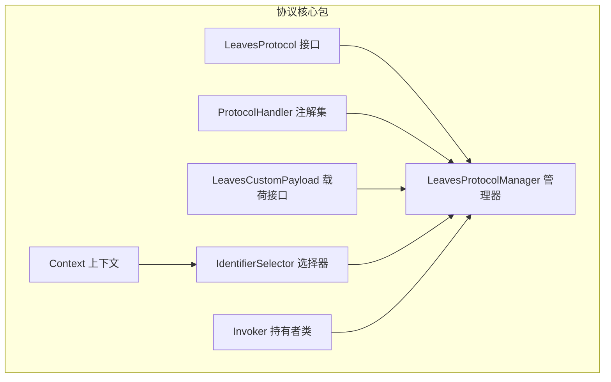
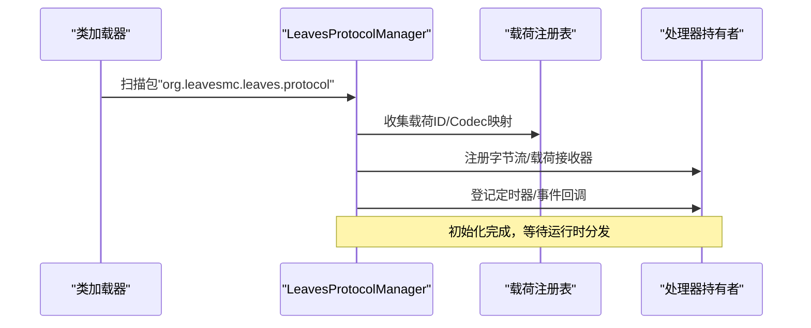
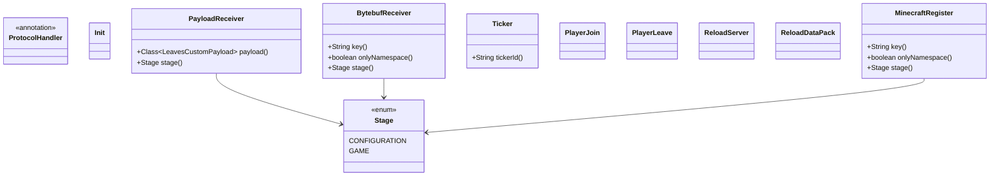
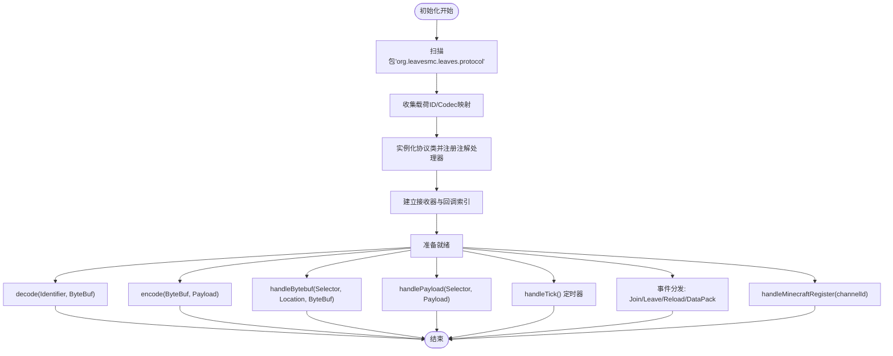
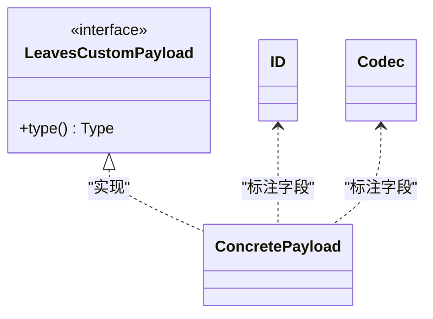
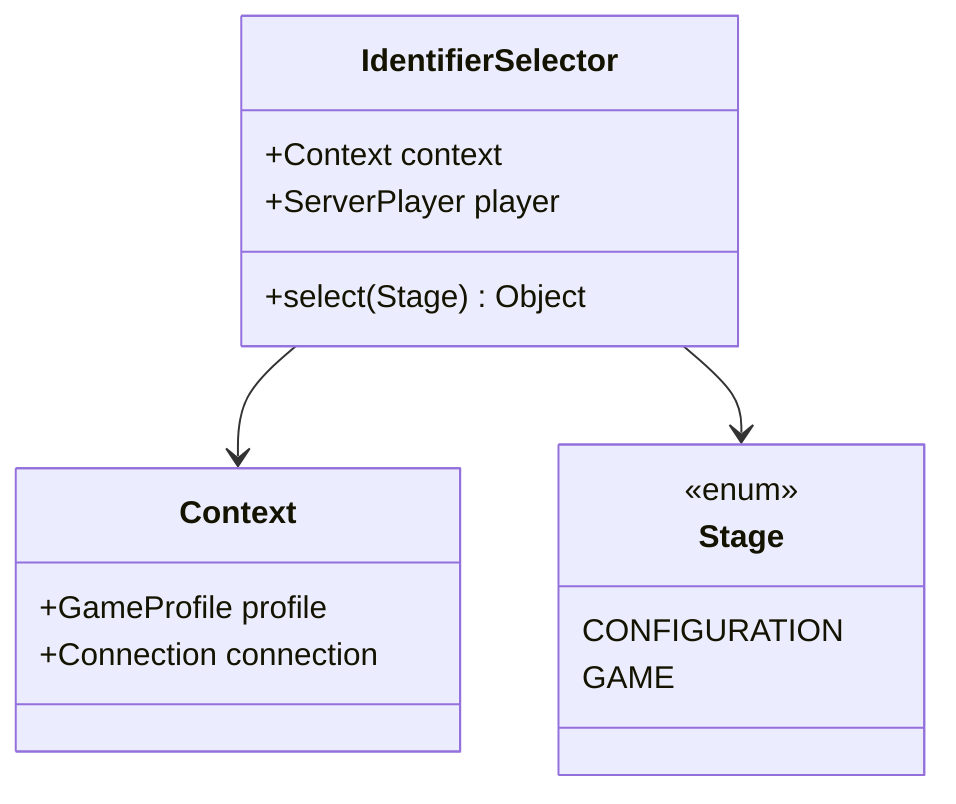
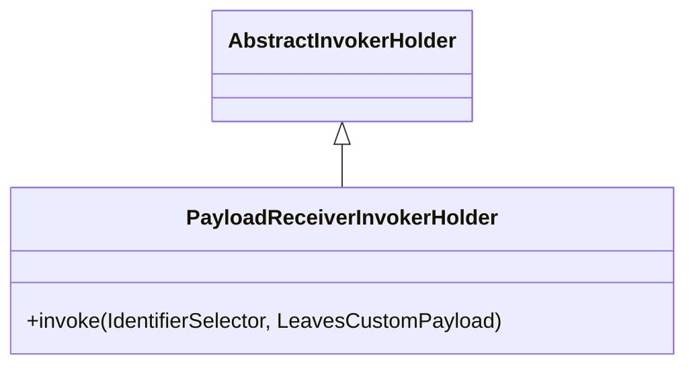
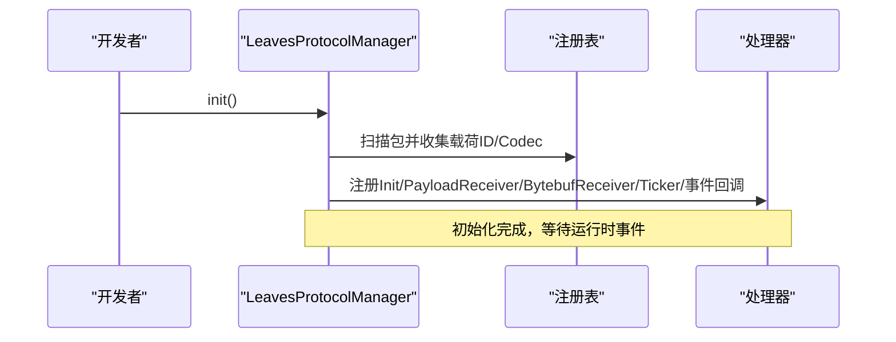
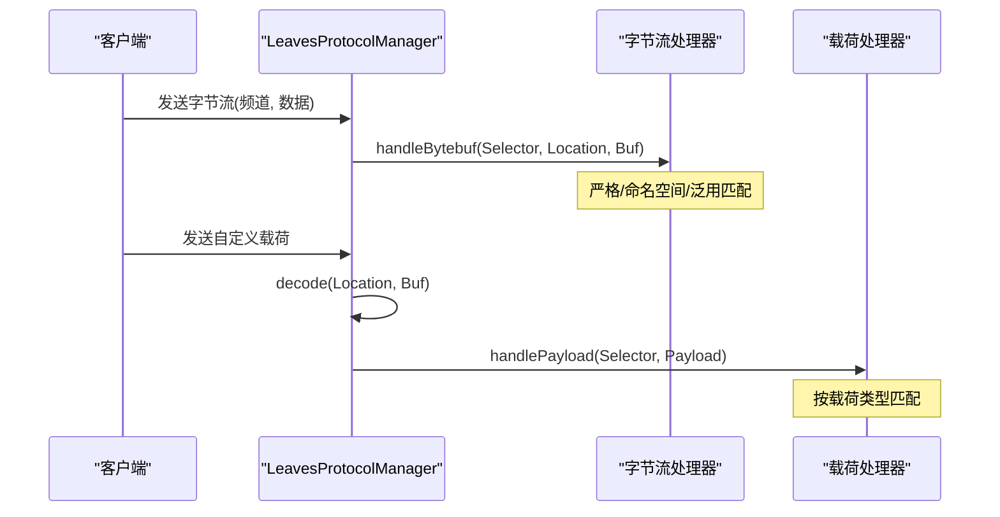
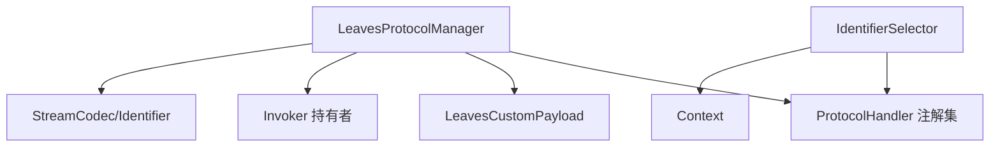

# 协议核心架构

<cite>
**本文引用的文件**
- [LeavesProtocol.java](file://lophine-server/src/main/java/org/leavesmc/leaves/protocol/core/LeavesProtocol.java)
- [LeavesProtocolManager.java](file://lophine-server/src/main/java/org/leavesmc/leaves/protocol/core/LeavesProtocolManager.java)
- [ProtocolHandler.java](file://lophine-server/src/main/java/org/leavesmc/leaves/protocol/core/ProtocolHandler.java)
- [Context.java](file://lophine-server/src/main/java/org/leavesmc/leaves/protocol/core/Context.java)
- [IdentifierSelector.java](file://lophine-server/src/main/java/org/leavesmc/leaves/protocol/core/IdentifierSelector.java)
- [LeavesCustomPayload.java](file://lophine-server/src/main/java/org/leavesmc/leaves/protocol/core/LeavesCustomPayload.java)
- [PayloadReceiverInvokerHolder.java](file://lophine-server/src/main/java/org/leavesmc/leaves/protocol/core/invoker/PayloadReceiverInvokerHolder.java)
- [0009-Leaves-Base-Protocol-Core.patch](file://lophine-server/minecraft-patches/features/0009-Leaves-Base-Protocol-Core.patch)
- [0003-Leaves-Leaves-Protocol-Core.patch](file://lophine-server/paper-patches/features/0003-Leaves-Leaves-Protocol-Core.patch)
</cite>

## 目录
1. [简介](#简介)
2. [项目结构](#项目结构)
3. [核心组件](#核心组件)
4. [架构总览](#架构总览)
5. [详细组件分析](#详细组件分析)
6. [依赖关系分析](#依赖关系分析)
7. [性能考量](#性能考量)
8. [故障排查指南](#故障排查指南)
9. [结论](#结论)
10. [附录](#附录)

## 简介
本技术文档围绕 Lophine 的 Leaves 协议核心架构展开，系统性阐述 LeavesProtocolManager 的设计理念与实现机制，涵盖协议注册、发现与生命周期管理；LeavesProtocol 接口的定义与实现要求；ProtocolHandler 的消息处理流程；Context 上下文与 IdentifierSelector 标识符选择器的作用；以及协议开发的基础框架与扩展点。文档同时提供协议初始化、配置加载与状态管理的实现示例，并解释协议间通信机制与数据流转过程。

## 项目结构
Leaves 协议核心位于 leaves-server 模块的 protocol/core 包中，采用“注解驱动 + 反射扫描 + 运行时分发”的设计模式。核心文件包括：
- LeavesProtocol：协议接口定义（含注册注解）
- ProtocolHandler：协议处理器注解集合（Init、PayloadReceiver、BytebufReceiver、Ticker、PlayerJoin、PlayerLeave、ReloadServer、MinecraftRegister、ReloadDataPack）
- LeavesProtocolManager：协议注册、发现与生命周期调度中心
- LeavesCustomPayload：自定义载荷类型与 ID/Codec 注解
- Context 与 IdentifierSelector：运行时上下文与标识符选择器
- invoker 包：基于反射的调用持有者（Init、PayloadReceiver、BytebufReceiver、Ticker、PlayerJoin、PlayerLeave、ReloadServer、MinecraftRegister）



**图表来源**
- [LeavesProtocol.java:26-39](file://lophine-server/src/main/java/org/leavesmc/leaves/protocol/core/LeavesProtocol.java#L26-L39)
- [ProtocolHandler.java:28-103](file://lophine-server/src/main/java/org/leavesmc/leaves/protocol/core/ProtocolHandler.java#L28-L103)
- [LeavesProtocolManager.java:45-209](file://lophine-server/src/main/java/org/leavesmc/leaves/protocol/core/LeavesProtocolManager.java#L45-L209)
- [LeavesCustomPayload.java:30-48](file://lophine-server/src/main/java/org/leavesmc/leaves/protocol/core/LeavesCustomPayload.java#L30-L48)
- [Context.java:24-26](file://lophine-server/src/main/java/org/leavesmc/leaves/protocol/core/Context.java#L24-L26)
- [IdentifierSelector.java:23-27](file://lophine-server/src/main/java/org/leavesmc/leaves/protocol/core/IdentifierSelector.java#L23-L27)

**章节来源**
- [LeavesProtocol.java:26-39](file://lophine-server/src/main/java/org/leavesmc/leaves/protocol/core/LeavesProtocol.java#L26-L39)
- [ProtocolHandler.java:28-103](file://lophine-server/src/main/java/org/leavesmc/leaves/protocol/core/ProtocolHandler.java#L28-L103)
- [LeavesProtocolManager.java:45-209](file://lophine-server/src/main/java/org/leavesmc/leaves/protocol/core/LeavesProtocolManager.java#L45-L209)
- [LeavesCustomPayload.java:30-48](file://lophine-server/src/main/java/org/leavesmc/leaves/protocol/core/LeavesCustomPayload.java#L30-L48)
- [Context.java:24-26](file://lophine-server/src/main/java/org/leavesmc/leaves/protocol/core/Context.java#L24-L26)
- [IdentifierSelector.java:23-27](file://lophine-server/src/main/java/org/leavesmc/leaves/protocol/core/IdentifierSelector.java#L23-L27)

## 核心组件
- LeavesProtocol 接口：定义协议的激活状态与可选的 tick 间隔，提供 @Register 注解用于声明命名空间。
- ProtocolHandler 注解集：统一管理协议生命周期事件与消息处理入口，包括初始化、载荷接收、字节流接收、定时器、玩家加入/离开、服务器重载、数据包重载、Minecraft 注册回调等。
- LeavesProtocolManager：负责扫描 org.leavesmc.leaves.protocol 包下的协议实现，建立载荷 ID/Codec 映射，注册字节流与载荷接收器，维护定时器与事件回调列表，并在运行时进行分发。
- LeavesCustomPayload：自定义协议载荷的统一接口，提供 Leaves 类型标识与 ID/Codec 注解，用于编码/解码与路由。
- Context 与 IdentifierSelector：封装连接上下文与玩家对象，通过 Stage 决定在 CONFIGURATION 或 GAME 阶段传递给处理器的标识符对象。

**章节来源**
- [LeavesProtocol.java:26-39](file://lophine-server/src/main/java/org/leavesmc/leaves/protocol/core/LeavesProtocol.java#L26-L39)
- [ProtocolHandler.java:28-103](file://lophine-server/src/main/java/org/leavesmc/leaves/protocol/core/ProtocolHandler.java#L28-L103)
- [LeavesProtocolManager.java:45-209](file://lophine-server/src/main/java/org/leavesmc/leaves/protocol/core/LeavesProtocolManager.java#L45-L209)
- [LeavesCustomPayload.java:30-48](file://lophine-server/src/main/java/org/leavesmc/leaves/protocol/core/LeavesCustomPayload.java#L30-L48)
- [Context.java:24-26](file://lophine-server/src/main/java/org/leavesmc/leaves/protocol/core/Context.java#L24-L26)
- [IdentifierSelector.java:23-27](file://lophine-server/src/main/java/org/leavesmc/leaves/protocol/core/IdentifierSelector.java#L23-L27)

## 架构总览
Leaves 协议核心采用“扫描 + 注册 + 分发”三层架构：
- 扫描阶段：遍历指定包路径，反射解析协议类与载荷类，收集注解信息。
- 注册阶段：建立载荷 ID 到 StreamCodec 的映射，注册字节流与载荷接收器，登记定时器与事件回调。
- 分发阶段：在运行时根据 Stage 与 Identifier 选择合适的处理器，执行初始化、消息处理、定时任务与生命周期事件。



**图表来源**
- [LeavesProtocolManager.java:70-209](file://lophine-server/src/main/java/org/leavesmc/leaves/protocol/core/LeavesProtocolManager.java#L70-L209)

**章节来源**
- [LeavesProtocolManager.java:70-209](file://lophine-server/src/main/java/org/leavesmc/leaves/protocol/core/LeavesProtocolManager.java#L70-L209)

## 详细组件分析

### LeavesProtocol 接口与 @Register 注解
- LeavesProtocol 定义了协议的基本能力：isActive() 用于控制协议是否参与运行时分发；tickerInterval() 提供可选的 tick 周期控制，默认为 1。
- @Register 注解用于标记协议类，并声明其命名空间，作为后续字节流接收器与 Minecraft 注册回调的键值基础。

```mermermaid
classDiagram
    class LeavesProtocol {
        +boolean isActive()
        +int tickerInterval(tickerID)
    }
    class Register {
        +String namespace()
    }
    LeavesProtocol <|.. ConcreteProtocol : "实现"
    Register <.. ConcreteProtocol : "标注"
```

**图表来源**
- [LeavesProtocol.java:26-39](file://lophine-server/src/main/java/org/leavesmc/leaves/protocol/core/LeavesProtocol.java#L26-L39)

**章节来源**
- [LeavesProtocol.java:26-39](file://lophine-server/src/main/java/org/leavesmc/leaves/protocol/core/LeavesProtocol.java#L26-L39)

### ProtocolHandler 注解集与处理流程
- Init：协议初始化入口，无参数。
- PayloadReceiver：接收 LeavesCustomPayload，支持指定 payload 类型与 Stage（默认 GAME）。
- BytebufReceiver：接收原始字节流，支持 key、onlyNamespace 与 Stage 控制。
- Ticker：周期性任务，支持 tickerId。
- PlayerJoin/PlayerLeave：玩家连接/断开事件。
- ReloadServer/ReloadDataPack：服务器重载与数据包重载事件。
- MinecraftRegister：Minecraft 注册回调，支持 key、onlyNamespace 与 Stage（默认 CONFIGURATION）。



**图表来源**
- [ProtocolHandler.java:28-103](file://lophine-server/src/main/java/org/leavesmc/leaves/protocol/core/ProtocolHandler.java#L28-L103)

**章节来源**
- [ProtocolHandler.java:28-103](file://lophine-server/src/main/java/org/leavesmc/leaves/protocol/core/ProtocolHandler.java#L28-L103)

### LeavesProtocolManager：注册、发现与生命周期管理
- 载荷注册：扫描 org.leavesmc.leaves.protocol 包，收集 LeavesCustomPayload 子类的 ID 与 Codec 字段，建立 Identifier 到 StreamCodec 的映射。
- 协议注册：对带 @Register 的类实例化，扫描方法上的各类注解，构建对应的 InvokerHolder 并登记到相应集合。
- 生命周期分发：
  - 编解码：decode/encode 基于 ID2CODEC 映射进行。
  - 字节流处理：handleBytebuf 依据严格匹配、命名空间匹配与泛用匹配顺序分发。
  - 载荷处理：handlePayload 基于载荷类型匹配分发。
  - 定时器：handleTick 按时间片与协议 tickerInterval 触发。
  - 事件：handlePlayerJoin/handlePlayerLeave/handleServerReload/handleDataPackReload 分别触发对应回调。
  - Minecraft 注册：handleMinecraftRegister 触发注册回调链。
  - 已知 ID 同步：sendKnownId 在玩家加入时发送已知通道列表。



**图表来源**
- [LeavesProtocolManager.java:70-340](file://lophine-server/src/main/java/org/leavesmc/leaves/protocol/core/LeavesProtocolManager.java#L70-L340)

**章节来源**
- [LeavesProtocolManager.java:70-340](file://lophine-server/src/main/java/org/leavesmc/leaves/protocol/core/LeavesProtocolManager.java#L70-L340)

### LeavesCustomPayload：载荷定义与编解码
- LeavesCustomPayload 继承 Minecraft 的 CustomPacketPayload，统一类型标识为 leaves:custom_payload。
- 通过 @ID 与 @Codec 注解在载荷类字段上声明 Identifier 与 StreamCodec，由 LeavesProtocolManager 建立 ID2CODEC 映射，确保 decode/encode 正确工作。



**图表来源**
- [LeavesCustomPayload.java:30-48](file://lophine-server/src/main/java/org/leavesmc/leaves/protocol/core/LeavesCustomPayload.java#L30-L48)

**章节来源**
- [LeavesCustomPayload.java:30-48](file://lophine-server/src/main/java/org/leavesmc/leaves/protocol/core/LeavesCustomPayload.java#L30-L48)

### Context 与 IdentifierSelector：上下文与标识符选择
- Context 记录连接的 GameProfile 与 Connection，用于 CONFIGURATION 阶段的处理器。
- IdentifierSelector 将 Stage 与 Context/Player 绑定，select 方法根据 Stage 返回对应标识符对象，确保 PayloadReceiver/BytebufReceiver/MinecraftRegister 等处理器在正确阶段拿到合适的上下文。



**图表来源**
- [Context.java:24-26](file://lophine-server/src/main/java/org/leavesmc/leaves/protocol/core/Context.java#L24-L26)
- [IdentifierSelector.java:23-27](file://lophine-server/src/main/java/org/leavesmc/leaves/protocol/core/IdentifierSelector.java#L23-L27)
- [ProtocolHandler.java:89-102](file://lophine-server/src/main/java/org/leavesmc/leaves/protocol/core/ProtocolHandler.java#L89-L102)

**章节来源**
- [Context.java:24-26](file://lophine-server/src/main/java/org/leavesmc/leaves/protocol/core/Context.java#L24-L26)
- [IdentifierSelector.java:23-27](file://lophine-server/src/main/java/org/leavesmc/leaves/protocol/core/IdentifierSelector.java#L23-L27)
- [ProtocolHandler.java:89-102](file://lophine-server/src/main/java/org/leavesmc/leaves/protocol/core/ProtocolHandler.java#L89-L102)

### Invoker 持有者：反射调用与分发
- PayloadReceiverInvokerHolder：基于载荷类型进行分发，调用 PayloadReceiver 处理器。
- 其他 InvokerHolder（Init、BytebufReceiver、Ticker、PlayerJoin、PlayerLeave、ReloadServer、MinecraftRegister）以类似方式按注解类型与键值策略进行分发。



**图表来源**
- [PayloadReceiverInvokerHolder.java:27-35](file://lophine-server/src/main/java/org/leavesmc/leaves/protocol/core/invoker/PayloadReceiverInvokerHolder.java#L27-L35)

**章节来源**
- [PayloadReceiverInvokerHolder.java:27-35](file://lophine-server/src/main/java/org/leavesmc/leaves/protocol/core/invoker/PayloadReceiverInvokerHolder.java#L27-L35)

### 协议开发基础框架与扩展点
- 开发步骤建议：
  1) 实现 LeavesProtocol 接口，提供 isActive() 与可选 tickerInterval()。
  2) 使用 @Register(namespace = "...") 标注协议类。
  3) 在协议类中添加处理方法：
     - @Init：初始化逻辑
     - @PayloadReceiver(payload = ..., stage = ...)：处理 LeavesCustomPayload
     - @BytebufReceiver(key = "...", onlyNamespace = ..., stage = ...)：处理字节流
     - @Ticker(tickerId = "...")：周期性任务
     - @PlayerJoin/@PlayerLeave：玩家事件
     - @ReloadServer/@ReloadDataPack：服务器/数据包重载
     - @MinecraftRegister(key = "...", onlyNamespace = ..., stage = ...)：Minecraft 注册回调
  4) 如需自定义载荷，实现 LeavesCustomPayload，并在载荷类中使用 @ID 与 @Codec 字段标注。
- 扩展点：
  - 新增处理器类型：可在 ProtocolHandler 中新增注解，并在 LeavesProtocolManager 中补充对应注册与分发逻辑。
  - 自定义分发策略：可调整字节流接收器的匹配优先级或引入新的匹配规则。

**章节来源**
- [LeavesProtocol.java:26-39](file://lophine-server/src/main/java/org/leavesmc/leaves/protocol/core/LeavesProtocol.java#L26-L39)
- [ProtocolHandler.java:28-103](file://lophine-server/src/main/java/org/leavesmc/leaves/protocol/core/ProtocolHandler.java#L28-L103)
- [LeavesProtocolManager.java:70-209](file://lophine-server/src/main/java/org/leavesmc/leaves/protocol/core/LeavesProtocolManager.java#L70-L209)
- [LeavesCustomPayload.java:30-48](file://lophine-server/src/main/java/org/leavesmc/leaves/protocol/core/LeavesCustomPayload.java#L30-L48)

### 协议初始化、配置加载与状态管理示例
- 初始化流程：调用 LeavesProtocolManager.init()，内部完成包扫描、载荷映射建立、处理器注册与回调登记。
- 配置加载：LeavesProtocol.isActive() 控制协议是否参与分发；tickerInterval() 控制定时任务频率。
- 状态管理：LeavesProtocolManager 维护各处理器集合与定时器列表，按阶段与条件触发。



**图表来源**
- [LeavesProtocolManager.java:70-209](file://lophine-server/src/main/java/org/leavesmc/leaves/protocol/core/LeavesProtocolManager.java#L70-L209)

**章节来源**
- [LeavesProtocolManager.java:70-209](file://lophine-server/src/main/java/org/leavesmc/leaves/protocol/core/LeavesProtocolManager.java#L70-L209)

### 协议间通信机制与数据流转
- 字节流通信：客户端通过自定义频道发送字节流，LeavesProtocolManager.handleBytebuf 按严格匹配、命名空间匹配、泛用匹配顺序查找处理器并执行。
- 载荷通信：客户端发送 LeavesCustomPayload，LeavesProtocolManager.decode 解析后，按载荷类型匹配到 PayloadReceiver 并执行。
- Minecraft 注册：服务端向客户端发送 register 包，LeavesProtocolManager.sendKnownId 发送已知通道列表；客户端注册后触发 @MinecraftRegister 回调。



**图表来源**
- [LeavesProtocolManager.java:211-264](file://lophine-server/src/main/java/org/leavesmc/leaves/protocol/core/LeavesProtocolManager.java#L211-L264)
- [LeavesProtocolManager.java:321-340](file://lophine-server/src/main/java/org/leavesmc/leaves/protocol/core/LeavesProtocolManager.java#L321-L340)

**章节来源**
- [LeavesProtocolManager.java:211-264](file://lophine-server/src/main/java/org/leavesmc/leaves/protocol/core/LeavesProtocolManager.java#L211-L264)
- [LeavesProtocolManager.java:321-340](file://lophine-server/src/main/java/org/leavesmc/leaves/protocol/core/LeavesProtocolManager.java#L321-L340)

## 依赖关系分析
- LeavesProtocolManager 对 ProtocolHandler 注解集、LeavesCustomPayload 接口、Invoker 持有者类具有直接依赖。
- IdentifierSelector 依赖 ProtocolHandler.Stage 与 Context/ServerPlayer。
- 载荷编解码依赖 Minecraft 的 StreamCodec 与 Identifier。
- 包扫描依赖 Java 反射与类加载器。



**图表来源**
- [LeavesProtocolManager.java:45-209](file://lophine-server/src/main/java/org/leavesmc/leaves/protocol/core/LeavesProtocolManager.java#L45-L209)
- [ProtocolHandler.java:28-103](file://lophine-server/src/main/java/org/leavesmc/leaves/protocol/core/ProtocolHandler.java#L28-L103)
- [LeavesCustomPayload.java:30-48](file://lophine-server/src/main/java/org/leavesmc/leaves/protocol/core/LeavesCustomPayload.java#L30-L48)
- [IdentifierSelector.java:23-27](file://lophine-server/src/main/java/org/leavesmc/leaves/protocol/core/IdentifierSelector.java#L23-L27)
- [Context.java:24-26](file://lophine-server/src/main/java/org/leavesmc/leaves/protocol/core/Context.java#L24-L26)

**章节来源**
- [LeavesProtocolManager.java:45-209](file://lophine-server/src/main/java/org/leavesmc/leaves/protocol/core/LeavesProtocolManager.java#L45-L209)
- [ProtocolHandler.java:28-103](file://lophine-server/src/main/java/org/leavesmc/leaves/protocol/core/ProtocolHandler.java#L28-L103)
- [LeavesCustomPayload.java:30-48](file://lophine-server/src/main/java/org/leavesmc/leaves/protocol/core/LeavesCustomPayload.java#L30-L48)
- [IdentifierSelector.java:23-27](file://lophine-server/src/main/java/org/leavesmc/leaves/protocol/core/IdentifierSelector.java#L23-L27)
- [Context.java:24-26](file://lophine-server/src/main/java/org/leavesmc/leaves/protocol/core/Context.java#L24-L26)

## 性能考量
- 反射与类加载：初始化阶段使用反射扫描与实例化，建议在启动阶段集中执行，避免频繁重复扫描。
- 匹配策略：字节流接收器按严格 → 命名空间 → 泛用顺序匹配，合理设置 key 与 onlyNamespace 可减少匹配成本。
- 定时器：handleTick 按毫秒时间片与协议 tickerInterval 计算，避免过短周期导致 CPU 压力。
- 编解码异常：decode/encode 包含异常日志记录，建议在协议实现中确保 Codec 正确配置，减少运行时异常。

## 故障排查指南
- 协议未生效：检查 @Register.namespace 是否正确，LeavesProtocol.isActive() 是否返回 true。
- 载荷无法解码：确认载荷类 @ID 与 @Codec 字段存在且与 ID2CODEC 映射一致。
- 字节流未被处理：检查 BytebufReceiver 的 key 与 onlyNamespace 设置，确认频道字符串格式与匹配范围。
- 定时器不触发：确认 Ticker.tickerId 与协议 tickerInterval 返回值，检查 handleTick 调用频率。
- Minecraft 注册失败：检查 handleMinecraftRegister 的 key/namespace 设置与客户端注册流程。

**章节来源**
- [LeavesProtocolManager.java:202-237](file://lophine-server/src/main/java/org/leavesmc/leaves/protocol/core/LeavesProtocolManager.java#L202-L237)
- [LeavesProtocolManager.java:246-264](file://lophine-server/src/main/java/org/leavesmc/leaves/protocol/core/LeavesProtocolManager.java#L246-L264)
- [LeavesProtocolManager.java:266-275](file://lophine-server/src/main/java/org/leavesmc/leaves/protocol/core/LeavesProtocolManager.java#L266-L275)
- [LeavesProtocolManager.java:302-319](file://lophine-server/src/main/java/org/leavesmc/leaves/protocol/core/LeavesProtocolManager.java#L302-L319)

## 结论
Leaves 协议核心通过注解驱动与反射扫描实现了高度模块化的协议管理与分发机制。LeavesProtocolManager 作为中枢，承担了协议注册、发现、生命周期管理与消息分发职责；LeavesProtocol 与 ProtocolHandler 提供清晰的扩展点；LeavesCustomPayload、Context 与 IdentifierSelector 则保证了跨阶段的上下文一致性与类型安全。该架构为 Lophine 生态中的各类协议提供了稳定、可扩展的基础设施。

## 附录
- 基础补丁参考：
  - [0009-Leaves-Base-Protocol-Core.patch](file://lophine-server/minecraft-patches/features/0009-Leaves-Base-Protocol-Core.patch)
  - [0003-Leaves-Leaves-Protocol-Core.patch](file://lophine-server/paper-patches/features/0003-Leaves-Leaves-Protocol-Core.patch)

**章节来源**
- [0009-Leaves-Base-Protocol-Core.patch:1-8](file://lophine-server/minecraft-patches/features/0009-Leaves-Base-Protocol-Core.patch#L1-L8)
- [0003-Leaves-Leaves-Protocol-Core.patch:1-8](file://lophine-server/paper-patches/features/0003-Leaves-Leaves-Protocol-Core.patch#L1-L8)