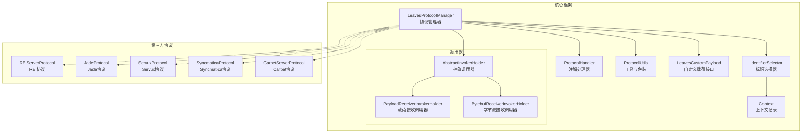
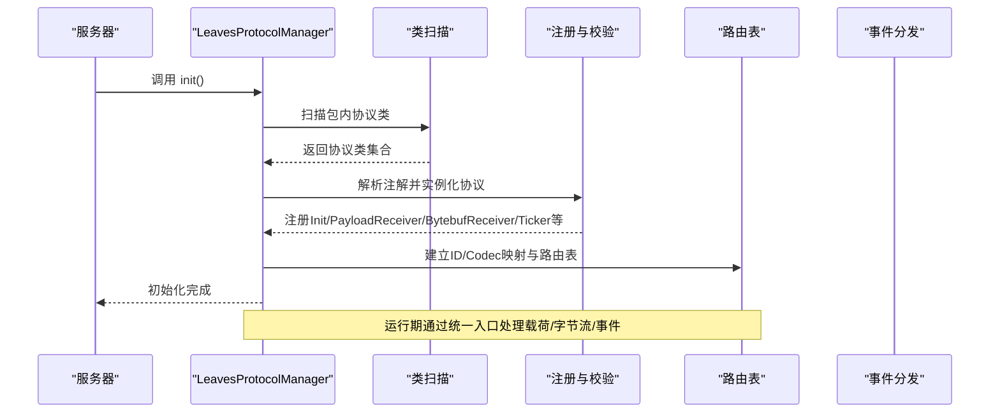
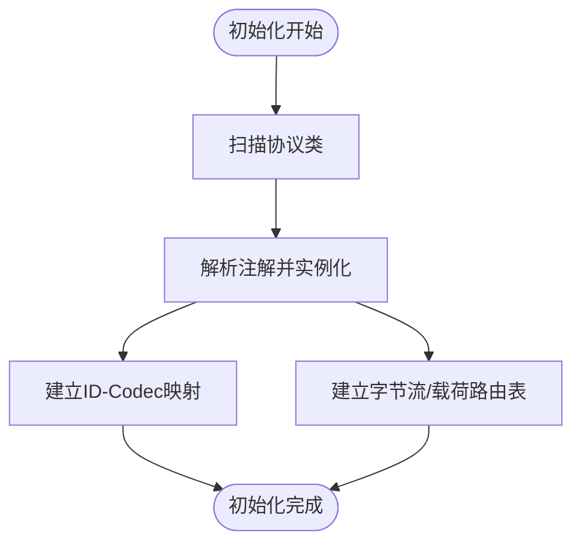
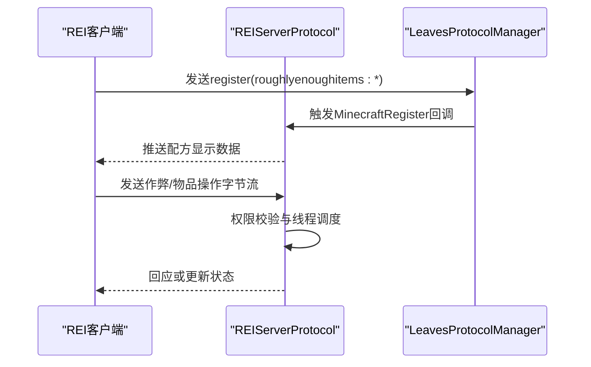
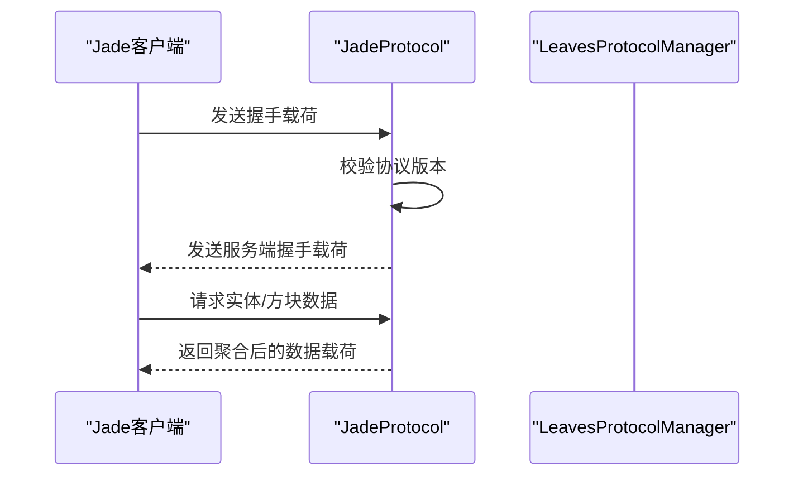
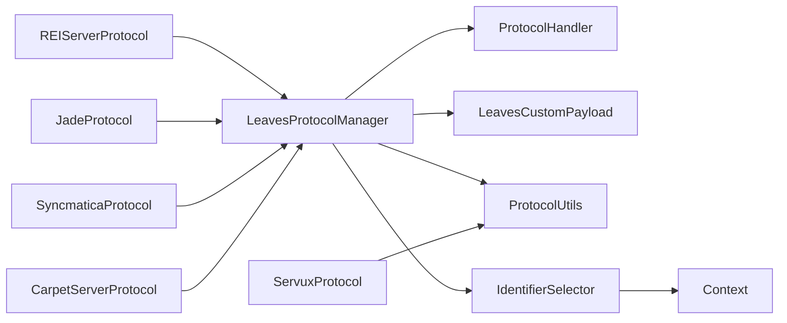

# 协议系统

<cite>
**本文引用的文件**
- [LeavesProtocolManager.java](file://lophine-server/src/main/java/org/leavesmc/leaves/protocol/core/LeavesProtocolManager.java)
- [LeavesProtocol.java](file://lophine-server/src/main/java/org/leavesmc/leaves/protocol/core/LeavesProtocol.java)
- [ProtocolHandler.java](file://lophine-server/src/main/java/org/leavesmc/leaves/protocol/core/ProtocolHandler.java)
- [Context.java](file://lophine-server/src/main/java/org/leavesmc/leaves/protocol/core/Context.java)
- [ProtocolUtils.java](file://lophine-server/src/main/java/org/leavesmc/leaves/protocol/core/ProtocolUtils.java)
- [LeavesCustomPayload.java](file://lophine-server/src/main/java/org/leavesmc/leaves/protocol/core/LeavesCustomPayload.java)
- [AbstractInvokerHolder.java](file://lophine-server/src/main/java/org/leavesmc/leaves/protocol/core/invoker/AbstractInvokerHolder.java)
- [PayloadReceiverInvokerHolder.java](file://lophine-server/src/main/java/org/leavesmc/leaves/protocol/core/invoker/PayloadReceiverInvokerHolder.java)
- [BytebufReceiverInvokerHolder.java](file://lophine-server/src/main/java/org/leavesmc/leaves/protocol/core/invoker/BytebufReceiverInvokerHolder.java)
- [IdentifierSelector.java](file://lophine-server/src/main/java/org/leavesmc/leaves/protocol/core/IdentifierSelector.java)
- [REIServerProtocol.java](file://lophine-server/src/main/java/org/leavesmc/leaves/protocol/rei/REIServerProtocol.java)
- [JadeProtocol.java](file://lophine-server/src/main/java/org/leavesmc/leaves/protocol/jade/JadeProtocol.java)
- [ServuxProtocol.java](file://lophine-server/src/main/java/org/leavesmc/leaves/protocol/servux/ServuxProtocol.java)
- [SyncmaticaProtocol.java](file://lophine-server/src/main/java/org/leavesmc/leaves/protocol/syncmatica/SyncmaticaProtocol.java)
- [CarpetServerProtocol.java](file://lophine-server/src/main/java/org/leavesmc/leaves/protocol/CarpetServerProtocol.java)
</cite>

## 目录
1. [引言](#引言)
2. [项目结构](#项目结构)
3. [核心组件](#核心组件)
4. [架构总览](#架构总览)
5. [详细组件分析](#详细组件分析)
6. [依赖关系分析](#依赖关系分析)
7. [性能考量](#性能考量)
8. [故障排除指南](#故障排除指南)
9. [结论](#结论)
10. [附录](#附录)

## 引言
本技术文档面向Lophine协议系统，系统性阐述其整体架构与运行机制，重点覆盖协议管理器、协议处理器、消息路由与编码解码、生命周期管理、版本兼容与升级策略，以及针对第三方协议（如REI、Jade、Servux等）的支持现状与扩展方法。文档同时提供最佳实践、调试与排障建议，帮助开发者快速上手并安全扩展协议能力。

## 项目结构
Lophine协议系统位于服务端模块中，核心位于core包，第三方协议以功能域划分在各自子包下。核心职责分离清晰：核心框架负责协议注册、反射扫描、消息编解码、事件分发；各协议实现仅关注自身业务逻辑与数据提供。

图表来源
- [LeavesProtocolManager.java:1-416](file://lophine-server/src/main/java/org/leavesmc/leaves/protocol/core/LeavesProtocolManager.java#L1-L416)
- [ProtocolHandler.java:1-103](file://lophine-server/src/main/java/org/leavesmc/leaves/protocol/core/ProtocolHandler.java#L1-L103)
- [ProtocolUtils.java:1-102](file://lophine-server/src/main/java/org/leavesmc/leaves/protocol/core/ProtocolUtils.java#L1-L102)
- [LeavesCustomPayload.java:1-49](file://lophine-server/src/main/java/org/leavesmc/leaves/protocol/core/LeavesCustomPayload.java#L1-L49)
- [IdentifierSelector.java:1-28](file://lophine-server/src/main/java/org/leavesmc/leaves/protocol/core/IdentifierSelector.java#L1-L28)
- [Context.java:1-27](file://lophine-server/src/main/java/org/leavesmc/leaves/protocol/core/Context.java#L1-L27)
- [AbstractInvokerHolder.java:1-86](file://lophine-server/src/main/java/org/leavesmc/leaves/protocol/core/invoker/AbstractInvokerHolder.java#L1-L86)
- [PayloadReceiverInvokerHolder.java:1-36](file://lophine-server/src/main/java/org/leavesmc/leaves/protocol/core/invoker/PayloadReceiverInvokerHolder.java#L1-L36)
- [BytebufReceiverInvokerHolder.java:1-35](file://lophine-server/src/main/java/org/leavesmc/leaves/protocol/core/invoker/BytebufReceiverInvokerHolder.java#L1-L35)
- [REIServerProtocol.java:1-433](file://lophine-server/src/main/java/org/leavesmc/leaves/protocol/rei/REIServerProtocol.java#L1-L433)
- [JadeProtocol.java:1-275](file://lophine-server/src/main/java/org/leavesmc/leaves/protocol/jade/JadeProtocol.java#L1-L275)
- [ServuxProtocol.java:1-37](file://lophine-server/src/main/java/org/leavesmc/leaves/protocol/servux/ServuxProtocol.java#L1-L37)
- [SyncmaticaProtocol.java:1-152](file://lophine-server/src/main/java/org/leavesmc/leaves/protocol/syncmatica/SyncmaticaProtocol.java#L1-L152)
- [CarpetServerProtocol.java:1-140](file://lophine-server/src/main/java/org/leavesmc/leaves/protocol/CarpetServerProtocol.java#L1-L140)

章节来源
- [LeavesProtocolManager.java:1-416](file://lophine-server/src/main/java/org/leavesmc/leaves/protocol/core/LeavesProtocolManager.java#L1-L416)
- [ProtocolHandler.java:1-103](file://lophine-server/src/main/java/org/leavesmc/leaves/protocol/core/ProtocolHandler.java#L1-L103)
- [ProtocolUtils.java:1-102](file://lophine-server/src/main/java/org/leavesmc/leaves/protocol/core/ProtocolUtils.java#L1-L102)

## 核心组件
- 协议管理器（LeavesProtocolManager）
  - 负责扫描并加载所有带注册注解的协议类，建立载荷ID到编解码器映射、字节流通道路由表、生命周期回调集合，并在初始化时完成注册与校验。
  - 提供统一的载荷编解码入口、字节流处理入口、定时器调度入口、玩家加入/离开、服务器重载、数据包重载等事件分发。
- 协议接口与注解（LeavesProtocol、ProtocolHandler）
  - LeavesProtocol定义协议开关与节拍间隔策略；ProtocolHandler定义Init、PayloadReceiver、BytebufReceiver、Ticker、PlayerJoin、PlayerLeave、ReloadServer、MinecraftRegister、ReloadDataPack等生命周期与事件注解。
- 自定义载荷（LeavesCustomPayload）
  - 统一承载自定义协议的类型标识与编解码器声明，通过注解字段标注ID与StreamCodec。
- 工具与上下文（ProtocolUtils、IdentifierSelector、Context）
  - 提供协议版本拼接、空包/字节流包/载荷包发送、缓冲区装饰、连接上下文封装、玩家与配置阶段的标识选择。
- 调用器体系（AbstractInvokerHolder及其子类）
  - 将注解方法签名与返回值进行静态校验，按协议状态决定是否执行，并通过反射调用目标方法。

章节来源
- [LeavesProtocolManager.java:45-320](file://lophine-server/src/main/java/org/leavesmc/leaves/protocol/core/LeavesProtocolManager.java#L45-L320)
- [LeavesProtocol.java:26-39](file://lophine-server/src/main/java/org/leavesmc/leaves/protocol/core/LeavesProtocol.java#L26-L39)
- [ProtocolHandler.java:28-103](file://lophine-server/src/main/java/org/leavesmc/leaves/protocol/core/ProtocolHandler.java#L28-L103)
- [LeavesCustomPayload.java:30-49](file://lophine-server/src/main/java/org/leavesmc/leaves/protocol/core/LeavesCustomPayload.java#L30-L49)
- [ProtocolUtils.java:43-102](file://lophine-server/src/main/java/org/leavesmc/leaves/protocol/core/ProtocolUtils.java#L43-L102)
- [IdentifierSelector.java:23-28](file://lophine-server/src/main/java/org/leavesmc/leaves/protocol/core/IdentifierSelector.java#L23-L28)
- [AbstractInvokerHolder.java:27-86](file://lophine-server/src/main/java/org/leavesmc/leaves/protocol/core/invoker/AbstractInvokerHolder.java#L27-L86)

## 架构总览
Lophine协议系统采用“注解驱动 + 反射扫描 + 统一编解码”的架构模式。初始化阶段由管理器扫描指定包路径下的协议实现，解析注解并构建路由表；运行期通过统一的解码/编码入口与事件分发器完成消息流转与生命周期回调。

图表来源
- [LeavesProtocolManager.java:70-209](file://lophine-server/src/main/java/org/leavesmc/leaves/protocol/core/LeavesProtocolManager.java#L70-L209)

章节来源
- [LeavesProtocolManager.java:70-209](file://lophine-server/src/main/java/org/leavesmc/leaves/protocol/core/LeavesProtocolManager.java#L70-L209)

## 详细组件分析

### 协议管理器（LeavesProtocolManager）
- 类型与职责
  - 维护载荷接收器、ID到编解码器映射、严格/命名空间/泛用字节流接收器、Minecraft注册回调、定时器、玩家事件、服务器/数据包重载回调等。
  - 提供解码、编码、字节流处理、定时器触发、玩家事件、服务器/数据包重载、Minecraft注册回调等统一入口。
- 关键流程
  - 初始化：扫描org.leavesmc.leaves.protocol包，解析LeavesProtocol.Register、Init、PayloadReceiver、BytebufReceiver、Ticker、PlayerJoin、PlayerLeave、ReloadServer、MinecraftRegister、ReloadDataPack等注解，构建路由表与ID-Codec映射。
  - 编解码：根据载荷类查找ID与编解码器，写入Identifier并使用装饰后的RegistryFriendlyByteBuf进行编码/解码。
  - 路由：字节流按严格匹配、命名空间匹配、泛用匹配顺序尝试；载荷按精确类型匹配。
  - 生命周期：按时间片触发Ticker，按玩家事件触发加入/离开回调，按服务器/数据包重载触发对应回调。
- 安全与健壮性
  - 对反射调用进行参数与返回值类型校验，异常向上抛出以便定位问题。
  - 对未知ID或未正确配置的载荷抛出明确异常，避免静默失败。

图表来源
- [LeavesProtocolManager.java:70-209](file://lophine-server/src/main/java/org/leavesmc/leaves/protocol/core/LeavesProtocolManager.java#L70-L209)

章节来源
- [LeavesProtocolManager.java:70-320](file://lophine-server/src/main/java/org/leavesmc/leaves/protocol/core/LeavesProtocolManager.java#L70-L320)

### 协议处理器与注解（ProtocolHandler）
- 注解类型与语义
  - Init：协议初始化回调。
  - PayloadReceiver：自定义载荷接收器，支持指定Stage（CONFIGURATION/GAME）与payload类型。
  - BytebufReceiver：原始字节流接收器，支持key（严格/命名空间/泛用）、onlyNamespace、Stage。
  - Ticker：周期性回调，支持tickerId与间隔控制。
  - PlayerJoin/PlayerLeave：玩家加入/离开回调。
  - ReloadServer/ReloadDataPack：服务器/数据包重载回调。
  - MinecraftRegister：Minecraft自定义频道注册回调，支持key与onlyNamespace。
- 阶段（Stage）
  - CONFIGURATION：传入Context（含GameProfile与Connection）。
  - GAME：传入ServerPlayer。

章节来源
- [ProtocolHandler.java:28-103](file://lophine-server/src/main/java/org/leavesmc/leaves/protocol/core/ProtocolHandler.java#L28-L103)

### 自定义载荷与编解码（LeavesCustomPayload）
- 设计要点
  - 统一的LEAVES_TYPE标识，确保客户端识别。
  - 通过注解字段声明ID与StreamCodec，管理器据此建立ID到编解码器映射。
- 使用建议
  - 每个载荷类需提供稳定的ID与完整的编解码器，避免运行期解码失败。

章节来源
- [LeavesCustomPayload.java:30-49](file://lophine-server/src/main/java/org/leavesmc/leaves/protocol/core/LeavesCustomPayload.java#L30-L49)

### 工具与上下文（ProtocolUtils、IdentifierSelector、Context）
- ProtocolUtils
  - 版本号拼接：buildProtocolVersion用于生成带Lophine版本后缀的协议版本字符串。
  - 包装发送：sendEmptyPacket、sendBytebufPacket、sendPayloadPacket支持ServerPlayer与Context两种目标。
  - 缓冲区装饰：decorate将普通ByteBuf包装为RegistryFriendlyByteBuf，注入注册表上下文。
  - 上下文选择器：createSelector基于连接对象创建IdentifierSelector，区分CONFIGURATION与GAME阶段。
- IdentifierSelector
  - 在不同阶段返回Context或ServerPlayer作为调用参数。
- Context
  - 记录GameProfile与Connection，便于非游戏阶段的协议交互。

章节来源
- [ProtocolUtils.java:43-102](file://lophine-server/src/main/java/org/leavesmc/leaves/protocol/core/ProtocolUtils.java#L43-L102)
- [IdentifierSelector.java:23-28](file://lophine-server/src/main/java/org/leavesmc/leaves/protocol/core/IdentifierSelector.java#L23-L28)
- [Context.java:24-27](file://lophine-server/src/main/java/org/leavesmc/leaves/protocol/core/Context.java#L24-L27)

### 调用器体系（AbstractInvokerHolder、PayloadReceiverInvokerHolder、BytebufReceiverInvokerHolder）
- 抽象调用器
  - 校验方法签名（返回值与参数类型），确保与注解声明一致。
  - 支持强制执行与协议激活状态检查。
- 具体调用器
  - PayloadReceiverInvokerHolder：按Stage选择参数，调用载荷接收器。
  - BytebufReceiverInvokerHolder：按Stage选择参数，调用字节流接收器，返回布尔结果表示是否消费。

章节来源
- [AbstractInvokerHolder.java:27-86](file://lophine-server/src/main/java/org/leavesmc/leaves/protocol/core/invoker/AbstractInvokerHolder.java#L27-L86)
- [PayloadReceiverInvokerHolder.java:27-36](file://lophine-server/src/main/java/org/leavesmc/leaves/protocol/core/invoker/PayloadReceiverInvokerHolder.java#L27-L36)
- [BytebufReceiverInvokerHolder.java:27-35](file://lophine-server/src/main/java/org/leavesmc/leaves/protocol/core/invoker/BytebufReceiverInvokerHolder.java#L27-L35)

### 第三方协议实现示例

#### REI（Roughly Enough Items）
- 协议要点
  - 使用LeavesProtocol.Register(namespace="roughlyenoughitems")注册。
  - 通过MinecraftRegister监听客户端订阅，按需推送配方显示数据。
  - 通过BytebufReceiver处理客户端作弊/物品操作请求，结合权限校验与线程调度。
  - 通过ReloadDataPack监听配方重载，异步重建显示缓存并广播更新。
- 版本与兼容
  - 协议内部对客户端版本进行校验，若不一致提示更新。
- 性能与并发
  - 使用单线程池与丢弃最旧任务策略，避免过载。
- 关键路径
  - 订阅回调：onPlayerSubscribed
  - 字节流处理：handleCreateItem/handleMoveItem等
  - 数据推送：reloadRecipe与缓存广播

图表来源
- [REIServerProtocol.java:196-210](file://lophine-server/src/main/java/org/leavesmc/leaves/protocol/rei/REIServerProtocol.java#L196-L210)
- [REIServerProtocol.java:212-355](file://lophine-server/src/main/java/org/leavesmc/leaves/protocol/rei/REIServerProtocol.java#L212-L355)
- [LeavesProtocolManager.java:302-319](file://lophine-server/src/main/java/org/leavesmc/leaves/protocol/core/LeavesProtocolManager.java#L302-L319)

章节来源
- [REIServerProtocol.java:69-433](file://lophine-server/src/main/java/org/leavesmc/leaves/protocol/rei/REIServerProtocol.java#L69-L433)

#### Jade
- 协议要点
  - 使用LeavesProtocol.Register(namespace="jade")注册。
  - 通过PayloadReceiver处理握手、实体与方块数据请求，按注册的数据提供者聚合NBT数据并回传。
  - 通过ReloadServer在服务器重载时重建可剪羊毛方块列表并通知已启用玩家。
- 版本与兼容
  - 服务端维护协议版本常量，握手阶段校验客户端版本一致性。
- 关键路径
  - 握手：clientHandshake
  - 实体数据：requestEntityData
  - 方块数据：requestBlockData
  - 重载：onServerReload

图表来源
- [JadeProtocol.java:148-158](file://lophine-server/src/main/java/org/leavesmc/leaves/protocol/jade/JadeProtocol.java#L148-L158)
- [JadeProtocol.java:167-201](file://lophine-server/src/main/java/org/leavesmc/leaves/protocol/jade/JadeProtocol.java#L167-L201)
- [JadeProtocol.java:203-247](file://lophine-server/src/main/java/org/leavesmc/leaves/protocol/jade/JadeProtocol.java#L203-L247)
- [JadeProtocol.java:249-257](file://lophine-server/src/main/java/org/leavesmc/leaves/protocol/jade/JadeProtocol.java#L249-L257)

章节来源
- [JadeProtocol.java:69-275](file://lophine-server/src/main/java/org/leavesmc/leaves/protocol/jade/JadeProtocol.java#L69-L275)

#### Servux
- 协议要点
  - 提供协议ID与版本字符串构造工具，便于其他Servux相关协议模块复用。
- 关键路径
  - 版本拼接：ProtocolUtils.buildProtocolVersion
  - ID构造：ServuxProtocol.id

章节来源
- [ServuxProtocol.java:26-37](file://lophine-server/src/main/java/org/leavesmc/leaves/protocol/servux/ServuxProtocol.java#L26-L37)

#### Syncmatica
- 协议要点
  - 提供Litematica文件存储、通信管理、特征集、玩家标识等能力，支持配额与文件名清理等实用功能。
- 关键路径
  - 初始化：init
  - 文件校验：createChecksum
  - 名称清理：sanitizeFileName
  - 配额判断：isOverQuota

章节来源
- [SyncmaticaProtocol.java:34-152](file://lophine-server/src/main/java/org/leavesmc/leaves/protocol/syncmatica/SyncmaticaProtocol.java#L34-L152)

#### Carpet
- 协议要点
  - 通过LeavesProtocol.Register(namespace="carpet")注册。
  - 玩家加入时发送版本信息，握手后下发规则集。
  - 使用LeavesCustomPayload定义CarpetPayload，携带规则NBT。
- 关键路径
  - 玩家加入：onPlayerJoin
  - 握手处理：handleHello
  - 规则注册：CarpetRules.register

章节来源
- [CarpetServerProtocol.java:22-140](file://lophine-server/src/main/java/org/leavesmc/leaves/protocol/CarpetServerProtocol.java#L22-L140)

## 依赖关系分析
- 组件耦合
  - LeavesProtocolManager是协议系统的中枢，依赖ProtocolHandler注解、LeavesCustomPayload接口、ProtocolUtils工具、IdentifierSelector与Context上下文。
  - 各协议实现仅依赖核心接口与注解，保持低耦合。
- 外部依赖
  - Netty ByteBuf、Minecraft RegistryFriendlyByteBuf、Minecraft ServerPlayer/Connection等。
- 循环依赖
  - 无直接循环依赖，协议实现之间通过管理器解耦。

图表来源
- [LeavesProtocolManager.java:45-320](file://lophine-server/src/main/java/org/leavesmc/leaves/protocol/core/LeavesProtocolManager.java#L45-L320)
- [ProtocolHandler.java:28-103](file://lophine-server/src/main/java/org/leavesmc/leaves/protocol/core/ProtocolHandler.java#L28-L103)
- [LeavesCustomPayload.java:30-49](file://lophine-server/src/main/java/org/leavesmc/leaves/protocol/core/LeavesCustomPayload.java#L30-L49)
- [ProtocolUtils.java:43-102](file://lophine-server/src/main/java/org/leavesmc/leaves/protocol/core/ProtocolUtils.java#L43-L102)
- [IdentifierSelector.java:23-28](file://lophine-server/src/main/java/org/leavesmc/leaves/protocol/core/IdentifierSelector.java#L23-L28)
- [Context.java:24-27](file://lophine-server/src/main/java/org/leavesmc/leaves/protocol/core/Context.java#L24-L27)
- [REIServerProtocol.java:69-433](file://lophine-server/src/main/java/org/leavesmc/leaves/protocol/rei/REIServerProtocol.java#L69-L433)
- [JadeProtocol.java:69-275](file://lophine-server/src/main/java/org/leavesmc/leaves/protocol/jade/JadeProtocol.java#L69-L275)
- [ServuxProtocol.java:26-37](file://lophine-server/src/main/java/org/leavesmc/leaves/protocol/servux/ServuxProtocol.java#L26-L37)
- [SyncmaticaProtocol.java:34-152](file://lophine-server/src/main/java/org/leavesmc/leaves/protocol/syncmatica/SyncmaticaProtocol.java#L34-L152)
- [CarpetServerProtocol.java:22-140](file://lophine-server/src/main/java/org/leavesmc/leaves/protocol/CarpetServerProtocol.java#L22-L140)

章节来源
- [LeavesProtocolManager.java:45-320](file://lophine-server/src/main/java/org/leavesmc/leaves/protocol/core/LeavesProtocolManager.java#L45-L320)

## 性能考量
- 编解码性能
  - 使用RegistryFriendlyByteBuf装饰器减少重复创建开销；缓存IdentifierSelector提升上下文获取效率。
- 路由效率
  - 严格匹配优先，其次命名空间匹配，最后泛用匹配；字节流接收器按注册顺序尝试，尽早返回以减少无效处理。
- 并发与节拍
  - Ticker按时间片触发，支持多协议差异化节拍；REI使用单线程池与丢弃策略，避免阻塞。
- I/O与存储
  - Syncmatica提供文件备份与替换策略，降低I/O失败风险；文件名清理与配额限制保障稳定性。

章节来源
- [ProtocolUtils.java:45-96](file://lophine-server/src/main/java/org/leavesmc/leaves/protocol/core/ProtocolUtils.java#L45-L96)
- [LeavesProtocolManager.java:266-275](file://lophine-server/src/main/java/org/leavesmc/leaves/protocol/core/LeavesProtocolManager.java#L266-L275)
- [REIServerProtocol.java:96-100](file://lophine-server/src/main/java/org/leavesmc/leaves/protocol/rei/REIServerProtocol.java#L96-L100)

## 故障排除指南
- 初始化失败
  - 现象：协议类加载或注解解析异常。
  - 排查：检查LeavesProtocol.Register与注解方法签名是否符合要求；确认ID与Codec注解字段存在且类型匹配。
- 编解码错误
  - 现象：载荷解码/编码抛出异常。
  - 排查：确认载荷类的ID与编解码器已在管理器中注册；检查缓冲区装饰与注册表上下文。
- 路由不生效
  - 现象：字节流未被任何接收器处理。
  - 排查：核对BytebufReceiver的key与onlyNamespace设置；确认MinecraftRegister回调是否正确触发。
- 版本不兼容
  - 现象：Jade握手失败或REI提示版本不一致。
  - 排查：核对协议版本常量与客户端版本；必要时更新客户端或服务端版本。
- 权限不足
  - 现象：REI作弊功能不可用。
  - 排查：确认CHEAT_PERMISSION是否存在且授予；检查玩家OP等级与权限插件状态。

章节来源
- [LeavesProtocolManager.java:104-123](file://lophine-server/src/main/java/org/leavesmc/leaves/protocol/core/LeavesProtocolManager.java#L104-L123)
- [LeavesProtocolManager.java:211-237](file://lophine-server/src/main/java/org/leavesmc/leaves/protocol/core/LeavesProtocolManager.java#L211-L237)
- [JadeProtocol.java:148-158](file://lophine-server/src/main/java/org/leavesmc/leaves/protocol/jade/JadeProtocol.java#L148-L158)
- [REIServerProtocol.java:375-381](file://lophine-server/src/main/java/org/leavesmc/leaves/protocol/rei/REIServerProtocol.java#L375-L381)

## 结论
Lophine协议系统通过注解驱动与统一编解码机制，实现了对多种第三方协议的稳定接入与扩展。其清晰的生命周期管理、严格的类型校验与灵活的路由策略，既保证了运行时的可靠性，也为后续协议扩展提供了良好基础。遵循本文的最佳实践与排障建议，可高效地在现有框架上集成新协议并保障长期稳定运行。

## 附录
- 协议开发最佳实践
  - 明确协议命名空间与ID，确保唯一性与可读性。
  - 为每个载荷提供稳定的StreamCodec与ID注解字段。
  - 使用Stage区分CONFIGURATION与GAME场景，合理选择参数类型。
  - 对外暴露的字节流接收器应尽早返回，避免阻塞后续匹配。
  - 对需要高并发的场景使用独立线程池与节流策略。
- 升级与兼容策略
  - 服务端与客户端协议版本需保持一致；不兼容时提示升级。
  - 通过ReloadServer/ReloadDataPack回调在重载时同步状态与缓存。
  - 对于第三方协议，优先采用官方提供的版本范围与兼容矩阵。