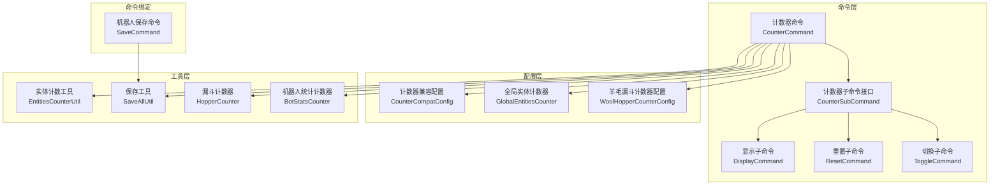
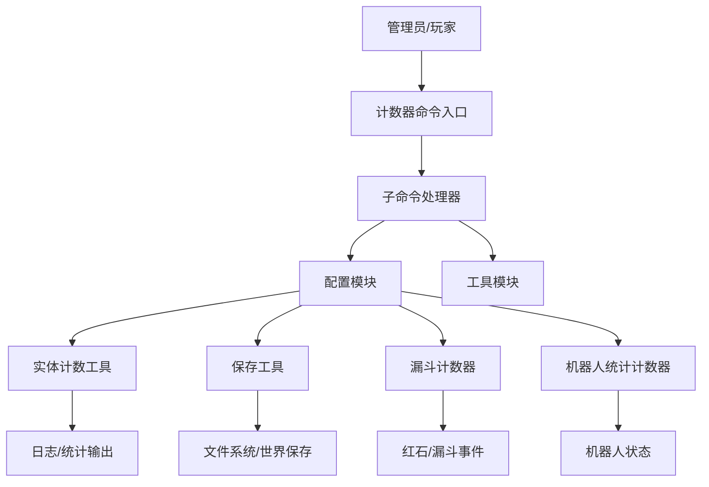
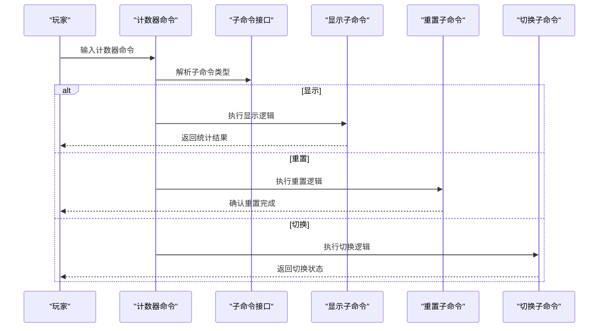
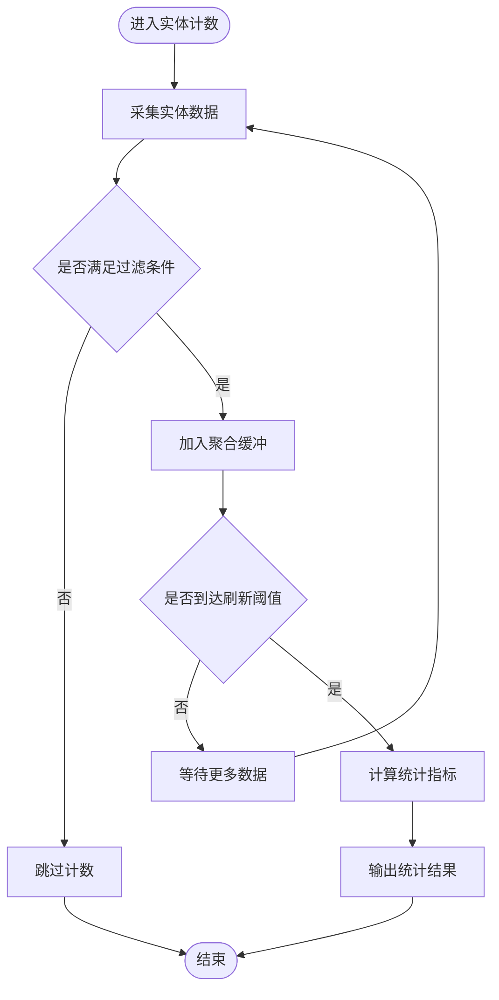
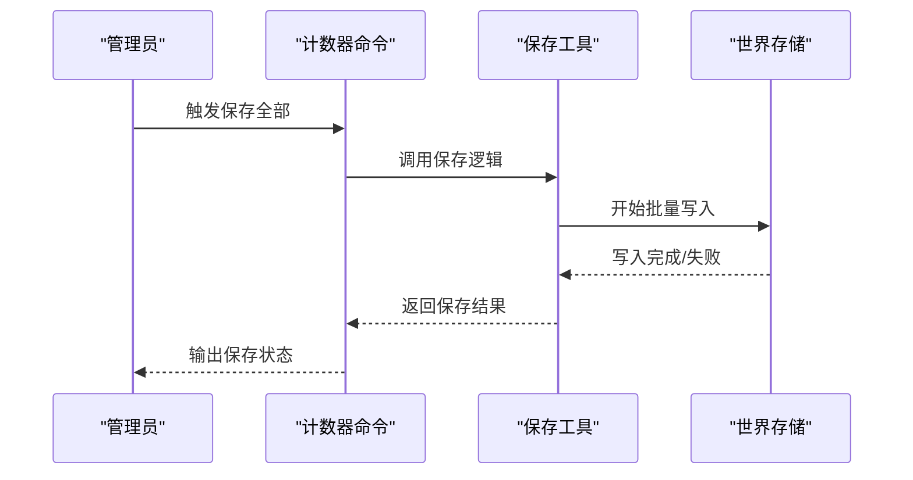
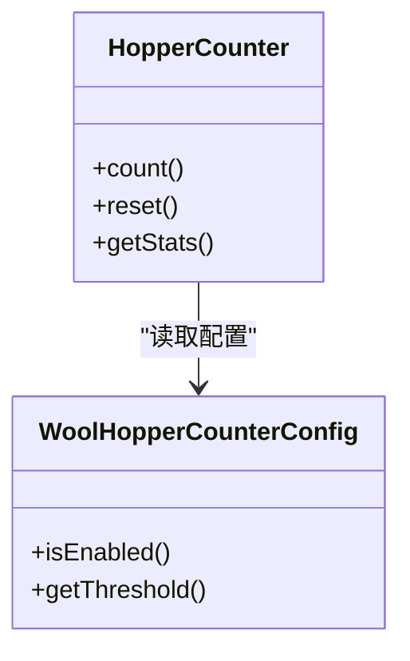
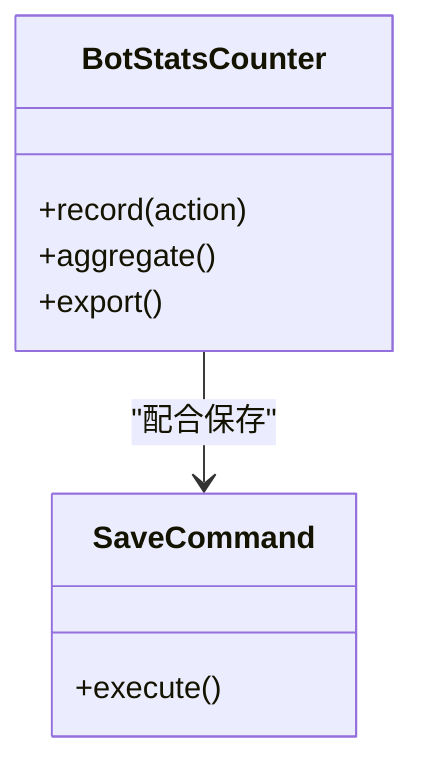
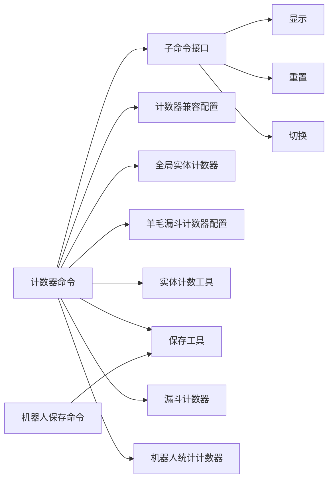

# 工具系统

<cite>
**本文引用的文件**
- [CounterCommand.java](file://lophine-server/src/main/java/fun/bm/lophine/command/counter/CounterCommand.java)
- [CounterSubCommand.java](file://lophine-server/src/main/java/fun/bm/lophine/command/counter/CounterSubCommand.java)
- [DisplayCommand.java](file://lophine-server/src/main/java/fun/bm/lophine/command/counter/sub/DisplayCommand.java)
- [ResetCommand.java](file://lophine-server/src/main/java/fun/bm/lophine/command/counter/sub/ResetCommand.java)
- [ToggleCommand.java](file://lophine-server/src/main/java/fun/bm/lophine/command/counter/sub/ToggleCommand.java)
- [CounterCompatConfig.java](file://lophine-server/src/main/java/fun/bm/lophine/carpet/config/modules/CounterCompatConfig.java)
- [GlobalEntitiesCounter.java](file://lophine-server/src/main/java/fun/bm/lophine/config/modules/experiment/GlobalEntitiesCounter.java)
- [WoolHopperCounterConfig.java](file://lophine-server/src/main/java/fun/bm/lophine/config/modules/function/WoolHopperCounterConfig.java)
- [EntitiesCounterUtil.java](file://lophine-server/src/main/java/fun/bm/lophine/utils/EntitiesCounterUtil.java)
- [SaveAllUtil.java](file://lophine-server/src/main/java/fun/bm/lophine/utils/SaveAllUtil.java)
- [HopperCounter.java](file://lophine-server/src/main/java/org/leavesmc/leaves/util/HopperCounter.java)
- [BotStatsCounter.java](file://lophine-server/src/main/java/org/leavesmc/leaves/bot/BotStatsCounter.java)
- [SaveCommand.java](file://lophine-server/src/main/java/org/leavesmc/leaves/command/bot/subcommands/SaveCommand.java)
</cite>

## 目录
1. [简介](#简介)
2. [项目结构](#项目结构)
3. [核心组件](#核心组件)
4. [架构总览](#架构总览)
5. [详细组件分析](#详细组件分析)
6. [依赖关系分析](#依赖关系分析)
7. [性能考量](#性能考量)
8. [故障排查指南](#故障排查指南)
9. [结论](#结论)
10. [附录](#附录)

## 简介
本指南面向Lophine工具系统，聚焦于实体计数器、保存工具、漏斗计数器等核心工具类，阐述其设计理念、实现原理与使用方法，并提供协作关系、性能优化建议、扩展与定制思路以及在服务器管理中的应用价值。读者无需深入源码即可理解各工具的职责边界与最佳实践。

## 项目结构
Lophine工具系统主要分布在以下模块中：
- 命令层：计数器命令及其子命令（显示、重置、切换）
- 配置层：计数器兼容性配置、全局实体计数器、羊毛漏斗计数器配置
- 工具层：实体计数工具、保存工具、漏斗计数器、机器人统计计数器
- 命令绑定：机器人保存命令

图表来源
- [CounterCommand.java:1-200](file://lophine-server/src/main/java/fun/bm/lophine/command/counter/CounterCommand.java#L1-L200)
- [CounterSubCommand.java:1-120](file://lophine-server/src/main/java/fun/bm/lophine/command/counter/CounterSubCommand.java#L1-L120)
- [DisplayCommand.java:1-120](file://lophine-server/src/main/java/fun/bm/lophine/command/counter/sub/DisplayCommand.java#L1-L120)
- [ResetCommand.java:1-120](file://lophine-server/src/main/java/fun/bm/lophine/command/counter/sub/ResetCommand.java#L1-L120)
- [ToggleCommand.java:1-120](file://lophine-server/src/main/java/fun/bm/lophine/command/counter/sub/ToggleCommand.java#L1-L120)
- [CounterCompatConfig.java:1-120](file://lophine-server/src/main/java/fun/bm/lophine/carpet/config/modules/CounterCompatConfig.java#L1-L120)
- [GlobalEntitiesCounter.java:1-120](file://lophine-server/src/main/java/fun/bm/lophine/config/modules/experiment/GlobalEntitiesCounter.java#L1-L120)
- [WoolHopperCounterConfig.java:1-120](file://lophine-server/src/main/java/fun/bm/lophine/config/modules/function/WoolHopperCounterConfig.java#L1-L120)
- [EntitiesCounterUtil.java:1-200](file://lophine-server/src/main/java/fun/bm/lophine/utils/EntitiesCounterUtil.java#L1-L200)
- [SaveAllUtil.java:1-200](file://lophine-server/src/main/java/fun/bm/lophine/utils/SaveAllUtil.java#L1-L200)
- [HopperCounter.java:1-200](file://lophine-server/src/main/java/org/leavesmc/leaves/util/HopperCounter.java#L1-L200)
- [BotStatsCounter.java:1-200](file://lophine-server/src/main/java/org/leavesmc/leaves/bot/BotStatsCounter.java#L1-L200)
- [SaveCommand.java:1-200](file://lophine-server/src/main/java/org/leavesmc/leaves/command/bot/subcommands/SaveCommand.java#L1-L200)

章节来源
- [CounterCommand.java:1-200](file://lophine-server/src/main/java/fun/bm/lophine/command/counter/CounterCommand.java#L1-L200)
- [CounterSubCommand.java:1-120](file://lophine-server/src/main/java/fun/bm/lophine/command/counter/CounterSubCommand.java#L1-L120)

## 核心组件
本节概述工具系统的关键组件及职责：
- 计数器命令体系：提供统一入口，分发到显示、重置、切换等子命令
- 实体计数工具：封装实体统计逻辑，支持全局计数与兼容模式
- 保存工具：提供“保存全部”能力，保障数据持久化
- 漏斗计数器：统计漏斗相关事件或状态变化
- 机器人统计计数器：记录机器人行为与状态统计数据
- 配置模块：控制计数器功能开关与兼容策略

章节来源
- [CounterCommand.java:1-200](file://lophine-server/src/main/java/fun/bm/lophine/command/counter/CounterCommand.java#L1-L200)
- [CounterSubCommand.java:1-120](file://lophine-server/src/main/java/fun/bm/lophine/command/counter/CounterSubCommand.java#L1-L120)
- [EntitiesCounterUtil.java:1-200](file://lophine-server/src/main/java/fun/bm/lophine/utils/EntitiesCounterUtil.java#L1-L200)
- [SaveAllUtil.java:1-200](file://lophine-server/src/main/java/fun/bm/lophine/utils/SaveAllUtil.java#L1-L200)
- [HopperCounter.java:1-200](file://lophine-server/src/main/java/org/leavesmc/leaves/util/HopperCounter.java#L1-L200)
- [BotStatsCounter.java:1-200](file://lophine-server/src/main/java/org/leavesmc/leaves/bot/BotStatsCounter.java#L1-L200)
- [CounterCompatConfig.java:1-120](file://lophine-server/src/main/java/fun/bm/lophine/carpet/config/modules/CounterCompatConfig.java#L1-L120)
- [GlobalEntitiesCounter.java:1-120](file://lophine-server/src/main/java/fun/bm/lophine/config/modules/experiment/GlobalEntitiesCounter.java#L1-L120)
- [WoolHopperCounterConfig.java:1-120](file://lophine-server/src/main/java/fun/bm/lophine/config/modules/function/WoolHopperCounterConfig.java#L1-L120)

## 架构总览
工具系统采用“命令-配置-工具”的分层设计：
- 命令层负责用户交互与参数解析
- 配置层提供功能开关与兼容策略
- 工具层封装具体业务逻辑与性能优化

图表来源
- [CounterCommand.java:1-200](file://lophine-server/src/main/java/fun/bm/lophine/command/counter/CounterCommand.java#L1-L200)
- [CounterSubCommand.java:1-120](file://lophine-server/src/main/java/fun/bm/lophine/command/counter/CounterSubCommand.java#L1-L120)
- [CounterCompatConfig.java:1-120](file://lophine-server/src/main/java/fun/bm/lophine/carpet/config/modules/CounterCompatConfig.java#L1-L120)
- [EntitiesCounterUtil.java:1-200](file://lophine-server/src/main/java/fun/bm/lophine/utils/EntitiesCounterUtil.java#L1-L200)
- [SaveAllUtil.java:1-200](file://lophine-server/src/main/java/fun/bm/lophine/utils/SaveAllUtil.java#L1-L200)
- [HopperCounter.java:1-200](file://lophine-server/src/main/java/org/leavesmc/leaves/util/HopperCounter.java#L1-L200)
- [BotStatsCounter.java:1-200](file://lophine-server/src/main/java/org/leavesmc/leaves/bot/BotStatsCounter.java#L1-L200)

## 详细组件分析

### 计数器命令体系
- 统一入口：计数器命令负责接收用户输入并路由到对应子命令
- 子命令职责：
  - 显示：展示当前计数状态与统计结果
  - 重置：清空计数器状态，恢复初始值
  - 切换：启用/禁用特定计数功能
- 设计要点：命令解耦、参数校验、权限控制、错误反馈

图表来源
- [CounterCommand.java:1-200](file://lophine-server/src/main/java/fun/bm/lophine/command/counter/CounterCommand.java#L1-L200)
- [CounterSubCommand.java:1-120](file://lophine-server/src/main/java/fun/bm/lophine/command/counter/CounterSubCommand.java#L1-L120)
- [DisplayCommand.java:1-120](file://lophine-server/src/main/java/fun/bm/lophine/command/counter/sub/DisplayCommand.java#L1-L120)
- [ResetCommand.java:1-120](file://lophine-server/src/main/java/fun/bm/lophine/command/counter/sub/ResetCommand.java#L1-L120)
- [ToggleCommand.java:1-120](file://lophine-server/src/main/java/fun/bm/lophine/command/counter/sub/ToggleCommand.java#L1-L120)

章节来源
- [CounterCommand.java:1-200](file://lophine-server/src/main/java/fun/bm/lophine/command/counter/CounterCommand.java#L1-L200)
- [CounterSubCommand.java:1-120](file://lophine-server/src/main/java/fun/bm/lophine/command/counter/CounterSubCommand.java#L1-L120)
- [DisplayCommand.java:1-120](file://lophine-server/src/main/java/fun/bm/lophine/command/counter/sub/DisplayCommand.java#L1-L120)
- [ResetCommand.java:1-120](file://lophine-server/src/main/java/fun/bm/lophine/command/counter/sub/ResetCommand.java#L1-L120)
- [ToggleCommand.java:1-120](file://lophine-server/src/main/java/fun/bm/lophine/command/counter/sub/ToggleCommand.java#L1-L120)

### 实体计数工具
- 职责：提供实体统计能力，支持全局计数与兼容模式
- 关键点：计数聚合、缓存策略、线程安全、阈值控制
- 典型流程：采集→过滤→聚合→输出

图表来源
- [EntitiesCounterUtil.java:1-200](file://lophine-server/src/main/java/fun/bm/lophine/utils/EntitiesCounterUtil.java#L1-L200)
- [GlobalEntitiesCounter.java:1-120](file://lophine-server/src/main/java/fun/bm/lophine/config/modules/experiment/GlobalEntitiesCounter.java#L1-L120)

章节来源
- [EntitiesCounterUtil.java:1-200](file://lophine-server/src/main/java/fun/bm/lophine/utils/EntitiesCounterUtil.java#L1-L200)
- [GlobalEntitiesCounter.java:1-120](file://lophine-server/src/main/java/fun/bm/lophine/config/modules/experiment/GlobalEntitiesCounter.java#L1-L120)

### 保存工具
- 职责：执行“保存全部”操作，确保世界数据持久化
- 关键点：批量写入、锁粒度控制、异常回滚、进度反馈
- 使用场景：维护窗口、备份前触发、高负载后强制落盘

图表来源
- [SaveAllUtil.java:1-200](file://lophine-server/src/main/java/fun/bm/lophine/utils/SaveAllUtil.java#L1-L200)
- [CounterCommand.java:1-200](file://lophine-server/src/main/java/fun/bm/lophine/command/counter/CounterCommand.java#L1-L200)

章节来源
- [SaveAllUtil.java:1-200](file://lophine-server/src/main/java/fun/bm/lophine/utils/SaveAllUtil.java#L1-L200)
- [CounterCommand.java:1-200](file://lophine-server/src/main/java/fun/bm/lophine/command/counter/CounterCommand.java#L1-L200)

### 漏斗计数器
- 职责：统计漏斗相关事件或状态变化，辅助性能分析与问题定位
- 关键点：事件监听、计数聚合、阈值报警、可视化输出
- 应用：红石自动化监控、物流系统性能评估

图表来源
- [HopperCounter.java:1-200](file://lophine-server/src/main/java/org/leavesmc/leaves/util/HopperCounter.java#L1-L200)
- [WoolHopperCounterConfig.java:1-120](file://lophine-server/src/main/java/fun/bm/lophine/config/modules/function/WoolHopperCounterConfig.java#L1-L120)

章节来源
- [HopperCounter.java:1-200](file://lophine-server/src/main/java/org/leavesmc/leaves/util/HopperCounter.java#L1-L200)
- [WoolHopperCounterConfig.java:1-120](file://lophine-server/src/main/java/fun/bm/lophine/config/modules/function/WoolHopperCounterConfig.java#L1-L120)

### 机器人统计计数器
- 职责：记录机器人行为与状态统计数据，便于运营与审计
- 关键点：事件埋点、聚合维度、持久化存储、查询接口
- 应用：机器人行为分析、资源消耗统计、合规审计

图表来源
- [BotStatsCounter.java:1-200](file://lophine-server/src/main/java/org/leavesmc/leaves/bot/BotStatsCounter.java#L1-L200)
- [SaveCommand.java:1-200](file://lophine-server/src/main/java/org/leavesmc/leaves/command/bot/subcommands/SaveCommand.java#L1-L200)

章节来源
- [BotStatsCounter.java:1-200](file://lophine-server/src/main/java/org/leavesmc/leaves/bot/BotStatsCounter.java#L1-L200)
- [SaveCommand.java:1-200](file://lophine-server/src/main/java/org/leavesmc/leaves/command/bot/subcommands/SaveCommand.java#L1-L200)

## 依赖关系分析
- 命令层依赖配置层与工具层；配置层为工具层提供开关与阈值；工具层彼此独立但共享通用机制
- 计数器命令通过子命令接口解耦具体实现
- 保存工具与机器人保存命令存在协作关系，共同保障数据持久化

图表来源
- [CounterCommand.java:1-200](file://lophine-server/src/main/java/fun/bm/lophine/command/counter/CounterCommand.java#L1-L200)
- [CounterSubCommand.java:1-120](file://lophine-server/src/main/java/fun/bm/lophine/command/counter/CounterSubCommand.java#L1-L120)
- [CounterCompatConfig.java:1-120](file://lophine-server/src/main/java/fun/bm/lophine/carpet/config/modules/CounterCompatConfig.java#L1-L120)
- [GlobalEntitiesCounter.java:1-120](file://lophine-server/src/main/java/fun/bm/lophine/config/modules/experiment/GlobalEntitiesCounter.java#L1-L120)
- [WoolHopperCounterConfig.java:1-120](file://lophine-server/src/main/java/fun/bm/lophine/config/modules/function/WoolHopperCounterConfig.java#L1-L120)
- [EntitiesCounterUtil.java:1-200](file://lophine-server/src/main/java/fun/bm/lophine/utils/EntitiesCounterUtil.java#L1-L200)
- [SaveAllUtil.java:1-200](file://lophine-server/src/main/java/fun/bm/lophine/utils/SaveAllUtil.java#L1-L200)
- [HopperCounter.java:1-200](file://lophine-server/src/main/java/org/leavesmc/leaves/util/HopperCounter.java#L1-L200)
- [BotStatsCounter.java:1-200](file://lophine-server/src/main/java/org/leavesmc/leaves/bot/BotStatsCounter.java#L1-L200)
- [SaveCommand.java:1-200](file://lophine-server/src/main/java/org/leavesmc/leaves/command/bot/subcommands/SaveCommand.java#L1-L200)

章节来源
- [CounterCommand.java:1-200](file://lophine-server/src/main/java/fun/bm/lophine/command/counter/CounterCommand.java#L1-L200)
- [CounterSubCommand.java:1-120](file://lophine-server/src/main/java/fun/bm/lophine/command/counter/CounterSubCommand.java#L1-L120)
- [SaveCommand.java:1-200](file://lophine-server/src/main/java/org/leavesmc/leaves/command/bot/subcommands/SaveCommand.java#L1-L200)

## 性能考量
- 实体计数
  - 使用批量处理与阈值刷新，避免高频写入
  - 合理设置过滤条件，减少无效统计
- 保存工具
  - 在低峰期触发“保存全部”，避免高峰时段IO压力
  - 分批写入与锁粒度优化，缩短阻塞时间
- 漏斗计数器
  - 配置合理阈值，避免过度报警
  - 事件采样与聚合，降低CPU占用
- 机器人统计
  - 异步聚合与落盘，减少主线程阻塞
  - 定期导出与归档，控制内存占用

## 故障排查指南
- 计数器无输出
  - 检查计数器功能开关与兼容配置
  - 确认过滤条件是否过于严格
- 保存失败
  - 查看磁盘空间与权限
  - 检查是否存在长时间IO阻塞
- 漏斗异常
  - 核对阈值配置与事件监听
  - 排查红石电路与方块状态
- 机器人统计缺失
  - 确认事件埋点是否生效
  - 检查聚合周期与导出流程

章节来源
- [CounterCompatConfig.java:1-120](file://lophine-server/src/main/java/fun/bm/lophine/carpet/config/modules/CounterCompatConfig.java#L1-L120)
- [SaveAllUtil.java:1-200](file://lophine-server/src/main/java/fun/bm/lophine/utils/SaveAllUtil.java#L1-L200)
- [HopperCounter.java:1-200](file://lophine-server/src/main/java/org/leavesmc/leaves/util/HopperCounter.java#L1-L200)
- [BotStatsCounter.java:1-200](file://lophine-server/src/main/java/org/leavesmc/leaves/bot/BotStatsCounter.java#L1-L200)

## 结论
Lophine工具系统以清晰的分层设计实现了计数、保存、统计与监控能力。通过命令-配置-工具的协作，既保证了灵活性，又兼顾了性能与稳定性。建议在生产环境中结合业务场景合理配置阈值与刷新策略，并定期进行数据导出与归档，以获得最佳运维体验。

## 附录
- 最佳实践
  - 在维护窗口执行“保存全部”
  - 设置合理的计数阈值与刷新周期
  - 对关键统计建立告警与巡检机制
- 扩展与定制
  - 新增计数器：实现子命令接口与工具类，注册到命令入口
  - 自定义配置：新增配置模块并接入计数器命令
  - 性能优化：引入异步处理与缓存策略
- 服务器管理价值
  - 提升可观测性：实时掌握实体与漏斗状态
  - 保障稳定性：降低IO压力与异常风险
  - 支持自动化：为运维脚本与监控系统提供数据支撑