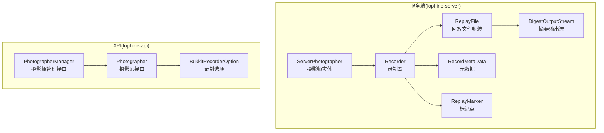
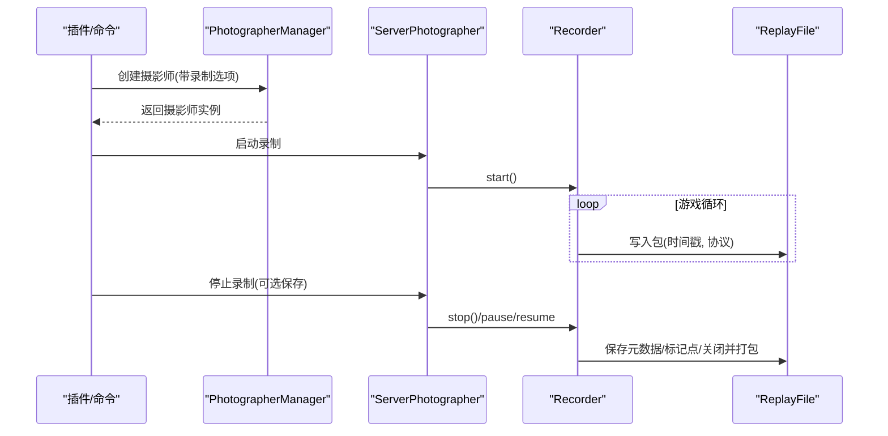
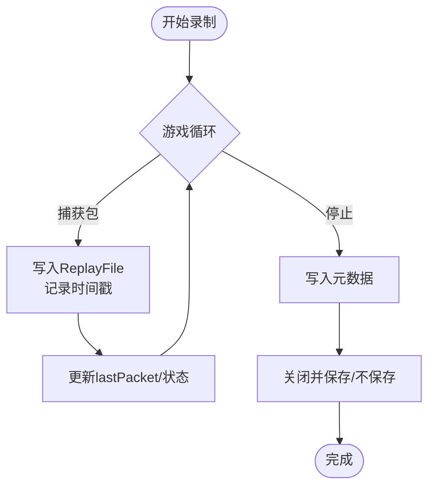
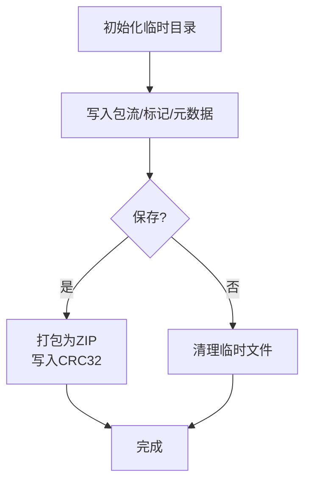
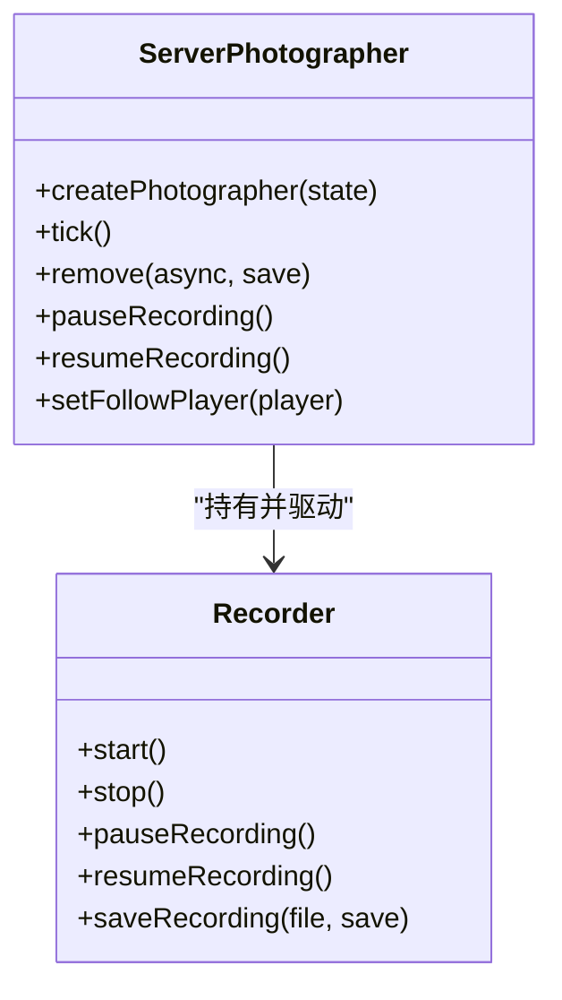
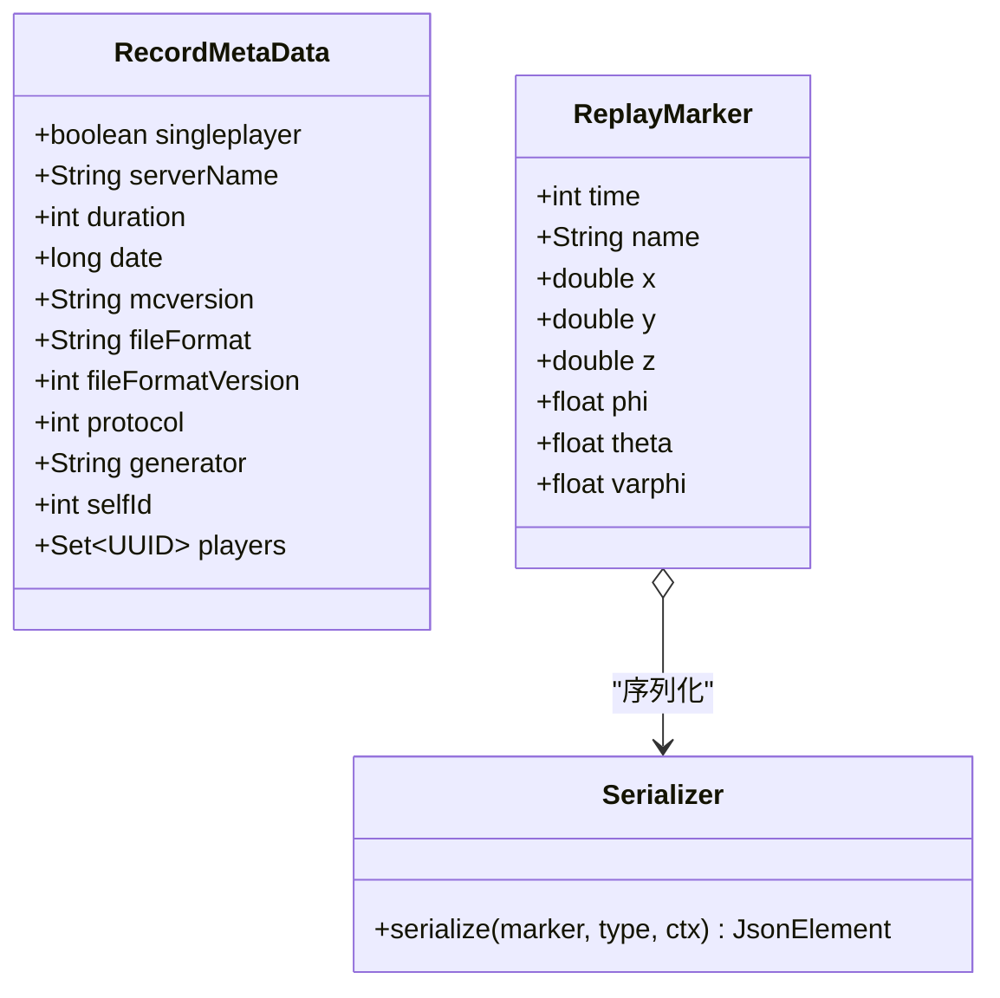
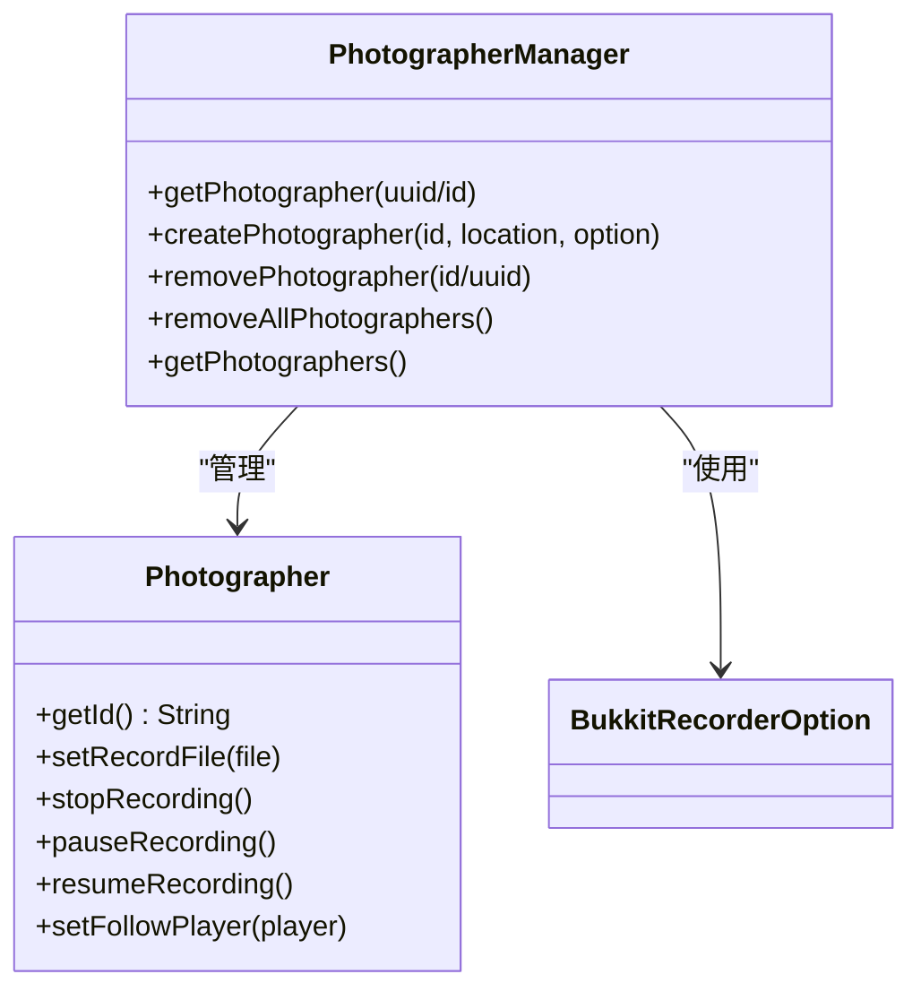
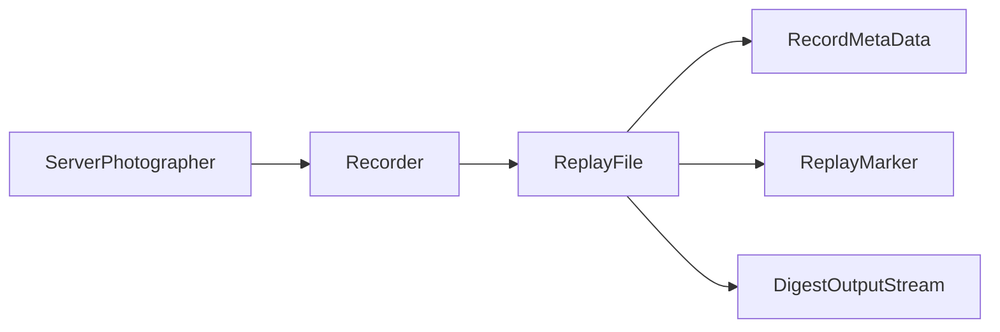

# 录制回放系统

<cite>
**本文引用的文件**
- [Recorder.java](file://lophine-server/src/main/java/org/leavesmc/leaves/replay/Recorder.java)
- [ReplayFile.java](file://lophine-server/src/main/java/org/leavesmc/leaves/replay/ReplayFile.java)
- [RecordMetaData.java](file://lophine-server/src/main/java/org/leavesmc/leaves/replay/RecordMetaData.java)
- [ReplayMarker.java](file://lophine-server/src/main/java/org/leavesmc/leaves/replay/ReplayMarker.java)
- [ServerPhotographer.java](file://lophine-server/src/main/java/org/leavesmc/leaves/replay/ServerPhotographer.java)
- [Photographer.java](file://lophine-api/src/main/java/org/leavesmc/leaves/entity/photographer/Photographer.java)
- [PhotographerManager.java](file://lophine-api/src/main/java/org/leavesmc/leaves/entity/photographer/PhotographerManager.java)
- [BukkitRecorderOption.java](file://lophine-api/src/main/java/org/leavesmc/leaves/replay/BukkitRecorderOption.java)
- [DigestOutputStream.java](file://lophine-server/src/main/java/org/leavesmc/leaves/replay/DigestOutputStream.java)
- [README.md](file://README.md)
- [README_EN.md](file://README_EN.md)
</cite>

## 目录
1. [简介](#简介)
2. [项目结构](#项目结构)
3. [核心组件](#核心组件)
4. [架构总览](#架构总览)
5. [详细组件分析](#详细组件分析)
6. [依赖关系分析](#依赖关系分析)
7. [性能考虑](#性能考虑)
8. [故障排除指南](#故障排除指南)
9. [结论](#结论)
10. [附录](#附录)

## 简介
本技术文档面向Lophine录制回放系统，系统通过“摄影师实体”在服务端模拟玩家行为，实时捕获客户端-服务器网络包并写入本地压缩归档文件，支持暂停/恢复录制、标记点管理、元数据记录与异步保存。本文从架构设计、数据采集与存储格式、回放引擎工作原理、API使用指南、标记系统、质量控制与压缩优化、调试与故障排除以及第三方工具集成等方面进行深入解析。

## 项目结构
- 核心模块
  - lophine-server：服务端实现，包含录制器、回放文件封装、摄影师实体、元数据与标记模型等
  - lophine-api：对外API接口，定义摄影师与录制选项等契约
- 关键目录
  - org.leavesmc.leaves.replay：录制回放核心类（Recorder、ReplayFile、RecordMetaData、ReplayMarker、ServerPhotographer等）
  - org.leavesmc.leaves.entity.photographer：摄影师实体与管理接口
  - org.leavesmc.leaves.replay：录制选项API（BukkitRecorderOption）

图表来源
- [Recorder.java:65-279](file://lophine-server/src/main/java/org/leavesmc/leaves/replay/Recorder.java#L65-L279)
- [ReplayFile.java:52-187](file://lophine-server/src/main/java/org/leavesmc/leaves/replay/ReplayFile.java#L52-L187)
- [RecordMetaData.java:24-39](file://lophine-server/src/main/java/org/leavesmc/leaves/replay/RecordMetaData.java#L24-L39)
- [ReplayMarker.java:24-56](file://lophine-server/src/main/java/org/leavesmc/leaves/replay/ReplayMarker.java#L24-L56)
- [ServerPhotographer.java:56-215](file://lophine-server/src/main/java/org/leavesmc/leaves/replay/ServerPhotographer.java#L56-L215)
- [Photographer.java:26-43](file://lophine-api/src/main/java/org/leavesmc/leaves/entity/photographer/Photographer.java#L26-L43)
- [PhotographerManager.java:28-44](file://lophine-api/src/main/java/org/leavesmc/leaves/entity/photographer/PhotographerManager.java#L28-L44)
- [BukkitRecorderOption.java](file://lophine-api/src/main/java/org/leavesmc/leaves/replay/BukkitRecorderOption.java)

章节来源
- [Recorder.java:65-279](file://lophine-server/src/main/java/org/leavesmc/leaves/replay/Recorder.java#L65-L279)
- [ReplayFile.java:52-187](file://lophine-server/src/main/java/org/leavesmc/leaves/replay/ReplayFile.java#L52-L187)
- [ServerPhotographer.java:56-215](file://lophine-server/src/main/java/org/leavesmc/leaves/replay/ServerPhotographer.java#L56-L215)
- [Photographer.java:26-43](file://lophine-api/src/main/java/org/leavesmc/leaves/entity/photographer/Photographer.java#L26-L43)
- [PhotographerManager.java:28-44](file://lophine-api/src/main/java/org/leavesmc/leaves/entity/photographer/PhotographerManager.java#L28-L44)
- [BukkitRecorderOption.java](file://lophine-api/src/main/java/org/leavesmc/leaves/replay/BukkitRecorderOption.java)

## 核心组件
- 录制器 Recorder
  - 负责监听连接状态、计算时间戳、将网络包写入ReplayFile，并在结束时保存元数据与文件
  - 支持暂停/恢复录制、异步保存、线程安全的状态控制
- 回放文件 ReplayFile
  - 使用临时目录收集分片数据，最终打包为ZIP归档；包含CRC校验文件；支持标记点与元数据JSON
- 摄影师 ServerPhotographer
  - 服务端实体，作为“非玩家”的观察者，创建Recorder并驱动录制生命周期
  - 提供跟随玩家、移除与保存等能力
- 元数据 RecordMetaData
  - 记录录制时长、日期、Minecraft版本、协议号、生成器、玩家集合等
- 标记点 ReplayMarker
  - 记录时间戳与空间姿态信息，序列化为JSON用于回放导航
- API接口
  - Photographer/PhotographerManager：对外暴露摄影师创建、查询、删除与录制控制
  - BukkitRecorderOption：录制选项配置（如是否单人模式、自定义路径等）

章节来源
- [Recorder.java:65-279](file://lophine-server/src/main/java/org/leavesmc/leaves/replay/Recorder.java#L65-L279)
- [ReplayFile.java:52-187](file://lophine-server/src/main/java/org/leavesmc/leaves/replay/ReplayFile.java#L52-L187)
- [ServerPhotographer.java:56-215](file://lophine-server/src/main/java/org/leavesmc/leaves/replay/ServerPhotographer.java#L56-L215)
- [RecordMetaData.java:24-39](file://lophine-server/src/main/java/org/leavesmc/leaves/replay/RecordMetaData.java#L24-L39)
- [ReplayMarker.java:24-56](file://lophine-server/src/main/java/org/leavesmc/leaves/replay/ReplayMarker.java#L24-L56)
- [Photographer.java:26-43](file://lophine-api/src/main/java/org/leavesmc/leaves/entity/photographer/Photographer.java#L26-L43)
- [PhotographerManager.java:28-44](file://lophine-api/src/main/java/org/leavesmc/leaves/entity/photographer/PhotographerManager.java#L28-L44)
- [BukkitRecorderOption.java](file://lophine-api/src/main/java/org/leavesmc/leaves/replay/BukkitRecorderOption.java)

## 架构总览
系统采用“实体驱动+事件捕获+异步持久化”的架构：
- 摄影师实体在服务端创建并加入世界，启动Recorder
- Recorder根据连接协议与时间轴捕获网络包，写入ReplayFile的临时目录
- 结束时异步保存元数据与标记点，打包为ZIP并生成CRC校验
- 外部API允许插件或命令对摄影师进行生命周期与录制控制

图表来源
- [ServerPhotographer.java:66-105](file://lophine-server/src/main/java/org/leavesmc/leaves/replay/ServerPhotographer.java#L66-L105)
- [Recorder.java:87-105](file://lophine-server/src/main/java/org/leavesmc/leaves/replay/Recorder.java#L87-L105)
- [ReplayFile.java:146-187](file://lophine-server/src/main/java/org/leavesmc/leaves/replay/ReplayFile.java#L146-L187)

## 详细组件分析

### 组件A：Recorder（录制器）
- 职责
  - 维护连接协议状态、计算时间戳、将包写入ReplayFile
  - 控制录制生命周期：开始、暂停、恢复、停止
  - 异步保存录制产物，确保线程安全
- 关键流程
  - 启动后进入主循环，按帧/事件捕获包
  - 每个包写入时计算相对时间戳，更新lastPacket
  - 结束时写入元数据，触发ReplayFile保存与打包

图表来源
- [Recorder.java:242-279](file://lophine-server/src/main/java/org/leavesmc/leaves/replay/Recorder.java#L242-L279)
- [ReplayFile.java:146-187](file://lophine-server/src/main/java/org/leavesmc/leaves/replay/ReplayFile.java#L146-L187)

章节来源
- [Recorder.java:65-279](file://lophine-server/src/main/java/org/leavesmc/leaves/replay/Recorder.java#L65-L279)

### 组件B：ReplayFile（回放文件封装）
- 职责
  - 以临时目录收集数据，最终打包为ZIP归档
  - 写入标记点与元数据JSON
  - 生成CRC32校验值，保证完整性
- 存储策略
  - 临时目录命名规则：原文件名加“.tmp”
  - 归档内包含：recording.tmcpr（原始包流）、markers.json、metaData.json、recording.tmcpr.crc32
  - 关闭时将临时文件删除或保留，取决于保存策略

图表来源
- [ReplayFile.java:72-187](file://lophine-server/src/main/java/org/leavesmc/leaves/replay/ReplayFile.java#L72-L187)

章节来源
- [ReplayFile.java:52-187](file://lophine-server/src/main/java/org/leavesmc/leaves/replay/ReplayFile.java#L52-L187)

### 组件C：ServerPhotographer（摄影师实体）
- 职责
  - 作为服务端实体承载Recorder，负责位置同步、相机跟随、可见性控制
  - 生命周期管理：创建、放置、移除、保存
- 关键交互
  - 创建时绑定Recorder并加入玩家列表
  - 移除时调用Recorder.stop并异步保存文件

图表来源
- [ServerPhotographer.java:56-215](file://lophine-server/src/main/java/org/leavesmc/leaves/replay/ServerPhotographer.java#L56-L215)
- [Recorder.java:65-105](file://lophine-server/src/main/java/org/leavesmc/leaves/replay/Recorder.java#L65-L105)

章节来源
- [ServerPhotographer.java:56-215](file://lophine-server/src/main/java/org/leavesmc/leaves/replay/ServerPhotographer.java#L56-L215)

### 组件D：元数据与标记系统
- 元数据 RecordMetaData
  - 字段：单人模式标志、服务器名称、时长、日期、Minecraft版本、文件格式、格式版本、协议号、生成器、自身ID、玩家集合
  - 版本常量：CURRENT_FILE_FORMAT_VERSION
- 标记点 ReplayMarker
  - 字段：时间戳、名称、三维坐标与欧拉角（yaw/pitch/roll）
  - 序列化器：将标记点转为JSON，便于外部工具解析

图表来源
- [RecordMetaData.java:24-39](file://lophine-server/src/main/java/org/leavesmc/leaves/replay/RecordMetaData.java#L24-L39)
- [ReplayMarker.java:24-56](file://lophine-server/src/main/java/org/leavesmc/leaves/replay/ReplayMarker.java#L24-L56)

章节来源
- [RecordMetaData.java:24-39](file://lophine-server/src/main/java/org/leavesmc/leaves/replay/RecordMetaData.java#L24-L39)
- [ReplayMarker.java:24-56](file://lophine-server/src/main/java/org/leavesmc/leaves/replay/ReplayMarker.java#L24-L56)

### 组件E：API与录制选项
- Photographer 接口
  - 定义摄影师标识、录制文件设置、录制控制（停止、暂停、恢复）、跟随玩家设置
- PhotographerManager 接口
  - 提供创建、查询、删除、清空摄影师与获取列表的能力
- BukkitRecorderOption
  - 对外API中的录制选项，用于控制录制行为（如单人模式、目标文件路径等）

图表来源
- [Photographer.java:26-43](file://lophine-api/src/main/java/org/leavesmc/leaves/entity/photographer/Photographer.java#L26-L43)
- [PhotographerManager.java:28-44](file://lophine-api/src/main/java/org/leavesmc/leaves/entity/photographer/PhotographerManager.java#L28-L44)
- [BukkitRecorderOption.java](file://lophine-api/src/main/java/org/leavesmc/leaves/replay/BukkitRecorderOption.java)

章节来源
- [Photographer.java:26-43](file://lophine-api/src/main/java/org/leavesmc/leaves/entity/photographer/Photographer.java#L26-L43)
- [PhotographerManager.java:28-44](file://lophine-api/src/main/java/org/leavesmc/leaves/entity/photographer/PhotographerManager.java#L28-L44)
- [BukkitRecorderOption.java](file://lophine-api/src/main/java/org/leavesmc/leaves/replay/BukkitRecorderOption.java)

## 依赖关系分析
- 组件耦合
  - ServerPhotographer 持有 Recorder 并驱动其生命周期
  - Recorder 依赖 ReplayFile 进行数据落盘与打包
  - ReplayFile 依赖标记点与元数据模型进行文件组织
- 外部依赖
  - ZIP打包、CRC32校验、Gson序列化
  - 异步执行器用于保存任务隔离

图表来源
- [ServerPhotographer.java:79-83](file://lophine-server/src/main/java/org/leavesmc/leaves/replay/ServerPhotographer.java#L79-L83)
- [Recorder.java:70-74](file://lophine-server/src/main/java/org/leavesmc/leaves/replay/Recorder.java#L70-L74)
- [ReplayFile.java:59-60](file://lophine-server/src/main/java/org/leavesmc/leaves/replay/ReplayFile.java#L59-L60)
- [DigestOutputStream.java](file://lophine-server/src/main/java/org/leavesmc/leaves/replay/DigestOutputStream.java)

章节来源
- [ServerPhotographer.java:56-215](file://lophine-server/src/main/java/org/leavesmc/leaves/replay/ServerPhotographer.java#L56-L215)
- [Recorder.java:65-105](file://lophine-server/src/main/java/org/leavesmc/leaves/replay/Recorder.java#L65-L105)
- [ReplayFile.java:52-83](file://lophine-server/src/main/java/org/leavesmc/leaves/replay/ReplayFile.java#L52-L83)
- [DigestOutputStream.java](file://lophine-server/src/main/java/org/leavesmc/leaves/replay/DigestOutputStream.java)

## 性能考虑
- 异步保存
  - 使用独立线程池执行保存任务，避免阻塞主线程
- 时间戳与节流
  - 按帧/事件计算时间戳，减少冗余写入
- 文件组织
  - 临时目录+ZIP归档+CRC校验，降低磁盘碎片与IO放大
- 实体移动与相机同步
  - 摄影师定期重置位置并移动到新区块，避免过度渲染与网络压力

章节来源
- [Recorder.java:68-74](file://lophine-server/src/main/java/org/leavesmc/leaves/replay/Recorder.java#L68-L74)
- [ServerPhotographer.java:108-130](file://lophine-server/src/main/java/org/leavesmc/leaves/replay/ServerPhotographer.java#L108-L130)

## 故障排除指南
- 常见问题
  - 重复保存：saveRecording被重复调用会记录错误日志
  - 异步修改数据：保存包时若存在插件异步修改数据，可能抛出异常
  - 文件已存在：临时目录无法清理或创建失败
- 排查步骤
  - 检查日志中关于“Are you using some plugin that modify data asynchronously?”的提示
  - 确认录制文件未被占用且权限正确
  - 验证ZIP归档与CRC32一致性
- 相关定位
  - 保存异常与重复调用处理
  - 临时目录创建与清理逻辑

章节来源
- [Recorder.java:242-279](file://lophine-server/src/main/java/org/leavesmc/leaves/replay/Recorder.java#L242-L279)
- [ReplayFile.java:72-83](file://lophine-server/src/main/java/org/leavesmc/leaves/replay/ReplayFile.java#L72-L83)
- [ReplayFile.java:146-187](file://lophine-server/src/main/java/org/leavesmc/leaves/replay/ReplayFile.java#L146-L187)

## 结论
Lophine录制回放系统通过摄影师实体与Recorder实现高可靠的数据采集，配合ReplayFile的异步保存与ZIP归档策略，形成完整的录制-存储-回放闭环。元数据与标记点模型为回放导航与工具链集成提供基础。系统在性能与稳定性之间取得平衡，适合在生产环境中长期运行。

## 附录

### 录制与回放API使用指南
- 创建摄影师并开始录制
  - 通过PhotographerManager创建摄影师，传入位置与录制选项
  - 摄影师内部启动Recorder并加入世界
- 控制录制
  - 停止录制：支持同步/异步与是否保存
  - 暂停/恢复：在录制过程中动态控制
- 设置跟随
  - 将摄影师相机切换为指定玩家，实现第一人称视角录制
- 查询与管理
  - 获取摄影师实例、批量删除、清空所有摄影师

章节来源
- [PhotographerManager.java:28-44](file://lophine-api/src/main/java/org/leavesmc/leaves/entity/photographer/PhotographerManager.java#L28-L44)
- [Photographer.java:26-43](file://lophine-api/src/main/java/org/leavesmc/leaves/entity/photographer/Photographer.java#L26-L43)
- [ServerPhotographer.java:66-105](file://lophine-server/src/main/java/org/leavesmc/leaves/replay/ServerPhotographer.java#L66-L105)

### 数据结构与存储策略
- 录制文件结构
  - 归档内文件：recording.tmcpr、markers.json、metaData.json、recording.tmcpr.crc32
  - 临时目录：与目标文件同名加“.tmp”
- 元数据字段
  - 包含时长、版本、协议、生成器、玩家集合等
- 标记点结构
  - 时间戳、名称与三维坐标及欧拉角

章节来源
- [ReplayFile.java:54-57](file://lophine-server/src/main/java/org/leavesmc/leaves/replay/ReplayFile.java#L54-L57)
- [RecordMetaData.java:24-39](file://lophine-server/src/main/java/org/leavesmc/leaves/replay/RecordMetaData.java#L24-L39)
- [ReplayMarker.java:24-56](file://lophine-server/src/main/java/org/leavesmc/leaves/replay/ReplayMarker.java#L24-L56)

### 回放引擎工作原理与性能优化
- 工作原理
  - 读取ZIP归档内的recording.tmcpr与元数据，按时间戳顺序回放包
  - 标记点用于导航与跳转
- 性能优化
  - 异步保存与单线程写入，避免锁竞争
  - 临时目录+一次性打包，减少多次IO
  - CRC32校验保障数据完整性

章节来源
- [ReplayFile.java:146-187](file://lophine-server/src/main/java/org/leavesmc/leaves/replay/ReplayFile.java#L146-L187)
- [DigestOutputStream.java](file://lophine-server/src/main/java/org/leavesmc/leaves/replay/DigestOutputStream.java)

### 质量控制、压缩与存储优化
- 质量控制
  - 元数据记录Minecraft版本与协议号，确保兼容性
  - 标记点辅助定位关键节点
- 压缩与校验
  - 使用ZIP压缩包，附带CRC32校验
- 存储优化
  - 临时目录集中管理，完成后统一清理或保留

章节来源
- [RecordMetaData.java:24-39](file://lophine-server/src/main/java/org/leavesmc/leaves/replay/RecordMetaData.java#L24-L39)
- [ReplayFile.java:146-187](file://lophine-server/src/main/java/org/leavesmc/leaves/replay/ReplayFile.java#L146-L187)

### 第三方工具集成方案
- 与地图/可视化工具
  - 标记点JSON可被外部工具解析，用于时间轴标注与路径展示
- 与协议扩展
  - 通过协议层扩展可接入更多可视化与分析工具
- 文档参考
  - 参考项目根目录下的README与国际化README获取更多背景信息

章节来源
- [README.md](file://README.md)
- [README_EN.md](file://README_EN.md)