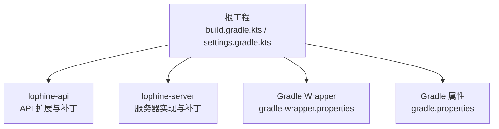
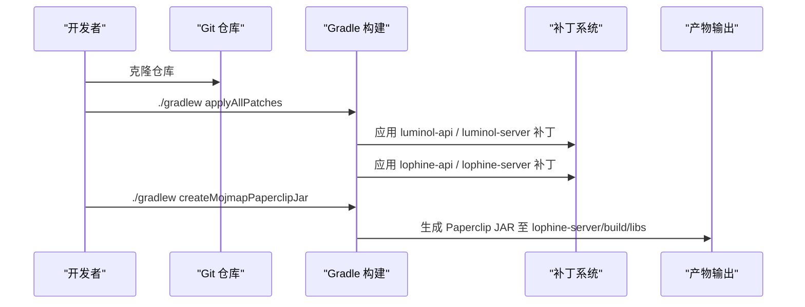
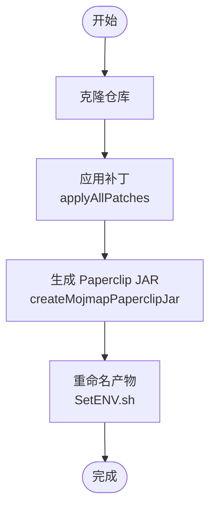
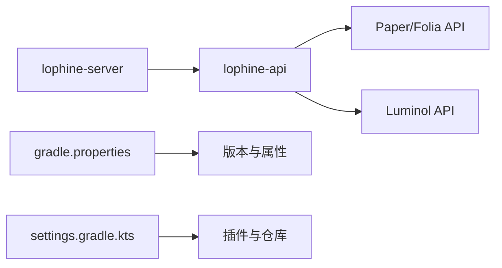

# 快速开始

<cite>
**本文引用的文件**
- [README.md](file://README.md)
- [build.gradle.kts](file://build.gradle.kts)
- [gradle.properties](file://gradle.properties)
- [settings.gradle.kts](file://settings.gradle.kts)
- [gradle-wrapper.properties](file://gradle-wrapper.properties)
- [lophine-api\build.gradle.kts.patch](file://lophine-api/build.gradle.kts.patch)
- [lophine-server\build.gradle.kts.patch](file://lophine-server/build.gradle.kts.patch)
- [scripts\SetENV.sh](file://scripts/SetENV.sh)
- [docs\CONTRIBUTING.md](file://docs/CONTRIBUTING.md)
- [docs\carpet-compat-status.md](file://docs/carpet-compat-status.md)
- [.github\ISSUE_TEMPLATE\bug-report.yml](file://.github/ISSUE_TEMPLATE/bug-report.yml)
</cite>

## 目录
1. [简介](#简介)
2. [项目结构](#项目结构)
3. [核心组件](#核心组件)
4. [架构总览](#架构总览)
5. [详细组件分析](#详细组件分析)
6. [依赖关系分析](#依赖关系分析)
7. [性能注意事项](#性能注意事项)
8. [故障排查指南](#故障排查指南)
9. [结论](#结论)
10. [附录](#附录)

## 简介
本指南面向初学者与进阶用户，帮助你在最短时间内完成 Lophine 项目的环境准备、源码构建、JAR 产物生成与首次运行验证。内容涵盖：
- 环境要求与前置条件（Java、Gradle、系统配置）
- 从克隆到构建的完整流程（含补丁应用与产物命名）
- 不同操作系统下的安装与常见问题处理
- 基础配置说明与首次运行验证方法
- 服务器管理员部署建议与插件开发者环境搭建要点

## 项目结构
Lophine 采用多模块 Gradle 工程，核心模块包括：
- lophine-api：对 Paper/Folia/API 的扩展与适配
- lophine-server：基于 Luminol 分支的服务器实现，包含大量补丁目录
- 根工程：统一 Java Toolchain、仓库与构建参数

图表来源
- [build.gradle.kts:1-118](file://build.gradle.kts#L1-L118)
- [settings.gradle.kts:1-25](file://settings.gradle.kts#L1-L25)
- [gradle-wrapper.properties:1-8](file://gradle-wrapper.properties#L1-L8)
- [gradle.properties:1-18](file://gradle.properties#L1-L18)

章节来源
- [build.gradle.kts:1-118](file://build.gradle.kts#L1-L118)
- [settings.gradle.kts:1-25](file://settings.gradle.kts#L1-L25)
- [gradle.properties:1-18](file://gradle.properties#L1-L18)
- [gradle-wrapper.properties:1-8](file://gradle-wrapper.properties#L1-L8)

## 核心组件
- Java Toolchain 与编译参数
  - 工程统一使用 Java 21 Toolchain，编译与 Javadoc 均指定 release 21
  - 启用 UTF-8 编码与可复现打包
- 仓库与发布
  - 默认仓库包含 Maven Central、Paper 官方仓库与 MenthaMC 私有仓库
  - 发布配置指向 MenthaMC Snapshots 仓库（需凭环境变量凭据）
- 构建任务
  - applyAllPatches：应用上游与本地补丁
  - createMojmapPaperclipJar：生成带 mojmap 映射的 Paperclip JAR
  - 产物输出至 lophine-server/build/libs

章节来源
- [build.gradle.kts:46-109](file://build.gradle.kts#L46-L109)
- [gradle.properties:1-18](file://gradle.properties#L1-L18)

## 架构总览
下图展示从源码到最终 JAR 的关键步骤与模块关系。

图表来源
- [README.md:40-51](file://README.md#L40-L51)
- [lophine-server\build.gradle.kts.patch:1-82](file://lophine-server/build.gradle.kts.patch#L1-L82)
- [lophine-api\build.gradle.kts.patch:1-28](file://lophine-api/build.gradle.kts.patch#L1-L28)

章节来源
- [README.md:40-51](file://README.md#L40-L51)
- [lophine-server\build.gradle.kts.patch:1-82](file://lophine-server/build.gradle.kts.patch#L1-L82)
- [lophine-api\build.gradle.kts.patch:1-28](file://lophine-api/build.gradle.kts.patch#L1-L28)

## 详细组件分析

### 环境要求与前置条件
- Java 版本
  - 使用 Java 21 Toolchain；编译与运行均需 JDK 21 或以上
- Gradle
  - 使用 Gradle Wrapper，默认分发地址为阿里云镜像
  - 推荐启用配置缓存、构建缓存、并行构建与 VFS watch 关闭以提升性能
- 系统与工具
  - 需要 Git；Windows 用户需启用长路径支持
- 仓库访问
  - 默认仓库包含 Maven Central、Paper 官方仓库与 MenthaMC 私有仓库

章节来源
- [build.gradle.kts:50-54](file://build.gradle.kts#L50-L54)
- [gradle-wrapper.properties:1-8](file://gradle-wrapper.properties#L1-L8)
- [gradle.properties:12-16](file://gradle.properties#L12-L16)
- [docs\CONTRIBUTING.md:23-29](file://docs/CONTRIBUTING.md#L23-L29)

### 从克隆到构建的完整流程
- 步骤一：克隆仓库并进入目录
- 步骤二：应用补丁
  - 执行 applyAllPatches，该任务会应用 Luminol 与 Lophine 的多类补丁（API 与服务器）
- 步骤三：生成 Paperclip JAR
  - 执行 createMojmapPaperclipJar，生成带 mojmap 映射的 Paperclip 变体 JAR
- 产物位置
  - 生成的 JAR 位于 lophine-server/build/libs，脚本会将其重命名为规范命名

图表来源
- [README.md:40-51](file://README.md#L40-L51)
- [scripts\SetENV.sh:1-41](file://scripts/SetENV.sh#L1-L41)

章节来源
- [README.md:40-51](file://README.md#L40-L51)
- [scripts\SetENV.sh:1-41](file://scripts/SetENV.sh#L1-L41)

### 不同操作系统下的安装指导
- Windows
  - 启用长路径支持与 Git 长路径兼容
  - 使用 PowerShell 或 CMD 执行 Gradle Wrapper 命令
- Linux/macOS
  - 确保 Java 21 已安装并可用
  - 使用 bash/zsh 执行 Gradle Wrapper 命令
- 通用建议
  - 首次构建建议开启并行与缓存以加速
  - 若网络受限，可配置国内镜像源

章节来源
- [docs\CONTRIBUTING.md:26-29](file://docs/CONTRIBUTING.md#L26-L29)
- [gradle.properties:12-16](file://gradle.properties#L12-L16)

### 基本配置说明与首次运行验证
- 配置入口
  - 服务器配置模块位于 lophine-server 模块中，包含功能、实验、修复、杂项等分类
  - Carpet 生态兼容通过映射规则接入，详见兼容状态表
- 首次运行验证
  - 启动服务器后执行 /version，确认 Implementation-Title 为 Lophine
  - 验证基础功能开关与协议模块是否生效（如 AppleSkin、BBOR、Jade 等）

章节来源
- [docs\carpet-compat-status.md:1-90](file://docs/carpet-compat-status.md#L1-L90)
- [lophine-server\build.gradle.kts.patch:54-74](file://lophine-server/build.gradle.kts.patch#L54-L74)

### 服务器管理员部署指导
- 选择合适的 JAR
  - 使用 createMojmapPaperclipJar 生成的 JAR 适合大多数场景
- 产物命名与归档
  - 构建后由脚本重命名并输出至 lophine-server/build/libs
- 运行与监控
  - 首次运行建议开启日志与 TPS 监控，逐步启用功能模块
- 兼容性与回滚
  - 如遇问题，可回退至上一稳定版本或关闭相关功能模块

章节来源
- [scripts\SetENV.sh:1-41](file://scripts/SetENV.sh#L1-L41)
- [README.md:32-51](file://README.md#L32-L51)

### 插件开发者环境搭建指南
- API 依赖
  - 在插件项目中添加 MenthaMC 私有仓库与 lophine-api 依赖
- 构建与调试
  - 使用 Paperclip JAR 作为运行时，结合 IDE 启动参数进行调试
- 补丁理解
  - 了解 lophine-api 与 lophine-server 的补丁目录结构，有助于定位变更来源

章节来源
- [README.md:53-86](file://README.md#L53-L86)
- [docs\CONTRIBUTING.md:31-39](file://docs/CONTRIBUTING.md#L31-L39)

## 依赖关系分析
- 模块依赖
  - lophine-server 依赖 lophine-api，后者进一步整合 Paper/Folia/Luminol 的 API 与资源
- 仓库与版本
  - 通过 gradle.properties 统一声明 Minecraft 与 API 版本
  - Gradle Wrapper 固定 Gradle 版本，保证构建一致性

图表来源
- [lophine-server\build.gradle.kts.patch:48-51](file://lophine-server/build.gradle.kts.patch#L48-L51)
- [lophine-api\build.gradle.kts.patch:1-28](file://lophine-api/build.gradle.kts.patch#L1-L28)
- [gradle.properties:1-18](file://gradle.properties#L1-L18)
- [settings.gradle.kts:1-25](file://settings.gradle.kts#L1-L25)

章节来源
- [lophine-server\build.gradle.kts.patch:1-82](file://lophine-server/build.gradle.kts.patch#L1-L82)
- [lophine-api\build.gradle.kts.patch:1-28](file://lophine-api/build.gradle.kts.patch#L1-L28)
- [gradle.properties:1-18](file://gradle.properties#L1-L18)
- [settings.gradle.kts:1-25](file://settings.gradle.kts#L1-L25)

## 性能注意事项
- 构建性能
  - 启用配置缓存、构建缓存与并行构建
  - 关闭 VFS watch 以减少文件系统开销
- 编译与打包
  - 统一使用 Java 21，避免跨版本差异
  - 启用可复现打包顺序与时间戳策略

章节来源
- [gradle.properties:12-16](file://gradle.properties#L12-L16)
- [build.gradle.kts:66-74](file://build.gradle.kts#L66-L74)

## 故障排查指南
- 常见问题
  - Java 版本不匹配：确保使用 JDK 21 或以上
  - 网络超时：更换 Gradle 分发镜像或代理
  - 长路径问题（Windows）：启用长路径支持与 Git 长路径兼容
- 提交 Issue
  - 提供完整日志、环境信息与复现步骤
  - 使用模板中的字段准确填写版本、预期与实际行为

章节来源
- [docs\CONTRIBUTING.md:23-29](file://docs/CONTRIBUTING.md#L23-L29)
- [.github\ISSUE_TEMPLATE\bug-report.yml:1-53](file://.github/ISSUE_TEMPLATE/bug-report.yml#L1-L53)

## 结论
通过本指南，你可以在本地快速完成 Lophine 的环境准备与构建，并获得可用于生产或开发的 Paperclip JAR。建议在首次运行时逐步启用功能模块并关注兼容性与性能指标，以便及时发现并解决问题。

## 附录
- 快速命令清单
  - 克隆与进入目录
  - 应用补丁：applyAllPatches
  - 生成 JAR：createMojmapPaperclipJar
  - 产物位置：lophine-server/build/libs

章节来源
- [README.md:40-51](file://README.md#L40-L51)