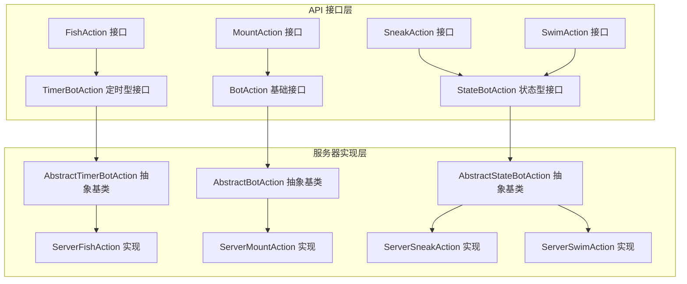
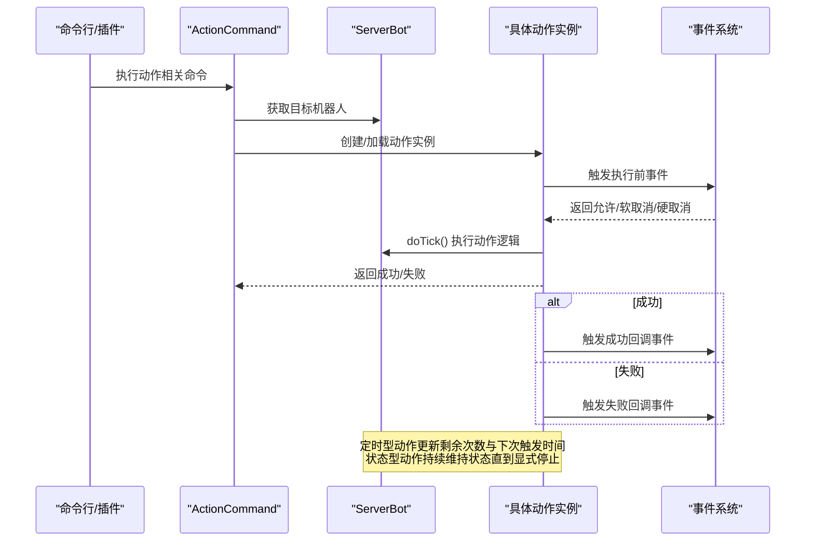
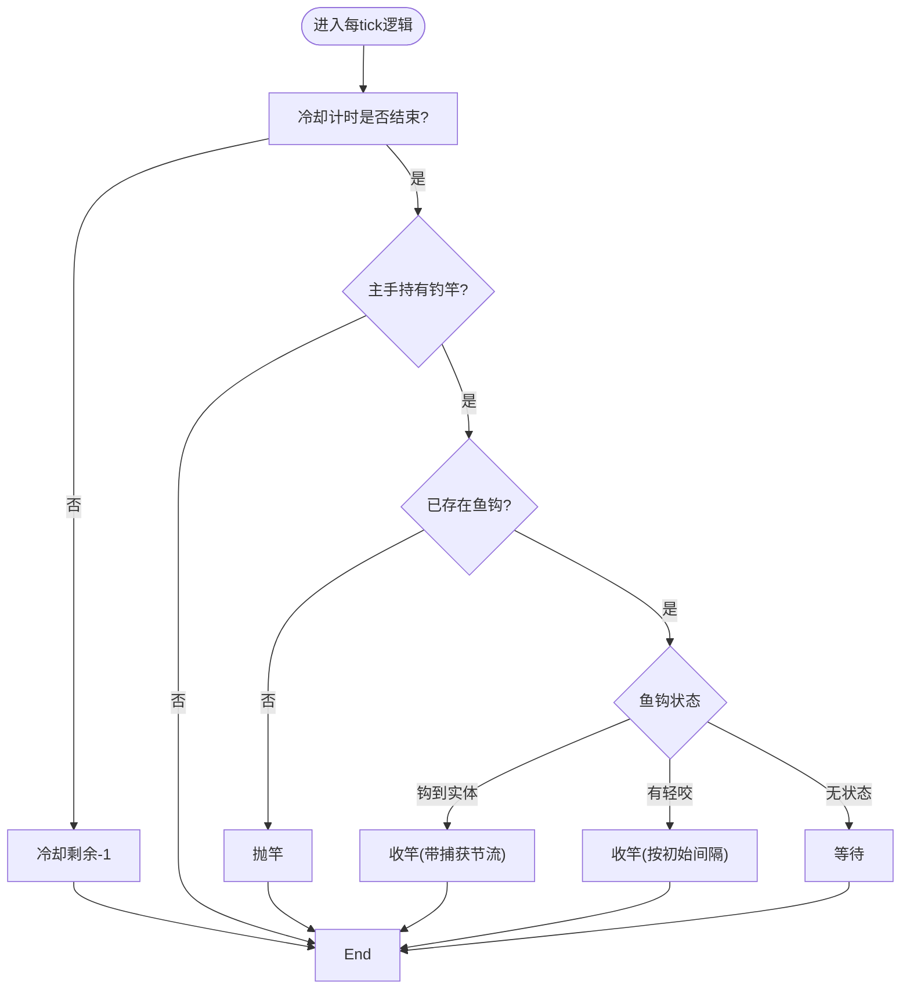
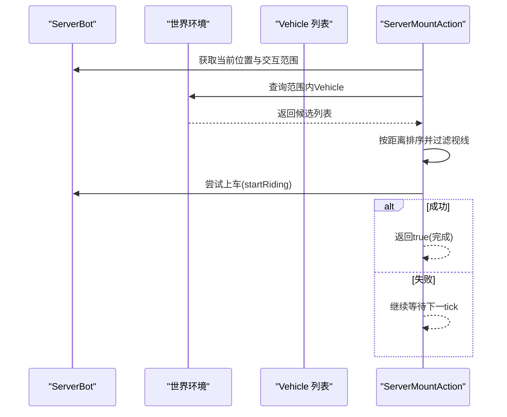
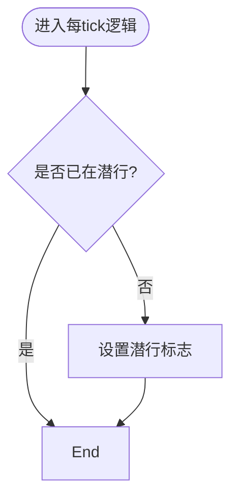
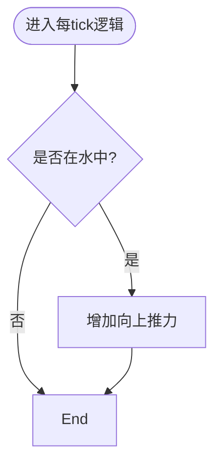
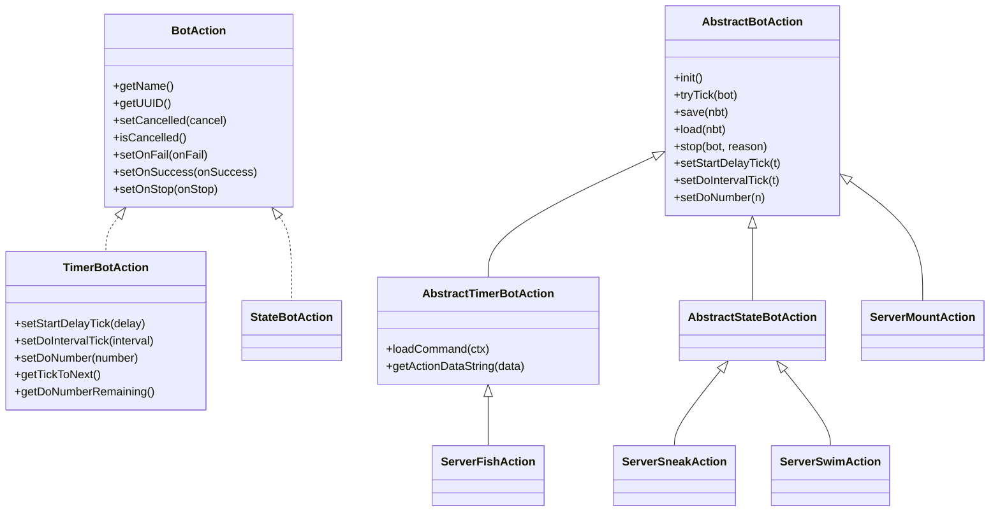

# 专用动作实现

<cite>
**本文引用的文件**
- [ServerFishAction.java](file://lophine-server/src/main/java/org/leavesmc/leaves/bot/agent/actions/ServerFishAction.java)
- [ServerMountAction.java](file://lophine-server/src/main/java/org/leavesmc/leaves/bot/agent/actions/ServerMountAction.java)
- [ServerSneakAction.java](file://lophine-server/src/main/java/org/leavesmc/leaves/bot/agent/actions/ServerSneakAction.java)
- [ServerSwimAction.java](file://lophine-server/src/main/java/org/leavesmc/leaves/bot/agent/actions/ServerSwimAction.java)
- [FishAction.java](file://lophine-api/src/main/java/org/leavesmc/leaves/entity/bot/action/FishAction.java)
- [MountAction.java](file://lophine-api/src/main/java/org/leavesmc/leaves/entity/bot/action/MountAction.java)
- [SneakAction.java](file://lophine-api/src/main/java/org/leavesmc/leaves/entity/bot/action/SneakAction.java)
- [SwimAction.java](file://lophine-api/src/main/java/org/leavesmc/leaves/entity/bot/action/SwimAction.java)
- [BotAction.java](file://lophine-api/src/main/java/org/leavesmc/leaves/entity/bot/action/BotAction.java)
- [StateBotAction.java](file://lophine-api/src/main/java/org/leavesmc/leaves/entity/bot/action/StateBotAction.java)
- [TimerBotAction.java](file://lophine-api/src/main/java/org/leavesmc/leaves/entity/bot/action/TimerBotAction.java)
- [AbstractBotAction.java](file://lophine-server/src/main/java/org/leavesmc/leaves/bot/agent/actions/AbstractBotAction.java)
- [AbstractStateBotAction.java](file://lophine-server/src/main/java/org/leavesmc/leaves/bot/agent/actions/AbstractStateBotAction.java)
- [AbstractTimerBotAction.java](file://lophine-server/src/main/java/org/leavesmc/leaves/bot/agent/actions/AbstractTimerBotAction.java)
- [ActionCommand.java](file://lophine-server/src/main/java/org/leavesmc/leaves/command/bot/subcommands/ActionCommand.java)
</cite>

## 目录
1. [引言](#引言)
2. [项目结构](#项目结构)
3. [核心组件](#核心组件)
4. [架构总览](#架构总览)
5. [详细组件分析](#详细组件分析)
6. [依赖关系分析](#依赖关系分析)
7. [性能考量](#性能考量)
8. [故障排查指南](#故障排查指南)
9. [结论](#结论)
10. [附录](#附录)

## 引言
本文件面向Lophine机器人的“专用动作”子系统，聚焦四类特殊用途动作：ServerFishAction（钓鱼）、ServerMountAction（骑乘）、ServerSneakAction（潜行）与ServerSwimAction（游泳）。文档从接口定义、抽象基类到具体实现逐层剖析其设计思想、执行流程、状态管理、环境适配与行为模式；对比专用动作与通用动作的差异与优势；给出配置项与参数调优建议，并提供可操作的使用示例与最佳实践，帮助开发者在特定场景中正确选择与组合使用。

## 项目结构
专用动作位于服务端模块的bot代理动作包中，接口定义位于API模块，二者通过统一的抽象基类与生命周期事件协作，形成“接口定义 + 抽象基类 + 具体实现”的分层架构。

图表来源
- [FishAction.java:25-28](file://lophine-api/src/main/java/org/leavesmc/leaves/entity/bot/action/FishAction.java#L25-L28)
- [MountAction.java:25-28](file://lophine-api/src/main/java/org/leavesmc/leaves/entity/bot/action/MountAction.java#L25-L28)
- [SneakAction.java:25-28](file://lophine-api/src/main/java/org/leavesmc/leaves/entity/bot/action/SneakAction.java#L25-L28)
- [SwimAction.java:25-28](file://lophine-api/src/main/java/org/leavesmc/leaves/entity/bot/action/SwimAction.java#L25-L28)
- [BotAction.java:31-102](file://lophine-api/src/main/java/org/leavesmc/leaves/entity/bot/action/BotAction.java#L31-L102)
- [StateBotAction.java:26-27](file://lophine-api/src/main/java/org/leavesmc/leaves/entity/bot/action/StateBotAction.java#L26-L27)
- [TimerBotAction.java:28-85](file://lophine-api/src/main/java/org/leavesmc/leaves/entity/bot/action/TimerBotAction.java#L28-L85)
- [AbstractBotAction.java:40-264](file://lophine-server/src/main/java/org/leavesmc/leaves/bot/agent/actions/AbstractBotAction.java#L40-L264)
- [AbstractStateBotAction.java:22-27](file://lophine-server/src/main/java/org/leavesmc/leaves/bot/agent/actions/AbstractStateBotAction.java#L22-L27)
- [AbstractTimerBotAction.java:30-56](file://lophine-server/src/main/java/org/leavesmc/leaves/bot/agent/actions/AbstractTimerBotAction.java#L30-L56)
- [ServerFishAction.java:29-97](file://lophine-server/src/main/java/org/leavesmc/leaves/bot/agent/actions/ServerFishAction.java#L29-L97)
- [ServerMountAction.java:30-63](file://lophine-server/src/main/java/org/leavesmc/leaves/bot/agent/actions/ServerMountAction.java#L30-L63)
- [ServerSneakAction.java:25-51](file://lophine-server/src/main/java/org/leavesmc/leaves/bot/agent/actions/ServerSneakAction.java#L25-L51)
- [ServerSwimAction.java:25-43](file://lophine-server/src/main/java/org/leavesmc/leaves/bot/agent/actions/ServerSwimAction.java#L25-L43)

章节来源
- [ActionCommand.java:32-58](file://lophine-server/src/main/java/org/leavesmc/leaves/command/bot/subcommands/ActionCommand.java#L32-L58)

## 核心组件
- 接口层：定义动作契约与回调，区分定时型与状态型两类专用动作。
- 抽象层：统一处理生命周期、事件、持久化、命令加载与参数校验。
- 实现层：针对不同环境与交互进行特化，如近战范围、水环境浮力、鱼钩状态等。

关键要点
- 定时型动作（如钓鱼）支持延迟、间隔、次数控制，内部维护剩余冷却与捕获节流。
- 状态型动作（如潜行、游泳）在启动时施加状态，在停止时清理状态，持续性地维持效果。
- 通用动作（如骑乘）按距离与视线条件自动寻车并上车，适合移动场景。

章节来源
- [BotAction.java:31-102](file://lophine-api/src/main/java/org/leavesmc/leaves/entity/bot/action/BotAction.java#L31-L102)
- [TimerBotAction.java:28-85](file://lophine-api/src/main/java/org/leavesmc/leaves/entity/bot/action/TimerBotAction.java#L28-L85)
- [StateBotAction.java:26-27](file://lophine-api/src/main/java/org/leavesmc/leaves/entity/bot/action/StateBotAction.java#L26-L27)
- [AbstractBotAction.java:40-264](file://lophine-server/src/main/java/org/leavesmc/leaves/bot/agent/actions/AbstractBotAction.java#L40-L264)
- [AbstractTimerBotAction.java:30-56](file://lophine-server/src/main/java/org/leavesmc/leaves/bot/agent/actions/AbstractTimerBotAction.java#L30-L56)
- [AbstractStateBotAction.java:22-27](file://lophine-server/src/main/java/org/leavesmc/leaves/bot/agent/actions/AbstractStateBotAction.java#L22-L27)

## 架构总览
专用动作遵循统一的“动作生命周期 + 事件驱动 + 环境适配”模型。定时型动作通过计数器与冷却节流实现稳定节奏；状态型动作通过持续tick维持状态；通用动作通过实体查询与视线判断完成交互。

图表来源
- [ActionCommand.java:32-58](file://lophine-server/src/main/java/org/leavesmc/leaves/command/bot/subcommands/ActionCommand.java#L32-L58)
- [AbstractBotAction.java:109-159](file://lophine-server/src/main/java/org/leavesmc/leaves/bot/agent/actions/AbstractBotAction.java#L109-L159)

## 详细组件分析

### 钓鱼动作 ServerFishAction
- 动作定位：定时型动作，模拟玩家抛竿、等待鱼咬钩、收竿的过程。
- 关键特性
  - 冷却节流：捕获实体后有固定延迟，避免过快连续收竿。
  - 鱼钩状态感知：根据鱼钩状态决定是否抛竿或收竿。
  - 装备检查：仅当主手持有钓竿时才执行。
  - 可配置间隔：初始间隔由外部设置，用于调节抛竿频率。
- 生命周期
  - 初始化：记录初始间隔，重置剩余冷却。
  - 每tick：若冷却未结束则倒计时；否则检查装备与鱼钩状态，执行对应交互。
  - 结束：动作完成后可继续按间隔重复，或由定时器控制次数。
- 适用场景
  - 自动钓鱼农场、自动化资源收集。
  - 需要稳定节奏与节流控制的场景。

图表来源
- [ServerFishAction.java:63-91](file://lophine-server/src/main/java/org/leavesmc/leaves/bot/agent/actions/ServerFishAction.java#L63-L91)

章节来源
- [ServerFishAction.java:29-97](file://lophine-server/src/main/java/org/leavesmc/leaves/bot/agent/actions/ServerFishAction.java#L29-L97)
- [FishAction.java:25-28](file://lophine-api/src/main/java/org/leavesmc/leaves/entity/bot/action/FishAction.java#L25-L28)
- [TimerBotAction.java:28-85](file://lophine-api/src/main/java/org/leavesmc/leaves/entity/bot/action/TimerBotAction.java#L28-L85)
- [AbstractTimerBotAction.java:30-56](file://lophine-server/src/main/java/org/leavesmc/leaves/bot/agent/actions/AbstractTimerBotAction.java#L30-L56)

### 骑乘动作 ServerMountAction
- 动作定位：通用动作，自动寻找附近可乘坐实体并上车。
- 关键特性
  - 范围与排序：以机器人位置为中心，按距离升序查找车辆。
  - 视线检测：仅对拥有视线的实体尝试上车。
  - 上车成功即完成：一旦成功调用上车接口，动作即视为完成。
- 生命周期
  - 初始化：准备参数与范围。
  - 每tick：扫描周围实体，过滤不可见或无法上车的候选，优先最近者。
  - 结束：找到可上车实体即完成，否则返回失败。
- 适用场景
  - 快速移动、穿越长距离地形。
  - 需要与环境互动（如矿车、船）的自动化路径规划。

图表来源
- [ServerMountAction.java:36-57](file://lophine-server/src/main/java/org/leavesmc/leaves/bot/agent/actions/ServerMountAction.java#L36-L57)

章节来源
- [ServerMountAction.java:30-63](file://lophine-server/src/main/java/org/leavesmc/leaves/bot/agent/actions/ServerMountAction.java#L30-L63)
- [MountAction.java:25-28](file://lophine-api/src/main/java/org/leavesmc/leaves/entity/bot/action/MountAction.java#L25-L28)
- [AbstractBotAction.java:40-264](file://lophine-server/src/main/java/org/leavesmc/leaves/bot/agent/actions/AbstractBotAction.java#L40-L264)

### 潜行动作 ServerSneakAction
- 动作定位：状态型动作，持续让机器人保持潜行状态。
- 关键特性
  - 启动时设置潜行标志，返回成功。
  - 停止时清除潜行标志，确保状态一致性。
  - 与事件系统配合：停止原因通过事件传递。
- 生命周期
  - 初始化：设置为无限次执行（状态型默认）。
  - 每tick：若已处于潜行则跳过；否则设置潜行并返回成功。
  - 结束：显式停止时清除潜行。
- 适用场景
  - 需要低体积通过狭小空间。
  - 避免被上方实体掉落伤害或减少碰撞体积。

图表来源
- [ServerSneakAction.java:31-45](file://lophine-server/src/main/java/org/leavesmc/leaves/bot/agent/actions/ServerSneakAction.java#L31-L45)

章节来源
- [ServerSneakAction.java:25-51](file://lophine-server/src/main/java/org/leavesmc/leaves/bot/agent/actions/ServerSneakAction.java#L25-L51)
- [SneakAction.java:25-28](file://lophine-api/src/main/java/org/leavesmc/leaves/entity/bot/action/SneakAction.java#L25-L28)
- [AbstractStateBotAction.java:22-27](file://lophine-server/src/main/java/org/leavesmc/leaves/bot/agent/actions/AbstractStateBotAction.java#L22-L27)

### 游泳动作 ServerSwimAction
- 动作定位：状态型动作，持续为机器人施加向上的浮力，使其在水中漂浮。
- 关键特性
  - 环境感知：仅在水中生效，避免在陆地上产生异常运动。
  - 持续效果：每tick叠加轻微上升速度，维持漂浮姿态。
- 生命周期
  - 初始化：设置为无限次执行（状态型默认）。
  - 每tick：若在水中则增加竖直方向速度；否则不改变。
  - 结束：显式停止时不再施加浮力。
- 适用场景
  - 水中探索、救援、自动漂浮。
  - 配合其他动作（如移动、旋转）实现水下导航。

图表来源
- [ServerSwimAction.java:31-37](file://lophine-server/src/main/java/org/leavesmc/leaves/bot/agent/actions/ServerSwimAction.java#L31-L37)

章节来源
- [ServerSwimAction.java:25-43](file://lophine-server/src/main/java/org/leavesmc/leaves/bot/agent/actions/ServerSwimAction.java#L25-L43)
- [SwimAction.java:25-28](file://lophine-api/src/main/java/org/leavesmc/leaves/entity/bot/action/SwimAction.java#L25-L28)
- [AbstractStateBotAction.java:22-27](file://lophine-server/src/main/java/org/leavesmc/leaves/bot/agent/actions/AbstractStateBotAction.java#L22-L27)

## 依赖关系分析
- 接口与实现解耦：接口层仅定义契约，实现层专注行为细节，便于扩展与替换。
- 抽象基类复用：通用生命周期、事件、持久化、命令解析在抽象基类中实现，降低重复代码。
- 环境适配隔离：各动作独立处理自身环境条件（鱼钩、车辆、水体），避免相互干扰。
- 事件驱动：动作执行前后均通过事件系统通知，便于监控与拦截。

图表来源
- [BotAction.java:31-102](file://lophine-api/src/main/java/org/leavesmc/leaves/entity/bot/action/BotAction.java#L31-L102)
- [TimerBotAction.java:28-85](file://lophine-api/src/main/java/org/leavesmc/leaves/entity/bot/action/TimerBotAction.java#L28-L85)
- [StateBotAction.java:26-27](file://lophine-api/src/main/java/org/leavesmc/leaves/entity/bot/action/StateBotAction.java#L26-L27)
- [AbstractBotAction.java:40-264](file://lophine-server/src/main/java/org/leavesmc/leaves/bot/agent/actions/AbstractBotAction.java#L40-L264)
- [AbstractTimerBotAction.java:30-56](file://lophine-server/src/main/java/org/leavesmc/leaves/bot/agent/actions/AbstractTimerBotAction.java#L30-L56)
- [AbstractStateBotAction.java:22-27](file://lophine-server/src/main/java/org/leavesmc/leaves/bot/agent/actions/AbstractStateBotAction.java#L22-L27)
- [ServerFishAction.java:29-97](file://lophine-server/src/main/java/org/leavesmc/leaves/bot/agent/actions/ServerFishAction.java#L29-L97)
- [ServerMountAction.java:30-63](file://lophine-server/src/main/java/org/leavesmc/leaves/bot/agent/actions/ServerMountAction.java#L30-L63)
- [ServerSneakAction.java:25-51](file://lophine-server/src/main/java/org/leavesmc/leaves/bot/agent/actions/ServerSneakAction.java#L25-L51)
- [ServerSwimAction.java:25-43](file://lophine-server/src/main/java/org/leavesmc/leaves/bot/agent/actions/ServerSwimAction.java#L25-L43)

## 性能考量
- 计算复杂度
  - 钓鱼动作：每tick常数开销，包含装备检查与鱼钩状态判断，整体O(1)。
  - 骑乘动作：每tick对候选实体进行距离计算与视线过滤，复杂度约O(n log n)，n为候选数量。
  - 潜行/游泳动作：每tick常数开销，仅进行环境判定与状态设置。
- 内存占用
  - 动作实例仅保存必要状态（如初始间隔、冷却剩余、UUID等），内存占用极低。
- 并发与事件
  - 动作执行通过事件系统调度，避免直接阻塞主线程；异常被捕获并记录，保证稳定性。

## 故障排查指南
- 钓鱼无效
  - 检查主手是否持有钓竿；确认鱼钩状态与轻咬检测逻辑是否正常。
  - 调整初始间隔与捕获节流参数，避免过短导致频繁抛竿/收竿。
- 无法上车
  - 确认机器人与车辆之间是否存在遮挡导致视线失败。
  - 调整交互范围参数，确保候选列表非空。
- 潜行/游泳状态异常
  - 确认停止回调是否被正确调用，避免遗留潜行标志。
  - 在陆地上不应施加浮力，检查环境判定逻辑。
- 事件拦截
  - 若动作被软/硬取消，请检查事件监听器的返回值与优先级。

章节来源
- [AbstractBotAction.java:109-159](file://lophine-server/src/main/java/org/leavesmc/leaves/bot/agent/actions/AbstractBotAction.java#L109-L159)
- [ServerSneakAction.java:42-45](file://lophine-server/src/main/java/org/leavesmc/leaves/bot/agent/actions/ServerSneakAction.java#L42-L45)
- [ServerSwimAction.java:31-37](file://lophine-server/src/main/java/org/leavesmc/leaves/bot/agent/actions/ServerSwimAction.java#L31-L37)

## 结论
专用动作通过“接口 + 抽象基类 + 具体实现”的分层设计，实现了高内聚、低耦合的动作体系。定时型与状态型动作分别满足周期性与持续性需求，通用动作则提供灵活的环境交互能力。结合事件系统与命令接口，开发者可以精确控制动作的生命周期、参数与行为模式，从而在自动化农场、探索与导航等场景中获得稳定可靠的体验。

## 附录

### 使用示例与最佳实践
- 钓鱼农场
  - 使用定时型钓鱼动作，设置合理的初始间隔与捕获节流，避免过度消耗资源。
  - 将机器人放置于水域边缘，确保鱼钩状态可被正确识别。
- 快速移动
  - 使用骑乘动作自动寻找最近且可见的车辆，结合移动动作实现长距离穿越。
  - 注意地形与载具限制，必要时先清理障碍物。
- 空间通过
  - 使用潜行动作进入低矮空间，注意与其他动作的组合时机，避免卡顿。
- 水下探索
  - 使用游泳动作维持漂浮，结合旋转与移动动作进行水下导航。
  - 在危险区域（如岩浆、深海）谨慎使用，避免意外伤害。

### 参数调优建议
- 定时型动作
  - 初始间隔：根据自动化目标的响应速度调整，避免过快或过慢。
  - 执行次数：-1表示无限循环，适用于持续作业；有限次数用于一次性任务。
- 状态型动作
  - 默认无限执行，需显式停止；在组合动作中注意停止时机与顺序。
- 通用动作
  - 交互范围：根据场景密度调整，避免过多候选影响性能。
  - 视线过滤：在复杂环境中启用，确保动作只作用于可达实体。