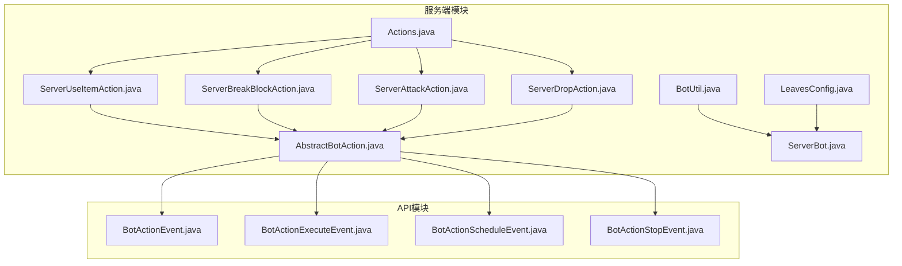
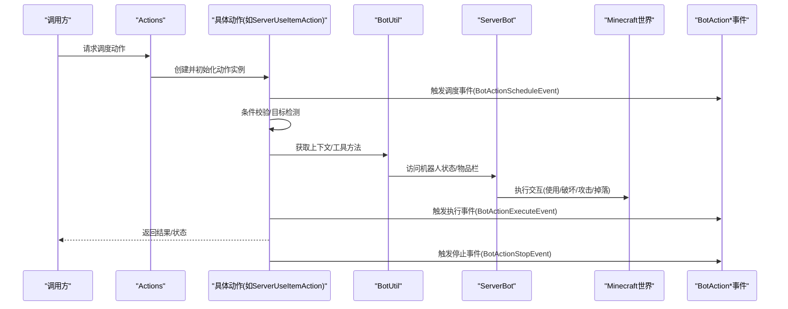
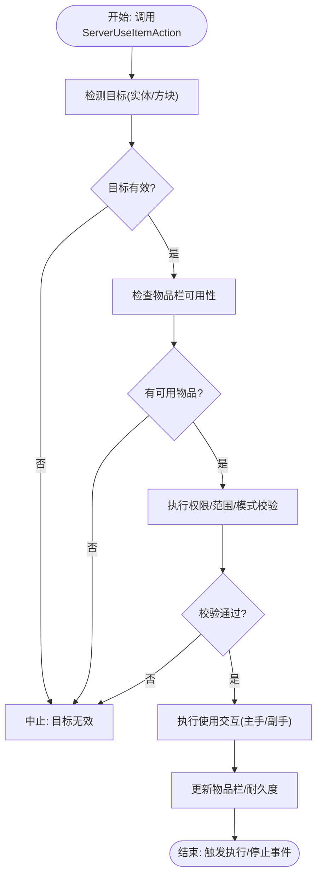
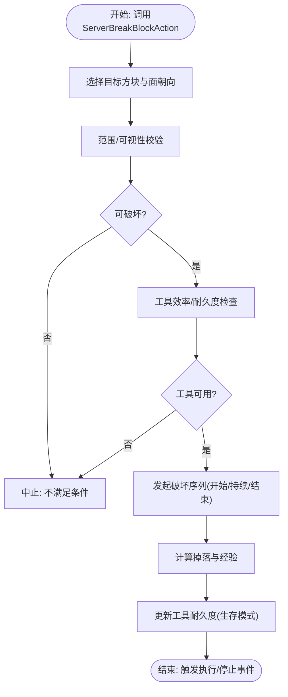
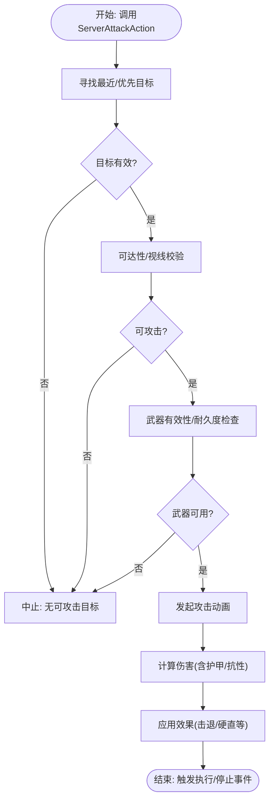
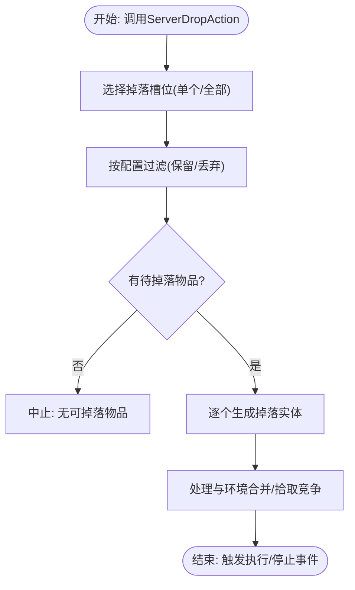
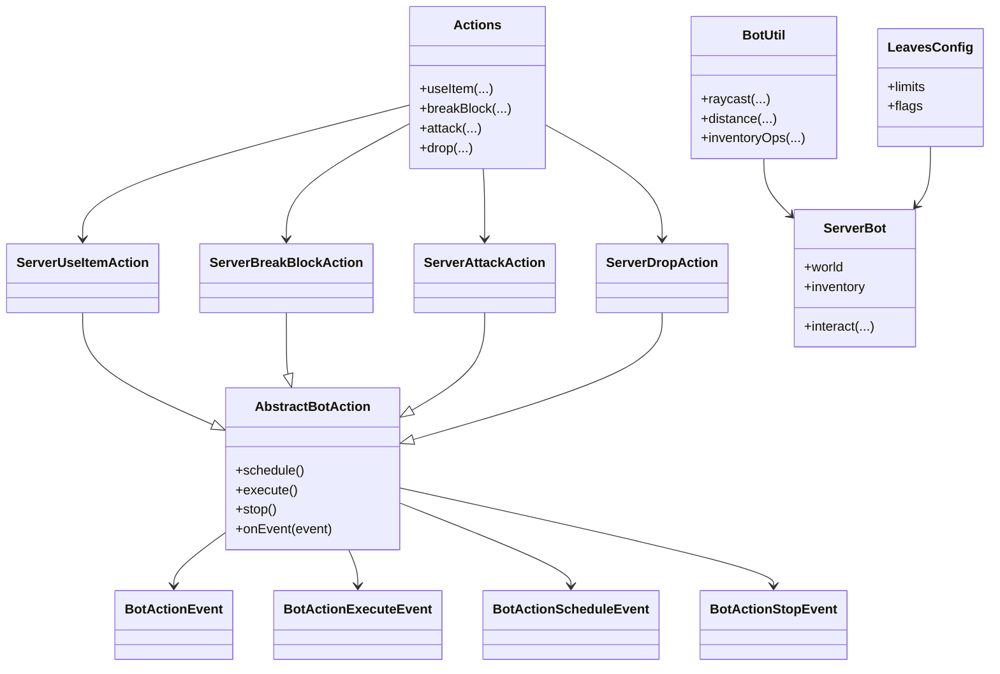

# 交互动作实现

<cite>
**本文引用的文件**
- [ServerUseItemAction.java](file://lophine-server/src/main/java/org/leavesmc/leaves/bot/agent/actions/ServerUseItemAction.java)
- [ServerBreakBlockAction.java](file://lophine-server/src/main/java/org/leavesmc/leaves/bot/agent/actions/ServerBreakBlockAction.java)
- [ServerAttackAction.java](file://lophine-server/src/main/java/org/leavesmc/leaves/bot/agent/actions/ServerAttackAction.java)
- [ServerDropAction.java](file://lophine-server/src/main/java/org/leavesmc/leaves/bot/agent/actions/ServerDropAction.java)
- [AbstractBotAction.java](file://lophine-server/src/main/java/org/leavesmc/leaves/bot/agent/actions/AbstractBotAction.java)
- [Actions.java](file://lophine-server/src/main/java/org/leavesmc/leaves/bot/agent/Actions.java)
- [BotUtil.java](file://lophine-server/src/main/java/org/leavesmc/leaves/bot/BotUtil.java)
- [ServerBot.java](file://lophine-server/src/main/java/org/leavesmc/leaves/bot/ServerBot.java)
- [LeavesConfig.java](file://lophine-server/src/main/java/org/leavesmc/leaves/LeavesConfig.java)
- [BotActionEvent.java](file://lophine-api/src/main/java/org/leavesmc/leaves/event/bot/BotActionEvent.java)
- [BotActionExecuteEvent.java](file://lophine-api/src/main/java/org/leavesmc/leaves/event/bot/BotActionExecuteEvent.java)
- [BotActionScheduleEvent.java](file://lophine-api/src/main/java/org/leavesmc/leaves/event/bot/BotActionScheduleEvent.java)
- [BotActionStopEvent.java](file://lophine-api/src/main/java/org/leavesmc/leaves/event/bot/BotActionStopEvent.java)
</cite>

## 目录
1. [引言](#引言)
2. [项目结构](#项目结构)
3. [核心组件](#核心组件)
4. [架构总览](#架构总览)
5. [详细组件分析](#详细组件分析)
6. [依赖关系分析](#依赖关系分析)
7. [性能考虑](#性能考虑)
8. [故障排查指南](#故障排查指南)
9. [结论](#结论)
10. [附录](#附录)

## 引言
本文件面向Lophine机器人的交互动作系统，聚焦四类核心动作：ServerUseItemAction（物品使用）、ServerBreakBlockAction（方块破坏）、ServerAttackAction（攻击）与ServerDropAction（掉落）。文档从触发机制、目标检测、执行条件、与Minecraft世界的交互（物品栏管理、工具耐久度、伤害计算）、安全检查与权限验证、配置参数及使用场景等方面进行系统化梳理，并通过图示展示关键流程与依赖关系，帮助开发者快速理解与扩展。

## 项目结构
交互动作位于服务端模块的bot代理actions包中，围绕抽象基类与具体动作实现展开；同时在API模块定义了事件体系以支持动作调度与生命周期管理。下图给出与交互动作相关的核心文件位置概览：

图表来源
- [AbstractBotAction.java](file://lophine-server/src/main/java/org/leavesmc/leaves/bot/agent/actions/AbstractBotAction.java)
- [ServerUseItemAction.java](file://lophine-server/src/main/java/org/leavesmc/leaves/bot/agent/actions/ServerUseItemAction.java)
- [ServerBreakBlockAction.java](file://lophine-server/src/main/java/org/leavesmc/leaves/bot/agent/actions/ServerBreakBlockAction.java)
- [ServerAttackAction.java](file://lophine-server/src/main/java/org/leavesmc/leaves/bot/agent/actions/ServerAttackAction.java)
- [ServerDropAction.java](file://lophine-server/src/main/java/org/leavesmc/leaves/bot/agent/actions/ServerDropAction.java)
- [Actions.java](file://lophine-server/src/main/java/org/leavesmc/leaves/bot/agent/Actions.java)
- [BotUtil.java](file://lophine-server/src/main/java/org/leavesmc/leaves/bot/BotUtil.java)
- [ServerBot.java](file://lophine-server/src/main/java/org/leavesmc/leaves/bot/ServerBot.java)
- [LeavesConfig.java](file://lophine-server/src/main/java/org/leavesmc/leaves/LeavesConfig.java)
- [BotActionEvent.java](file://lophine-api/src/main/java/org/leavesmc/leaves/event/bot/BotActionEvent.java)
- [BotActionExecuteEvent.java](file://lophine-api/src/main/java/org/leavesmc/leaves/event/bot/BotActionExecuteEvent.java)
- [BotActionScheduleEvent.java](file://lophine-api/src/main/java/org/leavesmc/leaves/event/bot/BotActionScheduleEvent.java)
- [BotActionStopEvent.java](file://lophine-api/src/main/java/org/leavesmc/leaves/event/bot/BotActionStopEvent.java)

章节来源
- [AbstractBotAction.java](file://lophine-server/src/main/java/org/leavesmc/leaves/bot/agent/actions/AbstractBotAction.java)
- [Actions.java](file://lophine-server/src/main/java/org/leavesmc/leaves/bot/agent/Actions.java)

## 核心组件
- 抽象基类：所有交互动作继承自抽象基类，统一管理调度、状态与生命周期事件。
- 动作集合：Actions类集中暴露可用动作类型，便于外部调用者按需选择。
- 工具与上下文：BotUtil提供机器人通用工具方法；ServerBot承载机器人实体状态与世界交互上下文；LeavesConfig提供全局配置开关。
- 事件体系：API层的BotAction*系列事件用于监听动作的调度、执行、停止等阶段，便于插件或上层逻辑接入。

章节来源
- [AbstractBotAction.java](file://lophine-server/src/main/java/org/leavesmc/leaves/bot/agent/actions/AbstractBotAction.java)
- [Actions.java](file://lophine-server/src/main/java/org/leavesmc/leaves/bot/agent/Actions.java)
- [BotUtil.java](file://lophine-server/src/main/java/org/leavesmc/leaves/bot/BotUtil.java)
- [ServerBot.java](file://lophine-server/src/main/java/org/leavesmc/leaves/bot/ServerBot.java)
- [LeavesConfig.java](file://lophine-server/src/main/java/org/leavesmc/leaves/LeavesConfig.java)
- [BotActionEvent.java](file://lophine-api/src/main/java/org/leavesmc/leaves/event/bot/BotActionEvent.java)
- [BotActionExecuteEvent.java](file://lophine-api/src/main/java/org/leavesmc/leaves/event/bot/BotActionExecuteEvent.java)
- [BotActionScheduleEvent.java](file://lophine-api/src/main/java/org/leavesmc/leaves/event/bot/BotActionScheduleEvent.java)
- [BotActionStopEvent.java](file://lophine-api/src/main/java/org/leavesmc/leaves/event/bot/BotActionStopEvent.java)

## 架构总览
交互动作遵循“抽象基类 + 具体动作实现 + 事件驱动”的分层设计。动作在被调度后进入执行阶段，期间通过BotUtil与ServerBot访问世界与物品栏；执行完成后触发相应事件供监听器处理。配置项由LeavesConfig统一管理，影响动作行为与限制。

图表来源
- [Actions.java](file://lophine-server/src/main/java/org/leavesmc/leaves/bot/agent/Actions.java)
- [ServerUseItemAction.java](file://lophine-server/src/main/java/org/leavesmc/leaves/bot/agent/actions/ServerUseItemAction.java)
- [BotUtil.java](file://lophine-server/src/main/java/org/leavesmc/leaves/bot/BotUtil.java)
- [ServerBot.java](file://lophine-server/src/main/java/org/leavesmc/leaves/bot/ServerBot.java)
- [BotActionScheduleEvent.java](file://lophine-api/src/main/java/org/leavesmc/leaves/event/bot/BotActionScheduleEvent.java)
- [BotActionExecuteEvent.java](file://lophine-api/src/main/java/org/leavesmc/leaves/event/bot/BotActionExecuteEvent.java)
- [BotActionStopEvent.java](file://lophine-api/src/main/java/org/leavesmc/leaves/event/bot/BotActionStopEvent.java)

## 详细组件分析

### ServerUseItemAction 物品使用动作
- 触发机制与目标检测
  - 动作通常需要明确的目标实体或方块位置，以及可使用的物品槽位。
  - 在执行前会进行目标可达性、距离阈值与视线遮挡等条件校验。
- 执行条件判断
  - 检查物品栏中是否存在可用物品，且物品是否允许对目标执行使用。
  - 验证机器人游戏模式与权限（例如创造/生存模式差异）。
- 与Minecraft世界的交互
  - 使用ServerBot与BotUtil协调完成“使用物品”操作，可能涉及主手/副手切换、右键交互等。
  - 对于消耗型物品，更新物品数量；对于耐久型物品，按规则减少耐久度。
- 安全检查与权限验证
  - 基于LeavesConfig中的相关配置进行限制（如禁用某些交互、限制范围等）。
  - 通过事件链路确保动作可被监听与拦截。
- 配置参数与使用场景
  - 可配置使用范围、优先槽位、是否自动切换副手等。
  - 典型场景：对实体喂食、对容器右键打开、对特定方块执行使用（如放置/激活）。

图表来源
- [ServerUseItemAction.java](file://lophine-server/src/main/java/org/leavesmc/leaves/bot/agent/actions/ServerUseItemAction.java)
- [BotUtil.java](file://lophine-server/src/main/java/org/leavesmc/leaves/bot/BotUtil.java)
- [ServerBot.java](file://lophine-server/src/main/java/org/leavesmc/leaves/bot/ServerBot.java)
- [LeavesConfig.java](file://lophine-server/src/main/java/org/leavesmc/leaves/LeavesConfig.java)
- [BotActionExecuteEvent.java](file://lophine-api/src/main/java/org/leavesmc/leaves/event/bot/BotActionExecuteEvent.java)
- [BotActionStopEvent.java](file://lophine-api/src/main/java/org/leavesmc/leaves/event/bot/BotActionStopEvent.java)

章节来源
- [ServerUseItemAction.java](file://lophine-server/src/main/java/org/leavesmc/leaves/bot/agent/actions/ServerUseItemAction.java)
- [BotUtil.java](file://lophine-server/src/main/java/org/leavesmc/leaves/bot/BotUtil.java)
- [ServerBot.java](file://lophine-server/src/main/java/org/leavesmc/leaves/bot/ServerBot.java)
- [LeavesConfig.java](file://lophine-server/src/main/java/org/leavesmc/leaves/LeavesConfig.java)
- [BotActionExecuteEvent.java](file://lophine-api/src/main/java/org/leavesmc/leaves/event/bot/BotActionExecuteEvent.java)
- [BotActionStopEvent.java](file://lophine-api/src/main/java/org/leavesmc/leaves/event/bot/BotActionStopEvent.java)

### ServerBreakBlockAction 方块破坏动作
- 触发机制与目标检测
  - 需要精确的目标方块坐标与面朝向，确保破坏方向正确。
  - 进行距离与可视性校验，避免越界或不可见破坏。
- 执行条件判断
  - 检查工具是否具备足够效率破坏目标方块；若为耐久型工具则评估剩余耐久。
  - 根据游戏模式与配置决定是否允许破坏（创造模式无耐久消耗）。
- 与Minecraft世界的交互
  - 通过ServerBot发起“开始/持续/结束”破坏动画序列，随后在服务器侧确认掉落物生成与经验奖励。
  - 更新工具耐久度（生存模式），并处理掉落物合并与收集。
- 安全检查与权限验证
  - 结合LeavesConfig中的破坏范围、区域限制与白名单/黑名单策略。
  - 通过事件链路记录破坏行为，便于审计与回放。
- 配置参数与使用场景
  - 可配置最大破坏半径、工具效率阈值、是否保留掉落物等。
  - 典型场景：自动化采掘、清理障碍物、资源回收。

图表来源
- [ServerBreakBlockAction.java](file://lophine-server/src/main/java/org/leavesmc/leaves/bot/agent/actions/ServerBreakBlockAction.java)
- [ServerBot.java](file://lophine-server/src/main/java/org/leavesmc/leaves/bot/ServerBot.java)
- [LeavesConfig.java](file://lophine-server/src/main/java/org/leavesmc/leaves/LeavesConfig.java)
- [BotActionExecuteEvent.java](file://lophine-api/src/main/java/org/leavesmc/leaves/event/bot/BotActionExecuteEvent.java)
- [BotActionStopEvent.java](file://lophine-api/src/main/java/org/leavesmc/leaves/event/bot/BotActionStopEvent.java)

章节来源
- [ServerBreakBlockAction.java](file://lophine-server/src/main/java/org/leavesmc/leaves/bot/agent/actions/ServerBreakBlockAction.java)
- [ServerBot.java](file://lophine-server/src/main/java/org/leavesmc/leaves/bot/ServerBot.java)
- [LeavesConfig.java](file://lophine-server/src/main/java/org/leavesmc/leaves/LeavesConfig.java)
- [BotActionExecuteEvent.java](file://lophine-api/src/main/java/org/leavesmc/leaves/event/bot/BotActionExecuteEvent.java)
- [BotActionStopEvent.java](file://lophine-api/src/main/java/org/leavesmc/leaves/event/bot/BotActionStopEvent.java)

### ServerAttackAction 攻击动作
- 触发机制与目标检测
  - 以实体为目标，进行距离、视线与阵营判定；支持多目标优先级排序。
- 执行条件判断
  - 检查近战武器有效性与耐久度；根据游戏模式与配置决定攻击频率与伤害倍率。
  - 防止误伤友方或非目标实体。
- 与Minecraft世界的交互
  - 通过ServerBot触发生物攻击动画与伤害判定；在服务器侧计算伤害、护甲减免与抗性。
  - 处理击退、硬直与后续连击（如适用）。
- 安全检查与权限验证
  - 基于配置限制攻击范围、冷却时间与目标类型；通过事件记录攻击轨迹。
- 配置参数与使用场景
  - 可配置攻击间隔、伤害系数、是否启用自动寻敌等。
  - 典型场景：清怪、守卫、PVP辅助（在允许范围内）。

图表来源
- [ServerAttackAction.java](file://lophine-server/src/main/java/org/leavesmc/leaves/bot/agent/actions/ServerAttackAction.java)
- [ServerBot.java](file://lophine-server/src/main/java/org/leavesmc/leaves/bot/ServerBot.java)
- [LeavesConfig.java](file://lophine-server/src/main/java/org/leavesmc/leaves/LeavesConfig.java)
- [BotActionExecuteEvent.java](file://lophine-api/src/main/java/org/leavesmc/leaves/event/bot/BotActionExecuteEvent.java)
- [BotActionStopEvent.java](file://lophine-api/src/main/java/org/leavesmc/leaves/event/bot/BotActionStopEvent.java)

章节来源
- [ServerAttackAction.java](file://lophine-server/src/main/java/org/leavesmc/leaves/bot/agent/actions/ServerAttackAction.java)
- [ServerBot.java](file://lophine-server/src/main/java/org/leavesmc/leaves/bot/ServerBot.java)
- [LeavesConfig.java](file://lophine-server/src/main/java/org/leavesmc/leaves/LeavesConfig.java)
- [BotActionExecuteEvent.java](file://lophine-api/src/main/java/org/leavesmc/leaves/event/bot/BotActionExecuteEvent.java)
- [BotActionStopEvent.java](file://lophine-api/src/main/java/org/leavesmc/leaves/event/bot/BotActionStopEvent.java)

### ServerDropAction 掉落动作
- 触发机制与目标检测
  - 针对物品栏中的指定槽位或全部物品进行掉落，支持过滤与批量处理。
- 执行条件判断
  - 检查槽位有效性与物品存在性；根据配置决定是否保留部分物品或仅掉落多余堆叠。
- 与Minecraft世界的交互
  - 通过ServerBot触发掉落实体生成，设置初始速度与生命周期；处理与环境的碰撞与合并。
  - 维护物品栏整洁，避免重复掉落相同物品。
- 安全检查与权限验证
  - 限制掉落范围与频率，防止刷屏；结合事件记录掉落轨迹。
- 配置参数与使用场景
  - 可配置掉落半径、是否保留最低数量、掉落速率等。
  - 典型场景：背包整理、资源转移、自动化回收。

图表来源
- [ServerDropAction.java](file://lophine-server/src/main/java/org/leavesmc/leaves/bot/agent/actions/ServerDropAction.java)
- [ServerBot.java](file://lophine-server/src/main/java/org/leavesmc/leaves/bot/ServerBot.java)
- [LeavesConfig.java](file://lophine-server/src/main/java/org/leavesmc/leaves/LeavesConfig.java)
- [BotActionExecuteEvent.java](file://lophine-api/src/main/java/org/leavesmc/leaves/event/bot/BotActionExecuteEvent.java)
- [BotActionStopEvent.java](file://lophine-api/src/main/java/org/leavesmc/leaves/event/bot/BotActionStopEvent.java)

章节来源
- [ServerDropAction.java](file://lophine-server/src/main/java/org/leavesmc/leaves/bot/agent/actions/ServerDropAction.java)
- [ServerBot.java](file://lophine-server/src/main/java/org/leavesmc/leaves/bot/ServerBot.java)
- [LeavesConfig.java](file://lophine-server/src/main/java/org/leavesmc/leaves/LeavesConfig.java)
- [BotActionExecuteEvent.java](file://lophine-api/src/main/java/org/leavesmc/leaves/event/bot/BotActionExecuteEvent.java)
- [BotActionStopEvent.java](file://lophine-api/src/main/java/org/leavesmc/leaves/event/bot/BotActionStopEvent.java)

## 依赖关系分析
- 继承与组合
  - 四类动作均继承自抽象基类，共享统一的调度、状态与事件机制。
  - Actions作为工厂/门面，负责动作实例化与参数注入。
- 工具与上下文
  - BotUtil封装常用工具方法（如射线追踪、距离计算、物品栏操作），ServerBot承载机器人实体状态与世界交互上下文。
- 配置与事件
  - LeavesConfig提供全局行为约束；API层事件用于监听动作生命周期，便于扩展与审计。

图表来源
- [AbstractBotAction.java](file://lophine-server/src/main/java/org/leavesmc/leaves/bot/agent/actions/AbstractBotAction.java)
- [ServerUseItemAction.java](file://lophine-server/src/main/java/org/leavesmc/leaves/bot/agent/actions/ServerUseItemAction.java)
- [ServerBreakBlockAction.java](file://lophine-server/src/main/java/org/leavesmc/leaves/bot/agent/actions/ServerBreakBlockAction.java)
- [ServerAttackAction.java](file://lophine-server/src/main/java/org/leavesmc/leaves/bot/agent/actions/ServerAttackAction.java)
- [ServerDropAction.java](file://lophine-server/src/main/java/org/leavesmc/leaves/bot/agent/actions/ServerDropAction.java)
- [Actions.java](file://lophine-server/src/main/java/org/leavesmc/leaves/bot/agent/Actions.java)
- [BotUtil.java](file://lophine-server/src/main/java/org/leavesmc/leaves/bot/BotUtil.java)
- [ServerBot.java](file://lophine-server/src/main/java/org/leavesmc/leaves/bot/ServerBot.java)
- [LeavesConfig.java](file://lophine-server/src/main/java/org/leavesmc/leaves/LeavesConfig.java)
- [BotActionEvent.java](file://lophine-api/src/main/java/org/leavesmc/leaves/event/bot/BotActionEvent.java)
- [BotActionExecuteEvent.java](file://lophine-api/src/main/java/org/leavesmc/leaves/event/bot/BotActionExecuteEvent.java)
- [BotActionScheduleEvent.java](file://lophine-api/src/main/java/org/leavesmc/leaves/event/bot/BotActionScheduleEvent.java)
- [BotActionStopEvent.java](file://lophine-api/src/main/java/org/leavesmc/leaves/event/bot/BotActionStopEvent.java)

章节来源
- [AbstractBotAction.java](file://lophine-server/src/main/java/org/leavesmc/leaves/bot/agent/actions/AbstractBotAction.java)
- [Actions.java](file://lophine-server/src/main/java/org/leavesmc/leaves/bot/agent/Actions.java)
- [BotUtil.java](file://lophine-server/src/main/java/org/leavesmc/leaves/bot/BotUtil.java)
- [ServerBot.java](file://lophine-server/src/main/java/org/leavesmc/leaves/bot/ServerBot.java)
- [LeavesConfig.java](file://lophine-server/src/main/java/org/leavesmc/leaves/LeavesConfig.java)
- [BotActionEvent.java](file://lophine-api/src/main/java/org/leavesmc/leaves/event/bot/BotActionEvent.java)
- [BotActionExecuteEvent.java](file://lophine-api/src/main/java/org/leavesmc/leaves/event/bot/BotActionExecuteEvent.java)
- [BotActionScheduleEvent.java](file://lophine-api/src/main/java/org/leavesmc/leaves/event/bot/BotActionScheduleEvent.java)
- [BotActionStopEvent.java](file://lophine-api/src/main/java/org/leavesmc/leaves/event/bot/BotActionStopEvent.java)

## 性能考虑
- 批量与并发
  - 对多目标动作（如批量掉落、多目标攻击）应采用批处理与限频策略，避免瞬时高负载。
- 射线与距离计算
  - 合理缓存射线结果与距离预计算，减少重复计算开销。
- 事件与日志
  - 动作事件链路较短，但频繁触发时建议降低日志级别或异步化处理。
- 配置优化
  - 通过LeavesConfig调整范围、频率与阈值，平衡功能与性能。

## 故障排查指南
- 常见问题
  - 动作未执行：检查目标是否在范围内、是否被遮挡、权限是否允许。
  - 工具耐久异常：确认生存模式下的耐久消耗逻辑与配置项是否生效。
  - 掉落物丢失：核查掉落半径与合并策略，确保未被拾取或覆盖。
- 排查步骤
  - 查看动作事件链路（调度→执行→停止）是否完整触发。
  - 检查LeavesConfig相关开关与数值配置。
  - 使用BotUtil提供的调试工具进行射线与距离验证。
- 监控与审计
  - 利用事件系统记录动作轨迹，定位异常点。

章节来源
- [BotActionScheduleEvent.java](file://lophine-api/src/main/java/org/leavesmc/leaves/event/bot/BotActionScheduleEvent.java)
- [BotActionExecuteEvent.java](file://lophine-api/src/main/java/org/leavesmc/leaves/event/bot/BotActionExecuteEvent.java)
- [BotActionStopEvent.java](file://lophine-api/src/main/java/org/leavesmc/leaves/event/bot/BotActionStopEvent.java)
- [LeavesConfig.java](file://lophine-server/src/main/java/org/leavesmc/leaves/LeavesConfig.java)

## 结论
Lophine的交互动作系统以抽象基类为核心，围绕物品使用、方块破坏、攻击与掉落四类动作构建了清晰的执行链路。通过BotUtil与ServerBot提供底层能力，配合LeavesConfig与事件体系实现灵活配置与可观测性。开发者可在不破坏整体架构的前提下扩展新动作或调整现有动作的行为边界。

## 附录
- 关键流程参考
  - 物品使用：[ServerUseItemAction.java](file://lophine-server/src/main/java/org/leavesmc/leaves/bot/agent/actions/ServerUseItemAction.java)
  - 方块破坏：[ServerBreakBlockAction.java](file://lophine-server/src/main/java/org/leavesmc/leaves/bot/agent/actions/ServerBreakBlockAction.java)
  - 攻击：[ServerAttackAction.java](file://lophine-server/src/main/java/org/leavesmc/leaves/bot/agent/actions/ServerAttackAction.java)
  - 掉落：[ServerDropAction.java](file://lophine-server/src/main/java/org/leavesmc/leaves/bot/agent/actions/ServerDropAction.java)
- 事件与配置
  - 事件：[BotActionEvent.java](file://lophine-api/src/main/java/org/leavesmc/leaves/event/bot/BotActionEvent.java) 等
  - 配置：[LeavesConfig.java](file://lophine-server/src/main/java/org/leavesmc/leaves/LeavesConfig.java)