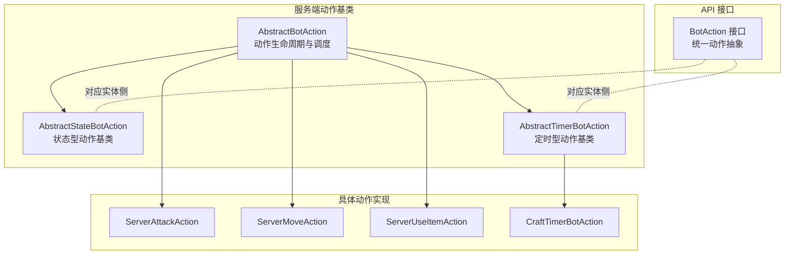
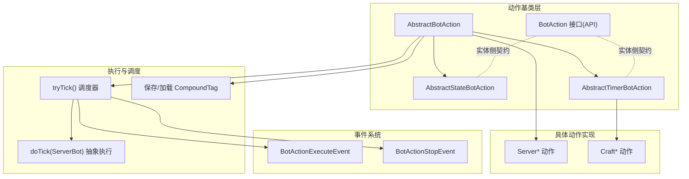
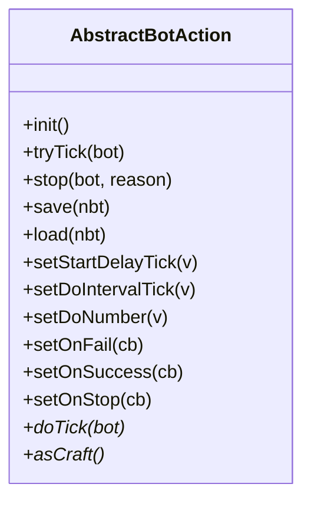
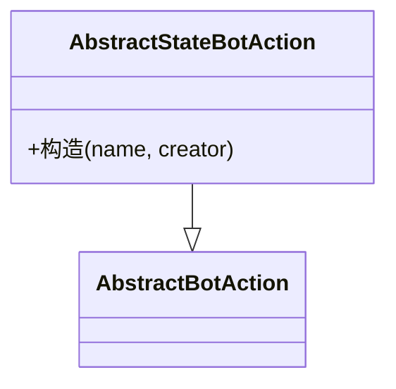
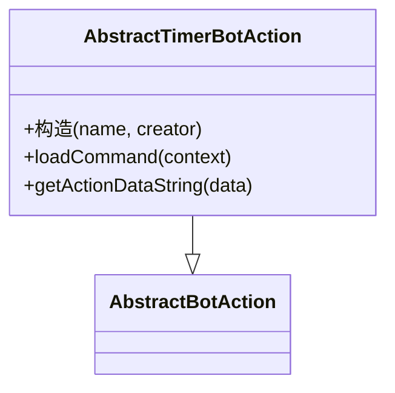
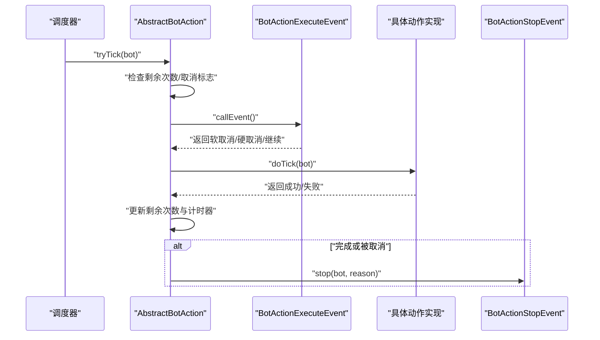
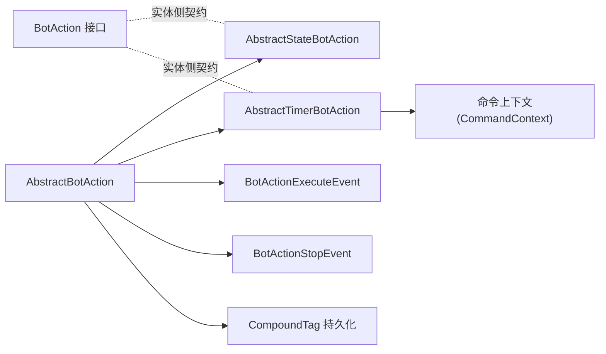

# 动作基类设计

<cite>
**本文档引用的文件**
- [AbstractBotAction.java](file://lophine-server/src/main/java/org/leavesmc/leaves/bot/agent/actions/AbstractBotAction.java)
- [AbstractStateBotAction.java](file://lophine-server/src/main/java/org/leavesmc/leaves/bot/agent/actions/AbstractStateBotAction.java)
- [AbstractTimerBotAction.java](file://lophine-server/src/main/java/org/leavesmc/leaves/bot/agent/actions/AbstractTimerBotAction.java)
- [BotAction.java](file://lophine-api/src/main/java/org/leavesmc/leaves/entity/bot/action/BotAction.java)
- [ServerAttackAction.java](file://lophine-server/src/main/java/org/leavesmc/leaves/bot/agent/actions/ServerAttackAction.java)
- [ServerMoveAction.java](file://lophine-server/src/main/java/org/leavesmc/leaves/bot/agent/actions/ServerMoveAction.java)
- [ServerUseItemAction.java](file://lophine-server/src/main/java/org/leavesmc/leaves/bot/agent/actions/ServerUseItemAction.java)
- [CraftTimerBotAction.java](file://lophine-server/src/main/java/org/leavesmc/leaves/entity/bot/actions/CraftTimerBotAction.java)
</cite>

## 目录
1. [引言](#引言)
2. [项目结构](#项目结构)
3. [核心组件](#核心组件)
4. [架构总览](#架构总览)
5. [详细组件分析](#详细组件分析)
6. [依赖关系分析](#依赖关系分析)
7. [性能考虑](#性能考虑)
8. [故障排除指南](#故障排除指南)
9. [结论](#结论)
10. [附录](#附录)

## 引言
本文件针对 Lophine 机器人的动作基类系统进行深入技术解析，重点围绕以下目标展开：  
- 抽象基类 AbstractBotAction 的设计理念与生命周期管理  
- 状态动作基类 AbstractStateBotAction 与定时动作基类 AbstractTimerBotAction 的特殊设计及适用场景  
- 动作扩展接口设计与继承体系，如何通过继承实现自定义动作类型  
- 动作执行的上下文传递机制、异常处理策略与资源管理  
- 最佳实践与扩展开发示例  

该系统采用分层与模板方法相结合的架构模式，既保证了通用行为的一致性，又允许具体动作实现高度可定制。

## 项目结构
动作基类位于服务端模块的 bot.agent.actions 包中，同时在 API 模块中提供面向实体的 BotAction 接口以统一抽象。典型动作实现分布在 server 与 craft 两套实现中（Server* 与 Craft*），分别对应服务端逻辑与实体侧逻辑。

**图表来源**
- [AbstractBotAction.java:40-265](file://lophine-server/src/main/java/org/leavesmc/leaves/bot/agent/actions/AbstractBotAction.java#L40-L265)
- [AbstractStateBotAction.java:22-28](file://lophine-server/src/main/java/org/leavesmc/leaves/bot/agent/actions/AbstractStateBotAction.java#L22-L28)
- [AbstractTimerBotAction.java:30-57](file://lophine-server/src/main/java/org/leavesmc/leaves/bot/agent/actions/AbstractTimerBotAction.java#L30-L57)
- [BotAction.java:31-103](file://lophine-api/src/main/java/org/leavesmc/leaves/entity/bot/action/BotAction.java#L31-L103)
- [ServerAttackAction.java](file://lophine-server/src/main/java/org/leavesmc/leaves/bot/agent/actions/ServerAttackAction.java)
- [ServerMoveAction.java](file://lophine-server/src/main/java/org/leavesmc/leaves/bot/agent/actions/ServerMoveAction.java)
- [ServerUseItemAction.java](file://lophine-server/src/main/java/org/leavesmc/leaves/bot/agent/actions/ServerUseItemAction.java)
- [CraftTimerBotAction.java](file://lophine-server/src/main/java/org/leavesmc/leaves/entity/bot/actions/CraftTimerBotAction.java)

**章节来源**
- [AbstractBotAction.java:40-265](file://lophine-server/src/main/java/org/leavesmc/leaves/bot/agent/actions/AbstractBotAction.java#L40-L265)
- [AbstractStateBotAction.java:22-28](file://lophine-server/src/main/java/org/leavesmc/leaves/bot/agent/actions/AbstractStateBotAction.java#L22-L28)
- [AbstractTimerBotAction.java:30-57](file://lophine-server/src/main/java/org/leavesmc/leaves/bot/agent/actions/AbstractTimerBotAction.java#L30-L57)
- [BotAction.java:31-103](file://lophine-api/src/main/java/org/leavesmc/leaves/entity/bot/action/BotAction.java#L31-L103)

## 核心组件
本节聚焦三大核心基类及其职责边界与协作方式：

- AbstractBotAction：定义动作的生命周期、调度参数、事件回调与持久化能力；提供统一的 tryTick 执行入口与停止机制。  
- AbstractStateBotAction：继承自 AbstractBotAction，将 doNumber 设为无限循环，适用于需要长期维持的状态型动作（如持续移动、持续交互）。  
- AbstractTimerBotAction：继承自 AbstractBotAction，内置 delay、interval、do_number 三个命令行参数，并提供默认建议值；适用于需要周期性执行或有限次数执行的动作。

此外，API 层的 BotAction 接口提供了跨模块一致的动作抽象，便于实体侧与服务端侧协同。

**章节来源**
- [AbstractBotAction.java:40-265](file://lophine-server/src/main/java/org/leavesmc/leaves/bot/agent/actions/AbstractBotAction.java#L40-L265)
- [AbstractStateBotAction.java:22-28](file://lophine-server/src/main/java/org/leavesmc/leaves/bot/agent/actions/AbstractStateBotAction.java#L22-L28)
- [AbstractTimerBotAction.java:30-57](file://lophine-server/src/main/java/org/leavesmc/leaves/bot/agent/actions/AbstractTimerBotAction.java#L30-L57)
- [BotAction.java:31-103](file://lophine-api/src/main/java/org/leavesmc/leaves/entity/bot/action/BotAction.java#L31-L103)

## 架构总览
下图展示了动作基类系统的整体架构与关键交互点，包括生命周期管理、事件系统、参数配置与持久化。

**图表来源**
- [AbstractBotAction.java:40-265](file://lophine-server/src/main/java/org/leavesmc/leaves/bot/agent/actions/AbstractBotAction.java#L40-L265)
- [AbstractStateBotAction.java:22-28](file://lophine-server/src/main/java/org/leavesmc/leaves/bot/agent/actions/AbstractStateBotAction.java#L22-L28)
- [AbstractTimerBotAction.java:30-57](file://lophine-server/src/main/java/org/leavesmc/leaves/bot/agent/actions/AbstractTimerBotAction.java#L30-L57)
- [BotAction.java:31-103](file://lophine-api/src/main/java/org/leavesmc/leaves/entity/bot/action/BotAction.java#L31-L103)

## 详细组件分析

### AbstractBotAction：动作生命周期与调度核心
- 生命周期管理
  - 初始化：init() 将初始延迟、间隔与剩余次数重置到初始状态。  
  - 调度：tryTick() 根据 tickToNext 与 numberRemaining 控制是否执行 doTick()。  
  - 停止：stop() 触发停止事件并设置取消标志，调用 onStop 回调。  
- 参数与配置
  - 支持 startDelayTick、doIntervalTick、doNumber 的设置与查询。  
  - fork() 用于多分支参数集（fork）的参数收集。  
  - addArgument() 为不同 fork 分支注册参数与建议值。  
- 事件与回调
  - 在执行前触发 BotActionExecuteEvent，支持软取消与硬取消两种结果。  
  - 成功/失败分别触发 onSuccess/onFail 回调。  
- 异常处理
  - 捕获 UpdateSuppressionException 并交由异常处理器处理；其他异常记录日志。  
- 持久化
  - save()/load() 使用 CompoundTag 存储动作名称、UUID、初始参数与当前进度。

**图表来源**
- [AbstractBotAction.java:40-265](file://lophine-server/src/main/java/org/leavesmc/leaves/bot/agent/actions/AbstractBotAction.java#L40-L265)

**章节来源**
- [AbstractBotAction.java:40-265](file://lophine-server/src/main/java/org/leavesmc/leaves/bot/agent/actions/AbstractBotAction.java#L40-L265)

### AbstractStateBotAction：状态型动作基类
- 特殊设计
  - 继承 AbstractBotAction，并将 doNumber 设置为无限（-1），确保动作在被取消前持续运行。  
- 适用场景
  - 需要长期维持的状态动作，例如持续移动、持续交互、持续旋转等。  
- 与 AbstractBotAction 的关系
  - 复用统一的调度与事件机制，仅改变默认执行次数语义。

**图表来源**
- [AbstractStateBotAction.java:22-28](file://lophine-server/src/main/java/org/leavesmc/leaves/bot/agent/actions/AbstractStateBotAction.java#L22-L28)
- [AbstractBotAction.java:40-265](file://lophine-server/src/main/java/org/leavesmc/leaves/bot/agent/actions/AbstractBotAction.java#L40-L265)

**章节来源**
- [AbstractStateBotAction.java:22-28](file://lophine-server/src/main/java/org/leavesmc/leaves/bot/agent/actions/AbstractStateBotAction.java#L22-L28)

### AbstractTimerBotAction：定时型动作基类
- 特殊设计
  - 内置三个参数：delay（起始延迟）、interval（执行间隔，默认 20）、do_number（执行次数，默认 1，-1 表示无限）。  
  - 提供参数建议值，便于命令行输入与可视化配置。  
  - loadCommand() 将命令上下文中的参数映射到内部状态。  
  - getActionDataString() 输出包含剩余次数在内的详细信息。  
- 适用场景
  - 需要周期性执行或有限次数执行的动作，如定时采集、定时交互、定时移动等。  
- 与 AbstractBotAction 的关系
  - 复用统一的调度与事件机制，仅增加时间维度的参数化能力。

**图表来源**
- [AbstractTimerBotAction.java:30-57](file://lophine-server/src/main/java/org/leavesmc/leaves/bot/agent/actions/AbstractTimerBotAction.java#L30-L57)
- [AbstractBotAction.java:40-265](file://lophine-server/src/main/java/org/leavesmc/leaves/bot/agent/actions/AbstractBotAction.java#L40-L265)

**章节来源**
- [AbstractTimerBotAction.java:30-57](file://lophine-server/src/main/java/org/leavesmc/leaves/bot/agent/actions/AbstractTimerBotAction.java#L30-L57)

### 具体动作实现示例与扩展路径
- 服务端动作实现（Server*）
  - ServerAttackAction、ServerMoveAction、ServerUseItemAction 等均继承自 AbstractBotAction，覆盖 doTick() 完成具体业务逻辑。  
  - 可参考这些实现了解如何在 doTick() 中使用 ServerBot 上下文、触发事件与处理异常。  
- 实体侧动作实现（Craft*）
  - CraftTimerBotAction 继承自 AbstractTimerBotAction，复用其定时参数与命令加载逻辑，适合实体侧的定时动作需求。  

**图表来源**
- [AbstractBotAction.java:109-159](file://lophine-server/src/main/java/org/leavesmc/leaves/bot/agent/actions/AbstractBotAction.java#L109-L159)

**章节来源**
- [ServerAttackAction.java](file://lophine-server/src/main/java/org/leavesmc/leaves/bot/agent/actions/ServerAttackAction.java)
- [ServerMoveAction.java](file://lophine-server/src/main/java/org/leavesmc/leaves/bot/agent/actions/ServerMoveAction.java)
- [ServerUseItemAction.java](file://lophine-server/src/main/java/org/leavesmc/leaves/bot/agent/actions/ServerUseItemAction.java)
- [CraftTimerBotAction.java](file://lophine-server/src/main/java/org/leavesmc/leaves/entity/bot/actions/CraftTimerBotAction.java)

## 依赖关系分析
- 继承关系
  - AbstractStateBotAction 与 AbstractTimerBotAction 均继承自 AbstractBotAction，共享生命周期与调度机制。  
  - BotAction 接口为实体侧提供统一契约，便于跨模块协作。  
- 事件依赖
  - AbstractBotAction 在执行前后依赖 BotActionExecuteEvent 与 BotActionStopEvent 进行事件通知与控制。  
- 命令与参数
  - AbstractTimerBotAction 通过命令上下文加载参数，形成“配置驱动”的动作行为。  
- 持久化依赖
  - 使用 CompoundTag 进行序列化存储，便于动作状态的保存与恢复。

**图表来源**
- [AbstractBotAction.java:40-265](file://lophine-server/src/main/java/org/leavesmc/leaves/bot/agent/actions/AbstractBotAction.java#L40-L265)
- [AbstractStateBotAction.java:22-28](file://lophine-server/src/main/java/org/leavesmc/leaves/bot/agent/actions/AbstractStateBotAction.java#L22-L28)
- [AbstractTimerBotAction.java:30-57](file://lophine-server/src/main/java/org/leavesmc/leaves/bot/agent/actions/AbstractTimerBotAction.java#L30-L57)
- [BotAction.java:31-103](file://lophine-api/src/main/java/org/leavesmc/leaves/entity/bot/action/BotAction.java#L31-L103)

**章节来源**
- [AbstractBotAction.java:40-265](file://lophine-server/src/main/java/org/leavesmc/leaves/bot/agent/actions/AbstractBotAction.java#L40-L265)
- [AbstractStateBotAction.java:22-28](file://lophine-server/src/main/java/org/leavesmc/leaves/bot/agent/actions/AbstractStateBotAction.java#L22-L28)
- [AbstractTimerBotAction.java:30-57](file://lophine-server/src/main/java/org/leavesmc/leaves/bot/agent/actions/AbstractTimerBotAction.java#L30-L57)
- [BotAction.java:31-103](file://lophine-api/src/main/java/org/leavesmc/leaves/entity/bot/action/BotAction.java#L31-L103)

## 性能考虑
- 调度开销
  - tryTick() 采用轻量级计数器控制执行频率，避免频繁事件调用带来的额外开销。  
- 事件过滤
  - 通过 BotActionExecuteEvent 的软取消/硬取消机制，减少无效执行。  
- 参数建议
  - AbstractTimerBotAction 提供常用参数建议值，降低用户输入成本并提升一致性。  
- 持久化最小化
  - 仅保存必要状态（初始参数与当前进度），避免冗余数据影响 IO 性能。  

## 故障排除指南
- 动作未执行
  - 检查 numberRemaining 是否为 0 或 cancel 标志是否为 true。  
  - 确认 tickToNext 是否大于 0，或是否被事件系统软取消。  
- 执行异常
  - UpdateSuppressionException 会被捕获并交由异常处理器处理；其他异常会记录日志但不会中断动作链路。  
- 停止与回调
  - 若动作被外部停止，确认 onStop 回调是否正确注册；检查 stop() 调用原因（DONE/PLUGIN 等）。  
- 参数加载失败
  - 对于定时动作，确认命令上下文中的参数键名与默认值是否匹配；检查 loadCommand() 的映射逻辑。  

**章节来源**
- [AbstractBotAction.java:109-159](file://lophine-server/src/main/java/org/leavesmc/leaves/bot/agent/actions/AbstractBotAction.java#L109-L159)
- [AbstractTimerBotAction.java:42-46](file://lophine-server/src/main/java/org/leavesmc/leaves/bot/agent/actions/AbstractTimerBotAction.java#L42-L46)

## 结论
Lophine 的动作基类系统通过清晰的层次结构与事件驱动机制，实现了对动作生命周期、状态转换与执行流程的统一管理。AbstractStateBotAction 与 AbstractTimerBotAction 分别针对“长期状态”和“定时执行”两类常见场景提供了开箱即用的基类，配合 BotAction 接口与命令参数系统，使得开发者能够快速扩展自定义动作类型，并在保持一致性的前提下实现复杂行为编排。

## 附录
- 扩展开发步骤
  - 选择合适的基类：若需长期运行选 AbstractStateBotAction，若需定时执行选 AbstractTimerBotAction。  
  - 覆盖 doTick()：在其中实现具体业务逻辑，注意处理异常与上下文。  
  - 注册回调：根据需要设置 onSuccess/onFail/onStop 回调以响应动作状态变化。  
  - 参数配置：利用 addArgument() 与命令上下文加载参数，提供良好的用户体验。  
  - 持久化：依赖基类的 save()/load() 机制自动保存进度，必要时可在子类中扩展额外字段。  

- 最佳实践
  - 将动作拆分为细粒度小动作，组合使用以提高可维护性。  
  - 在 doTick() 中尽量减少阻塞操作，必要时使用异步或延迟处理。  
  - 合理设置 interval 与 do_number，避免过度占用服务器资源。  
  - 使用事件系统进行行为拦截与调试，便于定位问题。