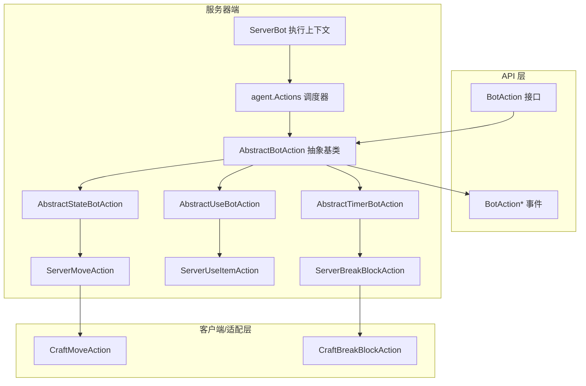
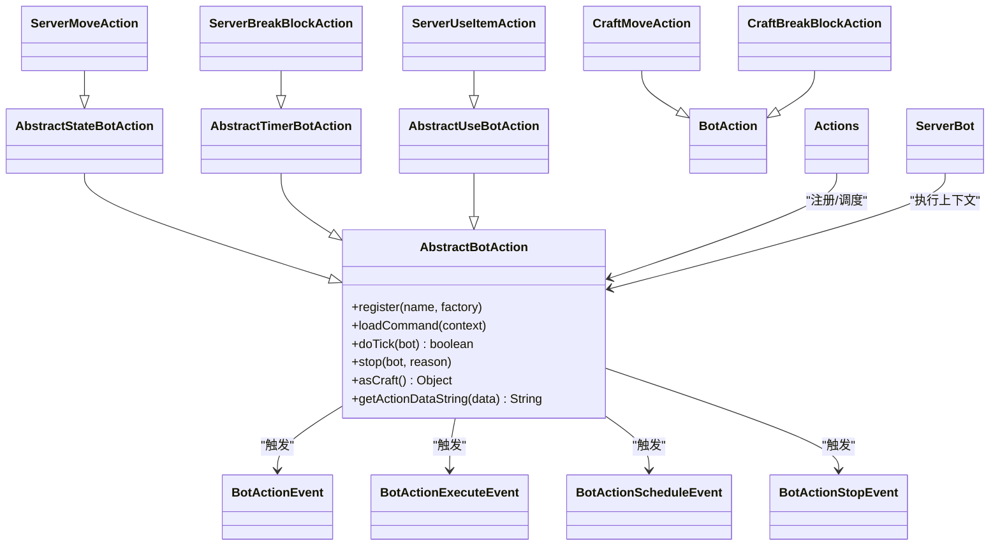
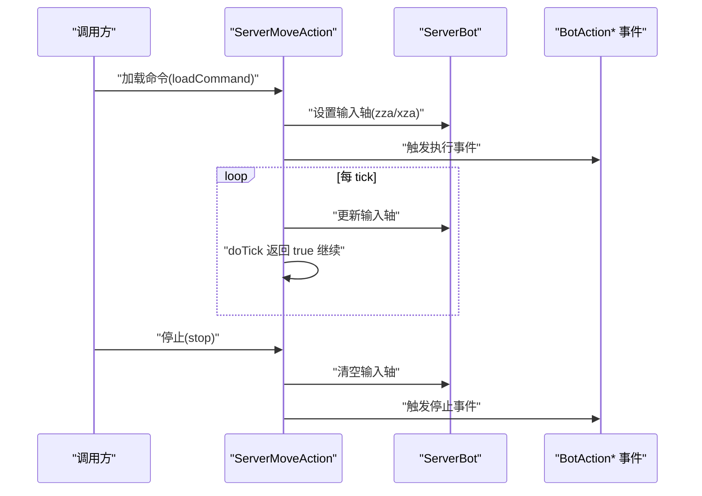
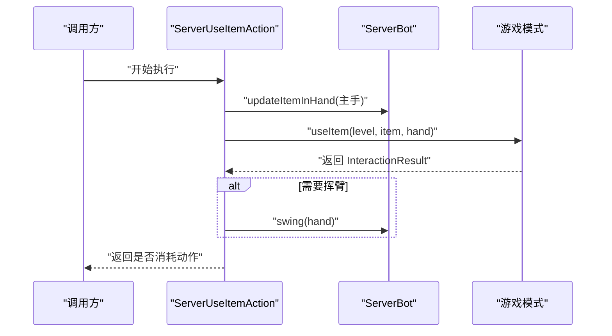
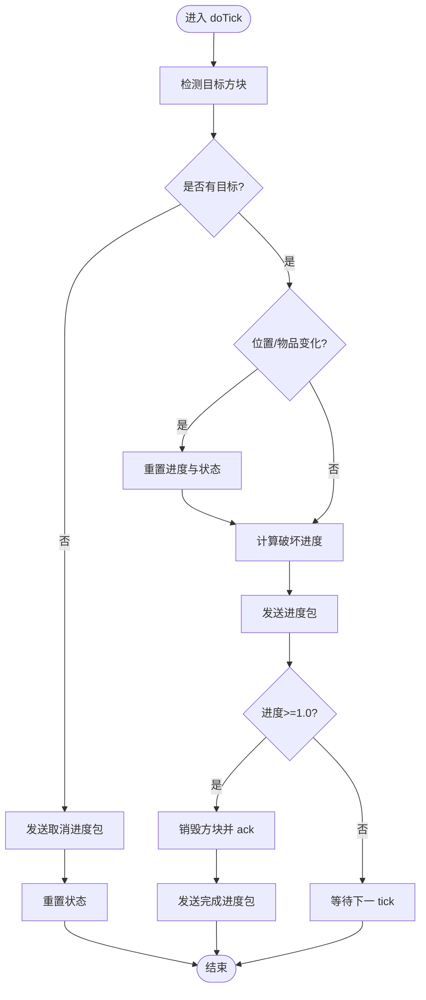
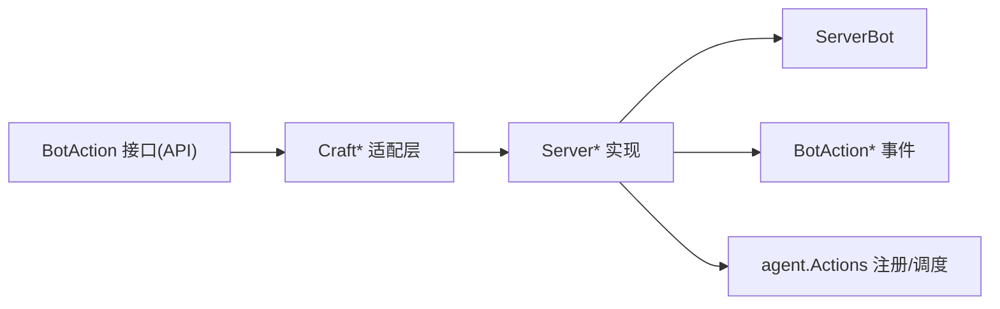

# 机器人动作系统

<cite>
**本文引用的文件**
- [AbstractBotAction.java](file://lophine-server/src/main/java/org/leavesmc/leaves/bot/agent/actions/AbstractBotAction.java)
- [AbstractStateBotAction.java](file://lophine-server/src/main/java/org/leavesmc/leaves/bot/agent/actions/AbstractStateBotAction.java)
- [AbstractTimerBotAction.java](file://lophine-server/src/main/java/org/leavesmc/leaves/bot/agent/actions/AbstractTimerBotAction.java)
- [AbstractUseBotAction.java](file://lophine-server/src/main/java/org/leavesmc/leaves/bot/agent/actions/AbstractUseBotAction.java)
- [ServerMoveAction.java](file://lophine-server/src/main/java/org/leavesmc/leaves/bot/agent/actions/ServerMoveAction.java)
- [ServerUseItemAction.java](file://lophine-server/src/main/java/org/leavesmc/leaves/bot/agent/actions/ServerUseItemAction.java)
- [ServerBreakBlockAction.java](file://lophine-server/src/main/java/org/leavesmc/leaves/bot/agent/actions/ServerBreakBlockAction.java)
- [CraftMoveAction.java](file://lophine-server/src/main/java/org/leavesmc/leaves/entity/bot/actions/CraftMoveAction.java)
- [CraftBreakBlockAction.java](file://lophine-server/src/main/java/org/leavesmc/leaves/entity/bot/actions/CraftBreakBlockAction.java)
- [BotAction.java](file://lophine-api/src/main/java/org/leavesmc/leaves/entity/bot/action/BotAction.java)
- [Actions.java](file://lophine-server/src/main/java/org/leavesmc/leaves/bot/agent/Actions.java)
- [ServerBot.java](file://lophine-server/src/main/java/org/leavesmc/leaves/bot/ServerBot.java)
- [BotActionEvent.java](file://lophine-api/src/main/java/org/leavesmc/leaves/event/bot/BotActionEvent.java)
- [BotActionExecuteEvent.java](file://lophine-api/src/main/java/org/leavesmc/leaves/event/bot/BotActionExecuteEvent.java)
- [BotActionScheduleEvent.java](file://lophine-api/src/main/java/org/leavesmc/leaves/event/bot/BotActionScheduleEvent.java)
- [BotActionStopEvent.java](file://lophine-api/src/main/java/org/leavesmc/leaves/event/bot/BotActionStopEvent.java)
</cite>

## 目录
1. [引言](#引言)
2. [项目结构](#项目结构)
3. [核心组件](#核心组件)
4. [架构总览](#架构总览)
5. [详细组件分析](#详细组件分析)
6. [依赖关系分析](#依赖关系分析)
7. [性能考虑](#性能考虑)
8. [故障排除指南](#故障排除指南)
9. [结论](#结论)
10. [附录](#附录)

## 引言
本文件为 Lophine 机器人动作系统的技术文档，聚焦于动作系统的整体架构与实现细节。内容涵盖抽象基类设计模式、具体动作实现（如移动、使用物品、破坏方块、攻击等）、动作执行引擎的工作机制（调度、状态管理、事件与错误处理）、扩展新动作类型的流程、性能优化策略与最佳实践，并提供可直接定位到源码的路径指引，便于开发者理解与扩展。

## 项目结构
动作系统主要分布在以下模块中：
- 服务器端动作实现：位于 lophine-server 模块的 agent.actions 包，包含抽象基类与具体动作实现。
- 客户端/跨端适配层：位于 lophine-server 模块的 entity.bot.actions 包，提供与 API 层一致的动作接口与适配。
- API 层动作接口：位于 lophine-api 模块，定义统一的动作接口与事件体系。
- 动作调度与管理：位于 lophine-server 的 agent.Actions 工具类与 ServerBot 执行上下文。

图表来源
- [AbstractBotAction.java](file://lophine-server/src/main/java/org/leavesmc/leaves/bot/agent/actions/AbstractBotAction.java)
- [AbstractStateBotAction.java](file://lophine-server/src/main/java/org/leavesmc/leaves/bot/agent/actions/AbstractStateBotAction.java)
- [AbstractTimerBotAction.java](file://lophine-server/src/main/java/org/leavesmc/leaves/bot/agent/actions/AbstractTimerBotAction.java)
- [AbstractUseBotAction.java](file://lophine-server/src/main/java/org/leavesmc/leaves/bot/agent/actions/AbstractUseBotAction.java)
- [ServerMoveAction.java](file://lophine-server/src/main/java/org/leavesmc/leaves/bot/agent/actions/ServerMoveAction.java)
- [ServerUseItemAction.java](file://lophine-server/src/main/java/org/leavesmc/leaves/bot/agent/actions/ServerUseItemAction.java)
- [ServerBreakBlockAction.java](file://lophine-server/src/main/java/org/leavesmc/leaves/bot/agent/actions/ServerBreakBlockAction.java)
- [CraftMoveAction.java](file://lophine-server/src/main/java/org/leavesmc/leaves/entity/bot/actions/CraftMoveAction.java)
- [CraftBreakBlockAction.java](file://lophine-server/src/main/java/org/leavesmc/leaves/entity/bot/actions/CraftBreakBlockAction.java)
- [BotAction.java](file://lophine-api/src/main/java/org/leavesmc/leaves/entity/bot/action/BotAction.java)
- [Actions.java](file://lophine-server/src/main/java/org/leavesmc/leaves/bot/agent/Actions.java)
- [ServerBot.java](file://lophine-server/src/main/java/org/leavesmc/leaves/bot/ServerBot.java)

章节来源
- [AbstractBotAction.java](file://lophine-server/src/main/java/org/leavesmc/leaves/bot/agent/actions/AbstractBotAction.java)
- [Actions.java](file://lophine-server/src/main/java/org/leavesmc/leaves/bot/agent/Actions.java)

## 核心组件
本节概述动作系统的核心抽象与实现层次，以及它们在执行引擎中的角色。

- 抽象基类
  - AbstractBotAction：所有动作的基础抽象，负责注册名称、参数、生命周期钩子（加载命令、每 tick 执行、停止）与数据序列化。
  - AbstractStateBotAction：用于“持续状态型”动作（如移动），在停止时清理输入状态。
  - AbstractTimerBotAction：用于“计时/阶段型”动作（如破坏方块），内部维护计时与进度状态。
  - AbstractUseBotAction：用于“交互型”动作（如使用物品），封装通用的交互逻辑与动画反馈。

- 具体动作实现
  - ServerMoveAction：基于方向参数驱动玩家输入轴，支持前进、后退、左移、右移；停止时清除输入。
  - ServerUseItemAction：调用游戏模式进行物品使用，根据结果决定是否播放挥臂动画。
  - ServerBreakBlockAction：基于目标方块与主手物品计算破坏进度，发送破坏进度包并在完成时销毁方块。

- 适配层动作
  - CraftMoveAction：面向 API 层的移动动作适配，暴露统一的方向枚举与设置方法。
  - CraftBreakBlockAction：面向 API 层的破坏动作适配，复用计时型动作能力。

- 执行与事件
  - agent.Actions：动作注册与调度入口，负责将字符串动作名映射到具体实现。
  - ServerBot：动作执行上下文，持有玩家状态与游戏模式，供动作访问。
  - BotAction* 事件：贯穿动作生命周期的事件体系，包括调度、执行、停止等。

章节来源
- [AbstractBotAction.java](file://lophine-server/src/main/java/org/leavesmc/leaves/bot/agent/actions/AbstractBotAction.java)
- [AbstractStateBotAction.java](file://lophine-server/src/main/java/org/leavesmc/leaves/bot/agent/actions/AbstractStateBotAction.java)
- [AbstractTimerBotAction.java](file://lophine-server/src/main/java/org/leavesmc/leaves/bot/agent/actions/AbstractTimerBotAction.java)
- [AbstractUseBotAction.java](file://lophine-server/src/main/java/org/leavesmc/leaves/bot/agent/actions/AbstractUseBotAction.java)
- [ServerMoveAction.java](file://lophine-server/src/main/java/org/leavesmc/leaves/bot/agent/actions/ServerMoveAction.java)
- [ServerUseItemAction.java](file://lophine-server/src/main/java/org/leavesmc/leaves/bot/agent/actions/ServerUseItemAction.java)
- [ServerBreakBlockAction.java](file://lophine-server/src/main/java/org/leavesmc/leaves/bot/agent/actions/ServerBreakBlockAction.java)
- [CraftMoveAction.java](file://lophine-server/src/main/java/org/leavesmc/leaves/entity/bot/actions/CraftMoveAction.java)
- [CraftBreakBlockAction.java](file://lophine-server/src/main/java/org/leavesmc/leaves/entity/bot/actions/CraftBreakBlockAction.java)
- [BotAction.java](file://lophine-api/src/main/java/org/leavesmc/leaves/entity/bot/action/BotAction.java)
- [Actions.java](file://lophine-server/src/main/java/org/leavesmc/leaves/bot/agent/Actions.java)
- [ServerBot.java](file://lophine-server/src/main/java/org/leavesmc/leaves/bot/ServerBot.java)
- [BotActionEvent.java](file://lophine-api/src/main/java/org/leavesmc/leaves/event/bot/BotActionEvent.java)
- [BotActionExecuteEvent.java](file://lophine-api/src/main/java/org/leavesmc/leaves/event/bot/BotActionExecuteEvent.java)
- [BotActionScheduleEvent.java](file://lophine-api/src/main/java/org/leavesmc/leaves/event/bot/BotActionScheduleEvent.java)
- [BotActionStopEvent.java](file://lophine-api/src/main/java/org/leavesmc/leaves/event/bot/BotActionStopEvent.java)

## 架构总览
动作系统采用“抽象基类 + 具体实现 + 适配层”的分层设计，配合 agent.Actions 进行注册与调度，通过 ServerBot 提供执行上下文，借助 BotAction* 事件实现可观测与可扩展的生命周期控制。

图表来源
- [AbstractBotAction.java](file://lophine-server/src/main/java/org/leavesmc/leaves/bot/agent/actions/AbstractBotAction.java)
- [AbstractStateBotAction.java](file://lophine-server/src/main/java/org/leavesmc/leaves/bot/agent/actions/AbstractStateBotAction.java)
- [AbstractTimerBotAction.java](file://lophine-server/src/main/java/org/leavesmc/leaves/bot/agent/actions/AbstractTimerBotAction.java)
- [AbstractUseBotAction.java](file://lophine-server/src/main/java/org/leavesmc/leaves/bot/agent/actions/AbstractUseBotAction.java)
- [ServerMoveAction.java](file://lophine-server/src/main/java/org/leavesmc/leaves/bot/agent/actions/ServerMoveAction.java)
- [ServerUseItemAction.java](file://lophine-server/src/main/java/org/leavesmc/leaves/bot/agent/actions/ServerUseItemAction.java)
- [ServerBreakBlockAction.java](file://lophine-server/src/main/java/org/leavesmc/leaves/bot/agent/actions/ServerBreakBlockAction.java)
- [CraftMoveAction.java](file://lophine-server/src/main/java/org/leavesmc/leaves/entity/bot/actions/CraftMoveAction.java)
- [CraftBreakBlockAction.java](file://lophine-server/src/main/java/org/leavesmc/leaves/entity/bot/actions/CraftBreakBlockAction.java)
- [BotAction.java](file://lophine-api/src/main/java/org/leavesmc/leaves/entity/bot/action/BotAction.java)
- [Actions.java](file://lophine-server/src/main/java/org/leavesmc/leaves/bot/agent/Actions.java)
- [ServerBot.java](file://lophine-server/src/main/java/org/leavesmc/leaves/bot/ServerBot.java)
- [BotActionEvent.java](file://lophine-api/src/main/java/org/leavesmc/leaves/event/bot/BotActionEvent.java)
- [BotActionExecuteEvent.java](file://lophine-api/src/main/java/org/leavesmc/leaves/event/bot/BotActionExecuteEvent.java)
- [BotActionScheduleEvent.java](file://lophine-api/src/main/java/org/leavesmc/leaves/event/bot/BotActionScheduleEvent.java)
- [BotActionStopEvent.java](file://lophine-api/src/main/java/org/leavesmc/leaves/event/bot/BotActionStopEvent.java)

## 详细组件分析

### 抽象基类与生命周期
- 注册与参数：动作通过构造函数注册名称与工厂方法，随后可通过 addArgument 添加参数（例如移动方向）。
- 命令加载：loadCommand 在动作被调度时从 CommandContext 中提取参数，用于初始化运行态配置。
- 每 tick 执行：doTick 返回布尔值表示是否继续执行；返回 false 将导致动作结束。
- 停止处理：stop 在动作被中断或自然结束时调用，用于清理状态（如移动动作会清空输入轴）。
- 数据导出：getActionDataString 支持将当前动作状态写入 ExtraData，便于日志与调试。
- 适配转换：asCraft 将服务器端动作包装为 API 层动作对象，保持跨端一致性。

章节来源
- [AbstractBotAction.java](file://lophine-server/src/main/java/org/leavesmc/leaves/bot/agent/actions/AbstractBotAction.java)

### 状态型动作：移动（ServerMoveAction）
- 参数与行为：接收方向参数，按方向设置 zza/xza 输入轴；停止时清空对应轴以停止移动。
- 速度控制：根据是否潜行调整速度系数，模拟真实移动体验。
- 适配层：CraftMoveAction 暴露统一的 MoveDirection 枚举与 setter，便于 API 层调用。

图表来源
- [ServerMoveAction.java](file://lophine-server/src/main/java/org/leavesmc/leaves/bot/agent/actions/ServerMoveAction.java)
- [AbstractStateBotAction.java](file://lophine-server/src/main/java/org/leavesmc/leaves/bot/agent/actions/AbstractStateBotAction.java)
- [BotActionExecuteEvent.java](file://lophine-api/src/main/java/org/leavesmc/leaves/event/bot/BotActionExecuteEvent.java)
- [BotActionStopEvent.java](file://lophine-api/src/main/java/org/leavesmc/leaves/event/bot/BotActionStopEvent.java)

章节来源
- [ServerMoveAction.java](file://lophine-server/src/main/java/org/leavesmc/leaves/bot/agent/actions/ServerMoveAction.java)
- [CraftMoveAction.java](file://lophine-server/src/main/java/org/leavesmc/leaves/entity/bot/actions/CraftMoveAction.java)

### 使用物品动作：使用（ServerUseItemAction）
- 交互流程：先更新手中物品，再调用游戏模式 useItem，最后根据结果决定是否播放挥臂动画。
- 手部选择：默认使用主手，可扩展为副手或其他逻辑。
- 结果判定：利用 consumesAction 判定是否消耗一次使用动作，避免重复触发。

图表来源
- [ServerUseItemAction.java](file://lophine-server/src/main/java/org/leavesmc/leaves/bot/agent/actions/ServerUseItemAction.java)
- [AbstractUseBotAction.java](file://lophine-server/src/main/java/org/leavesmc/leaves/bot/agent/actions/AbstractUseBotAction.java)

章节来源
- [ServerUseItemAction.java](file://lophine-server/src/main/java/org/leavesmc/leaves/bot/agent/actions/ServerUseItemAction.java)

### 计时型动作：破坏方块（ServerBreakBlockAction）
- 目标检测：通过 getTargetBlockExact 获取目标方块，若无则清理进度并结束。
- 进度管理：记录上次位置与主手物品，若变化则重置进度；按时间增量计算破坏进度并发送进度包。
- 完成条件：累计进度达到 1.0 时，调用销毁并 ack，发送最终进度包，然后结束。
- 清理逻辑：停止或目标丢失时，发送取消进度包并重置内部状态。

图表来源
- [ServerBreakBlockAction.java](file://lophine-server/src/main/java/org/leavesmc/leaves/bot/agent/actions/ServerBreakBlockAction.java)
- [AbstractTimerBotAction.java](file://lophine-server/src/main/java/org/leavesmc/leaves/bot/agent/actions/AbstractTimerBotAction.java)

章节来源
- [ServerBreakBlockAction.java](file://lophine-server/src/main/java/org/leavesmc/leaves/bot/agent/actions/ServerBreakBlockAction.java)
- [CraftBreakBlockAction.java](file://lophine-server/src/main/java/org/leavesmc/leaves/entity/bot/actions/CraftBreakBlockAction.java)

### 动作调度与执行引擎
- 注册与解析：agent.Actions 负责将字符串动作名映射到具体实现类，结合参数解析与工厂方法实例化动作。
- 生命周期事件：动作在调度、执行、停止各阶段触发相应事件，便于监听与扩展。
- 执行上下文：ServerBot 提供动作所需的玩家状态、世界引用与游戏模式，确保动作能正确与底层交互。

章节来源
- [Actions.java](file://lophine-server/src/main/java/org/leavesmc/leaves/bot/agent/Actions.java)
- [ServerBot.java](file://lophine-server/src/main/java/org/leavesmc/leaves/bot/ServerBot.java)
- [BotActionScheduleEvent.java](file://lophine-api/src/main/java/org/leavesmc/leaves/event/bot/BotActionScheduleEvent.java)
- [BotActionExecuteEvent.java](file://lophine-api/src/main/java/org/leavesmc/leaves/event/bot/BotActionExecuteEvent.java)
- [BotActionStopEvent.java](file://lophine-api/src/main/java/org/leavesmc/leaves/event/bot/BotActionStopEvent.java)

## 依赖关系分析
- 分层耦合
  - 服务器端动作实现依赖 ServerBot 与游戏模式，耦合度高但职责清晰。
  - 适配层动作仅依赖服务器端动作与 API 接口，降低对底层实现的直接依赖。
  - 抽象基类向上提供统一接口与事件契约，向下屏蔽具体实现差异。
- 外部依赖
  - Minecraft 交互 API（如 useItem、destroyBlockProgress）由游戏模式与世界提供。
  - 事件系统来自 Leaves API，保证动作生命周期可观测。

图表来源
- [BotAction.java](file://lophine-api/src/main/java/org/leavesmc/leaves/entity/bot/action/BotAction.java)
- [CraftMoveAction.java](file://lophine-server/src/main/java/org/leavesmc/leaves/entity/bot/actions/CraftMoveAction.java)
- [CraftBreakBlockAction.java](file://lophine-server/src/main/java/org/leavesmc/leaves/entity/bot/actions/CraftBreakBlockAction.java)
- [ServerMoveAction.java](file://lophine-server/src/main/java/org/leavesmc/leaves/bot/agent/actions/ServerMoveAction.java)
- [ServerBreakBlockAction.java](file://lophine-server/src/main/java/org/leavesmc/leaves/bot/agent/actions/ServerBreakBlockAction.java)
- [ServerBot.java](file://lophine-server/src/main/java/org/leavesmc/leaves/bot/ServerBot.java)
- [Actions.java](file://lophine-server/src/main/java/org/leavesmc/leaves/bot/agent/Actions.java)

## 性能考虑
- 减少不必要的状态同步
  - 移动动作仅在必要时更新输入轴，停止时立即清零，避免残留输入影响后续动作。
  - 破坏方块动作在位置或物品变化时重置进度，减少无效进度包发送。
- 合理的进度步进
  - 破坏进度按时间累加，进度包按整数档位发送，避免过度频繁的网络包。
- 事件开销控制
  - 仅在关键节点触发事件（调度、执行、停止），避免在每 tick 内部产生大量事件。
- 扩展点优化
  - 新增动作时优先继承对应抽象基类，利用其已有的状态管理与事件机制，减少重复实现。

## 故障排除指南
- 动作未生效
  - 检查 agent.Actions 是否正确注册了动作名称与工厂方法。
  - 确认 loadCommand 是否正确从 CommandContext 读取参数。
- 移动动作停止后仍移动
  - 确认 stop 是否被调用，且输入轴已被清零。
- 破坏方块无进度反馈
  - 检查目标方块是否正确获取，destroyBlockProgress 是否被发送。
  - 确认累计进度是否达到阈值并触发销毁。
- 使用物品无动画
  - 检查 shouldSwing 判定逻辑与 InteractionResult 的消耗标记。

章节来源
- [ServerMoveAction.java](file://lophine-server/src/main/java/org/leavesmc/leaves/bot/agent/actions/ServerMoveAction.java)
- [ServerBreakBlockAction.java](file://lophine-server/src/main/java/org/leavesmc/leaves/bot/agent/actions/ServerBreakBlockAction.java)
- [ServerUseItemAction.java](file://lophine-server/src/main/java/org/leavesmc/leaves/bot/agent/actions/ServerUseItemAction.java)
- [AbstractStateBotAction.java](file://lophine-server/src/main/java/org/leavesmc/leaves/bot/agent/actions/AbstractStateBotAction.java)
- [AbstractTimerBotAction.java](file://lophine-server/src/main/java/org/leavesmc/leaves/bot/agent/actions/AbstractTimerBotAction.java)
- [AbstractUseBotAction.java](file://lophine-server/src/main/java/org/leavesmc/leaves/bot/agent/actions/AbstractUseBotAction.java)

## 结论
Lophine 机器人动作系统通过清晰的抽象层次与事件驱动机制，实现了可扩展、可观察、可优化的动作执行框架。开发者可基于现有抽象快速实现新动作，并通过适配层与 API 接口保持跨端一致性。建议在扩展新动作时遵循现有抽象基类的设计原则，充分利用事件与状态管理机制，确保性能与稳定性。

## 附录
- 新增动作类型步骤
  1) 选择合适的抽象基类：状态型（AbstractStateBotAction）、计时型（AbstractTimerBotAction）、交互型（AbstractUseBotAction）。
  2) 实现动作类，覆盖 loadCommand、doTick、stop 等方法，必要时实现 asCraft。
  3) 在 agent.Actions 中注册动作名称与工厂方法。
  4) 如需 API 层支持，新增对应的 Craft* 适配类。
  5) 编写测试与事件监听，验证生命周期与性能表现。

章节来源
- [AbstractStateBotAction.java](file://lophine-server/src/main/java/org/leavesmc/leaves/bot/agent/actions/AbstractStateBotAction.java)
- [AbstractTimerBotAction.java](file://lophine-server/src/main/java/org/leavesmc/leaves/bot/agent/actions/AbstractTimerBotAction.java)
- [AbstractUseBotAction.java](file://lophine-server/src/main/java/org/leavesmc/leaves/bot/agent/actions/AbstractUseBotAction.java)
- [Actions.java](file://lophine-server/src/main/java/org/leavesmc/leaves/bot/agent/Actions.java)
- [CraftMoveAction.java](file://lophine-server/src/main/java/org/leavesmc/leaves/entity/bot/actions/CraftMoveAction.java)
- [CraftBreakBlockAction.java](file://lophine-server/src/main/java/org/leavesmc/leaves/entity/bot/actions/CraftBreakBlockAction.java)