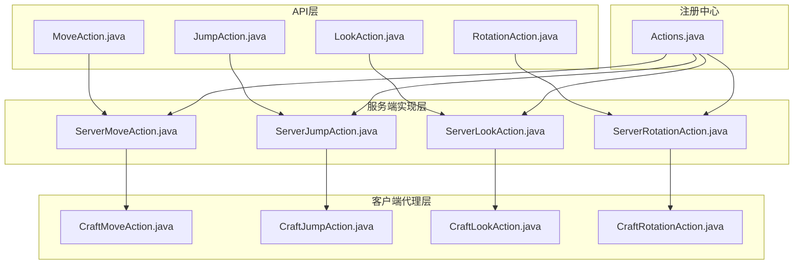
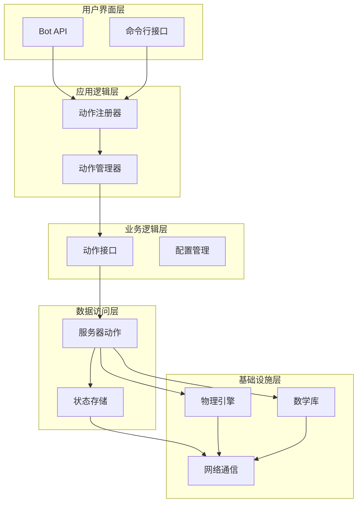
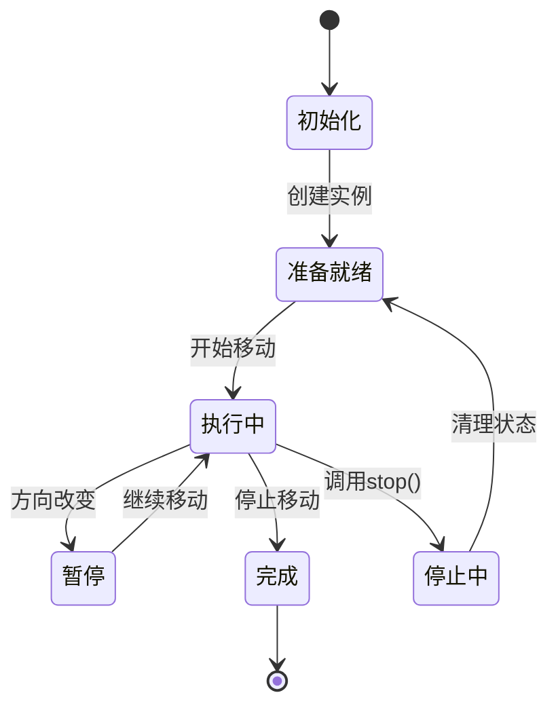
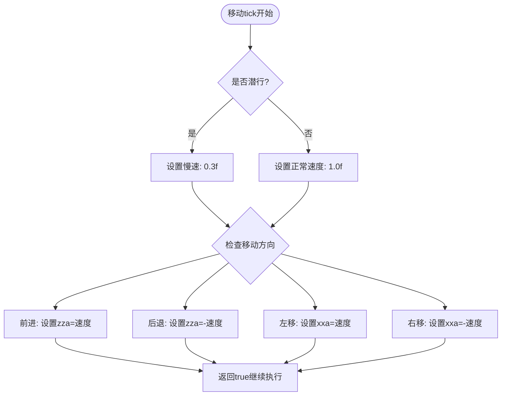
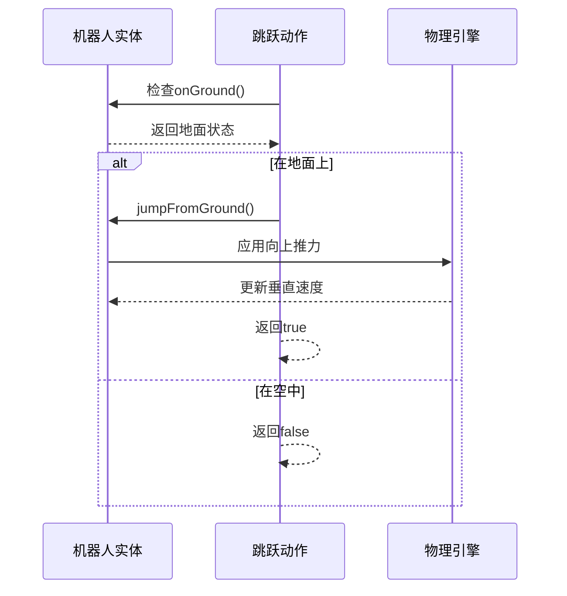
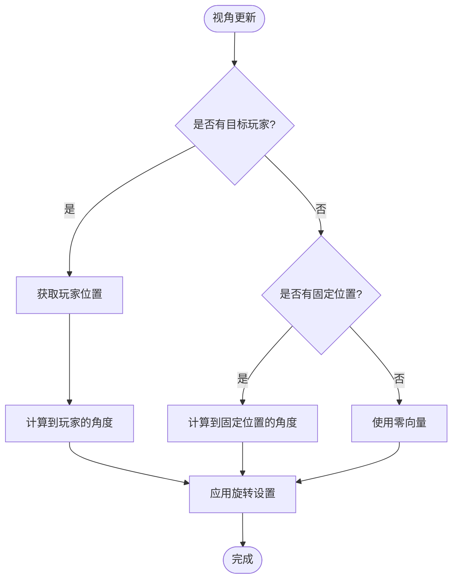
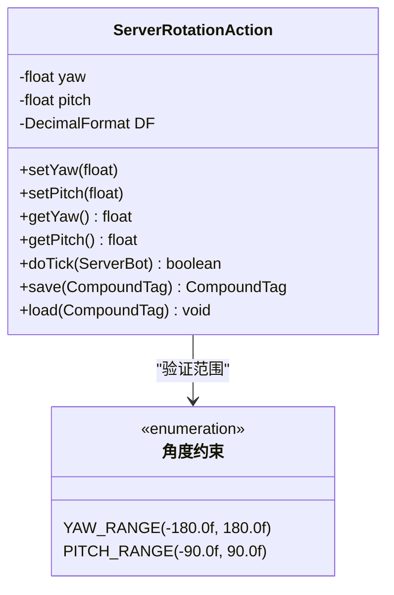
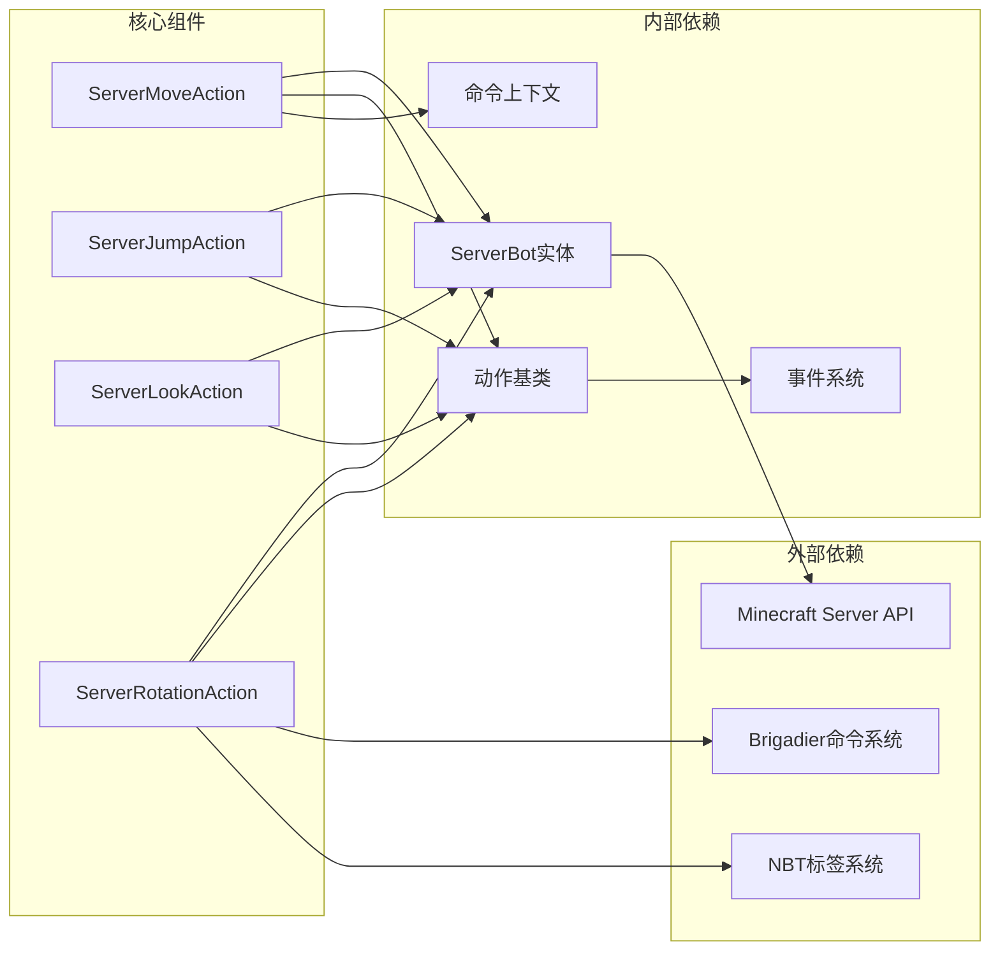

# 移动动作实现

<cite>
**本文档引用的文件**
- [ServerMoveAction.java](file://lophine-server/src/main/java/org/leavesmc/leaves/bot/agent/actions/ServerMoveAction.java)
- [ServerJumpAction.java](file://lophine-server/src/main/java/org/leavesmc/leaves/bot/agent/actions/ServerJumpAction.java)
- [ServerLookAction.java](file://lophine-server/src/main/java/org/leavesmc/leaves/bot/agent/actions/ServerLookAction.java)
- [ServerRotationAction.java](file://lophine-server/src/main/java/org/leavesmc/leaves/bot/agent/actions/ServerRotationAction.java)
- [CraftMoveAction.java](file://lophine-server/src/main/java/org/leavesmc/leaves/entity/bot/actions/CraftMoveAction.java)
- [CraftJumpAction.java](file://lophine-server/src/main/java/org/leavesmc/leaves/entity/bot/actions/CraftJumpAction.java)
- [CraftLookAction.java](file://lophine-server/src/main/java/org/leavesmc/leaves/entity/bot/actions/CraftLookAction.java)
- [CraftRotationAction.java](file://lophine-server/src/main/java/org/leavesmc/leaves/entity/bot/actions/CraftRotationAction.java)
- [Actions.java](file://lophine-server/src/main/java/org/leavesmc/leaves/bot/agent/Actions.java)
- [MoveAction.java](file://lophine-api/src/main/java/org/leavesmc/leaves/entity/bot/action/MoveAction.java)
- [JumpAction.java](file://lophine-api/src/main/java/org/leavesmc/leaves/entity/bot/action/JumpAction.java)
- [LookAction.java](file://lophine-api/src/main/java/org/leavesmc/leaves/entity/bot/action/LookAction.java)
- [RotationAction.java](file://lophine-api/src/main/java/org/leavesmc/leaves/entity/bot/action/RotationAction.java)
</cite>

## 目录
1. [简介](#简介)
2. [项目结构](#项目结构)
3. [核心组件](#核心组件)
4. [架构概览](#架构概览)
5. [详细组件分析](#详细组件分析)
6. [依赖关系分析](#依赖关系分析)
7. [性能考虑](#性能考虑)
8. [故障排除指南](#故障排除指南)
9. [结论](#结论)

## 简介

Lophine机器人的移动动作系统是一个基于Minecraft服务器的机器人控制框架，提供了完整的移动、跳跃、视角调整和旋转功能。该系统采用分层架构设计，通过Server端动作类与客户端动作类的分离，实现了跨平台的机器人控制能力。

系统的核心设计理念是将抽象的动作接口与具体的服务器实现分离，通过Craft类作为客户端代理，使得开发者可以在不直接操作服务器内部状态的情况下进行机器人控制。这种设计模式确保了代码的可维护性和扩展性。

## 项目结构

移动动作系统的文件组织遵循清晰的分层架构：

**图表来源**
- [Actions.java:36-56](file://lophine-server/src/main/java/org/leavesmc/leaves/bot/agent/Actions.java#L36-L56)
- [ServerMoveAction.java:18-82](file://lophine-server/src/main/java/org/leavesmc/leaves/bot/agent/actions/ServerMoveAction.java#L18-L82)
- [ServerJumpAction.java:18-44](file://lophine-server/src/main/java/org/leavesmc/leaves/bot/agent/actions/ServerJumpAction.java#L18-L44)

**章节来源**
- [Actions.java:36-56](file://lophine-server/src/main/java/org/leavesmc/leaves/bot/agent/Actions.java#L36-L56)
- [ServerMoveAction.java:18-82](file://lophine-server/src/main/java/org/leavesmc/leaves/bot/agent/actions/ServerMoveAction.java#L18-L82)

## 核心组件

移动动作系统包含四个核心动作组件，每个都实现了特定的机器人控制功能：

### 动作接口定义

所有动作类型都继承自统一的接口体系，提供了标准化的方法签名和行为规范：

- **MoveAction**: 定义移动方向枚举和基本移动操作
- **JumpAction**: 提供跳跃时机控制和物理约束
- **LookAction**: 支持位置锁定和玩家目标追踪
- **RotationAction**: 实现精确的角度控制和姿态调整

### 服务器端动作实现

服务器端动作类负责实际的游戏逻辑执行，直接操作Minecraft实体状态：

- **ServerMoveAction**: 处理键盘输入模拟和运动向量计算
- **ServerJumpAction**: 基于地面检测的跳跃触发机制
- **ServerLookAction**: 实现视线跟踪和角度计算
- **ServerRotationAction**: 提供精确的姿态设置和保存恢复

### 客户端代理类

客户端代理类为API用户提供友好的编程接口，隐藏底层实现细节：

- **CraftMoveAction**: 封装移动方向设置和查询
- **CraftJumpAction**: 提供定时跳跃的配置选项
- **CraftLookAction**: 支持位置和玩家目标的灵活切换
- **CraftRotationAction**: 实现角度值的安全设置和获取

**章节来源**
- [MoveAction.java:22-29](file://lophine-api/src/main/java/org/leavesmc/leaves/entity/bot/action/MoveAction.java#L22-L29)
- [JumpAction.java:22-29](file://lophine-api/src/main/java/org/leavesmc/leaves/entity/bot/action/JumpAction.java#L22-L29)
- [LookAction.java:41-71](file://lophine-api/src/main/java/org/leavesmc/leaves/entity/bot/action/LookAction.java#L41-L71)
- [RotationAction.java:1-50](file://lophine-api/src/main/java/org/leavesmc/leaves/entity/bot/action/RotationAction.java#L1-L50)

## 架构概览

移动动作系统采用分层架构设计，确保了良好的关注点分离和可扩展性：

**图表来源**
- [Actions.java:36-56](file://lophine-server/src/main/java/org/leavesmc/leaves/bot/agent/Actions.java#L36-L56)
- [ServerMoveAction.java:29-82](file://lophine-server/src/main/java/org/leavesmc/leaves/bot/agent/actions/ServerMoveAction.java#L29-L82)

系统的核心优势在于其模块化设计，每个组件都有明确的职责边界，便于单独测试和维护。

## 详细组件分析

### ServerMoveAction 移动动作

ServerMoveAction 是移动功能的核心实现，负责处理机器人的前进、后退、左移和右移操作。

#### 状态管理机制

**图表来源**
- [ServerMoveAction.java:43-49](file://lophine-server/src/main/java/org/leavesmc/leaves/bot/agent/actions/ServerMoveAction.java#L43-L49)
- [ServerMoveAction.java:52-62](file://lophine-server/src/main/java/org/leavesmc/leaves/bot/agent/actions/ServerMoveAction.java#L52-L62)

#### 运动控制算法

移动动作采用基于键盘输入模拟的控制方式，通过设置实体的运动向量来实现平滑移动：

**图表来源**
- [ServerMoveAction.java:52-62](file://lophine-server/src/main/java/org/leavesmc/leaves/bot/agent/actions/ServerMoveAction.java#L52-L62)
- [ServerMoveAction.java:53-54](file://lophine-server/src/main/java/org/leavesmc/leaves/bot/agent/actions/ServerMoveAction.java#L53-L54)

#### 性能特性

- **实时响应**: 每个游戏刻都会更新运动向量
- **状态清理**: 停止时自动清零运动向量，防止惯性移动
- **速度调节**: 潜行状态下自动降低移动速度

**章节来源**
- [ServerMoveAction.java:29-82](file://lophine-server/src/main/java/org/leavesmc/leaves/bot/agent/actions/ServerMoveAction.java#L29-L82)

### ServerJumpAction 跳跃动作

ServerJumpAction 实现了基于物理约束的跳跃功能，确保机器人只能在地面上进行跳跃操作。

#### 跳跃触发流程

**图表来源**
- [ServerJumpAction.java:30-38](file://lophine-server/src/main/java/org/leavesmc/leaves/bot/agent/actions/ServerJumpAction.java#L30-L38)

#### 物理约束实现

跳跃动作严格遵守Minecraft的物理规则，只有当机器人检测到处于地面状态时才允许跳跃：

- **地面检测**: 使用 `onGround()` 方法确认着陆状态
- **跳跃触发**: 通过 `jumpFromGround()` 方法应用垂直推力
- **失败处理**: 在空中时返回false，避免连续跳跃

**章节来源**
- [ServerJumpAction.java:24-44](file://lophine-server/src/main/java/org/leavesmc/leaves/bot/agent/actions/ServerJumpAction.java#L24-L44)

### ServerLookAction 视角动作

ServerLookAction 提供了灵活的视角控制系统，支持固定位置观察和动态目标追踪两种模式。

#### 视角控制算法

**图表来源**
- [ServerLookAction.java:36-48](file://lophine-server/src/main/java/org/leavesmc/leaves/bot/agent/actions/ServerLookAction.java#L36-L48)

#### 目标追踪机制

视角动作支持两种追踪模式：

- **玩家目标模式**: 自动跟随指定玩家的位置变化
- **固定位置模式**: 锁定到特定的世界坐标点
- **优先级规则**: 当设置玩家目标时，固定位置会被忽略

**章节来源**
- [ServerLookAction.java:36-48](file://lophine-server/src/main/java/org/leavesmc/leaves/bot/agent/actions/ServerLookAction.java#L36-L48)

### ServerRotationAction 旋转动作

ServerRotationAction 实现了精确的姿态控制功能，允许设置机器人的偏航角和俯仰角。

#### 角度控制系统

**图表来源**
- [ServerRotationAction.java:63-91](file://lophine-server/src/main/java/org/leavesmc/leaves/bot/agent/actions/ServerRotationAction.java#L63-L91)

#### 数据持久化

旋转动作支持完整的状态保存和恢复机制：

- **NBT存储**: 使用CompoundTag保存角度数据
- **精度控制**: 使用DecimalFormat确保数值精度
- **默认值**: 从当前实体角度初始化

**章节来源**
- [ServerRotationAction.java:93-126](file://lophine-server/src/main/java/org/leavesmc/leaves/bot/agent/actions/ServerRotationAction.java#L93-L126)

## 依赖关系分析

移动动作系统具有清晰的依赖层次结构，确保了模块间的松耦合和高内聚。

**图表来源**
- [ServerMoveAction.java:20-28](file://lophine-server/src/main/java/org/leavesmc/leaves/bot/agent/actions/ServerMoveAction.java#L20-L28)
- [ServerRotationAction.java:20-31](file://lophine-server/src/main/java/org/leavesmc/leaves/bot/agent/actions/ServerRotationAction.java#L20-L31)

### 关键依赖关系

1. **ServerBot依赖**: 所有动作类都直接依赖于ServerBot实体状态
2. **命令系统集成**: 旋转动作集成了Brigadier命令参数解析
3. **状态持久化**: 旋转动作使用NBT系统进行状态保存
4. **事件系统**: 停止动作时触发BotActionStopEvent事件

**章节来源**
- [ServerMoveAction.java:20-28](file://lophine-server/src/main/java/org/leavesmc/leaves/bot/agent/actions/ServerMoveAction.java#L20-L28)
- [ServerRotationAction.java:102-114](file://lophine-server/src/main/java/org/leavesmc/leaves/bot/agent/actions/ServerRotationAction.java#L102-L114)

## 性能考虑

移动动作系统在设计时充分考虑了性能优化，采用了多种策略来确保高效的运行表现。

### 批量移动优化

系统通过以下机制实现批量移动操作的优化：

- **状态复用**: 移动方向状态在多个tick间保持，减少重复计算
- **条件判断**: 仅在需要时更新运动向量，避免不必要的状态修改
- **向量清理**: 停止移动时立即清零运动向量，防止累积效应

### 路径缓存策略

虽然当前版本主要实现基础移动功能，但系统架构已为未来的路径规划功能预留了扩展点：

- **状态抽象**: 通过ExtraData机制支持自定义状态信息
- **插件接口**: 为路径规划算法提供可扩展的接口
- **性能监控**: 内置的性能计数器支持性能分析

### 重叠检测机制

系统通过以下方式处理实体间的重叠检测：

- **物理约束**: 依赖Minecraft原生的碰撞检测系统
- **状态同步**: 确保移动状态与物理引擎的实时同步
- **边界保护**: 防止移动到不可达或危险区域

## 故障排除指南

### 常见问题诊断

#### 移动功能异常

**症状**: 机器人无法移动或移动不稳定
**可能原因**:
- 运动向量未正确设置
- 潜行状态影响速度计算
- 停止动作未正确清理状态

**解决方案**:
1. 检查移动方向设置是否正确
2. 验证潜行状态对速度的影响
3. 确认stop()方法被正确调用

#### 跳跃功能失效

**症状**: 机器人无法跳跃或频繁跳跃
**可能原因**:
- 地面检测错误
- 跳跃触发频率过高
- 物理状态冲突

**解决方案**:
1. 检查onGround()检测逻辑
2. 调整跳跃间隔设置
3. 同步物理状态更新

#### 视角控制问题

**症状**: 机器人视角不准确或跳变
**可能原因**:
- 目标玩家位置更新延迟
- 固定位置角度计算错误
- 角度范围超出限制

**解决方案**:
1. 确保目标玩家状态及时更新
2. 验证位置坐标的准确性
3. 检查角度值的范围约束

**章节来源**
- [ServerMoveAction.java:43-49](file://lophine-server/src/main/java/org/leavesmc/leaves/bot/agent/actions/ServerMoveAction.java#L43-L49)
- [ServerJumpAction.java:30-38](file://lophine-server/src/main/java/org/leavesmc/leaves/bot/agent/actions/ServerJumpAction.java#L30-L38)

## 结论

Lophine机器人的移动动作系统展现了优秀的软件工程实践，通过清晰的分层架构、完善的接口设计和合理的性能优化，在保证功能完整性的同时确保了系统的可维护性和扩展性。

### 主要成就

1. **模块化设计**: 成功实现了动作接口与具体实现的分离
2. **跨平台兼容**: 通过Craft类提供统一的客户端编程接口
3. **性能优化**: 采用多种策略确保高效运行
4. **扩展性强**: 架构设计为未来功能扩展预留了充足空间

### 技术亮点

- **状态管理**: 完善的动作生命周期管理机制
- **物理模拟**: 严格遵循Minecraft物理规则的实现
- **错误处理**: 全面的异常情况处理和恢复机制
- **配置灵活性**: 支持丰富的参数配置选项

该系统为机器人控制领域提供了一个优秀的参考实现，其设计理念和架构模式值得在类似项目中借鉴和学习。