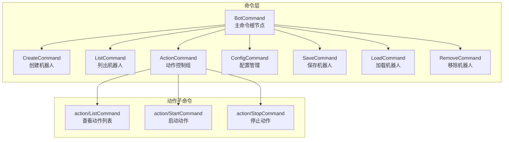
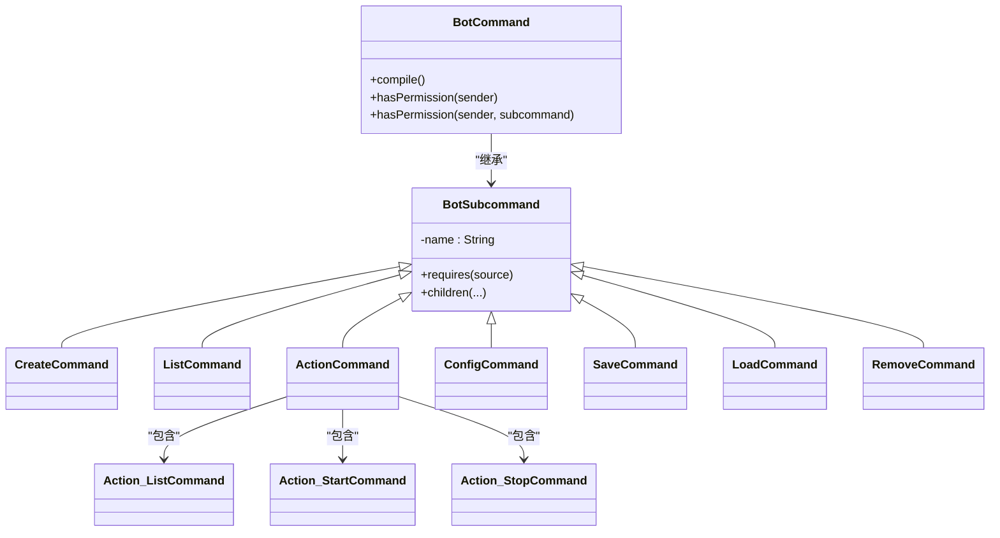
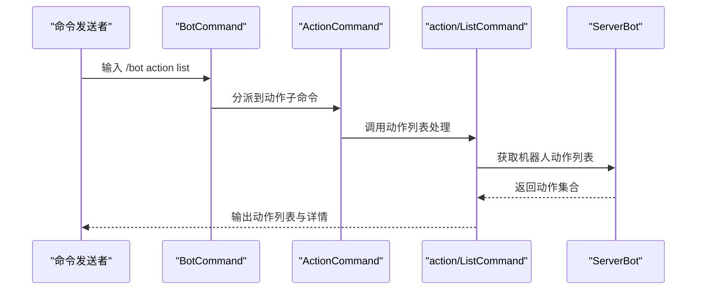
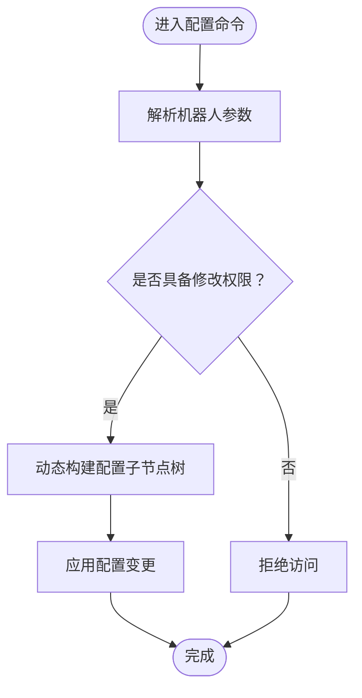
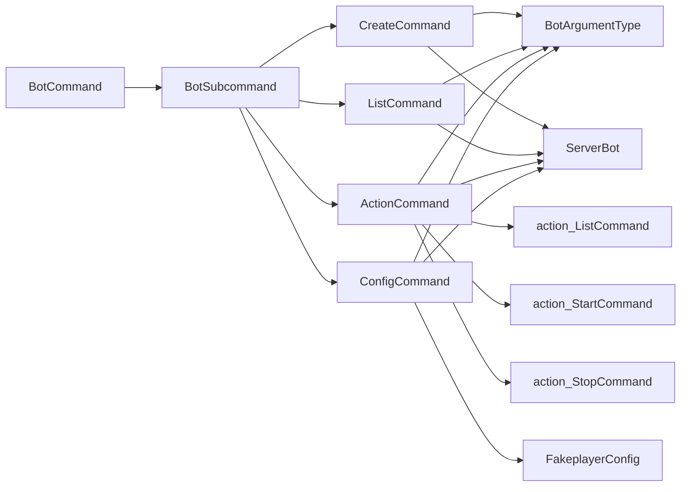

# 机器人命令系统

<cite>
**本文档引用的文件**
- [BotCommand.java](file://lophine-server/src/main/java/org/leavesmc/leaves/command/bot/BotCommand.java)
- [BotSubcommand.java](file://lophine-server/src/main/java/org/leavesmc/leaves/command/bot/BotSubcommand.java)
- [CreateCommand.java](file://lophine-server/src/main/java/org/leavesmc/leaves/command/bot/subcommands/CreateCommand.java)
- [ListCommand.java](file://lophine-server/src/main/java/org/leavesmc/leaves/command/bot/subcommands/ListCommand.java)
- [action/ListCommand.java](file://lophine-server/src/main/java/org/leavesmc/leaves/command/bot/subcommands/action/ListCommand.java)
- [ActionCommand.java](file://lophine-server/src/main/java/org/leavesmc/leaves/command/bot/subcommands/ActionCommand.java)
- [ConfigCommand.java](file://lophine-server/src/main/java/org/leavesmc/leaves/command/bot/subcommands/ConfigCommand.java)
- [BotArgumentType.java](file://lophine-server/src/main/java/org/leavesmc/leaves/command/arguments/BotArgumentType.java)
- [ServerBot.java](file://lophine-server/src/main/java/org/leavesmc/leaves/bot/ServerBot.java)
- [FakeplayerConfig.java](file://lophine-server/src/main/java/fun/bm/lophine/config/modules/function/FakeplayerConfig.java)
</cite>

## 目录
1. [简介](#简介)
2. [项目结构](#项目结构)
3. [核心组件](#核心组件)
4. [架构总览](#架构总览)
5. [详细组件分析](#详细组件分析)
6. [依赖关系分析](#依赖关系分析)
7. [性能考虑](#性能考虑)
8. [故障排除指南](#故障排除指南)
9. [结论](#结论)

## 简介
本文件为 Lophine 机器人的命令系统技术文档，聚焦于 BotCommand 主命令及其子命令体系，涵盖命令注册、参数解析、权限控制与错误处理，并提供扩展新命令的指导。读者可据此理解命令系统的整体架构、各子命令的功能与用法、以及在实际环境中的最佳实践与安全注意事项。

## 项目结构
命令系统位于 leaves 模块的命令包中，采用“主命令 + 子命令”的层次化设计，通过 Brigadier 构建命令树，结合自定义参数类型与权限模型实现强约束的命令访问控制。

图表来源
- [BotCommand.java:29-58](file://lophine-server/src/main/java/org/leavesmc/leaves/command/bot/BotCommand.java#L29-L58)
- [ActionCommand.java:1-32](file://lophine-server/src/main/java/org/leavesmc/leaves/command/bot/subcommands/ActionCommand.java#L1-L32)
- [action/ListCommand.java:38-67](file://lophine-server/src/main/java/org/leavesmc/leaves/command/bot/subcommands/action/ListCommand.java#L38-L67)

章节来源
- [BotCommand.java:29-58](file://lophine-server/src/main/java/org/leavesmc/leaves/command/bot/BotCommand.java#L29-L58)

## 核心组件
- BotCommand：主命令根节点，负责注册所有子命令并统一管理权限。
- BotSubcommand：抽象基类，封装子命令通用逻辑（名称、子节点注册、权限检查）。
- 各具体子命令：CreateCommand、ListCommand、ActionCommand、ConfigCommand 等，分别实现对应功能。
- 参数类型：BotArgumentType 提供机器人参数解析能力，确保命令上下文中能正确提取目标机器人实例。
- 权限模型：基于基础权限前缀与子命令后缀组合进行细粒度授权；部分命令受全局配置开关限制。

章节来源
- [BotCommand.java:29-58](file://lophine-server/src/main/java/org/leavesmc/leaves/command/bot/BotCommand.java#L29-L58)
- [BotSubcommand.java:23-35](file://lophine-server/src/main/java/org/leavesmc/leaves/command/bot/BotSubcommand.java#L23-L35)
- [BotArgumentType.java](file://lophine-server/src/main/java/org/leavesmc/leaves/command/arguments/BotArgumentType.java)

## 架构总览
命令系统以 BotCommand 为核心，通过编译阶段注册权限并构建命令树。每个子命令继承 BotSubcommand，复用统一的权限与参数解析机制。动作类子命令进一步细分为动作列表、启动、停止等操作。

图表来源
- [BotCommand.java:29-58](file://lophine-server/src/main/java/org/leavesmc/leaves/command/bot/BotCommand.java#L29-L58)
- [BotSubcommand.java:23-35](file://lophine-server/src/main/java/org/leavesmc/leaves/command/bot/BotSubcommand.java#L23-L35)
- [ActionCommand.java:1-32](file://lophine-server/src/main/java/org/leavesmc/leaves/command/bot/subcommands/ActionCommand.java#L1-L32)

## 详细组件分析

### BotCommand 主命令
- 职责：注册所有子命令，统一编译并注册权限。
- 权限：基础权限前缀为 "bukkit.command.bot"，可通过后缀对子命令进行细化授权。
- 扩展点：新增子命令时，在构造函数中加入相应工厂方法即可。

章节来源
- [BotCommand.java:29-58](file://lophine-server/src/main/java/org/leavesmc/leaves/command/bot/BotCommand.java#L29-L58)

### BotSubcommand 抽象基类
- 职责：定义子命令命名、子节点注册、默认权限检查流程。
- 继承关系：各具体子命令均继承该类，复用统一的命令树构建与权限框架。

章节来源
- [BotSubcommand.java:23-35](file://lophine-server/src/main/java/org/leavesmc/leaves/command/bot/BotSubcommand.java#L23-L35)

### 创建机器人（CreateCommand）
- 功能：根据名称与位置信息创建机器人实体，触发创建事件并返回结果消息。
- 关键点：
  - 使用名称参数与位置解析器，支持精确坐标与相对坐标。
  - 触发创建事件，便于监听器扩展或拦截。
  - 返回本地化的反馈消息给命令发送者。

章节来源
- [CreateCommand.java:45-53](file://lophine-server/src/main/java/org/leavesmc/leaves/command/bot/subcommands/CreateCommand.java#L45-L53)

### 列出机器人（ListCommand）
- 功能：展示服务器上已存在的机器人列表，便于管理员快速定位与管理。
- 关键点：
  - 遍历机器人集合，输出显示名称与唯一标识。
  - 对空列表给出明确提示。

章节来源
- [ListCommand.java:46-67](file://lophine-server/src/main/java/org/leavesmc/leaves/command/bot/subcommands/ListCommand.java#L46-L67)

### 动作控制（ActionCommand 及其子命令）
- 功能：对机器人的动作队列进行管理，包括查看当前动作、启动新动作、停止当前动作。
- 关键点：
  - 通过 BotArgumentType 解析目标机器人。
  - 动作列表子命令展示当前活动动作，支持悬停查看详细数据。
  - 启动/停止子命令与机器人内部动作调度器交互。

图表来源
- [action/ListCommand.java:46-67](file://lophine-server/src/main/java/org/leavesmc/leaves/command/bot/subcommands/action/ListCommand.java#L46-L67)
- [ServerBot.java](file://lophine-server/src/main/java/org/leavesmc/leaves/bot/ServerBot.java)

章节来源
- [ActionCommand.java:1-32](file://lophine-server/src/main/java/org/leavesmc/leaves/command/bot/subcommands/ActionCommand.java#L1-L32)
- [action/ListCommand.java:38-67](file://lophine-server/src/main/java/org/leavesmc/leaves/command/bot/subcommands/action/ListCommand.java#L38-L67)

### 配置管理（ConfigCommand）
- 功能：对指定机器人的配置项进行查询与修改，支持按配置类型动态生成子节点。
- 关键点：
  - 通过 BotArgumentType 解析机器人。
  - 基于全局配置开关 FakeplayerConfig.canModifyConfig 控制修改权限。
  - 动态注册配置相关的子节点，形成树状配置导航。

图表来源
- [ConfigCommand.java:54-57](file://lophine-server/src/main/java/org/leavesmc/leaves/command/bot/subcommands/ConfigCommand.java#L54-L57)
- [FakeplayerConfig.java](file://lophine-server/src/main/java/fun/bm/lophine/config/modules/function/FakeplayerConfig.java)

章节来源
- [ConfigCommand.java:47-73](file://lophine-server/src/main/java/org/leavesmc/leaves/command/bot/subcommands/ConfigCommand.java#L47-L73)

## 依赖关系分析
- 命令层依赖：
  - BotCommand 依赖各子命令类进行注册。
  - BotSubcommand 作为抽象基类被所有子命令继承。
  - 子命令依赖 BotArgumentType 进行机器人参数解析。
- 业务层依赖：
  - ServerBot 提供机器人状态与动作接口。
  - FakeplayerConfig 提供全局配置开关，影响部分命令的可用性与权限。
- 外部库依赖：
  - 使用 Brigadier 构建命令树，Paper 的 CommandSourceStack 与命令上下文集成。

图表来源
- [BotCommand.java:29-58](file://lophine-server/src/main/java/org/leavesmc/leaves/command/bot/BotCommand.java#L29-L58)
- [BotSubcommand.java:23-35](file://lophine-server/src/main/java/org/leavesmc/leaves/command/bot/BotSubcommand.java#L23-L35)
- [CreateCommand.java:38-50](file://lophine-server/src/main/java/org/leavesmc/leaves/command/bot/subcommands/CreateCommand.java#L38-L50)
- [ListCommand.java:39-43](file://lophine-server/src/main/java/org/leavesmc/leaves/command/bot/subcommands/ListCommand.java#L39-L43)
- [ActionCommand.java:20-31](file://lophine-server/src/main/java/org/leavesmc/leaves/command/bot/subcommands/ActionCommand.java#L20-L31)
- [ConfigCommand.java:20-35](file://lophine-server/src/main/java/org/leavesmc/leaves/command/bot/subcommands/ConfigCommand.java#L20-L35)

## 性能考虑
- 命令解析与权限检查：
  - 在编译阶段集中注册权限，避免运行时重复计算。
  - 子命令按需检查权限，减少不必要的判定开销。
- 机器人状态查询：
  - 列表与动作列表命令应避免在高频调用场景下进行重负载操作，必要时引入缓存或节流。
- 动作调度：
  - 动作启动/停止涉及世界线程与调度器交互，应避免在主线程阻塞操作，确保异步处理与事件驱动。
- 配置变更：
  - 配置修改可能触发广播或重载，建议批量变更并合并日志输出，降低 I/O 压力。

## 故障排除指南
- 权限不足：
  - 确认命令发送者是否拥有基础权限 "bukkit.command.bot" 或对应子命令后缀权限。
  - 检查全局配置开关 FakeplayerConfig.canModifyConfig 是否允许修改配置。
- 机器人不存在：
  - 确认机器人名称或选择器是否正确，使用列出命令核对机器人是否存在。
- 命令参数错误：
  - 检查位置参数格式与坐标解析器要求，确保输入符合预期。
- 动作执行异常：
  - 查看动作列表命令输出的详细信息，确认动作状态与前置条件满足。
- 性能问题：
  - 减少高频命令调用频率，避免在短时间内大量创建/销毁机器人。
  - 对配置变更进行批处理，避免频繁写盘。

章节来源
- [BotCommand.java:51-57](file://lophine-server/src/main/java/org/leavesmc/leaves/command/bot/BotCommand.java#L51-L57)
- [ConfigCommand.java:55-57](file://lophine-server/src/main/java/org/leavesmc/leaves/command/bot/subcommands/ConfigCommand.java#L55-L57)

## 结论
Lophine 机器人命令系统通过清晰的分层设计与严格的权限控制，提供了稳定且可扩展的机器人管理能力。主命令 BotCommand 统一编译与注册，子命令遵循 BotSubcommand 抽象基类，既保证了代码一致性，也为后续扩展新命令提供了标准化路径。配合参数解析与事件机制，系统在功能完整性与安全性方面均表现良好。建议在生产环境中结合配置开关与权限策略，合理规划命令使用频率与批处理策略，以获得更佳的稳定性与性能。