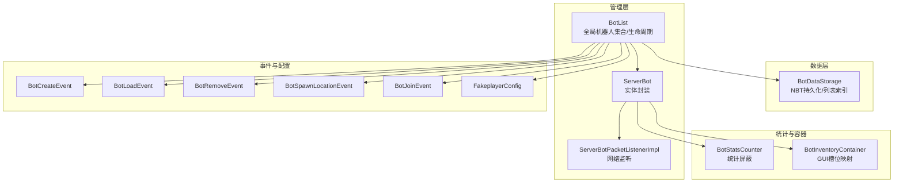
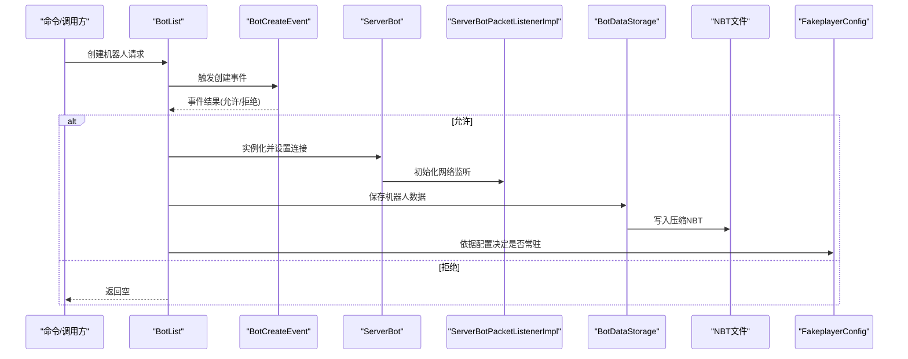
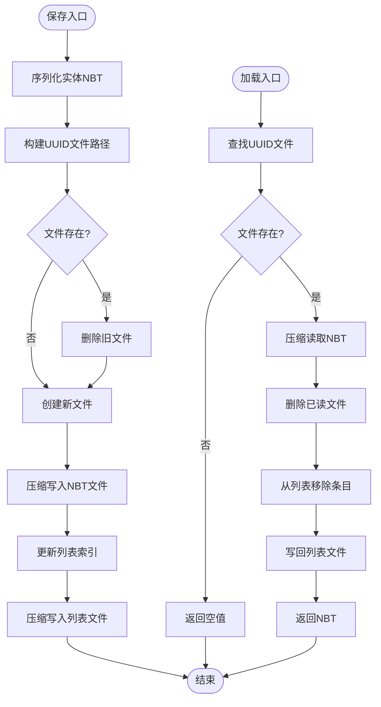
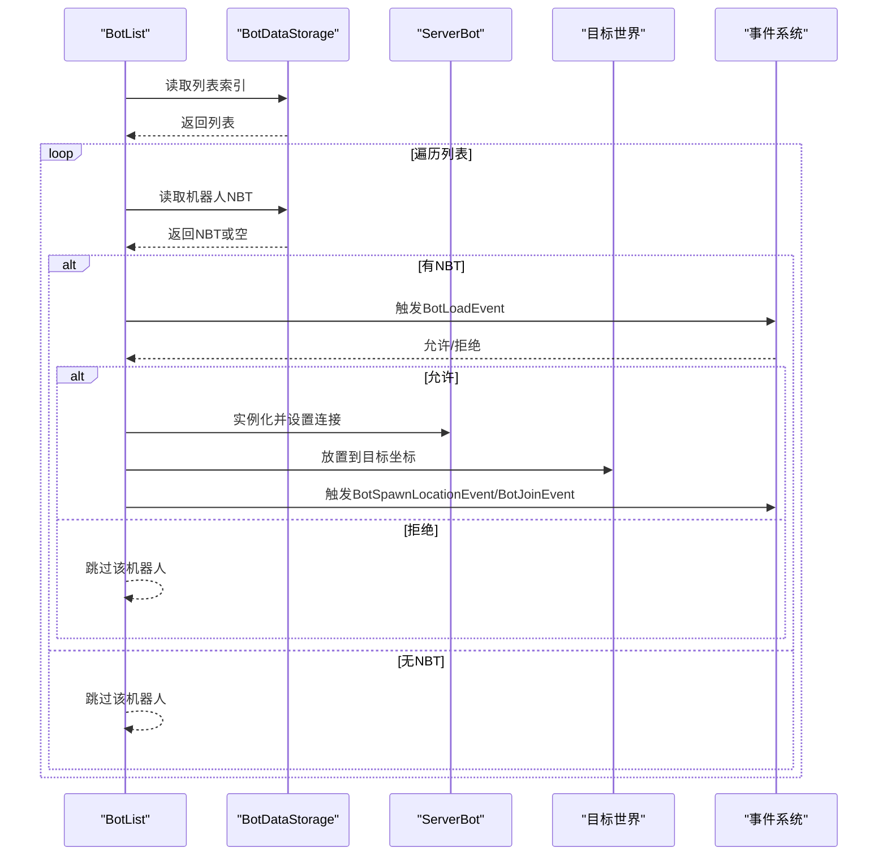
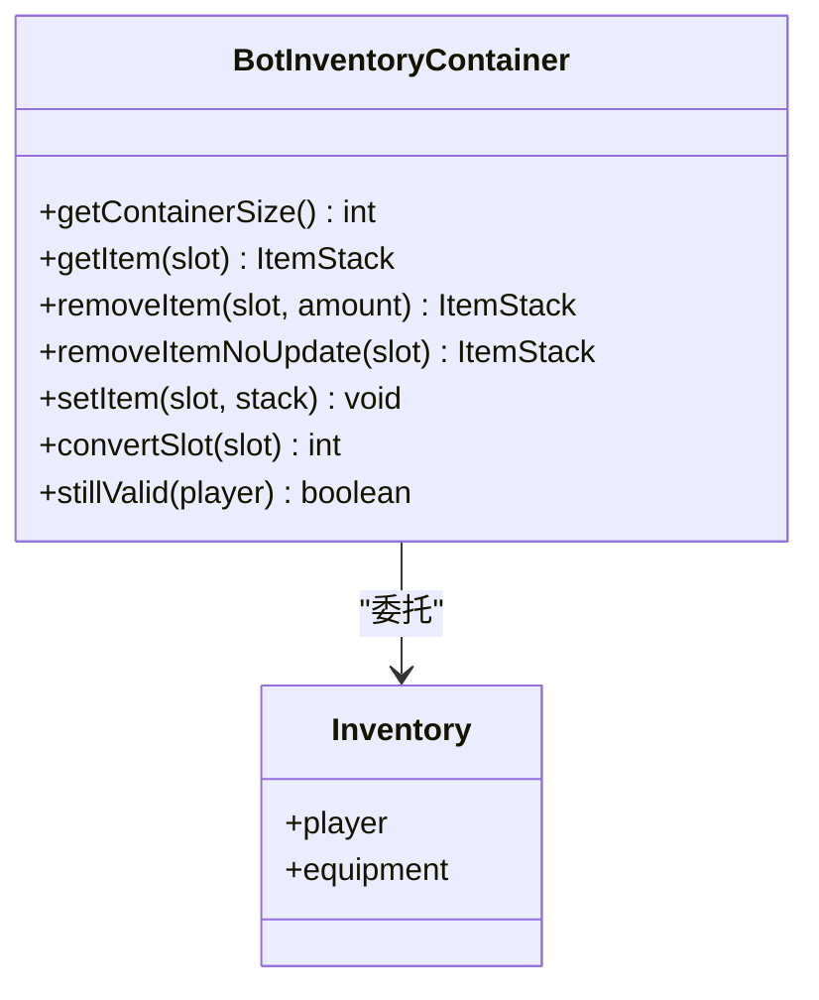
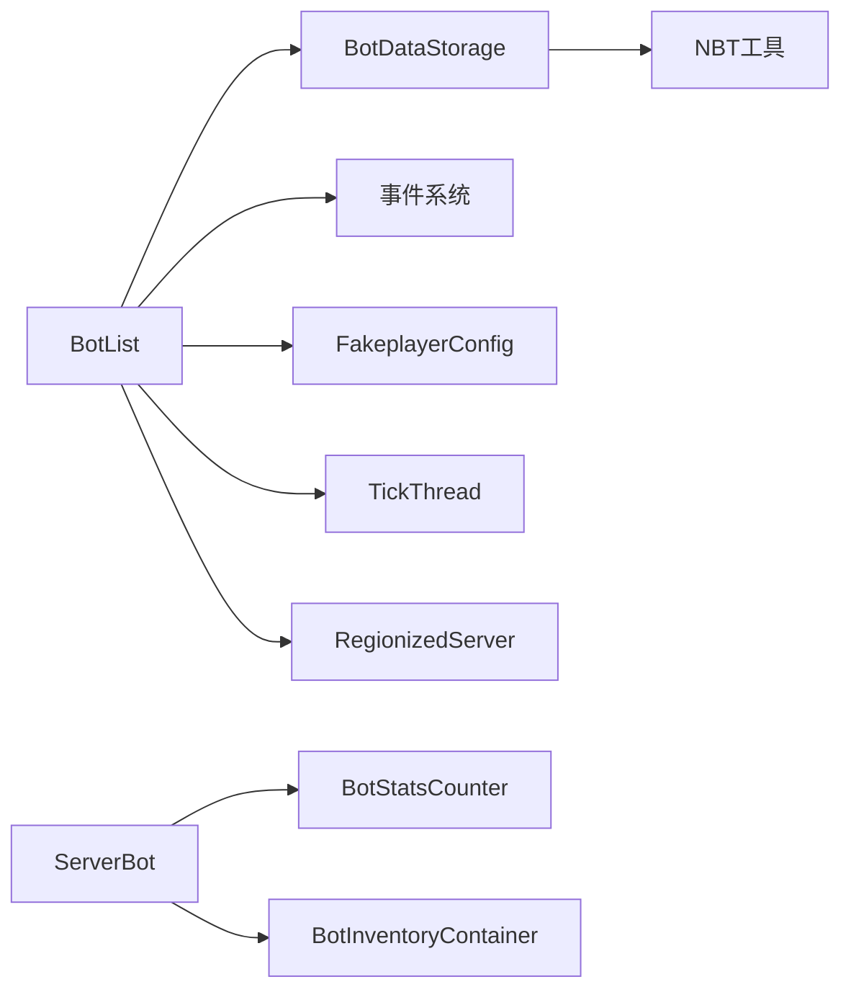

# 机器人数据管理

<cite>
**本文引用的文件**   
- [BotDataStorage.java](file://lophine-server/src/main/java/org/leavesmc/leaves/bot/BotDataStorage.java)
- [BotList.java](file://lophine-server/src/main/java/org/leavesmc/leaves/bot/BotList.java)
- [BotStatsCounter.java](file://lophine-server/src/main/java/org/leavesmc/leaves/bot/BotStatsCounter.java)
- [BotInventoryContainer.java](file://lophine-server/src/main/java/org/leavesmc/leaves/bot/BotInventoryContainer.java)
- [ServerBot.java](file://lophine-server/src/main/java/org/leavesmc/leaves/bot/ServerBot.java)
- [BotUtil.java](file://lophine-server/src/main/java/org/leavesmc/leaves/bot/BotUtil.java)
- [ServerBotPacketListenerImpl.java](file://lophine-server/src/main/java/org/leavesmc/leaves/bot/ServerBotPacketListenerImpl.java)
- [FakeplayerConfig.java](file://lophine-server/src/main/java/dev/bm/lophine/config/modules/function/FakeplayerConfig.java)
- [BotCreateEvent.java](file://lophine-api/src/main/java/org/leavesmc/leaves/event/bot/BotCreateEvent.java)
- [BotLoadEvent.java](file://lophine-api/src/main/java/org/leavesmc/leaves/event/bot/BotLoadEvent.java)
- [BotRemoveEvent.java](file://lophine-api/src/main/java/org/leavesmc/leaves/event/bot/BotRemoveEvent.java)
- [BotSpawnLocationEvent.java](file://lophine-api/src/main/java/org/leavesmc/leaves/event/bot/BotSpawnLocationEvent.java)
- [BotJoinEvent.java](file://lophine-api/src/main/java/org/leavesmc/leaves/event/bot/BotJoinEvent.java)
- [NbtIo.java](file://lophine-server/src/main/java/org/leavesmc/leaves/util/NbtIo.java)
- [TagUtil.java](file://lophine-server/src/main/java/org/leavesmc/leaves/util/TagUtil.java)
- [LogUtils.java](file://lophine-server/src/main/java/org/leavesmc/leaves/util/LogUtils.java)
- [MCUtil.java](file://lophine-server/src/main/java/org/leavesmc/leaves/util/MCUtil.java)
- [LophineBotUtil.java](file://lophine-server/src/main/java/org/leavesmc/leaves/bot/LophineBotUtil.java)
- [TickThread.java](file://lophine-server/src/main/java/org/leavesmc/leaves/util/TickThread.java)
- [RegionizedServer.java](file://lophine-server/src/main/java/org/leavesmc/leaves/util/RegionizedServer.java)
- [PaperAdventure.java](file://lophine-server/src/main/java/org/leavesmc/leaves/util/PaperAdventure.java)
</cite>

## 目录
1. [引言](#引言)
2. [项目结构](#项目结构)
3. [核心组件](#核心组件)
4. [架构总览](#架构总览)
5. [详细组件分析](#详细组件分析)
6. [依赖关系分析](#依赖关系分析)
7. [性能考量](#性能考量)
8. [故障排除指南](#故障排除指南)
9. [结论](#结论)
10. [附录](#附录)

## 引言
本技术文档围绕 Lophine 机器人的数据管理机制展开，系统性解析以下关键模块：BotDataStorage 的数据持久化与读写流程、BotList 的机器人列表管理与生命周期控制、BotStatsCounter 的统计计数器行为、BotInventoryContainer 的物品栏容器实现。文档同时覆盖数据序列化/反序列化、备份与恢复、数据一致性与并发访问控制、数据清理与回收、最佳实践与性能优化建议，并提供可扩展的设计指南与故障排除方法。

## 项目结构
Lophine 将机器人数据管理集中在服务器端模块中，采用“事件驱动 + 配置开关 + 线程安全”的设计思路：
- 数据存储层：BotDataStorage 负责单个机器人的 NBT 序列化与列表索引维护
- 列表管理层：BotList 维护全局机器人集合、按世界维度索引、加载/卸载与移除逻辑
- 统计层：BotStatsCounter 扩展服务端统计计数器，屏蔽对真实玩家统计的影响
- 容器层：BotInventoryContainer 包装原版 Inventory，提供 GUI 展示槽位映射与交互限制
- 事件与配置：通过 Leaves API 事件与 FakeplayerConfig 控制行为边界

图示来源
- [BotDataStorage.java:39-156](file://lophine-server/src/main/java/org/leavesmc/leaves/bot/BotDataStorage.java#L39-L156)
- [BotList.java:63-545](file://lophine-server/src/main/java/org/leavesmc/leaves/bot/BotList.java#L63-L545)
- [ServerBot.java:102-103](file://lophine-server/src/main/java/org/leavesmc/leaves/bot/ServerBot.java#L102-L103)
- [ServerBotPacketListenerImpl.java](file://lophine-server/src/main/java/org/leavesmc/leaves/bot/ServerBotPacketListenerImpl.java)
- [BotStatsCounter.java:31-55](file://lophine-server/src/main/java/org/leavesmc/leaves/bot/BotStatsCounter.java#L31-L55)
- [BotInventoryContainer.java:32-142](file://lophine-server/src/main/java/org/leavesmc/leaves/bot/BotInventoryContainer.java#L32-L142)
- [BotCreateEvent.java](file://lophine-api/src/main/java/org/leavesmc/leaves/event/bot/BotCreateEvent.java)
- [BotLoadEvent.java](file://lophine-api/src/main/java/org/leavesmc/leaves/event/bot/BotLoadEvent.java)
- [BotRemoveEvent.java](file://lophine-api/src/main/java/org/leavesmc/leaves/event/bot/BotRemoveEvent.java)
- [BotSpawnLocationEvent.java](file://lophine-api/src/main/java/org/leavesmc/leaves/event/bot/BotSpawnLocationEvent.java)
- [BotJoinEvent.java](file://lophine-api/src/main/java/org/leavesmc/leaves/event/bot/BotJoinEvent.java)
- [FakeplayerConfig.java](file://lophine-server/src/main/java/dev/bm/lophine/config/modules/function/FakeplayerConfig.java)

章节来源
- [BotDataStorage.java:39-156](file://lophine-server/src/main/java/org/leavesmc/leaves/bot/BotDataStorage.java#L39-L156)
- [BotList.java:63-545](file://lophine-server/src/main/java/org/leavesmc/leaves/bot/BotList.java#L63-L545)
- [BotStatsCounter.java:31-55](file://lophine-server/src/main/java/org/leavesmc/leaves/bot/BotStatsCounter.java#L31-L55)
- [BotInventoryContainer.java:32-142](file://lophine-server/src/main/java/org/leavesmc/leaves/bot/BotInventoryContainer.java#L32-L142)

## 核心组件
- BotDataStorage：负责单机器人 NBT 文件的保存、读取与列表索引（fakeplayer.dat/resume_fakeplayer.dat）的维护；支持压缩读写与异常兜底日志。
- BotList：全局机器人集合与索引（UUID/名称/按世界维度），提供创建、加载、移除、批量移除、按世界加载等能力；集成事件系统与配置开关。
- BotStatsCounter：继承服务端统计计数器，重写保存与数值接口，避免对真实玩家统计产生影响。
- BotInventoryContainer：包装原版 Inventory，提供 54 槽 GUI 映射、按钮占位、设备更新检测与距离校验。

章节来源
- [BotDataStorage.java:39-156](file://lophine-server/src/main/java/org/leavesmc/leaves/bot/BotDataStorage.java#L39-L156)
- [BotList.java:63-545](file://lophine-server/src/main/java/org/leavesmc/leaves/bot/BotList.java#L63-L545)
- [BotStatsCounter.java:31-55](file://lophine-server/src/main/java/org/leavesmc/leaves/bot/BotStatsCounter.java#L31-L55)
- [BotInventoryContainer.java:32-142](file://lophine-server/src/main/java/org/leavesmc/leaves/bot/BotInventoryContainer.java#L32-L142)

## 架构总览
下图展示从创建到运行再到移除的完整数据流，以及与事件、配置、线程模型的交互：

图示来源
- [BotList.java:111-131](file://lophine-server/src/main/java/org/leavesmc/leaves/bot/BotList.java#L111-L131)
- [BotCreateEvent.java](file://lophine-api/src/main/java/org/leavesmc/leaves/event/bot/BotCreateEvent.java)
- [ServerBot.java:102-103](file://lophine-server/src/main/java/org/leavesmc/leaves/bot/ServerBot.java#L102-L103)
- [ServerBotPacketListenerImpl.java](file://lophine-server/src/main/java/org/leavesmc/leaves/bot/ServerBotPacketListenerImpl.java)
- [BotDataStorage.java:62-90](file://lophine-server/src/main/java/org/leavesmc/leaves/bot/BotDataStorage.java#L62-L90)
- [FakeplayerConfig.java](file://lophine-server/src/main/java/dev/bm/lophine/config/modules/function/FakeplayerConfig.java)

## 详细组件分析

### BotDataStorage：数据持久化与列表索引
- 存储位置与命名：每个机器人以 UUID 命名的 .dat 文件存放在独立数据目录；列表索引文件为 fakeplayer.dat 或 resume_fakeplayer.dat。
- 保存流程：序列化实体 NBT → 删除旧文件 → 创建新文件 → 压缩写入 → 更新列表索引 → 压缩写入列表文件。
- 加载流程：根据 UUID 查找 .dat → 压缩读取 → 删除已读文件 → 从列表中移除对应项 → 返回 NBT。
- 读取流程：直接读取指定 UUID 的 .dat 文件，不修改列表或删除文件。
- 错误处理：捕获异常并记录警告日志，不影响主流程继续执行。
- 并发与一致性：单文件操作在保存/加载时进行删除与重建，避免并发写冲突；列表文件同样采用原子式重建策略。

图示来源
- [BotDataStorage.java:62-151](file://lophine-server/src/main/java/org/leavesmc/leaves/bot/BotDataStorage.java#L62-L151)
- [NbtIo.java](file://lophine-server/src/main/java/org/leavesmc/leaves/util/NbtIo.java)
- [TagUtil.java](file://lophine-server/src/main/java/org/leavesmc/leaves/util/TagUtil.java)

章节来源
- [BotDataStorage.java:39-156](file://lophine-server/src/main/java/org/leavesmc/leaves/bot/BotDataStorage.java#L39-L156)

### BotList：列表管理与生命周期
- 集合与索引：CopyOnWriteArrayList 保证遍历安全；按 UUID/名称/按世界维度维护多级索引。
- 创建：触发 BotCreateEvent，校验合法性后实例化 ServerBot，设置连接与初始状态，随后保存数据。
- 加载：根据列表索引选择手动保存或常驻数据存储，读取 NBT 后放置到目标世界坐标，触发 BotSpawnLocationEvent 与 BotJoinEvent。
- 移除：支持同步/异步移除；在 Folia 环境下确保在正确区域线程执行；可选择保存或丢弃物品；清理挂载关系与连接。
- 批量操作：按世界维度批量移除；在区域不可用时进行“强制移除”清理内部映射。
- 常驻加载：启动时扫描 resume 列表，按世界维度预加载机器人。

图示来源
- [BotList.java:133-185](file://lophine-server/src/main/java/org/leavesmc/leaves/bot/BotList.java#L133-L185)
- [BotLoadEvent.java](file://lophine-api/src/main/java/org/leavesmc/leaves/event/bot/BotLoadEvent.java)
- [BotSpawnLocationEvent.java](file://lophine-api/src/main/java/org/leavesmc/leaves/event/bot/BotSpawnLocationEvent.java)
- [BotJoinEvent.java](file://lophine-api/src/main/java/org/leavesmc/leaves/event/bot/BotJoinEvent.java)
- [BotDataStorage.java:93-135](file://lophine-server/src/main/java/org/leavesmc/leaves/bot/BotDataStorage.java#L93-L135)

章节来源
- [BotList.java:63-545](file://lophine-server/src/main/java/org/leavesmc/leaves/bot/BotList.java#L63-L545)

### BotStatsCounter：统计计数器
- 行为：继承自服务端统计计数器，重写保存、设置值、解析 JSON 与读取值接口，使其对机器人无效，避免污染真实玩家统计数据。
- 设计动机：机器人作为 NPC 不应参与真实玩家统计，屏蔽其对全局统计的影响。

章节来源
- [BotStatsCounter.java:31-55](file://lophine-server/src/main/java/org/leavesmc/leaves/bot/BotStatsCounter.java#L31-L55)

### BotInventoryContainer：物品栏容器
- 结构：固定 54 槽 GUI 容器，内部委托原版 Inventory；提供槽位映射规则，区分按钮、装备、主手、副手、背包与热键栏。
- 行为：按钮槽位返回占位符物品；移除/设置物品时触发设备更新检测；stillValid 基于距离限制打开容器。
- 设计动机：为机器人提供稳定的 GUI 展示与交互体验，同时防止外部修改按钮区。

图示来源
- [BotInventoryContainer.java:32-142](file://lophine-server/src/main/java/org/leavesmc/leaves/bot/BotInventoryContainer.java#L32-L142)

章节来源
- [BotInventoryContainer.java:32-142](file://lophine-server/src/main/java/org/leavesmc/leaves/bot/BotInventoryContainer.java#L32-L142)

## 依赖关系分析
- BotList 依赖 BotDataStorage 进行数据持久化；依赖事件系统进行生命周期控制；依赖 FakeplayerConfig 控制常驻与保存策略。
- ServerBot 持有 BotStatsCounter 与 BotInventoryContainer，分别用于统计屏蔽与容器展示。
- BotDataStorage 依赖 NBT 工具类进行压缩读写与实体标签序列化。
- Folia 环境下的线程安全：BotList 在放置机器人与移除机器人时，通过 TickThread 与 RegionizedServer 确保在正确区域线程执行，否则调度到目标区域队列。

图示来源
- [BotList.java:82-87](file://lophine-server/src/main/java/org/leavesmc/leaves/bot/BotList.java#L82-L87)
- [ServerBot.java:102-103](file://lophine-server/src/main/java/org/leavesmc/leaves/bot/ServerBot.java#L102-L103)
- [BotDataStorage.java:47-60](file://lophine-server/src/main/java/org/leavesmc/leaves/bot/BotDataStorage.java#L47-L60)
- [NbtIo.java](file://lophine-server/src/main/java/org/leavesmc/leaves/util/NbtIo.java)
- [TickThread.java](file://lophine-server/src/main/java/org/leavesmc/leaves/util/TickThread.java)
- [RegionizedServer.java](file://lophine-server/src/main/java/org/leavesmc/leaves/util/RegionizedServer.java)

章节来源
- [BotList.java:63-545](file://lophine-server/src/main/java/org/leavesmc/leaves/bot/BotList.java#L63-L545)
- [ServerBot.java:102-103](file://lophine-server/src/main/java/org/leavesmc/leaves/bot/ServerBot.java#L102-L103)
- [BotDataStorage.java:39-156](file://lophine-server/src/main/java/org/leavesmc/leaves/bot/BotDataStorage.java#L39-L156)

## 性能考量
- I/O 压缩：使用压缩 NBT 读写，减少磁盘占用与 IO 压力，但会增加 CPU 开销；建议在高频率保存场景下评估间隔与批量保存策略。
- 批量保存：BotList 提供按时间间隔的批量常驻保存，降低频繁 I/O 对主线程的影响。
- 线程模型：Folia 下严格在区域线程执行实体放置/移除，避免跨线程访问引发的额外开销与潜在死锁。
- 并发集合：使用 CopyOnWriteArrayList 保障遍历安全，适合读多写少的场景；写入时复制带来一定内存峰值。
- 统计屏蔽：BotStatsCounter 重写保存与设置值接口，避免机器人参与统计导致的额外计算与存储压力。
- 容器交互：BotInventoryContainer 在物品变更时触发设备更新检测，建议在批量操作时合并多次变更以减少广播与渲染开销。

## 故障排除指南
- 无法加载机器人数据
  - 检查 UUID 对应的 .dat 文件是否存在且可读；确认列表索引文件是否损坏。
  - 参考路径：[BotDataStorage.java:105-135](file://lophine-server/src/main/java/org/leavesmc/leaves/bot/BotDataStorage.java#L105-L135)
- 机器人无法登录或显示异常
  - 确认 BotSpawnLocationEvent 是否被拦截；检查目标世界的维度键是否有效。
  - 参考路径：[BotList.java:168-181](file://lophine-server/src/main/java/org/leavesmc/leaves/bot/BotList.java#L168-L181)
- 移除机器人失败或卡顿
  - 检查是否处于 Folia 区域线程；若不在，系统会异步调度；必要时启用“强制移除”清理内部映射。
  - 参考路径：[BotList.java:267-389](file://lophine-server/src/main/java/org/leavesmc/leaves/bot/BotList.java#L267-L389)
- 物品栏交互异常
  - 检查按钮区槽位映射与 stillValid 距离限制；确认设备更新检测是否触发。
  - 参考路径：[BotInventoryContainer.java:63-142](file://lophine-server/src/main/java/org/leavesmc/leaves/bot/BotInventoryContainer.java#L63-L142)
- 日志与调试
  - 使用 LogUtils 记录警告与错误；结合 PaperAdventure 的消息广播定位问题。
  - 参考路径：[LogUtils.java](file://lophine-server/src/main/java/org/leavesmc/leaves/util/LogUtils.java)，[PaperAdventure.java](file://lophine-server/src/main/java/org/leavesmc/leaves/util/PaperAdventure.java)

章节来源
- [BotDataStorage.java:52-80](file://lophine-server/src/main/java/org/leavesmc/leaves/bot/BotDataStorage.java#L52-L80)
- [BotList.java:168-181](file://lophine-server/src/main/java/org/leavesmc/leaves/bot/BotList.java#L168-L181)
- [BotList.java:267-389](file://lophine-server/src/main/java/org/leavesmc/leaves/bot/BotList.java#L267-L389)
- [BotInventoryContainer.java:63-142](file://lophine-server/src/main/java/org/leavesmc/leaves/bot/BotInventoryContainer.java#L63-L142)

## 结论
Lophine 的机器人数据管理以事件驱动为核心，结合配置开关与 Folia 线程模型，实现了稳定、可扩展的数据持久化与生命周期管理。BotDataStorage 提供可靠的 NBT 序列化与列表索引；BotList 负责全局协调与并发安全；BotStatsCounter 与 BotInventoryContainer 分别屏蔽统计与提供 GUI 体验。通过合理的批量保存、线程调度与错误处理，系统在保证数据一致性的同时兼顾了性能与可维护性。

## 附录
- 数据备份与恢复
  - 备份：定期复制数据目录与列表索引文件；可在停机或低负载时段执行。
  - 恢复：将备份的 .dat 文件与列表索引放回原位，重启后由 BotList 自动扫描加载。
  - 参考路径：[BotDataStorage.java:137-151](file://lophine-server/src/main/java/org/leavesmc/leaves/bot/BotDataStorage.java#L137-L151)
- 数据清理与垃圾回收
  - 移除机器人时可选择丢弃物品并清理挂载关系；在区域不可用时进行“强制移除”，清理内部映射。
  - 参考路径：[BotList.java:326-389](file://lophine-server/src/main/java/org/leavesmc/leaves/bot/BotList.java#L326-L389)
- 最佳实践
  - 合理设置常驻保存间隔，避免频繁 I/O；在批量操作时合并变更以减少设备更新广播。
  - 使用事件系统进行行为扩展，避免直接修改核心数据结构；在 Folia 环境下始终遵循区域线程约束。
  - 对于大规模机器人集群，建议分批加载与移除，配合日志监控与告警。
- 扩展指南
  - 新增字段：在实体序列化时添加自定义标签，注意与现有字段命名冲突；在加载时提供默认值与兼容逻辑。
  - 新增事件：参考 BotCreateEvent/BotLoadEvent/BotRemoveEvent 的模式，定义参数与取消语义。
  - 新增容器：基于 BotInventoryContainer 的槽位映射与占位符机制，扩展 GUI 行为与交互规则。