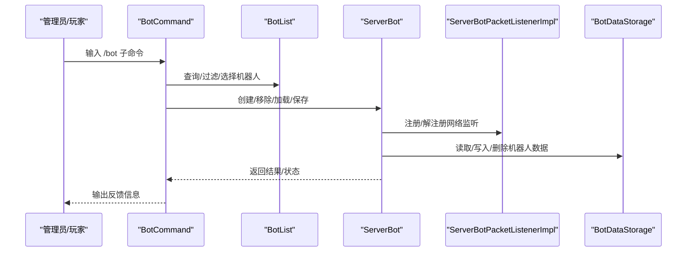
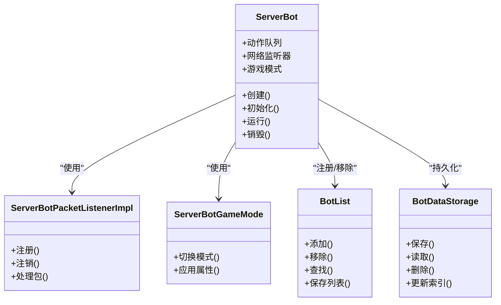
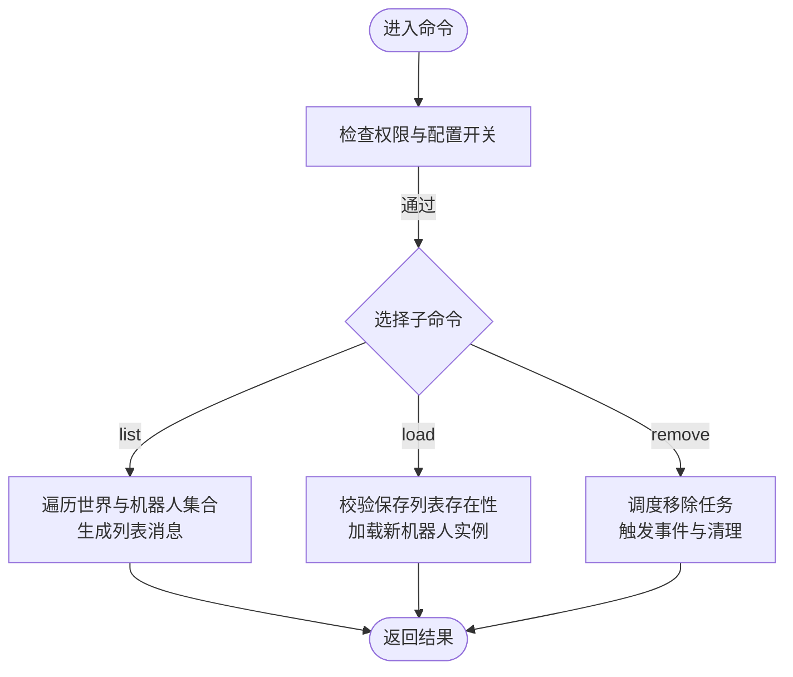
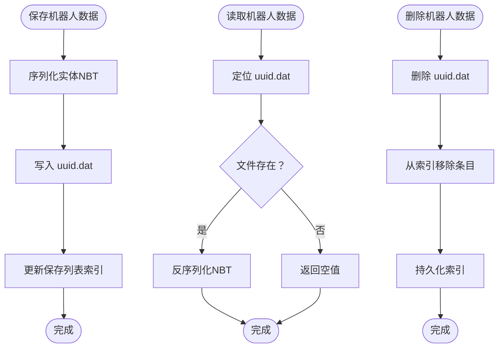
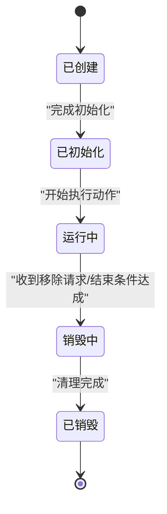
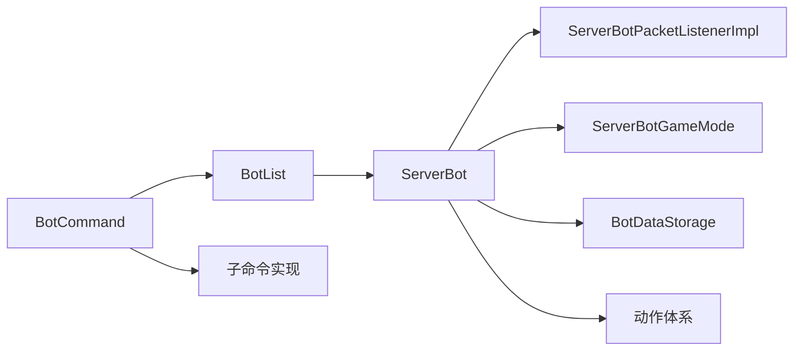

# 机器人架构设计

<cite>
**本文引用的文件**
- [ServerBot.java](file://lophine-server/src/main/java/org/leavesmc/leaves/bot/ServerBot.java)
- [BotUtil.java](file://lophine-server/src/main/java/org/leavesmc/leaves/bot/BotUtil.java)
- [BotList.java](file://lophine-server/src/main/java/org/leavesmc/leaves/bot/BotList.java)
- [BotDataStorage.java](file://lophine-server/src/main/java/org/leavesmc/leaves/bot/BotDataStorage.java)
- [BotCommand.java](file://lophine-server/src/main/java/org/leavesmc/leaves/command/bot/BotCommand.java)
- [ListCommand.java](file://lophine-server/src/main/java/org/leavesmc/leaves/command/bot/subcommands/ListCommand.java)
- [LoadCommand.java](file://lophine-server/src/main/java/org/leavesmc/leaves/command/bot/subcommands/LoadCommand.java)
- [RemoveCommand.java](file://lophine-server/src/main/java/org/leavesmc/leaves/command/bot/subcommands/RemoveCommand.java)
- [ActionCommand.java](file://lophine-server/src/main/java/org/leavesmc/leaves/command/bot/subcommands/ActionCommand.java)
- [ListCommand（动作子命令）.java](file://lophine-server/src/main/java/org/leavesmc/leaves/command/bot/subcommands/action/ListCommand.java)
- [ServerBotPacketListenerImpl.java](file://lophine-server/src/main/java/org/leavesmc/leaves/bot/ServerBotPacketListenerImpl.java)
- [ServerBotGameMode.java](file://lophine-server/src/main/java/org/leavesmc/leaves/bot/ServerBotGameMode.java)
- [LophineBotUtil.java](file://lophine-server/src/main/java/org/leavesmc/leaves/bot/LophineBotUtil.java)
- [AbstractBotAction.java](file://lophine-server/src/main/java/org/leavesmc/leaves/bot/agent/actions/AbstractBotAction.java)
- [AbstractStateBotAction.java](file://lophine-server/src/main/java/org/leavesmc/leaves/bot/agent/actions/AbstractStateBotAction.java)
- [AbstractTimerBotAction.java](file://lophine-server/src/main/java/org/leavesmc/leaves/bot/agent/actions/AbstractTimerBotAction.java)
- [AbstractUseBotAction.java](file://lophine-server/src/main/java/org/leavesmc/leaves/bot/agent/actions/AbstractUseBotAction.java)
- [ServerMoveAction.java](file://lophine-server/src/main/java/org/leavesmc/leaves/bot/agent/actions/ServerMoveAction.java)
- [ServerAttackAction.java](file://lophine-server/src/main/java/org/leavesmc/leaves/bot/agent/actions/ServerAttackAction.java)
- [ServerBreakBlockAction.java](file://lophine-server/src/main/java/org/leavesmc/leaves/bot/agent/actions/ServerBreakBlockAction.java)
- [ServerUseItemAction.java](file://lophine-server/src/main/java/org/leavesmc/leaves/bot/agent/actions/ServerUseItemAction.java)
- [ServerLookAction.java](file://lophine-server/src/main/java/org/leavesmc/leaves/bot/agent/actions/ServerLookAction.java)
- [ServerRotationAction.java](file://lophine-server/src/main/java/org/leavesmc/leaves/bot/agent/actions/ServerRotationAction.java)
- [ServerJumpAction.java](file://lophine-server/src/main/java/org/leavesmc/leaves/bot/agent/actions/ServerJumpAction.java)
- [ServerSneakAction.java](file://lophine-server/src/main/java/org/leavesmc/leaves/bot/agent/actions/ServerSneakAction.java)
- [ServerSwimAction.java](file://lophine-server/src/main/java/org/leavesmc/leaves/bot/agent/actions/ServerSwimAction.java)
- [ServerMountAction.java](file://lophine-server/src/main/java/org/leavesmc/leaves/bot/agent/actions/ServerMountAction.java)
- [ServerDropAction.java](file://lophine-server/src/main/java/org/leavesmc/leaves/bot/agent/actions/ServerDropAction.java)
- [ServerFishAction.java](file://lophine-server/src/main/java/org/leavesmc/leaves/bot/agent/actions/ServerFishAction.java)
- [ServerSwapAction.java](file://lophine-server/src/main/java/org/leavesmc/leaves/bot/agent/actions/ServerSwapAction.java)
- [ServerUseItemOnAction.java](file://lophine-server/src/main/java/org/leavesmc/leaves/bot/agent/actions/ServerUseItemOnAction.java)
- [ServerUseItemToAction.java](file://lophine-server/src/main/java/org/leavesmc/leaves/bot/agent/actions/ServerUseItemToAction.java)
- [ServerUseItemOffhandAction.java](file://lophine-server/src/main/java/org/leavesmc/leaves/bot/agent/actions/ServerUseItemOffhandAction.java)
- [ServerUseItemOnOffhandAction.java](file://lophine-server/src/main/java/org/leavesmc/leaves/bot/agent/actions/ServerUseItemOnOffhandAction.java)
- [ServerUseItemToOffhandAction.java](file://lophine-server/src/main/java/org/leavesmc/leaves/bot/agent/actions/ServerUseItemToOffhandAction.java)
- [ServerUseItemAutoAction.java](file://lophine-server/src/main/java/org/leavesmc/leaves/bot/agent/actions/ServerUseItemAutoAction.java)
- [FakeplayerConfig.java](file://lophine-server/src/main/java/fun/bm/lophine/config/modules/function/FakeplayerConfig.java)
</cite>

## 目录
1. [引言](#引言)
2. [项目结构](#项目结构)
3. [核心组件](#核心组件)
4. [架构总览](#架构总览)
5. [详细组件分析](#详细组件分析)
6. [依赖分析](#依赖分析)
7. [性能考虑](#性能考虑)
8. [故障排查指南](#故障排查指南)
9. [结论](#结论)
10. [附录](#附录)

## 引言
本技术文档围绕 Lophine 机器人的架构设计展开，系统性阐述 ServerBot 核心类的设计理念、BotUtil 工具类的功能实现、BotList 列表管理机制以及 BotDataStorage 数据存储策略；同时给出机器人生命周期管理（创建、初始化、运行到销毁）的完整流程，解释机器人与 Minecraft 世界交互的机制（实体创建、网络通信与状态同步），并总结扩展性设计与性能优化策略。文档包含多幅架构图与组件关系图，帮助开发者快速理解整体设计思路。

## 项目结构
Lophine 的机器人功能主要集中在 lophine-server 模块中，采用“命令层-业务层-协议层-数据层”的分层组织方式：
- 命令层：BotCommand 及其子命令，负责用户输入解析与权限控制
- 业务层：ServerBot、BotList、BotUtil 等核心业务对象
- 协议层：ServerBotPacketListenerImpl、ServerBotGameMode 等网络与游戏模式适配
- 数据层：BotDataStorage 负责持久化与加载机器人数据
- 动作层：抽象动作基类与具体动作实现，统一调度与执行

```mermaid
graph TB
subgraph "命令层"
CMD["BotCommand<br/>子命令节点"]
end
subgraph "业务层"
SB["ServerBot<br/>核心实体"]
BL["BotList<br/>全局列表"]
BU["BotUtil<br/>工具集"]
LBU["LophineBotUtil<br/>Lophine专用工具"]
end
subgraph "协议层"
PLI["ServerBotPacketListenerImpl<br/>网络监听器"]
GMD["ServerBotGameMode<br/>游戏模式"]
end
subgraph "数据层"
BDS["BotDataStorage<br/>NBT存档"]
end
subgraph "动作层"
ABA["AbstractBotAction<br/>抽象动作"]
SMA["ServerMoveAction"]
SAA["ServerAttackAction"]
SBA["ServerBreakBlockAction"]
SUA["ServerUseItemAction"]
SLA["ServerLookAction"]
SRA["ServerRotationAction"]
SJA["ServerJumpAction"]
SSA["ServerSneakAction"]
SWA["ServerSwimAction"]
SMAA["ServerMountAction"]
SDP["ServerDropAction"]
SFA["ServerFishAction"]
SSA2["ServerSwapAction"]
SUOA["ServerUseItemOnAction"]
SUTA["ServerUseItemToAction"]
SUOA2["ServerUseItemOffhandAction"]
SUOTA2["ServerUseItemToOffhandAction"]
SUAA["ServerUseItemAutoAction"]
end
CMD --> BL
CMD --> SB
SB --> BL
SB --> PLI
SB --> GMD
SB --> BDS
SB --> ABA
ABA --> SMA
ABA --> SAA
ABA --> SBA
ABA --> SUA
ABA --> SLA
ABA --> SRA
ABA --> SJA
ABA --> SSA
ABA --> SWA
ABA --> SMAA
ABA --> SDP
ABA --> SFA
ABA --> SSA2
ABA --> SUOA
ABA --> SUTA
ABA --> SUOA2
ABA --> SUOTA2
ABA --> SUAA
```

**图表来源**
- [BotCommand.java:29-58](file://lophine-server/src/main/java/org/leavesmc/leaves/command/bot/BotCommand.java#L29-L58)
- [ServerBot.java](file://lophine-server/src/main/java/org/leavesmc/leaves/bot/ServerBot.java)
- [BotList.java](file://lophine-server/src/main/java/org/leavesmc/leaves/bot/BotList.java)
- [BotUtil.java](file://lophine-server/src/main/java/org/leavesmc/leaves/bot/BotUtil.java)
- [LophineBotUtil.java](file://lophine-server/src/main/java/org/leavesmc/leaves/bot/LophineBotUtil.java)
- [ServerBotPacketListenerImpl.java](file://lophine-server/src/main/java/org/leavesmc/leaves/bot/ServerBotPacketListenerImpl.java)
- [ServerBotGameMode.java](file://lophine-server/src/main/java/org/leavesmc/leaves/bot/ServerBotGameMode.java)
- [BotDataStorage.java:35-156](file://lophine-server/src/main/java/org/leavesmc/leaves/bot/BotDataStorage.java#L35-L156)
- [AbstractBotAction.java](file://lophine-server/src/main/java/org/leavesmc/leaves/bot/agent/actions/AbstractBotAction.java)
- [ServerMoveAction.java](file://lophine-server/src/main/java/org/leavesmc/leaves/bot/agent/actions/ServerMoveAction.java)
- [ServerAttackAction.java](file://lophine-server/src/main/java/org/leavesmc/leaves/bot/agent/actions/ServerAttackAction.java)
- [ServerBreakBlockAction.java](file://lophine-server/src/main/java/org/leavesmc/leaves/bot/agent/actions/ServerBreakBlockAction.java)
- [ServerUseItemAction.java](file://lophine-server/src/main/java/org/leavesmc/leaves/bot/agent/actions/ServerUseItemAction.java)
- [ServerLookAction.java](file://lophine-server/src/main/java/org/leavesmc/leaves/bot/agent/actions/ServerLookAction.java)
- [ServerRotationAction.java](file://lophine-server/src/main/java/org/leavesmc/leaves/bot/agent/actions/ServerRotationAction.java)
- [ServerJumpAction.java](file://lophine-server/src/main/java/org/leavesmc/leaves/bot/agent/actions/ServerJumpAction.java)
- [ServerSneakAction.java](file://lophine-server/src/main/java/org/leavesmc/leaves/bot/agent/actions/ServerSneakAction.java)
- [ServerSwimAction.java](file://lophine-server/src/main/java/org/leavesmc/leaves/bot/agent/actions/ServerSwimAction.java)
- [ServerMountAction.java](file://lophine-server/src/main/java/org/leavesmc/leaves/bot/agent/actions/ServerMountAction.java)
- [ServerDropAction.java](file://lophine-server/src/main/java/org/leavesmc/leaves/bot/agent/actions/ServerDropAction.java)
- [ServerFishAction.java](file://lophine-server/src/main/java/org/leavesmc/leaves/bot/agent/actions/ServerFishAction.java)
- [ServerSwapAction.java](file://lophine-server/src/main/java/org/leavesmc/leaves/bot/agent/actions/ServerSwapAction.java)
- [ServerUseItemOnAction.java](file://lophine-server/src/main/java/org/leavesmc/leaves/bot/agent/actions/ServerUseItemOnAction.java)
- [ServerUseItemToAction.java](file://lophine-server/src/main/java/org/leavesmc/leaves/bot/agent/actions/ServerUseItemToAction.java)
- [ServerUseItemOffhandAction.java](file://lophine-server/src/main/java/org/leavesmc/leaves/bot/agent/actions/ServerUseItemOffhandAction.java)
- [ServerUseItemOnOffhandAction.java](file://lophine-server/src/main/java/org/leavesmc/leaves/bot/agent/actions/ServerUseItemOnOffhandAction.java)
- [ServerUseItemToOffhandAction.java](file://lophine-server/src/main/java/org/leavesmc/leaves/bot/agent/actions/ServerUseItemToOffhandAction.java)
- [ServerUseItemAutoAction.java](file://lophine-server/src/main/java/org/leavesmc/leaves/bot/agent/actions/ServerUseItemAutoAction.java)

**章节来源**
- [BotCommand.java:29-58](file://lophine-server/src/main/java/org/leavesmc/leaves/command/bot/BotCommand.java#L29-L58)
- [ServerBot.java](file://lophine-server/src/main/java/org/leavesmc/leaves/bot/ServerBot.java)
- [BotList.java](file://lophine-server/src/main/java/org/leavesmc/leaves/bot/BotList.java)
- [BotUtil.java](file://lophine-server/src/main/java/org/leavesmc/leaves/bot/BotUtil.java)
- [LophineBotUtil.java](file://lophine-server/src/main/java/org/leavesmc/leaves/bot/LophineBotUtil.java)
- [ServerBotPacketListenerImpl.java](file://lophine-server/src/main/java/org/leavesmc/leaves/bot/ServerBotPacketListenerImpl.java)
- [ServerBotGameMode.java](file://lophine-server/src/main/java/org/leavesmc/leaves/bot/ServerBotGameMode.java)
- [BotDataStorage.java:35-156](file://lophine-server/src/main/java/org/leavesmc/leaves/bot/BotDataStorage.java#L35-L156)

## 核心组件
本节聚焦 ServerBot、BotUtil、BotList、BotDataStorage 四大核心组件，阐明其职责边界与协作关系。

- ServerBot：机器人实体的核心载体，封装玩家属性、动作队列、网络监听器与游戏模式适配，并提供生命周期管理与状态同步接口。
- BotUtil：通用工具集，提供机器人创建、配置、校验与辅助操作的静态方法，降低上层调用复杂度。
- BotList：全局机器人列表管理器，维护活跃机器人集合、手动保存列表、命名与唯一标识映射，支持增删改查与持久化联动。
- BotDataStorage：基于 NBT 的数据存档模块，负责单个机器人数据的读写、删除与列表索引更新，确保数据一致性与可恢复性。

**章节来源**
- [ServerBot.java](file://lophine-server/src/main/java/org/leavesmc/leaves/bot/ServerBot.java)
- [BotUtil.java](file://lophine-server/src/main/java/org/leavesmc/leaves/bot/BotUtil.java)
- [BotList.java](file://lophine-server/src/main/java/org/leavesmc/leaves/bot/BotList.java)
- [BotDataStorage.java:35-156](file://lophine-server/src/main/java/org/leavesmc/leaves/bot/BotDataStorage.java#L35-L156)

## 架构总览
下图展示机器人系统的关键交互路径：命令层通过 BotCommand 解析用户指令，业务层协调 ServerBot 与 BotList，协议层处理网络事件，数据层负责持久化。

**图表来源**
- [BotCommand.java:29-58](file://lophine-server/src/main/java/org/leavesmc/leaves/command/bot/BotCommand.java#L29-L58)
- [BotList.java](file://lophine-server/src/main/java/org/leavesmc/leaves/bot/BotList.java)
- [ServerBot.java](file://lophine-server/src/main/java/org/leavesmc/leaves/bot/ServerBot.java)
- [ServerBotPacketListenerImpl.java](file://lophine-server/src/main/java/org/leavesmc/leaves/bot/ServerBotPacketListenerImpl.java)
- [BotDataStorage.java:35-156](file://lophine-server/src/main/java/org/leavesmc/leaves/bot/BotDataStorage.java#L35-L156)

## 详细组件分析

### ServerBot 核心类设计
- 设计理念
  - 将机器人视为“可调度的动作容器”，通过动作队列与状态机驱动行为。
  - 与网络监听器与游戏模式解耦，便于在不同协议栈下复用。
  - 提供生命周期钩子（创建、初始化、运行、销毁）以支持插件扩展。
- 关键职责
  - 维护动作队列与当前执行状态
  - 管理网络监听器注册与注销
  - 与 BotList 协作进行全局管理
  - 与 BotDataStorage 协作进行持久化
- 生命周期管理
  - 创建：由 BotUtil 或命令触发，完成实体初始化与注册
  - 初始化：加载配置、绑定监听器、设置游戏模式
  - 运行：按帧推进动作队列，处理网络事件
  - 销毁：清理监听器、释放资源、从列表移除、持久化或删除数据

**图表来源**
- [ServerBot.java](file://lophine-server/src/main/java/org/leavesmc/leaves/bot/ServerBot.java)
- [ServerBotPacketListenerImpl.java](file://lophine-server/src/main/java/org/leavesmc/leaves/bot/ServerBotPacketListenerImpl.java)
- [ServerBotGameMode.java](file://lophine-server/src/main/java/org/leavesmc/leaves/bot/ServerBotGameMode.java)
- [BotList.java](file://lophine-server/src/main/java/org/leavesmc/leaves/bot/BotList.java)
- [BotDataStorage.java:35-156](file://lophine-server/src/main/java/org/leavesmc/leaves/bot/BotDataStorage.java#L35-L156)

**章节来源**
- [ServerBot.java](file://lophine-server/src/main/java/org/leavesmc/leaves/bot/ServerBot.java)
- [ServerBotPacketListenerImpl.java](file://lophine-server/src/main/java/org/leavesmc/leaves/bot/ServerBotPacketListenerImpl.java)
- [ServerBotGameMode.java](file://lophine-server/src/main/java/org/leavesmc/leaves/bot/ServerBotGameMode.java)
- [BotList.java](file://lophine-server/src/main/java/org/leavesmc/leaves/bot/BotList.java)
- [BotDataStorage.java:35-156](file://lophine-server/src/main/java/org/leavesmc/leaves/bot/BotDataStorage.java#L35-L156)

### BotUtil 工具类功能实现
- 功能定位：为外部模块提供统一的机器人创建、配置与校验入口，屏蔽底层细节。
- 典型能力
  - 创建机器人：根据配置生成实体、设置初始状态
  - 配置校验：检查名称冲突、数量限制、权限等
  - 辅助操作：克隆、重命名、临时禁用等

**章节来源**
- [BotUtil.java](file://lophine-server/src/main/java/org/leavesmc/leaves/bot/BotUtil.java)

### BotList 列表管理机制
- 角色定义：全局单例，维护活跃机器人集合与手动保存列表
- 主要职责
  - 维护 bots 集合与按世界/名称/UUID 的索引
  - 手动保存列表的增删与建议补全
  - 与命令层交互，提供查询与过滤能力
- 与命令层的协作
  - /bot list：按世界输出机器人清单与总数
  - /bot load：从手动保存列表加载机器人
  - /bot remove：从服务器移除机器人并触发事件

**图表来源**
- [ListCommand.java:47-77](file://lophine-server/src/main/java/org/leavesmc/leaves/command/bot/subcommands/ListCommand.java#L47-L77)
- [LoadCommand.java:55-96](file://lophine-server/src/main/java/org/leavesmc/leaves/command/bot/subcommands/LoadCommand.java#L55-L96)
- [RemoveCommand.java:47-80](file://lophine-server/src/main/java/org/leavesmc/leaves/command/bot/subcommands/RemoveCommand.java#L47-L80)
- [BotCommand.java:29-58](file://lophine-server/src/main/java/org/leavesmc/leaves/command/bot/BotCommand.java#L29-L58)

**章节来源**
- [BotList.java](file://lophine-server/src/main/java/org/leavesmc/leaves/bot/BotList.java)
- [ListCommand.java:47-77](file://lophine-server/src/main/java/org/leavesmc/leaves/command/bot/subcommands/ListCommand.java#L47-L77)
- [LoadCommand.java:55-96](file://lophine-server/src/main/java/org/leavesmc/leaves/command/bot/subcommands/LoadCommand.java#L55-L96)
- [RemoveCommand.java:47-80](file://lophine-server/src/main/java/org/leavesmc/leaves/command/bot/subcommands/RemoveCommand.java#L47-L80)
- [BotCommand.java:29-58](file://lophine-server/src/main/java/org/leavesmc/leaves/command/bot/BotCommand.java#L29-L58)

### BotDataStorage 数据存储策略
- 存储介质：以 NBT 文件形式保存每个机器人的完整数据，另存一个列表索引文件
- 关键流程
  - 保存：序列化实体数据至 uuid.dat
  - 读取：按 uuid 定位文件并反序列化
  - 删除：删除对应文件并从列表索引中移除
  - 列表维护：对已删除项更新索引并落盘
- 容错与日志：异常时记录警告，避免中断主流程

**图表来源**
- [BotDataStorage.java:35-156](file://lophine-server/src/main/java/org/leavesmc/leaves/bot/BotDataStorage.java#L35-L156)

**章节来源**
- [BotDataStorage.java:35-156](file://lophine-server/src/main/java/org/leavesmc/leaves/bot/BotDataStorage.java#L35-L156)

### 机器人动作体系与调度
- 抽象层次
  - AbstractBotAction：所有动作的抽象基类，定义统一接口与生命周期钩子
  - AbstractStateBotAction：带状态机的动作基类
  - AbstractTimerBotAction：定时动作基类
  - AbstractUseBotAction：使用物品类动作基类
- 具体动作
  - 移动：ServerMoveAction
  - 攻击：ServerAttackAction
  - 破坏方块：ServerBreakBlockAction
  - 使用物品：ServerUseItemAction 及其变体
  - 观察与旋转：ServerLookAction、ServerRotationAction
  - 行为：ServerJumpAction、ServerSneakAction、ServerSwimAction、ServerMountAction
  - 其他：ServerDropAction、ServerFishAction、ServerSwapAction
- 调度机制
  - ServerBot 维护动作队列，按帧推进执行
  - 动作间通过状态与条件切换，支持链式与并发组合

```mermaid
classDiagram
class AbstractBotAction {
<<abstract>>
+开始()
+更新()
+停止()
+是否完成()
}
class AbstractStateBotAction {
+进入()
+执行()
+退出()
}
class AbstractTimerBotAction {
+计时()
+到期()
}
class AbstractUseBotAction {
+选择物品()
+使用()
}
class ServerMoveAction
class ServerAttackAction
class ServerBreakBlockAction
class ServerUseItemAction
class ServerLookAction
class ServerRotationAction
class ServerJumpAction
class ServerSneakAction
class ServerSwimAction
class ServerMountAction
class ServerDropAction
class ServerFishAction
class ServerSwapAction
class ServerUseItemOnAction
class ServerUseItemToAction
class ServerUseItemOffhandAction
class ServerUseItemOnOffhandAction
class ServerUseItemToOffhandAction
class ServerUseItemAutoAction
AbstractBotAction <|-- AbstractStateBotAction
AbstractBotAction <|-- AbstractTimerBotAction
AbstractBotAction <|-- AbstractUseBotAction
AbstractBotAction <|-- ServerMoveAction
AbstractBotAction <|-- ServerAttackAction
AbstractBotAction <|-- ServerBreakBlockAction
AbstractBotAction <|-- ServerUseItemAction
AbstractBotAction <|-- ServerLookAction
AbstractBotAction <|-- ServerRotationAction
AbstractBotAction <|-- ServerJumpAction
AbstractBotAction <|-- ServerSneakAction
AbstractBotAction <|-- ServerSwimAction
AbstractBotAction <|-- ServerMountAction
AbstractBotAction <|-- ServerDropAction
AbstractBotAction <|-- ServerFishAction
AbstractBotAction <|-- ServerSwapAction
AbstractBotAction <|-- ServerUseItemOnAction
AbstractBotAction <|-- ServerUseItemToAction
AbstractBotAction <|-- ServerUseItemOffhandAction
AbstractBotAction <|-- ServerUseItemOnOffhandAction
AbstractBotAction <|-- ServerUseItemToOffhandAction
AbstractBotAction <|-- ServerUseItemAutoAction
```

**图表来源**
- [AbstractBotAction.java](file://lophine-server/src/main/java/org/leavesmc/leaves/bot/agent/actions/AbstractBotAction.java)
- [AbstractStateBotAction.java](file://lophine-server/src/main/java/org/leavesmc/leaves/bot/agent/actions/AbstractStateBotAction.java)
- [AbstractTimerBotAction.java](file://lophine-server/src/main/java/org/leavesmc/leaves/bot/agent/actions/AbstractTimerBotAction.java)
- [AbstractUseBotAction.java](file://lophine-server/src/main/java/org/leavesmc/leaves/bot/agent/actions/AbstractUseBotAction.java)
- [ServerMoveAction.java](file://lophine-server/src/main/java/org/leavesmc/leaves/bot/agent/actions/ServerMoveAction.java)
- [ServerAttackAction.java](file://lophine-server/src/main/java/org/leavesmc/leaves/bot/agent/actions/ServerAttackAction.java)
- [ServerBreakBlockAction.java](file://lophine-server/src/main/java/org/leavesmc/leaves/bot/agent/actions/ServerBreakBlockAction.java)
- [ServerUseItemAction.java](file://lophine-server/src/main/java/org/leavesmc/leaves/bot/agent/actions/ServerUseItemAction.java)
- [ServerLookAction.java](file://lophine-server/src/main/java/org/leavesmc/leaves/bot/agent/actions/ServerLookAction.java)
- [ServerRotationAction.java](file://lophine-server/src/main/java/org/leavesmc/leaves/bot/agent/actions/ServerRotationAction.java)
- [ServerJumpAction.java](file://lophine-server/src/main/java/org/leavesmc/leaves/bot/agent/actions/ServerJumpAction.java)
- [ServerSneakAction.java](file://lophine-server/src/main/java/org/leavesmc/leaves/bot/agent/actions/ServerSneakAction.java)
- [ServerSwimAction.java](file://lophine-server/src/main/java/org/leavesmc/leaves/bot/agent/actions/ServerSwimAction.java)
- [ServerMountAction.java](file://lophine-server/src/main/java/org/leavesmc/leaves/bot/agent/actions/ServerMountAction.java)
- [ServerDropAction.java](file://lophine-server/src/main/java/org/leavesmc/leaves/bot/agent/actions/ServerDropAction.java)
- [ServerFishAction.java](file://lophine-server/src/main/java/org/leavesmc/leaves/bot/agent/actions/ServerFishAction.java)
- [ServerSwapAction.java](file://lophine-server/src/main/java/org/leavesmc/leaves/bot/agent/actions/ServerSwapAction.java)
- [ServerUseItemOnAction.java](file://lophine-server/src/main/java/org/leavesmc/leaves/bot/agent/actions/ServerUseItemOnAction.java)
- [ServerUseItemToAction.java](file://lophine-server/src/main/java/org/leavesmc/leaves/bot/agent/actions/ServerUseItemToAction.java)
- [ServerUseItemOffhandAction.java](file://lophine-server/src/main/java/org/leavesmc/leaves/bot/agent/actions/ServerUseItemOffhandAction.java)
- [ServerUseItemOnOffhandAction.java](file://lophine-server/src/main/java/org/leavesmc/leaves/bot/agent/actions/ServerUseItemOnOffhandAction.java)
- [ServerUseItemToOffhandAction.java](file://lophine-server/src/main/java/org/leavesmc/leaves/bot/agent/actions/ServerUseItemToOffhandAction.java)
- [ServerUseItemAutoAction.java](file://lophine-server/src/main/java/org/leavesmc/leaves/bot/agent/actions/ServerUseItemAutoAction.java)

**章节来源**
- [AbstractBotAction.java](file://lophine-server/src/main/java/org/leavesmc/leaves/bot/agent/actions/AbstractBotAction.java)
- [AbstractStateBotAction.java](file://lophine-server/src/main/java/org/leavesmc/leaves/bot/agent/actions/AbstractStateBotAction.java)
- [AbstractTimerBotAction.java](file://lophine-server/src/main/java/org/leavesmc/leaves/bot/agent/actions/AbstractTimerBotAction.java)
- [AbstractUseBotAction.java](file://lophine-server/src/main/java/org/leavesmc/leaves/bot/agent/actions/AbstractUseBotAction.java)
- [ServerMoveAction.java](file://lophine-server/src/main/java/org/leavesmc/leaves/bot/agent/actions/ServerMoveAction.java)
- [ServerAttackAction.java](file://lophine-server/src/main/java/org/leavesmc/leaves/bot/agent/actions/ServerAttackAction.java)
- [ServerBreakBlockAction.java](file://lophine-server/src/main/java/org/leavesmc/leaves/bot/agent/actions/ServerBreakBlockAction.java)
- [ServerUseItemAction.java](file://lophine-server/src/main/java/org/leavesmc/leaves/bot/agent/actions/ServerUseItemAction.java)
- [ServerLookAction.java](file://lophine-server/src/main/java/org/leavesmc/leaves/bot/agent/actions/ServerLookAction.java)
- [ServerRotationAction.java](file://lophine-server/src/main/java/org/leavesmc/leaves/bot/agent/actions/ServerRotationAction.java)
- [ServerJumpAction.java](file://lophine-server/src/main/java/org/leavesmc/leaves/bot/agent/actions/ServerJumpAction.java)
- [ServerSneakAction.java](file://lophine-server/src/main/java/org/leavesmc/leaves/bot/agent/actions/ServerSneakAction.java)
- [ServerSwimAction.java](file://lophine-server/src/main/java/org/leavesmc/leaves/bot/agent/actions/ServerSwimAction.java)
- [ServerMountAction.java](file://lophine-server/src/main/java/org/leavesmc/leaves/bot/agent/actions/ServerMountAction.java)
- [ServerDropAction.java](file://lophine-server/src/main/java/org/leavesmc/leaves/bot/agent/actions/ServerDropAction.java)
- [ServerFishAction.java](file://lophine-server/src/main/java/org/leavesmc/leaves/bot/agent/actions/ServerFishAction.java)
- [ServerSwapAction.java](file://lophine-server/src/main/java/org/leavesmc/leaves/bot/agent/actions/ServerSwapAction.java)
- [ServerUseItemOnAction.java](file://lophine-server/src/main/java/org/leavesmc/leaves/bot/agent/actions/ServerUseItemOnAction.java)
- [ServerUseItemToAction.java](file://lophine-server/src/main/java/org/leavesmc/leaves/bot/agent/actions/ServerUseItemToAction.java)
- [ServerUseItemOffhandAction.java](file://lophine-server/src/main/java/org/leavesmc/leaves/bot/agent/actions/ServerUseItemOffhandAction.java)
- [ServerUseItemOnOffhandAction.java](file://lophine-server/src/main/java/org/leavesmc/leaves/bot/agent/actions/ServerUseItemOnOffhandAction.java)
- [ServerUseItemToOffhandAction.java](file://lophine-server/src/main/java/org/leavesmc/leaves/bot/agent/actions/ServerUseItemToOffhandAction.java)
- [ServerUseItemAutoAction.java](file://lophine-server/src/main/java/org/leavesmc/leaves/bot/agent/actions/ServerUseItemAutoAction.java)

### 机器人生命周期管理
- 创建阶段
  - 权限与配置校验（如 FakeplayerConfig）
  - 实体初始化与属性设置
  - 注册网络监听器与游戏模式
  - 加入 BotList 并触发事件
- 运行阶段
  - 按帧推进动作队列
  - 处理网络事件与状态同步
  - 与世界交互（移动、破坏、使用物品等）
- 销毁阶段
  - 清理监听器与任务
  - 从 BotList 移除
  - 持久化或删除数据
  - 触发移除事件

**图表来源**
- [ServerBot.java](file://lophine-server/src/main/java/org/leavesmc/leaves/bot/ServerBot.java)
- [BotList.java](file://lophine-server/src/main/java/org/leavesmc/leaves/bot/BotList.java)
- [RemoveCommand.java:47-80](file://lophine-server/src/main/java/org/leavesmc/leaves/command/bot/subcommands/RemoveCommand.java#L47-L80)

**章节来源**
- [ServerBot.java](file://lophine-server/src/main/java/org/leavesmc/leaves/bot/ServerBot.java)
- [BotList.java](file://lophine-server/src/main/java/org/leavesmc/leaves/bot/BotList.java)
- [RemoveCommand.java:47-80](file://lophine-server/src/main/java/org/leavesmc/leaves/command/bot/subcommands/RemoveCommand.java#L47-L80)

### 机器人与 Minecraft 世界的交互机制
- 实体创建
  - 通过 BotUtil 与 ServerBot 完成实体构造与属性注入
  - 与世界维度绑定，参与 tick 循环
- 网络通信
  - ServerBotPacketListenerImpl 负责接收与转发客户端包，实现状态同步
  - 支持自定义协议扩展（如 REI、Jade、Servux 等）
- 状态同步
  - 动作执行后通过监听器与协议层回传状态
  - 数据持久化保障断线重连与重启恢复

**章节来源**
- [ServerBotPacketListenerImpl.java](file://lophine-server/src/main/java/org/leavesmc/leaves/bot/ServerBotPacketListenerImpl.java)
- [ServerBotGameMode.java](file://lophine-server/src/main/java/org/leavesmc/leaves/bot/ServerBotGameMode.java)
- [BotDataStorage.java:35-156](file://lophine-server/src/main/java/org/leavesmc/leaves/bot/BotDataStorage.java#L35-L156)

### 扩展性设计与性能优化策略
- 扩展性
  - 动作体系采用抽象基类与具体实现分离，便于新增动作类型
  - 协议层通过独立模块（Jade、REI、Servux 等）扩展显示与交互
  - 命令层通过子命令扩展功能，保持权限与配置开关的统一入口
- 性能优化
  - 使用 NBT 压缩读写，减少 I/O 开销
  - 动作队列按帧推进，避免阻塞主线程
  - 通过配置项限制机器人数量与行为范围，降低服务器负载

**章节来源**
- [FakeplayerConfig.java](file://lophine-server/src/main/java/fun/bm/lophine/config/modules/function/FakeplayerConfig.java)
- [BotDataStorage.java:35-156](file://lophine-server/src/main/java/org/leavesmc/leaves/bot/BotDataStorage.java#L35-L156)

## 依赖分析
- 组件耦合
  - ServerBot 依赖 BotList、BotDataStorage、ServerBotPacketListenerImpl、ServerBotGameMode
  - BotCommand 依赖 BotList 与具体子命令实现
  - 动作体系依赖 ServerBot 的调度与上下文
- 外部依赖
  - Minecraft NBT 序列化库用于数据持久化
  - Paper Brigadier 命令框架用于命令解析与权限控制
  - 各种协议模块（Jade、REI、Servux 等）用于扩展显示与交互

**图表来源**
- [BotCommand.java:29-58](file://lophine-server/src/main/java/org/leavesmc/leaves/command/bot/BotCommand.java#L29-L58)
- [BotList.java](file://lophine-server/src/main/java/org/leavesmc/leaves/bot/BotList.java)
- [ServerBot.java](file://lophine-server/src/main/java/org/leavesmc/leaves/bot/ServerBot.java)
- [ServerBotPacketListenerImpl.java](file://lophine-server/src/main/java/org/leavesmc/leaves/bot/ServerBotPacketListenerImpl.java)
- [ServerBotGameMode.java](file://lophine-server/src/main/java/org/leavesmc/leaves/bot/ServerBotGameMode.java)
- [BotDataStorage.java:35-156](file://lophine-server/src/main/java/org/leavesmc/leaves/bot/BotDataStorage.java#L35-L156)
- [AbstractBotAction.java](file://lophine-server/src/main/java/org/leavesmc/leaves/bot/agent/actions/AbstractBotAction.java)

**章节来源**
- [BotCommand.java:29-58](file://lophine-server/src/main/java/org/leavesmc/leaves/command/bot/BotCommand.java#L29-L58)
- [BotList.java](file://lophine-server/src/main/java/org/leavesmc/leaves/bot/BotList.java)
- [ServerBot.java](file://lophine-server/src/main/java/org/leavesmc/leaves/bot/ServerBot.java)
- [ServerBotPacketListenerImpl.java](file://lophine-server/src/main/java/org/leavesmc/leaves/bot/ServerBotPacketListenerImpl.java)
- [ServerBotGameMode.java](file://lophine-server/src/main/java/org/leavesmc/leaves/bot/ServerBotGameMode.java)
- [BotDataStorage.java:35-156](file://lophine-server/src/main/java/org/leavesmc/leaves/bot/BotDataStorage.java#L35-L156)
- [AbstractBotAction.java](file://lophine-server/src/main/java/org/leavesmc/leaves/bot/agent/actions/AbstractBotAction.java)

## 性能考虑
- I/O 优化：NBT 压缩读写与批量落盘，避免频繁小文件 I/O
- 内存管理：动作队列与状态缓存按需分配，及时释放无用对象
- 线程模型：动作执行与网络事件处理分离，避免阻塞
- 配置约束：通过 FakeplayerConfig 控制机器人数量与行为范围，防止过载

## 故障排查指南
- 命令无响应
  - 检查权限与配置开关（如 canUseAction）
  - 确认子命令参数正确与机器人存在
- 数据读取失败
  - 查看日志中的警告信息，确认 uuid.dat 是否存在且可读
  - 检查磁盘空间与文件权限
- 机器人无法移除
  - 检查是否存在其他插件拦截移除事件
  - 确认任务调度是否正常执行

**章节来源**
- [ActionCommand.java:32-59](file://lophine-server/src/main/java/org/leavesmc/leaves/command/bot/subcommands/ActionCommand.java#L32-L59)
- [ListCommand（动作子命令）.java:29-67](file://lophine-server/src/main/java/org/leavesmc/leaves/command/bot/subcommands/action/ListCommand.java#L29-L67)
- [BotDataStorage.java:35-156](file://lophine-server/src/main/java/org/leavesmc/leaves/bot/BotDataStorage.java#L35-L156)
- [RemoveCommand.java:47-80](file://lophine-server/src/main/java/org/leavesmc/leaves/command/bot/subcommands/RemoveCommand.java#L47-L80)

## 结论
Lophine 的机器人架构以 ServerBot 为核心，结合 BotUtil、BotList、BotDataStorage 与动作体系，形成清晰的分层与职责划分。通过命令层、协议层与数据层的协同，实现了从创建到销毁的完整生命周期管理，并提供了良好的扩展性与性能表现。开发者可在保证一致性的前提下，灵活扩展动作类型、协议支持与存储策略。

## 附录
- 相关配置项：FakeplayerConfig 中的 canUseAction、limit 等
- 常用命令：/bot list、/bot load、/bot remove、/bot action list

**章节来源**
- [FakeplayerConfig.java](file://lophine-server/src/main/java/fun/bm/lophine/config/modules/function/FakeplayerConfig.java)
- [BotCommand.java:29-58](file://lophine-server/src/main/java/org/leavesmc/leaves/command/bot/BotCommand.java#L29-L58)