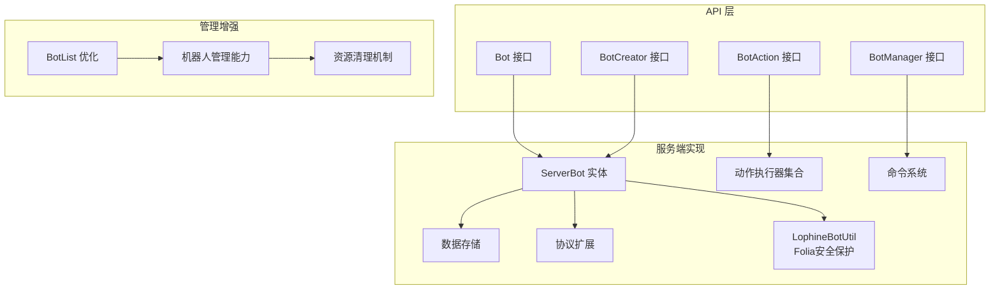
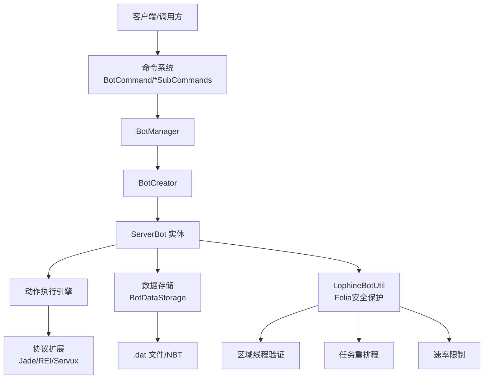
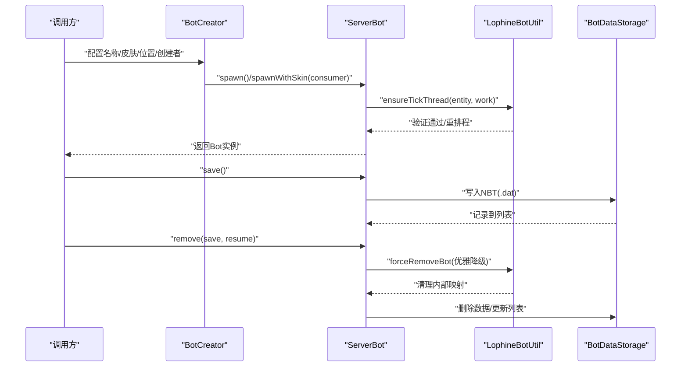
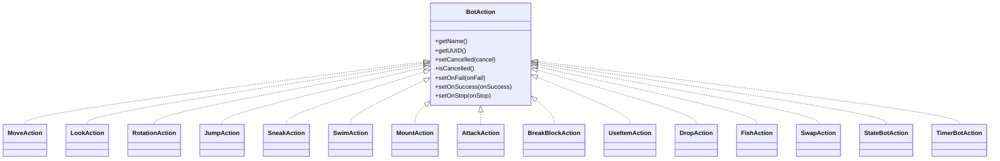
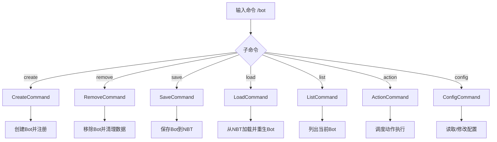
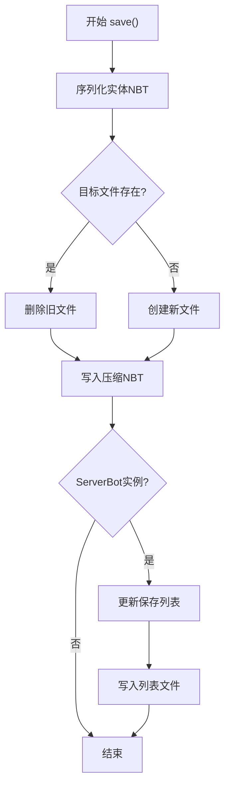
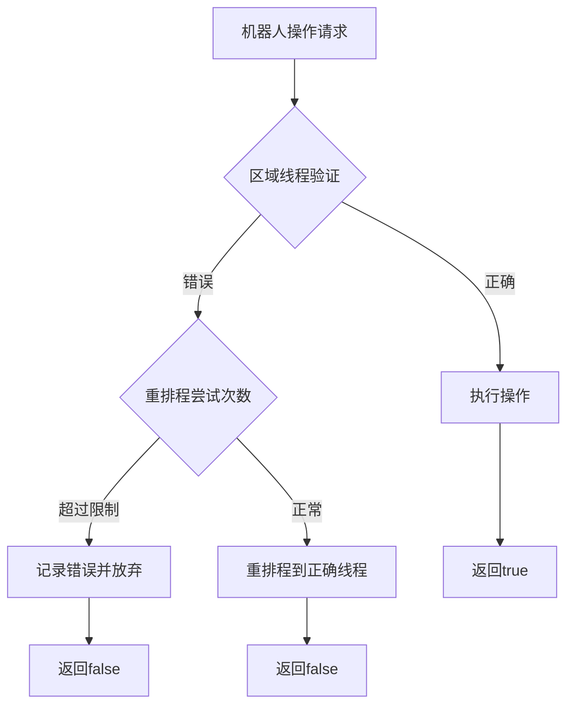
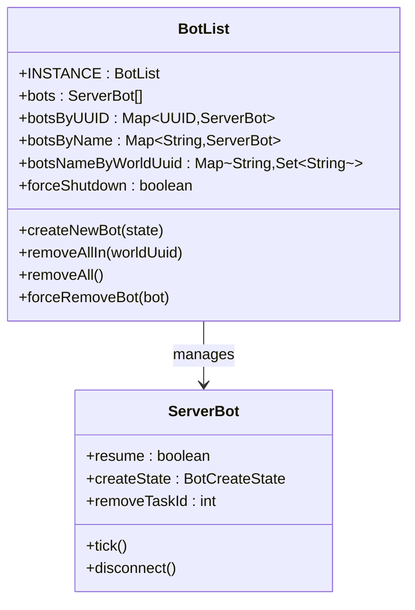
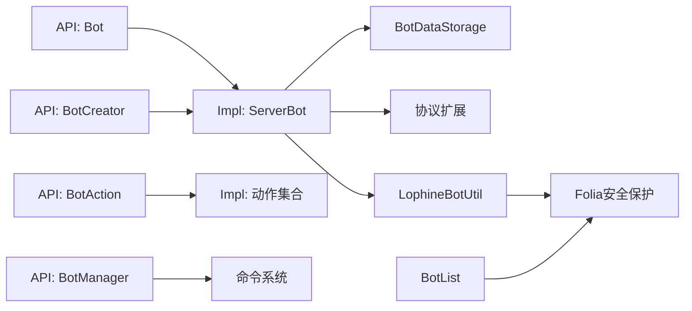

# 机器人系统

<cite>
**本文引用的文件**
- [Bot.java](file://lophine-api/src/main/java/org/leavesmc/leaves/entity/bot/Bot.java)
- [BotCreator.java](file://lophine-api/src/main/java/org/leavesmc/leaves/entity/bot/BotCreator.java)
- [BotManager.java](file://lophine-api/src/main/java/org/leavesmc/leaves/entity/bot/BotManager.java)
- [BotAction.java](file://lophine-api/src/main/java/org/leavesmc/leaves/entity/bot/action/BotAction.java)
- [AttackAction.java](file://lophine-api/src/main/java/org/leavesmc/leaves/entity/bot/action/AttackAction.java)
- [BreakBlockAction.java](file://lophine-api/src/main/java/org/leavesmc/leaves/entity/bot/action/BreakBlockAction.java)
- [DropAction.java](file://lophine-api/src/main/java/org/leavesmc/leaves/entity/bot/action/DropAction.java)
- [FishAction.java](file://lophine-api/src/main/java/org/leavesmc/leaves/entity/bot/action/FishAction.java)
- [JumpAction.java](file://lophine-api/src/main/java/org/leavesmc/leaves/entity/bot/action/JumpAction.java)
- [LookAction.java](file://lophine-api/src/main/java/org/leavesmc/leaves/entity/bot/action/LookAction.java)
- [MountAction.java](file://lophine-api/src/main/java/org/leavesmc/leaves/entity/bot/action/MountAction.java)
- [MoveAction.java](file://lophine-api/src/main/java/org/leavesmc/leaves/entity/bot/action/MoveAction.java)
- [RotationAction.java](file://lophine-api/src/main/java/org/leavesmc/leaves/entity/bot/action/RotationAction.java)
- [SneakAction.java](file://lophine-api/src/main/java/org/leavesmc/leaves/entity/bot/action/SneakAction.java)
- [StateBotAction.java](file://lophine-api/src/main/java/org/leavesmc/leaves/entity/bot/action/StateBotAction.java)
- [SwapAction.java](file://lophine-api/src/main/java/org/leavesmc/leaves/entity/bot/action/SwapAction.java)
- [SwimAction.java](file://lophine-api/src/main/java/org/leavesmc/leaves/entity/bot/action/SwimAction.java)
- [TimerBotAction.java](file://lophine-api/src/main/java/org/leavesmc/leaves/entity/bot/action/TimerBotAction.java)
- [UseItemAction.java](file://lophine-api/src/main/java/org/leavesmc/leaves/entity/bot/action/UseItemAction.java)
- [UseItemAutoAction.java](file://lophine-api/src/main/java/org/leavesmc/leaves/entity/bot/action/UseItemAutoAction.java)
- [UseItemOffhandAction.java](file://lophine-api/src/main/java/org/leavesmc/leaves/entity/bot/action/UseItemOffhandAction.java)
- [UseItemOnAction.java](file://lophine-api/src/main/java/org/leavesmc/leaves/entity/bot/action/UseItemOnAction.java)
- [UseItemOnOffhandAction.java](file://lophine-api/src/main/java/org/leavesmc/leaves/entity/bot/action/UseItemOnOffhandAction.java)
- [UseItemToAction.java](file://lophine-api/src/main/java/org/leavesmc/leaves/entity/bot/action/UseItemToAction.java)
- [UseItemToOffhandAction.java](file://lophine-api/src/main/java/org/leavesmc/leaves/entity/bot/action/UseItemToOffhandAction.java)
- [BotDataStorage.java](file://lophine-server/src/main/java/org/leavesmc/leaves/bot/BotDataStorage.java)
- [ServerBot.java](file://lophine-server/src/main/java/org/leavesmc/leaves/bot/ServerBot.java)
- [ServerBotGameMode.java](file://lophine-server/src/main/java/org/leavesmc/leaves/bot/ServerBotGameMode.java)
- [ServerBotPacketListenerImpl.java](file://lophine-server/src/main/java/org/leavesmc/leaves/bot/ServerBotPacketListenerImpl.java)
- [CraftBot.java](file://lophine-server/src/main/java/org/leavesmc/leaves/entity/bot/CraftBot.java)
- [CraftBotManager.java](file://lophine-server/src/main/java/org/leavesmc/leaves/entity/bot/CraftBotManager.java)
- [BotCommand.java](file://lophine-server/src/main/java/org/leavesmc/leaves/command/bot/BotCommand.java)
- [CreateCommand.java](file://lophine-server/src/main/java/org/leavesmc/leaves/command/bot/subcommands/CreateCommand.java)
- [RemoveCommand.java](file://lophine-server/src/main/java/org/leavesmc/leaves/command/bot/subcommands/RemoveCommand.java)
- [SaveCommand.java](file://lophine-server/src/main/java/org/leavesmc/leaves/command/bot/subcommands/SaveCommand.java)
- [LoadCommand.java](file://lophine-server/src/main/java/org/leavesmc/leaves/command/bot/subcommands/LoadCommand.java)
- [ListCommand.java](file://lophine-server/src/main/java/org/leavesmc/leaves/command/bot/subcommands/ListCommand.java)
- [ActionCommand.java](file://lophine-server/src/main/java/org/leavesmc/leaves/command/bot/subcommands/ActionCommand.java)
- [ConfigCommand.java](file://lophine-server/src/main/java/org/leavesmc/leaves/command/bot/subcommands/ConfigCommand.java)
- [BotArgumentType.java](file://lophine-server/src/main/java/org/leavesmc/leaves/command/arguments/BotArgumentType.java)
- [EnumArgumentType.java](file://lophine-server/src/main/java/org/leavesmc/leaves/command/arguments/EnumArgumentType.java)
- [BotList.java](file://lophine-server/src/main/java/org/leavesmc/leaves/bot/BotList.java)
- [BotStatsCounter.java](file://lophine-server/src/main/java/org/leavesmc/leaves/bot/BotStatsCounter.java)
- [BotUtil.java](file://lophine-server/src/main/java/org/leavesmc/leaves/bot/BotUtil.java)
- [LophineBotUtil.java](file://lophine-server/src/main/java/org/leavesmc/leaves/bot/LophineBotUtil.java)
- [MojangAPI.java](file://lophine-server/src/main/java/org/leavesmc/leaves/bot/MojangAPI.java)
- [LeavesConfig.java](file://lophine-server/src/main/java/org/leavesmc/leaves/LeavesConfig.java)
- [FakeplayerConfig.java](file://lophine-server/src/main/java/fun/bm/lophine/config/modules/function/FakeplayerConfig.java)
- [README.md](file://README.md)
</cite>

## 目录
1. [引言](#引言)
2. [项目结构](#项目结构)
3. [核心组件](#核心组件)
4. [架构总览](#架构总览)
5. [详细组件分析](#详细组件分析)
6. [依赖关系分析](#依赖关系分析)
7. [性能考虑](#性能考虑)
8. [故障排除指南](#故障排除指南)
9. [结论](#结论)
10. [附录](#附录)

## 引言
本技术文档面向Lophine机器人系统，系统以"假人（Bot）"为核心实体，提供从生命周期管理、动作执行引擎到配置与持久化的完整能力。经过重大改进，系统现已具备完善的Folia区域线程安全保护机制，显著提升了在多线程环境下的稳定性和可靠性。文档覆盖以下主题：
- 机器人生命周期：创建、加载、保存、移除与恢复
- 虚拟玩家的创建、管理和控制机制
- 动作系统：移动、交互、物品处理等动作类型及调度
- 状态管理与数据持久化策略
- 命令系统与权限控制
- **新增**：Folia区域线程安全保护与资源管理
- **新增**：机器人管理能力增强与性能优化
- 性能优化与故障排除

## 项目结构
Lophine采用分层与模块化组织方式：
- lophine-api：对外暴露的API接口，定义Bot、BotAction、BotManager等抽象契约
- lophine-server：服务端实现，包含ServerBot、动作执行器、命令系统、协议扩展、数据存储等
- **新增**：LophineBotUtil提供Folia区域线程安全保护
- **新增**：BotList结构优化，增强机器人管理能力
- 协议与插件扩展：支持多种客户端协议（如Jade、REI、Servux等），用于可视化与数据同步
- 配置与兼容：通过LeavesConfig集中管理功能开关与兼容性配置

**图表来源**
- [Bot.java:30-103](file://lophine-api/src/main/java/org/leavesmc/leaves/entity/bot/Bot.java#L30-L103)
- [BotAction.java:31-102](file://lophine-api/src/main/java/org/leavesmc/leaves/entity/bot/action/BotAction.java#L31-L102)
- [BotManager.java:31-65](file://lophine-api/src/main/java/org/leavesmc/leaves/entity/bot/BotManager.java#L31-L65)
- [BotCreator.java:28-69](file://lophine-api/src/main/java/org/leavesmc/leaves/entity/bot/BotCreator.java#L28-L69)
- [ServerBot.java](file://lophine-server/src/main/java/org/leavesmc/leaves/bot/ServerBot.java)
- [BotDataStorage.java:39-156](file://lophine-server/src/main/java/org/leavesmc/leaves/bot/BotDataStorage.java#L39-L156)
- [LophineBotUtil.java:15-32](file://lophine-server/src/main/java/org/leavesmc/leaves/bot/LophineBotUtil.java#L15-L32)
- [BotList.java:63-87](file://lophine-server/src/main/java/org/leavesmc/leaves/bot/BotList.java#L63-L87)

**章节来源**
- [README.md](file://README.md)

## 核心组件
- Bot接口：定义假人的基本属性与行为，包括皮肤名、原始名称、创建者UUID、动作添加与停止、移除等
- BotAction接口：定义动作的生命周期回调（成功、失败、停止）、取消标记与标识
- BotManager接口：提供假人查询、动作实例化、创建器工厂
- BotCreator接口：链式构建假人，支持名称、皮肤、位置、创建者以及异步MoangAPI皮肤设置
- **新增**：LophineBotUtil：提供Folia区域线程安全保护，防止跨区域数据损坏
- **新增**：BotList优化：增强机器人管理能力，支持更精细的资源控制
- 数据存储：基于NBT的假人数据持久化与列表维护

**章节来源**
- [Bot.java:30-103](file://lophine-api/src/main/java/org/leavesmc/leaves/entity/bot/Bot.java#L30-L103)
- [BotAction.java:31-102](file://lophine-api/src/main/java/org/leavesmc/leaves/entity/bot/action/BotAction.java#L31-L102)
- [BotManager.java:31-65](file://lophine-api/src/main/java/org/leavesmc/leaves/entity/bot/BotManager.java#L31-L65)
- [BotCreator.java:28-69](file://lophine-api/src/main/java/org/leavesmc/leaves/entity/bot/BotCreator.java#L28-L69)
- [BotDataStorage.java:39-156](file://lophine-server/src/main/java/org/leavesmc/leaves/bot/BotDataStorage.java#L39-L156)
- [LophineBotUtil.java:33-34](file://lophine-server/src/main/java/org/leavesmc/leaves/bot/LophineBotUtil.java#L33-L34)
- [BotList.java:63-87](file://lophine-server/src/main/java/org/leavesmc/leaves/bot/BotList.java#L63-L87)

## 架构总览
Lophine的运行时架构由"接口契约 + 服务端实现 + 命令与协议扩展 + Folia安全保护"构成。客户端通过命令或API创建Bot，服务端在世界中生成实体并驱动其执行动作；数据通过NBT持久化，支持重启后恢复。**新增的LophineBotUtil确保所有机器人操作都在正确的区域线程上执行，防止跨区域数据损坏。**

**图表来源**
- [BotCommand.java](file://lophine-server/src/main/java/org/leavesmc/leaves/command/bot/BotCommand.java)
- [CreateCommand.java](file://lophine-server/src/main/java/org/leavesmc/leaves/command/bot/subcommands/CreateCommand.java)
- [ServerBot.java](file://lophine-server/src/main/java/org/leavesmc/leaves/bot/ServerBot.java)
- [BotDataStorage.java:39-156](file://lophine-server/src/main/java/org/leavesmc/leaves/bot/BotDataStorage.java#L39-L156)
- [LophineBotUtil.java:47-92](file://lophine-server/src/main/java/org/leavesmc/leaves/bot/LophineBotUtil.java#L47-L92)

## 详细组件分析

### 机器人生命周期管理
- 创建：通过BotCreator链式配置并spawn，支持同步与异步皮肤获取
- 运行：ServerBot持有状态与动作队列，按调度执行
- **增强**：LophineBotUtil确保所有操作在正确的区域线程上执行
- 持久化：save时写入NBT文件，并更新假人列表；load时读取并恢复
- **优化**：BotList提供更精细的资源管理和清理机制
- 移除：remove可选择是否保留恢复标记，支持优雅降级

**图表来源**
- [BotCreator.java:30-68](file://lophine-api/src/main/java/org/leavesmc/leaves/entity/bot/BotCreator.java#L30-L68)
- [BotDataStorage.java:62-90](file://lophine-server/src/main/java/org/leavesmc/leaves/bot/BotDataStorage.java#L62-L90)
- [LophineBotUtil.java:58-92](file://lophine-server/src/main/java/org/leavesmc/leaves/bot/LophineBotUtil.java#L58-L92)
- [BotList.java:285-299](file://lophine-server/src/main/java/org/leavesmc/leaves/bot/BotList.java#L285-L299)

**章节来源**
- [BotCreator.java:28-69](file://lophine-api/src/main/java/org/leavesmc/leaves/entity/bot/BotCreator.java#L28-L69)
- [BotDataStorage.java:39-156](file://lophine-server/src/main/java/org/leavesmc/leaves/bot/BotDataStorage.java#L39-L156)
- [LophineBotUtil.java:33-191](file://lophine-server/src/main/java/org/leavesmc/leaves/bot/LophineBotUtil.java#L33-L191)
- [BotList.java:63-546](file://lophine-server/src/main/java/org/leavesmc/leaves/bot/BotList.java#L63-L546)

### 动作执行引擎
- 动作接口：BotAction定义统一的生命周期回调与取消机制
- 动作类型：涵盖移动、旋转、跳跃、潜行、游泳、挂载、交互、拾取、丢弃、钓鱼、使用物品等
- 执行模型：ServerBot维护动作队列，按优先级与状态推进执行
- **增强**：Folia线程安全保证动作执行的稳定性

**图表来源**
- [BotAction.java:31-102](file://lophine-api/src/main/java/org/leavesmc/leaves/entity/bot/action/BotAction.java#L31-L102)
- [MoveAction.java](file://lophine-api/src/main/java/org/leavesmc/leaves/entity/bot/action/MoveAction.java)
- [LookAction.java](file://lophine-api/src/main/java/org/leavesmc/leaves/entity/bot/action/LookAction.java)
- [RotationAction.java](file://lophine-api/src/main/java/org/leavesmc/leaves/entity/bot/action/RotationAction.java)
- [JumpAction.java](file://lophine-api/src/main/java/org/leavesmc/leaves/entity/bot/action/JumpAction.java)
- [SneakAction.java](file://lophine-api/src/main/java/org/leavesmc/leaves/entity/bot/action/SneakAction.java)
- [SwimAction.java](file://lophine-api/src/main/java/org/leavesmc/leaves/entity/bot/action/SwimAction.java)
- [MountAction.java](file://lophine-api/src/main/java/org/leavesmc/leaves/entity/bot/action/MountAction.java)
- [AttackAction.java](file://lophine-api/src/main/java/org/leavesmc/leaves/entity/bot/action/AttackAction.java)
- [BreakBlockAction.java](file://lophine-api/src/main/java/org/leavesmc/leaves/entity/bot/action/BreakBlockAction.java)
- [UseItemAction.java](file://lophine-api/src/main/java/org/leavesmc/leaves/entity/bot/action/UseItemAction.java)
- [DropAction.java](file://lophine-api/src/main/java/org/leavesmc/leaves/entity/bot/action/DropAction.java)
- [FishAction.java](file://lophine-api/src/main/java/org/leavesmc/leaves/entity/bot/action/FishAction.java)
- [SwapAction.java](file://lophine-api/src/main/java/org/leavesmc/leaves/entity/bot/action/SwapAction.java)
- [StateBotAction.java](file://lophine-api/src/main/java/org/leavesmc/leaves/entity/bot/action/StateBotAction.java)
- [TimerBotAction.java](file://lophine-api/src/main/java/org/leavesmc/leaves/entity/bot/action/TimerBotAction.java)

**章节来源**
- [BotAction.java:31-102](file://lophine-api/src/main/java/org/leavesmc/leaves/entity/bot/action/BotAction.java#L31-L102)

### 配置管理系统
- 配置入口：LeavesConfig集中管理功能开关与兼容项
- 假人相关配置：如模拟距离、跳过睡眠、定位栏、Tick类型等
- **新增**：FakeplayerConfig提供更详细的机器人配置选项
- 命令入口：ConfigCommand提供配置查看与修改

**章节来源**
- [LeavesConfig.java](file://lophine-server/src/main/java/org/leavesmc/leaves/LeavesConfig.java)
- [ConfigCommand.java](file://lophine-server/src/main/java/org/leavesmc/leaves/command/bot/subcommands/ConfigCommand.java)
- [FakeplayerConfig.java:16-111](file://lophine-server/src/main/java/fun/bm/lophine/config/modules/function/FakeplayerConfig.java#L16-L111)

### 命令系统与权限控制
- 命令总入口：BotCommand聚合子命令
- 子命令：Create、Remove、Save、Load、List、Action、Config
- 参数解析：BotArgumentType、EnumArgumentType
- 权限控制：结合服务器权限体系（未在代码中直接体现，建议在插件配置中设置）

**图表来源**
- [BotCommand.java](file://lophine-server/src/main/java/org/leavesmc/leaves/command/bot/BotCommand.java)
- [CreateCommand.java](file://lophine-server/src/main/java/org/leavesmc/leaves/command/bot/subcommands/CreateCommand.java)
- [RemoveCommand.java](file://lophine-server/src/main/java/org/leavesmc/leaves/command/bot/subcommands/RemoveCommand.java)
- [SaveCommand.java](file://lophine-server/src/main/java/org/leavesmc/leaves/command/bot/subcommands/SaveCommand.java)
- [LoadCommand.java](file://lophine-server/src/main/java/org/leavesmc/leaves/command/bot/subcommands/LoadCommand.java)
- [ListCommand.java](file://lophine-server/src/main/java/org/leavesmc/leaves/command/bot/subcommands/ListCommand.java)
- [ActionCommand.java](file://lophine-server/src/main/java/org/leavesmc/leaves/command/bot/subcommands/ActionCommand.java)
- [ConfigCommand.java](file://lophine-server/src/main/java/org/leavesmc/leaves/command/bot/subcommands/ConfigCommand.java)
- [BotArgumentType.java](file://lophine-server/src/main/java/org/leavesmc/leaves/command/arguments/BotArgumentType.java)
- [EnumArgumentType.java](file://lophine-server/src/main/java/org/leavesmc/leaves/command/arguments/EnumArgumentType.java)

**章节来源**
- [BotCommand.java](file://lophine-server/src/main/java/org/leavesmc/leaves/command/bot/BotCommand.java)
- [BotArgumentType.java](file://lophine-server/src/main/java/org/leavesmc/leaves/command/arguments/BotArgumentType.java)
- [EnumArgumentType.java](file://lophine-server/src/main/java/org/leavesmc/leaves/command/arguments/EnumArgumentType.java)

### 状态管理与数据持久化
- 状态字段：包括创建状态、恢复标记、动作队列、配置集等
- **增强**：LophineBotUtil提供速率限制和重排程机制
- **优化**：BotList提供更精细的资源管理和清理机制
- 持久化流程：保存时写入实体NBT与列表；加载时读取并重建状态；移除时清理文件与列表
- **新增**：优雅降级机制，防止服务器关闭时的数据损坏

**图表来源**
- [BotDataStorage.java:62-90](file://lophine-server/src/main/java/org/leavesmc/leaves/bot/BotDataStorage.java#L62-L90)

**章节来源**
- [BotDataStorage.java:39-156](file://lophine-server/src/main/java/org/leavesmc/leaves/bot/BotDataStorage.java#L39-L156)

### 虚拟玩家的创建、管理与控制
- 创建：BotCreator提供链式API，支持名称、皮肤、位置、创建者设置；支持异步MoangAPI皮肤
- 管理：BotManager提供查询、动作实例化与创建器工厂
- 控制：Bot接口提供动作添加/停止、批量停止、移除等控制方法
- **增强**：LophineBotUtil确保创建过程的线程安全性
- **优化**：BotList提供更高效的查找和管理机制

**章节来源**
- [BotCreator.java:28-69](file://lophine-api/src/main/java/org/leavesmc/leaves/entity/bot/BotCreator.java#L28-L69)
- [BotManager.java:31-65](file://lophine-api/src/main/java/org/leavesmc/leaves/entity/bot/BotManager.java#L31-L65)
- [Bot.java:30-103](file://lophine-api/src/main/java/org/leavesmc/leaves/entity/bot/Bot.java#L30-L103)
- [LophineBotUtil.java:58-92](file://lophine-server/src/main/java/org/leavesmc/leaves/bot/LophineBotUtil.java#L58-L92)
- [BotList.java:63-546](file://lophine-server/src/main/java/org/leavesmc/leaves/bot/BotList.java#L63-L546)

### 动作系统实现原理
- 统一接口：所有动作实现BotAction，具备取消与回调
- 类型覆盖：移动、交互、使用物品、丢弃、挂载、潜行、游泳、旋转、攻击、钓鱼、交换等
- 执行顺序：按队列与状态推进，支持定时动作与状态动作
- **增强**：Folia线程安全保证动作执行的稳定性

**章节来源**
- [BotAction.java:31-102](file://lophine-api/src/main/java/org/leavesmc/leaves/entity/bot/action/BotAction.java#L31-L102)
- [MoveAction.java](file://lophine-api/src/main/java/org/leavesmc/leaves/entity/bot/action/MoveAction.java)
- [UseItemAction.java](file://lophine-api/src/main/java/org/leavesmc/leaves/entity/bot/action/UseItemAction.java)
- [DropAction.java](file://lophine-api/src/main/java/org/leavesmc/leaves/entity/bot/action/DropAction.java)
- [MountAction.java](file://lophine-api/src/main/java/org/leavesmc/leaves/entity/bot/action/MountAction.java)
- [AttackAction.java](file://lophine-api/src/main/java/org/leavesmc/leaves/entity/bot/action/AttackAction.java)
- [FishAction.java](file://lophine-api/src/main/java/org/leavesmc/leaves/entity/bot/action/FishAction.java)
- [StateBotAction.java](file://lophine-api/src/main/java/org/leavesmc/leaves/entity/bot/action/StateBotAction.java)
- [TimerBotAction.java](file://lophine-api/src/main/java/org/leavesmc/leaves/entity/bot/action/TimerBotAction.java)

### 协议扩展与可视化
- 支持Jade、REI、Servux、Xaero等协议，用于向客户端展示方块/实体信息、配方与结构放置等
- 通过协议处理器与payload进行数据同步与渲染

**章节来源**
- [ServerBot.java](file://lophine-server/src/main/java/org/leavesmc/leaves/bot/ServerBot.java)

### Folia区域线程安全保护
**新增**：LophineBotUtil提供完整的Folia区域线程安全保护机制，解决多线程环境下的数据一致性问题。

#### 核心功能
- **区域线程验证**：确保机器人操作在正确的区域线程上执行
- **自动重排程**：当检测到跨区域操作时，自动将任务重排程到正确的线程
- **速率限制**：防止重复的跨区域操作导致调度器队列溢出
- **优雅降级**：在服务器关闭或世界卸载时提供安全的清理机制

#### 安全机制
- **重排程追踪器**：跟踪每个实体的重排程尝试次数，超过阈值时阻止进一步重排程
- **滑动窗口计数**：在10秒窗口内限制重排程次数为64次
- **线程匹配警告**：防抖机制，避免日志刷屏
- **世界可用性检查**：在执行操作前检查世界状态，防止NPE

**图表来源**
- [LophineBotUtil.java:58-92](file://lophine-server/src/main/java/org/leavesmc/leaves/bot/LophineBotUtil.java#L58-L92)
- [LophineBotUtil.java:171-189](file://lophine-server/src/main/java/org/leavesmc/leaves/bot/LophineBotUtil.java#L171-L189)

**章节来源**
- [LophineBotUtil.java:15-191](file://lophine-server/src/main/java/org/leavesmc/leaves/bot/LophineBotUtil.java#L15-L191)

### 机器人管理能力增强
**新增**：BotList经过结构优化，提供更强大的机器人管理能力。

#### 主要改进
- **多映射结构**：同时维护UUID、名称和世界UUID的索引映射
- **世界级管理**：支持按世界维度管理机器人，便于批量操作
- **优雅降级**：在服务器关闭时提供安全的清理机制
- **重试机制**：支持多次重试移除操作，防止世界卸载导致的问题

#### 关键特性
- **批量移除**：支持按世界维度批量移除机器人
- **重试清理**：最多重试20次，防止无限循环
- **强制移除**：当区域不可用时的安全清理机制
- **资源跟踪**：精确跟踪机器人在不同世界的分布

**图表来源**
- [BotList.java:63-546](file://lophine-server/src/main/java/org/leavesmc/leaves/bot/BotList.java#L63-L546)
- [ServerBot.java:89-200](file://lophine-server/src/main/java/org/leavesmc/leaves/bot/ServerBot.java#L89-L200)

**章节来源**
- [BotList.java:63-546](file://lophine-server/src/main/java/org/leavesmc/leaves/bot/BotList.java#L63-L546)
- [ServerBot.java:89-786](file://lophine-server/src/main/java/org/leavesmc/leaves/bot/ServerBot.java#L89-L786)

## 依赖关系分析
- API层与服务端实现解耦：通过接口定义契约，便于替换与扩展
- 命令系统依赖BotManager与BotCreator，形成创建—执行—持久化的闭环
- 数据存储依赖NBT与文件系统，保证跨版本兼容与可移植性
- **新增**：LophineBotUtil作为独立的安全保护层，为所有机器人操作提供线程安全保障
- **优化**：BotList提供更精细的管理结构，支持多维度索引和批量操作

**图表来源**
- [Bot.java:30-103](file://lophine-api/src/main/java/org/leavesmc/leaves/entity/bot/Bot.java#L30-L103)
- [BotAction.java:31-102](file://lophine-api/src/main/java/org/leavesmc/leaves/entity/bot/action/BotAction.java#L31-L102)
- [BotManager.java:31-65](file://lophine-api/src/main/java/org/leavesmc/leaves/entity/bot/BotManager.java#L31-L65)
- [BotCreator.java:28-69](file://lophine-api/src/main/java/org/leavesmc/leaves/entity/bot/BotCreator.java#L28-L69)
- [ServerBot.java](file://lophine-server/src/main/java/org/leavesmc/leaves/bot/ServerBot.java)
- [BotDataStorage.java:39-156](file://lophine-server/src/main/java/org/leavesmc/leaves/bot/BotDataStorage.java#L39-L156)
- [LophineBotUtil.java:33-191](file://lophine-server/src/main/java/org/leavesmc/leaves/bot/LophineBotUtil.java#L33-L191)
- [BotList.java:63-546](file://lophine-server/src/main/java/org/leavesmc/leaves/bot/BotList.java#L63-L546)

**章节来源**
- [BotManager.java:31-65](file://lophine-api/src/main/java/org/leavesmc/leaves/entity/bot/BotManager.java#L31-L65)
- [BotCreator.java:28-69](file://lophine-api/src/main/java/org/leavesmc/leaves/entity/bot/BotCreator.java#L28-L69)
- [BotDataStorage.java:39-156](file://lophine-server/src/main/java/org/leavesmc/leaves/bot/BotDataStorage.java#L39-L156)
- [LophineBotUtil.java:33-191](file://lophine-server/src/main/java/org/leavesmc/leaves/bot/LophineBotUtil.java#L33-L191)
- [BotList.java:63-546](file://lophine-server/src/main/java/org/leavesmc/leaves/bot/BotList.java#L63-L546)

## 性能考虑
- 动作调度：合理安排动作队列长度与优先级，避免频繁切换导致的抖动
- 协议开销：仅在需要时启用协议扩展，减少不必要的payload传输
- I/O优化：批量保存/加载，避免频繁小文件写入；对异常情况做快速失败与重试策略
- 内存与GC：注意NBT序列化/反序列化的内存占用，必要时进行对象池化或复用
- 并发安全：确保多线程环境下对Bot状态与动作队列的访问一致性
- **新增**：LophineBotUtil的速率限制机制防止调度器队列溢出
- **新增**：优雅降级机制避免服务器关闭时的资源泄漏
- **优化**：BotList的多映射结构提升查找效率

## 故障排除指南
- 假人无法保存/加载
  - 检查数据目录权限与磁盘空间
  - 查看日志中的NBT读写异常
  - 确认UUID文件命名与列表记录一致
- 皮肤异步加载失败
  - 确认网络可达性与MojangAPI可用性
  - 检查异步回调是否正确传递
- 动作不生效
  - 检查动作是否被取消或队列阻塞
  - 确认坐标/朝向/交互目标有效
- 命令无响应
  - 检查权限配置与命令注册
  - 确认参数解析是否正确
- **新增**：Folia线程安全问题
  - 检查LophineBotUtil的日志输出，确认是否有重排程警告
  - 验证机器人操作是否在正确的区域线程上执行
  - 查看速率限制触发日志，避免过度重排程
- **新增**：服务器关闭时的机器人清理
  - 观察forceShutdown标志，确认是否触发了优雅降级
  - 检查BotList的清理机制，确保资源得到正确释放

**章节来源**
- [BotDataStorage.java:77-80](file://lophine-server/src/main/java/org/leavesmc/leaves/bot/BotDataStorage.java#L77-L80)
- [BotDataStorage.java:117-120](file://lophine-server/src/main/java/org/leavesmc/leaves/bot/BotDataStorage.java#L117-L120)
- [MojangAPI.java](file://lophine-server/src/main/java/org/leavesmc/leaves/bot/MojangAPI.java)
- [LophineBotUtil.java:75-80](file://lophine-server/src/main/java/org/leavesmc/leaves/bot/LophineBotUtil.java#L75-L80)
- [BotList.java:425-433](file://lophine-server/src/main/java/org/leavesmc/leaves/bot/BotList.java#L425-L433)

## 结论
Lophine机器人系统经过重大改进，现已具备完善的Folia区域线程安全保护机制和增强的机器人管理能力。通过LophineBotUtil提供的线程安全保障，系统能够在复杂的多线程环境下保持稳定运行；通过BotList的结构优化，提供了更精细的机器人管理功能。这些改进使得Lophine能够更好地适应现代服务器架构的需求，在保证功能完整性的同时，显著提升了系统的可靠性和性能表现。

## 附录
- 开发示例与API使用建议
  - 使用BotCreator链式配置创建Bot，必要时使用异步皮肤加载
  - 通过BotManager获取Bot实例并添加动作，注意动作取消与回调
  - 使用命令系统进行生命周期管理与配置调整
  - 对重要操作进行异常捕获与日志记录
  - **新增**：利用LophineBotUtil确保所有机器人操作在线程安全的环境中执行
  - **新增**：利用BotList的多映射结构进行高效的机器人管理
  - **新增**：在服务器关闭时依赖BotList的优雅降级机制确保资源正确清理