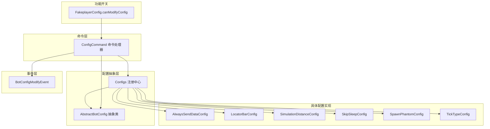
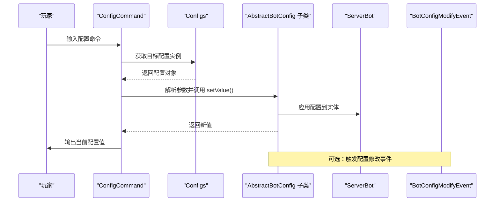
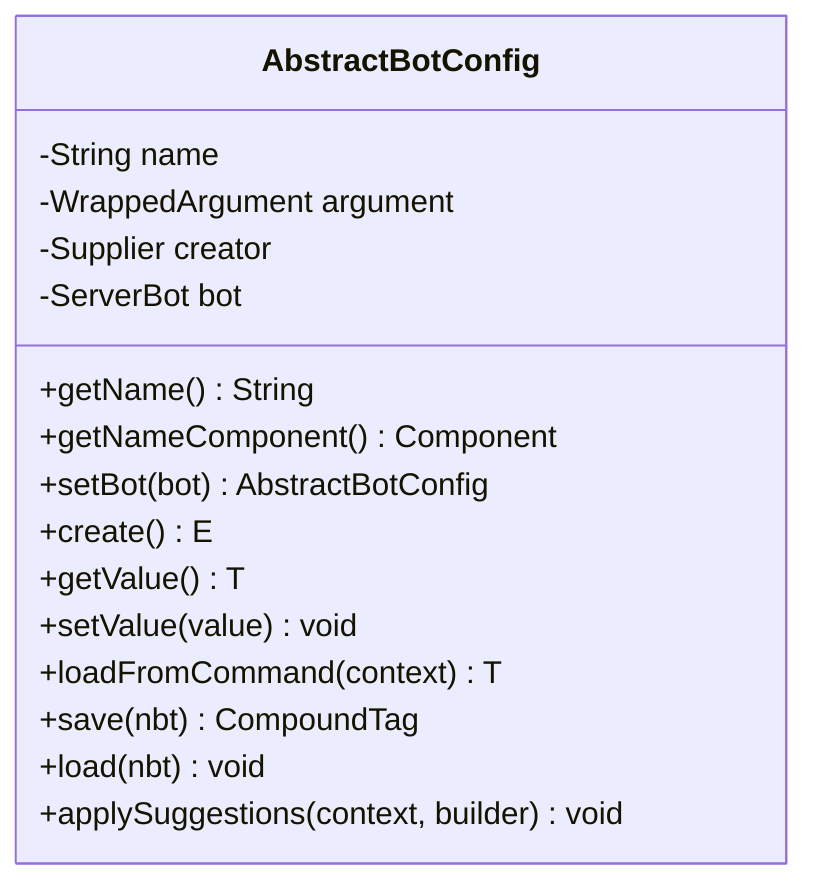
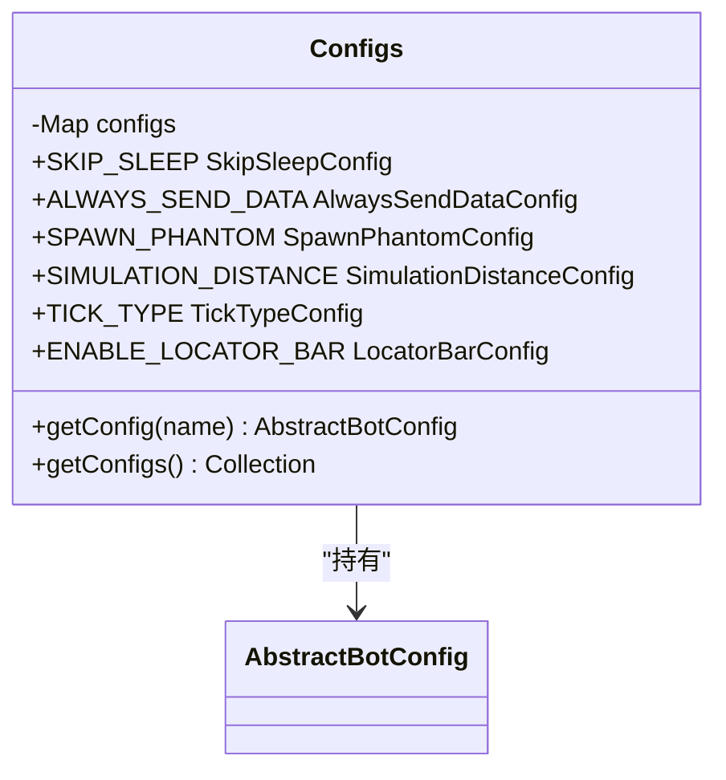
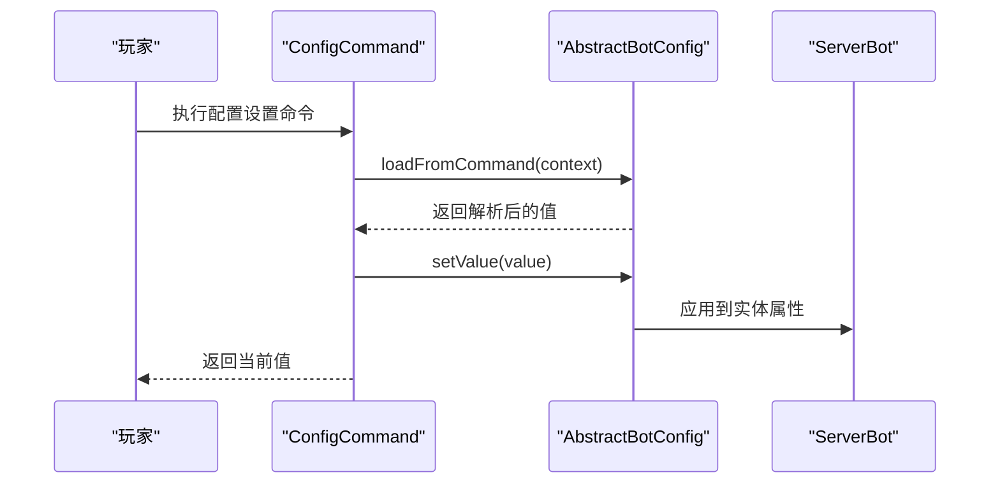
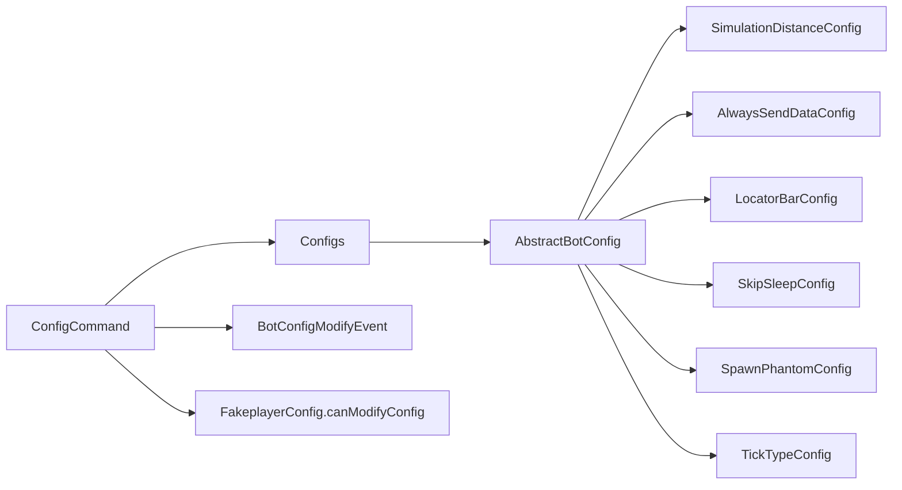

# 机器人配置系统

<cite>
**本文引用的文件**
- [AbstractBotConfig.java](file://lophine-server/src/main/java/org/leavesmc/leaves/bot/agent/configs/AbstractBotConfig.java)
- [Configs.java](file://lophine-server/src/main/java/org/leavesmc/leaves/bot/agent/Configs.java)
- [AlwaysSendDataConfig.java](file://lophine-server/src/main/java/org/leavesmc/leaves/bot/agent/configs/AlwaysSendDataConfig.java)
- [LocatorBarConfig.java](file://lophine-server/src/main/java/org/leavesmc/leaves/bot/agent/configs/LocatorBarConfig.java)
- [SimulationDistanceConfig.java](file://lophine-server/src/main/java/org/leavesmc/leaves/bot/agent/configs/SimulationDistanceConfig.java)
- [SkipSleepConfig.java](file://lophine-server/src/main/java/org/leavesmc/leaves/bot/agent/configs/SkipSleepConfig.java)
- [SpawnPhantomConfig.java](file://lophine-server/src/main/java/org/leavesmc/leaves/bot/agent/configs/SpawnPhantomConfig.java)
- [TickTypeConfig.java](file://lophine-server/src/main/java/org/leavesmc/leaves/bot/agent/configs/TickTypeConfig.java)
- [ConfigCommand.java](file://lophine-server/src/main/java/org/leavesmc/leaves/command/bot/subcommands/ConfigCommand.java)
- [BotConfigModifyEvent.java](file://lophine-api/src/main/java/org/leavesmc/leaves/event/bot/BotConfigModifyEvent.java)
- [FakeplayerConfig.java](file://lophine-server/src/main/java/fun/bm/lophine/config/modules/function/FakeplayerConfig.java)
</cite>

## 目录
1. [简介](#简介)
2. [项目结构](#项目结构)
3. [核心组件](#核心组件)
4. [架构总览](#架构总览)
5. [详细组件分析](#详细组件分析)
6. [依赖关系分析](#依赖关系分析)
7. [性能考量](#性能考量)
8. [故障排查指南](#故障排查指南)
9. [结论](#结论)
10. [附录](#附录)

## 简介
本文件面向Lophine机器人的配置系统，系统以“抽象配置类 + 具体配置实现”的方式组织，支持通过命令行动态修改配置，并在服务器端即时生效。配置项涵盖机器人行为与表现层的关键参数，如数据发送策略、定位栏开关、模拟距离、睡眠跳过、幽灵生成以及刻类型等。本文将从架构设计、数据流、验证与默认值处理、动态修改机制、扩展指南到最佳实践进行系统化说明。

## 项目结构
机器人配置系统主要位于以下模块与包中：
- 配置抽象与注册：lophine-server/org/leavesmc/leaves/bot/agent/configs 与 Configs.java
- 命令入口：lophine-server/org/leavesmc/leaves/command/bot/subcommands/ConfigCommand.java
- 事件定义：lophine-api/org/leavesmc/leaves/event/bot/BotConfigModifyEvent.java
- 功能开关：lophine-server/fun/bm/lophine/config/modules/function/FakeplayerConfig.java

图表来源
- [Configs.java:33-59](file://lophine-server/src/main/java/org/leavesmc/leaves/bot/agent/Configs.java#L33-L59)
- [AbstractBotConfig.java:37-78](file://lophine-server/src/main/java/org/leavesmc/leaves/bot/agent/configs/AbstractBotConfig.java#L37-L78)
- [ConfigCommand.java:47-149](file://lophine-server/src/main/java/org/leavesmc/leaves/command/bot/subcommands/ConfigCommand.java#L47-L149)
- [BotConfigModifyEvent.java:26-70](file://lophine-api/src/main/java/org/leavesmc/leaves/event/bot/BotConfigModifyEvent.java#L26-L70)
- [FakeplayerConfig.java](file://lophine-server/src/main/java/fun/bm/lophine/config/modules/function/FakeplayerConfig.java)

章节来源
- [Configs.java:33-59](file://lophine-server/src/main/java/org/leavesmc/leaves/bot/agent/Configs.java#L33-L59)
- [ConfigCommand.java:47-149](file://lophine-server/src/main/java/org/leavesmc/leaves/command/bot/subcommands/ConfigCommand.java#L47-L149)

## 核心组件
- 抽象配置类 AbstractBotConfig：定义配置名称、参数类型包装、命令参数构建、建议值提供、值读取/写入接口、序列化保存/加载等通用能力。
- 注册中心 Configs：集中注册所有具体配置实例，提供按名称检索与遍历集合的能力。
- 具体配置实现：如 AlwaysSendDataConfig、LocatorBarConfig、SimulationDistanceConfig、SkipSleepConfig、SpawnPhantomConfig、TickTypeConfig 等，分别对应不同维度的配置项。
- 命令处理器 ConfigCommand：提供命令行查询与设置配置的能力，支持参数自动补全与错误处理。
- 事件 BotConfigModifyEvent：在配置修改时触发，允许监听者取消或响应配置变更。
- 功能开关 FakeplayerConfig.canModifyConfig：控制是否允许通过命令修改配置。

章节来源
- [AbstractBotConfig.java:37-78](file://lophine-server/src/main/java/org/leavesmc/leaves/bot/agent/configs/AbstractBotConfig.java#L37-L78)
- [Configs.java:33-59](file://lophine-server/src/main/java/org/leavesmc/leaves/bot/agent/Configs.java#L33-L59)
- [ConfigCommand.java:47-149](file://lophine-server/src/main/java/org/leavesmc/leaves/command/bot/subcommands/ConfigCommand.java#L47-L149)
- [BotConfigModifyEvent.java:26-70](file://lophine-api/src/main/java/org/leavesmc/leaves/event/bot/BotConfigModifyEvent.java#L26-L70)
- [FakeplayerConfig.java](file://lophine-server/src/main/java/fun/bm/lophine/config/modules/function/FakeplayerConfig.java)

## 架构总览
配置系统采用“命令驱动 + 抽象配置 + 事件通知”的分层架构：
- 命令层负责用户交互与参数解析；
- 抽象层统一配置的读写与校验；
- 注册中心集中管理配置生命周期；
- 事件层提供可插拔的变更通知与拦截能力；
- 功能开关控制命令可用性。

图表来源
- [ConfigCommand.java:104-147](file://lophine-server/src/main/java/org/leavesmc/leaves/command/bot/subcommands/ConfigCommand.java#L104-L147)
- [AbstractBotConfig.java:66-70](file://lophine-server/src/main/java/org/leavesmc/leaves/bot/agent/configs/AbstractBotConfig.java#L66-L70)
- [BotConfigModifyEvent.java:35-40](file://lophine-api/src/main/java/org/leavesmc/leaves/event/bot/BotConfigModifyEvent.java#L35-L40)

## 详细组件分析

### 抽象配置类 AbstractBotConfig
- 职责：封装配置名称、参数类型包装、命令参数构建、建议值提供、值读取/写入接口、序列化保存/加载等。
- 关键点：
  - 参数类型包装与建议值注入，确保命令行输入体验一致。
  - setValue 抛出异常用于命令层捕获非法输入。
  - getValue/setValue 由子类覆盖，实现对具体实体属性的读写。
  - save/load 支持将配置持久化到NBT标签。

图表来源
- [AbstractBotConfig.java:37-78](file://lophine-server/src/main/java/org/leavesmc/leaves/bot/agent/configs/AbstractBotConfig.java#L37-L78)

章节来源
- [AbstractBotConfig.java:37-78](file://lophine-server/src/main/java/org/leavesmc/leaves/bot/agent/configs/AbstractBotConfig.java#L37-L78)

### 注册中心 Configs
- 职责：集中注册所有配置实例，提供按名称检索与遍历集合的能力。
- 关键点：
  - 使用静态字段声明具体配置实例，便于全局访问。
  - 提供 getConfigs() 与 getConfig(name) 以支持命令与事件层查找。

图表来源
- [Configs.java:33-59](file://lophine-server/src/main/java/org/leavesmc/leaves/bot/agent/Configs.java#L33-L59)

章节来源
- [Configs.java:33-59](file://lophine-server/src/main/java/org/leavesmc/leaves/bot/agent/Configs.java#L33-L59)

### 具体配置实现概览
- AlwaysSendDataConfig：控制机器人是否总是发送数据（布尔型）。
- LocatorBarConfig：控制是否启用定位栏（布尔型）。
- SimulationDistanceConfig：控制机器人模拟距离（整数型，带范围建议）。
- SkipSleepConfig：控制机器人是否跳过睡眠（布尔型）。
- SpawnPhantomConfig：控制是否生成幻翼（布尔型）。
- TickTypeConfig：控制刻类型（枚举/字符串型，带预设建议）。

章节来源
- [AlwaysSendDataConfig.java](file://lophine-server/src/main/java/org/leavesmc/leaves/bot/agent/configs/AlwaysSendDataConfig.java)
- [LocatorBarConfig.java](file://lophine-server/src/main/java/org/leavesmc/leaves/bot/agent/configs/LocatorBarConfig.java)
- [SimulationDistanceConfig.java:32-73](file://lophine-server/src/main/java/org/leavesmc/leaves/bot/agent/configs/SimulationDistanceConfig.java#L32-L73)
- [SkipSleepConfig.java](file://lophine-server/src/main/java/org/leavesmc/leaves/bot/agent/configs/SkipSleepConfig.java)
- [SpawnPhantomConfig.java](file://lophine-server/src/main/java/org/leavesmc/leaves/bot/agent/configs/SpawnPhantomConfig.java)
- [TickTypeConfig.java](file://lophine-server/src/main/java/org/leavesmc/leaves/bot/agent/configs/TickTypeConfig.java)

### 命令流程与动态修改机制
- 命令入口：ConfigCommand 作为 bot 子命令，支持列出所有配置、查看单个配置、设置单个配置。
- 动态修改：执行设置时，命令层调用配置对象的 setValue 并应用到 ServerBot 实体；若参数类型不匹配，抛出未知参数异常。
- 实时生效：配置写入后立即反映在实体状态上，命令返回当前值以确认生效。

图表来源
- [ConfigCommand.java:104-147](file://lophine-server/src/main/java/org/leavesmc/leaves/command/bot/subcommands/ConfigCommand.java#L104-L147)
- [AbstractBotConfig.java:66-70](file://lophine-server/src/main/java/org/leavesmc/leaves/bot/agent/configs/AbstractBotConfig.java#L66-L70)

章节来源
- [ConfigCommand.java:47-149](file://lophine-server/src/main/java/org/leavesmc/leaves/command/bot/subcommands/ConfigCommand.java#L47-L149)

### 验证与默认值处理
- 参数验证：命令层通过 WrappedArgument 的参数类型与建议值进行约束；当类型不匹配时抛出异常，避免非法值进入配置。
- 默认值处理：AbstractBotConfig 提供 save/load 接口，具体配置实现可在 load 中指定默认值；未显式加载时使用默认值。
- 建议值：部分配置（如 SimulationDistanceConfig）在 applySuggestions 中提供常用建议值，提升用户体验。

章节来源
- [AbstractBotConfig.java:47-55](file://lophine-server/src/main/java/org/leavesmc/leaves/bot/agent/configs/AbstractBotConfig.java#L47-L55)
- [SimulationDistanceConfig.java:38-45](file://lophine-server/src/main/java/org/leavesmc/leaves/bot/agent/configs/SimulationDistanceConfig.java#L38-L45)

### 事件与权限控制
- 事件：BotConfigModifyEvent 在配置修改时触发，监听者可取消变更或记录日志。
- 权限：FakeplayerConfig.canModifyConfig 控制是否允许通过命令修改配置，防止误操作或越权修改。

章节来源
- [BotConfigModifyEvent.java:26-70](file://lophine-api/src/main/java/org/leavesmc/leaves/event/bot/BotConfigModifyEvent.java#L26-L70)
- [ConfigCommand.java:54-57](file://lophine-server/src/main/java/org/leavesmc/leaves/command/bot/subcommands/ConfigCommand.java#L54-L57)
- [FakeplayerConfig.java](file://lophine-server/src/main/java/fun/bm/lophine/config/modules/function/FakeplayerConfig.java)

## 依赖关系分析
- 组件耦合：
  - ConfigCommand 依赖 Configs 与 AbstractBotConfig，形成“命令-配置”解耦。
  - 具体配置实现依赖 ServerBot 实体属性，耦合度低，便于替换。
  - 事件层与配置层松耦合，通过事件名与值传递进行通信。
- 外部依赖：
  - 命令框架（Mojang Brigadier）用于参数解析与自动补全。
  - NBT 序列化用于持久化存储。

图表来源
- [ConfigCommand.java:47-149](file://lophine-server/src/main/java/org/leavesmc/leaves/command/bot/subcommands/ConfigCommand.java#L47-L149)
- [Configs.java:33-59](file://lophine-server/src/main/java/org/leavesmc/leaves/bot/agent/Configs.java#L33-L59)
- [AbstractBotConfig.java:37-78](file://lophine-server/src/main/java/org/leavesmc/leaves/bot/agent/configs/AbstractBotConfig.java#L37-L78)
- [BotConfigModifyEvent.java:26-70](file://lophine-api/src/main/java/org/leavesmc/leaves/event/bot/BotConfigModifyEvent.java#L26-L70)
- [FakeplayerConfig.java](file://lophine-server/src/main/java/fun/bm/lophine/config/modules/function/FakeplayerConfig.java)

## 性能考量
- 命令解析与建议值：建议在 applySuggestions 中仅提供常用值，减少补全计算开销。
- 实时应用：配置修改直接作用于实体属性，应避免频繁高频修改导致的瞬时抖动。
- 事件监听：谨慎监听 BotConfigModifyEvent，避免在热路径中执行重任务。

## 故障排查指南
- 设置失败（未知参数）：检查命令参数类型与配置期望类型是否一致；查看命令提示与建议值。
- 修改无效果：确认 FakeplayerConfig.canModifyConfig 是否开启；检查事件监听是否取消了变更。
- 配置未持久化：确认 save/load 实现是否正确调用父类方法并写入/读取 NBT 键。

章节来源
- [ConfigCommand.java:130-147](file://lophine-server/src/main/java/org/leavesmc/leaves/command/bot/subcommands/ConfigCommand.java#L130-L147)
- [BotConfigModifyEvent.java:56-64](file://lophine-api/src/main/java/org/leavesmc/leaves/event/bot/BotConfigModifyEvent.java#L56-L64)

## 结论
该配置系统以抽象配置类为核心，结合注册中心、命令层与事件层，实现了高内聚、低耦合且易于扩展的配置管理方案。通过命令行即可动态调整机器人行为，满足多样化的部署与运维需求。建议在新增配置时遵循现有模式，确保参数验证、建议值与持久化的一致性。

## 附录

### 配置项分类与作用
- 行为控制类
  - AlwaysSendDataConfig：决定是否强制发送数据，影响网络传输与同步频率。
  - SkipSleepConfig：控制机器人是否跳过睡眠阶段，影响昼夜循环与行为节奏。
  - SpawnPhantomConfig：控制是否生成幻翼，影响夜间环境与安全策略。
- 显示与交互类
  - LocatorBarConfig：控制是否显示定位栏，影响信息可见性与界面整洁度。
- 运行与性能类
  - SimulationDistanceConfig：控制机器人所在区块的模拟距离，影响性能与行为延迟。
  - TickTypeConfig：控制刻类型，影响行为调度与性能特征。

章节来源
- [AlwaysSendDataConfig.java](file://lophine-server/src/main/java/org/leavesmc/leaves/bot/agent/configs/AlwaysSendDataConfig.java)
- [LocatorBarConfig.java](file://lophine-server/src/main/java/org/leavesmc/leaves/bot/agent/configs/LocatorBarConfig.java)
- [SimulationDistanceConfig.java:32-73](file://lophine-server/src/main/java/org/leavesmc/leaves/bot/agent/configs/SimulationDistanceConfig.java#L32-L73)
- [SkipSleepConfig.java](file://lophine-server/src/main/java/org/leavesmc/leaves/bot/agent/configs/SkipSleepConfig.java)
- [SpawnPhantomConfig.java](file://lophine-server/src/main/java/org/leavesmc/leaves/bot/agent/configs/SpawnPhantomConfig.java)
- [TickTypeConfig.java](file://lophine-server/src/main/java/org/leavesmc/leaves/bot/agent/configs/TickTypeConfig.java)

### 动态修改流程与实时生效策略
- 流程要点：命令解析 → 类型校验 → setValue 应用 → 返回当前值确认。
- 实时生效：配置写入即刻反映在实体状态，适用于大多数布尔与数值型配置。

章节来源
- [ConfigCommand.java:104-147](file://lophine-server/src/main/java/org/leavesmc/leaves/command/bot/subcommands/ConfigCommand.java#L104-L147)
- [AbstractBotConfig.java:66-70](file://lophine-server/src/main/java/org/leavesmc/leaves/bot/agent/configs/AbstractBotConfig.java#L66-L70)

### 配置验证与默认值处理逻辑
- 验证：通过参数类型与建议值限制输入范围；非法输入抛出异常。
- 默认值：在 load 中提供默认值；未提供时使用类型默认值。

章节来源
- [AbstractBotConfig.java:47-55](file://lophine-server/src/main/java/org/leavesmc/leaves/bot/agent/configs/AbstractBotConfig.java#L47-L55)
- [SimulationDistanceConfig.java:70-73](file://lophine-server/src/main/java/org/leavesmc/leaves/bot/agent/configs/SimulationDistanceConfig.java#L70-L73)

### 扩展指南：添加新的配置选项
- 步骤
  - 新建配置类继承 AbstractBotConfig，实现 getValue/setValue/loadFromCommand/save/load。
  - 在 applySuggestions 中提供常用建议值（可选）。
  - 在 Configs 中注册新配置实例。
  - 在 ConfigCommand 中自动发现并暴露命令节点（无需额外代码）。
  - 如需拦截或记录变更，在 BotConfigModifyEvent 上注册监听器。
- 注意事项
  - 保持 setValue 的幂等性与线程安全。
  - 对于复杂类型，确保 save/load 与命令参数解析一致。
  - 合理设置建议值，避免过多或过少影响易用性。

章节来源
- [AbstractBotConfig.java:37-78](file://lophine-server/src/main/java/org/leavesmc/leaves/bot/agent/configs/AbstractBotConfig.java#L37-L78)
- [Configs.java:33-59](file://lophine-server/src/main/java/org/leavesmc/leaves/bot/agent/Configs.java#L33-L59)
- [ConfigCommand.java:63-69](file://lophine-server/src/main/java/org/leavesmc/leaves/command/bot/subcommands/ConfigCommand.java#L63-L69)

### 配置文件格式说明与最佳实践
- 文件格式
  - 配置持久化基于 NBT 标签，键名为配置名称，值为对应类型的数值或字符串。
- 最佳实践
  - 为每个配置提供合理的默认值与建议值。
  - 对于影响性能的配置（如模拟距离），建议提供性能对比与推荐值。
  - 对于可能引发安全问题的配置（如 AlwaysSendData），建议配合权限控制。
  - 记录配置变更历史，便于回溯与审计。

章节来源
- [SimulationDistanceConfig.java:64-73](file://lophine-server/src/main/java/org/leavesmc/leaves/bot/agent/configs/SimulationDistanceConfig.java#L64-L73)
- [AbstractBotConfig.java:66-70](file://lophine-server/src/main/java/org/leavesmc/leaves/bot/agent/configs/AbstractBotConfig.java#L66-L70)

### 具体配置示例与常见场景
- 示例一：设置模拟距离
  - 命令：/bot <bot> config simulation_distance <值>
  - 建议值：2、8、12、16、32
- 示例二：启用定位栏
  - 命令：/bot <bot> config enable_locator_bar true
- 示例三：跳过睡眠
  - 命令：/bot <bot> config skip_sleep true
- 场景一：高负载服务器
  - 将 simulation_distance 调低，减少实体更新压力。
- 场景二：需要精确追踪
  - 启用 locator_bar，便于在界面中观察机器人位置。
- 场景三：自动化脚本
  - 使用 always_send_data 保证数据一致性，避免因网络丢包导致的状态偏差。

章节来源
- [ConfigCommand.java:76-93](file://lophine-server/src/main/java/org/leavesmc/leaves/command/bot/subcommands/ConfigCommand.java#L76-L93)
- [SimulationDistanceConfig.java:38-45](file://lophine-server/src/main/java/org/leavesmc/leaves/bot/agent/configs/SimulationDistanceConfig.java#L38-L45)