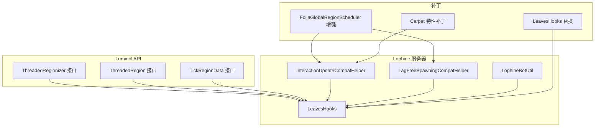
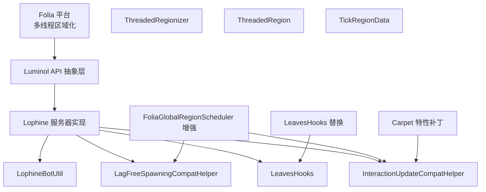
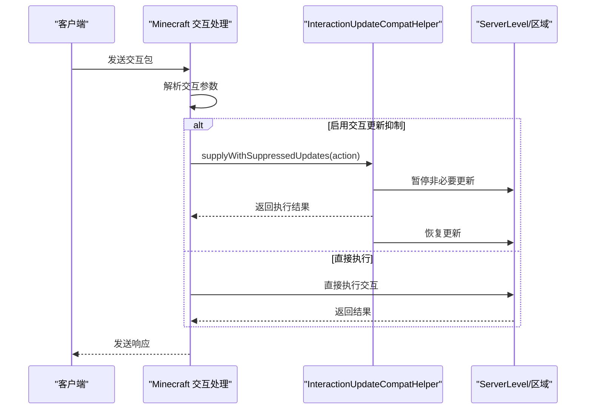
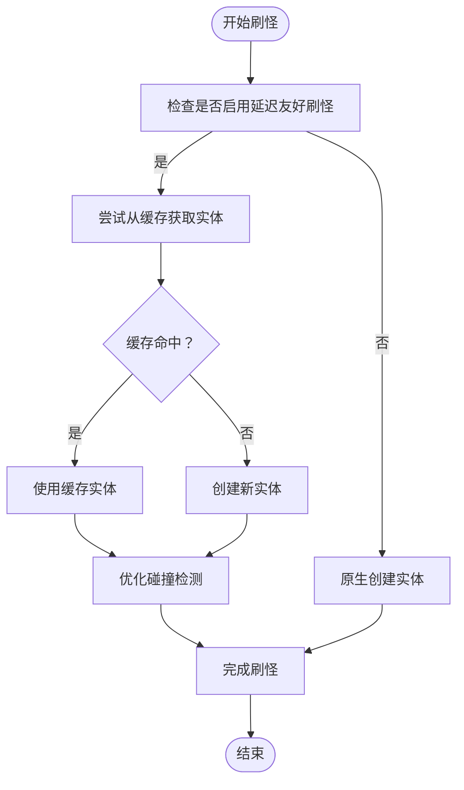
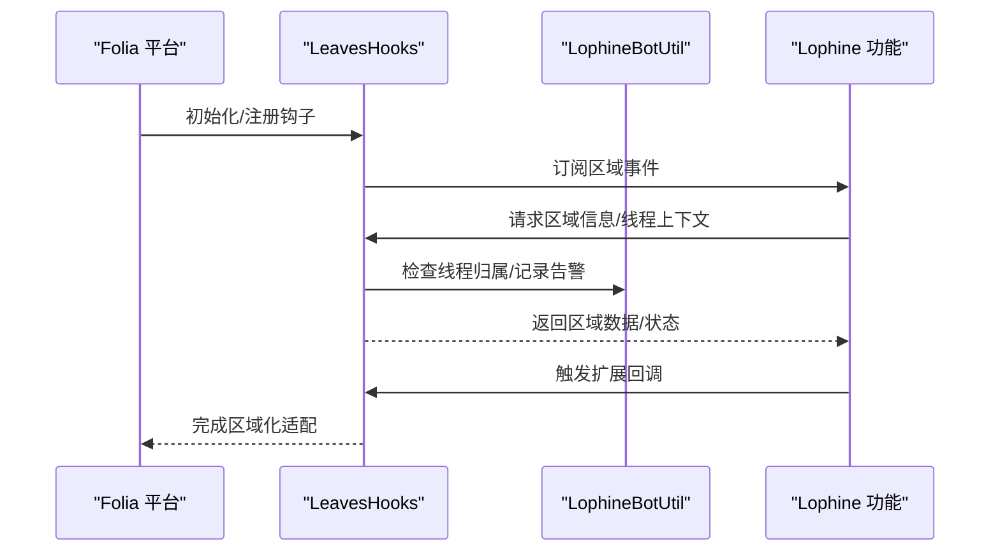
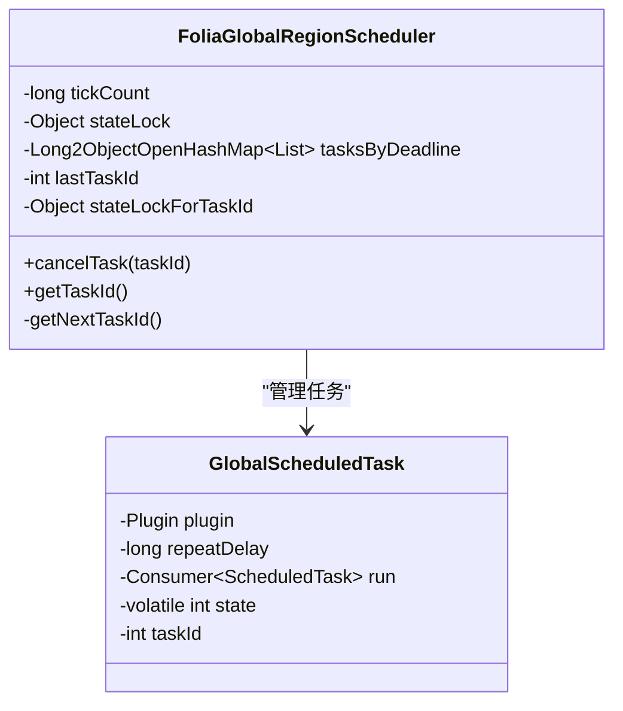
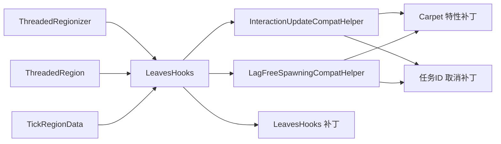

# Folia兼容性架构

<cite>
**本文档引用的文件**
- [ThreadedRegionizer.java](file://luminol-api/src/main/java/me/earthme/luminol/api/ThreadedRegionizer.java)
- [ThreadedRegion.java](file://luminol-api/src/main/java/me/earthme/luminol/api/ThreadedRegion.java)
- [TickRegionData.java](file://luminol-api/src/main/java/me/earthme/luminol/api/TickRegionData.java)
- [InteractionUpdateCompatHelper.java](file://lophine-server/src/main/java/fun/bm/lophine/carpet/InteractionUpdateCompatHelper.java)
- [LagFreeSpawningCompatHelper.java](file://lophine-server/src/main/java/fun/bm/lophine/carpet/LagFreeSpawningCompatHelper.java)
- [LeavesHooks.java](file://lophine-server/src/main/java/org/leavesmc/leaves/region/LeavesHooks.java)
- [LophineBotUtil.java](file://lophine-server/src/main/java/org/leavesmc/leaves/bot/LophineBotUtil.java)
- [FoliaGlobalRegionScheduler.java](file://lophine-server/paper-patches/features/0005-Add-cancel-task-by-task-id-in-FoliaGlobalRegionSched.patch)
- [0044-Carpet-features.patch](file://lophine-server/minecraft-patches/features/0044-Carpet-features.patch)
- [0004-LeavesHooks.patch](file://lophine-server/paper-patches/features/0004-LeavesHooks.patch)
</cite>

## 目录
1. [引言](#引言)
2. [项目结构](#项目结构)
3. [核心组件](#核心组件)
4. [架构总览](#架构总览)
5. [详细组件分析](#详细组件分析)
6. [依赖关系分析](#依赖关系分析)
7. [性能考量](#性能考量)
8. [故障排除指南](#故障排除指南)
9. [结论](#结论)

## 引言
本文件系统性阐述Lophine在Folia平台上的兼容性架构设计与实现。Folia采用多线程区域化（Threaded Regions）架构，将世界划分为多个独立的“tick区域”，每个区域由专用线程负责其逻辑更新，从而提升并发性能并降低锁竞争。Lophine通过引入区域化感知的兼容性助手、区域钩子扩展点以及任务调度增强，实现了对Folia特性的无缝适配，并在交互更新抑制、延迟友好刷怪、线程安全与资源管理等方面提供了针对性优化。

## 项目结构
围绕Folia兼容性，Lophine的关键模块分布于以下位置：
- luminol-api：提供Folia区域化抽象接口（ThreadedRegionizer、ThreadedRegion、TickRegionData），作为跨版本兼容的基础层。
- lophine-server：实现具体的兼容性逻辑与扩展点，包括InteractionUpdateCompatHelper、LagFreeSpawningCompatHelper、LeavesHooks等。
- paper-patches与minecraft-patches：对Paper与Minecraft原生代码进行小范围补丁，以支持任务按ID取消、替换平台钩子等能力。

**图表来源**
- [ThreadedRegionizer.java:1-61](file://luminol-api/src/main/java/me/earthme/luminol/api/ThreadedRegionizer.java#L1-L61)
- [ThreadedRegion.java:1-39](file://luminol-api/src/main/java/me/earthme/luminol/api/ThreadedRegion.java#L1-L39)
- [InteractionUpdateCompatHelper.java](file://lophine-server/src/main/java/fun/bm/lophine/carpet/InteractionUpdateCompatHelper.java)
- [LagFreeSpawningCompatHelper.java](file://lophine-server/src/main/java/fun/bm/lophine/carpet/LagFreeSpawningCompatHelper.java)
- [LeavesHooks.java](file://lophine-server/src/main/java/org/leavesmc/leaves/region/LeavesHooks.java)
- [FoliaGlobalRegionScheduler.java:1-101](file://lophine-server/paper-patches/features/0005-Add-cancel-task-by-task-id-in-FoliaGlobalRegionSched.patch#L1-L101)
- [0004-LeavesHooks.patch:1-13](file://lophine-server/paper-patches/features/0004-LeavesHooks.patch#L1-L13)
- [0044-Carpet-features.patch:184-711](file://lophine-server/minecraft-patches/features/0044-Carpet-features.patch#L184-L711)

**章节来源**
- [ThreadedRegionizer.java:1-61](file://luminol-api/src/main/java/me/earthme/luminol/api/ThreadedRegionizer.java#L1-L61)
- [ThreadedRegion.java:1-39](file://luminol-api/src/main/java/me/earthme/luminol/api/ThreadedRegion.java#L1-L39)
- [InteractionUpdateCompatHelper.java](file://lophine-server/src/main/java/fun/bm/lophine/carpet/InteractionUpdateCompatHelper.java)
- [LagFreeSpawningCompatHelper.java](file://lophine-server/src/main/java/fun/bm/lophine/carpet/LagFreeSpawningCompatHelper.java)
- [LeavesHooks.java](file://lophine-server/src/main/java/org/leavesmc/leaves/region/LeavesHooks.java)
- [FoliaGlobalRegionScheduler.java:1-101](file://lophine-server/paper-patches/features/0005-Add-cancel-task-by-task-id-in-FoliaGlobalRegionSched.patch#L1-L101)
- [0004-LeavesHooks.patch:1-13](file://lophine-server/paper-patches/features/0004-LeavesHooks.patch#L1-L13)
- [0044-Carpet-features.patch:184-711](file://lophine-server/minecraft-patches/features/0044-Carpet-features.patch#L184-L711)

## 核心组件
- 区域化抽象层（luminol-api）
  - ThreadedRegionizer：提供获取所有区域、按坐标或位置查询区域的能力，区分同步/异步访问路径，确保在正确线程上下文中调用。
  - ThreadedRegion：封装区域中心区块、死亡区块比例等信息，强调必须在区域线程内调用相关方法。
  - TickRegionData：区域数据接口，用于承载区域级状态与统计信息。
- 兼容性助手（lophine-server）
  - InteractionUpdateCompatHelper：在交互操作中根据配置决定是否抑制不必要的更新，避免Folia区域化带来的更新风暴。
  - LagFreeSpawningCompatHelper：通过预热实体缓存与碰撞检测优化，减少刷怪时的区域切换与线程争用。
- 扩展点与工具（lophine-server）
  - LeavesHooks：作为平台钩子实现，桥接Folia区域化与Lophine功能，提供区域事件、线程安全检查等。
  - LophineBotUtil：提供线程不匹配告警与节流机制，帮助定位和缓解区域化相关的竞态问题。

**章节来源**
- [ThreadedRegionizer.java:1-61](file://luminol-api/src/main/java/me/earthme/luminol/api/ThreadedRegionizer.java#L1-L61)
- [ThreadedRegion.java:1-39](file://luminol-api/src/main/java/me/earthme/luminol/api/ThreadedRegion.java#L1-L39)
- [InteractionUpdateCompatHelper.java](file://lophine-server/src/main/java/fun/bm/lophine/carpet/InteractionUpdateCompatHelper.java)
- [LagFreeSpawningCompatHelper.java](file://lophine-server/src/main/java/fun/bm/lophine/carpet/LagFreeSpawningCompatHelper.java)
- [LeavesHooks.java](file://lophine-server/src/main/java/org/leavesmc/leaves/region/LeavesHooks.java)
- [LophineBotUtil.java:87-112](file://lophine-server/src/main/java/org/leavesmc/leaves/bot/LophineBotUtil.java#L87-L112)

## 架构总览
下图展示了Folia区域化与Lophine兼容层之间的交互关系，以及关键扩展点与补丁的作用位置。

**图表来源**
- [ThreadedRegionizer.java:1-61](file://luminol-api/src/main/java/me/earthme/luminol/api/ThreadedRegionizer.java#L1-L61)
- [ThreadedRegion.java:1-39](file://luminol-api/src/main/java/me/earthme/luminol/api/ThreadedRegion.java#L1-L39)
- [LeavesHooks.java](file://lophine-server/src/main/java/org/leavesmc/leaves/region/LeavesHooks.java)
- [InteractionUpdateCompatHelper.java](file://lophine-server/src/main/java/fun/bm/lophine/carpet/InteractionUpdateCompatHelper.java)
- [LagFreeSpawningCompatHelper.java](file://lophine-server/src/main/java/fun/bm/lophine/carpet/LagFreeSpawningCompatHelper.java)
- [FoliaGlobalRegionScheduler.java:1-101](file://lophine-server/paper-patches/features/0005-Add-cancel-task-by-task-id-in-FoliaGlobalRegionSched.patch#L1-L101)
- [0004-LeavesHooks.patch:1-13](file://lophine-server/paper-patches/features/0004-LeavesHooks.patch#L1-L13)
- [0044-Carpet-features.patch:184-711](file://lophine-server/minecraft-patches/features/0044-Carpet-features.patch#L184-L711)

## 详细组件分析

### InteractionUpdateCompatHelper 分析
该助手负责在交互操作期间根据配置决定是否抑制更新，以减少Folia区域化场景下的更新风暴与线程切换开销。

- 设计要点
  - 配置驱动：通过通用兼容配置控制是否启用更新抑制。
  - 供应器模式：提供一个“带抑制”的执行包装器，内部在需要时临时关闭不必要的更新。
  - 与原生交互流程集成：在Minecraft侧的交互处理中，根据配置选择直接执行或通过抑制包装器执行。
- 线程安全
  - 在Folia环境中，更新抑制通常涉及对区域状态的短时修改，需确保在正确的区域线程上下文中进行。
- 性能影响
  - 减少不必要的块更新广播与重计算，降低区域间通信与锁竞争。
- 与补丁的关系
  - 通过补丁在原生交互入口处注入对抑制逻辑的调用，保证行为一致性。

**图表来源**
- [InteractionUpdateCompatHelper.java](file://lophine-server/src/main/java/fun/bm/lophine/carpet/InteractionUpdateCompatHelper.java)
- [0044-Carpet-features.patch:184-206](file://lophine-server/minecraft-patches/features/0044-Carpet-features.patch#L184-L206)

**章节来源**
- [InteractionUpdateCompatHelper.java](file://lophine-server/src/main/java/fun/bm/lophine/carpet/InteractionUpdateCompatHelper.java)
- [0044-Carpet-features.patch:184-206](file://lophine-server/minecraft-patches/features/0044-Carpet-features.patch#L184-L206)

### LagFreeSpawningCompatHelper 分析
该助手通过“预烹饪”实体与优化碰撞检测，降低刷怪过程中的区域切换与线程争用，提升大世界刷怪性能。

- 设计要点
  - 实体缓存：为常见生物类型在区域化世界数据上建立弱引用缓存，避免重复创建实体带来的开销。
  - 碰撞检测优化：在启用延迟友好刷怪时，使用更高效的碰撞判断替代原版的全量碰撞检查。
  - 与自然刷怪流程集成：在原生自然刷怪前，先尝试从缓存获取实体，若不可用则回退到原生创建。
- 线程安全
  - 缓存映射基于区域化世界数据，确保在区域线程内访问；同时使用弱引用避免内存泄漏。
- 性能影响
  - 显著降低实体创建与初始化成本，减少区域边界上的刷怪抖动与卡顿。

**图表来源**
- [LagFreeSpawningCompatHelper.java](file://lophine-server/src/main/java/fun/bm/lophine/carpet/LagFreeSpawningCompatHelper.java)
- [0044-Carpet-features.patch:678-711](file://lophine-server/minecraft-patches/features/0044-Carpet-features.patch#L678-L711)

**章节来源**
- [LagFreeSpawningCompatHelper.java](file://lophine-server/src/main/java/fun/bm/lophine/carpet/LagFreeSpawningCompatHelper.java)
- [0044-Carpet-features.patch:678-711](file://lophine-server/minecraft-patches/features/0044-Carpet-features.patch#L678-L711)

### LeavesHooks 如何处理区域化限制与线程安全
LeavesHooks作为平台钩子实现，桥接Folia区域化与Lophine功能，提供区域事件、线程安全检查与扩展点。

- 关键职责
  - 替换默认平台钩子：通过补丁将服务提供者指向LeavesHooks，确保区域化逻辑由Lophine接管。
  - 区域事件与生命周期：在区域加载、卸载、更新等阶段触发扩展事件，供Lophine功能订阅。
  - 线程安全告警：当检测到调用方不在区域拥有线程时，进行限流告警，提示可能的区域化竞态。
- 与工具类协作
  - LophineBotUtil提供统一的线程不匹配告警与节流，LeavesHooks可结合其日志策略进行统一输出。

**图表来源**
- [LeavesHooks.java](file://lophine-server/src/main/java/org/leavesmc/leaves/region/LeavesHooks.java)
- [LophineBotUtil.java:87-112](file://lophine-server/src/main/java/org/leavesmc/leaves/bot/LophineBotUtil.java#L87-L112)
- [0004-LeavesHooks.patch:1-13](file://lophine-server/paper-patches/features/0004-LeavesHooks.patch#L1-L13)

**章节来源**
- [LeavesHooks.java](file://lophine-server/src/main/java/org/leavesmc/leaves/region/LeavesHooks.java)
- [LophineBotUtil.java:87-112](file://lophine-server/src/main/java/org/leavesmc/leaves/bot/LophineBotUtil.java#L87-L112)
- [0004-LeavesHooks.patch:1-13](file://lophine-server/paper-patches/features/0004-LeavesHooks.patch#L1-L13)

### Folia 任务调度增强（按ID取消）
为支持更精细的任务管理，Lophine对FoliaGlobalRegionScheduler进行了增强，新增任务ID分配与按ID取消能力。

- 新增能力
  - 任务ID生成：在注册周期性/一次性任务时分配唯一递增ID。
  - 按ID取消：提供按任务ID查找并取消任务的方法，便于插件精确管理自身任务。
- 使用场景
  - 兼容性助手与功能模块在动态创建任务后，可通过ID进行清理，避免资源泄露。
- 线程安全
  - ID生成与任务取消均在受保护的状态锁内进行，确保并发安全。

**图表来源**
- [FoliaGlobalRegionScheduler.java:1-101](file://lophine-server/paper-patches/features/0005-Add-cancel-task-by-task-id-in-FoliaGlobalRegionSched.patch#L1-L101)

**章节来源**
- [FoliaGlobalRegionScheduler.java:1-101](file://lophine-server/paper-patches/features/0005-Add-cancel-task-by-task-id-in-FoliaGlobalRegionSched.patch#L1-L101)

## 依赖关系分析
- 抽象层依赖
  - luminol-api为lophine-server提供Folia区域化抽象，屏蔽底层实现差异。
- 组件耦合
  - InteractionUpdateCompatHelper与LagFreeSpawningCompatHelper均依赖于区域化世界数据与线程上下文，但通过配置解耦具体行为。
  - LeavesHooks作为中央协调者，向上游功能暴露区域信息，向下游提供线程安全保障。
- 外部依赖
  - 对Paper与Minecraft原生代码的小范围补丁，确保任务调度与平台钩子的可用性。

**图表来源**
- [ThreadedRegionizer.java:1-61](file://luminol-api/src/main/java/me/earthme/luminol/api/ThreadedRegionizer.java#L1-L61)
- [ThreadedRegion.java:1-39](file://luminol-api/src/main/java/me/earthme/luminol/api/ThreadedRegion.java#L1-L39)
- [LeavesHooks.java](file://lophine-server/src/main/java/org/leavesmc/leaves/region/LeavesHooks.java)
- [InteractionUpdateCompatHelper.java](file://lophine-server/src/main/java/fun/bm/lophine/carpet/InteractionUpdateCompatHelper.java)
- [LagFreeSpawningCompatHelper.java](file://lophine-server/src/main/java/fun/bm/lophine/carpet/LagFreeSpawningCompatHelper.java)
- [FoliaGlobalRegionScheduler.java:1-101](file://lophine-server/paper-patches/features/0005-Add-cancel-task-by-task-id-in-FoliaGlobalRegionSched.patch#L1-L101)
- [0004-LeavesHooks.patch:1-13](file://lophine-server/paper-patches/features/0004-LeavesHooks.patch#L1-L13)
- [0044-Carpet-features.patch:184-711](file://lophine-server/minecraft-patches/features/0044-Carpet-features.patch#L184-L711)

**章节来源**
- [ThreadedRegionizer.java:1-61](file://luminol-api/src/main/java/me/earthme/luminol/api/ThreadedRegionizer.java#L1-L61)
- [ThreadedRegion.java:1-39](file://luminol-api/src/main/java/me/earthme/luminol/api/ThreadedRegion.java#L1-L39)
- [LeavesHooks.java](file://lophine-server/src/main/java/org/leavesmc/leaves/region/LeavesHooks.java)
- [InteractionUpdateCompatHelper.java](file://lophine-server/src/main/java/fun/bm/lophine/carpet/InteractionUpdateCompatHelper.java)
- [LagFreeSpawningCompatHelper.java](file://lophine-server/src/main/java/fun/bm/lophine/carpet/LagFreeSpawningCompatHelper.java)
- [FoliaGlobalRegionScheduler.java:1-101](file://lophine-server/paper-patches/features/0005-Add-cancel-task-by-task-id-in-FoliaGlobalRegionSched.patch#L1-L101)
- [0004-LeavesHooks.patch:1-13](file://lophine-server/paper-patches/features/0004-LeavesHooks.patch#L1-L13)
- [0044-Carpet-features.patch:184-711](file://lophine-server/minecraft-patches/features/0044-Carpet-features.patch#L184-L711)

## 性能考量
- 更新抑制策略
  - 在交互密集场景下，通过抑制非必要的块更新，显著降低区域间通信与渲染压力。
- 刷怪优化
  - 预烹饪实体与优化碰撞检测，减少实体创建与碰撞计算的开销，提升大世界刷怪吞吐量。
- 任务管理
  - 通过任务ID机制，实现任务的精准取消与回收，避免长期运行任务导致的内存与CPU占用累积。
- 线程安全与告警
  - 结合LophineBotUtil的限流告警，帮助开发者快速定位区域化相关的线程不匹配问题，防止竞态引发的性能退化。

[本节为通用性能讨论，无需特定文件来源]

## 故障排除指南
- 症状：日志出现“线程不匹配”警告
  - 可能原因：调用方不在区域拥有线程上下文中执行。
  - 处理建议：遵循区域化约束，在区域线程内执行相关逻辑；利用LophineBotUtil提供的工具方法进行调度或告警。
- 症状：刷怪卡顿或异常
  - 可能原因：未启用延迟友好刷怪配置或实体缓存未生效。
  - 处理建议：开启相关配置并确认缓存映射正常；检查区域化世界数据是否正确传递。
- 症状：交互更新过多导致性能下降
  - 可能原因：未启用交互更新抑制。
  - 处理建议：启用抑制配置并在补丁注入点确认逻辑生效。
- 症状：任务无法取消或重复创建
  - 可能原因：未使用任务ID机制或未应用相关补丁。
  - 处理建议：确保使用按ID取消能力并确认补丁已应用。

**章节来源**
- [LophineBotUtil.java:87-112](file://lophine-server/src/main/java/org/leavesmc/leaves/bot/LophineBotUtil.java#L87-L112)
- [FoliaGlobalRegionScheduler.java:1-101](file://lophine-server/paper-patches/features/0005-Add-cancel-task-by-task-id-in-FoliaGlobalRegionSched.patch#L1-L101)
- [0044-Carpet-features.patch:184-206](file://lophine-server/minecraft-patches/features/0044-Carpet-features.patch#L184-L206)

## 结论
Lophine通过抽象层、兼容性助手、扩展点与补丁的协同，成功适配了Folia的多线程区域化架构。InteractionUpdateCompatHelper与LagFreeSpawningCompatHelper分别针对交互更新与刷怪流程进行了深度优化，LeavesHooks承担了区域化适配的核心协调职责，而任务调度增强则提升了运行时管理的可控性。整体方案在保证线程安全的前提下，有效降低了区域化带来的性能损耗，并为后续扩展提供了清晰的接口与路径。