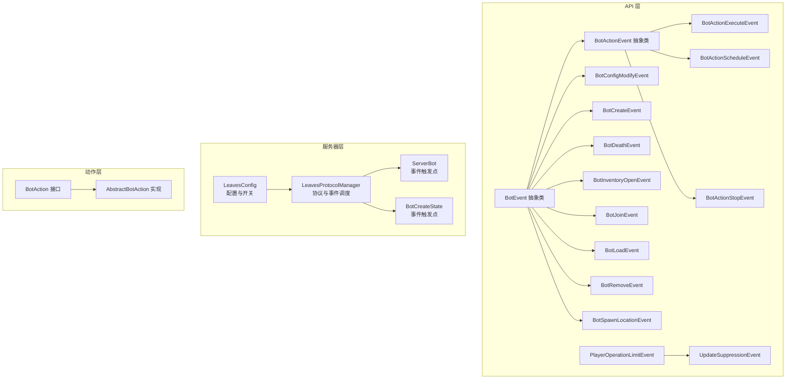
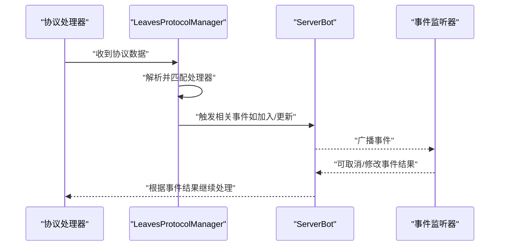
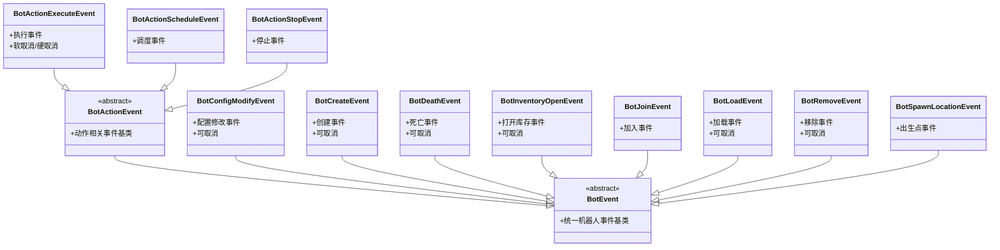
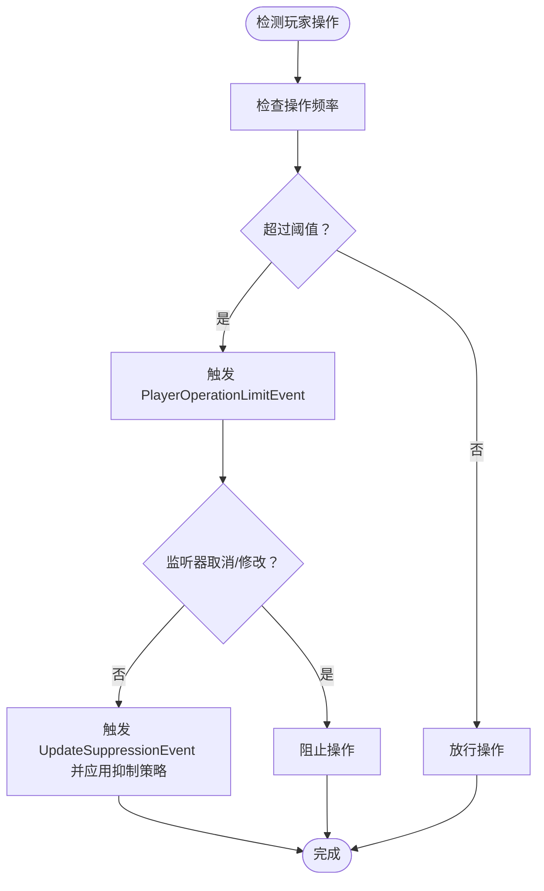
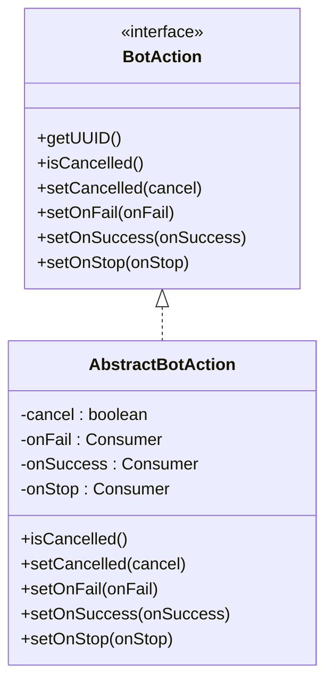
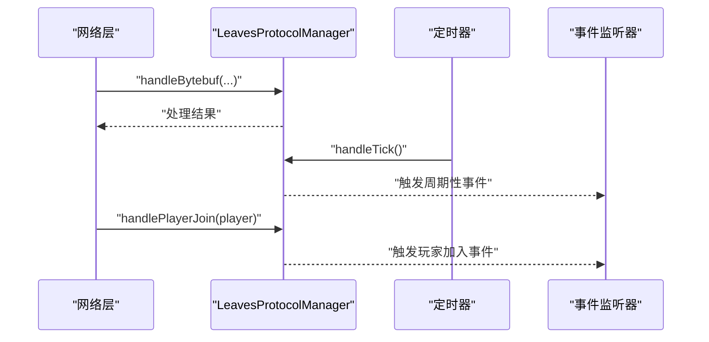
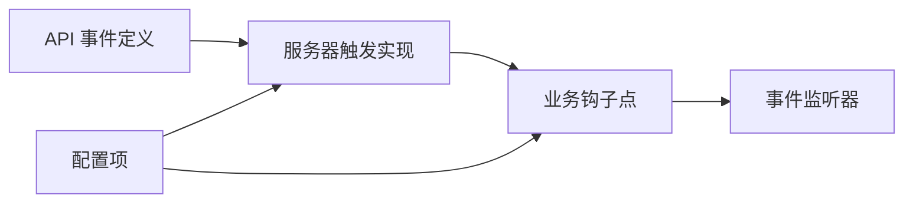

# 事件系统架构

<cite>
**本文引用的文件**
- [BotEvent.java](file://lophine-api/src/main/java/org/leavesmc/leaves/event/bot/BotEvent.java)
- [BotActionEvent.java](file://lophine-api/src/main/java/org/leavesmc/leaves/event/bot/BotActionEvent.java)
- [BotActionExecuteEvent.java](file://lophine-api/src/main/java/org/leavesmc/leaves/event/bot/BotActionExecuteEvent.java)
- [BotActionScheduleEvent.java](file://lophine-api/src/main/java/org/leavesmc/leaves/event/bot/BotActionScheduleEvent.java)
- [BotActionStopEvent.java](file://lophine-api/src/main/java/org/leavesmc/leaves/event/bot/BotActionStopEvent.java)
- [BotConfigModifyEvent.java](file://lophine-api/src/main/java/org/leavesmc/leaves/event/bot/BotConfigModifyEvent.java)
- [BotCreateEvent.java](file://lophine-api/src/main/java/org/leavesmc/leaves/event/bot/BotCreateEvent.java)
- [BotDeathEvent.java](file://lophine-api/src/main/java/org/leavesmc/leaves/event/bot/BotDeathEvent.java)
- [BotInventoryOpenEvent.java](file://lophine-api/src/main/java/org/leavesmc/leaves/event/bot/BotInventoryOpenEvent.java)
- [BotJoinEvent.java](file://lophine-api/src/main/java/org/leavesmc/leaves/event/bot/BotJoinEvent.java)
- [BotLoadEvent.java](file://lophine-api/src/main/java/org/leavesmc/leaves/event/bot/BotLoadEvent.java)
- [BotRemoveEvent.java](file://lophine-api/src/main/java/org/leavesmc/leaves/event/bot/BotRemoveEvent.java)
- [BotSpawnLocationEvent.java](file://lophine-api/src/main/java/org/leavesmc/leaves/event/bot/BotSpawnLocationEvent.java)
- [PlayerOperationLimitEvent.java](file://lophine-api/src/main/java/org/leavesmc/leaves/event/player/PlayerOperationLimitEvent.java)
- [UpdateSuppressionEvent.java](file://lophine-api/src/main/java/org/leavesmc/leaves/event/player/UpdateSuppressionEvent.java)
- [LeavesProtocolManager.java](file://lophine-server/src/main/java/org/leavesmc/leaves/protocol/core/LeavesProtocolManager.java)
- [AbstractBotAction.java](file://lophine-server/src/main/java/org/leavesmc/leaves/bot/agent/actions/AbstractBotAction.java)
- [BotAction.java](file://lophine-api/src/main/java/org/leavesmc/leaves/entity/bot/action/BotAction.java)
- [ServerBot.java](file://lophine-server/src/main/java/org/leavesmc/leaves/bot/ServerBot.java)
- [BotCreateState.java](file://lophine-server/src/main/java/org/leavesmc/leaves/bot/BotCreateState.java)
- [LeavesConfig.java](file://lophine-server/src/main/java/org/leavesmc/leaves/LeavesConfig.java)
</cite>

## 目录
1. [简介](#简介)
2. [项目结构](#项目结构)
3. [核心组件](#核心组件)
4. [架构总览](#架构总览)
5. [详细组件分析](#详细组件分析)
6. [依赖关系分析](#依赖关系分析)
7. [性能考量](#性能考量)
8. [故障排查指南](#故障排查指南)
9. [结论](#结论)
10. [附录](#附录)

## 简介
本文件系统性梳理 Lophine 的事件系统架构，重点解释事件驱动设计思想与实现机制，覆盖 BotEvent 及 PlayerOperationLimitEvent 等核心事件类型，阐述事件的发布、订阅与处理流程，说明事件优先级管理、异步处理与错误处理策略，并给出扩展与自定义事件的开发指南，以及事件系统如何支撑插件间解耦与协作。

## 项目结构
事件系统主要分布在以下位置：
- API 层：定义事件基类与具体事件类型（如 BotEvent、PlayerOperationLimitEvent）
- 服务器层：事件触发点、协议处理与调度器集成（如 LeavesProtocolManager）
- 动作层：机器人动作接口与可取消语义（BotAction、AbstractBotAction）

图表来源
- [BotEvent.java:1-50](file://lophine-api/src/main/java/org/leavesmc/leaves/event/bot/BotEvent.java#L1-L50)
- [BotActionEvent.java:1-40](file://lophine-api/src/main/java/org/leavesmc/leaves/event/bot/BotActionEvent.java#L1-L40)
- [BotActionExecuteEvent.java:1-80](file://lophine-api/src/main/java/org/leavesmc/leaves/event/bot/BotActionExecuteEvent.java#L1-L80)
- [BotActionScheduleEvent.java:1-60](file://lophine-api/src/main/java/org/leavesmc/leaves/event/bot/BotActionScheduleEvent.java#L1-L60)
- [BotActionStopEvent.java:1-60](file://lophine-api/src/main/java/org/leavesmc/leaves/event/bot/BotActionStopEvent.java#L1-L60)
- [BotConfigModifyEvent.java:1-50](file://lophine-api/src/main/java/org/leavesmc/leaves/event/bot/BotConfigModifyEvent.java#L1-L50)
- [BotCreateEvent.java:1-60](file://lophine-api/src/main/java/org/leavesmc/leaves/event/bot/BotCreateEvent.java#L1-L60)
- [BotDeathEvent.java:1-60](file://lophine-api/src/main/java/org/leavesmc/leaves/event/bot/BotDeathEvent.java#L1-L60)
- [BotInventoryOpenEvent.java:1-60](file://lophine-api/src/main/java/org/leavesmc/leaves/event/bot/BotInventoryOpenEvent.java#L1-L60)
- [BotJoinEvent.java:1-60](file://lophine-api/src/main/java/org/leavesmc/leaves/event/bot/BotJoinEvent.java#L1-L60)
- [BotLoadEvent.java:1-60](file://lophine-api/src/main/java/org/leavesmc/leaves/event/bot/BotLoadEvent.java#L1-L60)
- [BotRemoveEvent.java:1-60](file://lophine-api/src/main/java/org/leavesmc/leaves/event/bot/BotRemoveEvent.java#L1-L60)
- [BotSpawnLocationEvent.java:1-50](file://lophine-api/src/main/java/org/leavesmc/leaves/event/bot/BotSpawnLocationEvent.java#L1-L50)
- [PlayerOperationLimitEvent.java:1-60](file://lophine-api/src/main/java/org/leavesmc/leaves/event/player/PlayerOperationLimitEvent.java#L1-L60)
- [UpdateSuppressionEvent.java:1-60](file://lophine-api/src/main/java/org/leavesmc/leaves/event/player/UpdateSuppressionEvent.java#L1-L60)
- [LeavesProtocolManager.java:246-282](file://lophine-server/src/main/java/org/leavesmc/leaves/protocol/core/LeavesProtocolManager.java#L246-L282)
- [ServerBot.java:1-120](file://lophine-server/src/main/java/org/leavesmc/leaves/bot/ServerBot.java#L1-L120)
- [BotCreateState.java:1-80](file://lophine-server/src/main/java/org/leavesmc/leaves/bot/BotCreateState.java#L1-L80)
- [LeavesConfig.java:1-120](file://lophine-server/src/main/java/org/leavesmc/leaves/LeavesConfig.java#L1-L120)

章节来源
- [BotEvent.java:1-50](file://lophine-api/src/main/java/org/leavesmc/leaves/event/bot/BotEvent.java#L1-L50)
- [LeavesProtocolManager.java:246-282](file://lophine-server/src/main/java/org/leavesmc/leaves/protocol/core/LeavesProtocolManager.java#L246-L282)

## 核心组件
- 事件基类与层次
  - BotEvent：所有机器人相关事件的抽象基类，继承自通用事件基类，用于统一机器人事件的生命周期与上下文。
  - BotActionEvent：机器人动作相关事件的抽象基类，进一步细分为执行、调度、停止等子事件，便于对动作生命周期进行精细化控制。
- 具体事件类型
  - BotActionExecuteEvent：动作执行前/后事件，支持软取消与硬取消，允许监听器在执行阶段介入。
  - BotActionScheduleEvent：动作被调度时触发，可用于记录或调整调度行为。
  - BotActionStopEvent：动作被停止时触发，便于清理资源或回滚状态。
  - BotConfigModifyEvent：机器人配置修改事件，支持取消以阻止不安全的配置变更。
  - BotCreateEvent、BotDeathEvent、BotRemoveEvent、BotJoinEvent、BotLoadEvent、BotSpawnLocationEvent：覆盖机器人从创建到移除的完整生命周期。
  - PlayerOperationLimitEvent：玩家操作限制事件，用于限制高频操作或异常行为。
  - UpdateSuppressionEvent：更新抑制事件，用于处理大规模方块更新抑制场景。
- 动作接口与可取消语义
  - BotAction：定义动作的标识、取消、成功/失败/停止回调等契约。
  - AbstractBotAction：提供动作的取消状态与回调设置能力，作为具体动作实现的基础。

章节来源
- [BotEvent.java:1-50](file://lophine-api/src/main/java/org/leavesmc/leaves/event/bot/BotEvent.java#L1-L50)
- [BotActionEvent.java:1-40](file://lophine-api/src/main/java/org/leavesmc/leaves/event/bot/BotActionEvent.java#L1-L40)
- [BotActionExecuteEvent.java:1-80](file://lophine-api/src/main/java/org/leavesmc/leaves/event/bot/BotActionExecuteEvent.java#L1-L80)
- [BotActionScheduleEvent.java:1-60](file://lophine-api/src/main/java/org/leavesmc/leaves/event/bot/BotActionScheduleEvent.java#L1-L60)
- [BotActionStopEvent.java:1-60](file://lophine-api/src/main/java/org/leavesmc/leaves/event/bot/BotActionStopEvent.java#L1-L60)
- [BotConfigModifyEvent.java:1-50](file://lophine-api/src/main/java/org/leavesmc/leaves/event/bot/BotConfigModifyEvent.java#L1-L50)
- [BotCreateEvent.java:1-60](file://lophine-api/src/main/java/org/leavesmc/leaves/event/bot/BotCreateEvent.java#L1-L60)
- [BotDeathEvent.java:1-60](file://lophine-api/src/main/java/org/leavesmc/leaves/event/bot/BotDeathEvent.java#L1-L60)
- [BotInventoryOpenEvent.java:1-60](file://lophine-api/src/main/java/org/leavesmc/leaves/event/bot/BotInventoryOpenEvent.java#L1-L60)
- [BotJoinEvent.java:1-60](file://lophine-api/src/main/java/org/leavesmc/leaves/event/bot/BotJoinEvent.java#L1-L60)
- [BotLoadEvent.java:1-60](file://lophine-api/src/main/java/org/leavesmc/leaves/event/bot/BotLoadEvent.java#L1-L60)
- [BotRemoveEvent.java:1-60](file://lophine-api/src/main/java/org/leavesmc/leaves/event/bot/BotRemoveEvent.java#L1-L60)
- [BotSpawnLocationEvent.java:1-50](file://lophine-api/src/main/java/org/leavesmc/leaves/event/bot/BotSpawnLocationEvent.java#L1-L50)
- [PlayerOperationLimitEvent.java:1-60](file://lophine-api/src/main/java/org/leavesmc/leaves/event/player/PlayerOperationLimitEvent.java#L1-L60)
- [UpdateSuppressionEvent.java:1-60](file://lophine-api/src/main/java/org/leavesmc/leaves/event/player/UpdateSuppressionEvent.java#L1-L60)
- [BotAction.java:1-120](file://lophine-api/src/main/java/org/leavesmc/leaves/entity/bot/action/BotAction.java#L1-L120)
- [AbstractBotAction.java:233-264](file://lophine-server/src/main/java/org/leavesmc/leaves/bot/agent/actions/AbstractBotAction.java#L233-L264)

## 架构总览
事件系统采用“事件定义—触发点—订阅处理”的分层架构：
- 定义层：API 层提供事件类型与可取消语义，确保跨模块一致的事件契约。
- 触发层：服务器层在关键节点（如协议处理、玩家加入、机器人状态变化）触发事件。
- 处理层：监听器按注册顺序接收事件并可选择取消或修改行为；部分事件支持软/硬取消以满足不同场景需求。
- 配置层：通过配置项控制事件开关与行为边界，避免过度干预。

图表来源
- [LeavesProtocolManager.java:246-282](file://lophine-server/src/main/java/org/leavesmc/leaves/protocol/core/LeavesProtocolManager.java#L246-L282)
- [ServerBot.java:1-120](file://lophine-server/src/main/java/org/leavesmc/leaves/bot/ServerBot.java#L1-L120)

## 详细组件分析

### BotEvent 体系与生命周期
BotEvent 作为机器人事件的抽象基类，统一了事件的生命周期与上下文。其子类覆盖机器人从创建、加载、加入世界、执行动作、打开库存、死亡到移除的全链路事件，便于在各阶段进行拦截与扩展。

图表来源
- [BotEvent.java:1-50](file://lophine-api/src/main/java/org/leavesmc/leaves/event/bot/BotEvent.java#L1-L50)
- [BotActionEvent.java:1-40](file://lophine-api/src/main/java/org/leavesmc/leaves/event/bot/BotActionEvent.java#L1-L40)
- [BotActionExecuteEvent.java:1-80](file://lophine-api/src/main/java/org/leavesmc/leaves/event/bot/BotActionExecuteEvent.java#L1-L80)
- [BotActionScheduleEvent.java:1-60](file://lophine-api/src/main/java/org/leavesmc/leaves/event/bot/BotActionScheduleEvent.java#L1-L60)
- [BotActionStopEvent.java:1-60](file://lophine-api/src/main/java/org/leavesmc/leaves/event/bot/BotActionStopEvent.java#L1-L60)
- [BotConfigModifyEvent.java:1-50](file://lophine-api/src/main/java/org/leavesmc/leaves/event/bot/BotConfigModifyEvent.java#L1-L50)
- [BotCreateEvent.java:1-60](file://lophine-api/src/main/java/org/leavesmc/leaves/event/bot/BotCreateEvent.java#L1-L60)
- [BotDeathEvent.java:1-60](file://lophine-api/src/main/java/org/leavesmc/leaves/event/bot/BotDeathEvent.java#L1-L60)
- [BotInventoryOpenEvent.java:1-60](file://lophine-api/src/main/java/org/leavesmc/leaves/event/bot/BotInventoryOpenEvent.java#L1-L60)
- [BotJoinEvent.java:1-60](file://lophine-api/src/main/java/org/leavesmc/leaves/event/bot/BotJoinEvent.java#L1-L60)
- [BotLoadEvent.java:1-60](file://lophine-api/src/main/java/org/leavesmc/leaves/event/bot/BotLoadEvent.java#L1-L60)
- [BotRemoveEvent.java:1-60](file://lophine-api/src/main/java/org/leavesmc/leaves/event/bot/BotRemoveEvent.java#L1-L60)
- [BotSpawnLocationEvent.java:1-50](file://lophine-api/src/main/java/org/leavesmc/leaves/event/bot/BotSpawnLocationEvent.java#L1-L50)

章节来源
- [BotEvent.java:1-50](file://lophine-api/src/main/java/org/leavesmc/leaves/event/bot/BotEvent.java#L1-L50)
- [BotActionEvent.java:1-40](file://lophine-api/src/main/java/org/leavesmc/leaves/event/bot/BotActionEvent.java#L1-L40)
- [BotActionExecuteEvent.java:1-80](file://lophine-api/src/main/java/org/leavesmc/leaves/event/bot/BotActionExecuteEvent.java#L1-L80)
- [BotActionScheduleEvent.java:1-60](file://lophine-api/src/main/java/org/leavesmc/leaves/event/bot/BotActionScheduleEvent.java#L1-L60)
- [BotActionStopEvent.java:1-60](file://lophine-api/src/main/java/org/leavesmc/leaves/event/bot/BotActionStopEvent.java#L1-L60)
- [BotConfigModifyEvent.java:1-50](file://lophine-api/src/main/java/org/leavesmc/leaves/event/bot/BotConfigModifyEvent.java#L1-L50)
- [BotCreateEvent.java:1-60](file://lophine-api/src/main/java/org/leavesmc/leaves/event/bot/BotCreateEvent.java#L1-L60)
- [BotDeathEvent.java:1-60](file://lophine-api/src/main/java/org/leavesmc/leaves/event/bot/BotDeathEvent.java#L1-L60)
- [BotInventoryOpenEvent.java:1-60](file://lophine-api/src/main/java/org/leavesmc/leaves/event/bot/BotInventoryOpenEvent.java#L1-L60)
- [BotJoinEvent.java:1-60](file://lophine-api/src/main/java/org/leavesmc/leaves/event/bot/BotJoinEvent.java#L1-L60)
- [BotLoadEvent.java:1-60](file://lophine-api/src/main/java/org/leavesmc/leaves/event/bot/BotLoadEvent.java#L1-L60)
- [BotRemoveEvent.java:1-60](file://lophine-api/src/main/java/org/leavesmc/leaves/event/bot/BotRemoveEvent.java#L1-L60)
- [BotSpawnLocationEvent.java:1-50](file://lophine-api/src/main/java/org/leavesmc/leaves/event/bot/BotSpawnLocationEvent.java#L1-L50)

### PlayerOperationLimitEvent 与更新抑制
PlayerOperationLimitEvent 用于限制玩家高频操作，结合 UpdateSuppressionEvent 处理大规模更新抑制场景，两者共同保障服务端稳定性与公平性。

图表来源
- [PlayerOperationLimitEvent.java:1-60](file://lophine-api/src/main/java/org/leavesmc/leaves/event/player/PlayerOperationLimitEvent.java#L1-L60)
- [UpdateSuppressionEvent.java:1-60](file://lophine-api/src/main/java/org/leavesmc/leaves/event/player/UpdateSuppressionEvent.java#L1-L60)

章节来源
- [PlayerOperationLimitEvent.java:1-60](file://lophine-api/src/main/java/org/leavesmc/leaves/event/player/PlayerOperationLimitEvent.java#L1-L60)
- [UpdateSuppressionEvent.java:1-60](file://lophine-api/src/main/java/org/leavesmc/leaves/event/player/UpdateSuppressionEvent.java#L1-L60)

### 动作取消与回调机制
BotAction 接口与 AbstractBotAction 实现提供了统一的动作取消与回调机制，支持成功、失败、停止三种回调，便于在事件处理中进行状态同步与资源回收。

图表来源
- [BotAction.java:1-120](file://lophine-api/src/main/java/org/leavesmc/leaves/entity/bot/action/BotAction.java#L1-L120)
- [AbstractBotAction.java:233-264](file://lophine-server/src/main/java/org/leavesmc/leaves/bot/agent/actions/AbstractBotAction.java#L233-L264)

章节来源
- [BotAction.java:1-120](file://lophine-api/src/main/java/org/leavesmc/leaves/entity/bot/action/BotAction.java#L1-L120)
- [AbstractBotAction.java:233-264](file://lophine-server/src/main/java/org/leavesmc/leaves/bot/agent/actions/AbstractBotAction.java#L233-L264)

### 协议与事件调度
LeavesProtocolManager 负责协议数据的接收与分发，并在合适时机触发事件（如玩家加入、周期性 tick）。该组件是事件系统与网络层的桥梁。

图表来源
- [LeavesProtocolManager.java:246-282](file://lophine-server/src/main/java/org/leavesmc/leaves/protocol/core/LeavesProtocolManager.java#L246-L282)

章节来源
- [LeavesProtocolManager.java:246-282](file://lophine-server/src/main/java/org/leavesmc/leaves/protocol/core/LeavesProtocolManager.java#L246-L282)

## 依赖关系分析
- 事件定义与触发的解耦
  - API 层仅定义事件契约，服务器层在具体业务点触发事件，避免跨模块强耦合。
- 动作层与事件层的协作
  - 动作接口提供取消与回调，事件监听器可在执行前后介入，形成“声明式控制”与“响应式处理”的组合。
- 配置与开关
  - 通过配置项控制事件开关与行为边界，降低风险面。

图表来源
- [LeavesProtocolManager.java:246-282](file://lophine-server/src/main/java/org/leavesmc/leaves/protocol/core/LeavesProtocolManager.java#L246-L282)
- [LeavesConfig.java:1-120](file://lophine-server/src/main/java/org/leavesmc/leaves/LeavesConfig.java#L1-L120)

章节来源
- [LeavesProtocolManager.java:246-282](file://lophine-server/src/main/java/org/leavesmc/leaves/protocol/core/LeavesProtocolManager.java#L246-L282)
- [LeavesConfig.java:1-120](file://lophine-server/src/main/java/org/leavesmc/leaves/LeavesConfig.java#L1-L120)

## 性能考量
- 事件分发成本
  - 事件监听器数量与处理复杂度直接影响延迟，建议按需注册监听器，避免全局监听。
- 取消策略
  - 软取消与硬取消的使用应遵循场景约束，避免滥用导致逻辑分支复杂化。
- 周期性事件
  - 定时器触发频率与事件负载需平衡，必要时拆分事件或引入节流策略。

## 故障排查指南
- 事件未触发
  - 检查触发点是否正确调用事件分发逻辑，确认监听器已注册且未被过滤。
- 事件被意外取消
  - 审核监听器中的取消逻辑，区分软取消与硬取消的适用场景。
- 性能问题
  - 使用配置项关闭不必要的事件，或在监听器中实现快速失败路径。
- 动作回调未执行
  - 确认动作对象的回调设置与取消状态，检查动作生命周期是否提前结束。

章节来源
- [BotActionExecuteEvent.java:40-67](file://lophine-api/src/main/java/org/leavesmc/leaves/event/bot/BotActionExecuteEvent.java#L40-L67)
- [AbstractBotAction.java:233-264](file://lophine-server/src/main/java/org/leavesmc/leaves/bot/agent/actions/AbstractBotAction.java#L233-L264)

## 结论
Lophine 的事件系统通过清晰的事件层次、可取消语义与协议驱动的触发机制，实现了对机器人生命周期与玩家操作的精细控制。配合配置项与监听器模式，系统在保证稳定性的同时提供了良好的扩展性，能够支撑多插件间的解耦与协作。

## 附录

### 扩展与自定义事件开发指南
- 设计原则
  - 明确事件职责边界，避免“大而全”的事件类型。
  - 提供必要的上下文信息与可取消能力，便于监听器进行决策。
- 开发步骤
  - 在 API 层定义事件类型，继承合适的基类（如 BotEvent 或 PlayerEvent）。
  - 在服务器层的业务钩子处触发事件，确保调用时机与上下文完整。
  - 在监听器中实现处理逻辑，必要时使用软取消/硬取消控制后续流程。
- 最佳实践
  - 将高开销处理放入异步监听器（若框架支持），避免阻塞主流程。
  - 通过配置项控制事件开关，便于调试与灰度发布。

章节来源
- [BotEvent.java:1-50](file://lophine-api/src/main/java/org/leavesmc/leaves/event/bot/BotEvent.java#L1-L50)
- [PlayerOperationLimitEvent.java:1-60](file://lophine-api/src/main/java/org/leavesmc/leaves/event/player/PlayerOperationLimitEvent.java#L1-L60)
- [LeavesProtocolManager.java:246-282](file://lophine-server/src/main/java/org/leavesmc/leaves/protocol/core/LeavesProtocolManager.java#L246-L282)