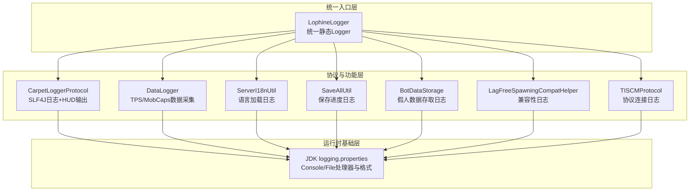
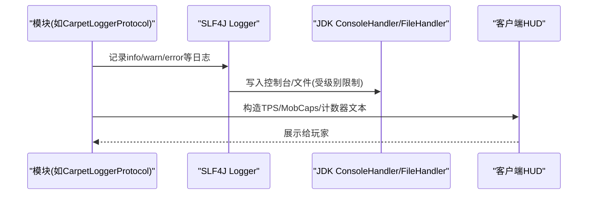
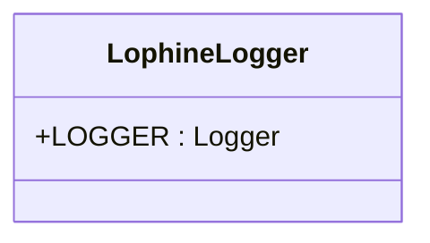
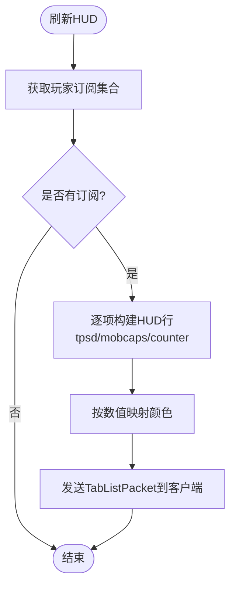
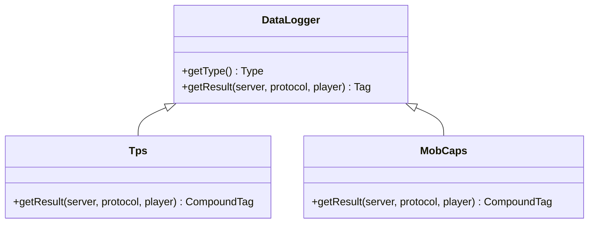
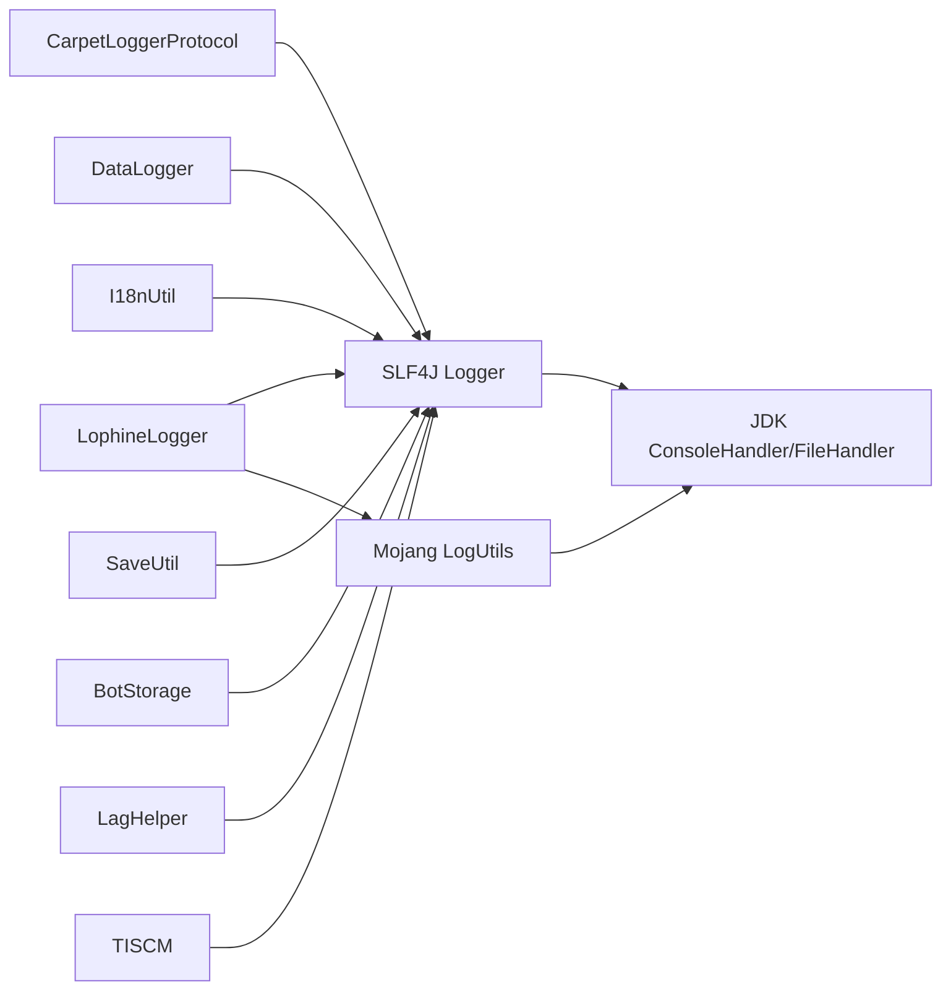

# 日志系统架构

<cite>
**本文引用的文件**
- [LophineLogger.java](file://lophine-server/src/main/java/fun/bm/lophine/LophineLogger.java)
- [CarpetLoggerProtocol.java](file://lophine-server/src/main/java/fun/bm/lophine/protocol/CarpetLoggerProtocol.java)
- [DataLogger.java](file://lophine-server/src/main/java/org/leavesmc/leaves/protocol/servux/logger/DataLogger.java)
- [logging.properties](file://jdk-21.0.10_windows-x64_bin/jdk-21.0.10/conf/logging.properties)
- [ServerI18nUtil.java](file://lophine-server/src/main/java/fun/bm/lophine/utils/ServerI18nUtil.java)
- [SaveAllUtil.java](file://lophine-server/src/main/java/fun/bm/lophine/utils/SaveAllUtil.java)
- [BotDataStorage.java](file://lophine-server/src/main/java/org/leavesmc/leaves/bot/BotDataStorage.java)
- [LagFreeSpawningCompatHelper.java](file://lophine-server/src/main/java/fun/bm/lophine/carpet/LagFreeSpawningCompatHelper.java)
- [TISCMProtocol.java](file://lophine-server/src/main/java/fun/bm/lophine/protocol/tiscm/TISCMProtocol.java)
</cite>

## 目录
1. [引言](#引言)
2. [项目结构](#项目结构)
3. [核心组件](#核心组件)
4. [架构总览](#架构总览)
5. [详细组件分析](#详细组件分析)
6. [依赖关系分析](#依赖关系分析)
7. [性能考虑](#性能考虑)
8. [故障排查指南](#故障排查指南)
9. [结论](#结论)
10. [附录](#附录)

## 引言
本文件面向Lophine的日志系统架构，重点解释以下方面：
- 基于SLF4J与Mojaing LogUtils的日志框架选择与集成方式
- LophineLogger统一日志入口的设计与使用规范
- 不同模块的日志级别管理与输出格式控制策略
- 日志性能优化策略与生产环境日志轮转配置建议
- 调试技巧、故障诊断方法以及日志在监控与问题排查中的作用

## 项目结构
Lophine的日志体系由三层构成：
- 统一入口层：通过LophineLogger暴露全局静态Logger，便于全项目一致化使用
- 协议与功能层：各协议模块（如CarpetLoggerProtocol）与功能模块（如Servux DataLogger）按需使用SLF4J进行分级记录
- 运行时基础层：JDK默认java.util.logging配置文件用于控制JVM内置日志处理器与格式

图表来源
- [LophineLogger.java:1-9](file://lophine-server/src/main/java/fun/bm/lophine/LophineLogger.java#L1-L9)
- [CarpetLoggerProtocol.java:1-303](file://lophine-server/src/main/java/fun/bm/lophine/protocol/CarpetLoggerProtocol.java#L1-L303)
- [DataLogger.java:1-174](file://lophine-server/src/main/java/org/leavesmc/leaves/protocol/servux/logger/DataLogger.java#L1-L174)
- [logging.properties:1-63](file://jdk-21.0.10_windows-x64_bin/jdk-21.0.10/conf/logging.properties#L1-L63)

章节来源
- [LophineLogger.java:1-9](file://lophine-server/src/main/java/fun/bm/lophine/LophineLogger.java#L1-L9)
- [logging.properties:1-63](file://jdk-21.0.10_windows-x64_bin/jdk-21.0.10/conf/logging.properties#L1-L63)

## 核心组件
- LophineLogger：提供全局静态Logger实例，封装Mojang LogUtils以获得SLF4J兼容的Logger对象，确保全项目一致的命名空间与调用方式
- 协议与功能模块：广泛采用SLF4J进行日志记录，结合项目内自定义协议实现动态HUD展示与数据采集
- JDK日志配置：通过logging.properties控制ConsoleHandler与FileHandler的级别、格式与轮转参数

章节来源
- [LophineLogger.java:1-9](file://lophine-server/src/main/java/fun/bm/lophine/LophineLogger.java#L1-L9)
- [CarpetLoggerProtocol.java:24-32](file://lophine-server/src/main/java/fun/bm/lophine/protocol/CarpetLoggerProtocol.java#L24-L32)
- [logging.properties:18-48](file://jdk-21.0.10_windows-x64_bin/jdk-21.0.10/conf/logging.properties#L18-L48)

## 架构总览
Lophine的日志架构遵循“统一入口 + 多源记录 + 可插拔输出”的模式：
- 统一入口：LophineLogger提供单一Logger引用，避免多处直接依赖SLF4J或LogUtils
- 记录分发：各模块根据职责选择合适级别（trace/debug/info/warn/error），并按需输出到控制台或文件
- 输出控制：通过logging.properties设置全局级别与格式；模块可按需调整自身Logger级别
- 动态展示：CarpetLoggerProtocol将关键指标（TPS、MobCaps、计数器）通过HUD展示给玩家

图表来源
- [CarpetLoggerProtocol.java:107-132](file://lophine-server/src/main/java/fun/bm/lophine/protocol/CarpetLoggerProtocol.java#L107-L132)
- [logging.properties:29-48](file://jdk-21.0.10_windows-x64_bin/jdk-21.0.10/conf/logging.properties#L29-L48)

## 详细组件分析

### LophineLogger统一入口
- 设计要点
  - 使用Mojaing LogUtils获取Logger，保证与Minecraft服务端日志生态兼容
  - 暴露静态final字段，便于全项目直接引用，减少重复初始化
- 使用规范
  - 所有模块优先通过LophineLogger.LOGGER进行日志记录
  - 避免在模块内部直接引入SLF4J Logger类，保持集中管理
  - 对于协议或工具类，仍可按需使用SLF4J的LoggerFactory创建命名空间更清晰的Logger

图表来源
- [LophineLogger.java:6-8](file://lophine-server/src/main/java/fun/bm/lophine/LophineLogger.java#L6-L8)

章节来源
- [LophineLogger.java:1-9](file://lophine-server/src/main/java/fun/bm/lophine/LophineLogger.java#L1-L9)

### 协议与HUD日志：CarpetLoggerProtocol
- 功能概述
  - 管理玩家订阅的“日志”类型（tpsd、mobcaps、counter）
  - 定期刷新HUD内容，将TPS、MSPT、生物群系上限等信息以彩色文本展示
  - 支持从配置解析默认订阅，并对不支持的键进行过滤与调试日志
- 日志级别与用途
  - debug：记录被忽略的不支持日志项
  - info：记录协议连接状态等事件
  - warn/error：记录异常与失败场景
- 输出格式
  - HUD文本为多行组合，颜色随数值变化
  - 控制台日志采用SimpleFormatter或XMLFormatter（取决于JVM配置）

图表来源
- [CarpetLoggerProtocol.java:78-132](file://lophine-server/src/main/java/fun/bm/lophine/protocol/CarpetLoggerProtocol.java#L78-L132)
- [CarpetLoggerProtocol.java:261-302](file://lophine-server/src/main/java/fun/bm/lophine/protocol/CarpetLoggerProtocol.java#L261-L302)

章节来源
- [CarpetLoggerProtocol.java:1-303](file://lophine-server/src/main/java/fun/bm/lophine/protocol/CarpetLoggerProtocol.java#L1-L303)

### 数据采集与序列化：DataLogger
- 功能概述
  - 提供抽象基类与具体实现（TPS、MobCaps），将关键指标编码为NBT并推送至协议层
  - 通过任务调度在合适的tick上下文中执行，避免阻塞主线程
- 日志级别与用途
  - 该类主要负责数据采集与序列化，日志记录较少；异常通常被吞并以保证稳定性
- 输出格式
  - NBT编码，便于跨协议传输与渲染

图表来源
- [DataLogger.java:44-174](file://lophine-server/src/main/java/org/leavesmc/leaves/protocol/servux/logger/DataLogger.java#L44-L174)

章节来源
- [DataLogger.java:1-174](file://lophine-server/src/main/java/org/leavesmc/leaves/protocol/servux/logger/DataLogger.java#L1-L174)

### 其他模块日志实践
- 语言加载：ServerI18nUtil在加载语言资源时使用info/warn/error记录状态与错误
- 保存进度：SaveAllUtil在保存世界时记录info与error，便于追踪保存耗时与异常
- 假人数据：BotDataStorage在读写假人数据时记录warn/error，定位IO与格式问题
- 兼容性：LagFreeSpawningCompatHelper在预烹饪实体失败时记录warn/error
- 协议：TISCMProtocol在检测到平台支持时记录info

章节来源
- [ServerI18nUtil.java:60-120](file://lophine-server/src/main/java/fun/bm/lophine/utils/ServerI18nUtil.java#L60-L120)
- [SaveAllUtil.java:45-60](file://lophine-server/src/main/java/fun/bm/lophine/utils/SaveAllUtil.java#L45-L60)
- [BotDataStorage.java:50-140](file://lophine-server/src/main/java/org/leavesmc/leaves/bot/BotDataStorage.java#L50-L140)
- [LagFreeSpawningCompatHelper.java:100-115](file://lophine-server/src/main/java/fun/bm/lophine/carpet/LagFreeSpawningCompatHelper.java#L100-L115)
- [TISCMProtocol.java:80-90](file://lophine-server/src/main/java/fun/bm/lophine/protocol/tiscm/TISCMProtocol.java#L80-L90)

## 依赖关系分析
- 组件耦合
  - LophineLogger作为统一入口，被多个模块间接依赖，降低直接耦合度
  - 协议模块（CarpetLoggerProtocol、DataLogger）依赖SLF4J与项目协议框架
  - JDK日志配置独立于业务代码，通过系统属性或默认路径生效
- 外部依赖
  - SLF4J：统一日志API
  - Mojang LogUtils：与Minecraft服务端日志生态对接
  - JDK java.util.logging：默认处理器与格式化器

图表来源
- [LophineLogger.java:3-8](file://lophine-server/src/main/java/fun/bm/lophine/LophineLogger.java#L3-L8)
- [CarpetLoggerProtocol.java:24-25](file://lophine-server/src/main/java/fun/bm/lophine/protocol/CarpetLoggerProtocol.java#L24-L25)
- [logging.properties:18-48](file://jdk-21.0.10_windows-x64_bin/jdk-21.0.10/conf/logging.properties#L18-L48)

章节来源
- [LophineLogger.java:1-9](file://lophine-server/src/main/java/fun/bm/lophine/LophineLogger.java#L1-L9)
- [CarpetLoggerProtocol.java:1-303](file://lophine-server/src/main/java/fun/bm/lophine/protocol/CarpetLoggerProtocol.java#L1-L303)
- [logging.properties:1-63](file://jdk-21.0.10_windows-x64_bin/jdk-21.0.10/conf/logging.properties#L1-L63)

## 性能考虑
- 日志级别控制
  - 将高频模块（如HUD刷新、数据采集）默认设为info或更低级别，避免debug噪声影响性能
  - 在开发阶段启用debug，生产环境提升至info/warn
- 异步与延迟
  - 利用任务调度在非主线程上下文执行耗时操作，减少对游戏tick的影响
- 输出开销
  - 控制台输出与文件轮转会带来额外IO成本，建议在高负载服务器上仅保留必要级别的控制台输出
- 编解码与序列化
  - DataLogger使用NBT编码，注意在高频推送场景下的内存与CPU占用

## 故障排查指南
- 快速定位
  - 查看JVM日志处理器输出（ConsoleHandler/FileHandler），确认级别与格式是否符合预期
  - 检查模块日志中warn/error条目，优先处理异常与失败场景
- 常见问题
  - HUD未显示：检查CarpetLoggerProtocol的订阅解析与默认配置，确认日志类型是否被忽略
  - 语言加载失败：关注ServerI18nUtil中的warn/error，检查网络与文件完整性
  - 假人数据异常：关注BotDataStorage中的warn/error，检查文件权限与JSON格式
- 调试技巧
  - 临时提升特定模块Logger级别（如CarpetLoggerProtocol所在包）以捕获更多细节
  - 使用JMX或外部日志收集系统聚合控制台与文件日志，便于跨进程检索

章节来源
- [logging.properties:29-48](file://jdk-21.0.10_windows-x64_bin/jdk-21.0.10/conf/logging.properties#L29-L48)
- [CarpetLoggerProtocol.java:277-279](file://lophine-server/src/main/java/fun/bm/lophine/protocol/CarpetLoggerProtocol.java#L277-L279)
- [ServerI18nUtil.java:90-120](file://lophine-server/src/main/java/fun/bm/lophine/utils/ServerI18nUtil.java#L90-L120)
- [BotDataStorage.java:50-140](file://lophine-server/src/main/java/org/leavesmc/leaves/bot/BotDataStorage.java#L50-L140)

## 结论
Lophine的日志系统通过LophineLogger实现统一入口，结合SLF4J与Mojaing LogUtils，既满足Minecraft服务端生态要求，又提供灵活的模块化记录能力。配合JDK日志配置与协议层的动态HUD展示，形成从底层到前端的完整可观测性闭环。生产环境中应重视级别控制、输出格式与轮转策略，以平衡可观测性与性能。

## 附录

### 日志级别与输出格式对照
- 级别建议
  - 开发：debug（全面捕获）
  - 测试/预发布：info（关键事件）
  - 生产：warn（异常与重要事件）
- 输出格式
  - 控制台：SimpleFormatter（默认）
  - 文件：XMLFormatter（默认），可按需调整

章节来源
- [logging.properties:47-48](file://jdk-21.0.10_windows-x64_bin/jdk-21.0.10/conf/logging.properties#L47-L48)
- [logging.properties:44](file://jdk-21.0.10_windows-x64_bin/jdk-21.0.10/conf/logging.properties#L44)