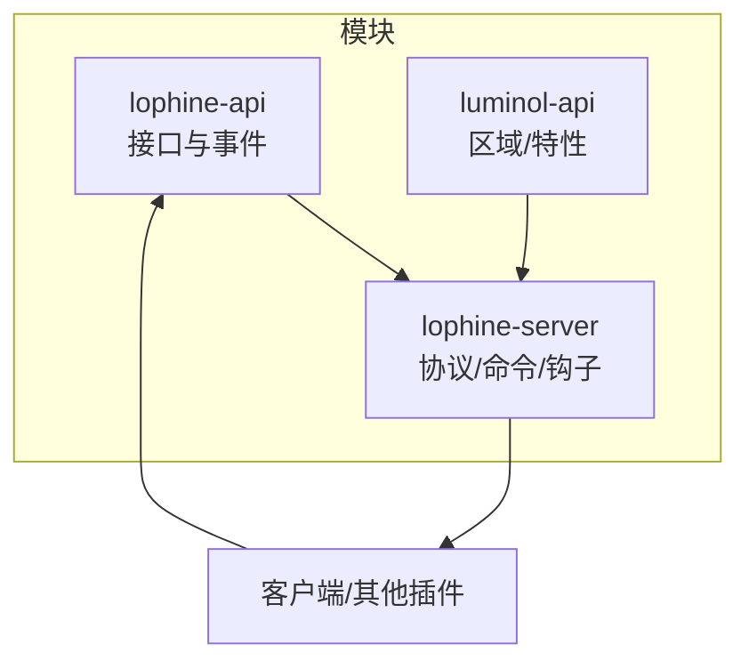
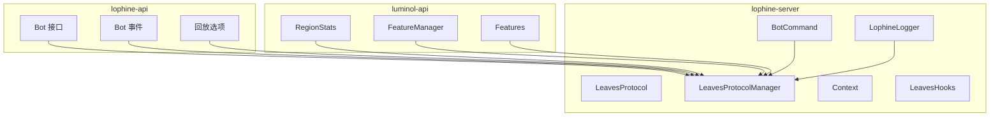
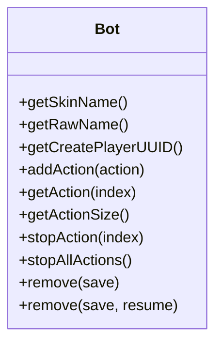
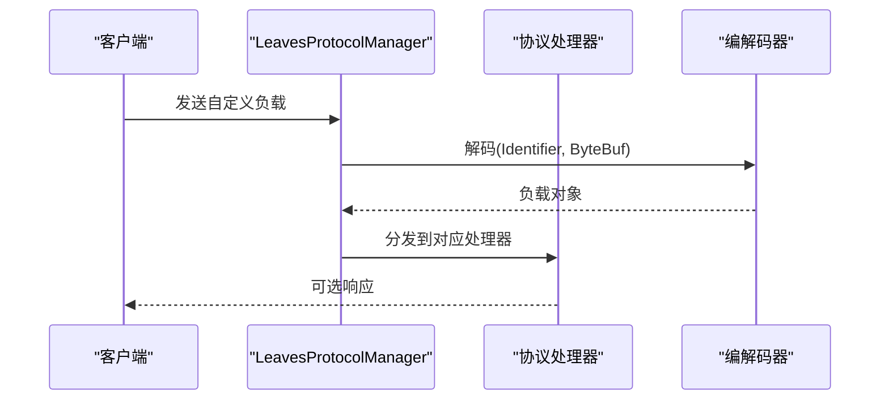
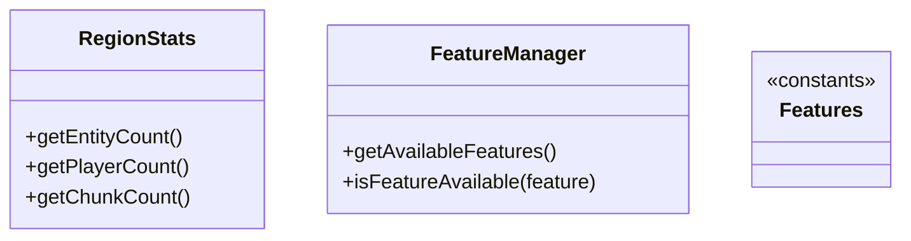
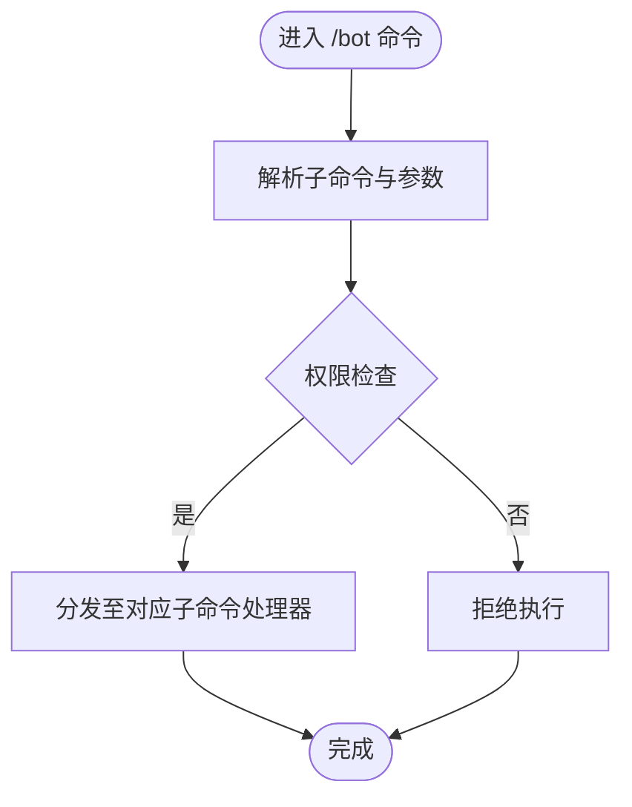
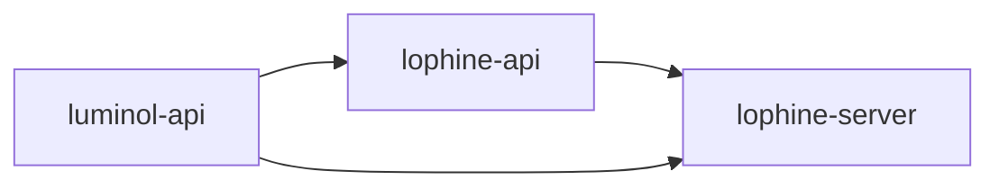

# 模块化设计

<cite>
**本文引用的文件**
- [lophine-api/src/main/java/org/leavesmc/leaves/entity/bot/Bot.java](file://lophine-api/src/main/java/org/leavesmc/leaves/entity/bot/Bot.java)
- [lophine-api/src/main/java/org/leavesmc/leaves/event/bot/BotEvent.java](file://lophine-api/src/main/java/org/leavesmc/leaves/event/bot/BotEvent.java)
- [lophine-api/src/main/java/org/leavesmc/leaves/replay/BukkitRecorderOption.java](file://lophine-api/src/main/java/org/leavesmc/leaves/replay/BukkitRecorderOption.java)
- [lophine-server/src/main/java/org/leavesmc/leaves/protocol/core/LeavesProtocol.java](file://lophine-server/src/main/java/org/leavesmc/leaves/protocol/core/LeavesProtocol.java)
- [lophine-server/src/main/java/org/leavesmc/leaves/protocol/core/LeavesProtocolManager.java](file://lophine-server/src/main/java/org/leavesmc/leaves/protocol/core/LeavesProtocolManager.java)
- [lophine-server/src/main/java/org/leavesmc/leaves/protocol/core/Context.java](file://lophine-server/src/main/java/org/leavesmc/leaves/protocol/core/Context.java)
- [lophine-server/src/main/java/org/leavesmc/leaves/region/LeavesHooks.java](file://lophine-server/src/main/java/org/leavesmc/leaves/region/LeavesHooks.java)
- [lophine-server/src/main/java/fun/bm/lophine/LophineLogger.java](file://lophine-server/src/main/java/fun/bm/lophine/LophineLogger.java)
- [lophine-server/src/main/java/org/leavesmc/leaves/command/bot/BotCommand.java](file://lophine-server/src/main/java/org/leavesmc/leaves/command/bot/BotCommand.java)
- [luminol-api/src/main/java/me/earthme/luminol/api/RegionStats.java](file://luminol-api/src/main/java/me/earthme/luminol/api/RegionStats.java)
- [luminol-api/src/main/java/org/leavesmc/leaves/plugin/FeatureManager.java](file://luminol-api/src/main/java/org/leavesmc/leaves/plugin/FeatureManager.java)
- [luminol-api/src/main/java/org/leavesmc/leaves/plugin/Features.java](file://luminol-api/src/main/java/org/leavesmc/leaves/plugin/Features.java)
- [lophine-api/build.gradle.kts.patch](file://lophine-api/build.gradle.kts.patch)
- [lophine-server/build.gradle.kts.patch](file://lophine-server/build.gradle.kts.patch)
</cite>

## 目录
1. [引言](#引言)
2. [项目结构](#项目结构)
3. [核心组件](#核心组件)
4. [架构总览](#架构总览)
5. [详细组件分析](#详细组件分析)
6. [依赖分析](#依赖分析)
7. [性能考虑](#性能考虑)
8. [故障排查指南](#故障排查指南)
9. [结论](#结论)
10. [附录](#附录)

## 引言
本文件系统性梳理 Lophine 的模块化设计，聚焦三大模块：lophine-api、lophine-server、luminol-api。文档从职责边界、接口契约、数据与事件流、模块加载与生命周期、以及模块间通信最佳实践等维度展开，帮助读者在不深入源码细节的前提下理解整体架构，并指导独立开发与部署。

## 项目结构
- lophine-api：对外暴露插件/扩展可用的 API，包括假人实体接口、事件模型、回放选项等，作为上层功能的抽象与契约。
- lophine-server：服务端实现，负责协议注册与分发、命令体系、区域钩子、日志与运行时集成，是模块间通信与功能落地的核心。
- luminol-api：底层区域与特性管理接口，提供区域统计、特性开关等能力，服务于高性能区域化执行与功能开关。

图示来源
- [lophine-api/src/main/java/org/leavesmc/leaves/entity/bot/Bot.java:30-103](file://lophine-api/src/main/java/org/leavesmc/leaves/entity/bot/Bot.java#L30-L103)
- [lophine-server/src/main/java/org/leavesmc/leaves/protocol/core/LeavesProtocolManager.java:71-209](file://lophine-server/src/main/java/org/leavesmc/leaves/protocol/core/LeavesProtocolManager.java#L71-L209)
- [luminol-api/src/main/java/me/earthme/luminol/api/RegionStats.java:7-28](file://luminol-api/src/main/java/me/earthme/luminol/api/RegionStats.java#L7-L28)

章节来源
- [lophine-api/build.gradle.kts.patch:1-28](file://lophine-api/build.gradle.kts.patch#L1-L28)
- [lophine-server/build.gradle.kts.patch:1-82](file://lophine-server/build.gradle.kts.patch#L1-L82)

## 核心组件
- 假人接口与事件（lophine-api）
  - 假人接口定义了皮肤、名称、创建者、动作队列与移除策略等能力，是假人功能的最小可实现契约。
  - 事件模型以 BotEvent 抽象，承载假人相关生命周期与行为事件，便于监听与扩展。
- 协议与通信（lophine-server）
  - LeavesProtocol 定义协议激活状态与注解元信息；LeavesProtocolManager 负责扫描、注册、编码/解码、分发与调度。
  - Context 提供玩家上下文封装；LeavesHooks 扩展品牌与区域观看回调。
- 区域与特性（luminol-api）
  - RegionStats 提供区域内的实体/玩家/区块计数等只读状态。
  - FeatureManager/Features 提供特性可用性查询与常量枚举，支撑按需启用/禁用功能。

章节来源
- [lophine-api/src/main/java/org/leavesmc/leaves/entity/bot/Bot.java:30-103](file://lophine-api/src/main/java/org/leavesmc/leaves/entity/bot/Bot.java#L30-L103)
- [lophine-api/src/main/java/org/leavesmc/leaves/event/bot/BotEvent.java:27-49](file://lophine-api/src/main/java/org/leavesmc/leaves/event/bot/BotEvent.java#L27-L49)
- [lophine-server/src/main/java/org/leavesmc/leaves/protocol/core/LeavesProtocol.java:26-39](file://lophine-server/src/main/java/org/leavesmc/leaves/protocol/core/LeavesProtocol.java#L26-L39)
- [lophine-server/src/main/java/org/leavesmc/leaves/protocol/core/LeavesProtocolManager.java:45-209](file://lophine-server/src/main/java/org/leavesmc/leaves/protocol/core/LeavesProtocolManager.java#L45-L209)
- [lophine-server/src/main/java/org/leavesmc/leaves/protocol/core/Context.java:24-26](file://lophine-server/src/main/java/org/leavesmc/leaves/protocol/core/Context.java#L24-L26)
- [lophine-server/src/main/java/org/leavesmc/leaves/region/LeavesHooks.java:25-36](file://lophine-server/src/main/java/org/leavesmc/leaves/region/LeavesHooks.java#L25-L36)
- [luminol-api/src/main/java/me/earthme/luminol/api/RegionStats.java:7-28](file://luminol-api/src/main/java/me/earthme/luminol/api/RegionStats.java#L7-L28)
- [luminol-api/src/main/java/org/leavesmc/leaves/plugin/FeatureManager.java:10-14](file://luminol-api/src/main/java/org/leavesmc/leaves/plugin/FeatureManager.java#L10-L14)
- [luminol-api/src/main/java/org/leavesmc/leaves/plugin/Features.java:8-13](file://luminol-api/src/main/java/org/leavesmc/leaves/plugin/Features.java#L8-L13)

## 架构总览
模块化架构通过“接口契约（API）—实现（Server）—底层能力（Luminol）”三层协作，实现功能的独立开发与部署：
- lophine-api 向外提供稳定接口与事件，屏蔽实现细节；
- lophine-server 实现协议、命令与钩子，承担模块间通信中枢；
- luminol-api 提供底层区域与特性管理，支撑高性能与可选功能。

图示来源
- [lophine-api/src/main/java/org/leavesmc/leaves/entity/bot/Bot.java:30-103](file://lophine-api/src/main/java/org/leavesmc/leaves/entity/bot/Bot.java#L30-L103)
- [lophine-api/src/main/java/org/leavesmc/leaves/event/bot/BotEvent.java:27-49](file://lophine-api/src/main/java/org/leavesmc/leaves/event/bot/BotEvent.java#L27-L49)
- [lophine-api/src/main/java/org/leavesmc/leaves/replay/BukkitRecorderOption.java:20-35](file://lophine-api/src/main/java/org/leavesmc/leaves/replay/BukkitRecorderOption.java#L20-L35)
- [lophine-server/src/main/java/org/leavesmc/leaves/protocol/core/LeavesProtocol.java:26-39](file://lophine-server/src/main/java/org/leavesmc/leaves/protocol/core/LeavesProtocol.java#L26-L39)
- [lophine-server/src/main/java/org/leavesmc/leaves/protocol/core/LeavesProtocolManager.java:45-209](file://lophine-server/src/main/java/org/leavesmc/leaves/protocol/core/LeavesProtocolManager.java#L45-L209)
- [lophine-server/src/main/java/org/leavesmc/leaves/protocol/core/Context.java:24-26](file://lophine-server/src/main/java/org/leavesmc/leaves/protocol/core/Context.java#L24-L26)
- [lophine-server/src/main/java/org/leavesmc/leaves/region/LeavesHooks.java:25-36](file://lophine-server/src/main/java/org/leavesmc/leaves/region/LeavesHooks.java#L25-L36)
- [lophine-server/src/main/java/org/leavesmc/leaves/command/bot/BotCommand.java:29-58](file://lophine-server/src/main/java/org/leavesmc/leaves/command/bot/BotCommand.java#L29-L58)
- [lophine-server/src/main/java/fun/bm/lophine/LophineLogger.java:6-8](file://lophine-server/src/main/java/fun/bm/lophine/LophineLogger.java#L6-L8)
- [luminol-api/src/main/java/me/earthme/luminol/api/RegionStats.java:7-28](file://luminol-api/src/main/java/me/earthme/luminol/api/RegionStats.java#L7-L28)
- [luminol-api/src/main/java/org/leavesmc/leaves/plugin/FeatureManager.java:10-14](file://luminol-api/src/main/java/org/leavesmc/leaves/plugin/FeatureManager.java#L10-L14)
- [luminol-api/src/main/java/org/leavesmc/leaves/plugin/Features.java:8-13](file://luminol-api/src/main/java/org/leavesmc/leaves/plugin/Features.java#L8-L13)

## 详细组件分析

### 假人模块（lophine-api）
- 角色定位：定义假人能力边界与事件模型，确保上层插件/客户端仅依赖稳定接口。
- 关键点：
  - 假人接口提供动作队列、停止与移除策略，便于统一调度与持久化。
  - 事件模型以 BotEvent 为基类，派生出具体生命周期事件，便于监听器扩展。

图示来源
- [lophine-api/src/main/java/org/leavesmc/leaves/entity/bot/Bot.java:30-103](file://lophine-api/src/main/java/org/leavesmc/leaves/entity/bot/Bot.java#L30-L103)

章节来源
- [lophine-api/src/main/java/org/leavesmc/leaves/entity/bot/Bot.java:30-103](file://lophine-api/src/main/java/org/leavesmc/leaves/entity/bot/Bot.java#L30-L103)
- [lophine-api/src/main/java/org/leavesmc/leaves/event/bot/BotEvent.java:27-49](file://lophine-api/src/main/java/org/leavesmc/leaves/event/bot/BotEvent.java#L27-L49)

### 协议与通信（lophine-server）
- 角色定位：模块间通信中枢，负责协议注册、编码/解码、事件分发与周期性调度。
- 关键点：
  - LeavesProtocol 注解驱动协议注册；LeavesProtocolManager 通过反射扫描、构建调用链并维护映射表。
  - 编解码：基于 Identifier 与 StreamCodec，确保跨模块消息一致性。
  - 生命周期：PlayerJoin/Leave、ServerReload/DataPackReload、Ticker 等事件由 Manager 统一分发。
  - 上下文：Context 封装 GameProfile 与连接对象，便于协议处理器访问。

图示来源
- [lophine-server/src/main/java/org/leavesmc/leaves/protocol/core/LeavesProtocolManager.java:211-244](file://lophine-server/src/main/java/org/leavesmc/leaves/protocol/core/LeavesProtocolManager.java#L211-L244)
- [lophine-server/src/main/java/org/leavesmc/leaves/protocol/core/LeavesProtocol.java:26-39](file://lophine-server/src/main/java/org/leavesmc/leaves/protocol/core/LeavesProtocol.java#L26-L39)

章节来源
- [lophine-server/src/main/java/org/leavesmc/leaves/protocol/core/LeavesProtocol.java:26-39](file://lophine-server/src/main/java/org/leavesmc/leaves/protocol/core/LeavesProtocol.java#L26-L39)
- [lophine-server/src/main/java/org/leavesmc/leaves/protocol/core/LeavesProtocolManager.java:45-209](file://lophine-server/src/main/java/org/leavesmc/leaves/protocol/core/LeavesProtocolManager.java#L45-L209)
- [lophine-server/src/main/java/org/leavesmc/leaves/protocol/core/Context.java:24-26](file://lophine-server/src/main/java/org/leavesmc/leaves/protocol/core/Context.java#L24-L26)

### 区域与特性（luminol-api）
- 角色定位：提供区域统计与特性开关，支撑按区域精细化控制与可选功能。
- 关键点：
  - RegionStats 提供实体/玩家/区块计数，用于区域级性能与行为决策。
  - FeatureManager/Features 提供特性可用性查询与常量枚举，便于条件化启用。

图示来源
- [luminol-api/src/main/java/me/earthme/luminol/api/RegionStats.java:7-28](file://luminol-api/src/main/java/me/earthme/luminol/api/RegionStats.java#L7-L28)
- [luminol-api/src/main/java/org/leavesmc/leaves/plugin/FeatureManager.java:10-14](file://luminol-api/src/main/java/org/leavesmc/leaves/plugin/FeatureManager.java#L10-L14)
- [luminol-api/src/main/java/org/leavesmc/leaves/plugin/Features.java:8-13](file://luminol-api/src/main/java/org/leavesmc/leaves/plugin/Features.java#L8-L13)

章节来源
- [luminol-api/src/main/java/me/earthme/luminol/api/RegionStats.java:7-28](file://luminol-api/src/main/java/me/earthme/luminol/api/RegionStats.java#L7-L28)
- [luminol-api/src/main/java/org/leavesmc/leaves/plugin/FeatureManager.java:10-14](file://luminol-api/src/main/java/org/leavesmc/leaves/plugin/FeatureManager.java#L10-L14)
- [luminol-api/src/main/java/org/leavesmc/leaves/plugin/Features.java:8-13](file://luminol-api/src/main/java/org/leavesmc/leaves/plugin/Features.java#L8-L13)

### 回放与命令（lophine-api 与 lophine-server）
- 回放选项（lophine-api）：定义回放缓存的服务器名、天气、时间与聊天忽略策略。
- 假人命令（lophine-server）：集中注册 bot 子命令节点，统一权限与入口。

图示来源
- [lophine-server/src/main/java/org/leavesmc/leaves/command/bot/BotCommand.java:29-58](file://lophine-server/src/main/java/org/leavesmc/leaves/command/bot/BotCommand.java#L29-L58)
- [lophine-api/src/main/java/org/leavesmc/leaves/replay/BukkitRecorderOption.java:20-35](file://lophine-api/src/main/java/org/leavesmc/leaves/replay/BukkitRecorderOption.java#L20-L35)

章节来源
- [lophine-api/src/main/java/org/leavesmc/leaves/replay/BukkitRecorderOption.java:20-35](file://lophine-api/src/main/java/org/leavesmc/leaves/replay/BukkitRecorderOption.java#L20-L35)
- [lophine-server/src/main/java/org/leavesmc/leaves/command/bot/BotCommand.java:29-58](file://lophine-server/src/main/java/org/leavesmc/leaves/command/bot/BotCommand.java#L29-L58)

## 依赖分析
- 模块依赖关系
  - lophine-server 依赖 lophine-api（通过构建脚本中的 implementation(project(":lophine-api"))）。
  - lophine-api 在其构建中合并 luminol-api 的源集与资源，增强 API 层面的兼容与复用。
- 运行时依赖
  - LeavesProtocolManager 通过反射扫描包路径，动态发现并注册协议实现，降低耦合度。
  - LeavesHooks 对品牌与区域观看进行扩展，确保与上层协议协同工作。

图示来源
- [lophine-server/build.gradle.kts.patch:48-51](file://lophine-server/build.gradle.kts.patch#L48-L51)
- [lophine-api/build.gradle.kts.patch:1-28](file://lophine-api/build.gradle.kts.patch#L1-L28)

章节来源
- [lophine-server/build.gradle.kts.patch:48-51](file://lophine-server/build.gradle.kts.patch#L48-L51)
- [lophine-api/build.gradle.kts.patch:1-28](file://lophine-api/build.gradle.kts.patch#L1-L28)

## 性能考虑
- 协议注册与反射扫描
  - LeavesProtocolManager 使用反射批量扫描与注册协议，建议在启动阶段一次性完成，避免运行期重复扫描带来的开销。
- 编解码与负载分发
  - 采用 StreamCodec 与 Identifier 映射，减少序列化成本；对未知负载直接丢弃，避免无效处理。
- 区域统计与特性开关
  - RegionStats 提供轻量只读状态，可在区域级决策中减少不必要的计算；FeatureManager 支持按需启用，避免无关逻辑进入热路径。

## 故障排查指南
- 协议未生效或无法识别
  - 检查协议是否标注 Register 注解且命名空间正确；确认 LeavesProtocolManager 初始化已执行。
  - 核对负载的 ID 与 Codec 是否成对配置，避免解码失败。
- 权限不足导致命令不可用
  - 确认命令权限前缀与子命令权限是否正确注册；BotCommand 提供统一权限检查入口。
- 品牌与区域观看异常
  - LeavesHooks 覆盖品牌与区域观看回调，若出现异常需检查覆盖逻辑与调用链。
- 日志定位
  - 使用 LophineLogger 获取统一日志入口，结合错误堆栈快速定位问题。

章节来源
- [lophine-server/src/main/java/org/leavesmc/leaves/protocol/core/LeavesProtocolManager.java:71-209](file://lophine-server/src/main/java/org/leavesmc/leaves/protocol/core/LeavesProtocolManager.java#L71-L209)
- [lophine-server/src/main/java/org/leavesmc/leaves/command/bot/BotCommand.java:51-57](file://lophine-server/src/main/java/org/leavesmc/leaves/command/bot/BotCommand.java#L51-L57)
- [lophine-server/src/main/java/org/leavesmc/leaves/region/LeavesHooks.java:25-36](file://lophine-server/src/main/java/org/leavesmc/leaves/region/LeavesHooks.java#L25-L36)
- [lophine-server/src/main/java/fun/bm/lophine/LophineLogger.java:6-8](file://lophine-server/src/main/java/fun/bm/lophine/LophineLogger.java#L6-L8)

## 结论
Lophine 的模块化设计通过清晰的职责划分与稳定的接口契约，实现了假人、协议通信与区域特性的解耦。lophine-api 提供抽象与事件，lophine-server 承担通信与生命周期管理，luminol-api 提供底层区域与特性能力。该架构既支持独立开发与部署，又通过协议与命令体系保证模块间协作顺畅。

## 附录
- 模块加载顺序与初始化流程（概念性说明）
  - 启动阶段：先加载 luminol-api 的区域与特性能力，再加载 lophine-api 的接口与事件，最后由 lophine-server 初始化协议管理器并注册所有协议实现。
  - 运行阶段：协议管理器根据 Identifier 与 Codec 分发负载；命令系统统一入口并按权限分发；区域钩子在区域变化时触发扩展逻辑。
- 最佳实践
  - 使用 LeavesProtocol.Register 与注解驱动注册，避免硬编码耦合。
  - 通过 Context 访问玩家上下文，避免全局状态。
  - 利用 RegionStats 与 FeatureManager 进行区域级与特性级的条件化控制。
  - 在命令入口集中校验权限，减少分支判断分散。