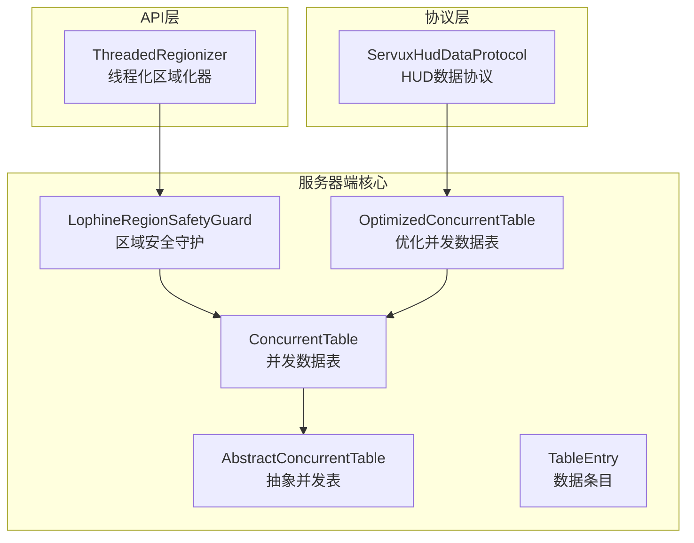
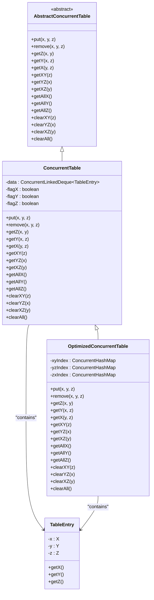
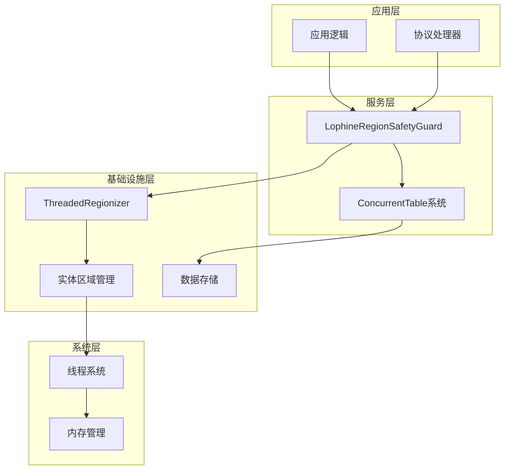
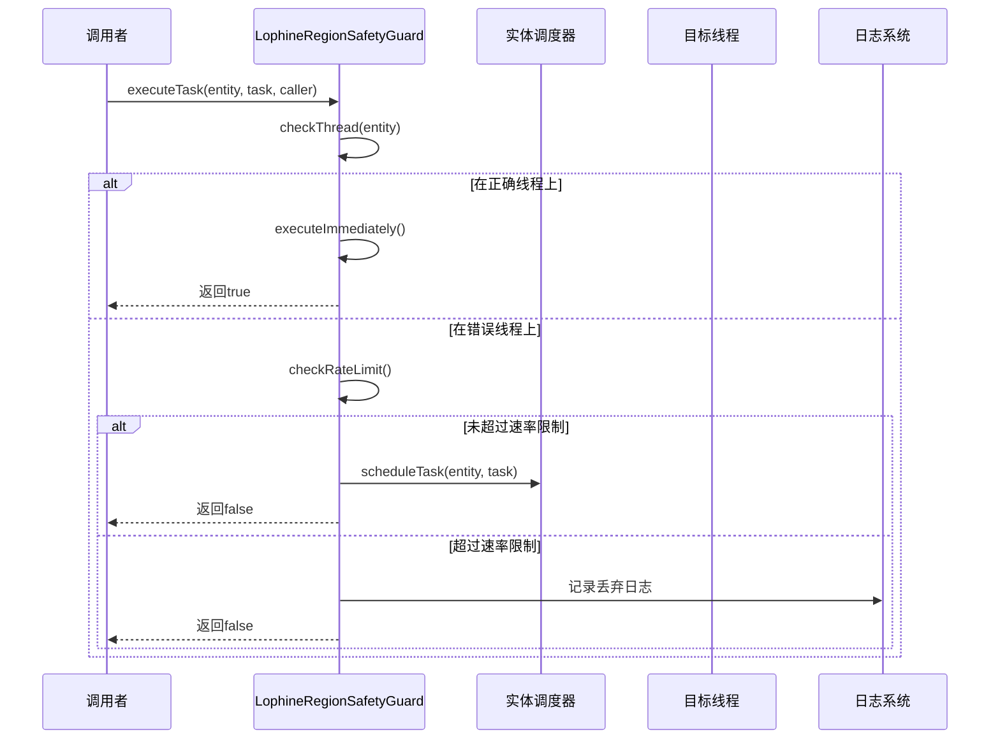
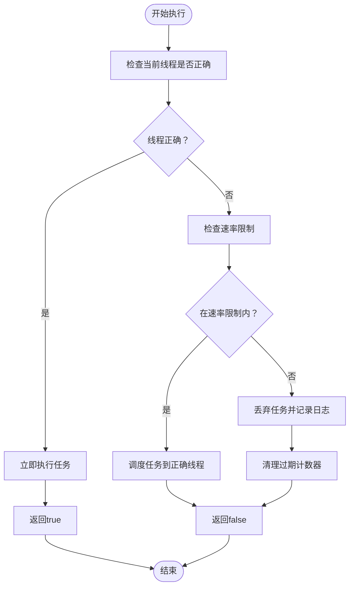
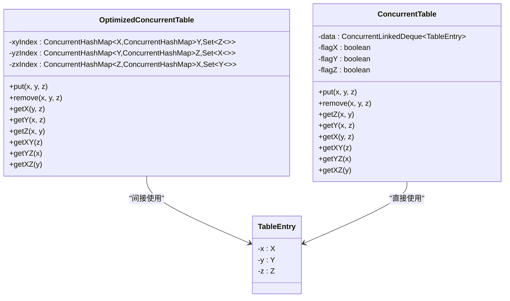
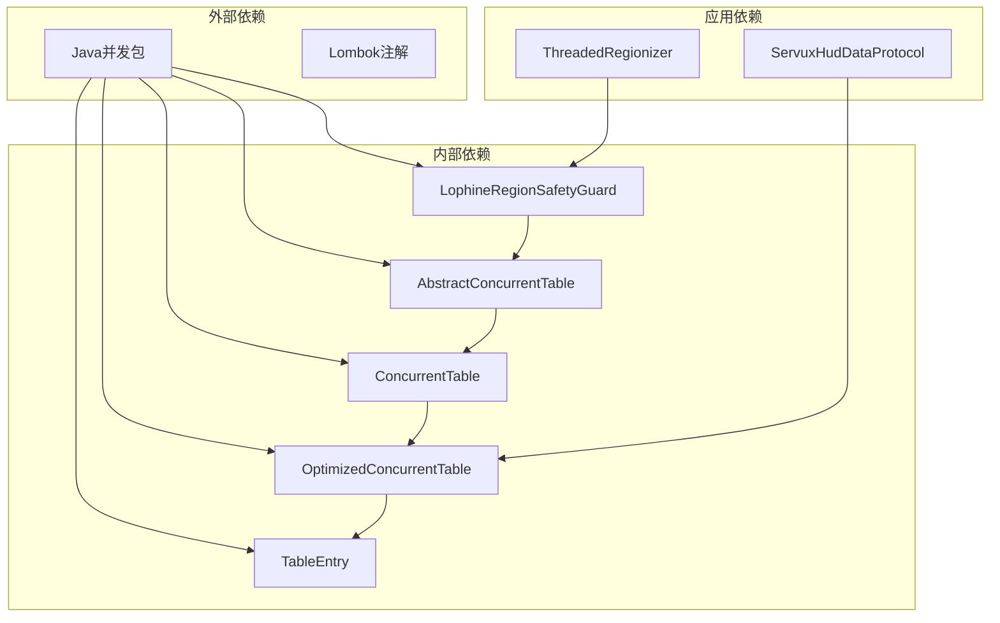

# 线程安全防护机制

<cite>
**本文档引用的文件**
- [LophineRegionSafetyGuard.java](file://lophine-server/src/main/java/org/leavesmc/leaves/util/LophineRegionSafetyGuard.java)
- [AbstractConcurrentTable.java](file://lophine-server/src/main/java/fun/bm/lophine/utils/concurrent/AbstractConcurrentTable.java)
- [ConcurrentTable.java](file://lophine-server/src/main/java/fun/bm/lophine/utils/concurrent/ConcurrentTable.java)
- [OptimizedConcurrentTable.java](file://lophine-server/src/main/java/fun/bm/lophine/utils/concurrent/OptimizedConcurrentTable.java)
- [TableEntry.java](file://lophine-server/src/main/java/fun/bm/lophine/utils/concurrent/TableEntry.java)
- [ServuxHudDataProtocol.java](file://lophine-server/src/main/java/org/leavesmc/leaves/protocol/servux/ServuxHudDataProtocol.java)
- [ThreadedRegionizer.java](file://luminol-api/src/main/java/me/earthme/luminol/api/ThreadedRegionizer.java)
</cite>

## 目录
1. [引言](#引言)
2. [项目结构](#项目结构)
3. [核心组件](#核心组件)
4. [架构概览](#架构概览)
5. [详细组件分析](#详细组件分析)
6. [依赖关系分析](#依赖关系分析)
7. [性能考虑](#性能考虑)
8. [故障排除指南](#故障排除指南)
9. [结论](#结论)

## 引言

Lophine项目采用了多层次的线程安全防护机制，确保在多线程环境下能够安全地处理实体、区域和数据操作。该系统主要包含两个核心方面：区域安全守护机制和并发数据表管理。

区域安全守护机制通过智能的任务调度和执行控制，确保所有与特定实体相关的操作都在正确的区域线程上执行。并发数据表管理则提供了线程安全的数据存储和检索功能，支持复杂的多维数据索引和查询操作。

## 项目结构

Lophine项目的线程安全相关代码主要分布在以下模块中：

**图表来源**
- [LophineRegionSafetyGuard.java:35-150](file://lophine-server/src/main/java/org/leavesmc/leaves/util/LophineRegionSafetyGuard.java#L35-L150)
- [ConcurrentTable.java:10-29](file://lophine-server/src/main/java/fun/bm/lophine/utils/concurrent/ConcurrentTable.java#L10-L29)
- [OptimizedConcurrentTable.java:8-54](file://lophine-server/src/main/java/fun/bm/lophine/utils/concurrent/OptimizedConcurrentTable.java#L8-L54)

**章节来源**
- [LophineRegionSafetyGuard.java:33-62](file://lophine-server/src/main/java/org/leavesmc/leaves/util/LophineRegionSafetyGuard.java#L33-L62)
- [AbstractConcurrentTable.java:6-36](file://lophine-server/src/main/java/fun/bm/lophine/utils/concurrent/AbstractConcurrentTable.java#L6-L36)

## 核心组件

### 区域安全守护器 (LophineRegionSafetyGuard)

LophineRegionSafetyGuard是整个线程安全系统的核心组件，负责确保所有实体相关操作都在正确的区域线程上执行。

**主要特性：**
- 智能任务调度：自动检测当前线程是否为正确的区域线程
- 速率限制：防止重复调度导致的线程池过载
- 自动清理：定期清理过期的计数器状态
- 错误处理：提供详细的日志记录和错误恢复机制

**关键配置参数：**
- 最大重调度次数：每实体每30秒最多128次
- 清理间隔：每5分钟清理一次过期计数器
- 调度器窗口：30纳秒的时间窗口用于速率计算

**章节来源**
- [LophineRegionSafetyGuard.java:38-46](file://lophine-server/src/main/java/org/leavesmc/leaves/util/LophineRegionSafetyGuard.java#L38-L46)
- [LophineRegionSafetyGuard.java:50-62](file://lophine-server/src/main/java/org/leavesmc/leaves/util/LophineRegionSafetyGuard.java#L50-L62)

### 并发数据表系统

并发数据表系统提供了线程安全的数据存储和检索功能，支持复杂的多维数据索引。

**设计模式：**
- 抽象工厂模式：通过抽象基类定义统一接口
- 组合模式：支持多种数据表实现
- 索引模式：提供多维度快速查询能力

**核心组件关系：**

**图表来源**
- [AbstractConcurrentTable.java:6-36](file://lophine-server/src/main/java/fun/bm/lophine/utils/concurrent/AbstractConcurrentTable.java#L6-L36)
- [ConcurrentTable.java:10-29](file://lophine-server/src/main/java/fun/bm/lophine/utils/concurrent/ConcurrentTable.java#L10-L29)
- [OptimizedConcurrentTable.java:8-54](file://lophine-server/src/main/java/fun/bm/lophine/utils/concurrent/OptimizedConcurrentTable.java#L8-L54)
- [TableEntry.java:3-25](file://lophine-server/src/main/java/fun/bm/lophine/utils/concurrent/TableEntry.java#L3-L25)

**章节来源**
- [ConcurrentTable.java:10-29](file://lophine-server/src/main/java/fun/bm/lophine/utils/concurrent/ConcurrentTable.java#L10-L29)
- [OptimizedConcurrentTable.java:8-54](file://lophine-server/src/main/java/fun/bm/lophine/utils/concurrent/OptimizedConcurrentTable.java#L8-L54)

## 架构概览

Lophine的线程安全架构采用分层设计，从底层的区域管理到上层的应用逻辑都遵循统一的安全原则。

**图表来源**
- [LophineRegionSafetyGuard.java:35-150](file://lophine-server/src/main/java/org/leavesmc/leaves/util/LophineRegionSafetyGuard.java#L35-L150)
- [ThreadedRegionizer.java:48-61](file://luminol-api/src/main/java/me/earthme/luminol/api/ThreadedRegionizer.java#L48-L61)

## 详细组件分析

### 区域安全守护机制

区域安全守护机制通过智能的任务调度确保所有操作都在正确的线程上下文中执行。

#### 执行流程

**图表来源**
- [LophineRegionSafetyGuard.java:63-150](file://lophine-server/src/main/java/org/leavesmc/leaves/util/LophineRegionSafetyGuard.java#L63-L150)

#### 速率限制算法

**图表来源**
- [LophineRegionSafetyGuard.java:87-100](file://lophine-server/src/main/java/org/leavesmc/leaves/util/LophineRegionSafetyGuard.java#L87-L100)

**章节来源**
- [LophineRegionSafetyGuard.java:63-150](file://lophine-server/src/main/java/org/leavesmc/leaves/util/LophineRegionSafetyGuard.java#L63-L150)

### 并发数据表优化策略

优化的并发数据表通过多重索引实现高性能的数据访问。

#### 数据结构设计

**图表来源**
- [OptimizedConcurrentTable.java:8-54](file://lophine-server/src/main/java/fun/bm/lophine/utils/concurrent/OptimizedConcurrentTable.java#L8-L54)
- [ConcurrentTable.java:10-29](file://lophine-server/src/main/java/fun/bm/lophine/utils/concurrent/ConcurrentTable.java#L10-L29)
- [TableEntry.java:3-25](file://lophine-server/src/main/java/fun/bm/lophine/utils/concurrent/TableEntry.java#L3-L25)

#### 查询性能分析

| 操作类型 | 时间复杂度 | 空间复杂度 | 说明 |
|---------|-----------|-----------|------|
| put操作 | O(1) | O(1) | 基于哈希表的常数时间插入 |
| get操作 | O(1) | O(k) | k为匹配结果数量 |
| remove操作 | O(1) | O(1) | 哈希表删除操作 |
| 索引更新 | O(n) | O(1) | n为冲突链长度 |

**章节来源**
- [OptimizedConcurrentTable.java:21-54](file://lophine-server/src/main/java/fun/bm/lophine/utils/concurrent/OptimizedConcurrentTable.java#L21-L54)

### 协议集成示例

ServuxHudDataProtocol展示了如何在实际应用中使用并发数据表系统。

**关键实现特点：**
- 使用优化的并发表进行数据存储
- 支持多维索引查询
- 提供线程安全的数据访问接口

**章节来源**
- [ServuxHudDataProtocol.java:60](file://lophine-server/src/main/java/org/leavesmc/leaves/protocol/servux/ServuxHudDataProtocol.java#L60)

## 依赖关系分析

线程安全系统的依赖关系呈现清晰的层次结构：

**图表来源**
- [LophineRegionSafetyGuard.java:35-150](file://lophine-server/src/main/java/org/leavesmc/leaves/util/LophineRegionSafetyGuard.java#L35-L150)
- [ServuxHudDataProtocol.java:21-22](file://lophine-server/src/main/java/org/leavesmc/leaves/protocol/servux/ServuxHudDataProtocol.java#L21-L22)

**章节来源**
- [ThreadedRegionizer.java:48-61](file://luminol-api/src/main/java/me/earthme/luminol/api/ThreadedRegionizer.java#L48-L61)

## 性能考虑

### 内存优化策略

1. **延迟初始化**：仅在需要时创建索引结构
2. **内存池管理**：复用TableEntry对象减少GC压力
3. **弱引用使用**：在适当场景使用WeakReference避免内存泄漏

### 并发性能优化

1. **无锁数据结构**：优先使用ConcurrentHashMap等无锁集合
2. **批量操作**：支持批量插入和删除提高吞吐量
3. **读写分离**：在读多写少场景下优化读性能

### 调度器优化

1. **任务合并**：将相邻的同类任务合并执行
2. **优先级队列**：根据任务紧急程度排序执行
3. **工作窃取**：在空闲线程间平衡负载

## 故障排除指南

### 常见问题及解决方案

**问题1：任务调度失败**
- 检查实体是否仍然存在
- 验证世界数据是否已加载
- 查看调度器状态和队列长度

**问题2：内存泄漏**
- 确认及时清理过期数据
- 检查索引引用是否正确释放
- 监控垃圾回收器性能

**问题3：性能下降**
- 分析热点数据和频繁操作
- 优化查询模式和索引策略
- 调整并发参数和线程池大小

**章节来源**
- [LophineRegionSafetyGuard.java:87-144](file://lophine-server/src/main/java/org/leavesmc/leaves/util/LophineRegionSafetyGuard.java#L87-L144)

### 调试工具和监控

1. **日志级别**：使用DEBUG级别跟踪线程切换
2. **性能指标**：监控任务执行时间和队列长度
3. **内存分析**：定期检查内存使用情况和GC频率

## 结论

Lophine项目的线程安全防护机制展现了现代高性能服务器架构的设计理念。通过区域安全守护机制和并发数据表系统的有机结合，实现了：

1. **强一致性保证**：确保所有实体相关操作在线程安全的环境中执行
2. **高并发性能**：通过优化的数据结构和算法支持大规模并发访问
3. **可扩展性设计**：模块化的架构便于功能扩展和维护
4. **容错能力**：完善的错误处理和恢复机制确保系统稳定性

这套机制为Lophine项目提供了坚实的线程安全保障，是其能够在高负载环境下稳定运行的重要基础。