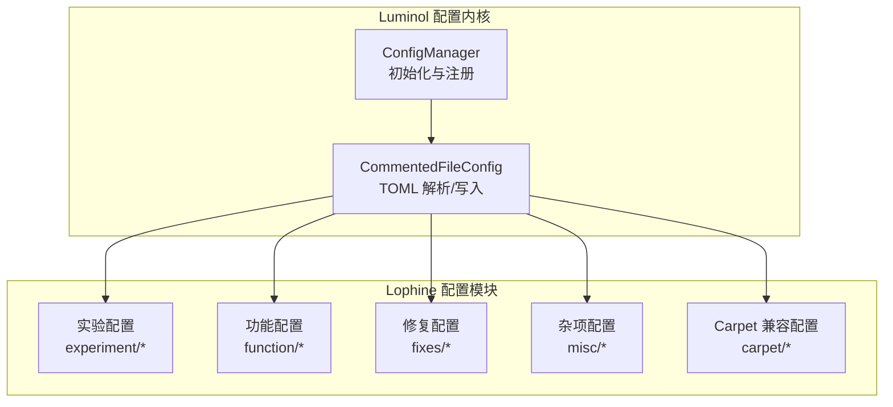
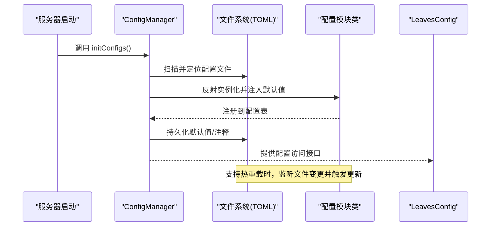
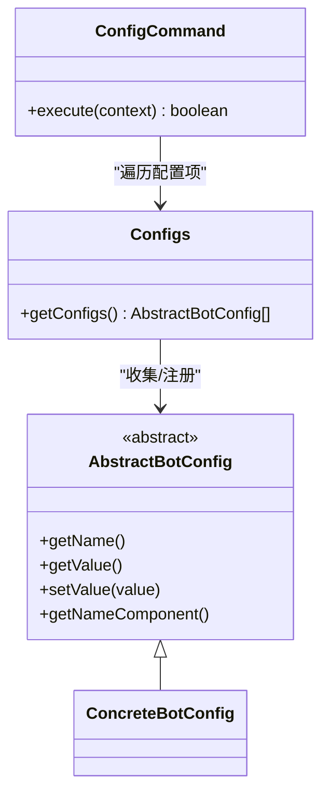
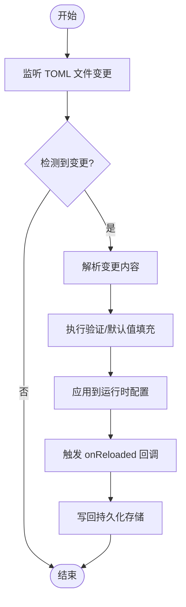
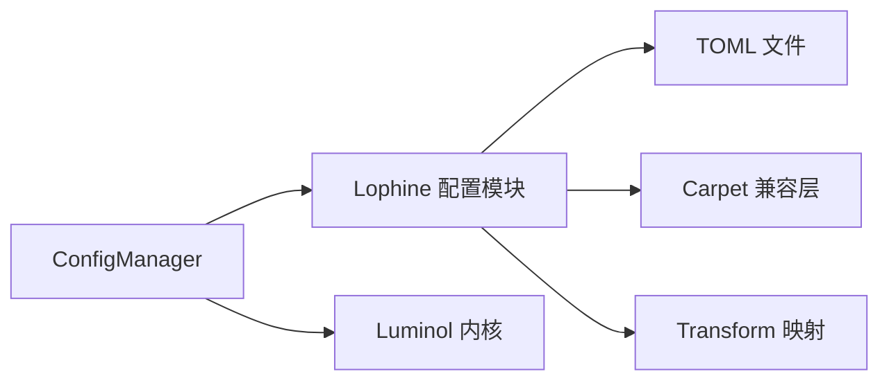

# 配置管理系统

<cite>
**本文档引用的文件**
- [LeavesConfig.java](file://lophine-server/src/main/java/org/leavesmc/leaves/LeavesConfig.java)
- [AbstractBotConfig.java](file://lophine-server/src/main/java/org/leavesmc/leaves/bot/agent/configs/AbstractBotConfig.java)
- [Configs.java](file://lophine-server/src/main/java/org/leavesmc/leaves/bot/agent/Configs.java)
- [ConfigCommand.java](file://lophine-server/src/main/java/org/leavesmc/leaves/command/bot/subcommands/ConfigCommand.java)
- [ReplayAPIConfig.java](file://lophine-server/src/main/java/fun/bm/lophine/config/modules/function/ReplayAPIConfig.java)
- [AutoUpdateConfig.java](file://lophine-server/src/main/java/fun/bm/lophine/config/modules/misc/AutoUpdateConfig.java)
- [GeneralCompatConfig.java](file://lophine-server/src/main/java/fun/bm/lophine/carpet/config/modules/GeneralCompatConfig.java)
- [ConfigManager.java](file://lophine-server/luminol-patches/features/0001-Rebrand-to-Lophine.patch)
- [Carpet-features.patch](file://lophine-server/luminol-patches/features/0006-Carpet-features.patch)
- [Transformed-Configs.patch](file://lophine-server/luminol-patches/features/0002-Transformed-Configs.patch)
</cite>

## 目录
1. [简介](#简介)
2. [项目结构](#项目结构)
3. [核心组件](#核心组件)
4. [架构总览](#架构总览)
5. [详细组件分析](#详细组件分析)
6. [依赖关系分析](#依赖关系分析)
7. [性能考虑](#性能考虑)
8. [故障排除指南](#故障排除指南)
9. [结论](#结论)
10. [附录](#附录)

## 简介
本文件系统性阐述 Lophine 的配置管理系统，重点覆盖以下方面：
- 基于 TOML 格式的配置文件结构与层级组织
- LeavesConfig 的核心配置管理与动态更新机制
- 实验配置、功能配置等不同配置类型的分类与管理策略
- 配置验证、默认值处理与热重载能力
- 配置系统的扩展方法与自定义配置项添加指南
- 运行时生命周期管理与持久化机制

## 项目结构
Lophine 的配置系统由三层组成：
- Luminol 配置内核：负责加载、解析、持久化与热重载
- Lophine 配置模块：按功能域划分的配置类集合（实验、功能、修复、杂项等）
- Carpet 兼容层：将外部 Carpet/AMS/TIS 等兼容规则映射到 Lophine 配置

图表来源
- [ConfigManager.java:11-23](file://lophine-server/luminol-patches/features/0001-Rebrand-to-Lophine.patch#L11-L23)
- [Carpet-features.patch:15-21](file://lophine-server/luminol-patches/features/0006-Carpet-features.patch#L15-L21)

章节来源
- [ConfigManager.java:11-23](file://lophine-server/luminol-patches/features/0001-Rebrand-to-Lophine.patch#L11-L23)
- [Carpet-features.patch:15-21](file://lophine-server/luminol-patches/features/0006-Carpet-features.patch#L15-L21)

## 核心组件
- LeavesConfig：服务器级配置入口，提供全局配置访问与生命周期钩子
- AbstractBotConfig / Configs：机器人配置抽象与集中注册，支持命令行查询与修改
- 各配置模块类：以注解驱动声明配置项、默认值、注释与热重载支持
- ConfigManager：注册并初始化各配置实例，建立 TOML 文件与 Java 字段的映射

章节来源
- [LeavesConfig.java](file://lophine-server/src/main/java/org/leavesmc/leaves/LeavesConfig.java)
- [AbstractBotConfig.java](file://lophine-server/src/main/java/org/leavesmc/leaves/bot/agent/configs/AbstractBotConfig.java)
- [Configs.java](file://lophine-server/src/main/java/org/leavesmc/leaves/bot/agent/Configs.java)
- [ConfigCommand.java](file://lophine-server/src/main/java/org/leavesmc/leaves/command/bot/subcommands/ConfigCommand.java)

## 架构总览
Lophine 配置系统采用“注解驱动 + 内核托管”的模式：
- 注解声明配置项（名称、类别、注释、是否支持热重载）
- Luminol 内核负责扫描、加载、持久化与热重载
- TOML 文件作为唯一事实来源，Java 字段作为运行时视图
- 部分配置通过 Transform 机制映射到其他实例，实现跨实例共享或兼容

图表来源
- [ConfigManager.java:11-23](file://lophine-server/luminol-patches/features/0001-Rebrand-to-Lophine.patch#L11-L23)
- [ReplayAPIConfig.java:30-34](file://lophine-server/src/main/java/fun/bm/lophine/config/modules/function/ReplayAPIConfig.java#L30-L34)

## 详细组件分析

### LeavesConfig：核心配置入口与生命周期
- 职责
  - 提供统一的配置访问入口
  - 维护配置模块的注册与生命周期回调
  - 协调热重载与持久化流程
- 关键点
  - 与 Luminol 内核集成，确保 TOML 文件路径、命名空间与注解一致
  - 在 onLoaded/onReloaded 等钩子中执行业务初始化（如缓存池初始化）

章节来源
- [LeavesConfig.java](file://lophine-server/src/main/java/org/leavesmc/leaves/LeavesConfig.java)

### 配置模块类：注解驱动的声明式配置
- 常见注解
  - @ConfigClassInfo：声明类别、名称、目录、注释
  - @ConfigInfo：声明字段名、注释
  - @HotReloadUnsupported：标记不支持热重载的配置项
- 默认值与验证
  - 默认值直接在字段上声明
  - 验证逻辑可通过 onLoaded 回调进行约束与校验
- 示例
  - 自动更新配置：启用开关与下载路径等
  - 回放 API 配置：缓存开关、缓存时间与大小，以及加载后的初始化

章节来源
- [AutoUpdateConfig.java:13-29](file://lophine-server/src/main/java/fun/bm/lophine/config/modules/misc/AutoUpdateConfig.java#L13-L29)
- [ReplayAPIConfig.java:14-34](file://lophine-server/src/main/java/fun/bm/lophine/config/modules/function/ReplayAPIConfig.java#L14-L34)

### 机器人配置：AbstractBotConfig 与命令行交互
- 抽象基类
  - 定义配置项的类型、名称、当前值与显示组件
  - 统一的读取/写入接口，便于命令行与 GUI 使用
- 集中注册
  - Configs 类统一收集所有机器人配置项，供命令使用
- 命令行交互
  - ConfigCommand 支持列出指定机器人的所有配置项及其当前值
  - 权限控制：可配置是否允许玩家修改

图表来源
- [AbstractBotConfig.java](file://lophine-server/src/main/java/org/leavesmc/leaves/bot/agent/configs/AbstractBotConfig.java)
- [Configs.java](file://lophine-server/src/main/java/org/leavesmc/leaves/bot/agent/Configs.java)
- [ConfigCommand.java:47-102](file://lophine-server/src/main/java/org/leavesmc/leaves/command/bot/subcommands/ConfigCommand.java#L47-L102)

章节来源
- [AbstractBotConfig.java](file://lophine-server/src/main/java/org/leavesmc/leaves/bot/agent/configs/AbstractBotConfig.java)
- [Configs.java](file://lophine-server/src/main/java/org/leavesmc/leaves/bot/agent/Configs.java)
- [ConfigCommand.java:47-102](file://lophine-server/src/main/java/org/leavesmc/leaves/command/bot/subcommands/ConfigCommand.java#L47-L102)

### 配置分类与管理策略
- 实验配置（experiment）：新特性或试验性功能，通常带有风险提示与测试警告
- 功能配置（function）：增强服务器功能的可选特性，如协议扩展、容器扩容等
- 修复配置（fixes）：针对已知问题的修复开关
- 杂项配置（misc）：通用设置，如自动更新、网络限制等
- Carpet 兼容配置（carpet）：将外部兼容规则映射到 Lophine 的现有实现

章节来源
- [GeneralCompatConfig.java:10-29](file://lophine-server/src/main/java/fun/bm/lophine/carpet/config/modules/GeneralCompatConfig.java#L10-L29)

### 热重载与持久化机制
- 热重载支持
  - 通过 @HotReloadUnsupported 标记不支持热重载的配置项
  - Luminol 内核监听 TOML 文件变更，触发对应模块的 onReloaded 回调
- 持久化
  - 写入默认值与注释，保持注释与结构稳定
  - 对于不支持热重载的项，需重启生效

图表来源
- [ReplayAPIConfig.java:30-34](file://lophine-server/src/main/java/fun/bm/lophine/config/modules/function/ReplayAPIConfig.java#L30-L34)

## 依赖关系分析
- Luminol 与 Lophine 的耦合
  - 通过 ConfigManager 注册 Lophine 配置模块
  - 通过 Transform 机制将部分配置映射到其他实例，减少重复维护
- 配置模块间的依赖
  - 某些模块在加载后会初始化外部资源（如缓存池），需注意顺序与异常处理

图表来源
- [ConfigManager.java:11-23](file://lophine-server/luminol-patches/features/0001-Rebrand-to-Lophine.patch#L11-L23)
- [Transformed-Configs.patch:24-29](file://lophine-server/luminol-patches/features/0002-Transformed-Configs.patch#L24-L29)

章节来源
- [ConfigManager.java:11-23](file://lophine-server/luminol-patches/features/0001-Rebrand-to-Lophine.patch#L11-L23)
- [Transformed-Configs.patch:24-29](file://lophine-server/luminol-patches/features/0002-Transformed-Configs.patch#L24-L29)

## 性能考虑
- 热重载对性能的影响
  - 尽量避免频繁变更大量配置项
  - 对大体量配置（如缓存大小）建议批量调整并一次性应用
- 初始化成本
  - onLoaded 中的初始化应尽量轻量，避免阻塞启动
- 文件 I/O
  - TOML 写入应合并批处理，减少磁盘写入次数

## 故障排除指南
- 配置未生效
  - 检查 TOML 文件是否存在且可写
  - 确认注解声明与文件路径一致
  - 对不支持热重载的项，需重启服务
- 默认值缺失或注释丢失
  - 触发一次保存操作，确保默认值与注释写回
- 权限问题
  - 机器人配置命令需满足权限要求
- 兼容性问题
  - 检查 Transform 映射是否正确，确认目标实例存在

章节来源
- [ConfigCommand.java:54-57](file://lophine-server/src/main/java/org/leavesmc/leaves/command/bot/subcommands/ConfigCommand.java#L54-L57)
- [ReplayAPIConfig.java:30-34](file://lophine-server/src/main/java/fun/bm/lophine/config/modules/function/ReplayAPIConfig.java#L30-L34)

## 结论
Lophine 的配置系统通过注解驱动与 Luminol 内核的结合，实现了清晰的配置分类、可靠的持久化与灵活的热重载能力。借助 Transform 机制与模块化的配置类设计，系统既保证了扩展性，又降低了维护成本。建议在新增配置时遵循既有注解规范与生命周期钩子，确保一致性与稳定性。

## 附录

### 配置文件结构与层级组织
- 文件格式：TOML
- 层级组织：按 @ConfigClassInfo 的 category 与 name 组织目录结构
- 注释：通过 @ConfigInfo 的 comments 字段生成，便于用户理解

章节来源
- [GeneralCompatConfig.java:10-17](file://lophine-server/src/main/java/fun/bm/lophine/carpet/config/modules/GeneralCompatConfig.java#L10-L17)

### 自定义配置项添加指南
- 步骤
  - 新建配置类，使用 @ConfigClassInfo 声明类别与名称
  - 使用 @ConfigInfo 声明字段与注释
  - 如不支持热重载，添加 @HotReloadUnsupported
  - 在 ConfigManager 中注册（如需）
  - 在 onLoaded/onReloaded 中实现业务逻辑
- 注意事项
  - 默认值直接在字段上声明
  - 复杂验证逻辑放在回调中执行
  - 对于跨实例映射，使用 Transform 机制

章节来源
- [AutoUpdateConfig.java:13-29](file://lophine-server/src/main/java/fun/bm/lophine/config/modules/misc/AutoUpdateConfig.java#L13-L29)
- [ReplayAPIConfig.java:14-34](file://lophine-server/src/main/java/fun/bm/lophine/config/modules/function/ReplayAPIConfig.java#L14-L34)
- [Carpet-features.patch:15-21](file://lophine-server/luminol-patches/features/0006-Carpet-features.patch#L15-L21)
- [Transformed-Configs.patch:24-29](file://lophine-server/luminol-patches/features/0002-Transformed-Configs.patch#L24-L29)