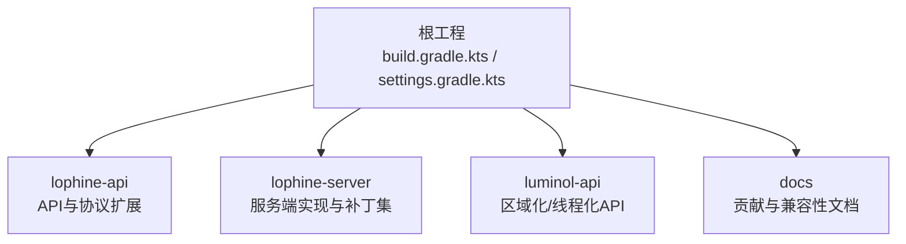
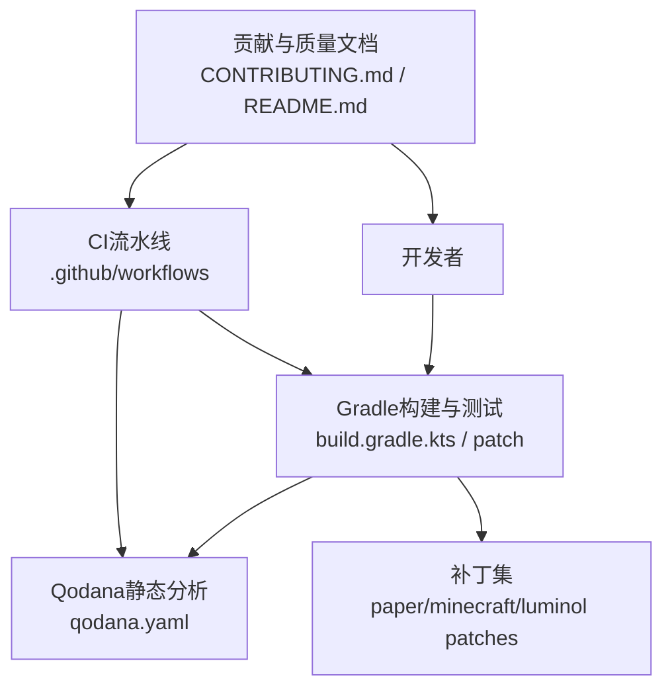
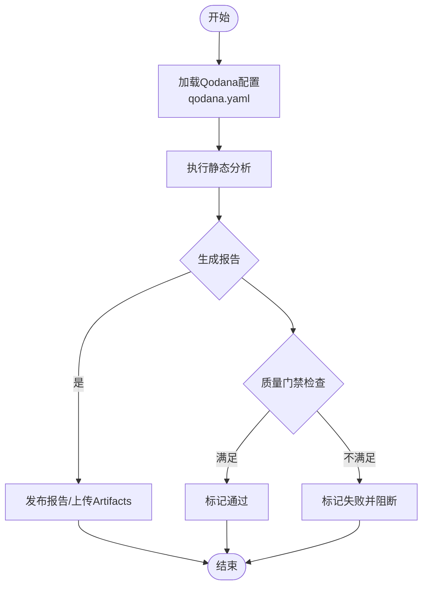
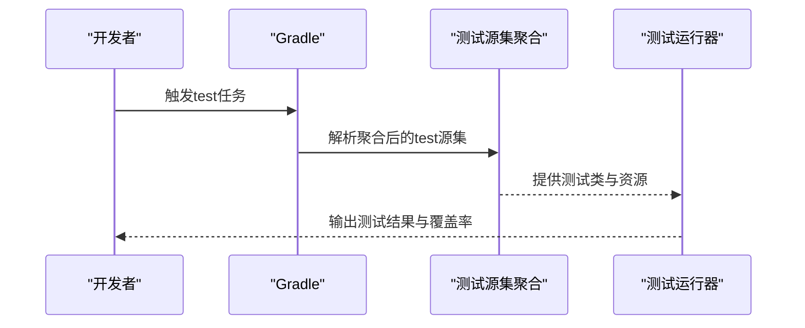
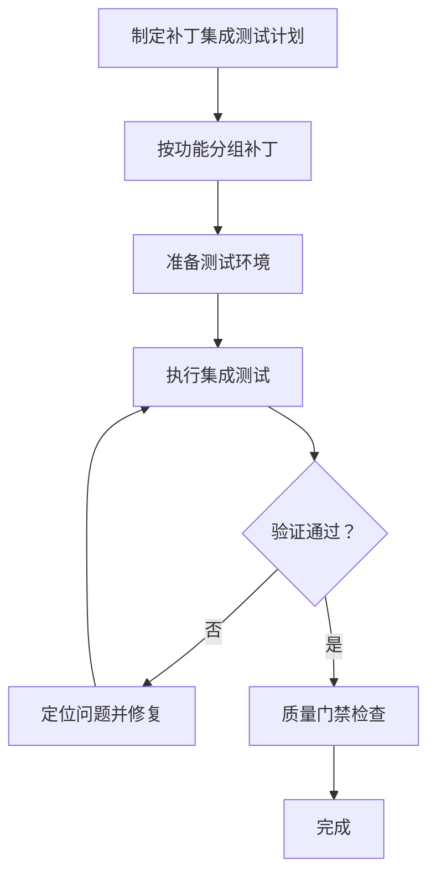
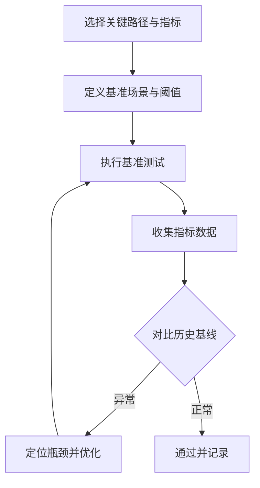
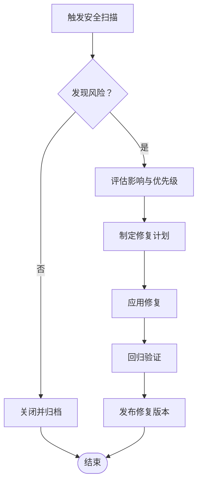
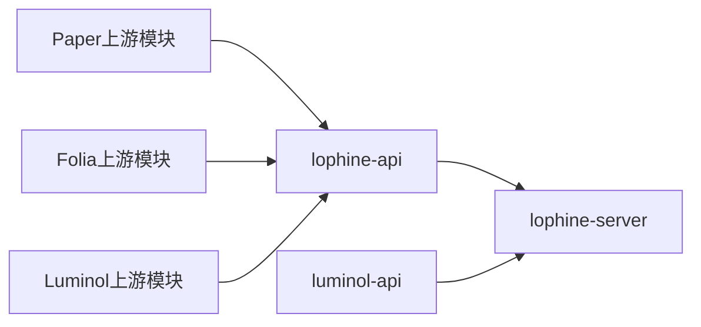

# 测试与质量保证

<cite>
**本文引用的文件**
- [build.gradle.kts](file://build.gradle.kts)
- [settings.gradle.kts](file://settings.gradle.kts)
- [qodana.yaml](file://qodana.yaml)
- [README.md](file://README.md)
- [CONTRIBUTING.md](file://docs/CONTRIBUTING.md)
- [CONTRIBUTING_EN.md](file://docs/CONTRIBUTING_EN.md)
- [lophine-api\build.gradle.kts.patch](file://lophine-api/build.gradle.kts.patch)
- [lophine-server\build.gradle.kts.patch](file://lophine-server/build.gradle.kts.patch)
- [lophine-server\paper-patches\features\0001-Rebrand-to-Lophine.patch](file://lophine-server/paper-patches/features/0001-Rebrand-to-Lophine.patch)
- [lophine-server\luminol-patches\features\0001-Rebrand-to-Lophine.patch](file://lophine-server/luminol-patches/features/0001-Rebrand-to-Lophine.patch)
- [lophine-server\minecraft-patches\features\0001-Add-config-to-disable-some-check-for-operators.patch](file://lophine-server/minecraft-patches/features/0001-Add-config-to-disable-some-check-for-operators.patch)
- [lophine-server\minecraft-patches\features\0002-Add-config-to-enable-cross-region-damage-trace.patch](file://lophine-server/minecraft-patches/features/0002-Add-config-to-enable-cross-region-damage-trace.patch)
- [lophine-server\minecraft-patches\features\0003-Add-config-to-enable-raytracing-tracker.patch](file://lophine-server/minecraft-patches/features/0003-Add-config-to-enable-raytracing-tracker.patch)
- [lophine-server\minecraft-patches\features\0004-Add-config-to-enable-function-command.patch](file://lophine-server/minecraft-patches/features/0004-Add-config-to-enable-function-command.patch)
- [lophine-server\minecraft-patches\features\0005-Add-config-to-enable-save-all-command.patch](file://lophine-server/minecraft-patches/features/0005-Add-config-to-enable-save-all-command.patch)
- [lophine-server\minecraft-patches\features\0006-Add-config-to-enable-scoreboard-command.patch](file://lophine-server/minecraft-patches/features/0006-Add-config-to-enable-scoreboard-command.patch)
- [lophine-server\minecraft-patches\features\0007-Add-config-to-enable-tick-command.patch](file://lophine-server/minecraft-patches/features/0007-Add-config-to-enable-tick-command.patch)
- [lophine-server\minecraft-patches\features\0008-Fix-datapack-command-save-function.patch](file://lophine-server/minecraft-patches/features/0008-Fix-datapack-command-save-function.patch)
- [lophine-server\minecraft-patches\features\0009-Leaves-Base-Protocol-Core.patch](file://lophine-server/minecraft-patches/features/0009-Leaves-Base-Protocol-Core.patch)
- [lophine-server\minecraft-patches\features\0010-Leaves-Configurable-trading-with-the-void.patch](file://lophine-server/minecraft-patches/features/0010-Leaves-Configurable-trading-with-the-void.patch)
- [lophine-server\minecraft-patches\features\0011-Leaves-Item-overstack-util.patch](file://lophine-server/minecraft-patches/features/0011-Leaves-Item-overstack-util.patch)
- [lophine-server\minecraft-patches\features\0012-Leaves-Old-Explosion-Damage-Calculator.patch](file://lophine-server/minecraft-patches/features/0012-Leaves-Old-Explosion-Damage-Calculator.patch)
- [lophine-server\minecraft-patches\features\0013-Leaves-Old-raid-behavior.patch](file://lophine-server/minecraft-patches/features/0013-Leaves-Old-raid-behavior.patch)
- [lophine-server\minecraft-patches\features\0014-Leaves-Redstone-Shears-Wrench.patch](file://lophine-server/minecraft-patches/features/0014-Leaves-Redstone-Shears-Wrench.patch)
- [lophine-server\minecraft-patches\features\0015-Leaves-Servux-Protocol.patch](file://lophine-server/minecraft-patches/features/0015-Leaves-Servux-Protocol.patch)
- [lophine-server\minecraft-patches\features\0016-LeavesHooks.patch](file://lophine-server/minecraft-patches/features/0016-LeavesHooks.patch)
- [lophine-server\minecraft-patches\features\0017-Compatibility-fix-for-Raid-Revert-and-Cross-Region-D.patch](file://lophine-server/minecraft-patches/features/0017-Compatibility-fix-for-Raid-Revert-and-Cross-Region-D.patch)
- [lophine-server\minecraft-patches\features\0018-Purpur-Barrels-and-enderchests-6-rows.patch](file://lophine-server/minecraft-patches/features/0018-Purpur-Barrels-and-enderchests-6-rows.patch)
- [lophine-server\minecraft-patches\features\0019-I18n-support.patch](file://lophine-server/minecraft-patches/features/0019-I18n-support.patch)
- [lophine-server\minecraft-patches\features\0020-Old-zombie-reinforcement.patch](file://lophine-server/minecraft-patches/features/0020-Old-zombie-reinforcement.patch)
- [lophine-server\minecraft-patches\features\0021-Spawn-invulnerable-time.patch](file://lophine-server/minecraft-patches/features/0021-Spawn-invulnerable-time.patch)
- [lophine-server\minecraft-patches\features\0022-Leaves-Fakeplayer.patch](file://lophine-server/minecraft-patches/features/0022-Leaves-Fakeplayer.patch)
- [lophine-server\minecraft-patches\features\0023-Modify-merge-ItemEntity-logic.patch](file://lophine-server/minecraft-patches/features/0023-Modify-merge-ItemEntity-logic.patch)
- [lophine-server\minecraft-patches\features\0024-Leaves-Syncmatica-Protocol.patch](file://lophine-server/minecraft-patches/features/0024-Leaves-Syncmatica-Protocol.patch)
- [lophine-server\minecraft-patches\features\0025-Leaves-BBOR-Protocol.patch](file://lophine-server/minecraft-patches/features/0025-Leaves-BBOR-Protocol.patch)
- [lophine-server\minecraft-patches\features\0026-Leaves-Jade-Protocol.patch](file://lophine-server/minecraft-patches/features/0026-Leaves-Jade-Protocol.patch)
- [lophine-server\minecraft-patches\features\0027-Leaves-Xaero-Map-Protocol.patch](file://lophine-server/minecraft-patches/features/0027-Leaves-Xaero-Map-Protocol.patch)
- [lophine-server\minecraft-patches\features\0028-Leaves-Support-REI-protocol.patch](file://lophine-server/minecraft-patches/features/0028-Leaves-Support-REI-protocol.patch)
- [lophine-server\minecraft-patches\features\0029-Leaves-Wool-Hopper-Counter.patch](file://lophine-server/minecraft-patches/features/0029-Leaves-Wool-Hopper-Counter.patch)
- [lophine-server\minecraft-patches\features\0030-Leaves-Alternative-block-placement-Protocol.patch](file://lophine-server/minecraft-patches/features/0030-Leaves-Alternative-block-placement-Protocol.patch)
- [lophine-server\minecraft-patches\features\0031-Leaves-Replay-Mod-API.patch](file://lophine-server/minecraft-patches/features/0031-Leaves-Replay-Mod-API.patch)
- [lophine-server\minecraft-patches\features\0032-Leaves-Catch-update-suppression-crash.patch](file://lophine-server/minecraft-patches/features/0032-Leaves-Catch-update-suppression-crash.patch)
- [lophine-server\minecraft-patches\features\0033-Leaves-CCE-update-suppression.patch](file://lophine-server/minecraft-patches/features/0033-Leaves-CCE-update-suppression.patch)
- [lophine-server\minecraft-patches\features\0034-Leaves-Redstone-ignore-upwards-update.patch](file://lophine-server/minecraft-patches/features/0034-Leaves-Redstone-ignore-upwards-update.patch)
- [lophine-server\minecraft-patches\features\0035-Instant-Block-Updater.patch](file://lophine-server/minecraft-patches/features/0035-Instant-Block-Updater.patch)
- [lophine-server\minecraft-patches\features\0036-Revert-TrapDoorBlock-changes-form-Paper.patch](file://lophine-server/minecraft-patches/features/0036-Revert-TrapDoorBlock-changes-form-Paper.patch)
- [lophine-server\minecraft-patches\features\0037-Leaves-Prevent-loss-of-item-drops-due-to-update-supp.patch](file://lophine-server/minecraft-patches/features/0037-Leaves-Prevent-loss-of-item-drops-due-to-update-supp.patch)
- [lophine-server\minecraft-patches\features\0038-Leaves-Old-Block-remove-behaviour.patch](file://lophine-server/minecraft-patches/features/0038-Leaves-Old-Block-remove-behaviour.patch)
- [lophine-server\minecraft-patches\features\0039-Leaves-Do-not-reset-placed-block-on-exception-Do-not.patch](file://lophine-server/minecraft-patches/features/0039-Leaves-Do-not-reset-placed-block-on-exception-Do-not.patch)
- [lophine-server\minecraft-patches\features\0040-Global-Entities-Counter.patch](file://lophine-server/minecraft-patches/features/0040-Global-Entities-Counter.patch)
- [lophine-server\minecraft-patches\features\0041-Add-null-check-in-RegionizedWorldData-conections.patch](file://lophine-server/minecraft-patches/features/0041-Add-null-check-in-RegionizedWorldData-conections.patch)
- [lophine-server\minecraft-patches\features\0042-Add-removed-check-before-all-checks-start-in-addEffe.patch](file://lophine-server/minecraft-patches/features/0042-Add-removed-check-before-all-checks-start-in-addEffe.patch)
- [lophine-server\minecraft-patches\features\0043-Leaves-Creative-fly-no-clip.patch](file://lophine-server/minecraft-patches/features/0043-Leaves-Creative-fly-no-clip.patch)
- [lophine-server\minecraft-patches\features\0044-Carpet-features.patch](file://lophine-server/minecraft-patches/features/0044-Carpet-features.patch)
- [lophine-server\paper-patches\features\0001-Rebrand-to-Lophine.patch](file://lophine-server/paper-patches/features/0001-Rebrand-to-Lophine.patch)
- [lophine-server\paper-patches\features\0002-Purpur-Barrels-and-enderchests-6-rows.patch](file://lophine-server/paper-patches/features/0002-Purpur-Barrels-and-enderchests-6-rows.patch)
- [lophine-server\paper-patches\features\0003-Leaves-Leaves-Protocol-Core.patch](file://lophine-server/paper-patches/features/0003-Leaves-Leaves-Protocol-Core.patch)
- [lophine-server\paper-patches\features\0004-LeavesHooks.patch](file://lophine-server/paper-patches/features/0004-LeavesHooks.patch)
- [lophine-server\paper-patches\features\0005-Add-cancel-task-by-task-id-in-FoliaGlobalRegionSched.patch](file://lophine-server/paper-patches/features/0005-Add-cancel-task-by-task-id-in-FoliaGlobalRegionSched.patch)
- [lophine-server\paper-patches\features\0006-Leaves-Leaves-Fakeplayer.patch](file://lophine-server/paper-patches/features/0006-Leaves-Leaves-Fakeplayer.patch)
- [lophine-server\paper-patches\features\0007-Leaves-Replay-Mod-API.patch](file://lophine-server/paper-patches/features/0007-Leaves-Replay-Mod-API.patch)
- [lophine-server\luminol-patches\features\0001-Rebrand-to-Lophine.patch](file://lophine-server/luminol-patches/features/0001-Rebrand-to-Lophine.patch)
- [lophine-server\luminol-patches\features\0002-Transformed-Configs.patch](file://lophine-server/luminol-patches/features/0002-Transformed-Configs.patch)
- [lophine-server\luminol-patches\features\0003-Leaves-Item-overstack-util.patch](file://lophine-server/luminol-patches/features/0003-Leaves-Item-overstack-util.patch)
- [lophine-server\luminol-patches\features\0004-Leaves-Fakeplayer.patch](file://lophine-server/luminol-patches/features/0004-Leaves-Fakeplayer.patch)
- [lophine-server\luminol-patches\features\0005-Diff-in-auto-update-patch.patch](file://lophine-server/luminol-patches/features/0005-Diff-in-auto-update-patch.patch)
- [lophine-server\luminol-patches\features\0006-Carpet-features.patch](file://lophine-server/luminol-patches/features/0006-Carpet-features.patch)
- [luminol-api\src\main\java\org\leavesmc\leaves\plugin\Features.java](file://luminol-api/src/main/java/org/leavesmc/leaves/plugin/Features.java)
- [luminol-api\src\main\java\org\leavesmc\leaves\plugin\FeatureManager.java](file://luminol-api/src/main/java/org/leavesmc/leaves/plugin/FeatureManager.java)
</cite>

## 目录
1. [引言](#引言)
2. [项目结构](#项目结构)
3. [核心组件](#核心组件)
4. [架构总览](#架构总览)
5. [详细组件分析](#详细组件分析)
6. [依赖分析](#依赖分析)
7. [性能考虑](#性能考虑)
8. [故障排查指南](#故障排查指南)
9. [结论](#结论)
10. [附录](#附录)

## 引言
本文件面向Lophine项目的测试与质量保证，系统化梳理测试策略、质量保证体系、代码质量检查工具、单元/集成/性能测试实施指南、持续集成与部署流程、代码审查标准与质量门禁、性能基准与压力测试方法、安全漏洞扫描与修复流程，以及社区贡献的质量要求与验收标准。文档以仓库现有配置与实现为依据，结合可操作性给出实践建议。

## 项目结构
Lophine采用多模块Gradle工程组织，核心模块包括：
- 根工程：统一版本与插件配置，定义全局属性与依赖管理
- lophine-api：对外API与协议扩展（含Paper/Folia补丁）
- lophine-server：服务端实现与功能特性（含大量补丁集）
- luminol-api：底层区域化与线程化能力的API层
- 文档与脚本：贡献指南、环境脚本等

图表来源
- [build.gradle.kts](file://build.gradle.kts)
- [settings.gradle.kts](file://settings.gradle.kts)

章节来源
- [build.gradle.kts](file://build.gradle.kts)
- [settings.gradle.kts](file://settings.gradle.kts)

## 核心组件
- 质量检查工具：Qodana（静态分析）作为主要入口，配合Gradle任务与IDE检查
- 测试框架：通过Gradle源集与资源集聚合，支持在API与服务端模块中运行测试
- 补丁与兼容：大量feature补丁用于功能增强与兼容性修复，需纳入变更控制与回归验证
- 配置与文档：贡献指南与README提供质量门禁与协作规范

章节来源
- [qodana.yaml](file://qodana.yaml)
- [lophine-api\build.gradle.kts.patch](file://lophine-api/build.gradle.kts.patch)
- [lophine-server\build.gradle.kts.patch](file://lophine-server/build.gradle.kts.patch)
- [README.md](file://README.md)
- [CONTRIBUTING.md](file://docs/CONTRIBUTING.md)
- [CONTRIBUTING_EN.md](file://docs/CONTRIBUTING_EN.md)

## 架构总览
下图展示测试与质量保证在工程中的位置与交互关系：

图表来源
- [qodana.yaml](file://qodana.yaml)
- [build.gradle.kts](file://build.gradle.kts)
- [lophine-api\build.gradle.kts.patch](file://lophine-api/build.gradle.kts.patch)
- [lophine-server\build.gradle.kts.patch](file://lophine-server/build.gradle.kts.patch)

## 详细组件分析

### 代码质量检查与Qodana
- 工具定位：Qodana作为静态分析入口，与Gradle任务协同工作
- 配置要点：通过qodana.yaml定义分析范围、规则集与报告输出；建议在CI中启用并设置质量门禁
- 运行方式：本地可直接调用Qodana命令；CI中建议在构建成功后执行，失败即阻断

图表来源
- [qodana.yaml](file://qodana.yaml)

章节来源
- [qodana.yaml](file://qodana.yaml)

### 单元测试与测试源集聚合
- 源集聚合：API与服务端模块通过patch文件将多个上游模块（Paper/Folia/Luminol）的test源集与资源集合并到当前模块，便于统一运行测试
- 建议实践：
  - 在每个模块内按功能划分测试包
  - 使用参数化测试覆盖边界条件
  - 对关键路径（协议、补丁逻辑）编写隔离测试

图表来源
- [lophine-api\build.gradle.kts.patch](file://lophine-api/build.gradle.kts.patch)
- [lophine-server\build.gradle.kts.patch](file://lophine-server/build.gradle.kts.patch)

章节来源
- [lophine-api\build.gradle.kts.patch](file://lophine-api/build.gradle.kts.patch)
- [lophine-server\build.gradle.kts.patch](file://lophine-server/build.gradle.kts.patch)

### 集成测试与补丁验证
- 补丁驱动的集成场景：大量feature补丁涉及协议、命令、机制与兼容性修复，应建立补丁级集成测试矩阵
- 建议策略：
  - 将相关补丁分组（如协议、命令、机制），针对每组编写集成测试
  - 利用服务端启动脚本或容器化环境进行端到端验证
  - 对关键配置项（如cross-region damage trace、ray tracing tracker等）进行专项回归

图表来源
- [lophine-server\minecraft-patches\features\0001-Add-config-to-disable-some-check-for-operators.patch](file://lophine-server/minecraft-patches/features/0001-Add-config-to-disable-some-check-for-operators.patch)
- [lophine-server\minecraft-patches\features\0002-Add-config-to-enable-cross-region-damage-trace.patch](file://lophine-server/minecraft-patches/features/0002-Add-config-to-enable-cross-region-damage-trace.patch)
- [lophine-server\minecraft-patches\features\0003-Add-config-to-enable-raytracing-tracker.patch](file://lophine-server/minecraft-patches/features/0003-Add-config-to-enable-raytracing-tracker.patch)
- [lophine-server\paper-patches\features\0001-Rebrand-to-Lophine.patch](file://lophine-server/paper-patches/features/0001-Rebrand-to-Lophine.patch)
- [lophine-server\luminol-patches\features\0001-Rebrand-to-Lophine.patch](file://lophine-server/luminol-patches/features/0001-Rebrand-to-Lophine.patch)

章节来源
- [lophine-server\minecraft-patches\features\0001-Add-config-to-disable-some-check-for-operators.patch](file://lophine-server/minecraft-patches/features/0001-Add-config-to-disable-some-check-for-operators.patch)
- [lophine-server\minecraft-patches\features\0002-Add-config-to-enable-cross-region-damage-trace.patch](file://lophine-server/minecraft-patches/features/0002-Add-config-to-enable-cross-region-damage-trace.patch)
- [lophine-server\minecraft-patches\features\0003-Add-config-to-enable-raytracing-tracker.patch](file://lophine-server/minecraft-patches/features/0003-Add-config-to-enable-raytracing-tracker.patch)
- [lophine-server\paper-patches\features\0001-Rebrand-to-Lophine.patch](file://lophine-server/paper-patches/features/0001-Rebrand-to-Lophine.patch)
- [lophine-server\luminol-patches\features\0001-Rebrand-to-Lophine.patch](file://lophine-server/luminol-patches/features/0001-Rebrand-to-Lophine.patch)

### 性能测试与基准
- 基准测试：对关键路径（实体计数、协议处理、区域化更新）建立基准指标（TPS、延迟、内存占用）
- 压力测试：模拟高负载场景（大量bot、高频协议交互、复杂补丁组合），观察系统稳定性与退化点
- 工具建议：使用JMH进行热点方法基准；使用服务器端监控（JMX/Profiling）与日志分析

图表来源
- [luminol-api\src\main\java\org\leavesmc\leaves\plugin\FeatureManager.java](file://luminol-api/src/main/java/org/leavesmc/leaves/plugin/FeatureManager.java)
- [luminol-api\src\main\java\org\leavesmc\leaves\plugin\Features.java](file://luminol-api/src/main/java/org/leavesmc/leaves/plugin/Features.java)

章节来源
- [luminol-api\src\main\java\org\leavesmc\leaves\plugin\FeatureManager.java](file://luminol-api/src/main/java/org/leavesmc/leaves/plugin/FeatureManager.java)
- [luminol-api\src\main\java\org\leavesmc\leaves\plugin\Features.java](file://luminol-api/src/main/java/org/leavesmc/leaves/plugin/Features.java)

### 安全漏洞扫描与修复
- 扫描范围：依赖库、补丁差异、第三方协议实现
- 工具建议：依赖扫描（如OSV/Dependabot）、补丁差异审计、协议接口安全校验
- 修复流程：发现风险→评估影响→制定修复方案→回滚/替换/加固→回归验证→发布

图表来源
- [.github/dependabot.yml](file://dependabot.yml)

章节来源
- [.github/dependabot.yml](file://dependabot.yml)

### 社区贡献与质量门禁
- 贡献流程：遵循贡献指南，提交PR前完成本地测试与静态分析
- 代码审查：关注功能正确性、性能影响、兼容性与安全性
- 质量门禁：必须通过Qodana静态分析、单元测试与关键集成测试

章节来源
- [CONTRIBUTING.md](file://docs/CONTRIBUTING.md)
- [CONTRIBUTING_EN.md](file://docs/CONTRIBUTING_EN.md)
- [README.md](file://README.md)

## 依赖分析
- 模块间耦合：API与服务端通过补丁与协议紧密耦合；Luminol API提供底层能力支撑
- 外部依赖：Paper/Folia/Luminol上游模块通过patch聚合到当前工程
- 优化建议：减少循环依赖，明确模块职责边界；对补丁进行版本化管理与回归矩阵

图表来源
- [lophine-api\build.gradle.kts.patch](file://lophine-api/build.gradle.kts.patch)
- [lophine-server\build.gradle.kts.patch](file://lophine-server/build.gradle.kts.patch)

章节来源
- [lophine-api\build.gradle.kts.patch](file://lophine-api/build.gradle.kts.patch)
- [lophine-server\build.gradle.kts.patch](file://lophine-server/build.gradle.kts.patch)

## 性能考虑
- 关键路径优化：协议处理、实体计数、区域化更新
- 监控与剖析：启用JMX与Profiling，定期生成性能报告
- 回归防护：将性能测试纳入CI，设定阈值门禁

## 故障排查指南
- Qodana失败：逐条查看规则与告警，优先修复高风险问题
- 测试失败：定位失败用例，补充最小复现，必要时增加断言与边界覆盖
- 补丁冲突：核对补丁顺序与依赖，必要时进行回滚与重排
- 安全告警：根据扫描结果逐项处置，形成修复清单与验证记录

章节来源
- [qodana.yaml](file://qodana.yaml)
- [lophine-api\build.gradle.kts.patch](file://lophine-api/build.gradle.kts.patch)
- [lophine-server\build.gradle.kts.patch](file://lophine-server/build.gradle.kts.patch)

## 结论
Lophine的质量保证体系以Qodana静态分析为基础，辅以单元与集成测试、性能基准与压力测试、安全扫描与修复流程，并通过贡献指南与质量门禁确保社区协作质量。建议在CI中固化上述流程，持续改进测试矩阵与性能基线，保障项目长期稳定演进。

## 附录
- 参考文档与配置文件路径已在各节中明确标注，便于快速定位与落地执行