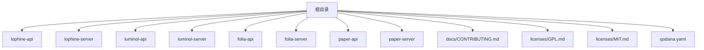
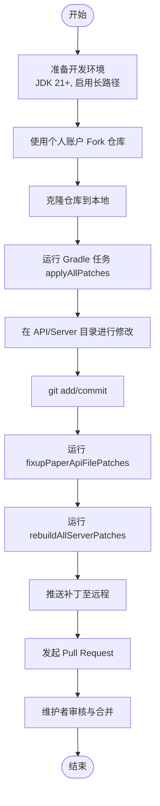
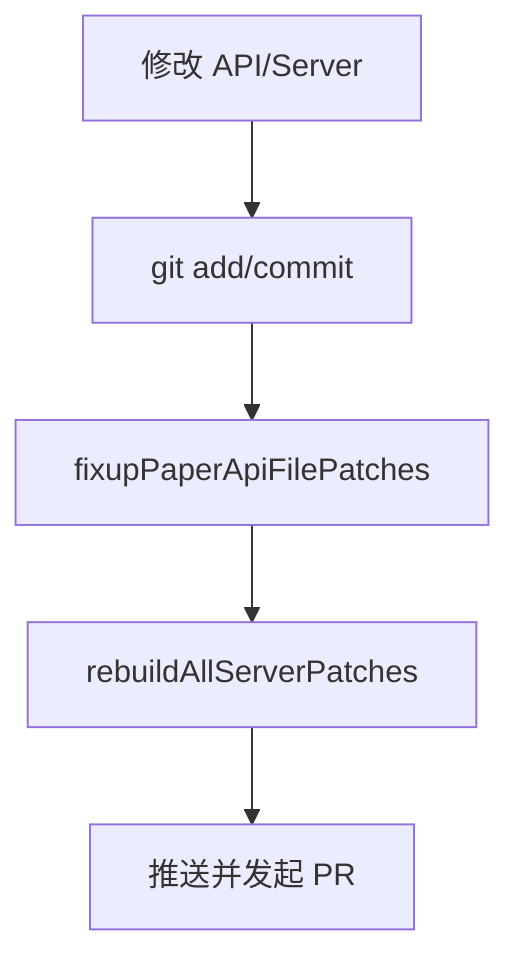
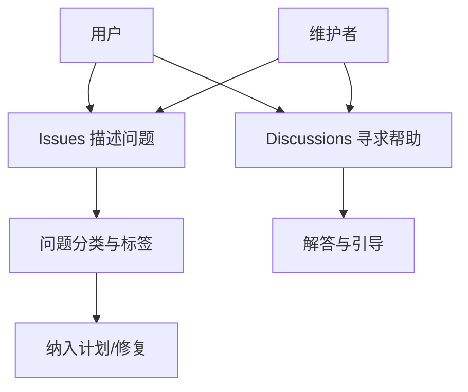
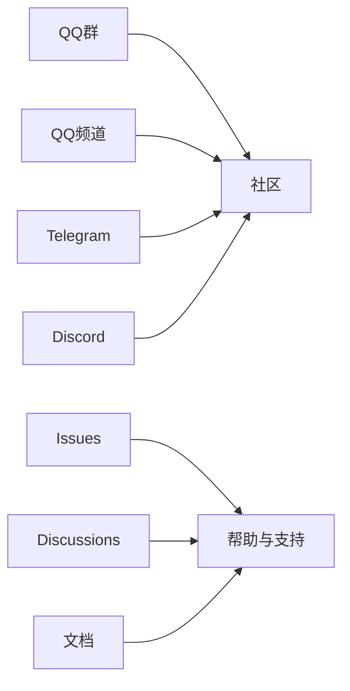
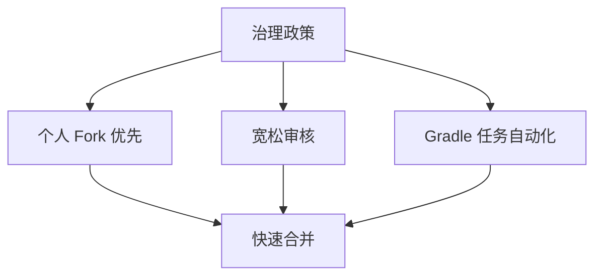
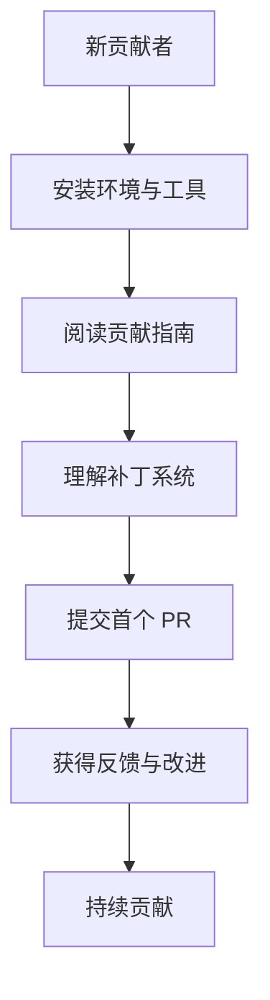
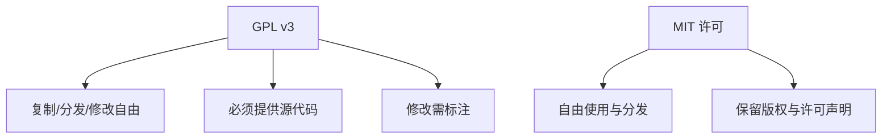
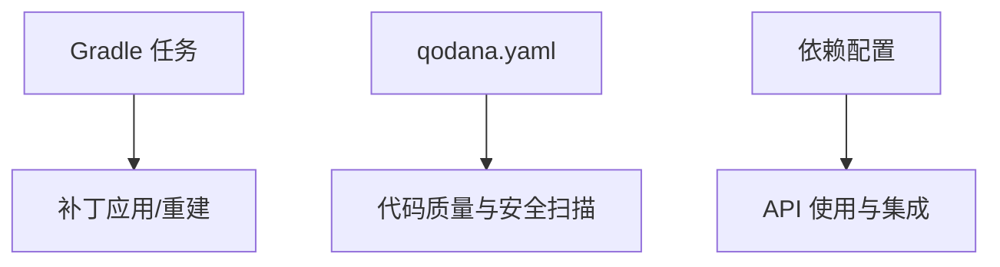

# 社区与贡献

<cite>
**本文引用的文件**   
- [CONTRIBUTING.md](file://docs/CONTRIBUTING.md)
- [CONTRIBUTING_EN.md](file://docs/CONTRIBUTING_EN.md)
- [README.md](file://README.md)
- [GPL.md](file://licenses/GPL.md)
- [MIT.md](file://licenses/MIT.md)
- [qodana.yaml](file://qodana.yaml)
</cite>

## 目录
1. [引言](#引言)
2. [项目结构](#项目结构)
3. [核心组件](#核心组件)
4. [架构总览](#架构总览)
5. [详细组件分析](#详细组件分析)
6. [依赖关系分析](#依赖关系分析)
7. [性能考量](#性能考量)
8. [故障排查指南](#故障排查指南)
9. [结论](#结论)
10. [附录](#附录)

## 引言
本指南面向希望参与 Lophine 社区与贡献的开发者与用户，系统化介绍贡献流程、社区规范、问题报告与功能请求标准、沟通渠道、治理与决策机制、新贡献者入门与培训资源、知识产权与许可证要求、社区活动与会议信息，以及项目路线图与优先级规划的现状与实践方式。

## 项目结构
Lophine 是基于 Luminol 的分支，围绕 Folia 平台提供优化与可配置的原版特性，同时通过补丁系统维护 API 与服务端的差异。项目采用多模块结构，核心包括：
- API 层：lophine-api、luminol-api、folia-api、paper-api
- 服务端层：lophine-server、luminol-server、folia-server、paper-server
- 文档与许可证：docs、licenses
- 构建与质量工具：gradle、qodana.yaml

图表来源
- [README.md:1-157](file://README.md#L1-L157)
- [CONTRIBUTING.md:31-68](file://docs/CONTRIBUTING.md#L31-L68)

章节来源
- [README.md:1-157](file://README.md#L1-L157)
- [CONTRIBUTING.md:31-68](file://docs/CONTRIBUTING.md#L31-L68)

## 核心组件
- 贡献流程与补丁系统：基于 git 的补丁体系，区分 API 与服务端两套目录，通过 Gradle 任务应用与重建补丁，确保变更可追踪且可合并。
- 开发环境：要求 JDK 21+ 与启用长路径支持，遵循统一的构建与验证流程。
- 社区沟通：提供 QQ 群、QQ 频道、Telegram、Discord 与 GitHub Issues/Discussions 多渠道支持。
- 许可证：项目主体遵循 GPL v3，部分组件采用 MIT 许可，贡献需符合相应许可条款。

章节来源
- [CONTRIBUTING.md:9-26](file://docs/CONTRIBUTING.md#L9-L26)
- [CONTRIBUTING.md:31-68](file://docs/CONTRIBUTING.md#L31-L68)
- [README.md:88-120](file://README.md#L88-L120)
- [GPL.md:1-677](file://licenses/GPL.md#L1-L677)
- [MIT.md:1-24](file://licenses/MIT.md#L1-L24)

## 架构总览
下图展示贡献流程的关键节点与工具链交互，从本地开发到补丁生成与 PR 提交的典型路径。

图表来源
- [CONTRIBUTING.md:43-83](file://docs/CONTRIBUTING.md#L43-L83)
- [CONTRIBUTING_EN.md:43-83](file://docs/CONTRIBUTING_EN.md#L43-L83)

章节来源
- [CONTRIBUTING.md:43-83](file://docs/CONTRIBUTING.md#L43-L83)
- [CONTRIBUTING_EN.md:43-83](file://docs/CONTRIBUTING_EN.md#L43-L83)

## 详细组件分析

### 贡献流程与补丁管理
- Fork 与分支策略：建议使用个人账户进行 Fork，避免组织账户导致无法编辑 PR 的问题。
- 补丁目录划分：lophine-api 与 lophine-server 分别对应 API 与服务端修改，便于分治与审查。
- 应用与重建补丁：通过 Gradle 任务应用补丁、生成新建文件补丁、重建现有补丁，最终提交 PR。
- 修改补丁：支持 fixup/squash 与 rebase 自动化，保持提交历史整洁。

图表来源
- [CONTRIBUTING.md:69-93](file://docs/CONTRIBUTING.md#L69-L93)
- [CONTRIBUTING_EN.md:72-96](file://docs/CONTRIBUTING_EN.md#L72-L96)

章节来源
- [CONTRIBUTING.md:9-17](file://docs/CONTRIBUTING.md#L9-L17)
- [CONTRIBUTING.md:31-68](file://docs/CONTRIBUTING.md#L31-L68)
- [CONTRIBUTING.md:69-93](file://docs/CONTRIBUTING.md#L69-L93)
- [CONTRIBUTING_EN.md:10-19](file://docs/CONTRIBUTING_EN.md#L10-L19)
- [CONTRIBUTING_EN.md:33-71](file://docs/CONTRIBUTING_EN.md#L33-L71)
- [CONTRIBUTING_EN.md:72-96](file://docs/CONTRIBUTING_EN.md#L72-L96)

### 问题报告与功能请求
- 清晰描述：提供问题现象、日志、环境信息与可复现步骤。
- 提交渠道：通过 GitHub Issues 提交问题；通过 Discussions 获取帮助与讨论。
- 反馈闭环：维护者将尽力协助定位与解决问题。

图表来源
- [README.md:105-113](file://README.md#L105-L113)
- [README.md:99-104](file://README.md#L99-L104)

章节来源
- [README.md:105-113](file://README.md#L105-L113)
- [README.md:99-104](file://README.md#L99-L104)

### 社区交流与联系方式
- 即时沟通：QQ 群、QQ 频道、Telegram、Discord
- 讨论与文档：GitHub Discussions、项目文档
- 贡献指南：中文与英文双语贡献指南

图表来源
- [README.md:88-104](file://README.md#L88-L104)

章节来源
- [README.md:88-104](file://README.md#L88-L104)

### 治理结构与决策机制
- 审核风格：PR 审核较为宽松，鼓励贡献者按流程完善细节。
- 组织账户限制：为保证可编辑性，不接受来自组织账户的 PR，需改用个人账户 Fork。
- 任务自动化：通过 Gradle 任务与补丁系统降低维护成本，提升合并效率。

图表来源
- [CONTRIBUTING.md:6-17](file://docs/CONTRIBUTING.md#L6-L17)
- [CONTRIBUTING_EN.md:6-19](file://docs/CONTRIBUTING_EN.md#L6-L19)

章节来源
- [CONTRIBUTING.md:6-17](file://docs/CONTRIBUTING.md#L6-L17)
- [CONTRIBUTING_EN.md:6-19](file://docs/CONTRIBUTING_EN.md#L6-L19)

### 新贡献者入门与培训资源
- 环境准备：JDK 21+、启用长路径支持、了解 git 基础。
- 学习路径：阅读贡献指南、理解补丁系统、参与 Discussions、提交首个 PR。
- 质量保障：遵循贡献流程、使用 Gradle 任务生成补丁、保持提交信息清晰。

图表来源
- [CONTRIBUTING.md:19-26](file://docs/CONTRIBUTING.md#L19-L26)
- [CONTRIBUTING.md:31-48](file://docs/CONTRIBUTING.md#L31-L48)
- [README.md:114-120](file://README.md#L114-L120)

章节来源
- [CONTRIBUTING.md:19-26](file://docs/CONTRIBUTING.md#L19-L26)
- [CONTRIBUTING.md:31-48](file://docs/CONTRIBUTING.md#L31-L48)
- [README.md:114-120](file://README.md#L114-L120)

### 知识产权与许可证
- 主体许可证：GPL v3，强调自由与版权保护、源代码可用性与修改标注义务。
- 其他组件：部分组件采用 MIT 许可，允许商业使用与再分发，但需保留版权与许可声明。
- 贡献合规：贡献者需确保所提交内容不侵犯第三方权利，并符合项目许可证要求。

图表来源
- [GPL.md:77-238](file://licenses/GPL.md#L77-L238)
- [GPL.md:345-403](file://licenses/GPL.md#L345-L403)
- [MIT.md:1-24](file://licenses/MIT.md#L1-L24)

章节来源
- [GPL.md:77-238](file://licenses/GPL.md#L77-L238)
- [GPL.md:345-403](file://licenses/GPL.md#L345-L403)
- [MIT.md:1-24](file://licenses/MIT.md#L1-L24)

### 社区活动与开发者会议
- 当前仓库未提供固定活动日程或会议纪要文件。
- 建议关注社区沟通渠道（QQ、Telegram、Discord）以获取活动通知与会议安排。

章节来源
- [README.md:88-104](file://README.md#L88-L104)

### 路线图与优先级规划
- 项目未提供独立的路线图文件，但可通过以下方式了解优先级与方向：
  - Issues 标签与里程碑（如存在）
  - Discussions 中的功能提议与投票
  - 提交记录与 PR 合并趋势
- 贡献者可结合自身兴趣与服务器需求，在 Discussions 中提出建议并参与讨论。

章节来源
- [README.md:105-113](file://README.md#L105-L113)
- [README.md:99-104](file://README.md#L99-L104)

## 依赖关系分析
- 构建与质量：Gradle 任务用于应用与重建补丁；qodana.yaml 用于静态分析与质量门禁。
- 依赖管理：API 使用 Gradle/Maven 依赖配置，便于集成与分发。

图表来源
- [CONTRIBUTING.md:43-83](file://docs/CONTRIBUTING.md#L43-L83)
- [README.md:53-86](file://README.md#L53-L86)
- [qodana.yaml](file://qodana.yaml)

章节来源
- [CONTRIBUTING.md:43-83](file://docs/CONTRIBUTING.md#L43-L83)
- [README.md:53-86](file://README.md#L53-L86)
- [qodana.yaml](file://qodana.yaml)

## 性能考量
- 补丁系统与增量更新：通过补丁化改造减少全量覆盖风险，提升维护效率。
- 构建与验证：利用 Gradle 任务与静态分析工具，尽早发现潜在问题，降低回归风险。
- 环境一致性：统一 JDK 版本与长路径支持，避免因环境差异导致的构建失败。

章节来源
- [CONTRIBUTING.md:26-26](file://docs/CONTRIBUTING.md#L26-L26)
- [CONTRIBUTING.md:43-83](file://docs/CONTRIBUTING.md#L43-L83)
- [qodana.yaml](file://qodana.yaml)

## 故障排查指南
- 常见问题
  - 组织账户无法编辑 PR：请使用个人账户 Fork 并提交 PR。
  - 长路径报错：启用系统与 Git 的长路径支持。
  - 补丁生成失败：确保先执行 fixupPaperApiFilePatches，再执行 rebuildAllServerPatches。
- 排查步骤
  - 确认环境变量与工具版本满足要求
  - 检查补丁任务执行顺序与输出
  - 查看 Issues 与 Discussions 是否已有类似问题与解决方案

章节来源
- [CONTRIBUTING.md:9-17](file://docs/CONTRIBUTING.md#L9-L17)
- [CONTRIBUTING.md:26-26](file://docs/CONTRIBUTING.md#L26-L26)
- [CONTRIBUTING.md:69-93](file://docs/CONTRIBUTING.md#L69-L93)
- [README.md:105-113](file://README.md#L105-L113)

## 结论
Lophine 社区以宽松友好的审核风格与清晰的补丁流程欢迎各类贡献者参与。通过统一的开发环境、明确的问题反馈与功能请求流程、多渠道的社区沟通，以及严格的许可证合规要求，项目在保持高质量的同时促进协作与创新。建议新贡献者从环境准备与贡献指南入手，逐步参与讨论与 PR 提交，共同推动项目演进。

## 附录
- 快速链接
  - 贡献指南（中文）：[贡献指南](file://docs/CONTRIBUTING.md)
  - 贡献指南（英文）：[Contributing Guide](file://docs/CONTRIBUTING_EN.md)
  - 项目主页与下载：[README](file://README.md)
  - 许可证（GPL v3）：[GPL](file://licenses/GPL.md)
  - 许可证（MIT）：[MIT](file://licenses/MIT.md)
  - 代码质量配置：[qodana.yaml](file://qodana.yaml)