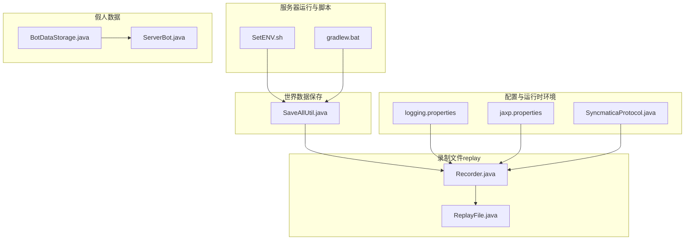
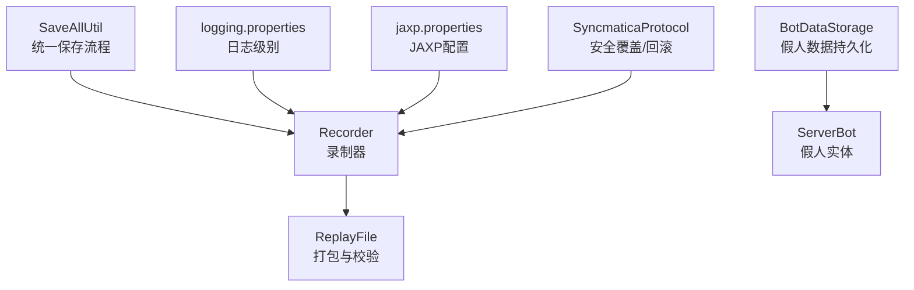
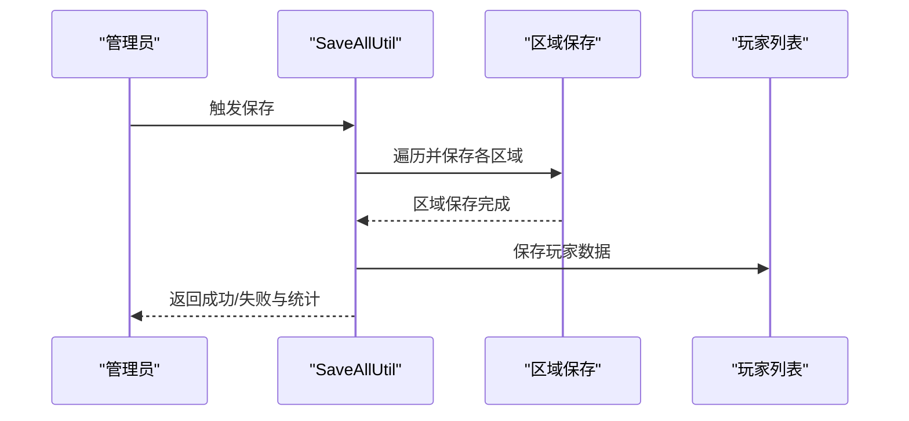
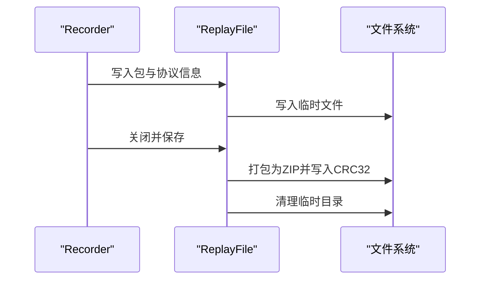
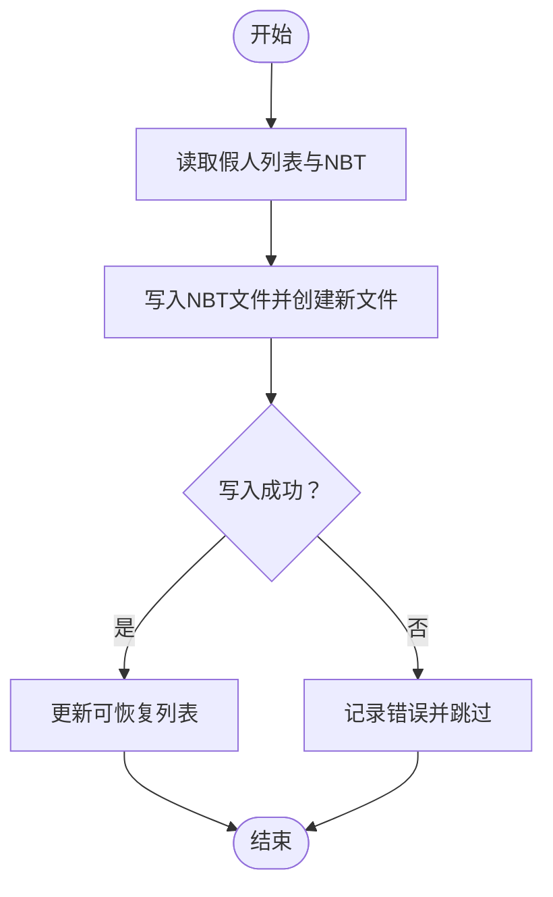
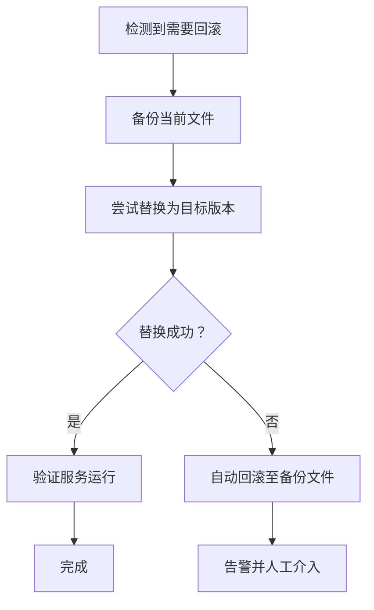
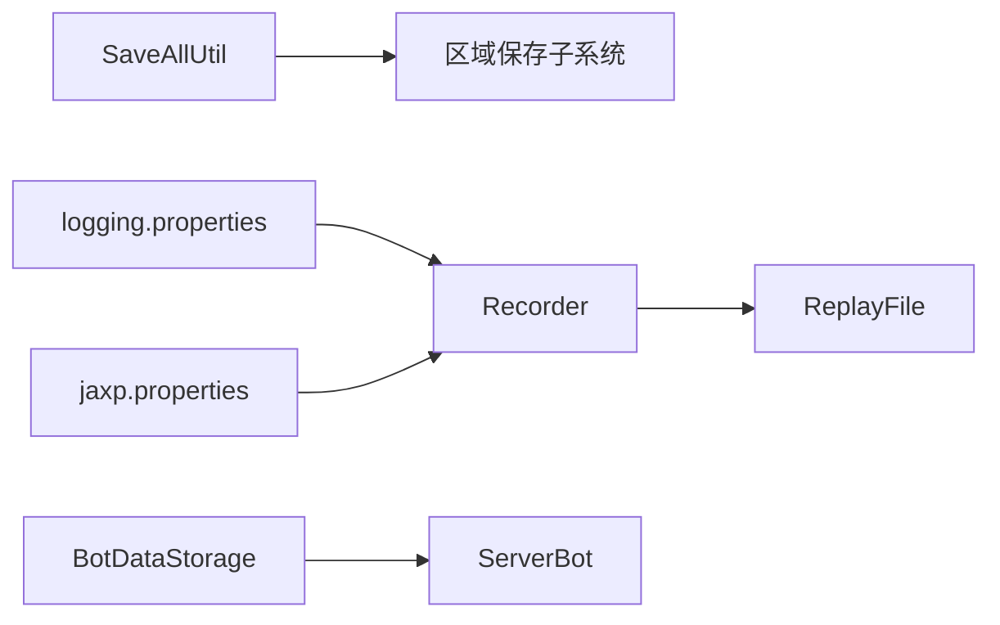

# 备份与恢复

<cite>
**本文引用的文件**
- [Recorder.java](file://lophine-server/src/main/java/org/leavesmc/leaves/replay/Recorder.java)
- [ReplayFile.java](file://lophine-server/src/main/java/org/leavesmc/leaves/replay/ReplayFile.java)
- [SaveAllUtil.java](file://lophine-server/src/main/java/fun/bm/lophine/utils/SaveAllUtil.java)
- [BotDataStorage.java](file://lophine-server/src/main/java/org/leavesmc/leaves/bot/BotDataStorage.java)
- [ServerBot.java](file://lophine-server/src/main/java/org/leavesmc/leaves/bot/ServerBot.java)
- [SyncmaticaProtocol.java](file://lophine-server/src/main/java/org/leavesmc/leaves/protocol/syncmatica/SyncmaticaProtocol.java)
- [SetENV.sh](file://scripts/SetENV.sh)
- [gradlew.bat](file://gradlew.bat)
- [logging.properties](file://jdk-21.0.10_windows-x64_bin/jdk-21.0.10/conf/logging.properties)
- [jaxp.properties](file://jdk-21.0.10_windows-x64_bin/jdk-21.0.10/conf/jaxp.properties)
</cite>

## 目录
1. [引言](#引言)
2. [项目结构](#项目结构)
3. [核心组件](#核心组件)
4. [架构总览](#架构总览)
5. [详细组件分析](#详细组件分析)
6. [依赖关系分析](#依赖关系分析)
7. [性能考量](#性能考量)
8. [故障排查指南](#故障排查指南)
9. [结论](#结论)
10. [附录](#附录)

## 引言
本指南面向Lophine服务器管理员与运维工程师，提供一套完整的“备份与恢复”策略，覆盖世界数据、配置文件与录制文件（replay）三类关键资产。内容包括全量与增量备份策略、自动备份脚本与调度、数据完整性校验、恢复测试流程、灾难恢复计划、业务连续性保障以及版本回滚与配置恢复操作指引。文中所有技术细节均基于仓库源码与构建脚本进行提炼与总结。

## 项目结构
围绕备份与恢复的关键目录与文件如下：
- 服务器运行与备份相关脚本：scripts/SetENV.sh、gradlew.bat
- 世界数据保存工具：fun/bm/lophine/utils/SaveAllUtil.java
- 录制文件（replay）生成与打包：org/leavesmc/leaves/replay/Recorder.java、org/leavesmc/leaves/replay/ReplayFile.java
- 假人（fakeplayer）数据持久化：org/leavesmc/leaves/bot/BotDataStorage.java、org/leavesmc/leaves/bot/ServerBot.java
- 配置文件与日志/JAXP配置：jdk-21.0.10_windows-x64_bin/jdk-21.0.10/conf/logging.properties、jdk-21.0.10_windows-x64_bin/jdk-21.0.10/conf/jaxp.properties
- 同步协议（用于文件替换与备份）：org/leavesmc/leaves/protocol/syncmatica/SyncmaticaProtocol.java

图表来源
- [SaveAllUtil.java:23-88](file://lophine-server/src/main/java/fun/bm/lophine/utils/SaveAllUtil.java#L23-L88)
- [Recorder.java:53-279](file://lophine-server/src/main/java/org/leavesmc/leaves/replay/Recorder.java#L53-L279)
- [ReplayFile.java:52-187](file://lophine-server/src/main/java/org/leavesmc/leaves/replay/ReplayFile.java#L52-L187)
- [BotDataStorage.java:68-103](file://lophine-server/src/main/java/org/leavesmc/leaves/bot/BotDataStorage.java#L68-L103)
- [ServerBot.java:420-449](file://lophine-server/src/main/java/org/leavesmc/leaves/bot/ServerBot.java#L420-L449)
- [logging.properties:1-34](file://jdk-21.0.10_windows-x64_bin/jdk-21.0.10/conf/logging.properties#L1-L34)
- [jaxp.properties:1-15](file://jdk-21.0.10_windows-x64_bin/jdk-21.0.10/conf/jaxp.properties#L1-L15)
- [SyncmaticaProtocol.java:96-151](file://lophine-server/src/main/java/org/leavesmc/leaves/protocol/syncmatica/SyncmaticaProtocol.java#L96-L151)

章节来源
- [SetENV.sh](file://scripts/SetENV.sh)
- [gradlew.bat](file://gradlew.bat)
- [SaveAllUtil.java:23-88](file://lophine-server/src/main/java/fun/bm/lophine/utils/SaveAllUtil.java#L23-L88)
- [Recorder.java:53-279](file://lophine-server/src/main/java/org/leavesmc/leaves/replay/Recorder.java#L53-L279)
- [ReplayFile.java:52-187](file://lophine-server/src/main/java/org/leavesmc/leaves/replay/ReplayFile.java#L52-L187)
- [BotDataStorage.java:68-103](file://lophine-server/src/main/java/org/leavesmc/leaves/bot/BotDataStorage.java#L68-L103)
- [ServerBot.java:420-449](file://lophine-server/src/main/java/org/leavesmc/leaves/bot/ServerBot.java#L420-L449)
- [logging.properties:1-34](file://jdk-21.0.10_windows-x64_bin/jdk-21.0.10/conf/logging.properties#L1-L34)
- [jaxp.properties:1-15](file://jdk-21.0.10_windows-x64_bin/jdk-21.0.10/conf/jaxp.properties#L1-L15)
- [SyncmaticaProtocol.java:96-151](file://lophine-server/src/main/java/org/leavesmc/leaves/protocol/syncmatica/SyncmaticaProtocol.java#L96-L151)

## 核心组件
- 世界数据保存工具：通过统一的保存流程协调各区域（region）保存，确保一致性与超时控制，并在完成后通知调用方。
- 录制文件（replay）系统：负责捕获与序列化网络包，生成压缩归档，包含元数据与校验文件，支持暂停/恢复与时间轴偏移。
- 假人数据持久化：以NBT格式存储假人状态、配置与动作，支持加载/保存与列表管理。
- 配置与运行时环境：JDK日志与JAXP配置影响服务器运行稳定性与备份过程中的日志输出与XML处理行为。
- 文件替换与备份：提供安全的覆盖与回滚机制，避免误操作导致的数据丢失。

章节来源
- [SaveAllUtil.java:23-88](file://lophine-server/src/main/java/fun/bm/lophine/utils/SaveAllUtil.java#L23-L88)
- [Recorder.java:53-279](file://lophine-server/src/main/java/org/leavesmc/leaves/replay/Recorder.java#L53-L279)
- [ReplayFile.java:52-187](file://lophine-server/src/main/java/org/leavesmc/leaves/replay/ReplayFile.java#L52-L187)
- [BotDataStorage.java:68-103](file://lophine-server/src/main/java/org/leavesmc/leaves/bot/BotDataStorage.java#L68-L103)
- [ServerBot.java:420-449](file://lophine-server/src/main/java/org/leavesmc/leaves/bot/ServerBot.java#L420-L449)
- [logging.properties:1-34](file://jdk-21.0.10_windows-x64_bin/jdk-21.0.10/conf/logging.properties#L1-L34)
- [jaxp.properties:1-15](file://jdk-21.0.10_windows-x64_bin/jdk-21.0.10/conf/jaxp.properties#L1-L15)
- [SyncmaticaProtocol.java:96-151](file://lophine-server/src/main/java/org/leavesmc/leaves/protocol/syncmatica/SyncmaticaProtocol.java#L96-L151)

## 架构总览
下图展示备份与恢复涉及的主要模块及其交互关系，强调世界数据保存、录制文件生成与打包、假人数据持久化、配置与运行时环境、以及文件替换与备份保护之间的协作。

图表来源
- [SaveAllUtil.java:23-88](file://lophine-server/src/main/java/fun/bm/lophine/utils/SaveAllUtil.java#L23-L88)
- [Recorder.java:53-279](file://lophine-server/src/main/java/org/leavesmc/leaves/replay/Recorder.java#L53-L279)
- [ReplayFile.java:52-187](file://lophine-server/src/main/java/org/leavesmc/leaves/replay/ReplayFile.java#L52-L187)
- [BotDataStorage.java:68-103](file://lophine-server/src/main/java/org/leavesmc/leaves/bot/BotDataStorage.java#L68-L103)
- [ServerBot.java:420-449](file://lophine-server/src/main/java/org/leavesmc/leaves/bot/ServerBot.java#L420-L449)
- [logging.properties:1-34](file://jdk-21.0.10_windows-x64_bin/jdk-21.0.10/conf/logging.properties#L1-L34)
- [jaxp.properties:1-15](file://jdk-21.0.10_windows-x64_bin/jdk-21.0.10/conf/jaxp.properties#L1-L15)
- [SyncmaticaProtocol.java:96-151](file://lophine-server/src/main/java/org/leavesmc/leaves/protocol/syncmatica/SyncmaticaProtocol.java#L96-L151)

## 详细组件分析

### 世界数据备份策略
- 全量备份：使用统一保存流程触发所有区域的区块与玩家数据写盘，等待完成或超时，确保一致性。
- 增量备份：可结合文件系统级快照或差异复制工具对未变更部分进行增量同步；若采用数据库/自定义存储，需实现基于时间戳或校验和的增量扫描。
- 数据完整性：保存完成后进行一次文件大小/校验和检查，失败则重试或回滚。
- 恢复测试：在隔离环境中解压并启动，验证世界可读、玩家数据可用、插件兼容性正常。

图表来源
- [SaveAllUtil.java:23-88](file://lophine-server/src/main/java/fun/bm/lophine/utils/SaveAllUtil.java#L23-L88)

章节来源
- [SaveAllUtil.java:23-88](file://lophine-server/src/main/java/fun/bm/lophine/utils/SaveAllUtil.java#L23-L88)

### 录制文件（replay）备份策略
- 全量备份：录制器将网络包序列化到临时目录，完成后打包为压缩归档，并生成CRC32校验文件，确保数据完整性。
- 增量备份：可按时间窗口或事件标记进行分段归档；对长时间录制，建议拆分为多个文件并维护索引文件。
- 数据完整性：校验CRC32与元数据一致性；失败时保留原始临时目录以便人工检查。
- 恢复测试：在受控环境下加载录制文件，验证播放流畅度与事件还原度。

图表来源
- [Recorder.java:242-279](file://lophine-server/src/main/java/org/leavesmc/leaves/replay/Recorder.java#L242-L279)
- [ReplayFile.java:146-187](file://lophine-server/src/main/java/org/leavesmc/leaves/replay/ReplayFile.java#L146-L187)

章节来源
- [Recorder.java:53-279](file://lophine-server/src/main/java/org/leavesmc/leaves/replay/Recorder.java#L53-L279)
- [ReplayFile.java:52-187](file://lophine-server/src/main/java/org/leavesmc/leaves/replay/ReplayFile.java#L52-L187)

### 假人数据备份策略
- 全量备份：遍历假人数据存储，将NBT数据写入文件；同时维护假人列表与可恢复标记。
- 增量备份：仅对最近修改的假人数据进行差异同步；可结合UUID与时间戳判断变更。
- 数据完整性：写入前删除旧文件并新建，异常时记录日志并跳过该假人。
- 恢复测试：加载假人数据并验证其外观、配置与动作序列是否一致。

图表来源
- [BotDataStorage.java:68-103](file://lophine-server/src/main/java/org/leavesmc/leaves/bot/BotDataStorage.java#L68-L103)
- [ServerBot.java:420-449](file://lophine-server/src/main/java/org/leavesmc/leaves/bot/ServerBot.java#L420-L449)

章节来源
- [BotDataStorage.java:68-103](file://lophine-server/src/main/java/org/leavesmc/leaves/bot/BotDataStorage.java#L68-L103)
- [ServerBot.java:420-449](file://lophine-server/src/main/java/org/leavesmc/leaves/bot/ServerBot.java#L420-L449)

### 配置文件备份策略
- 全量备份：收集JDK日志与JAXP配置、服务器配置目录（如plugins、world、server.properties等）进行打包。
- 增量备份：基于文件修改时间或哈希值识别变更项；对动态生成的日志文件不纳入长期归档。
- 数据完整性：对关键配置文件进行MD5/SHA校验；校验失败时保留原文件并告警。
- 恢复测试：在隔离环境部署，启动后验证日志级别、JAXP工厂类加载、以及服务器基本功能。

章节来源
- [logging.properties:1-34](file://jdk-21.0.10_windows-x64_bin/jdk-21.0.10/conf/logging.properties#L1-L34)
- [jaxp.properties:1-15](file://jdk-21.0.10_windows-x64_bin/jdk-21.0.10/conf/jaxp.properties#L1-L15)

### 自动备份脚本与调度
- 脚本位置：scripts/SetENV.sh、gradlew.bat
- 建议流程：
  - 在定时任务中先执行世界数据保存，再触发录制文件打包，最后备份假人数据与配置。
  - 使用外部调度器（如cron或Windows任务计划程序）定期执行。
  - 对大文件采用分卷压缩与并行传输，降低单次IO压力。
- 安全性：脚本应具备幂等性与错误回滚能力，失败时保留上一个有效归档。

章节来源
- [SetENV.sh](file://scripts/SetENV.sh)
- [gradlew.bat](file://gradlew.bat)

### 数据完整性验证与恢复测试
- 校验方法：
  - 录制文件：校验CRC32与ZIP完整性；解析元数据确认时间线与事件数量。
  - 世界数据：检查区块文件数量与大小；启动后验证地图完整性。
  - 假人数据：比对NBT字段与预期配置；加载后验证动作序列。
- 恢复测试：
  - 准备隔离环境（独立磁盘/容器），导入备份后启动服务。
  - 运行基础连通性与功能测试，确认无崩溃与数据不一致。

章节来源
- [ReplayFile.java:146-187](file://lophine-server/src/main/java/org/leavesmc/leaves/replay/ReplayFile.java#L146-L187)
- [SaveAllUtil.java:23-88](file://lophine-server/src/main/java/fun/bm/lophine/utils/SaveAllUtil.java#L23-L88)
- [BotDataStorage.java:68-103](file://lophine-server/src/main/java/org/leavesmc/leaves/bot/BotDataStorage.java#L68-L103)

### 灾难恢复计划与业务连续性
- RTO/RPO目标：根据业务需求设定恢复时间与数据丢失容忍度。
- 多地备份：至少两处异地存储（本地+云），并定期做跨地域拷贝。
- 快速切换：准备热备节点或冷备镜像，缩短停机时间。
- 回滚策略：当升级导致问题时，使用最近一次成功备份快速回退；必要时启用灰度发布与蓝绿部署。

### 版本回滚与配置恢复
- 版本回滚：优先使用“安全覆盖/回滚”机制，先备份当前文件，再尝试替换；若失败则自动回滚至备份。
- 配置恢复：从备份中提取对应配置文件，应用前进行校验；对关键参数（如日志级别、JAXP工厂类）进行最小化变更。

图表来源
- [SyncmaticaProtocol.java:127-151](file://lophine-server/src/main/java/org/leavesmc/leaves/protocol/syncmatica/SyncmaticaProtocol.java#L127-L151)

章节来源
- [SyncmaticaProtocol.java:96-151](file://lophine-server/src/main/java/org/leavesmc/leaves/protocol/syncmatica/SyncmaticaProtocol.java#L96-L151)

## 依赖关系分析
- 组件耦合：
  - SaveAllUtil与区域保存子系统强耦合，负责全局保存的协调与超时控制。
  - Recorder依赖ReplayFile进行打包与校验，二者共同保证录制数据的完整性。
  - BotDataStorage与ServerBot存在紧密的数据交换，需保证并发安全与原子性。
- 外部依赖：
  - JDK配置（logging.properties、jaxp.properties）影响日志输出与XML处理，间接影响备份过程的可观测性与稳定性。

图表来源
- [SaveAllUtil.java:23-88](file://lophine-server/src/main/java/fun/bm/lophine/utils/SaveAllUtil.java#L23-L88)
- [Recorder.java:53-279](file://lophine-server/src/main/java/org/leavesmc/leaves/replay/Recorder.java#L53-L279)
- [ReplayFile.java:52-187](file://lophine-server/src/main/java/org/leavesmc/leaves/replay/ReplayFile.java#L52-L187)
- [BotDataStorage.java:68-103](file://lophine-server/src/main/java/org/leavesmc/leaves/bot/BotDataStorage.java#L68-L103)
- [ServerBot.java:420-449](file://lophine-server/src/main/java/org/leavesmc/leaves/bot/ServerBot.java#L420-L449)
- [logging.properties:1-34](file://jdk-21.0.10_windows-x64_bin/jdk-21.0.10/conf/logging.properties#L1-L34)
- [jaxp.properties:1-15](file://jdk-21.0.10_windows-x64_bin/jdk-21.0.10/conf/jaxp.properties#L1-L15)

章节来源
- [SaveAllUtil.java:23-88](file://lophine-server/src/main/java/fun/bm/lophine/utils/SaveAllUtil.java#L23-L88)
- [Recorder.java:53-279](file://lophine-server/src/main/java/org/leavesmc/leaves/replay/Recorder.java#L53-L279)
- [ReplayFile.java:52-187](file://lophine-server/src/main/java/org/leavesmc/leaves/replay/ReplayFile.java#L52-L187)
- [BotDataStorage.java:68-103](file://lophine-server/src/main/java/org/leavesmc/leaves/bot/BotDataStorage.java#L68-L103)
- [ServerBot.java:420-449](file://lophine-server/src/main/java/org/leavesmc/leaves/bot/ServerBot.java#L420-L449)
- [logging.properties:1-34](file://jdk-21.0.10_windows-x64_bin/jdk-21.0.10/conf/logging.properties#L1-L34)
- [jaxp.properties:1-15](file://jdk-21.0.10_windows-x64_bin/jdk-21.0.10/conf/jaxp.properties#L1-L15)

## 性能考量
- 保存阶段：合理设置保存间隔与日志级别，避免频繁IO与高负载；利用区域化保存减少单点压力。
- 录制阶段：对大文件采用异步写入与流式压缩，降低内存占用；限制录制时长与事件密度。
- 存储阶段：使用SSD缓存与分层存储（热/冷），对历史归档进行去重与压缩。
- 并发与锁：保存与录制过程中的并发访问需加锁与原子操作，防止数据损坏。

## 故障排查指南
- 保存失败：检查SaveAllUtil的超时与错误标志，定位未完成的区域并重试；查看日志中关于区域保存的错误堆栈。
- 录制异常：确认ReplayFile的临时目录权限与磁盘空间；核对CRC32与ZIP完整性；检查Recorder的线程池与异常处理。
- 假人数据损坏：检查BotDataStorage的写入日志与NBT结构；必要时重建假人列表与恢复标记。
- 配置问题：核对logging.properties与jaxp.properties的生效路径与权限；确保JAXP工厂类可被正确加载。

章节来源
- [SaveAllUtil.java:73-88](file://lophine-server/src/main/java/fun/bm/lophine/utils/SaveAllUtil.java#L73-L88)
- [Recorder.java:242-279](file://lophine-server/src/main/java/org/leavesmc/leaves/replay/Recorder.java#L242-L279)
- [ReplayFile.java:146-187](file://lophine-server/src/main/java/org/leavesmc/leaves/replay/ReplayFile.java#L146-L187)
- [BotDataStorage.java:68-103](file://lophine-server/src/main/java/org/leavesmc/leaves/bot/BotDataStorage.java#L68-L103)
- [logging.properties:1-34](file://jdk-21.0.10_windows-x64_bin/jdk-21.0.10/conf/logging.properties#L1-L34)
- [jaxp.properties:1-15](file://jdk-21.0.10_windows-x64_bin/jdk-21.0.10/conf/jaxp.properties#L1-L15)

## 结论
通过统一的世界数据保存流程、可靠的录制文件打包与校验、规范的假人数据持久化、严谨的配置与运行时环境管理，以及完善的自动备份与恢复机制，Lophine服务器可在保证业务连续性的前提下，实现高效、安全、可追溯的备份与恢复体系。建议结合实际业务规模与SLA目标，持续优化备份策略与自动化脚本，并定期演练恢复流程以验证有效性。

## 附录
- 参考文件路径与用途概览：
  - scripts/SetENV.sh：环境初始化与变量设置
  - gradlew.bat：Gradle构建与运行入口
  - lophine-server/src/main/java/fun/bm/lophine/utils/SaveAllUtil.java：世界数据保存协调器
  - lophine-server/src/main/java/org/leavesmc/leaves/replay/Recorder.java：录制器
  - lophine-server/src/main/java/org/leavesmc/leaves/replay/ReplayFile.java：录制文件打包与校验
  - lophine-server/src/main/java/org/leavesmc/leaves/bot/BotDataStorage.java：假人数据存储
  - lophine-server/src/main/java/org/leavesmc/leaves/bot/ServerBot.java：假人实体
  - lophine-server/src/main/java/org/leavesmc/leaves/protocol/syncmatica/SyncmaticaProtocol.java：安全覆盖与回滚
  - jdk-21.0.10_windows-x64_bin/jdk-21.0.10/conf/logging.properties：JDK日志配置
  - jdk-21.0.10_windows-x64_bin/jdk-21.0.10/conf/jaxp.properties：JAXP配置