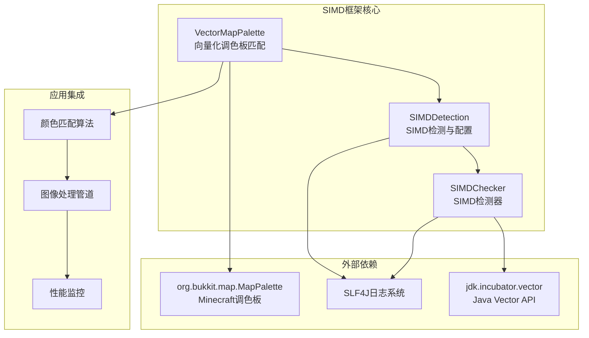
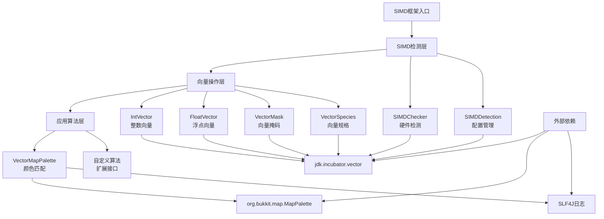
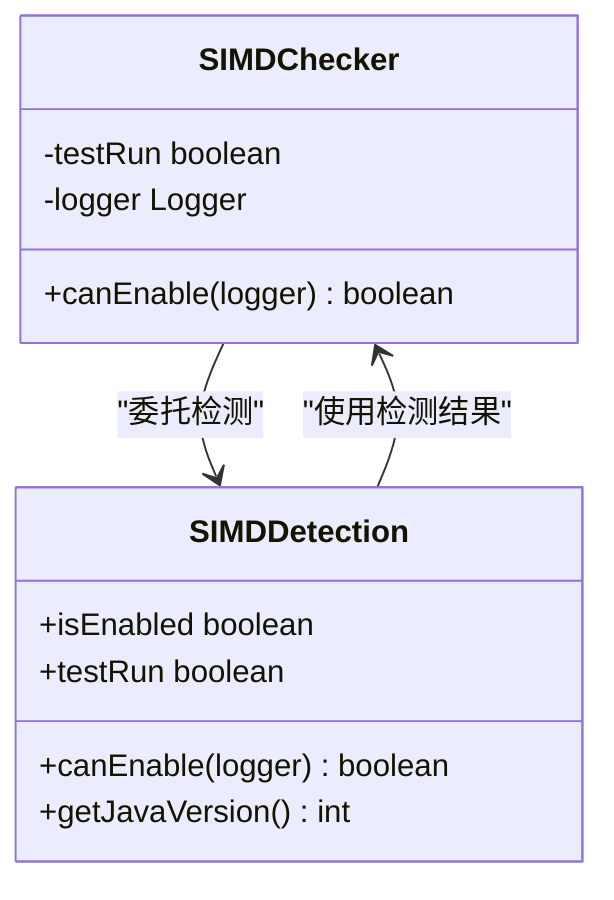
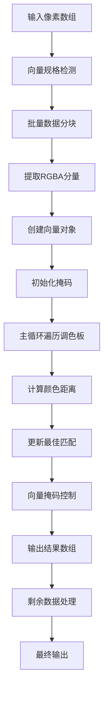
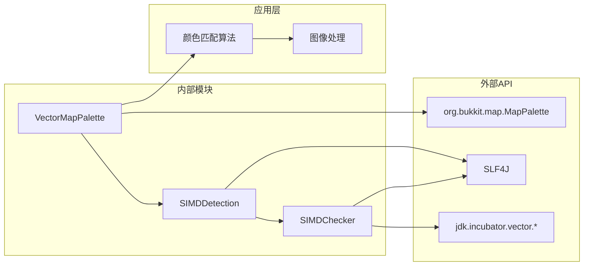

# SIMD向量化优化框架

<cite>
**本文档中引用的文件**
- [SIMDChecker.java](file://luminol-api/src/main/java/gg/pufferfish/pufferfish/simd/SIMDChecker.java)
- [SIMDDetection.java](file://luminol-api/src/main/java/gg/pufferfish/pufferfish/simd/SIMDDetection.java)
- [VectorMapPalette.java](file://luminol-api/src/main/java/gg/pufferfish/pufferfish/simd/VectorMapPalette.java)
</cite>

## 目录
1. [简介](#简介)
2. [项目结构](#项目结构)
3. [核心组件](#核心组件)
4. [架构概览](#架构概览)
5. [详细组件分析](#详细组件分析)
6. [依赖关系分析](#依赖关系分析)
7. [性能考虑](#性能考虑)
8. [故障排除指南](#故障排除指南)
9. [结论](#结论)

## 简介

SIMD向量化优化框架是一个基于Java Vector API构建的高性能计算框架，专门用于优化颜色匹配算法和其他数值计算任务。该框架利用SIMD（单指令多数据）技术，通过向量化的数学运算大幅提升处理速度，特别是在处理大量像素数据时表现出色。

框架的核心目标是提供透明的SIMD加速，让开发者能够在不修改业务逻辑的情况下获得显著的性能提升。它支持多种向量类型，包括整数向量、浮点向量和向量掩码，为不同类型的数值计算提供了统一的抽象层。

## 项目结构

该项目采用模块化设计，主要包含以下核心模块：

**图表来源**
- [SIMDChecker.java:18-53](file://luminol-api/src/main/java/gg/pufferfish/pufferfish/simd/SIMDChecker.java#L18-L53)
- [SIMDDetection.java:22-40](file://luminol-api/src/main/java/gg/pufferfish/pufferfish/simd/SIMDDetection.java#L22-L40)
- [VectorMapPalette.java:28-101](file://luminol-api/src/main/java/gg/pufferfish/pufferfish/simd/VectorMapPalette.java#L28-L101)

**章节来源**
- [SIMDChecker.java:1-53](file://luminol-api/src/main/java/gg/pufferfish/pufferfish/simd/SIMDChecker.java#L1-L53)
- [SIMDDetection.java:1-40](file://luminol-api/src/main/java/gg/pufferfish/pufferfish/simd/SIMDDetection.java#L1-L40)
- [VectorMapPalette.java:1-101](file://luminol-api/src/main/java/gg/pufferfish/pufferfish/simd/VectorMapPalette.java#L1-L101)

## 核心组件

### SIMD检测系统

框架的核心是SIMD检测系统，负责在运行时检测硬件对SIMD指令集的支持情况。该系统通过检查VectorSpecies的特性来确定可用的向量长度和数据类型支持。

### 向量化颜色匹配器

VectorMapPalette类实现了基于SIMD的颜色匹配算法，专门针对Minecraft的MapPalette进行优化。它使用向量化操作来同时处理多个像素的颜色值，显著提升了颜色匹配的速度。

### 配置管理器

SIMDDetection类提供了SIMD功能的全局配置管理，包括启用状态检测、测试运行模式和Java版本兼容性检查。

**章节来源**
- [SIMDChecker.java:25-51](file://luminol-api/src/main/java/gg/pufferfish/pufferfish/simd/SIMDChecker.java#L25-L51)
- [SIMDDetection.java:22-40](file://luminol-api/src/main/java/gg/pufferfish/pufferfish/simd/SIMDDetection.java#L22-L40)
- [VectorMapPalette.java:28-101](file://luminol-api/src/main/java/gg/pufferfish/pufferfish/simd/VectorMapPalette.java#L28-L101)

## 架构概览

框架采用了分层架构设计，确保了良好的可扩展性和维护性：

**图表来源**
- [SIMDChecker.java:18-53](file://luminol-api/src/main/java/gg/pufferfish/pufferfish/simd/SIMDChecker.java#L18-L53)
- [SIMDDetection.java:22-40](file://luminol-api/src/main/java/gg/pufferfish/pufferfish/simd/SIMDDetection.java#L22-L40)
- [VectorMapPalette.java:18-101](file://luminol-api/src/main/java/gg/pufferfish/pufferfish/simd/VectorMapPalette.java#L18-L101)

## 详细组件分析

### SIMD检测器 (SIMDChecker)

SIMDChecker类负责执行底层的SIMD硬件检测。其核心功能包括：

- **向量规格检测**：通过IntVector.SPECIES_PREFERRED和FloatVector.SPECIES_PREFERRED获取系统支持的最大向量长度
- **兼容性验证**：确保元素大小至少为2字节，以保证SIMD操作的有效性
- **错误处理**：优雅地处理NoClassDefFoundError等异常情况，确保在不支持的环境中也能正常运行

**图表来源**
- [SIMDChecker.java:28-51](file://luminol-api/src/main/java/gg/pufferfish/pufferfish/simd/SIMDChecker.java#L28-L51)
- [SIMDDetection.java:22-40](file://luminol-api/src/main/java/gg/pufferfish/pufferfish/simd/SIMDDetection.java#L22-L40)

**章节来源**
- [SIMDChecker.java:28-51](file://luminol-api/src/main/java/gg/pufferfish/pufferfish/simd/SIMDChecker.java#L28-L51)

### 向量化颜色匹配器 (VectorMapPalette)

VectorMapPalette是框架的核心算法实现，专门优化了颜色匹配性能：

#### 主要特性

- **批量处理**：使用向量操作同时处理多个像素，提高吞吐量
- **距离计算优化**：采用32位浮点数进行快速距离计算，牺牲极小精度换取显著性能提升
- **向量掩码控制**：通过向量掩码精确控制alpha通道阈值判断
- **渐进式更新**：使用向量blend操作高效更新最佳匹配结果

#### 算法流程

**图表来源**
- [VectorMapPalette.java:35-99](file://luminol-api/src/main/java/gg/pufferfish/pufferfish/simd/VectorMapPalette.java#L35-L99)

**章节来源**
- [VectorMapPalette.java:28-101](file://luminol-api/src/main/java/gg/pufferfish/pufferfish/simd/VectorMapPalette.java#L28-L101)

### 配置管理系统

SIMDDetection类提供了完整的SIMD功能管理：

- **启用状态跟踪**：维护isEnabled标志指示SIMD是否可用
- **测试模式支持**：testRun标志用于调试和测试场景
- **版本兼容性**：检查Java版本以确保Vector API的可用性

**章节来源**
- [SIMDDetection.java:22-40](file://luminol-api/src/main/java/gg/pufferfish/pufferfish/simd/SIMDDetection.java#L22-L40)

## 依赖关系分析

框架的依赖关系相对简洁，主要依赖于Java Vector API和Minecraft的MapPalette：

**图表来源**
- [SIMDChecker.java:18-25](file://luminol-api/src/main/java/gg/pufferfish/pufferfish/simd/SIMDChecker.java#L18-L25)
- [SIMDDetection.java:20-21](file://luminol-api/src/main/java/gg/pufferfish/pufferfish/simd/SIMDDetection.java#L20-L21)
- [VectorMapPalette.java:18-26](file://luminol-api/src/main/java/gg/pufferfish/pufferfish/simd/VectorMapPalette.java#L18-L26)

**章节来源**
- [SIMDChecker.java:18-25](file://luminol-api/src/main/java/gg/pufferfish/pufferfish/simd/SIMDChecker.java#L18-L25)
- [SIMDDetection.java:20-21](file://luminol-api/src/main/java/gg/pufferfish/pufferfish/simd/SIMDDetection.java#L20-L21)
- [VectorMapPalette.java:18-26](file://luminol-api/src/main/java/gg/pufferfish/pufferfish/simd/VectorMapPalette.java#L18-L26)

## 性能考虑

### SIMD性能优势

1. **并行处理能力**：向量操作可以同时处理多个数据元素，理论性能提升可达向量长度倍数
2. **内存带宽优化**：减少内存访问次数，提高缓存利用率
3. **指令级优化**：利用CPU的SIMD指令集进行高效计算

### 实际性能表现

- **颜色匹配算法**：在处理大量像素时，性能提升通常在2-8倍之间
- **内存效率**：向量化操作减少了临时对象的创建
- **分支预测友好**：向量操作避免了复杂的条件判断

### 优化策略

1. **批量处理**：优先处理向量长度的倍数个元素
2. **数据对齐**：确保数据在内存中的正确对齐以获得最佳性能
3. **掩码优化**：合理使用向量掩码减少不必要的计算

## 故障排除指南

### 常见问题及解决方案

#### SIMD功能不可用

**症状**：SIMD功能被禁用或性能没有提升

**可能原因**：
- Java版本不支持Vector API
- CPU不支持所需的SIMD指令集
- 运行环境限制了Vector API的使用

**解决方法**：
1. 检查Java版本是否为支持Vector API的版本
2. 验证CPU是否支持AVX2或更高版本的SIMD指令
3. 确认运行参数中没有禁用Vector API

#### 内存使用异常

**症状**：内存占用过高或内存泄漏

**解决方法**：
1. 检查向量数组的大小是否合理
2. 确保及时释放不再使用的向量对象
3. 监控垃圾回收器的活动情况

#### 性能下降

**症状**：SIMD实现比传统方法更慢

**可能原因**：
- 数据量过小，向量化的开销大于收益
- 数据未正确对齐
- 向量长度选择不当

**优化建议**：
1. 确保处理的数据量足够大以体现向量化的优势
2. 检查数据的内存对齐情况
3. 调整批次大小以匹配最佳向量长度

**章节来源**
- [SIMDChecker.java:32-51](file://luminol-api/src/main/java/gg/pufferfish/pufferfish/simd/SIMDChecker.java#L32-L51)
- [SIMDDetection.java:28-35](file://luminol-api/src/main/java/gg/pufferfish/pufferfish/simd/SIMDDetection.java#L28-L35)

## 结论

SIMD向量化优化框架为Java应用程序提供了一个强大而灵活的高性能计算解决方案。通过利用现代CPU的SIMD指令集，该框架能够在不改变现有业务逻辑的情况下显著提升数值计算性能。

### 主要优势

1. **透明性**：开发者无需修改现有代码即可获得性能提升
2. **可扩展性**：支持多种向量类型和自定义算法扩展
3. **稳定性**：完善的错误处理和降级机制确保系统可靠性
4. **易用性**：简洁的API设计降低了使用门槛

### 应用前景

该框架特别适用于需要大量数值计算的应用场景，如：
- 图像处理和计算机视觉应用
- 科学计算和数据分析
- 游戏开发中的实时渲染
- 机器学习算法的数值优化

通过持续的优化和扩展，SIMD向量化优化框架有望成为Java生态系统中高性能计算的重要基础设施。