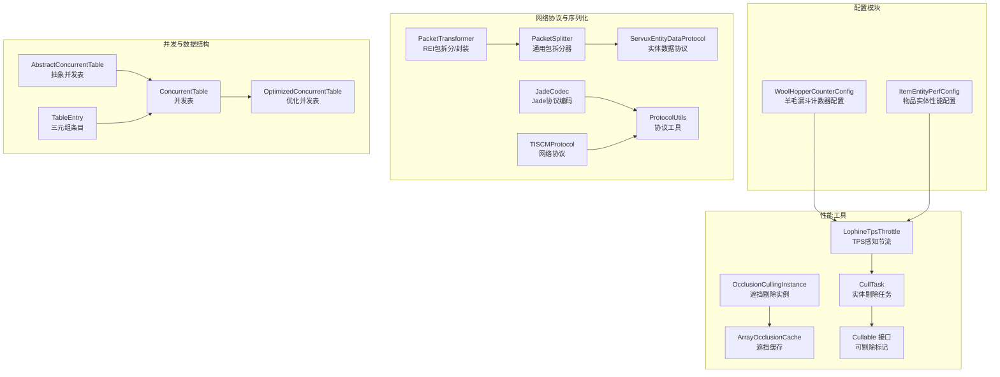
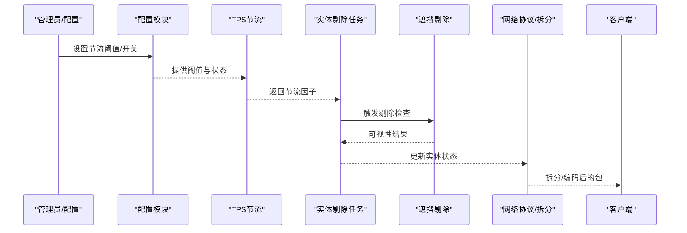
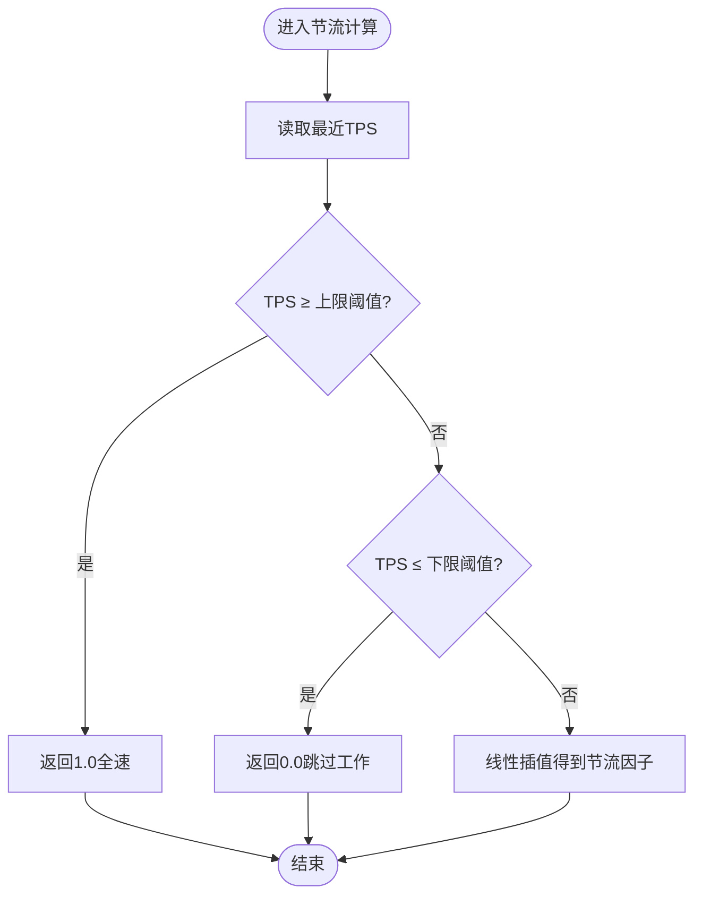
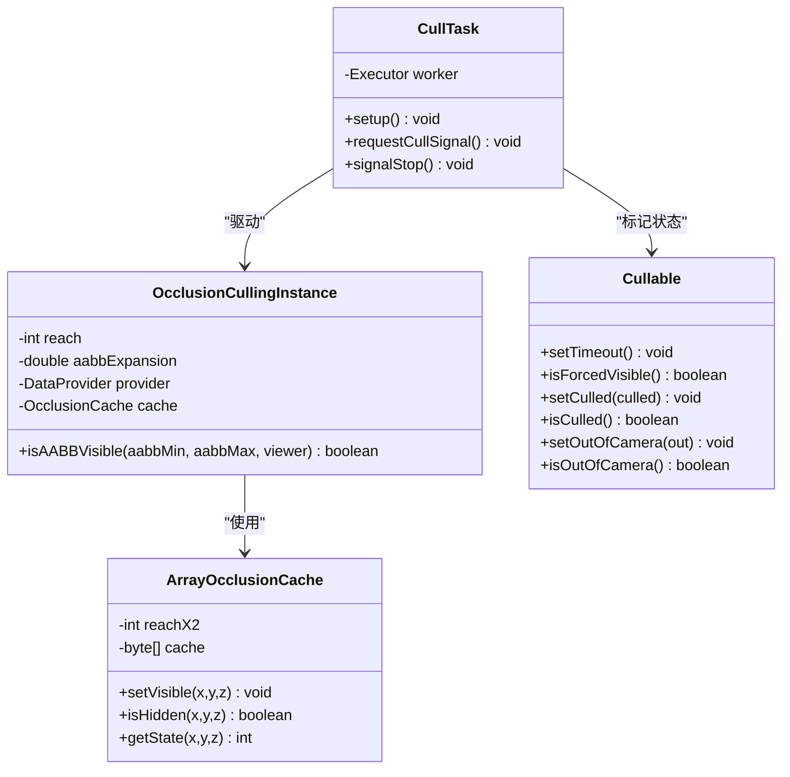
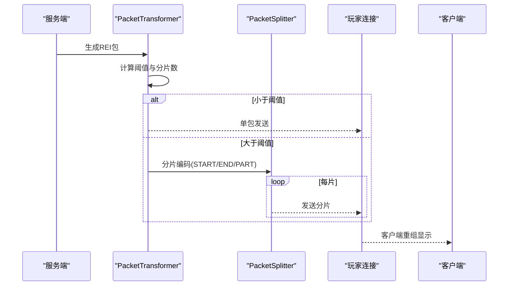
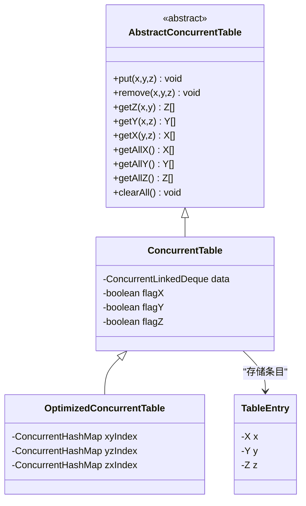
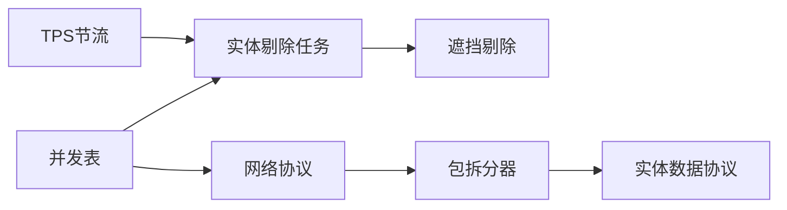

# 性能调优

<cite>
**本文引用的文件**
- [WoolHopperCounterConfig.java](file://lophine-server/src/main/java/fun/bm/lophine/config/modules/function/WoolHopperCounterConfig.java)
- [LophineTpsThrottle.java](file://lophine-server/src/main/java/fun/bm/lophine/utils/LophineTpsThrottle.java)
- [OcclusionCullingInstance.java](file://lophine-server/src/main/java/com/logisticscraft/occlusionculling/OcclusionCullingInstance.java)
- [ArrayOcclusionCache.java](file://lophine-server/src/main/java/com/logisticscraft/occlusionculling/cache/ArrayOcclusionCache.java)
- [CullTask.java](file://lophine-server/src/main/java/dev/tr7zw/entityculling/CullTask.java)
- [Cullable.java](file://lophine-server/src/main/java/dev/tr7zw/entityculling/versionless/access/Cullable.java)
- [PacketTransformer.java](file://lophine-server/src/main/java/org/leavesmc/leaves/protocol/rei/PacketTransformer.java)
- [ServuxEntityDataProtocol.java](file://lophine-server/src/main/java/org/leavesmc/leaves/protocol/servux/ServuxEntityDataProtocol.java)
- [PacketSplitter.java](file://lophine-server/src/main/java/org/leavesmc/leaves/protocol/servux/PacketSplitter.java)
- [JadeCodec.java](file://lophine-server/src/main/java/org/leavesmc/leaves/protocol/jade/util/JadeCodec.java)
- [TISCMProtocol.java](file://lophine-server/src/main/java/fun/bm/lophine/protocol/tiscm/TISCMProtocol.java)
- [ProtocolUtils.java](file://lophine-server/src/main/java/org/leavesmc/leaves/protocol/core/ProtocolUtils.java)
- [ItemEntityPerfConfig.java](file://lophine-server/src/main/java/fun/bm/lophine/config/modules/misc/ItemEntityPerfConfig.java)
- [default.jfc](file://jdk-21.0.10_windows-x64_bin/jdk-21.0.10/lib/jfr/default.jfc)
- [profile.jfc](file://jdk-21.0.10_windows-x64_bin/jdk-21.0.10/lib/jfr/profile.jfc)
- [AbstractConcurrentTable.java](file://lophine-server/src/main/java/fun/bm/lophine/utils/concurrent/AbstractConcurrentTable.java)
- [ConcurrentTable.java](file://lophine-server/src/main/java/fun/bm/lophine/utils/concurrent/ConcurrentTable.java)
- [OptimizedConcurrentTable.java](file://lophine-server/src/main/java/fun/bm/lophine/utils/concurrent/OptimizedConcurrentTable.java)
- [TableEntry.java](file://lophine-server/src/main/java/fun/bm/lophine/utils/concurrent/TableEntry.java)
</cite>

## 目录
1. 引言
2. 项目结构
3. 核心组件
4. 架构总览
5. 详细组件分析
6. 依赖关系分析
7. 性能考量
8. 故障排查指南
9. 结论
10. 附录

## 引言
本指南面向在Folia平台上运行Lophine的服务器管理员与开发者，系统性地总结并提炼了项目中的性能优化策略与最佳实践。内容覆盖并发处理与线程池配置、实体剔除与视野遮挡剔除、内存管理与GC调优、网络I/O与数据序列化、配置参数的性能影响与推荐设置，以及压力测试与性能基准测试的实施方法。文档以“可操作”为目标，既适合快速上手，也便于深入优化。

## 项目结构
Lophine在服务端模块中提供了大量与性能相关的功能点：包括TPS感知节流、实体剔除、视野遮挡剔除、协议层的包拆分与编码优化、并发表结构等。这些能力通过配置模块与工具类共同实现，形成一套可配置、可扩展的性能优化体系。

图示来源
- [WoolHopperCounterConfig.java:1-60](file://lophine-server/src/main/java/fun/bm/lophine/config/modules/function/WoolHopperCounterConfig.java#L1-L60)
- [LophineTpsThrottle.java:1-38](file://lophine-server/src/main/java/fun/bm/lophine/utils/LophineTpsThrottle.java#L1-L38)
- [OcclusionCullingInstance.java:1-101](file://lophine-server/src/main/java/com/logisticscraft/occlusionculling/OcclusionCullingInstance.java#L1-L101)
- [ArrayOcclusionCache.java:1-57](file://lophine-server/src/main/java/com/logisticscraft/occlusionculling/cache/ArrayOcclusionCache.java#L1-L57)
- [CullTask.java:37-78](file://lophine-server/src/main/java/dev/tr7zw/entityculling/CullTask.java#L37-L78)
- [Cullable.java:1-17](file://lophine-server/src/main/java/dev/tr7zw/entityculling/versionless/access/Cullable.java#L1-L17)
- [PacketTransformer.java:41-147](file://lophine-server/src/main/java/org/leavesmc/leaves/protocol/rei/PacketTransformer.java#L41-L147)
- [PacketSplitter.java:57-89](file://lophine-server/src/main/java/org/leavesmc/leaves/protocol/servux/PacketSplitter.java#L57-L89)
- [JadeCodec.java:46-77](file://lophine-server/src/main/java/org/leavesmc/leaves/protocol/jade/util/JadeCodec.java#L46-L77)
- [TISCMProtocol.java:117-201](file://lophine-server/src/main/java/fun/bm/lophine/protocol/tiscm/TISCMProtocol.java#L117-L201)
- [ProtocolUtils.java:81-101](file://lophine-server/src/main/java/org/leavesmc/leaves/protocol/core/ProtocolUtils.java#L81-L101)
- [ServuxEntityDataProtocol.java:144-189](file://lophine-server/src/main/java/org/leavesmc/leaves/protocol/servux/ServuxEntityDataProtocol.java#L144-L189)
- [AbstractConcurrentTable.java:1-36](file://lophine-server/src/main/java/fun/bm/lophine/utils/concurrent/AbstractConcurrentTable.java#L1-L36)
- [ConcurrentTable.java:1-29](file://lophine-server/src/main/java/fun/bm/lophine/utils/concurrent/ConcurrentTable.java#L1-L29)
- [OptimizedConcurrentTable.java:1-19](file://lophine-server/src/main/java/fun/bm/lophine/utils/concurrent/OptimizedConcurrentTable.java#L1-L19)
- [TableEntry.java:1-25](file://lophine-server/src/main/java/fun/bm/lophine/utils/concurrent/TableEntry.java#L1-L25)

章节来源
- [WoolHopperCounterConfig.java:1-60](file://lophine-server/src/main/java/fun/bm/lophine/config/modules/function/WoolHopperCounterConfig.java#L1-L60)
- [LophineTpsThrottle.java:1-38](file://lophine-server/src/main/java/fun/bm/lophine/utils/LophineTpsThrottle.java#L1-L38)
- [OcclusionCullingInstance.java:1-101](file://lophine-server/src/main/java/com/logisticscraft/occlusionculling/OcclusionCullingInstance.java#L1-L101)
- [ArrayOcclusionCache.java:1-57](file://lophine-server/src/main/java/com/logisticscraft/occlusionculling/cache/ArrayOcclusionCache.java#L1-L57)
- [CullTask.java:37-78](file://lophine-server/src/main/java/dev/tr7zw/entityculling/CullTask.java#L37-L78)
- [Cullable.java:1-17](file://lophine-server/src/main/java/dev/tr7zw/entityculling/versionless/access/Cullable.java#L1-L17)
- [PacketTransformer.java:41-147](file://lophine-server/src/main/java/org/leavesmc/leaves/protocol/rei/PacketTransformer.java#L41-L147)
- [PacketSplitter.java:57-89](file://lophine-server/src/main/java/org/leavesmc/leaves/protocol/servux/PacketSplitter.java#L57-L89)
- [JadeCodec.java:46-77](file://lophine-server/src/main/java/org/leavesmc/leaves/protocol/jade/util/JadeCodec.java#L46-L77)
- [TISCMProtocol.java:117-201](file://lophine-server/src/main/java/fun/bm/lophine/protocol/tiscm/TISCMProtocol.java#L117-L201)
- [ProtocolUtils.java:81-101](file://lophine-server/src/main/java/org/leavesmc/leaves/protocol/core/ProtocolUtils.java#L81-L101)
- [ServuxEntityDataProtocol.java:144-189](file://lophine-server/src/main/java/org/leavesmc/leaves/protocol/servux/ServuxEntityDataProtocol.java#L144-L189)
- [AbstractConcurrentTable.java:1-36](file://lophine-server/src/main/java/fun/bm/lophine/utils/concurrent/AbstractConcurrentTable.java#L1-L36)
- [ConcurrentTable.java:1-29](file://lophine-server/src/main/java/fun/bm/lophine/utils/concurrent/ConcurrentTable.java#L1-L29)
- [OptimizedConcurrentTable.java:1-19](file://lophine-server/src/main/java/fun/bm/lophine/utils/concurrent/OptimizedConcurrentTable.java#L1-L19)
- [TableEntry.java:1-25](file://lophine-server/src/main/java/fun/bm/lophine/utils/concurrent/TableEntry.java#L1-L25)

## 核心组件
- TPS感知节流：根据当前TPS动态调整高频功能（如羊毛漏斗计数器）的工作强度，避免在高延迟时进一步恶化卡顿。
- 遮挡剔除与实体剔除：通过空间划分与缓存减少不必要的渲染与更新；实体剔除任务在后台线程执行，降低主线程压力。
- 协议层优化：对超大包进行拆分传输，采用轻量编码策略，减少网络带宽与序列化开销。
- 并发数据结构：多级索引的并发表，支持高效查询与低锁争用场景。

章节来源
- [LophineTpsThrottle.java:1-38](file://lophine-server/src/main/java/fun/bm/lophine/utils/LophineTpsThrottle.java#L1-L38)
- [OcclusionCullingInstance.java:1-101](file://lophine-server/src/main/java/com/logisticscraft/occlusionculling/OcclusionCullingInstance.java#L1-L101)
- [ArrayOcclusionCache.java:1-57](file://lophine-server/src/main/java/com/logisticscraft/occlusionculling/cache/ArrayOcclusionCache.java#L1-L57)
- [CullTask.java:37-78](file://lophine-server/src/main/java/dev/tr7zw/entityculling/CullTask.java#L37-L78)
- [PacketTransformer.java:41-147](file://lophine-server/src/main/java/org/leavesmc/leaves/protocol/rei/PacketTransformer.java#L41-L147)
- [PacketSplitter.java:57-89](file://lophine-server/src/main/java/org/leavesmc/leaves/protocol/servux/PacketSplitter.java#L57-L89)
- [JadeCodec.java:46-77](file://lophine-server/src/main/java/org/leavesmc/leaves/protocol/jade/util/JadeCodec.java#L46-L77)
- [AbstractConcurrentTable.java:1-36](file://lophine-server/src/main/java/fun/bm/lophine/utils/concurrent/AbstractConcurrentTable.java#L1-L36)
- [ConcurrentTable.java:1-29](file://lophine-server/src/main/java/fun/bm/lophine/utils/concurrent/ConcurrentTable.java#L1-L29)
- [OptimizedConcurrentTable.java:1-19](file://lophine-server/src/main/java/fun/bm/lophine/utils/concurrent/OptimizedConcurrentTable.java#L1-L19)

## 架构总览
下图展示了从配置到执行再到网络传输的关键路径，体现性能优化的端到端流程。

图示来源
- [WoolHopperCounterConfig.java:1-60](file://lophine-server/src/main/java/fun/bm/lophine/config/modules/function/WoolHopperCounterConfig.java#L1-L60)
- [LophineTpsThrottle.java:19-38](file://lophine-server/src/main/java/fun/bm/lophine/utils/LophineTpsThrottle.java#L19-L38)
- [CullTask.java:37-78](file://lophine-server/src/main/java/dev/tr7zw/entityculling/CullTask.java#L37-L78)
- [OcclusionCullingInstance.java:50-101](file://lophine-server/src/main/java/com/logisticscraft/occlusionculling/OcclusionCullingInstance.java#L50-L101)
- [PacketTransformer.java:120-147](file://lophine-server/src/main/java/org/leavesmc/leaves/protocol/rei/PacketTransformer.java#L120-L147)
- [PacketSplitter.java:57-89](file://lophine-server/src/main/java/org/leavesmc/leaves/protocol/servux/PacketSplitter.java#L57-L89)

## 详细组件分析

### TPS感知节流与配置
- 功能要点
  - 基于最近TPS计算线性插值节流因子，TPS越低，节流越强。
  - 支持“无限速度+每tick最大传输数”的上限控制，防止极端情况下的资源占用。
  - 支持基于TPS的自适应节流阈值，避免在低TPS时过度降速。
- 调优建议
  - 对于技术型服务器，建议开启“无限速度”，并设置每tick最大传输数在256–1024之间，以平衡吞吐与稳定性。
  - 将“TPS阈值”设为18.0，确保在轻微掉帧时即开始节流。
- 影响范围
  - 羊毛漏斗计数器、物品电梯等高频率功能均受益于该机制。

图示来源
- [LophineTpsThrottle.java:19-38](file://lophine-server/src/main/java/fun/bm/lophine/utils/LophineTpsThrottle.java#L19-L38)
- [WoolHopperCounterConfig.java:22-39](file://lophine-server/src/main/java/fun/bm/lophine/config/modules/function/WoolHopperCounterConfig.java#L22-L39)

章节来源
- [LophineTpsThrottle.java:1-38](file://lophine-server/src/main/java/fun/bm/lophine/utils/LophineTpsThrottle.java#L1-L38)
- [WoolHopperCounterConfig.java:1-60](file://lophine-server/src/main/java/fun/bm/lophine/config/modules/function/WoolHopperCounterConfig.java#L1-L60)

### 实体剔除与视野遮挡剔除
- 功能要点
  - 遮挡剔除使用三维缓存记录可见/不可见状态，优先命中缓存，减少射线检测。
  - 实体剔除任务在后台线程执行，周期性触发，避免阻塞主线程。
  - 可剔除接口提供强制可见、剔除状态、相机外状态等标记，便于协议层与渲染层协同。
- 调优建议
  - 合理设置“命中盒限制”与“检查间隔”，在高密度世界中适当缩短间隔以提升响应性。
  - 对于大型模组世界，建议启用遮挡缓存并适度扩大“AABB膨胀”以覆盖更大碰撞箱。
- 影响范围
  - 大幅降低渲染与更新负载，改善TPS与延迟表现。

图示来源
- [OcclusionCullingInstance.java:1-101](file://lophine-server/src/main/java/com/logisticscraft/occlusionculling/OcclusionCullingInstance.java#L1-L101)
- [ArrayOcclusionCache.java:1-57](file://lophine-server/src/main/java/com/logisticscraft/occlusionculling/cache/ArrayOcclusionCache.java#L1-L57)
- [CullTask.java:37-78](file://lophine-server/src/main/java/dev/tr7zw/entityculling/CullTask.java#L37-L78)
- [Cullable.java:1-17](file://lophine-server/src/main/java/dev/tr7zw/entityculling/versionless/access/Cullable.java#L1-L17)

章节来源
- [OcclusionCullingInstance.java:1-101](file://lophine-server/src/main/java/com/logisticscraft/occlusionculling/OcclusionCullingInstance.java#L1-L101)
- [ArrayOcclusionCache.java:1-57](file://lophine-server/src/main/java/com/logisticscraft/occlusionculling/cache/ArrayOcclusionCache.java#L1-L57)
- [CullTask.java:37-78](file://lophine-server/src/main/java/dev/tr7zw/entityculling/CullTask.java#L37-L78)
- [Cullable.java:1-17](file://lophine-server/src/main/java/dev/tr7zw/entityculling/versionless/access/Cullable.java#L1-L17)

### 网络I/O与数据序列化优化
- 包拆分与超大包处理
  - 通用拆分器按固定载荷上限切片发送，接收端按会话重组，避免单包过大导致丢包或拥塞。
  - REI协议在超过阈值时自动分片，首片携带总长度，末片标记结束，中间片仅携带数据。
- 序列化优化
  - Jade协议编码针对布尔、整数、字符串等类型采用变长/定长混合策略，减少冗余字节。
  - 协议工具提供可装饰缓冲区与选择器缓存，降低重复构造成本。
- 调优建议
  - 根据网络环境调整拆分阈值，确保MTU利用率与重传率平衡。
  - 对频繁传输的数据尽量采用紧凑编码，避免无意义的字符串化。

图示来源
- [PacketTransformer.java:120-147](file://lophine-server/src/main/java/org/leavesmc/leaves/protocol/rei/PacketTransformer.java#L120-L147)
- [PacketSplitter.java:57-89](file://lophine-server/src/main/java/org/leavesmc/leaves/protocol/servux/PacketSplitter.java#L57-L89)
- [ServuxEntityDataProtocol.java:144-189](file://lophine-server/src/main/java/org/leavesmc/leaves/protocol/servux/ServuxEntityDataProtocol.java#L144-L189)

章节来源
- [PacketTransformer.java:41-147](file://lophine-server/src/main/java/org/leavesmc/leaves/protocol/rei/PacketTransformer.java#L41-L147)
- [PacketSplitter.java:57-89](file://lophine-server/src/main/java/org/leavesmc/leaves/protocol/servux/PacketSplitter.java#L57-L89)
- [ServuxEntityDataProtocol.java:144-189](file://lophine-server/src/main/java/org/leavesmc/leaves/protocol/servux/ServuxEntityDataProtocol.java#L144-L189)
- [JadeCodec.java:46-77](file://lophine-server/src/main/java/org/leavesmc/leaves/protocol/jade/util/JadeCodec.java#L46-L77)
- [ProtocolUtils.java:81-101](file://lophine-server/src/main/java/org/leavesmc/leaves/protocol/core/ProtocolUtils.java#L81-L101)

### 并发处理与线程池配置
- 设计模式
  - 使用“后台工作线程池 + 延迟调度”执行实体剔除任务，避免主线程阻塞。
  - 并发表采用三级索引结构，支持多维查询与低锁争用。
- 调优建议
  - 实体剔除任务线程池建议使用“有界队列 + 懒加载核心线程”，以平衡吞吐与内存占用。
  - 并发表在高写入场景下优先使用优化版本，减少遍历成本。
- 注意事项
  - 避免在高频tick内创建临时线程，应复用线程池。
  - 并发表的索引字段需谨慎选择，避免无效索引带来的额外开销。

图示来源
- [AbstractConcurrentTable.java:1-36](file://lophine-server/src/main/java/fun/bm/lophine/utils/concurrent/AbstractConcurrentTable.java#L1-L36)
- [ConcurrentTable.java:1-29](file://lophine-server/src/main/java/fun/bm/lophine/utils/concurrent/ConcurrentTable.java#L1-L29)
- [OptimizedConcurrentTable.java:1-19](file://lophine-server/src/main/java/fun/bm/lophine/utils/concurrent/OptimizedConcurrentTable.java#L1-L19)
- [TableEntry.java:1-25](file://lophine-server/src/main/java/fun/bm/lophine/utils/concurrent/TableEntry.java#L1-L25)

章节来源
- [CullTask.java:37-78](file://lophine-server/src/main/java/dev/tr7zw/entityculling/CullTask.java#L37-L78)
- [AbstractConcurrentTable.java:1-36](file://lophine-server/src/main/java/fun/bm/lophine/utils/concurrent/AbstractConcurrentTable.java#L1-L36)
- [ConcurrentTable.java:1-29](file://lophine-server/src/main/java/fun/bm/lophine/utils/concurrent/ConcurrentTable.java#L1-L29)
- [OptimizedConcurrentTable.java:1-19](file://lophine-server/src/main/java/fun/bm/lophine/utils/concurrent/OptimizedConcurrentTable.java#L1-L19)
- [TableEntry.java:1-25](file://lophine-server/src/main/java/fun/bm/lophine/utils/concurrent/TableEntry.java#L1-L25)

### 内存管理与垃圾回收调优
- 建议策略
  - 启用JFR采样，使用“默认”或“剖析”配置评估GC事件与分配热点。
  - 在高负载场景下，适当提高堆大小并选择合适的GC策略，减少Full GC频率。
  - 对频繁创建的缓冲区与对象，优先使用对象池或重用策略，降低分配压力。
- JFR配置参考
  - 默认配置适用于常规监控，剖析配置用于深度定位问题。
  - 可根据需要调整“方法采样间隔”、“锁/IO阈值”等参数，聚焦热点路径。

章节来源
- [default.jfc:955-1125](file://jdk-21.0.10_windows-x64_bin/jdk-21.0.10/lib/jfr/default.jfc#L955-L1125)
- [profile.jfc:955-1125](file://jdk-21.0.10_windows-x64_bin/jdk-21.0.10/lib/jfr/profile.jfc#L955-L1125)

### 配置参数的性能影响与推荐设置
- 羊毛漏斗计数器
  - 开启“无限速度”并在繁忙服务器设置“每tick最大传输数”为256–1024。
  - “TPS感知节流”开启，“阈值”设为18.0。
- 物品实体性能
  - 合理增加“乐观合并半径加成”，在紧凑布局中提升合并效率，但避免过高导致误合并。
- 实体剔除与遮挡剔除
  - 根据世界复杂度调整“命中盒限制”与“检查间隔”，启用缓存并适度膨胀AABB。
- 网络协议
  - 按网络质量调整拆分阈值，优先保证首片与尾片的完整性。
  - 对高频数据采用紧凑编码，减少冗余字段。

章节来源
- [WoolHopperCounterConfig.java:1-60](file://lophine-server/src/main/java/fun/bm/lophine/config/modules/function/WoolHopperCounterConfig.java#L1-L60)
- [ItemEntityPerfConfig.java:1-26](file://lophine-server/src/main/java/fun/bm/lophine/config/modules/misc/ItemEntityPerfConfig.java#L1-L26)

## 依赖关系分析
- 组件耦合
  - TPS节流与实体剔除任务存在弱耦合：节流因子决定剔除任务的执行强度。
  - 协议层依赖拆分器与编码器，形成稳定的网络传输链路。
  - 并发表作为底层数据结构被多个模块共享，需注意一致性与可见性。
- 外部依赖
  - 线程模型依赖Folia的区域化调度，需遵循其线程语义与生命周期。
  - JFR配置依赖JDK版本与运行参数，需结合实际环境调整。

图示来源
- [LophineTpsThrottle.java:1-38](file://lophine-server/src/main/java/fun/bm/lophine/utils/LophineTpsThrottle.java#L1-L38)
- [CullTask.java:37-78](file://lophine-server/src/main/java/dev/tr7zw/entityculling/CullTask.java#L37-L78)
- [OcclusionCullingInstance.java:1-101](file://lophine-server/src/main/java/com/logisticscraft/occlusionculling/OcclusionCullingInstance.java#L1-L101)
- [PacketSplitter.java:57-89](file://lophine-server/src/main/java/org/leavesmc/leaves/protocol/servux/PacketSplitter.java#L57-L89)
- [ServuxEntityDataProtocol.java:144-189](file://lophine-server/src/main/java/org/leavesmc/leaves/protocol/servux/ServuxEntityDataProtocol.java#L144-L189)
- [ConcurrentTable.java:1-29](file://lophine-server/src/main/java/fun/bm/lophine/utils/concurrent/ConcurrentTable.java#L1-L29)

## 性能考量
- 并发与线程池
  - 使用后台线程池执行非关键路径任务，避免与主tick竞争CPU时间。
  - 控制线程池大小与队列容量，防止任务积压导致抖动。
- 缓存与内存
  - 遮挡缓存命中率直接影响TPS，应结合世界规模与玩家密度调优。
  - 对热点对象与缓冲区进行重用，减少GC停顿。
- 网络与序列化
  - 合理设置拆分阈值，兼顾带宽与延迟；对高频数据采用紧凑编码。
- 配置与监控
  - 通过JFR与日志持续观测关键指标（TPS、MSPT、GC事件），及时调整参数。

## 故障排查指南
- 实体剔除异常
  - 检查“强制可见”与“剔除状态”标记是否正确传播至协议层。
  - 关注剔除任务的线程池状态与任务堆积情况。
- 网络丢包/延迟升高
  - 检查拆分阈值与分片顺序，确认首片与尾片完整到达。
  - 对高频通道启用更严格的拆分策略。
- TPS波动
  - 检查节流阈值与“每tick最大传输数”设置，避免在低TPS时仍保持高负载。
  - 关注GC事件与分配热点，必要时调整JVM参数。

章节来源
- [Cullable.java:1-17](file://lophine-server/src/main/java/dev/tr7zw/entityculling/versionless/access/Cullable.java#L1-L17)
- [PacketSplitter.java:57-89](file://lophine-server/src/main/java/org/leavesmc/leaves/protocol/servux/PacketSplitter.java#L57-L89)
- [LophineTpsThrottle.java:1-38](file://lophine-server/src/main/java/fun/bm/lophine/utils/LophineTpsThrottle.java#L1-L38)
- [default.jfc:955-1125](file://jdk-21.0.10_windows-x64_bin/jdk-21.0.10/lib/jfr/default.jfc#L955-L1125)
- [profile.jfc:955-1125](file://jdk-21.0.10_windows-x64_bin/jdk-21.0.10/lib/jfr/profile.jfc#L955-L1125)

## 结论
Lophine在Folia平台上的性能优化围绕“TPS感知节流、实体/遮挡剔除、网络拆分与编码、并发数据结构”五大方向展开。通过合理的配置参数与线程池设计，可在保证体验的同时最大化吞吐与稳定性。建议在生产环境中结合JFR与日志持续监控，并根据实际负载动态微调参数。

## 附录
- 压力测试与性能基准测试建议
  - 基准测试：使用固定脚本生成稳定负载（如大规模漏斗/传送带），测量不同配置下的TPS、MSPT、GC停顿。
  - 压力测试：逐步提升并发实体数量与网络数据量，观察系统在峰值条件下的稳定性与恢复能力。
  - 回归测试：每次参数变更后进行对比测试，确保优化效果可量化、可复现。