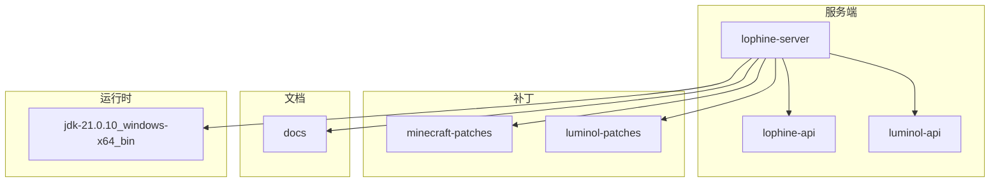
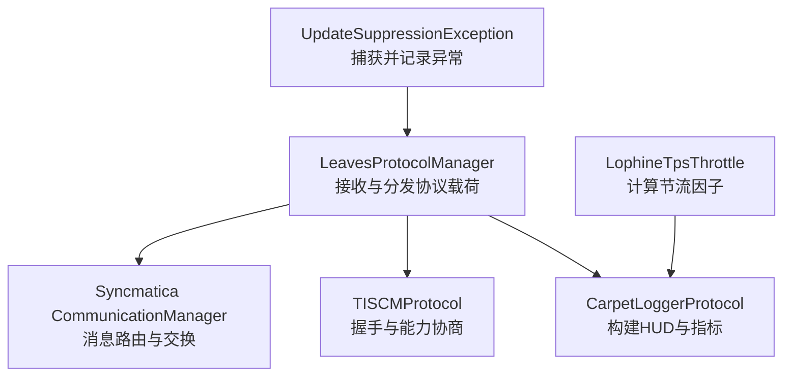
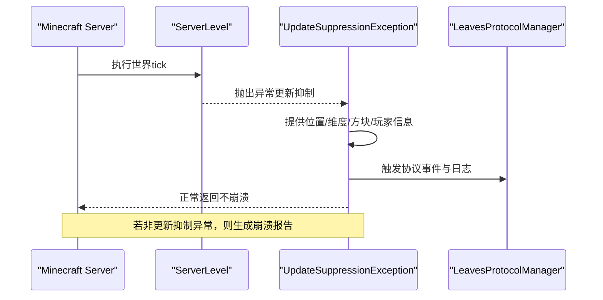
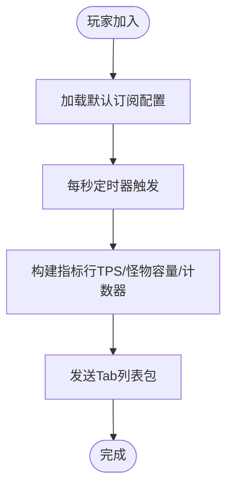
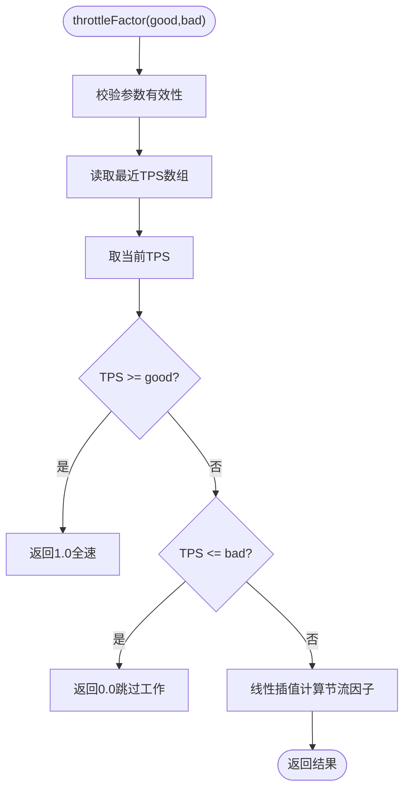
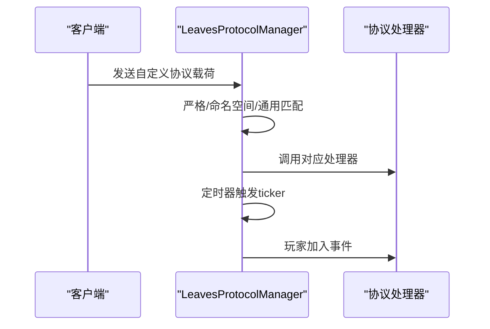
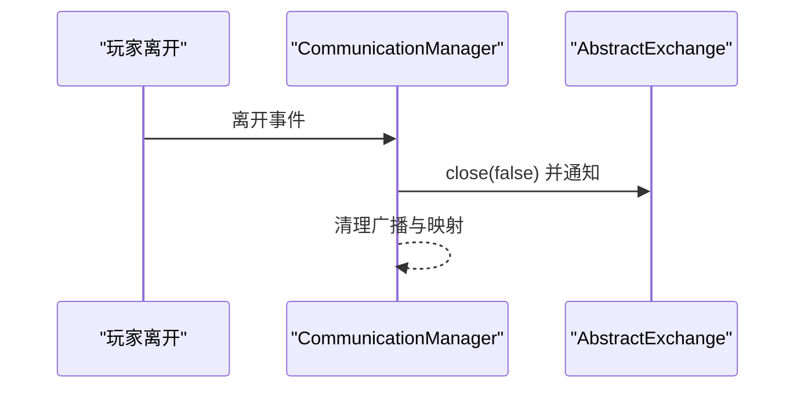
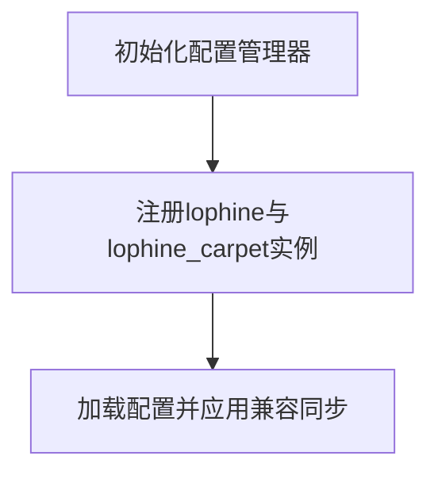
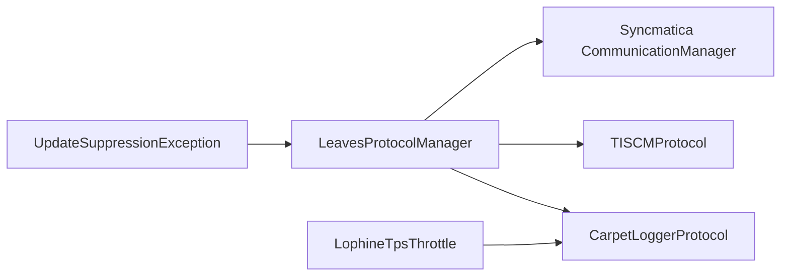

# 故障排除

<cite>
**本文引用的文件**
- [UpdateSuppressionException.java](file://lophine-server/src/main/java/org/leavesmc/leaves/util/UpdateSuppressionException.java)
- [UpdateSuppressionCrashFixConfig.java](file://lophine-server/src/main/java/fun/bm/lophine/config/modules/fixes/UpdateSuppressionCrashFixConfig.java)
- [0032-Leaves-Catch-update-suppression-crash.patch](file://lophine-server/minecraft-patches/features/0032-Leaves-Catch-update-suppression-crash.patch)
- [CarpetLoggerProtocol.java](file://lophine-server/src/main/java/fun/bm/lophine/protocol/CarpetLoggerProtocol.java)
- [LophineTpsThrottle.java](file://lophine-server/src/main/java/fun/bm/lophine/utils/LophineTpsThrottle.java)
- [LophineTpsAllCommand.java](file://lophine-server/src/main/java/fun/bm/lophine/feature/LophineTpsAllCommand.java)
- [LeavesProtocolManager.java](file://lophine-server/src/main/java/org/leavesmc/leaves/protocol/core/LeavesProtocolManager.java)
- [TISCMProtocol.java](file://lophine-server/src/main/java/fun/bm/lophine/protocol/tiscm/TISCMProtocol.java)
- [CommunicationManager.java](file://lophine-server/src/main/java/org/leavesmc/leaves/protocol/syncmatica/CommunicationManager.java)
- [AbstractExchange.java](file://lophine-server/src/main/java/org/leavesmc/leaves/protocol/syncmatica/exchange/AbstractExchange.java)
- [CoreConfig.java](file://lophine-server/src/main/java/fun/bm/lophine/carpet/config/modules/CoreConfig.java)
- [0006-Carpet-features.patch](file://lophine-server/luminol-patches/features/0006-Carpet-features.patch)
- [0002-Transformed-Configs.patch](file://lophine-server/luminol-patches/features/0002-Transformed-Configs.patch)
- [CONTRIBUTING.md](file://docs/CONTRIBUTING.md)
- [CONTRIBUTING_EN.md](file://docs/CONTRIBUTING_EN.md)
</cite>

## 目录
1. [简介](#简介)
2. [项目结构](#项目结构)
3. [核心组件](#核心组件)
4. [架构总览](#架构总览)
5. [详细组件分析](#详细组件分析)
6. [依赖分析](#依赖分析)
7. [性能注意事项](#性能注意事项)
8. [故障排除指南](#故障排除指南)
9. [结论](#结论)
10. [附录](#附录)

## 简介
本手册面向Lophine服务器管理员与运维工程师，提供系统化的故障排除与应急响应流程。内容覆盖崩溃日志分析、更新抑制相关异常排查、配置错误与兼容性修复、网络协议通信诊断、性能问题根因分析与缓解策略，以及紧急恢复与降级方案。文档以仓库中实际实现为依据，结合可操作的诊断步骤与修复建议，帮助在生产环境中快速定位与解决问题。

## 项目结构
Lophine由服务端模块与API模块组成，并通过补丁机制集成到Paper/Minecraft服务端。关键目录与职责如下：
- lophine-server：服务端实现与功能扩展，包含协议、配置、工具类与补丁应用逻辑
- lophine-api：API层与事件定义，供插件与协议扩展使用
- luminol-api：通用配置与区域化调度框架，支撑Lophine配置与性能监控
- docs：贡献指南与兼容状态文档
- jdk-21.0.10_windows-x64_bin：运行时JDK，用于JFR等诊断工具

[本图为概念性结构示意，不直接映射具体源码文件，故不提供图表来源]

## 核心组件
- 更新抑制异常处理：捕获并记录更新抑制引发的异常，避免崩溃并输出带上下文的消息
- 协议管理器：统一接收与分发自定义协议载荷，驱动定时器与玩家生命周期事件
- 性能节流与TPS监控：基于最近TPS动态调整生电特性的工作强度，防止雪崩
- 协作式日志协议：向客户端展示TPS、怪物容量与计数器等指标
- 同步协议（Syncmatica）：消息交换与取消流程，保障数据一致性
- 配置系统：支持Carpet风格配置与转换，兼容旧版配置项

**章节来源**
- [UpdateSuppressionException.java:37-142](file://lophine-server/src/main/java/org/leavesmc/leaves/util/UpdateSuppressionException.java#L37-L142)
- [LeavesProtocolManager.java:246-282](file://lophine-server/src/main/java/org/leavesmc/leaves/protocol/core/LeavesProtocolManager.java#L246-L282)
- [LophineTpsThrottle.java:15-57](file://lophine-server/src/main/java/fun/bm/lophine/utils/LophineTpsThrottle.java#L15-L57)
- [CarpetLoggerProtocol.java:30-303](file://lophine-server/src/main/java/fun/bm/lophine/protocol/CarpetLoggerProtocol.java#L30-L303)
- [CommunicationManager.java:74-110](file://lophine-server/src/main/java/org/leavesmc/leaves/protocol/syncmatica/CommunicationManager.java#L74-L110)
- [CoreConfig.java:9-29](file://lophine-server/src/main/java/fun/bm/lophine/carpet/config/modules/CoreConfig.java#L9-L29)

## 架构总览
下图展示了协议处理、性能监控与异常处理的关键交互路径。

**图表来源**
- [LeavesProtocolManager.java:246-282](file://lophine-server/src/main/java/org/leavesmc/leaves/protocol/core/LeavesProtocolManager.java#L246-L282)
- [CarpetLoggerProtocol.java:30-303](file://lophine-server/src/main/java/fun/bm/lophine/protocol/CarpetLoggerProtocol.java#L30-L303)
- [TISCMProtocol.java:117-201](file://lophine-server/src/main/java/fun/bm/lophine/protocol/tiscm/TISCMProtocol.java#L117-L201)
- [CommunicationManager.java:74-110](file://lophine-server/src/main/java/org/leavesmc/leaves/protocol/syncmatica/CommunicationManager.java#L74-L110)
- [LophineTpsThrottle.java:15-57](file://lophine-server/src/main/java/fun/bm/lophine/utils/LophineTpsThrottle.java#L15-L57)
- [UpdateSuppressionException.java:37-142](file://lophine-server/src/main/java/org/leavesmc/leaves/util/UpdateSuppressionException.java#L37-L142)

## 详细组件分析

### 更新抑制异常处理（Update Suppression）
- 功能要点
  - 捕获由更新抑制触发的异常，提取位置、维度、来源方块与玩家信息
  - 通过事件与日志上报，避免直接崩溃
  - 可通过配置开关控制是否启用该保护
- 关键实现
  - 异常封装与消息格式化，包含类型、坐标、维度与玩家标识
  - 在服务端tick循环中拦截异常并走特殊分支，否则按原逻辑生成崩溃报告
- 排查要点
  - 若出现频繁“更新抑制”日志，优先检查相关方块与玩家行为
  - 结合TPS与节流策略，评估是否为高负载导致的异常放大

**图表来源**
- [0032-Leaves-Catch-update-suppression-crash.patch:63-85](file://lophine-server/minecraft-patches/features/0032-Leaves-Catch-update-suppression-crash.patch#L63-L85)
- [UpdateSuppressionException.java:86-105](file://lophine-server/src/main/java/org/leavesmc/leaves/util/UpdateSuppressionException.java#L86-L105)

**章节来源**
- [UpdateSuppressionException.java:37-142](file://lophine-server/src/main/java/org/leavesmc/leaves/util/UpdateSuppressionException.java#L37-L142)
- [UpdateSuppressionCrashFixConfig.java:8-13](file://lophine-server/src/main/java/fun/bm/lophine/config/modules/fixes/UpdateSuppressionCrashFixConfig.java#L8-L13)
- [0032-Leaves-Catch-update-suppression-crash.patch:1-85](file://lophine-server/minecraft-patches/features/0032-Leaves-Catch-update-suppression-crash.patch#L1-L85)

### 协议处理与HUD指标（CarpetLoggerProtocol）
- 功能要点
  - 支持订阅TPS、怪物容量与计数器等指标，定时发送至客户端Tab列表
  - 解析配置中的默认订阅项，按玩家维度动态选择显示目标
- 排查要点
  - 若客户端未显示指标，检查默认订阅配置与玩家加入事件
  - 确认协议激活状态与tick间隔设置

**图表来源**
- [CarpetLoggerProtocol.java:66-136](file://lophine-server/src/main/java/fun/bm/lophine/protocol/CarpetLoggerProtocol.java#L66-L136)

**章节来源**
- [CarpetLoggerProtocol.java:30-303](file://lophine-server/src/main/java/fun/bm/lophine/protocol/CarpetLoggerProtocol.java#L30-L303)

### 性能节流与TPS监控（LophineTpsThrottle）
- 功能要点
  - 基于最近TPS值计算线性节流因子，动态降低高耗时特性的执行频率
  - 提供最近TPS数组访问接口，便于外部查询
- 排查要点
  - 当TPS下降明显时，确认节流是否生效
  - 结合命令查看区域TPS/MSPT状态，辅助定位热点区域

**图表来源**
- [LophineTpsThrottle.java:25-38](file://lophine-server/src/main/java/fun/bm/lophine/utils/LophineTpsThrottle.java#L25-L38)
- [LophineTpsThrottle.java:44-55](file://lophine-server/src/main/java/fun/bm/lophine/utils/LophineTpsThrottle.java#L44-L55)

**章节来源**
- [LophineTpsThrottle.java:15-57](file://lophine-server/src/main/java/fun/bm/lophine/utils/LophineTpsThrottle.java#L15-L57)
- [LophineTpsAllCommand.java:36-60](file://lophine-server/src/main/java/fun/bm/lophine/feature/LophineTpsAllCommand.java#L36-L60)

### 协议管理与消息路由（LeavesProtocolManager）
- 功能要点
  - 统一注册与调用协议处理器，支持严格匹配、命名空间匹配与通用处理器
  - 定时器按周期触发各协议的ticker
  - 玩家加入时初始化已知ID并广播事件
- 排查要点
  - 若协议无效或未生效，检查注册表与命名空间匹配
  - 确认tick间隔与事件回调是否被正确调用

**图表来源**
- [LeavesProtocolManager.java:246-282](file://lophine-server/src/main/java/org/leavesmc/leaves/protocol/core/LeavesProtocolManager.java#L246-L282)

**章节来源**
- [LeavesProtocolManager.java:246-282](file://lophine-server/src/main/java/org/leavesmc/leaves/protocol/core/LeavesProtocolManager.java#L246-L282)

### 同步协议与交换（Syncmatica）
- 功能要点
  - 玩家离开时清理交换目标并通知相关交换
  - 收到协议载荷后根据交换目标路由，若无匹配则进入通用处理
  - 交换关闭后统一通知
- 排查要点
  - 若同步失败或卡顿，检查交换目标与取消流程
  - 确认交换对象的finish状态与onClose回调

**图表来源**
- [CommunicationManager.java:74-110](file://lophine-server/src/main/java/org/leavesmc/leaves/protocol/syncmatica/CommunicationManager.java#L74-L110)
- [AbstractExchange.java:32-83](file://lophine-server/src/main/java/org/leavesmc/leaves/protocol/syncmatica/exchange/AbstractExchange.java#L32-L83)

**章节来源**
- [CommunicationManager.java:74-110](file://lophine-server/src/main/java/org/leavesmc/leaves/protocol/syncmatica/CommunicationManager.java#L74-L110)
- [AbstractExchange.java:32-83](file://lophine-server/src/main/java/org/leavesmc/leaves/protocol/syncmatica/exchange/AbstractExchange.java#L32-L83)

### 配置系统与兼容性（Carpet风格与转换）
- 功能要点
  - 支持启用Carpet风格配置，统一管理全局配置
  - 通过转换注解兼容旧版配置项名称，避免破坏性迁移
- 排查要点
  - 启用Carpet配置前，确认原有配置会被覆盖
  - 使用转换注解确保旧配置项平滑过渡

**图表来源**
- [0006-Carpet-features.patch:14-23](file://lophine-server/luminol-patches/features/0006-Carpet-features.patch#L14-L23)
- [CoreConfig.java:25-29](file://lophine-server/src/main/java/fun/bm/lophine/carpet/config/modules/CoreConfig.java#L25-L29)
- [0002-Transformed-Configs.patch:15-24](file://lophine-server/luminol-patches/features/0002-Transformed-Configs.patch#L15-L24)

**章节来源**
- [CoreConfig.java:9-29](file://lophine-server/src/main/java/fun/bm/lophine/carpet/config/modules/CoreConfig.java#L9-L29)
- [0006-Carpet-features.patch:14-23](file://lophine-server/luminol-patches/features/0006-Carpet-features.patch#L14-L23)
- [0002-Transformed-Configs.patch:15-24](file://lophine-server/luminol-patches/features/0002-Transformed-Configs.patch#L15-L24)

## 依赖分析
- 组件耦合
  - 协议管理器作为中枢，协调各协议处理器与定时器
  - 性能节流与HUD指标存在间接依赖（节流影响工作量，指标反映负载）
  - 更新抑制异常处理与协议管理器存在事件与日志层面的协作
- 外部依赖
  - Paper的区域化调度与TickRegionScheduler为性能监控提供数据源
  - Minecraft Server的TickTimes5s用于计算TPS

**图表来源**
- [LeavesProtocolManager.java:246-282](file://lophine-server/src/main/java/org/leavesmc/leaves/protocol/core/LeavesProtocolManager.java#L246-L282)
- [CarpetLoggerProtocol.java:30-303](file://lophine-server/src/main/java/fun/bm/lophine/protocol/CarpetLoggerProtocol.java#L30-L303)
- [TISCMProtocol.java:117-201](file://lophine-server/src/main/java/fun/bm/lophine/protocol/tiscm/TISCMProtocol.java#L117-L201)
- [CommunicationManager.java:74-110](file://lophine-server/src/main/java/org/leavesmc/leaves/protocol/syncmatica/CommunicationManager.java#L74-L110)
- [LophineTpsThrottle.java:15-57](file://lophine-server/src/main/java/fun/bm/lophine/utils/LophineTpsThrottle.java#L15-L57)
- [UpdateSuppressionException.java:37-142](file://lophine-server/src/main/java/org/leavesmc/leaves/util/UpdateSuppressionException.java#L37-L142)

**章节来源**
- [LeavesProtocolManager.java:246-282](file://lophine-server/src/main/java/org/leavesmc/leaves/protocol/core/LeavesProtocolManager.java#L246-L282)
- [LophineTpsThrottle.java:15-57](file://lophine-server/src/main/java/fun/bm/lophine/utils/LophineTpsThrottle.java#L15-L57)

## 性能注意事项
- 动态节流
  - 在TPS低于阈值时降低生电特性的工作强度，避免进一步恶化
  - 使用最近TPS数组进行平均计算，确保响应及时
- 指标可视化
  - 通过HUD展示TPS与MSPT，辅助定位异常区域
  - 结合区域调度器的统计信息，识别热点区域
- 建议
  - 在高负载时段启用更保守的节流阈值
  - 定期使用区域TPS命令检查整体健康状况

**章节来源**
- [LophineTpsThrottle.java:15-57](file://lophine-server/src/main/java/fun/bm/lophine/utils/LophineTpsThrottle.java#L15-L57)
- [CarpetLoggerProtocol.java:138-150](file://lophine-server/src/main/java/fun/bm/lophine/protocol/CarpetLoggerProtocol.java#L138-L150)
- [LophineTpsAllCommand.java:36-60](file://lophine-server/src/main/java/fun/bm/lophine/feature/LophineTpsAllCommand.java#L36-L60)

## 故障排除指南

### 一、崩溃日志分析与定位
- 识别更新抑制异常
  - 查看日志中是否包含“更新抑制”相关消息，确认异常类型（如CCE/SOE/IAE）
  - 记录发生位置（坐标）、维度与触发玩家，定位具体方块或行为
- 非更新抑制异常
  - 若异常未被捕获为更新抑制，将生成标准崩溃报告
  - 检查服务端tick循环中的异常分支与崩溃报告填充逻辑
- 快速定位步骤
  - 在崩溃日志中定位异常堆栈，确认触发源
  - 结合最近TPS与节流状态，判断是否为高负载导致的异常放大
  - 检查相关协议与处理器是否正常注册与调用

**章节来源**
- [UpdateSuppressionException.java:107-142](file://lophine-server/src/main/java/org/leavesmc/leaves/util/UpdateSuppressionException.java#L107-L142)
- [0032-Leaves-Catch-update-suppression-crash.patch:63-85](file://lophine-server/minecraft-patches/features/0032-Leaves-Catch-update-suppression-crash.patch#L63-L85)

### 二、更新抑制相关异常排查
- 现象
  - 服务器出现异常但未崩溃，日志提示“更新抑制”
- 排查流程
  - 检查异常消息中的类型、坐标、维度与玩家信息
  - 回溯触发方块与玩家行为，确认是否存在循环更新或不当交互
  - 临时禁用相关特性或降低节流阈值，观察是否缓解
- 配置开关
  - 通过配置模块控制是否启用更新抑制崩溃防护

**章节来源**
- [UpdateSuppressionException.java:37-142](file://lophine-server/src/main/java/org/leavesmc/leaves/util/UpdateSuppressionException.java#L37-L142)
- [UpdateSuppressionCrashFixConfig.java:8-13](file://lophine-server/src/main/java/fun/bm/lophine/config/modules/fixes/UpdateSuppressionCrashFixConfig.java#L8-L13)

### 三、配置错误与兼容性问题
- 启用Carpet风格配置
  - 启用后，原有Lophine配置可能被覆盖，需谨慎评估
  - 确认Carpet核心配置模块已正确加载并应用兼容同步
- 兼容性迁移
  - 使用转换注解映射旧配置项名称，避免破坏性变更
  - 逐步迁移配置，验证功能正常后再完全切换
- 快速修复
  - 若启用Carpet配置后功能异常，先回退到旧配置再逐项迁移
  - 检查转换注解是否正确映射，确保字段名与目录一致

**章节来源**
- [CoreConfig.java:9-29](file://lophine-server/src/main/java/fun/bm/lophine/carpet/config/modules/CoreConfig.java#L9-L29)
- [0006-Carpet-features.patch:14-23](file://lophine-server/luminol-patches/features/0006-Carpet-features.patch#L14-L23)
- [0002-Transformed-Configs.patch:15-24](file://lophine-server/luminol-patches/features/0002-Transformed-Configs.patch#L15-L24)

### 四、网络连接与协议通信诊断
- 协议接收与分发
  - 检查协议管理器的严格/命名空间/通用匹配是否正确
  - 确认定时器按周期触发，玩家加入事件是否被调用
- TISCM协议
  - 确认握手阶段支持的C2S/S2C包集合
  - 校验客户端支持集与服务端发送列表是否一致
- Syncmatica交换
  - 玩家离开时应清理交换目标并通知
  - 收到未知包时应进入通用处理流程
- 快速诊断
  - 使用协议管理器的日志与事件回调确认处理链路
  - 校验客户端支持能力与服务端发送能力的一致性

**章节来源**
- [LeavesProtocolManager.java:246-282](file://lophine-server/src/main/java/org/leavesmc/leaves/protocol/core/LeavesProtocolManager.java#L246-L282)
- [TISCMProtocol.java:88-120](file://lophine-server/src/main/java/fun/bm/lophine/protocol/tiscm/TISCMProtocol.java#L88-L120)
- [CommunicationManager.java:74-110](file://lophine-server/src/main/java/org/leavesmc/leaves/protocol/syncmatica/CommunicationManager.java#L74-L110)
- [AbstractExchange.java:32-83](file://lophine-server/src/main/java/org/leavesmc/leaves/protocol/syncmatica/exchange/AbstractExchange.java#L32-L83)

### 五、性能问题根因分析与缓解
- 根因分析
  - 使用区域TPS命令查看整体与区域级TPS/MSPT
  - 结合HUD指标确认是否存在异常的怪物容量或计数器
  - 检查最近TPS数组变化趋势，识别突发性负载
- 缓解策略
  - 启用动态节流，在TPS下降时自动降低工作强度
  - 限制高耗时特性（如羊毛漏斗计数器、物品电梯）的执行频率
  - 分时段限流，避免高峰期叠加

**章节来源**
- [LophineTpsAllCommand.java:36-60](file://lophine-server/src/main/java/fun/bm/lophine/feature/LophineTpsAllCommand.java#L36-L60)
- [CarpetLoggerProtocol.java:138-150](file://lophine-server/src/main/java/fun/bm/lophine/protocol/CarpetLoggerProtocol.java#L138-L150)
- [LophineTpsThrottle.java:15-57](file://lophine-server/src/main/java/fun/bm/lophine/utils/LophineTpsThrottle.java#L15-L57)

### 六、紧急恢复与降级方案
- 立即措施
  - 临时禁用高风险特性，降低节流阈值，避免进一步恶化
  - 回退到上一个稳定的配置版本，确保基础功能可用
- 降级策略
  - 关闭Carpet风格配置，回到传统配置管理模式
  - 暂停协议扩展功能，仅保留必要协议
- 恢复步骤
  - 逐步启用特性并监控TPS/MSPT
  - 使用贡献指南提供的补丁流程修复问题并重新打包发布

**章节来源**
- [CONTRIBUTING.md:69-93](file://docs/CONTRIBUTING.md#L69-L93)
- [CONTRIBUTING_EN.md:66-96](file://docs/CONTRIBUTING_EN.md#L66-L96)

## 结论
本手册基于Lophine服务端的实际实现，提供了从崩溃日志分析、更新抑制异常处理、配置与兼容性修复，到网络协议诊断与性能优化的完整排障路径。建议在日常运维中结合区域TPS命令与HUD指标进行持续监控，并在变更配置或启用新特性前做好回滚准备，确保系统稳定与业务连续性。

## 附录
- 相关命令与配置
  - 区域TPS命令：用于查看区域级TPS/MSPT状态
  - 更新抑制崩溃防护：通过配置模块控制是否启用
- 补丁与贡献
  - 新增/修改补丁遵循贡献指南，确保补丁生成与提交流程规范

**章节来源**
- [LophineTpsAllCommand.java:36-60](file://lophine-server/src/main/java/fun/bm/lophine/feature/LophineTpsAllCommand.java#L36-L60)
- [UpdateSuppressionCrashFixConfig.java:8-13](file://lophine-server/src/main/java/fun/bm/lophine/config/modules/fixes/UpdateSuppressionCrashFixConfig.java#L8-L13)
- [CONTRIBUTING.md:69-93](file://docs/CONTRIBUTING.md#L69-L93)
- [CONTRIBUTING_EN.md:66-96](file://docs/CONTRIBUTING_EN.md#L66-L96)