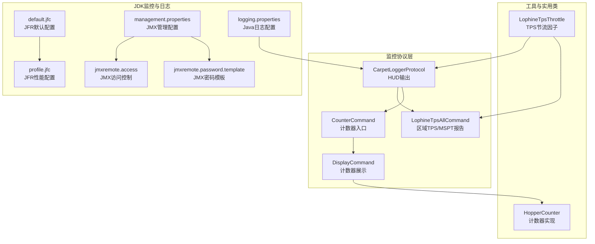
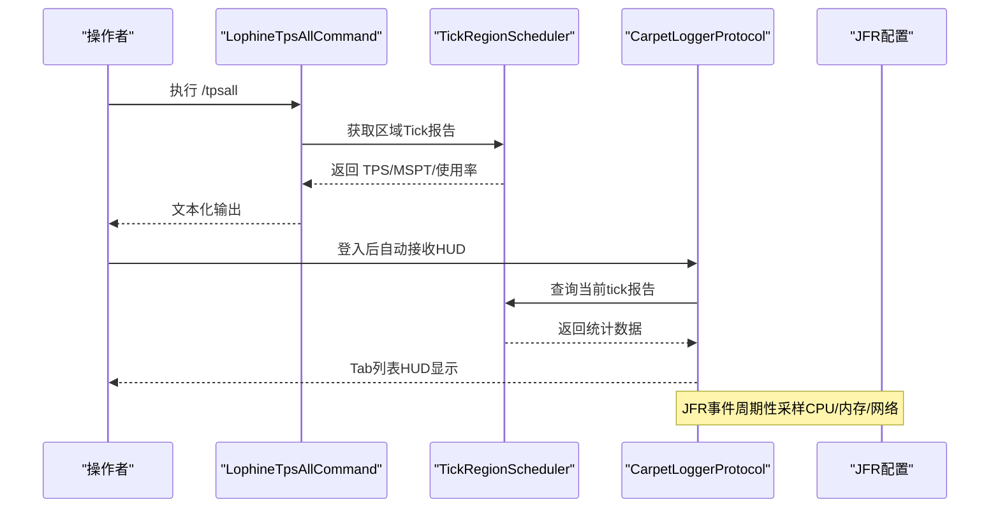
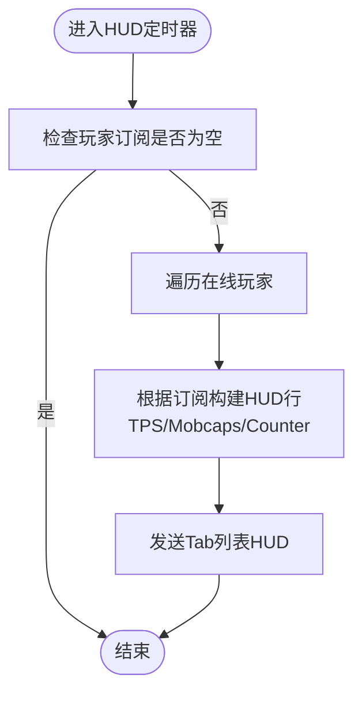
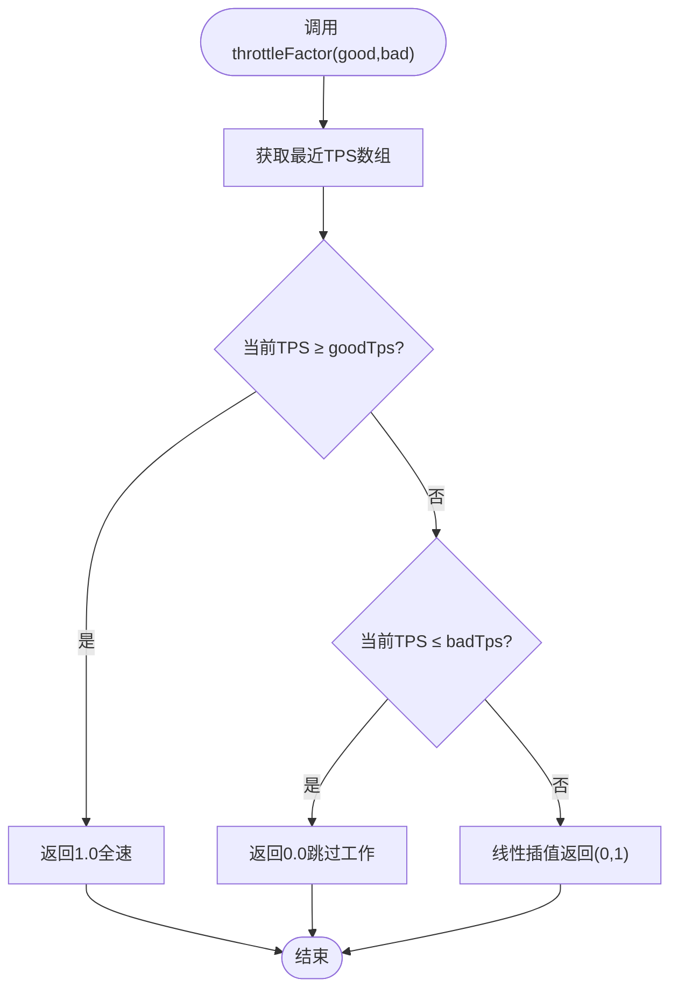
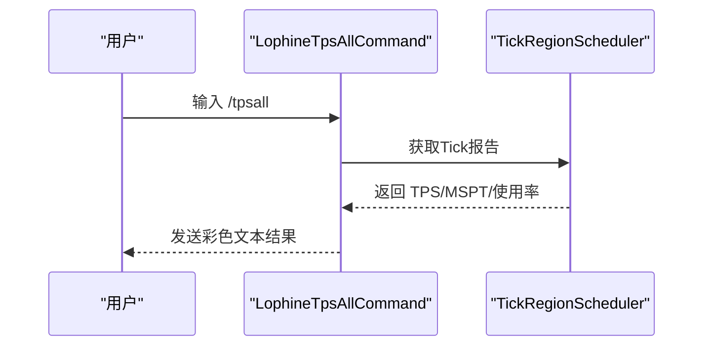
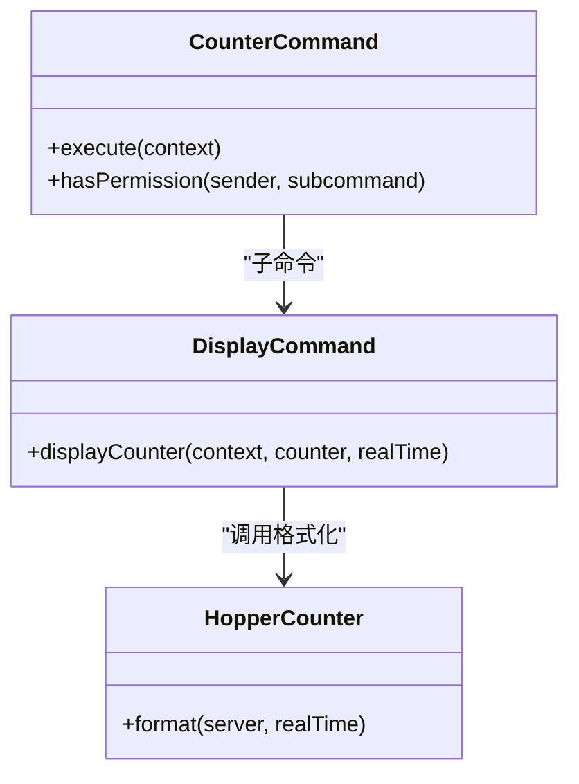
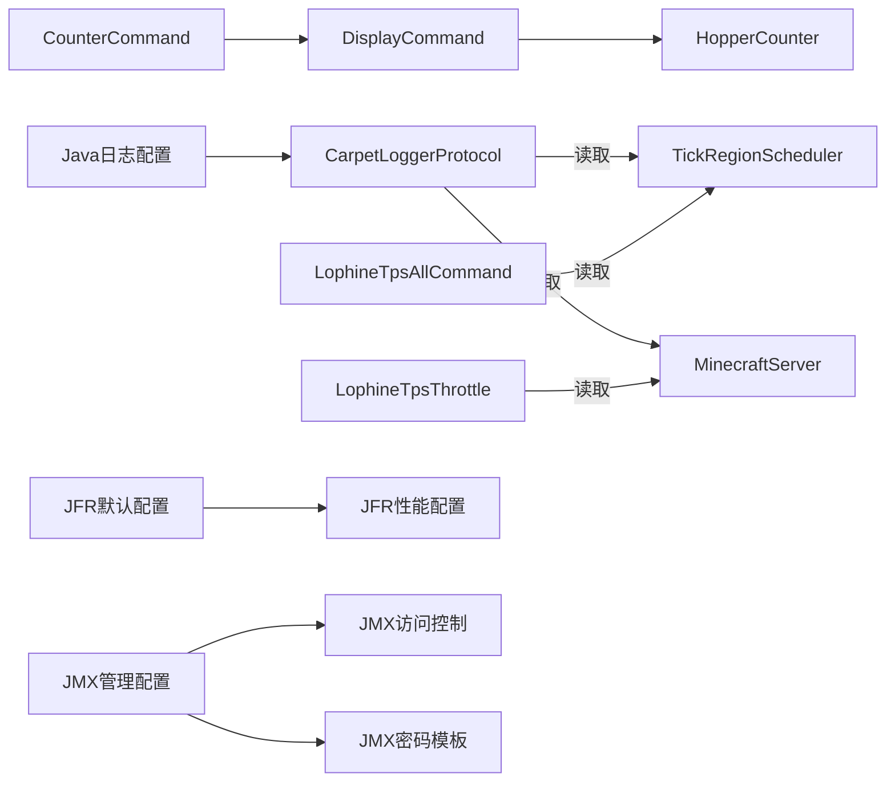

# 监控与日志

<cite>
**本文引用的文件**
- [CarpetLoggerProtocol.java](file://lophine-server/src/main/java/fun/bm/lophine/protocol/CarpetLoggerProtocol.java)
- [LophineTpsThrottle.java](file://lophine-server/src/main/java/fun/bm/lophine/utils/LophineTpsThrottle.java)
- [LophineTpsAllCommand.java](file://lophine-server/src/main/java/fun/bm/lophine/feature/LophineTpsAllCommand.java)
- [CounterCommand.java](file://lophine-server/src/main/java/fun/bm/lophine/command/counter/CounterCommand.java)
- [DisplayCommand.java](file://lophine-server/src/main/java/fun/bm/lophine/command/counter/sub/DisplayCommand.java)
- [HopperCounter.java](file://lophine-server/src/main/java/org/leavesmc/leaves/util/HopperCounter.java)
- [logging.properties](file://jdk-21.0.10_windows-x64_bin/jdk-21.0.10/conf/logging.properties)
- [management.properties](file://jdk-21.0.10_windows-x64_bin/jdk-21.0.10/conf/management/management.properties)
- [jmxremote.access](file://jdk-21.0.10_windows-x64_bin/jdk-21.0.10/conf/management/jmxremote.access)
- [jmxremote.password.template](file://jdk-21.0.10_windows-x64_bin/jdk-21.0.10/conf/management/jmxremote.password.template)
- [default.jfc](file://jdk-21.0.10_windows-x64_bin/jdk-21.0.10/lib/jfr/default.jfc)
- [profile.jfc](file://jdk-21.0.10_windows-x64_bin/jdk-21.0.10/lib/jfr/profile.jfc)
</cite>

## 目录
1. [简介](#简介)
2. [项目结构](#项目结构)
3. [核心组件](#核心组件)
4. [架构总览](#架构总览)
5. [组件详解](#组件详解)
6. [依赖关系分析](#依赖关系分析)
7. [性能考量](#性能考量)
8. [故障排查指南](#故障排查指南)
9. [结论](#结论)
10. [附录](#附录)

## 简介
本指南面向Lophine服务器管理员与运维工程师，系统性介绍服务器监控与日志管理实践，覆盖以下主题：
- 服务器性能指标（TPS、MSPT、区域使用率）的采集与阈值设定
- 日志级别与日志轮转策略
- 实体计数器（Hopper Counter）的使用与展示
- 关键指标监控方案：内存、CPU、网络延迟
- 告警规则与通知机制建议
- 远程监控集成与可视化仪表板配置思路
- 日志分析与问题诊断方法论

## 项目结构
围绕监控与日志的关键模块分布如下：
- 协议与HUD显示：CarpetLoggerProtocol负责将TPS、怪物槽位（mobcaps）、计数器等信息以HUD形式展示给玩家
- 指标计算与命令：LophineTpsAllCommand提供区域级TPS/MSPT/使用率的综合报告；LophineTpsThrottle提供基于TPS的节流因子
- 计数器命令体系：CounterCommand及其子命令（Toggle/Reset/Display）控制与展示实体计数器
- JDK内置监控：JFR事件配置、JMX管理配置、Java日志配置

**图表来源**
- [CarpetLoggerProtocol.java:30-105](file://lophine-server/src/main/java/fun/bm/lophine/protocol/CarpetLoggerProtocol.java#L30-L105)
- [LophineTpsAllCommand.java:32-86](file://lophine-server/src/main/java/fun/bm/lophine/feature/LophineTpsAllCommand.java#L32-L86)
- [CounterCommand.java:16-41](file://lophine-server/src/main/java/fun/bm/lophine/command/counter/CounterCommand.java#L16-L41)
- [DisplayCommand.java:19-39](file://lophine-server/src/main/java/fun/bm/lophine/command/counter/sub/DisplayCommand.java#L19-L39)
- [LophineTpsThrottle.java:15-56](file://lophine-server/src/main/java/fun/bm/lophine/utils/LophineTpsThrottle.java#L15-L56)
- [HopperCounter.java:124-143](file://lophine-server/src/main/java/org/leavesmc/leaves/util/HopperCounter.java#L124-L143)
- [default.jfc:606-654](file://jdk-21.0.10_windows-x64_bin/jdk-21.0.10/lib/jfr/default.jfc#L606-L654)
- [profile.jfc:606-654](file://jdk-21.0.10_windows-x64_bin/jdk-21.0.10/lib/jfr/profile.jfc#L606-L654)
- [management.properties:1-265](file://jdk-21.0.10_windows-x64_bin/jdk-21.0.10/conf/management/management.properties#L1-L265)
- [jmxremote.access:1-48](file://jdk-21.0.10_windows-x64_bin/jdk-21.0.10/conf/management/jmxremote.access#L1-L48)
- [jmxremote.password.template:1-97](file://jdk-21.0.10_windows-x64_bin/jdk-21.0.10/conf/management/jmxremote.password.template#L1-L97)
- [logging.properties:36-63](file://jdk-21.0.10_windows-x64_bin/jdk-21.0.10/conf/logging.properties#L36-L63)

**章节来源**
- [CarpetLoggerProtocol.java:30-105](file://lophine-server/src/main/java/fun/bm/lophine/protocol/CarpetLoggerProtocol.java#L30-L105)
- [LophineTpsAllCommand.java:32-86](file://lophine-server/src/main/java/fun/bm/lophine/feature/LophineTpsAllCommand.java#L32-L86)
- [CounterCommand.java:16-41](file://lophine-server/src/main/java/fun/bm/lophine/command/counter/CounterCommand.java#L16-L41)
- [DisplayCommand.java:19-39](file://lophine-server/src/main/java/fun/bm/lophine/command/counter/sub/DisplayCommand.java#L19-L39)
- [LophineTpsThrottle.java:15-56](file://lophine-server/src/main/java/fun/bm/lophine/utils/LophineTpsThrottle.java#L15-L56)
- [HopperCounter.java:124-143](file://lophine-server/src/main/java/org/leavesmc/leaves/util/HopperCounter.java#L124-L143)
- [default.jfc:606-654](file://jdk-21.0.10_windows-x64_bin/jdk-21.0.10/lib/jfr/default.jfc#L606-L654)
- [profile.jfc:606-654](file://jdk-21.0.10_windows-x64_bin/jdk-21.0.10/lib/jfr/profile.jfc#L606-L654)
- [management.properties:1-265](file://jdk-21.0.10_windows-x64_bin/jdk-21.0.10/conf/management/management.properties#L1-L265)
- [jmxremote.access:1-48](file://jdk-21.0.10_windows-x64_bin/jdk-21.0.10/conf/management/jmxremote.access#L1-L48)
- [jmxremote.password.template:1-97](file://jdk-21.0.10_windows-x64_bin/jdk-21.0.10/conf/management/jmxremote.password.template#L1-L97)
- [logging.properties:36-63](file://jdk-21.0.10_windows-x64_bin/jdk-21.0.10/conf/logging.properties#L36-L63)

## 核心组件
- HUD监控协议（CarpetLoggerProtocol）
  - 支持订阅“tps”“mobcaps”“counter”，按玩家维度动态渲染HUD
  - 默认订阅由配置解析生成，支持动态刷新
- TPS与节流（LophineTpsThrottle）
  - 提供最近TPS数组与线性插值节流因子，用于在低TPS时降低非关键功能开销
- 区域TPS命令（LophineTpsAllCommand）
  - 输出当前区域TPS、MSPT、峰值MSPT与区域使用率，并给出颜色分级提示
- 计数器命令体系（CounterCommand/DisplayCommand）
  - 控制计数器开关、重置与按颜色展示，底层由HopperCounter提供格式化输出

**章节来源**
- [CarpetLoggerProtocol.java:36-48](file://lophine-server/src/main/java/fun/bm/lophine/protocol/CarpetLoggerProtocol.java#L36-L48)
- [LophineTpsThrottle.java:25-38](file://lophine-server/src/main/java/fun/bm/lophine/utils/LophineTpsThrottle.java#L25-L38)
- [LophineTpsAllCommand.java:51-86](file://lophine-server/src/main/java/fun/bm/lophine/feature/LophineTpsAllCommand.java#L51-L86)
- [CounterCommand.java:16-41](file://lophine-server/src/main/java/fun/bm/lophine/command/counter/CounterCommand.java#L16-L41)
- [DisplayCommand.java:27-31](file://lophine-server/src/main/java/fun/bm/lophine/command/counter/sub/DisplayCommand.java#L27-L31)
- [HopperCounter.java:124-143](file://lophine-server/src/main/java/org/leavesmc/leaves/util/HopperCounter.java#L124-L143)

## 架构总览
下图展示了从命令到HUD与JDK监控的交互路径。

**图表来源**
- [LophineTpsAllCommand.java:51-86](file://lophine-server/src/main/java/fun/bm/lophine/feature/LophineTpsAllCommand.java#L51-L86)
- [CarpetLoggerProtocol.java:107-150](file://lophine-server/src/main/java/fun/bm/lophine/protocol/CarpetLoggerProtocol.java#L107-L150)
- [default.jfc:636-654](file://jdk-21.0.10_windows-x64_bin/jdk-21.0.10/lib/jfr/default.jfc#L636-L654)
- [profile.jfc:636-654](file://jdk-21.0.10_windows-x64_bin/jdk-21.0.10/lib/jfr/profile.jfc#L636-L654)

## 组件详解

### HUD监控协议（CarpetLoggerProtocol）
- 功能要点
  - 解析配置生成默认订阅（支持“tps”“mobcaps”“counter”），按玩家注入HUD
  - 定时器每秒触发一次HUD更新，内容实时计算
  - mobcaps支持动态或指定维度（主世界/下界/末地）
  - counter支持多颜色聚合展示
- 配置与默认值
  - 支持的logger名称与默认选项由内部解析逻辑决定
  - 当未配置或为空时，清空玩家HUD

**图表来源**
- [CarpetLoggerProtocol.java:78-132](file://lophine-server/src/main/java/fun/bm/lophine/protocol/CarpetLoggerProtocol.java#L78-L132)

**章节来源**
- [CarpetLoggerProtocol.java:36-48](file://lophine-server/src/main/java/fun/bm/lophine/protocol/CarpetLoggerProtocol.java#L36-L48)
- [CarpetLoggerProtocol.java:107-150](file://lophine-server/src/main/java/fun/bm/lophine/protocol/CarpetLoggerProtocol.java#L107-L150)
- [CarpetLoggerProtocol.java:183-204](file://lophine-server/src/main/java/fun/bm/lophine/protocol/CarpetLoggerProtocol.java#L183-L204)
- [CarpetLoggerProtocol.java:261-301](file://lophine-server/src/main/java/fun/bm/lophine/protocol/CarpetLoggerProtocol.java#L261-L301)

### TPS与节流（LophineTpsThrottle）
- 功能要点
  - 提供最近TPS数组（5秒、10秒等窗口）
  - 基于goodTps与badTps线性插值返回节流因子（0~1）
  - 在低TPS时抑制高耗时特性，避免雪崩
- 使用建议
  - 将节流因子应用于高频任务（如计数器、电梯等）
  - 合理设置goodTps/badTps阈值以平衡体验与稳定性

**图表来源**
- [LophineTpsThrottle.java:25-38](file://lophine-server/src/main/java/fun/bm/lophine/utils/LophineTpsThrottle.java#L25-L38)
- [LophineTpsThrottle.java:44-55](file://lophine-server/src/main/java/fun/bm/lophine/utils/LophineTpsThrottle.java#L44-L55)

**章节来源**
- [LophineTpsThrottle.java:15-56](file://lophine-server/src/main/java/fun/bm/lophine/utils/LophineTpsThrottle.java#L15-L56)

### 区域TPS命令（LophineTpsAllCommand）
- 功能要点
  - 输出当前区域的TPS、MSPT、峰值MSPT与区域使用率
  - 对数值进行颜色分级提示，便于快速判断健康度
  - 失败时输出异常信息
- 使用建议
  - 结合JFR事件与JMX监控，定位高MSPT时段的热点

**图表来源**
- [LophineTpsAllCommand.java:51-86](file://lophine-server/src/main/java/fun/bm/lophine/feature/LophineTpsAllCommand.java#L51-L86)

**章节来源**
- [LophineTpsAllCommand.java:51-101](file://lophine-server/src/main/java/fun/bm/lophine/feature/LophineTpsAllCommand.java#L51-L101)

### 计数器命令体系（CounterCommand/DisplayCommand）
- 功能要点
  - 入口命令显示计数器启用状态
  - 子命令支持切换、重置与按颜色展示
  - 展示内容包含物品统计、累计数量与时钟周期换算
- 使用建议
  - 通过HUD订阅“counter”配合颜色参数，实现多色聚合展示
  - 结合节流因子，在高负载时减少计数器刷新频率

**图表来源**
- [CounterCommand.java:16-41](file://lophine-server/src/main/java/fun/bm/lophine/command/counter/CounterCommand.java#L16-L41)
- [DisplayCommand.java:27-31](file://lophine-server/src/main/java/fun/bm/lophine/command/counter/sub/DisplayCommand.java#L27-L31)
- [HopperCounter.java:124-143](file://lophine-server/src/main/java/org/leavesmc/leaves/util/HopperCounter.java#L124-L143)

**章节来源**
- [CounterCommand.java:16-41](file://lophine-server/src/main/java/fun/bm/lophine/command/counter/CounterCommand.java#L16-L41)
- [DisplayCommand.java:19-39](file://lophine-server/src/main/java/fun/bm/lophine/command/counter/sub/DisplayCommand.java#L19-L39)
- [HopperCounter.java:124-143](file://lophine-server/src/main/java/org/leavesmc/leaves/util/HopperCounter.java#L124-L143)

## 依赖关系分析
- 组件耦合
  - HUD协议依赖Paper的TickRegionScheduler与MinecraftServer提供的tick数据
  - 计数器命令依赖Leaves的HopperCounter工具
  - 节流工具直接依赖MinecraftServer的tick时间数组
- 外部依赖
  - JFR事件配置用于CPU/内存/网络采样
  - JMX配置用于远端监控接入
  - Java日志配置用于文件轮转与控制台输出级别

**图表来源**
- [CarpetLoggerProtocol.java:107-150](file://lophine-server/src/main/java/fun/bm/lophine/protocol/CarpetLoggerProtocol.java#L107-L150)
- [LophineTpsAllCommand.java:51-86](file://lophine-server/src/main/java/fun/bm/lophine/feature/LophineTpsAllCommand.java#L51-L86)
- [LophineTpsThrottle.java:44-55](file://lophine-server/src/main/java/fun/bm/lophine/utils/LophineTpsThrottle.java#L44-L55)
- [CounterCommand.java:16-41](file://lophine-server/src/main/java/fun/bm/lophine/command/counter/CounterCommand.java#L16-L41)
- [DisplayCommand.java:27-31](file://lophine-server/src/main/java/fun/bm/lophine/command/counter/sub/DisplayCommand.java#L27-L31)
- [HopperCounter.java:124-143](file://lophine-server/src/main/java/org/leavesmc/leaves/util/HopperCounter.java#L124-L143)
- [default.jfc:606-654](file://jdk-21.0.10_windows-x64_bin/jdk-21.0.10/lib/jfr/default.jfc#L606-L654)
- [profile.jfc:606-654](file://jdk-21.0.10_windows-x64_bin/jdk-21.0.10/lib/jfr/profile.jfc#L606-L654)
- [management.properties:1-265](file://jdk-21.0.10_windows-x64_bin/jdk-21.0.10/conf/management/management.properties#L1-L265)
- [jmxremote.access:1-48](file://jdk-21.0.10_windows-x64_bin/jdk-21.0.10/conf/management/jmxremote.access#L1-L48)
- [jmxremote.password.template:1-97](file://jdk-21.0.10_windows-x64_bin/jdk-21.0.10/conf/management/jmxremote.password.template#L1-L97)
- [logging.properties:36-63](file://jdk-21.0.10_windows-x64_bin/jdk-21.0.10/conf/logging.properties#L36-L63)

**章节来源**
- [CarpetLoggerProtocol.java:30-105](file://lophine-server/src/main/java/fun/bm/lophine/protocol/CarpetLoggerProtocol.java#L30-L105)
- [LophineTpsAllCommand.java:32-86](file://lophine-server/src/main/java/fun/bm/lophine/feature/LophineTpsAllCommand.java#L32-L86)
- [LophineTpsThrottle.java:15-56](file://lophine-server/src/main/java/fun/bm/lophine/utils/LophineTpsThrottle.java#L15-L56)
- [CounterCommand.java:16-41](file://lophine-server/src/main/java/fun/bm/lophine/command/counter/CounterCommand.java#L16-L41)
- [DisplayCommand.java:19-39](file://lophine-server/src/main/java/fun/bm/lophine/command/counter/sub/DisplayCommand.java#L19-L39)
- [HopperCounter.java:124-143](file://lophine-server/src/main/java/org/leavesmc/leaves/util/HopperCounter.java#L124-L143)
- [default.jfc:606-654](file://jdk-21.0.10_windows-x64_bin/jdk-21.0.10/lib/jfr/default.jfc#L606-L654)
- [profile.jfc:606-654](file://jdk-21.0.10_windows-x64_bin/jdk-21.0.10/lib/jfr/profile.jfc#L606-L654)
- [management.properties:1-265](file://jdk-21.0.10_windows-x64_bin/jdk-21.0.10/conf/management/management.properties#L1-L265)
- [jmxremote.access:1-48](file://jdk-21.0.10_windows-x64_bin/jdk-21.0.10/conf/management/jmxremote.access#L1-L48)
- [jmxremote.password.template:1-97](file://jdk-21.0.10_windows-x64_bin/jdk-21.0.10/conf/management/jmxremote.password.template#L1-L97)
- [logging.properties:36-63](file://jdk-21.0.10_windows-x64_bin/jdk-21.0.10/conf/logging.properties#L36-L63)

## 性能考量
- TPS与MSPT
  - 使用LophineTpsThrottle在低TPS时降低非关键任务频率，避免连锁反应
  - /tpsall命令输出MSPT与峰值MSPT，结合JFR事件定位热点
- CPU与内存
  - JFR默认与性能配置中包含CPU负载、线程CPU负载、容器资源、物理内存等事件，周期性采样
  - 可通过JMX开启远端监控，结合可视化工具（如Grafana+Prometheus/JMX Exporter）建立仪表板
- 网络延迟
  - JFR提供网络利用率事件，可用于评估网络瓶颈
- 日志开销
  - Java日志默认文件轮转参数可按环境调整，避免磁盘压力

**章节来源**
- [LophineTpsThrottle.java:15-56](file://lophine-server/src/main/java/fun/bm/lophine/utils/LophineTpsThrottle.java#L15-L56)
- [LophineTpsAllCommand.java:51-101](file://lophine-server/src/main/java/fun/bm/lophine/feature/LophineTpsAllCommand.java#L51-L101)
- [default.jfc:636-654](file://jdk-21.0.10_windows-x64_bin/jdk-21.0.10/lib/jfr/default.jfc#L636-L654)
- [profile.jfc:636-654](file://jdk-21.0.10_windows-x64_bin/jdk-21.0.10/lib/jfr/profile.jfc#L636-L654)
- [logging.properties:36-63](file://jdk-21.0.10_windows-x64_bin/jdk-21.0.10/conf/logging.properties#L36-L63)

## 故障排查指南
- HUD不显示或为空
  - 检查默认订阅是否为空或被清空
  - 确认玩家加入/离开事件是否正确注入/清理订阅
- TPS/MSPT异常
  - 使用/tpsall确认数据是否存在；若无数据，可能为服务器启动时间不足
  - 结合JFR事件与JMX监控定位高MSPT时段
- 计数器未更新
  - 检查计数器开关状态与颜色参数
  - 在高负载时适当提高节流阈值，减少刷新频率
- 远程监控无法连接
  - 检查JMX端口、SSL、认证与访问控制文件配置
  - 确保密码文件权限仅限所有者访问

**章节来源**
- [CarpetLoggerProtocol.java:36-48](file://lophine-server/src/main/java/fun/bm/lophine/protocol/CarpetLoggerProtocol.java#L36-L48)
- [CarpetLoggerProtocol.java:66-76](file://lophine-server/src/main/java/fun/bm/lophine/protocol/CarpetLoggerProtocol.java#L66-L76)
- [LophineTpsAllCommand.java:74-86](file://lophine-server/src/main/java/fun/bm/lophine/feature/LophineTpsAllCommand.java#L74-L86)
- [CounterCommand.java:29-36](file://lophine-server/src/main/java/fun/bm/lophine/command/counter/CounterCommand.java#L29-L36)
- [management.properties:1-265](file://jdk-21.0.10_windows-x64_bin/jdk-21.0.10/conf/management/management.properties#L1-L265)
- [jmxremote.access:1-48](file://jdk-21.0.10_windows-x64_bin/jdk-21.0.10/conf/management/jmxremote.access#L1-L48)
- [jmxremote.password.template:82-97](file://jdk-21.0.10_windows-x64_bin/jdk-21.0.10/conf/management/jmxremote.password.template#L82-L97)

## 结论
通过HUD协议、区域TPS命令、计数器体系与JDK监控配置的协同，Lophine提供了从实时观测到远端可视化的完整监控闭环。建议结合JFR事件与JMX导出器，搭建可视化仪表板，并制定基于TPS/MSPT/使用率的告警规则，以实现稳定高效的服务器运行保障。

## 附录

### 监控与日志配置清单
- 日志级别与轮转
  - 文件轮转模式与数量、控制台级别、格式器等由Java日志配置定义
- JMX远程监控
  - 端口、SSL、主机绑定、访问控制与密码文件位置由JMX管理配置与配套文件定义
- JFR事件采样
  - 默认与性能配置包含CPU/内存/网络/垃圾回收等事件，周期性采样

**章节来源**
- [logging.properties:36-63](file://jdk-21.0.10_windows-x64_bin/jdk-21.0.10/conf/logging.properties#L36-L63)
- [management.properties:1-265](file://jdk-21.0.10_windows-x64_bin/jdk-21.0.10/conf/management/management.properties#L1-L265)
- [jmxremote.access:1-48](file://jdk-21.0.10_windows-x64_bin/jdk-21.0.10/conf/management/jmxremote.access#L1-L48)
- [jmxremote.password.template:1-97](file://jdk-21.0.10_windows-x64_bin/jdk-21.0.10/conf/management/jmxremote.password.template#L1-L97)
- [default.jfc:606-654](file://jdk-21.0.10_windows-x64_bin/jdk-21.0.10/lib/jfr/default.jfc#L606-L654)
- [profile.jfc:606-654](file://jdk-21.0.10_windows-x64_bin/jdk-21.0.10/lib/jfr/profile.jfc#L606-L654)