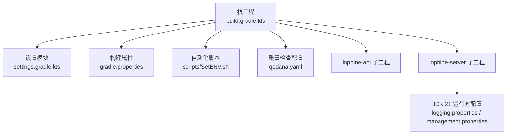
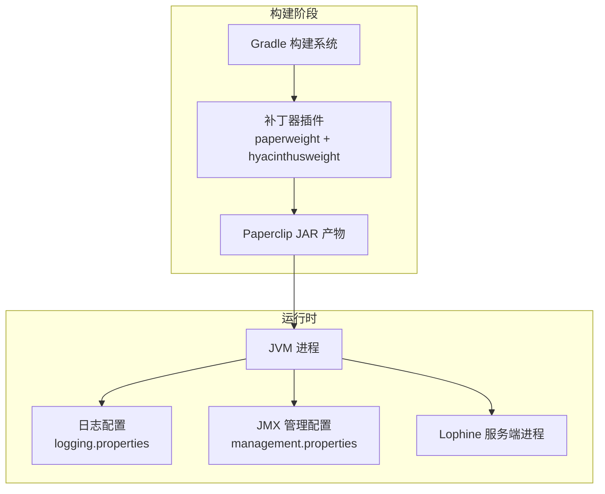
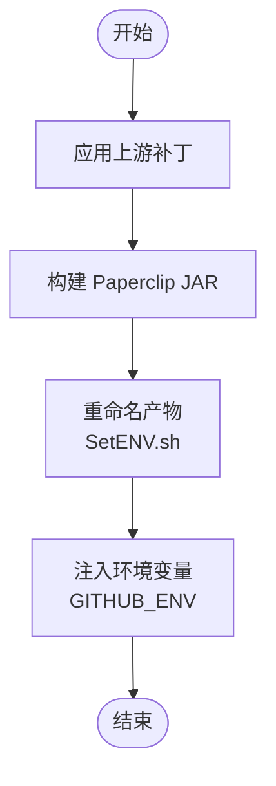
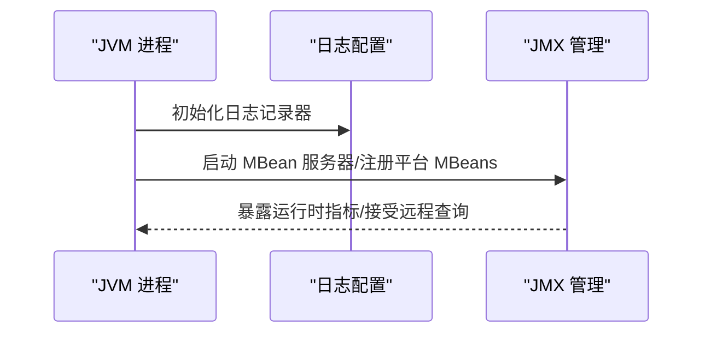
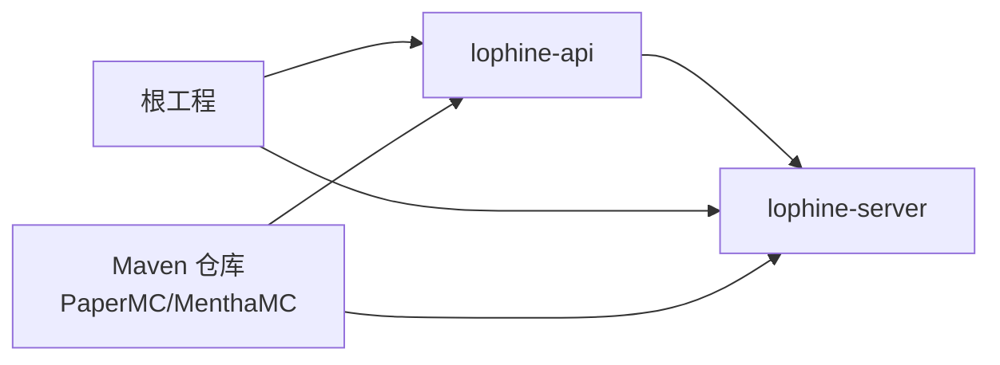

# 部署与运维

<cite>
**本文引用的文件**
- [README.md](file://README.md)
- [build.gradle.kts](file://build.gradle.kts)
- [settings.gradle.kts](file://settings.gradle.kts)
- [gradle.properties](file://gradle.properties)
- [scripts/SetENV.sh](file://scripts/SetENV.sh)
- [qodana.yaml](file://qodana.yaml)
- [jdk-21.0.10_windows-x64_bin/jdk-21.0.10/conf/logging.properties](file://jdk-21.0.10_windows-x64_bin/jdk-21.0.10/conf/logging.properties)
- [jdk-21.0.10_windows-x64_bin/jdk-21.0.10/conf/management/management.properties](file://jdk-21.0.10_windows-x64_bin/jdk-21.0.10/conf/management/management.properties)
</cite>

## 目录
1. [简介](#简介)
2. [项目结构](#项目结构)
3. [核心组件](#核心组件)
4. [架构总览](#架构总览)
5. [详细组件分析](#详细组件分析)
6. [依赖关系分析](#依赖关系分析)
7. [性能考虑](#性能考虑)
8. [故障排除指南](#故障排除指南)
9. [结论](#结论)
10. [附录](#附录)

## 简介
本指南面向生产环境的 Lophine 部署与运维，覆盖从构建到上线、从监控到日志、从性能调优到故障处理、从备份恢复到版本升级、从自动化到安全加固的全生命周期运维实践。Lophine 基于 Luminol 分支，针对 Folia 平台进行多项优化与修复，并提供可配置的原版特性与 TPS 实时展示能力。

## 项目结构
Lophine 采用多模块 Gradle 工程组织，包含 API 与服务端两个主要子工程，并通过补丁系统集成上游 Luminol 的改动。根工程定义了统一的 Java Toolchain（JDK 21）、仓库源与构建参数；子工程共享编译与测试配置；脚本用于自动化打包与发布元数据注入。

**图示来源**
- [build.gradle.kts:1-118](file://build.gradle.kts#L1-L118)
- [settings.gradle.kts:1-25](file://settings.gradle.kts#L1-L25)
- [gradle.properties:1-18](file://gradle.properties#L1-L18)
- [scripts/SetENV.sh:1-41](file://scripts/SetENV.sh#L1-L41)
- [qodana.yaml:1-11](file://qodana.yaml#L1-L11)
- [jdk-21.0.10_windows-x64_bin/jdk-21.0.10/conf/logging.properties:1-64](file://jdk-21.0.10_windows-x64_bin/jdk-21.0.10/conf/logging.properties#L1-L64)
- [jdk-21.0.10_windows-x64_bin/jdk-21.0.10/conf/management/management.properties:1-328](file://jdk-21.0.10_windows-x64_bin/jdk-21.0.10/conf/management/management.properties#L1-L328)

**章节来源**
- [build.gradle.kts:1-118](file://build.gradle.kts#L1-L118)
- [settings.gradle.kts:1-25](file://settings.gradle.kts#L1-L25)
- [gradle.properties:1-18](file://gradle.properties#L1-L18)
- [scripts/SetENV.sh:1-41](file://scripts/SetENV.sh#L1-L41)
- [qodana.yaml:1-11](file://qodana.yaml#L1-L11)

## 核心组件
- 多模块工程：lophine-api 与 lophine-server，分别承载协议扩展与服务端逻辑。
- 构建与发布：Gradle + 补丁系统，统一工具链与仓库源，支持 Paperclip JAR 产出。
- 运行时配置：JDK 21 日志与 JMX 管理配置，便于生产监控与可观测性。
- 自动化脚本：用于重命名产物、注入环境变量与发布标记，辅助 CI/CD 流水线。

**章节来源**
- [build.gradle.kts:46-109](file://build.gradle.kts#L46-L109)
- [settings.gradle.kts:21-25](file://settings.gradle.kts#L21-L25)
- [scripts/SetENV.sh:1-41](file://scripts/SetENV.sh#L1-L41)

## 架构总览
下图展示了 Lophine 的构建与运行时关系，以及与 JDK 运行时配置的交互。

**图示来源**
- [build.gradle.kts:9-41](file://build.gradle.kts#L9-L41)
- [jdk-21.0.10_windows-x64_bin/jdk-21.0.10/conf/logging.properties:1-64](file://jdk-21.0.10_windows-x64_bin/jdk-21.0.10/conf/logging.properties#L1-L64)
- [jdk-21.0.10_windows-x64_bin/jdk-21.0.10/conf/management/management.properties:1-328](file://jdk-21.0.10_windows-x64_bin/jdk-21.0.10/conf/management/management.properties#L1-L328)

## 详细组件分析

### 构建与发布流水线
- 工具链与仓库：统一使用 JDK 21 Toolchain，启用 Maven 中央仓库与 PaperMC、MenthaMC 私有仓库。
- 补丁与上游：通过 paperweight upstreams 注入 Luminol 上游变更，应用多个补丁目录（paper-api、folia-api、luminol-api）。
- 编译与测试：开启 UTF-8 编码、并行构建、配置缓存与文件系统监视优化。
- 发布标记：gradle.properties 定义 mcVersion、release 标记（跳过/预发布/正式），配合脚本 SetENV.sh 输出 GitHub Actions 环境变量。

**图示来源**
- [build.gradle.kts:9-41](file://build.gradle.kts#L9-L41)
- [gradle.properties:1-18](file://gradle.properties#L1-L18)
- [scripts/SetENV.sh:1-41](file://scripts/SetENV.sh#L1-L41)

**章节来源**
- [build.gradle.kts:46-109](file://build.gradle.kts#L46-L109)
- [gradle.properties:1-18](file://gradle.properties#L1-L18)
- [scripts/SetENV.sh:1-41](file://scripts/SetENV.sh#L1-L41)

### 运行时日志与 JMX 监控
- 日志配置：默认仅输出控制台日志，可通过配置文件切换至文件输出，设置级别与格式化器。
- JMX 管理：支持本地/远程连接、SSL/TLS、认证与访问控制、序列化过滤策略，便于生产环境安全可控地暴露 JVM 指标。

**图示来源**
- [jdk-21.0.10_windows-x64_bin/jdk-21.0.10/conf/logging.properties:1-64](file://jdk-21.0.10_windows-x64_bin/jdk-21.0.10/conf/logging.properties#L1-L64)
- [jdk-21.0.10_windows-x64_bin/jdk-21.0.10/conf/management/management.properties:1-328](file://jdk-21.0.10_windows-x64_bin/jdk-21.0.10/conf/management/management.properties#L1-L328)

**章节来源**
- [jdk-21.0.10_windows-x64_bin/jdk-21.0.10/conf/logging.properties:1-64](file://jdk-21.0.10_windows-x64_bin/jdk-21.0.10/conf/logging.properties#L1-L64)
- [jdk-21.0.10_windows-x64_bin/jdk-21.0.10/conf/management/management.properties:1-328](file://jdk-21.0.10_windows-x64_bin/jdk-21.0.10/conf/management/management.properties#L1-L328)

### API 使用与依赖管理
- Maven/Gradle 依赖：通过 MenthaMC 私有仓库引入 lophine-api，便于在插件或二次开发中集成。
- 文档与示例：README 提供了构建与 API 引入的基本指引。

**章节来源**
- [README.md:53-86](file://README.md#L53-L86)

## 依赖关系分析
- 模块耦合：lophine-api 与 lophine-server 由根工程统一管理，依赖 PaperMC 与私有仓库提供的上游构件。
- 外部依赖：Paperclip 运行时、JDK 21 运行时、JFR/JMX 管理组件。
- 可能的循环依赖：当前结构为单向依赖（API -> 服务端），未见循环依赖迹象。

**图示来源**
- [settings.gradle.kts:21-25](file://settings.gradle.kts#L21-L25)
- [build.gradle.kts:46-60](file://build.gradle.kts#L46-L60)

**章节来源**
- [settings.gradle.kts:21-25](file://settings.gradle.kts#L21-L25)
- [build.gradle.kts:46-60](file://build.gradle.kts#L46-L60)

## 性能考虑
- 构建性能
  - 并行构建与配置缓存已启用，建议在 CI/CD 中保持这些选项以缩短构建时间。
  - 统一 JDK 21 Toolchain 有助于减少跨版本差异带来的性能波动。
- 运行时性能
  - 启用 JFR 采样与合适的阈值，结合日志级别控制，平衡可观测性与开销。
  - 合理设置 JVM 垃圾回收与堆大小，避免频繁 Full GC 导致 TPS 波动。
  - 利用 Lophine 的可配置特性与 TPS 展示能力，持续观测与微调。

**章节来源**
- [build.gradle.kts:12-15](file://build.gradle.kts#L12-L15)
- [build.gradle.kts:50-54](file://build.gradle.kts#L50-L54)
- [jdk-21.0.10_windows-x64_bin/jdk-21.0.10/conf/logging.properties:23-29](file://jdk-21.0.10_windows-x64_bin/jdk-21.0.10/conf/logging.properties#L23-L29)

## 故障排除指南
- 构建失败
  - 检查上游补丁是否正确应用，确认 paperweight upstreams 配置与补丁路径有效。
  - 确认网络可达性与仓库凭据（私有仓库需配置用户名/密码）。
- 运行时异常
  - 查看日志输出级别与格式，必要时切换至文件输出以便留存。
  - 若启用 JMX，检查认证与访问控制文件是否存在且格式正确。
- 回归与兼容
  - 使用 qodana 代码质量检查，关注许可证与依赖合规性提示。

**章节来源**
- [build.gradle.kts:9-41](file://build.gradle.kts#L9-L41)
- [build.gradle.kts:89-99](file://build.gradle.kts#L89-L99)
- [jdk-21.0.10_windows-x64_bin/jdk-21.0.10/conf/logging.properties:13-18](file://jdk-21.0.10_windows-x64_bin/jdk-21.0.10/conf/logging.properties#L13-L18)
- [qodana.yaml:1-11](file://qodana.yaml#L1-L11)

## 结论
通过统一的工具链、清晰的模块划分与完善的运行时配置，Lophine 能够在生产环境中稳定运行。建议在部署前完成构建验证、运行时参数校准与监控接入，在日常运维中坚持日志分级、JMX 安全与自动化脚本化，以实现高效、可靠的运维体系。

## 附录

### 生产部署清单
- 系统要求
  - 操作系统：Linux/Windows（推荐 Linux）
  - JDK：JDK 21（Toolchain 已统一）
  - 内存：根据玩家规模与插件数量预留足够堆空间
- 仓库与依赖
  - Maven 仓库：Maven Central、PaperMC、MenthaMC（私有）
- 运行时配置
  - 日志：控制台或文件输出，按需调整级别与格式
  - JMX：按需启用本地/远程、SSL/TLS、认证与访问控制

**章节来源**
- [build.gradle.kts:56-60](file://build.gradle.kts#L56-L60)
- [build.gradle.kts:50-54](file://build.gradle.kts#L50-L54)
- [jdk-21.0.10_windows-x64_bin/jdk-21.0.10/conf/logging.properties:13-18](file://jdk-21.0.10_windows-x64_bin/jdk-21.0.10/conf/logging.properties#L13-L18)
- [jdk-21.0.10_windows-x64_bin/jdk-21.0.10/conf/management/management.properties:70-98](file://jdk-21.0.10_windows-x64_bin/jdk-21.0.10/conf/management/management.properties#L70-L98)

### 监控与日志最佳实践
- 日志
  - 生产环境建议使用文件输出，设置合理的轮转与保留策略
  - 控制台输出用于快速诊断，避免在高吞吐场景下过度打印
- 指标与追踪
  - 启用 JMX 并限制访问范围，结合外部监控系统采集指标
  - 使用 JFR 采样定位热点与延迟瓶颈

**章节来源**
- [jdk-21.0.10_windows-x64_bin/jdk-21.0.10/conf/logging.properties:36-48](file://jdk-21.0.10_windows-x64_bin/jdk-21.0.10/conf/logging.properties#L36-L48)
- [jdk-21.0.10_windows-x64_bin/jdk-21.0.10/conf/management/management.properties:176-252](file://jdk-21.0.10_windows-x64_bin/jdk-21.0.10/conf/management/management.properties#L176-L252)

### 性能调优与资源优化
- 构建
  - 保持并行与配置缓存开启，合理设置 Gradle 参数
- 运行
  - 基于业务负载调整 JVM 堆大小与 GC 策略
  - 利用 Lophine 的可配置项与 TPS 展示能力持续观测

**章节来源**
- [build.gradle.kts:12-15](file://build.gradle.kts#L12-L15)
- [build.gradle.kts:70-74](file://build.gradle.kts#L70-L74)

### 备份恢复与灾难恢复
- 备份
  - 游戏世界、配置文件与插件数据定期快照
  - 使用受控的自动化脚本执行备份任务
- 恢复
  - 制定演练计划，验证备份完整性与恢复时间目标
- 灾难恢复
  - 多地容灾与异地复制策略，确保关键数据可用性

[本节为通用运维建议，不直接分析具体文件]

### 版本升级与滚动更新
- 升级策略
  - 在测试环境验证新版本稳定性后再推广至生产
  - 采用灰度发布，逐步扩大流量比例
- 滚动更新
  - 通过容器编排或进程替换实现平滑切换
  - 更新前后对比指标，确保 TPS 与延迟稳定

**章节来源**
- [README.md:40-51](file://README.md#L40-L51)

### 运维自动化与监控告警
- 自动化
  - 使用 SetENV.sh 注入环境变量，配合 CI/CD 完成制品命名与发布标记
- 监控与告警
  - 通过 JMX 暴露指标，结合外部监控系统设置阈值告警
  - 使用日志聚合与检索，建立关键错误的告警规则

**章节来源**
- [scripts/SetENV.sh:1-41](file://scripts/SetENV.sh#L1-L41)
- [jdk-21.0.10_windows-x64_bin/jdk-21.0.10/conf/management/management.properties:176-252](file://jdk-21.0.10_windows-x64_bin/jdk-21.0.10/conf/management/management.properties#L176-L252)

### 安全加固与访问控制
- JMX 安全
  - 启用认证与访问控制文件，限制远程访问
  - 推荐启用 SSL/TLS 并配置强加密套件
- 仓库与凭据
  - 私有仓库访问需通过环境变量注入凭据，避免硬编码
- 代码质量
  - 使用 qodana 检查依赖许可证与潜在风险

**章节来源**
- [jdk-21.0.10_windows-x64_bin/jdk-21.0.10/conf/management/management.properties:176-252](file://jdk-21.0.10_windows-x64_bin/jdk-21.0.10/conf/management/management.properties#L176-L252)
- [build.gradle.kts:89-99](file://build.gradle.kts#L89-L99)
- [qodana.yaml:1-11](file://qodana.yaml#L1-L11)