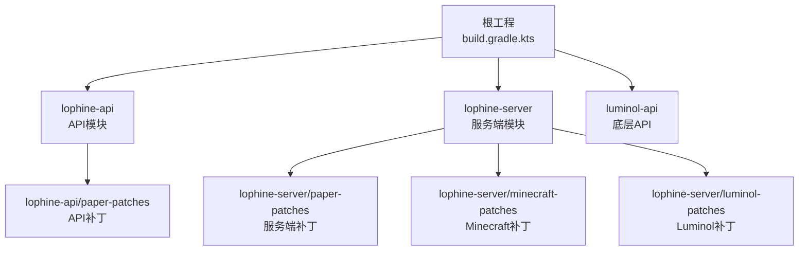
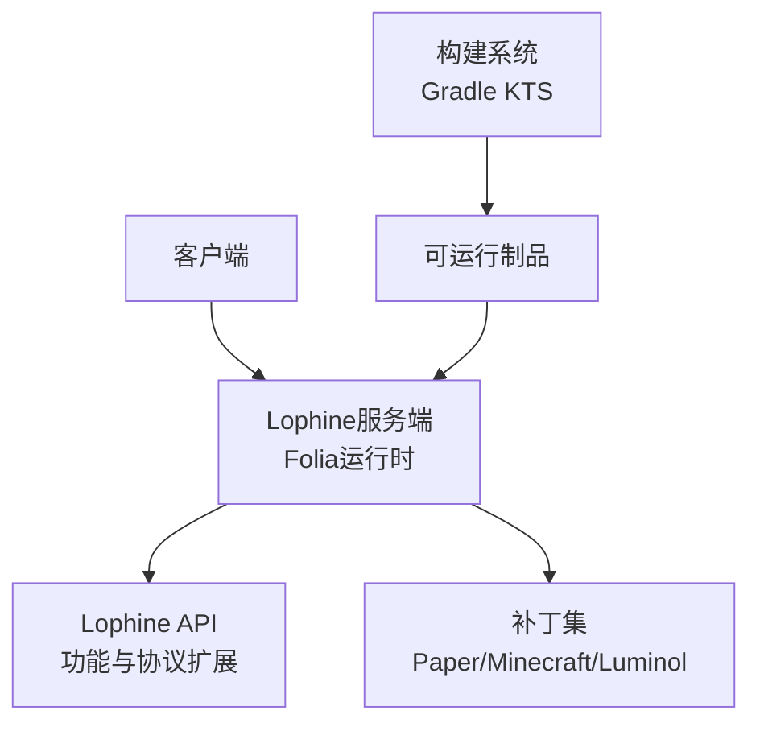
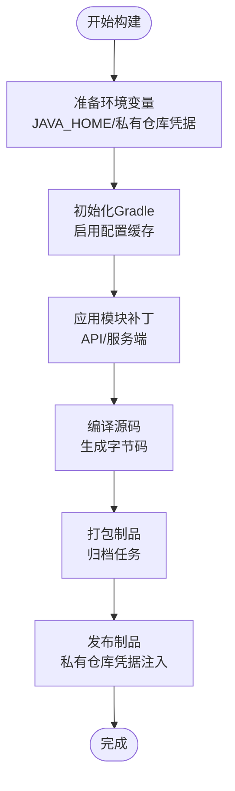
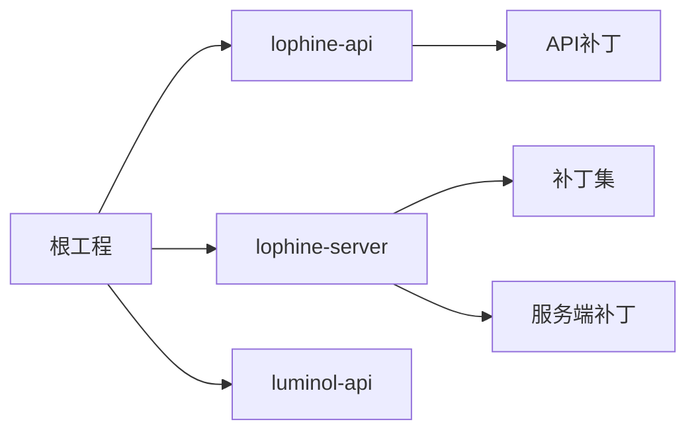

# 部署指南

<cite>
**本文引用的文件**
- [build.gradle.kts](file://build.gradle.kts)
- [gradle.properties](file://gradle.properties)
- [gradlew](file://gradlew)
- [gradlew.bat](file://gradlew.bat)
- [settings.gradle.kts](file://settings.gradle.kts)
- [README_EN.md](file://README_EN.md)
- [SetENV.sh](file://scripts/SetENV.sh)
- [lophine-server/build.gradle.kts.patch](file://lophine-server/build.gradle.kts.patch)
- [lophine-api/build.gradle.kts.patch](file://lophine-api/build.gradle.kts.patch)
- [jdk-21.0.10_windows-x64_bin/README](file://jdk-21.0.10_windows-x64_bin/README)
- [jdk-21.0.10_windows-x64_bin/conf/jaxp.properties](file://jdk-21.0.10_windows-x64_bin/conf/jaxp.properties)
</cite>

## 目录
1. [简介](#简介)
2. [项目结构](#项目结构)
3. [核心组件](#核心组件)
4. [架构总览](#架构总览)
5. [详细组件分析](#详细组件分析)
6. [依赖关系分析](#依赖关系分析)
7. [性能考虑](#性能考虑)
8. [故障排查指南](#故障排查指南)
9. [结论](#结论)
10. [附录](#附录)

## 简介
本指南面向生产环境，提供Lophine的完整部署说明，包括前置条件、系统要求、构建流程、编译配置、环境变量与系统设置最佳实践、Docker容器化部署参考、服务器启动参数与JVM调优建议、多环境部署策略以及部署验证与功能测试检查清单。Lophine基于Folia运行，提供多项优化与可配置的原版特性，并通过Gradle进行模块化构建。

## 项目结构
仓库采用多模块Gradle工程组织，核心模块包括：
- 根工程：统一构建脚本与发布配置
- lophine-api：API层（基于Luminol API）
- lophine-server：服务端实现（基于Paper/Folia生态）
- luminol-api：底层API支持
- patches：各模块的补丁目录（用于功能重命名与特性集成）

图表来源
- [build.gradle.kts](file://build.gradle.kts)
- [settings.gradle.kts](file://settings.gradle.kts)

章节来源
- [build.gradle.kts](file://build.gradle.kts)
- [settings.gradle.kts](file://settings.gradle.kts)

## 核心组件
- 构建系统：Gradle Kotlin DSL（KTS），启用配置缓存以提升构建性能
- 运行时：Java 21（包含JDK 21.0.10 Windows x64发行版）
- 启动脚本：跨平台启动器（Unix shell与Windows批处理）
- 发布配置：支持私有仓库凭据注入（通过环境变量）
- 模块化：API与服务端分离，便于按需扩展与替换

章节来源
- [gradle.properties](file://gradle.properties)
- [build.gradle.kts](file://build.gradle.kts)
- [jdk-21.0.10_windows-x64_bin/README](file://jdk-21.0.10_windows-x64_bin/README)

## 架构总览
下图展示Lophine在生产环境中的典型部署拓扑：客户端通过网络连接到运行在Folia上的Lophine服务端；服务端加载API模块与补丁，执行业务逻辑并输出日志；构建系统负责生成可运行的产物。

图表来源
- [build.gradle.kts](file://build.gradle.kts)
- [lophine-server/build.gradle.kts.patch](file://lophine-server/build.gradle.kts.patch)
- [lophine-api/build.gradle.kts.patch](file://lophine-api/build.gradle.kts.patch)

## 详细组件分析

### 前置条件与系统要求
- 操作系统：Linux/Windows（推荐Linux用于生产）
- CPU/内存：根据玩家规模与插件数量评估，建议至少4核CPU与8GB内存起步
- 存储：确保世界数据与日志目录有足够的磁盘空间与IO性能
- Java运行时：必须安装并正确配置Java 21（包含JDK 21.0.10 Windows x64发行版）
- 网络：开放服务器监听端口（默认Minecraft端口），防火墙放行
- 权限：服务账户对工作目录具有读写权限

章节来源
- [jdk-21.0.10_windows-x64_bin/README](file://jdk-21.0.10_windows-x64_bin/README)

### 构建流程与编译配置
- 使用Gradle Wrapper进行构建，支持Unix shell与Windows批处理脚本
- 根构建脚本中启用了配置缓存，有助于加速重复构建
- 发布阶段支持从环境变量注入私有仓库用户名与密码
- 服务端与API模块分别应用补丁文件，确保功能集成与兼容性

图表来源
- [build.gradle.kts](file://build.gradle.kts)
- [gradlew](file://gradlew)
- [gradlew.bat](file://gradlew.bat)

章节来源
- [build.gradle.kts](file://build.gradle.kts)
- [gradle.properties](file://gradle.properties)
- [gradlew](file://gradlew)
- [gradlew.bat](file://gradlew.bat)

### 环境变量与系统设置最佳实践
- JAVA_HOME：指向已安装的Java 21 JDK路径
- 私有仓库凭据：通过环境变量注入，避免硬编码在版本控制中
- JVM参数：通过启动脚本或系统服务传入，建议结合监控与压测结果调整
- 日志与数据目录：明确指定日志与世界数据目录，便于运维与备份
- 文件描述符与线程：Linux环境下适当提高ulimit，确保高并发稳定

章节来源
- [build.gradle.kts](file://build.gradle.kts)
- [gradlew](file://gradlew)
- [gradlew.bat](file://gradlew.bat)

### Docker容器化部署（参考）
以下为容器化部署的通用参考步骤（概念性说明）：
- 基础镜像：选择官方OpenJDK 21作为基础镜像
- 工作目录：挂载数据卷至服务器工作目录
- 端口映射：暴露Minecraft服务器端口
- 环境变量：传递JAVA_OPTS与私有仓库凭据
- 启动命令：使用Gradle Wrapper或直接运行生成的服务端可执行文件
- 健康检查：通过RCON或HTTP接口进行健康探测

（本节为概念性说明，不对应具体源文件）

### 服务器启动参数与JVM调优建议
- 堆大小：根据世界规模与插件数量设定初始与最大堆大小
- 垃圾收集器：优先选择G1GC或ZGC（取决于Java版本与硬件）
- 元空间：预留足够元空间以容纳大量类与动态代理
- JIT优化：保持默认即可，必要时开启分层编译
- GC日志：开启GC日志以便问题定位
- 其他：JFR采样、JMX远程管理（生产谨慎开启）

章节来源
- [gradlew](file://gradlew)
- [gradlew.bat](file://gradlew.bat)

### 多环境部署策略与配置差异
- 开发环境：启用调试与详细日志，禁用或简化性能监控
- 测试环境：模拟生产负载，校准JVM参数与补丁集
- 生产环境：最小化日志级别，开启GC与JFR长期采样，严格凭据管理
- 配置差异：通过环境变量与外部配置文件区分不同环境参数

章节来源
- [build.gradle.kts](file://build.gradle.kts)

### 部署验证与功能测试检查清单
- 服务启动：确认进程正常启动且无致命错误
- 网络连通：本地回环与外网均可连接
- 功能验证：进入游戏后验证核心功能（如假人、协议扩展等）
- 性能基准：记录TPS、延迟与GC行为
- 日志检查：确认无异常堆栈与严重警告
- 备份恢复：验证世界数据备份与恢复流程

章节来源
- [README_EN.md](file://README_EN.md)

## 依赖关系分析
Lophine采用模块化依赖，根工程统一管理子模块与补丁应用，确保API与服务端的一致性与可维护性。

图表来源
- [build.gradle.kts](file://build.gradle.kts)
- [settings.gradle.kts](file://settings.gradle.kts)
- [lophine-server/build.gradle.kts.patch](file://lophine-server/build.gradle.kts.patch)
- [lophine-api/build.gradle.kts.patch](file://lophine-api/build.gradle.kts.patch)

章节来源
- [build.gradle.kts](file://build.gradle.kts)
- [settings.gradle.kts](file://settings.gradle.kts)

## 性能考虑
- 构建性能：启用Gradle配置缓存，减少重复计算
- 运行时性能：合理设置JVM参数，关注GC停顿与内存占用
- I/O性能：使用高性能存储与SSD，优化文件系统与磁盘队列
- 网络性能：合理设置网络缓冲与压缩，降低带宽占用
- 监控与采样：开启JFR与GC日志，定期分析热点与瓶颈

（本节提供一般性指导，不直接分析具体文件）

## 故障排查指南
- Java未就绪：检查JAVA_HOME是否指向Java 21 JDK，确认PATH包含java可执行文件
- 构建失败：核对私有仓库凭据环境变量，清理缓存后重试
- 启动异常：查看启动脚本输出与日志，确认JVM参数与堆设置合理
- 功能异常：逐项关闭或启用相关补丁与配置，定位问题模块

章节来源
- [gradlew](file://gradlew)
- [gradlew.bat](file://gradlew.bat)
- [build.gradle.kts](file://build.gradle.kts)

## 结论
Lophine提供了清晰的模块化构建与部署路径。通过规范的前置条件、合理的JVM调优与多环境策略，可在生产环境中稳定运行。建议结合实际负载持续优化参数与监控方案，确保长期可用性与可维护性。

（本节为总结性内容，不直接分析具体文件）

## 附录

### A. 关键文件与职责
- 根构建脚本：统一构建、发布与配置缓存
- Gradle属性：启用配置缓存与全局属性
- 启动脚本：跨平台启动器，自动解析JAVA_HOME
- 补丁文件：模块级功能集成与兼容性修复
- JDK文档：Java 21运行时说明与配置参考

章节来源
- [build.gradle.kts](file://build.gradle.kts)
- [gradle.properties](file://gradle.properties)
- [gradlew](file://gradlew)
- [gradlew.bat](file://gradlew.bat)
- [lophine-server/build.gradle.kts.patch](file://lophine-server/build.gradle.kts.patch)
- [lophine-api/build.gradle.kts.patch](file://lophine-api/build.gradle.kts.patch)
- [jdk-21.0.10_windows-x64_bin/README](file://jdk-21.0.10_windows-x64_bin/README)