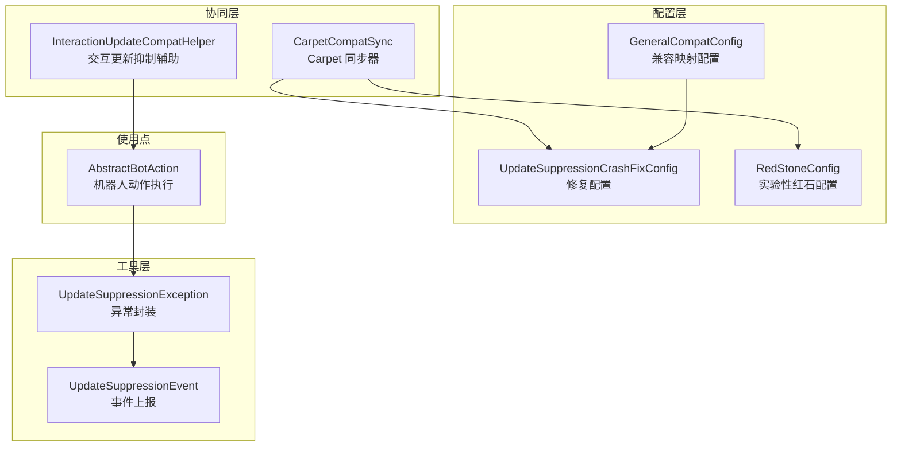
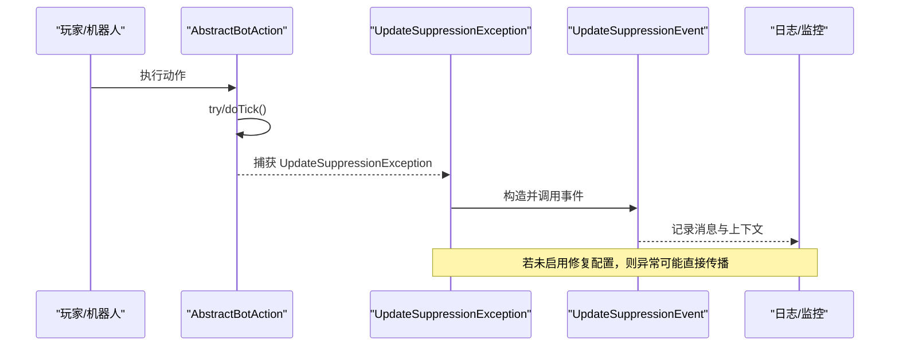
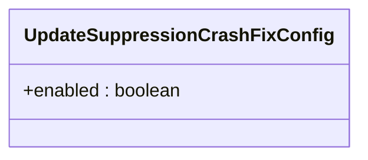
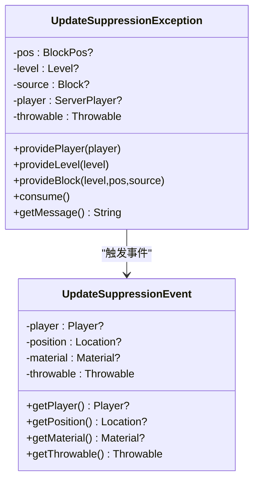
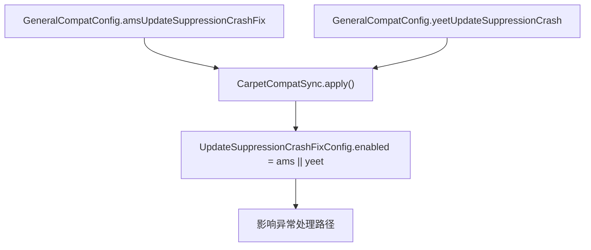
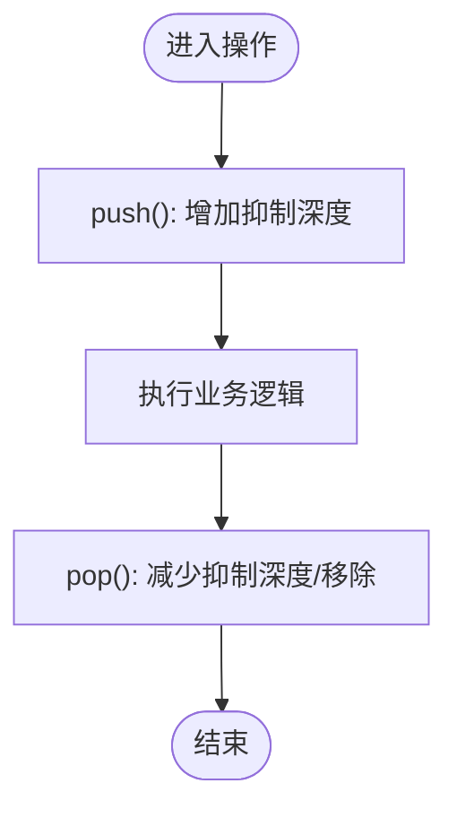
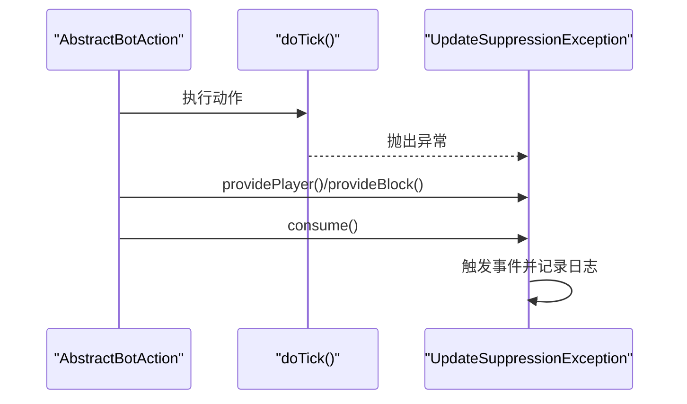
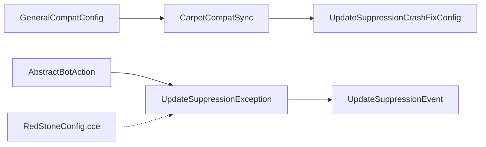

# 修复配置

<cite>
**本文引用的文件**
- [UpdateSuppressionCrashFixConfig.java](file://lophine-server/src/main/java/fun/bm/lophine/config/modules/fixes/UpdateSuppressionCrashFixConfig.java)
- [UpdateSuppressionException.java](file://lophine-server/src/main/java/org/leavesmc/leaves/util/UpdateSuppressionException.java)
- [UpdateSuppressionEvent.java](file://lophine-api/src/main/java/org/leavesmc/leaves/event/player/UpdateSuppressionEvent.java)
- [CarpetCompatSync.java](file://lophine-server/src/main/java/fun/bm/lophine/carpet/CarpetCompatSync.java)
- [GeneralCompatConfig.java](file://lophine-server/src/main/java/fun/bm/lophine/carpet/config/modules/GeneralCompatConfig.java)
- [InteractionUpdateCompatHelper.java](file://lophine-server/src/main/java/fun/bm/lophine/carpet/InteractionUpdateCompatHelper.java)
- [RedStoneConfig.java](file://lophine-server/src/main/java/fun/bm/lophine/config/modules/experiment/RedStoneConfig.java)
- [AbstractBotAction.java](file://lophine-server/src/main/java/org/leavesmc/leaves/bot/agent/actions/AbstractBotAction.java)
</cite>

## 目录
1. [简介](#简介)
2. [项目结构](#项目结构)
3. [核心组件](#核心组件)
4. [架构总览](#架构总览)
5. [详细组件分析](#详细组件分析)
6. [依赖关系分析](#依赖关系分析)
7. [性能考量](#性能考量)
8. [故障排查指南](#故障排查指南)
9. [结论](#结论)
10. [附录](#附录)

## 简介
本文件聚焦于 Lophine 的“更新抑制崩溃修复配置”，系统性阐述其作用、工作原理、常见崩溃场景与修复策略，并提供启用方法、配置参数、效果验证、与其他组件的交互关系、测试与验证标准、排查步骤及适用范围与限制。

## 项目结构
围绕“更新抑制崩溃修复配置”的相关代码分布在以下模块：
- 配置层：修复配置模块与兼容映射配置
- 工具层：异常封装与事件上报
- 协同层：Carpet 兼容同步器与交互更新抑制辅助
- 使用点：机器人动作执行中对异常的捕获与处理

**图示来源**
- [UpdateSuppressionCrashFixConfig.java:1-14](file://lophine-server/src/main/java/fun/bm/lophine/config/modules/fixes/UpdateSuppressionCrashFixConfig.java#L1-L14)
- [GeneralCompatConfig.java:1-29](file://lophine-server/src/main/java/fun/bm/lophine/carpet/config/modules/GeneralCompatConfig.java#L1-L29)
- [RedStoneConfig.java:1-35](file://lophine-server/src/main/java/fun/bm/lophine/config/modules/experiment/RedStoneConfig.java#L1-L35)
- [CarpetCompatSync.java:1-139](file://lophine-server/src/main/java/fun/bm/lophine/carpet/CarpetCompatSync.java#L1-L139)
- [InteractionUpdateCompatHelper.java:1-42](file://lophine-server/src/main/java/fun/bm/lophine/carpet/InteractionUpdateCompatHelper.java#L1-L42)
- [UpdateSuppressionException.java:1-143](file://lophine-server/src/main/java/org/leavesmc/leaves/util/UpdateSuppressionException.java#L1-L143)
- [UpdateSuppressionEvent.java:1-64](file://lophine-api/src/main/java/org/leavesmc/leaves/event/player/UpdateSuppressionEvent.java#L1-L64)
- [AbstractBotAction.java:130-160](file://lophine-server/src/main/java/org/leavesmc/leaves/bot/agent/actions/AbstractBotAction.java#L130-L160)

**章节来源**
- [UpdateSuppressionCrashFixConfig.java:1-14](file://lophine-server/src/main/java/fun/bm/lophine/config/modules/fixes/UpdateSuppressionCrashFixConfig.java#L1-L14)
- [CarpetCompatSync.java:1-139](file://lophine-server/src/main/java/fun/bm/lophine/carpet/CarpetCompatSync.java#L1-L139)

## 核心组件
- 修复配置模块：定义“是否阻止由更新抑制导致的崩溃”这一布尔开关，默认开启。
- 异常封装与事件：在捕获到更新抑制相关异常时，构造可携带位置、玩家、源方块等信息的异常对象，并触发事件上报。
- 兼容映射：将外部 Carpet/AMS/TIS 等规则映射到 Lophine 内部现有功能，统一由修复配置控制。
- 交互更新抑制辅助：通过线程局部变量记录抑制深度，在执行期间跳过不必要的更新以避免级联。
- 使用点：机器人动作执行流程中对异常进行捕获并交由修复逻辑处理。

**章节来源**
- [UpdateSuppressionCrashFixConfig.java:8-13](file://lophine-server/src/main/java/fun/bm/lophine/config/modules/fixes/UpdateSuppressionCrashFixConfig.java#L8-L13)
- [UpdateSuppressionException.java:37-143](file://lophine-server/src/main/java/org/leavesmc/leaves/util/UpdateSuppressionException.java#L37-L143)
- [UpdateSuppressionEvent.java:28-63](file://lophine-api/src/main/java/org/leavesmc/leaves/event/player/UpdateSuppressionEvent.java#L28-L63)
- [CarpetCompatSync.java:37-46](file://lophine-server/src/main/java/fun/bm/lophine/carpet/CarpetCompatSync.java#L37-L46)
- [InteractionUpdateCompatHelper.java:5-42](file://lophine-server/src/main/java/fun/bm/lophine/carpet/InteractionUpdateCompatHelper.java#L5-L42)
- [AbstractBotAction.java:136-143](file://lophine-server/src/main/java/org/leavesmc/leaves/bot/agent/actions/AbstractBotAction.java#L136-L143)

## 架构总览
下图展示从配置到事件上报的整体链路，以及与外部 Carpet 规则的映射关系。

**图示来源**
- [AbstractBotAction.java:136-143](file://lophine-server/src/main/java/org/leavesmc/leaves/bot/agent/actions/AbstractBotAction.java#L136-L143)
- [UpdateSuppressionException.java:86-105](file://lophine-server/src/main/java/org/leavesmc/leaves/util/UpdateSuppressionException.java#L86-L105)
- [UpdateSuppressionEvent.java:28-46](file://lophine-api/src/main/java/org/leavesmc/leaves/event/player/UpdateSuppressionEvent.java#L28-L46)

## 详细组件分析

### 组件一：修复配置模块（UpdateSuppressionCrashFixConfig）
- 职责：作为“更新抑制崩溃修复”的唯一布尔开关，决定是否拦截并处理相关异常。
- 默认值：开启。
- 分类：属于修复类配置模块。
- 关键行为：当启用时，异常被捕获并转化为事件上报；当关闭时，异常可能直接传播（取决于上层处理）。

**图示来源**
- [UpdateSuppressionCrashFixConfig.java:8-13](file://lophine-server/src/main/java/fun/bm/lophine/config/modules/fixes/UpdateSuppressionCrashFixConfig.java#L8-L13)

**章节来源**
- [UpdateSuppressionCrashFixConfig.java:8-13](file://lophine-server/src/main/java/fun/bm/lophine/config/modules/fixes/UpdateSuppressionCrashFixConfig.java#L8-L13)

### 组件二：异常封装与事件（UpdateSuppressionException 与 UpdateSuppressionEvent）
- UpdateSuppressionException：
  - 提供位置、维度、源方块、玩家等上下文信息。
  - 支持延迟填充缺失信息（如玩家或维度）。
  - 在消费时触发 UpdateSuppressionEvent 并输出日志。
  - 类型识别：对特定异常类型给出简短名称（如 CCE/SOE/IAE）。
- UpdateSuppressionEvent：
  - 作为 Bukkit 事件对外暴露，包含玩家、位置、材料、异常类型等字段。
  - 可被监听器订阅以进行审计或告警。

**图示来源**
- [UpdateSuppressionException.java:37-143](file://lophine-server/src/main/java/org/leavesmc/leaves/util/UpdateSuppressionException.java#L37-L143)
- [UpdateSuppressionEvent.java:28-63](file://lophine-api/src/main/java/org/leavesmc/leaves/event/player/UpdateSuppressionEvent.java#L28-L63)

**章节来源**
- [UpdateSuppressionException.java:37-143](file://lophine-server/src/main/java/org/leavesmc/leaves/util/UpdateSuppressionException.java#L37-L143)
- [UpdateSuppressionEvent.java:28-63](file://lophine-api/src/main/java/org/leavesmc/leaves/event/player/UpdateSuppressionEvent.java#L28-L63)

### 组件三：Carpet 兼容映射与同步（CarpetCompatSync 与 GeneralCompatConfig）
- GeneralCompatConfig：
  - 定义来自 Carpet/AMS/TIS 的规则映射，例如 AMS 的“更新抑制崩溃保护”与 TIS 的“崩溃剔除”。
- CarpetCompatSync：
  - 将上述映射转换为 Lophine 内部配置值，其中“AMS/TIS 更新抑制崩溃保护”映射到修复配置的启用状态。
  - 同时注册 Carpet 规则，便于客户端查询与管理。

**图示来源**
- [GeneralCompatConfig.java:23-29](file://lophine-server/src/main/java/fun/bm/lophine/carpet/config/modules/GeneralCompatConfig.java#L23-L29)
- [CarpetCompatSync.java:37-46](file://lophine-server/src/main/java/fun/bm/lophine/carpet/CarpetCompatSync.java#L37-L46)
- [UpdateSuppressionCrashFixConfig.java:10-12](file://lophine-server/src/main/java/fun/bm/lophine/config/modules/fixes/UpdateSuppressionCrashFixConfig.java#L10-L12)

**章节来源**
- [GeneralCompatConfig.java:1-29](file://lophine-server/src/main/java/fun/bm/lophine/carpet/config/modules/GeneralCompatConfig.java#L1-L29)
- [CarpetCompatSync.java:37-46](file://lophine-server/src/main/java/fun/bm/lophine/carpet/CarpetCompatSync.java#L37-L46)

### 组件四：交互更新抑制辅助（InteractionUpdateCompatHelper）
- 通过线程局部变量维护抑制深度，提供运行时抑制更新的能力。
- 用于减少不必要的更新传播，降低级联风险。

**图示来源**
- [InteractionUpdateCompatHelper.java:5-42](file://lophine-server/src/main/java/fun/bm/lophine/carpet/InteractionUpdateCompatHelper.java#L5-L42)

**章节来源**
- [InteractionUpdateCompatHelper.java:5-42](file://lophine-server/src/main/java/fun/bm/lophine/carpet/InteractionUpdateCompatHelper.java#L5-L42)

### 组件五：使用点（机器人动作执行）
- 在机器人动作的 tick 流程中，对异常进行捕获。
- 捕获到 UpdateSuppressionException 后，自动填充上下文并消费，从而避免崩溃。

**图示来源**
- [AbstractBotAction.java:136-143](file://lophine-server/src/main/java/org/leavesmc/leaves/bot/agent/actions/AbstractBotAction.java#L136-L143)
- [UpdateSuppressionException.java:86-105](file://lophine-server/src/main/java/org/leavesmc/leaves/util/UpdateSuppressionException.java#L86-L105)

**章节来源**
- [AbstractBotAction.java:136-143](file://lophine-server/src/main/java/org/leavesmc/leaves/bot/agent/actions/AbstractBotAction.java#L136-L143)

## 依赖关系分析
- 配置依赖：CarpetCompatSync 依赖 GeneralCompatConfig 来驱动 UpdateSuppressionCrashFixConfig 的启用状态。
- 运行时依赖：AbstractBotAction 在执行过程中依赖 UpdateSuppressionException 进行异常捕获与事件上报。
- 事件依赖：UpdateSuppressionException 依赖 UpdateSuppressionEvent 进行对外通知。
- 红石相关：RedStoneConfig 中的“cce-update-suppression”与更新抑制相关，但与“崩溃修复”是不同层面的控制项。

**图示来源**
- [CarpetCompatSync.java:37-46](file://lophine-server/src/main/java/fun/bm/lophine/carpet/CarpetCompatSync.java#L37-L46)
- [GeneralCompatConfig.java:23-29](file://lophine-server/src/main/java/fun/bm/lophine/carpet/config/modules/GeneralCompatConfig.java#L23-L29)
- [UpdateSuppressionCrashFixConfig.java:10-12](file://lophine-server/src/main/java/fun/bm/lophine/config/modules/fixes/UpdateSuppressionCrashFixConfig.java#L10-L12)
- [AbstractBotAction.java:136-143](file://lophine-server/src/main/java/org/leavesmc/leaves/bot/agent/actions/AbstractBotAction.java#L136-L143)
- [UpdateSuppressionException.java:86-105](file://lophine-server/src/main/java/org/leavesmc/leaves/util/UpdateSuppressionException.java#L86-L105)
- [UpdateSuppressionEvent.java:28-46](file://lophine-api/src/main/java/org/leavesmc/leaves/event/player/UpdateSuppressionEvent.java#L28-L46)
- [RedStoneConfig.java:23-26](file://lophine-server/src/main/java/fun/bm/lophine/config/modules/experiment/RedStoneConfig.java#L23-L26)

**章节来源**
- [CarpetCompatSync.java:37-46](file://lophine-server/src/main/java/fun/bm/lophine/carpet/CarpetCompatSync.java#L37-L46)
- [AbstractBotAction.java:136-143](file://lophine-server/src/main/java/org/leavesmc/leaves/bot/agent/actions/AbstractBotAction.java#L136-L143)

## 性能考量
- 抑制深度控制：通过线程局部变量记录抑制层级，避免在深层嵌套中重复抑制，减少额外开销。
- 事件与日志：异常消费会触发事件与日志记录，建议在高并发场景关注事件监听器的处理成本。
- 配置热切换：修复配置为静态布尔值，切换即时生效，无需重启。

[本节为通用指导，不直接分析具体文件]

## 故障排查指南
- 症状定位
  - 是否出现与更新抑制相关的异常（如 CCE/SOE/IAE）？
  - 是否在机器人或自动化流程中频繁触发？
- 快速检查
  - 确认修复配置已启用：[UpdateSuppressionCrashFixConfig.enabled:10-12](file://lophine-server/src/main/java/fun/bm/lophine/config/modules/fixes/UpdateSuppressionCrashFixConfig.java#L10-L12)
  - 检查兼容映射是否正确：[GeneralCompatConfig:23-29](file://lophine-server/src/main/java/fun/bm/lophine/carpet/config/modules/GeneralCompatConfig.java#L23-L29) → [CarpetCompatSync.apply:37-46](file://lophine-server/src/main/java/fun/bm/lophine/carpet/CarpetCompatSync.java#L37-L46)
  - 查看事件是否被监听：[UpdateSuppressionEvent:28-46](file://lophine-api/src/main/java/org/leavesmc/leaves/event/player/UpdateSuppressionEvent.java#L28-L46)
- 处理步骤
  - 若启用后仍崩溃：确认异常是否被正确捕获与消费（见 [AbstractBotAction:136-143](file://lophine-server/src/main/java/org/leavesmc/leaves/bot/agent/actions/AbstractBotAction.java#L136-L143) 与 [UpdateSuppressionException.consume:86-90](file://lophine-server/src/main/java/org/leavesmc/leaves/util/UpdateSuppressionException.java#L86-L90)）
  - 若需要进一步诊断：查看日志输出与事件监听器的处理结果
- 相关配置
  - 红石相关控制项（非崩溃修复）：[RedStoneConfig.cce:23-26](file://lophine-server/src/main/java/fun/bm/lophine/config/modules/experiment/RedStoneConfig.java#L23-L26)

**章节来源**
- [UpdateSuppressionCrashFixConfig.java:10-12](file://lophine-server/src/main/java/fun/bm/lophine/config/modules/fixes/UpdateSuppressionCrashFixConfig.java#L10-L12)
- [GeneralCompatConfig.java:23-29](file://lophine-server/src/main/java/fun/bm/lophine/carpet/config/modules/GeneralCompatConfig.java#L23-L29)
- [CarpetCompatSync.java:37-46](file://lophine-server/src/main/java/fun/bm/lophine/carpet/CarpetCompatSync.java#L37-L46)
- [AbstractBotAction.java:136-143](file://lophine-server/src/main/java/org/leavesmc/leaves/bot/agent/actions/AbstractBotAction.java#L136-L143)
- [UpdateSuppressionException.java:86-90](file://lophine-server/src/main/java/org/leavesmc/leaves/util/UpdateSuppressionException.java#L86-L90)
- [UpdateSuppressionEvent.java:28-46](file://lophine-api/src/main/java/org/leavesmc/leaves/event/player/UpdateSuppressionEvent.java#L28-L46)
- [RedStoneConfig.java:23-26](file://lophine-server/src/main/java/fun/bm/lophine/config/modules/experiment/RedStoneConfig.java#L23-L26)

## 结论
“更新抑制崩溃修复配置”通过统一的布尔开关与异常封装、事件上报机制，有效缓解了由更新抑制引发的崩溃风险。配合 Carpet 兼容映射，可在不修改业务逻辑的前提下快速启用或禁用该修复。实际部署中应结合事件监听与日志审计，持续观察异常触发频率与影响范围，确保系统稳定性与可观测性。

[本节为总结性内容，不直接分析具体文件]

## 附录

### 启用方法与配置参数
- 启用方式
  - 通过兼容映射启用：将外部 Carpet/AMS/TIS 的“更新抑制崩溃保护/剔除”规则开启，映射至 Lophine 的修复配置。
  - 参考路径：
    - [GeneralCompatConfig.amsUpdateSuppressionCrashFix:23-25](file://lophine-server/src/main/java/fun/bm/lophine/carpet/config/modules/GeneralCompatConfig.java#L23-L25)
    - [GeneralCompatConfig.yeetUpdateSuppressionCrash:27-29](file://lophine-server/src/main/java/fun/bm/lophine/carpet/config/modules/GeneralCompatConfig.java#L27-L29)
    - [CarpetCompatSync.apply:37-46](file://lophine-server/src/main/java/fun/bm/lophine/carpet/CarpetCompatSync.java#L37-L46)
- 核心参数
  - [UpdateSuppressionCrashFixConfig.enabled:10-12](file://lophine-server/src/main/java/fun/bm/lophine/config/modules/fixes/UpdateSuppressionCrashFixConfig.java#L10-L12)

**章节来源**
- [GeneralCompatConfig.java:23-29](file://lophine-server/src/main/java/fun/bm/lophine/carpet/config/modules/GeneralCompatConfig.java#L23-L29)
- [CarpetCompatSync.java:37-46](file://lophine-server/src/main/java/fun/bm/lophine/carpet/CarpetCompatSync.java#L37-L46)
- [UpdateSuppressionCrashFixConfig.java:10-12](file://lophine-server/src/main/java/fun/bm/lophine/config/modules/fixes/UpdateSuppressionCrashFixConfig.java#L10-L12)

### 效果验证
- 行为验证
  - 在启用修复配置后，机器人动作执行中若触发更新抑制异常，应被捕获并转化为事件与日志输出，服务器不应因该异常而崩溃。
  - 参考路径：
    - [AbstractBotAction.doTick 捕获:136-143](file://lophine-server/src/main/java/org/leavesmc/leaves/bot/agent/actions/AbstractBotAction.java#L136-L143)
    - [UpdateSuppressionException.consume:86-90](file://lophine-server/src/main/java/org/leavesmc/leaves/util/UpdateSuppressionException.java#L86-L90)
- 事件验证
  - 监听 [UpdateSuppressionEvent:28-46](file://lophine-api/src/main/java/org/leavesmc/leaves/event/player/UpdateSuppressionEvent.java#L28-L46)，确认事件被触发且包含预期上下文（玩家、位置、材料、异常类型）。

**章节来源**
- [AbstractBotAction.java:136-143](file://lophine-server/src/main/java/org/leavesmc/leaves/bot/agent/actions/AbstractBotAction.java#L136-L143)
- [UpdateSuppressionException.java:86-90](file://lophine-server/src/main/java/org/leavesmc/leaves/util/UpdateSuppressionException.java#L86-L90)
- [UpdateSuppressionEvent.java:28-46](file://lophine-api/src/main/java/org/leavesmc/leaves/event/player/UpdateSuppressionEvent.java#L28-L46)

### 与其他系统组件的交互
- 与 Carpet 的交互：通过 [CarpetCompatSync.register:66-137](file://lophine-server/src/main/java/fun/bm/lophine/carpet/CarpetCompatSync.java#L66-L137) 注册规则，使客户端可查询与管理。
- 与交互更新抑制的协作：通过 [InteractionUpdateCompatHelper:5-42](file://lophine-server/src/main/java/fun/bm/lophine/carpet/InteractionUpdateCompatHelper.java#L5-L42) 控制抑制深度，减少更新传播。
- 与红石配置的关系：[RedStoneConfig.cce:23-26](file://lophine-server/src/main/java/fun/bm/lophine/config/modules/experiment/RedStoneConfig.java#L23-L26) 属于实验性控制项，与“崩溃修复”不同。

**章节来源**
- [CarpetCompatSync.java:66-137](file://lophine-server/src/main/java/fun/bm/lophine/carpet/CarpetCompatSync.java#L66-L137)
- [InteractionUpdateCompatHelper.java:5-42](file://lophine-server/src/main/java/fun/bm/lophine/carpet/InteractionUpdateCompatHelper.java#L5-L42)
- [RedStoneConfig.java:23-26](file://lophine-server/src/main/java/fun/bm/lophine/config/modules/experiment/RedStoneConfig.java#L23-L26)

### 测试方法与验证标准
- 单元测试思路
  - 构造触发更新抑制异常的场景，验证异常被捕获并转化为事件与日志。
  - 切换 [UpdateSuppressionCrashFixConfig.enabled:10-12](file://lophine-server/src/main/java/fun/bm/lophine/config/modules/fixes/UpdateSuppressionCrashFixConfig.java#L10-L12)，对比崩溃行为差异。
- 集成测试思路
  - 在机器人动作执行流程中注入异常，验证 [AbstractBotAction:136-143](file://lophine-server/src/main/java/org/leavesmc/leaves/bot/agent/actions/AbstractBotAction.java#L136-L143) 的捕获与消费逻辑。
- 验证标准
  - 服务器稳定运行，无崩溃日志；
  - 事件监听器收到 [UpdateSuppressionEvent:28-46](file://lophine-api/src/main/java/org/leavesmc/leaves/event/player/UpdateSuppressionEvent.java#L28-L46)，且上下文完整；
  - 日志包含异常类型与位置信息。

**章节来源**
- [UpdateSuppressionCrashFixConfig.java:10-12](file://lophine-server/src/main/java/fun/bm/lophine/config/modules/fixes/UpdateSuppressionCrashFixConfig.java#L10-L12)
- [AbstractBotAction.java:136-143](file://lophine-server/src/main/java/org/leavesmc/leaves/bot/agent/actions/AbstractBotAction.java#L136-L143)
- [UpdateSuppressionEvent.java:28-46](file://lophine-api/src/main/java/org/leavesmc/leaves/event/player/UpdateSuppressionEvent.java#L28-L46)

### 适用范围与限制
- 适用范围
  - 主要适用于由更新抑制导致的崩溃场景，尤其是机器人自动化与复杂红石/交互逻辑。
- 限制
  - 仅对“崩溃修复”起效，不改变底层更新抑制机制；对于非崩溃类异常，需另行处理。
  - 与 [RedStoneConfig.cce:23-26](file://lophine-server/src/main/java/fun/bm/lophine/config/modules/experiment/RedStoneConfig.java#L23-L26) 不同，后者为实验性红石行为控制。

**章节来源**
- [RedStoneConfig.java:23-26](file://lophine-server/src/main/java/fun/bm/lophine/config/modules/experiment/RedStoneConfig.java#L23-L26)