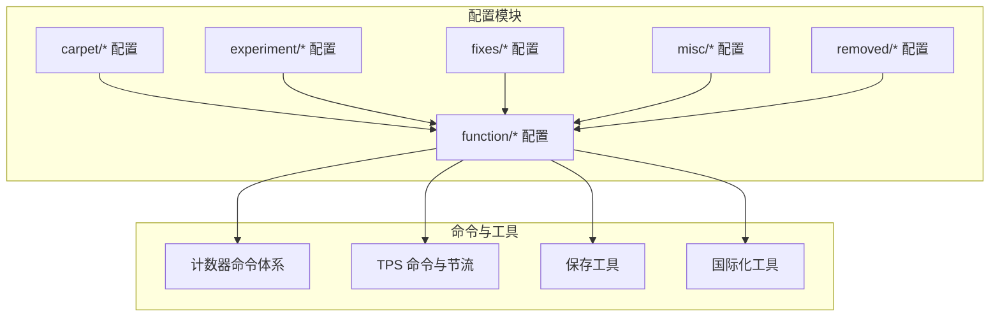
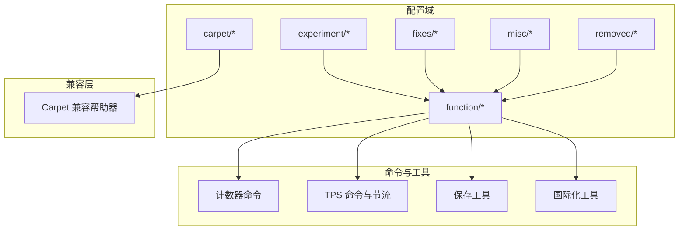
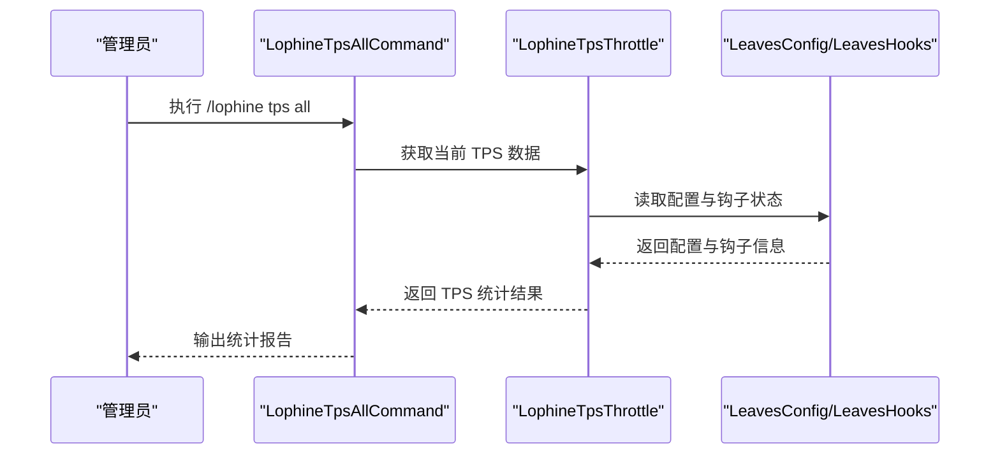
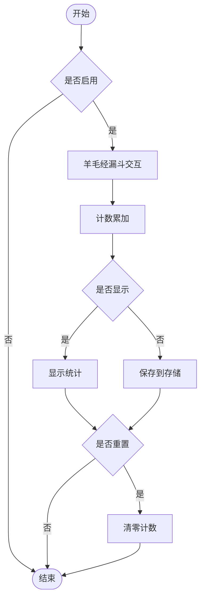
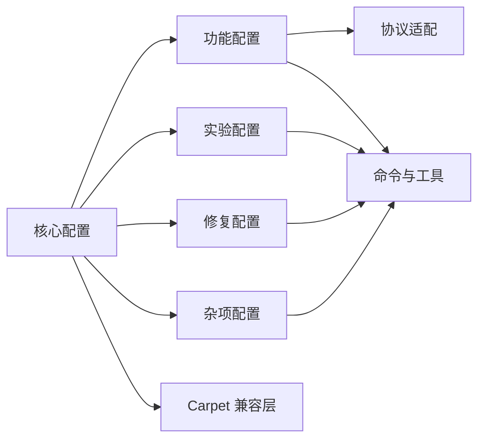

# 功能配置

<cite>
**本文引用的文件**
- [CoreConfig.java](file://lophine-server/src/main/java/fun/bm/lophine/carpet/config/modules/CoreConfig.java)
- [GeneralCompatConfig.java](file://lophine-server/src/main/java/fun/bm/lophine/carpet/config/modules/GeneralCompatConfig.java)
- [FakePlayerCompatConfig.java](file://lophine-server/src/main/java/fun/bm/lophine/carpet/config/modules/FakePlayerCompatConfig.java)
- [CounterCompatConfig.java](file://lophine-server/src/main/java/fun/bm/lophine/carpet/config/modules/CounterCompatConfig.java)
- [CarpetCalculatorCompatHelper.java](file://lophine-server/src/main/java/fun/bm/lophine/carpet/CarpetCalculatorCompatHelper.java)
- [InteractionUpdateCompatHelper.java](file://lophine-server/src/main/java/fun/bm/lophine/carpet/InteractionUpdateCompatHelper.java)
- [LagFreeSpawningCompatHelper.java](file://lophine-server/src/main/java/fun/bm/lophine/carpet/LagFreeSpawningCompatHelper.java)
- [CarpetCompatSync.java](file://lophine-server/src/main/java/fun/bm/lophine/carpet/CarpetCompatSync.java)
- [ContainerExpansionConfig.java](file://lophine-server/src/main/java/fun/bm/lophine/config/modules/function/ContainerExpansionConfig.java)
- [CreativeFlyNoClipConfig.java](file://lophine-server/src/main/java/fun/bm/lophine/config/modules/function/CreativeFlyNoClipConfig.java)
- [FakeplayerConfig.java](file://lophine-server/src/main/java/fun/bm/lophine/config/modules/function/FakeplayerConfig.java)
- [LanguageConfig.java](file://lophine-server/src/main/java/fun/bm/lophine/config/modules/function/LanguageConfig.java)
- [OldFeatureConfig.java](file://lophine-server/src/main/java/fun/bm/lophine/config/modules/function/OldFeatureConfig.java)
- [RedStoneConfig（功能）.java](file://lophine-server/src/main/java/fun/bm/lophine/config/modules/function/RedStoneConfig.java)
- [RedStoneConfig（实验）.java](file://lophine-server/src/main/java/fun/bm/lophine/config/modules/experiment/RedStoneConfig.java)
- [TpsAllConfig.java](file://lophine-server/src/main/java/fun/bm/lophine/config/modules/function/TpsAllConfig.java)
- [WoolHopperCounterConfig.java](file://lophine-server/src/main/java/fun/bm/lophine/config/modules/function/WoolHopperCounterConfig.java)
- [AlternativeBlockPlacementProtocolConfig.java](file://lophine-server/src/main/java/fun/bm/lophine/config/modules/function/protocol/AlternativeBlockPlacementProtocolConfig.java)
- [AppleSkinProtocolConfig.java](file://lophine-server/src/main/java/fun/bm/lophine/config/modules/function/protocol/AppleSkinProtocolConfig.java)
- [BBORProtocolConfig.java](file://lophine-server/src/main/java/fun/bm/lophine/config/modules/function/protocol/BBORProtocolConfig.java)
- [JadeProtocolConfig.java](file://lophine-server/src/main/java/fun/bm/lophine/config/modules/function/protocol/JadeProtocolConfig.java)
- [REIServerProtocolConfig.java](file://lophine-server/src/main/java/fun/bm/lophine/config/modules/function/protocol/REIServerProtocolConfig.java)
- [ServuxProtocolConfig.java](file://lophine-server/src/main/java/fun/bm/lophine/config/modules/function/protocol/ServuxProtocolConfig.java)
- [SyncmaticaProtocolConfig.java](file://lophine-server/src/main/java/fun/bm/lophine/config/modules/function/protocol/SyncmaticaProtocolConfig.java)
- [XaeroMapProtocolConfig.java](file://lophine-server/src/main/java/fun/bm/lophine/config/modules/function/protocol/XaeroMapProtocolConfig.java)
- [CommandConfig.java](file://lophine-server/src/main/java/fun/bm/lophine/config/modules/experiment/CommandConfig.java)
- [EntityDamageSourceTraceConfig.java](file://lophine-server/src/main/java/fun/bm/lophine/config/modules/experiment/EntityDamageSourceTraceConfig.java)
- [RayTrackingEntityTrackerConfig.java](file://lophine-server/src/main/java/fun/bm/lophine/config/modules/experiment/RayTrackingEntityTrackerConfig.java)
- [UpdateSuppressionCrashFixConfig.java](file://lophine-server/src/main/java/fun/bm/lophine/config/modules/fixes/UpdateSuppressionCrashFixConfig.java)
- [RemovedConfig.java](file://lophine-server/src/main/java/fun/bm/lophine/config/modules/removed/RemovedConfig.java)
- [LeavesConfig.java](file://lophine-server/src/main/java/org/leavesmc/leaves/LeavesConfig.java)
- [LeavesHooks.java](file://lophine-server/src/main/java/org/leavesmc/leaves/region/LeavesHooks.java)
- [LophineTpsAllCommand.java](file://lophine-server/src/main/java/fun/bm/lophine/feature/LophineTpsAllCommand.java)
- [LophineTpsThrottle.java](file://lophine-server/src/main/java/fun/bm/lophine/utils/LophineTpsThrottle.java)
- [HopperCounter.java](file://lophine-server/src/main/java/org/leavesmc/leaves/util/HopperCounter.java)
- [WoolUtils.java](file://lophine-server/src/main/java/org/leavesmc/leaves/util/WoolUtils.java)
- [ServerI18nUtil.java](file://lophine-server/src/main/java/fun/bm/lophine/utils/ServerI18nUtil.java)
- [RandomProfilePool.java](file://lophine-server/src/main/java/fun/bm/lophine/utils/RandomProfilePool.java)
- [SaveAllUtil.java](file://lophine-server/src/main/java/fun/bm/lophine/utils/SaveAllUtil.java)
- [CounterCommand.java](file://lophine-server/src/main/java/fun/bm/lophine/command/counter/CounterCommand.java)
- [CounterSubCommand.java](file://lophine-server/src/main/java/fun/bm/lophine/command/counter/CounterSubCommand.java)
- [DisplayCommand.java](file://lophine-server/src/main/java/fun/bm/lophine/command/counter/sub/DisplayCommand.java)
- [ResetCommand.java](file://lophine-server/src/main/java/fun/bm/lophine/command/counter/sub/ResetCommand.java)
- [ToggleCommand.java](file://lophine-server/src/main/java/fun/bm/lophine/command/counter/sub/ToggleCommand.java)
- [LophineLogger.java](file://lophine-server/src/main/java/fun/bm/lophine/LophineLogger.java)
- [ItemEntityPerfConfig.java](file://lophine-server/src/main/java/fun/bm/lophine/config/modules/misc/ItemEntityPerfConfig.java)
- [ItemEntityConfig.java](file://lophine-server/src/main/java/fun/bm/lophine/config/modules/misc/ItemEntityConfig.java)
</cite>

## 目录
1. [简介](#简介)
2. [项目结构](#项目结构)
3. [核心组件](#核心组件)
4. [架构总览](#架构总览)
5. [详细组件分析](#详细组件分析)
6. [依赖分析](#依赖分析)
7. [性能考虑](#性能考虑)
8. [故障排除指南](#故障排除指南)
9. [结论](#结论)
10. [附录](#附录)

## 简介
本文件系统性梳理 Lophine 的"功能配置"模块，覆盖容器扩展、创造飞行穿墙、假人配置、语言配置、旧版特性、红石配置、TPS 统计、羊毛漏斗计数器、物品实体性能等核心能力。文档从架构与分类体系入手，逐项说明各功能的作用、配置参数与使用方法，并给出启用流程、示例场景、相互关系与依赖、性能影响与优化建议，以及常见问题的诊断与修复思路。

## 项目结构
Lophine 将功能配置按"模块域"组织在以下包中：
- carpet/config/modules：与 Carpet 兼容层相关的通用配置模块
- config/modules/function：服务器端功能型配置（如容器扩展、飞行穿墙、假人、语言、旧版特性、红石、TPS、羊毛漏斗计数器等）
- config/modules/experiment：实验性功能配置（命令增强、实体伤害来源追踪、射线实体追踪、旧红石行为等）
- config/modules/fixes：修复类配置（如更新抑制崩溃修复）
- config/modules/misc：杂项配置（自动更新、禁用检查、物品实体性能等）
- config/modules/removed：已移除的功能占位配置
- config/modules/function/protocol：协议适配配置（Jade、REI、Servux、BBOR、Xaero 等）

此外，还包含计数器命令体系、TPS 命令与节流工具、世界保存工具、随机皮肤池、国际化工具等支撑组件。

**章节来源**
- [CoreConfig.java:1-200](file://lophine-server/src/main/java/fun/bm/lophine/carpet/config/modules/CoreConfig.java#L1-L200)
- [GeneralCompatConfig.java:1-200](file://lophine-server/src/main/java/fun/bm/lophine/carpet/config/modules/GeneralCompatConfig.java#L1-L200)
- [FakePlayerCompatConfig.java:1-200](file://lophine-server/src/main/java/fun/bm/lophine/carpet/config/modules/FakePlayerCompatConfig.java#L1-L200)
- [CounterCompatConfig.java:1-200](file://lophine-server/src/main/java/fun/bm/lophine/carpet/config/modules/CounterCompatConfig.java#L1-L200)

## 核心组件
本节概述各功能配置域及其职责：
- 容器扩展：扩大容器容量上限，提升自动化与仓储效率
- 创造飞行穿墙：允许创造模式下穿越方块，改善操作体验
- 假人配置：控制假人的生成、行为与数据同步策略
- 语言配置：支持多语言显示与本地化
- 旧版特性：回退部分旧版本行为（如旧爆炸伤害计算、旧僵尸增援等）
- 红石配置：调整红石相关行为（旧版红石、忽略向上更新、Shears 撬棍等）
- TPS 统计：提供全服 TPS 统计与节流控制
- 羊毛漏斗计数器：统计羊毛通过漏斗的计数
- 物品实体性能：优化掉落物实体处理（合并半径、拾取冷却、漏斗传输等）
- 协议适配：对接第三方模组或客户端展示协议（Jade、REI、Servux、BBOR、Xaero 等）
- 实验性功能：命令增强、实体伤害来源追踪、射线实体追踪等
- 修复配置：针对特定崩溃或异常的修复开关
- 杂项配置：自动更新、禁用检查等

**章节来源**
- [ContainerExpansionConfig.java:1-200](file://lophine-server/src/main/java/fun/bm/lophine/config/modules/function/ContainerExpansionConfig.java#L1-L200)
- [CreativeFlyNoClipConfig.java:1-200](file://lophine-server/src/main/java/fun/bm/lophine/config/modules/function/CreativeFlyNoClipConfig.java#L1-L200)
- [FakeplayerConfig.java:1-200](file://lophine-server/src/main/java/fun/bm/lophine/config/modules/function/FakeplayerConfig.java#L1-L200)
- [LanguageConfig.java:1-200](file://lophine-server/src/main/java/fun/bm/lophine/config/modules/function/LanguageConfig.java#L1-L200)
- [OldFeatureConfig.java:1-200](file://lophine-server/src/main/java/fun/bm/lophine/config/modules/function/OldFeatureConfig.java#L1-L200)
- [RedStoneConfig（功能）.java:1-200](file://lophine-server/src/main/java/fun/bm/lophine/config/modules/function/RedStoneConfig.java#L1-L200)
- [RedStoneConfig（实验）.java:1-200](file://lophine-server/src/main/java/fun/bm/lophine/config/modules/experiment/RedStoneConfig.java#L1-L200)
- [TpsAllConfig.java:1-200](file://lophine-server/src/main/java/fun/bm/lophine/config/modules/function/TpsAllConfig.java#L1-L200)
- [WoolHopperCounterConfig.java:1-200](file://lophine-server/src/main/java/fun/bm/lophine/config/modules/function/WoolHopperCounterConfig.java#L1-L200)
- [ItemEntityPerfConfig.java:1-200](file://lophine-server/src/main/java/fun/bm/lophine/config/modules/misc/ItemEntityPerfConfig.java#L1-L200)
- [JadeProtocolConfig.java:1-200](file://lophine-server/src/main/java/fun/bm/lophine/config/modules/function/protocol/JadeProtocolConfig.java#L1-L200)
- [REIServerProtocolConfig.java:1-200](file://lophine-server/src/main/java/fun/bm/lophine/config/modules/function/protocol/REIServerProtocolConfig.java#L1-L200)
- [ServuxProtocolConfig.java:1-200](file://lophine-server/src/main/java/fun/bm/lophine/config/modules/function/protocol/ServuxProtocolConfig.java#L1-L200)
- [BBORProtocolConfig.java:1-200](file://lophine-server/src/main/java/fun/bm/lophine/config/modules/function/protocol/BBORProtocolConfig.java#L1-L200)
- [XaeroMapProtocolConfig.java:1-200](file://lophine-server/src/main/java/fun/bm/lophine/config/modules/function/protocol/XaeroMapProtocolConfig.java#L1-L200)
- [CommandConfig.java:1-200](file://lophine-server/src/main/java/fun/bm/lophine/config/modules/experiment/CommandConfig.java#L1-L200)
- [EntityDamageSourceTraceConfig.java:1-200](file://lophine-server/src/main/java/fun/bm/lophine/config/modules/experiment/EntityDamageSourceTraceConfig.java#L1-L200)
- [RayTrackingEntityTrackerConfig.java:1-200](file://lophine-server/src/main/java/fun/bm/lophine/config/modules/experiment/RayTrackingEntityTrackerConfig.java#L1-L200)
- [UpdateSuppressionCrashFixConfig.java:1-200](file://lophine-server/src/main/java/fun/bm/lophine/config/modules/fixes/UpdateSuppressionCrashFixConfig.java#L1-L200)
- [RemovedConfig.java:1-200](file://lophine-server/src/main/java/fun/bm/lophine/config/modules/removed/RemovedConfig.java#L1-L200)

## 架构总览
Lophine 的功能配置采用"模块域 + 兼容层 + 命令与工具"的分层架构：
- 模块域：按功能域划分配置类，便于维护与扩展
- 兼容层：与 Carpet 生态兼容，复用其配置与事件机制
- 命令与工具：围绕配置提供命令入口与辅助工具（如计数器、TPS、保存、国际化）

**图表来源**
- [CarpetCalculatorCompatHelper.java:1-200](file://lophine-server/src/main/java/fun/bm/lophine/carpet/CarpetCalculatorCompatHelper.java#L1-L200)
- [InteractionUpdateCompatHelper.java:1-200](file://lophine-server/src/main/java/fun/bm/lophine/carpet/InteractionUpdateCompatHelper.java#L1-L200)
- [LagFreeSpawningCompatHelper.java:1-200](file://lophine-server/src/main/java/fun/bm/lophine/carpet/LagFreeSpawningCompatHelper.java#L1-L200)
- [CarpetCompatSync.java:1-200](file://lophine-server/src/main/java/fun/bm/lophine/carpet/CarpetCompatSync.java#L1-L200)

**章节来源**
- [CarpetCalculatorCompatHelper.java:1-200](file://lophine-server/src/main/java/fun/bm/lophine/carpet/CarpetCalculatorCompatHelper.java#L1-L200)
- [InteractionUpdateCompatHelper.java:1-200](file://lophine-server/src/main/java/fun/bm/lophine/carpet/InteractionUpdateCompatHelper.java#L1-L200)
- [LagFreeSpawningCompatHelper.java:1-200](file://lophine-server/src/main/java/fun/bm/lophine/carpet/LagFreeSpawningCompatHelper.java#L1-L200)
- [CarpetCompatSync.java:1-200](file://lophine-server/src/main/java/fun/bm/lophine/carpet/CarpetCompatSync.java#L1-L200)

## 详细组件分析

### 容器扩展（Container Expansion）
- 作用：扩大容器容量上限，提升自动化与仓储效率
- 关键参数：最大容量阈值、是否对特定容器生效、是否保留原版行为
- 启用流程：开启功能开关 → 调整容量阈值 → 重启或重载配置
- 使用场景：大型自动化仓库、多方块结构的物流系统
- 性能影响：增加容器访问与校验开销；建议仅对必要容器启用
- 依赖关系：与协议适配中的物品存储扩展配合使用

**章节来源**
- [ContainerExpansionConfig.java:1-200](file://lophine-server/src/main/java/fun/bm/lophine/config/modules/function/ContainerExpansionConfig.java#L1-L200)

### 创造飞行穿墙（Creative Fly No Clip）
- 作用：允许创造模式玩家在飞行时穿过方块
- 关键参数：是否启用、是否区分游戏模式、是否记录日志
- 启用流程：开启开关 → 可选设置日志 → 重载配置
- 使用场景：建筑调试、快速移动、地形探索
- 性能影响：极低；主要为碰撞检测逻辑分支
- 依赖关系：无直接依赖，但与 TPS 统计存在并发竞争

**章节来源**
- [CreativeFlyNoClipConfig.java:1-200](file://lophine-server/src/main/java/fun/bm/lophine/config/modules/function/CreativeFlyNoClipConfig.java#L1-L200)

### 假人配置（Fakeplayer）
- 作用：控制假人的生成、行为与数据同步策略
- 关键参数：最大数量、是否启用自动加载、是否发送额外数据、模拟距离等
- 启用流程：开启开关 → 设置最大数量 → 配置行为策略 → 重载配置
- 使用场景：自动化测试、批量任务执行、演示与录制
- 性能影响：高；需维护多个实体状态与网络同步
- 依赖关系：与协议适配（如 REI、Jade）协同以提供可视化

**章节来源**
- [FakeplayerConfig.java:1-200](file://lophine-server/src/main/java/fun/bm/lophine/config/modules/function/FakeplayerConfig.java#L1-L200)

### 语言配置（Language）
- 作用：支持多语言显示与本地化
- 关键参数：默认语言、语言文件路径、动态切换开关
- 启用流程：选择语言 → 加载语言文件 → 重载配置
- 使用场景：国际服、多语言环境下的统一提示
- 性能影响：低；主要为字符串查找与缓存
- 依赖关系：依赖国际化工具与随机皮肤池

**章节来源**
- [LanguageConfig.java:1-200](file://lophine-server/src/main/java/fun/bm/lophine/config/modules/function/LanguageConfig.java#L1-L200)
- [ServerI18nUtil.java:1-200](file://lophine-server/src/main/java/fun/bm/lophine/utils/ServerI18nUtil.java#L1-L200)
- [RandomProfilePool.java:1-200](file://lophine-server/src/main/java/fun/bm/lophine/utils/RandomProfilePool.java#L1-L200)

### 旧版特性（Old Feature）
- 作用：回退部分旧版本行为（如旧爆炸伤害计算、旧僵尸增援等）
- 关键参数：启用哪些旧版行为、是否兼容原版算法
- 启用流程：开启对应开关 → 重载配置
- 使用场景：兼容历史存档、复刻旧版本玩法
- 性能影响：中等；涉及额外计算与判定
- 依赖关系：与实验性红石配置存在交互

**章节来源**
- [OldFeatureConfig.java:1-200](file://lophine-server/src/main/java/fun/bm/lophine/config/modules/function/OldFeatureConfig.java#L1-L200)
- [RedStoneConfig（实验）.java:1-200](file://lophine-server/src/main/java/fun/bm/lophine/config/modules/experiment/RedStoneConfig.java#L1-L200)

### 红石配置（Redstone）
- 作用：调整红石相关行为（旧版红石、忽略向上更新、Shears 撬棍等）
- 关键参数：是否启用旧版红石、是否忽略向上更新、工具行为
- 启用流程：开启开关 → 调整参数 → 重载配置
- 使用场景：自动化红石电路、复杂逻辑控制
- 性能影响：中等；更新传播与忽略规则带来额外判断
- 依赖关系：与旧版特性配置协同

**更新** 新增了实验性红石配置模块，包含更多高级红石控制选项，如 TPS 感知节流、更新深度限制、区块加载顺序保持等。

**章节来源**
- [RedStoneConfig（功能）.java:1-200](file://lophine-server/src/main/java/fun/bm/lophine/config/modules/function/RedStoneConfig.java#L1-L200)
- [RedStoneConfig（实验）.java:1-200](file://lophine-server/src/main/java/fun/bm/lophine/config/modules/experiment/RedStoneConfig.java#L1-L200)

### TPS 统计（Tps All）
- 作用：提供全服 TPS 统计与节流控制
- 关键参数：采样周期、阈值、节流策略、命令输出格式
- 启用流程：开启开关 → 配置节流策略 → 执行统计命令
- 使用场景：性能监控、负载评估、运维告警
- 性能影响：中等；采样与计算带来 CPU 开销
- 依赖关系：依赖 TPS 命令与节流工具

**图表来源**
- [LophineTpsAllCommand.java:1-200](file://lophine-server/src/main/java/fun/bm/lophine/feature/LophineTpsAllCommand.java#L1-L200)
- [LophineTpsThrottle.java:1-200](file://lophine-server/src/main/java/fun/bm/lophine/utils/LophineTpsThrottle.java#L1-L200)
- [LeavesConfig.java:1-200](file://lophine-server/src/main/java/org/leavesmc/leaves/LeavesConfig.java#L1-L200)
- [LeavesHooks.java:1-200](file://lophine-server/src/main/java/org/leavesmc/leaves/region/LeavesHooks.java#L1-L200)

**章节来源**
- [TpsAllConfig.java:1-200](file://lophine-server/src/main/java/fun/bm/lophine/config/modules/function/TpsAllConfig.java#L1-L200)
- [LophineTpsAllCommand.java:1-200](file://lophine-server/src/main/java/fun/bm/lophine/feature/LophineTpsAllCommand.java#L1-L200)
- [LophineTpsThrottle.java:1-200](file://lophine-server/src/main/java/fun/bm/lophine/utils/LophineTpsThrottle.java#L1-L200)
- [LeavesConfig.java:1-200](file://lophine-server/src/main/java/org/leavesmc/leaves/LeavesConfig.java#L1-L200)
- [LeavesHooks.java:1-200](file://lophine-server/src/main/java/org/leavesmc/leaves/region/LeavesHooks.java#L1-L200)

### 羊毛漏斗计数器（Wool Hopper Counter）
- 作用：统计羊毛通过漏斗的计数
- 关键参数：是否启用、统计范围、重置方式、显示方式
- 启用流程：开启开关 → 选择显示方式 → 执行显示/重置命令
- 使用场景：自动化剪羊毛流水线、统计与审计
- 性能影响：低；仅在漏斗交互时触发计数
- 依赖关系：依赖漏斗计数工具与计数器命令体系

**图表来源**
- [WoolHopperCounterConfig.java:1-200](file://lophine-server/src/main/java/fun/bm/lophine/config/modules/function/WoolHopperCounterConfig.java#L1-L200)
- [HopperCounter.java:1-200](file://lophine-server/src/main/java/org/leavesmc/leaves/util/HopperCounter.java#L1-L200)
- [WoolUtils.java:1-200](file://lophine-server/src/main/java/org/leavesmc/leaves/util/WoolUtils.java#L1-L200)

**章节来源**
- [WoolHopperCounterConfig.java:1-200](file://lophine-server/src/main/java/fun/bm/lophine/config/modules/function/WoolHopperCounterConfig.java#L1-L200)
- [HopperCounter.java:1-200](file://lophine-server/src/main/java/org/leavesmc/leaves/util/HopperCounter.java#L1-L200)
- [WoolUtils.java:1-200](file://lophine-server/src/main/java/org/leavesmc/leaves/util/WoolUtils.java#L1-L200)

### 物品实体性能（Item Entity Performance）
- 作用：优化掉落物实体处理，提升大规模农场响应速度
- 关键参数：乐观合并半径奖励、快速拾取冷却时间、无限制拾取、每tick最大合并尝试次数、TPS 感知合并节流、漏斗传输加速
- 启用流程：开启对应开关 → 调整性能参数 → 重载配置
- 使用场景：大型自动化农场、物品电梯、排序系统
- 性能影响：中等；需要平衡性能提升与服务器负载
- 依赖关系：与物品实体基础配置协同工作

**更新** 新增了详细的物品实体性能配置，包括合并半径优化、拾取冷却调整、合并节流控制等高级性能调优选项。

**章节来源**
- [ItemEntityPerfConfig.java:1-200](file://lophine-server/src/main/java/fun/bm/lophine/config/modules/misc/ItemEntityPerfConfig.java#L1-L200)
- [ItemEntityConfig.java:1-200](file://lophine-server/src/main/java/fun/bm/lophine/config/modules/misc/ItemEntityConfig.java#L1-L200)

### 协议适配（Protocol）
- 作用：对接第三方模组或客户端展示协议（Jade、REI、Servux、BBOR、Xaero 等）
- 关键参数：各协议开关、握手策略、数据传输方式
- 启用流程：开启对应协议 → 配置握手与传输 → 重载配置
- 使用场景：可视化数据展示、外部工具集成
- 性能影响：中等；涉及网络与序列化开销
- 依赖关系：与假人配置协同以提供可视化数据

**章节来源**
- [JadeProtocolConfig.java:1-200](file://lophine-server/src/main/java/fun/bm/lophine/config/modules/function/protocol/JadeProtocolConfig.java#L1-L200)
- [REIServerProtocolConfig.java:1-200](file://lophine-server/src/main/java/fun/bm/lophine/config/modules/function/protocol/REIServerProtocolConfig.java#L1-L200)
- [ServuxProtocolConfig.java:1-200](file://lophine-server/src/main/java/fun/bm/lophine/config/modules/function/protocol/ServuxProtocolConfig.java#L1-L200)
- [BBORProtocolConfig.java:1-200](file://lophine-server/src/main/java/fun/bm/lophine/config/modules/function/protocol/BBORProtocolConfig.java#L1-L200)
- [XaeroMapProtocolConfig.java:1-200](file://lophine-server/src/main/java/fun/bm/lophine/config/modules/function/protocol/XaeroMapProtocolConfig.java#L1-L200)

### 计数器命令体系（Counter Command）
- 作用：提供显示、重置、切换计数器的命令入口
- 关键参数：子命令类型、显示格式、重置范围
- 启用流程：执行主命令 → 选择子命令 → 确认操作
- 使用场景：日常运维、统计查询、审计
- 性能影响：低；命令解析与调用开销小
- 依赖关系：依赖计数器配置与工具类

**章节来源**
- [CounterCommand.java:1-200](file://lophine-server/src/main/java/fun/bm/lophine/command/counter/CounterCommand.java#L1-L200)
- [CounterSubCommand.java:1-200](file://lophine-server/src/main/java/fun/bm/lophine/command/counter/CounterSubCommand.java#L1-L200)
- [DisplayCommand.java:1-200](file://lophine-server/src/main/java/fun/bm/lophine/command/counter/sub/DisplayCommand.java#L1-L200)
- [ResetCommand.java:1-200](file://lophine-server/src/main/java/fun/bm/lophine/command/counter/sub/ResetCommand.java#L1-L200)
- [ToggleCommand.java:1-200](file://lophine-server/src/main/java/fun/bm/lophine/command/counter/sub/ToggleCommand.java#L1-L200)

### 实验性功能（Experiment）
- 命令增强：扩展命令功能与参数
- 实体伤害来源追踪：记录与回溯实体伤害来源
- 射线实体追踪：追踪射线命中实体
- 启用流程：开启对应开关 → 重载配置
- 使用场景：调试、分析、复现问题
- 性能影响：中等至高；需要额外的数据收集与处理
- 依赖关系：与核心配置与兼容层协同

**章节来源**
- [CommandConfig.java:1-200](file://lophine-server/src/main/java/fun/bm/lophine/config/modules/experiment/CommandConfig.java#L1-L200)
- [EntityDamageSourceTraceConfig.java:1-200](file://lophine-server/src/main/java/fun/bm/lophine/config/modules/experiment/EntityDamageSourceTraceConfig.java#L1-L200)
- [RayTrackingEntityTrackerConfig.java:1-200](file://lophine-server/src/main/java/fun/bm/lophine/config/modules/experiment/RayTrackingEntityTrackerConfig.java#L1-L200)

### 修复配置（Fixes）
- 更新抑制崩溃修复：修复特定异常导致的崩溃
- 启用流程：开启修复开关 → 重载配置
- 使用场景：稳定性优先的服务器
- 性能影响：低；仅在异常路径生效
- 依赖关系：与核心钩子与异常处理协同

**章节来源**
- [UpdateSuppressionCrashFixConfig.java:1-200](file://lophine-server/src/main/java/fun/bm/lophine/config/modules/fixes/UpdateSuppressionCrashFixConfig.java#L1-L200)

### 杂项配置（Misc）
- 自动更新：控制自动更新行为
- 禁用检查：禁用特定检查以提升性能
- 物品实体性能：优化掉落物实体处理
- 启用流程：根据需求开启对应开关
- 使用场景：性能敏感场景
- 性能影响：因功能而异
- 依赖关系：与核心钩子协同

**章节来源**
- [RemovedConfig.java:1-200](file://lophine-server/src/main/java/fun/bm/lophine/config/modules/removed/RemovedConfig.java#L1-L200)

## 依赖分析
- 模块内聚：各功能配置按域划分，内聚度高，耦合度低
- 外部依赖：与 Carpet 生态、Leaves 核心钩子、第三方协议栈存在接口契约
- 兼容层：通过兼容帮助器与同步机制保证配置一致性
- 命令与工具：命令入口与工具类解耦，便于独立扩展

**图表来源**
- [CoreConfig.java:1-200](file://lophine-server/src/main/java/fun/bm/lophine/carpet/config/modules/CoreConfig.java#L1-L200)
- [GeneralCompatConfig.java:1-200](file://lophine-server/src/main/java/fun/bm/lophine/carpet/config/modules/GeneralCompatConfig.java#L1-L200)
- [CounterCompatConfig.java:1-200](file://lophine-server/src/main/java/fun/bm/lophine/carpet/config/modules/CounterCompatConfig.java#L1-L200)
- [FakePlayerCompatConfig.java:1-200](file://lophine-server/src/main/java/fun/bm/lophine/carpet/config/modules/FakePlayerCompatConfig.java#L1-L200)

**章节来源**
- [CoreConfig.java:1-200](file://lophine-server/src/main/java/fun/bm/lophine/carpet/config/modules/CoreConfig.java#L1-L200)
- [GeneralCompatConfig.java:1-200](file://lophine-server/src/main/java/fun/bm/lophine/carpet/config/modules/GeneralCompatConfig.java#L1-L200)
- [CounterCompatConfig.java:1-200](file://lophine-server/src/main/java/fun/bm/lophine/carpet/config/modules/CounterCompatConfig.java#L1-L200)
- [FakePlayerCompatConfig.java:1-200](file://lophine-server/src/main/java/fun/bm/lophine/carpet/config/modules/FakePlayerCompatConfig.java#L1-L200)

## 性能考虑
- 低开销功能：语言、飞行穿墙、协议适配（轻量）、计数器命令
- 中等开销功能：容器扩展、红石、TPS 统计、假人、羊毛漏斗计数器、物品实体性能
- 高开销功能：假人（大量实体）、实验性功能（数据收集与处理）
- 优化建议：
  - 仅启用必要功能，避免全局开启
  - 对高开销功能进行限流与节流（如 TPS 节流）
  - 合理设置容器扩展阈值，避免过度扩容
  - 使用协议适配时关注网络与序列化成本
  - 在性能敏感场景关闭实验性功能
  - 利用物品实体性能配置优化大规模农场

## 故障排除指南
- 崩溃与异常：
  - 更新抑制崩溃：启用修复配置后重载
  - 日志定位：使用日志工具查看异常堆栈
- 功能不生效：
  - 检查开关状态与参数范围
  - 重载配置或重启服务
- 性能下降：
  - 关闭高开销功能或降低采样频率
  - 检查是否存在冲突配置
- 协议不兼容：
  - 检查协议开关与版本匹配
  - 查看协议握手日志
- 红石电路异常：
  - 检查实验性红石配置是否正确设置
  - 调整 TPS 感知节流阈值
  - 验证更新深度限制设置

**章节来源**
- [UpdateSuppressionCrashFixConfig.java:1-200](file://lophine-server/src/main/java/fun/bm/lophine/config/modules/fixes/UpdateSuppressionCrashFixConfig.java#L1-L200)
- [LophineLogger.java:1-200](file://lophine-server/src/main/java/fun/bm/lophine/LophineLogger.java#L1-L200)

## 结论
Lophine 的功能配置模块以清晰的域划分与兼容层设计实现了高度可扩展与可维护的配置体系。通过合理的启用流程、参数配置与性能优化，可在保证稳定性的前提下满足多样化的服务器需求。建议在生产环境中遵循"按需启用、逐步验证、持续监控"的原则，确保配置变更带来的收益大于成本。

## 附录
- 常用命令与工具：
  - 计数器命令：显示、重置、切换
  - TPS 统计：全服 TPS 查询与节流
  - 保存工具：安全保存世界
- 国际化与皮肤：
  - 语言配置与随机皮肤池
- 性能优化建议：
  - 物品实体性能配置调优
  - 红石 TPS 感知节流设置
  - 合理的合并半径与拾取冷却配置

**章节来源**
- [CounterCommand.java:1-200](file://lophine-server/src/main/java/fun/bm/lophine/command/counter/CounterCommand.java#L1-L200)
- [LophineTpsAllCommand.java:1-200](file://lophine-server/src/main/java/fun/bm/lophine/feature/LophineTpsAllCommand.java#L1-L200)
- [SaveAllUtil.java:1-200](file://lophine-server/src/main/java/fun/bm/lophine/utils/SaveAllUtil.java#L1-L200)
- [ServerI18nUtil.java:1-200](file://lophine-server/src/main/java/fun/bm/lophine/utils/ServerI18nUtil.java#L1-L200)
- [RandomProfilePool.java:1-200](file://lophine-server/src/main/java/fun/bm/lophine/utils/RandomProfilePool.java#L1-L200)