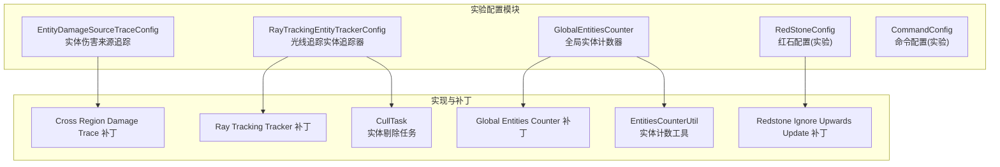
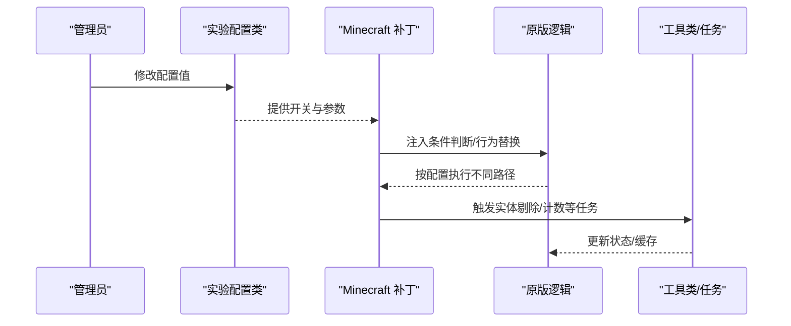
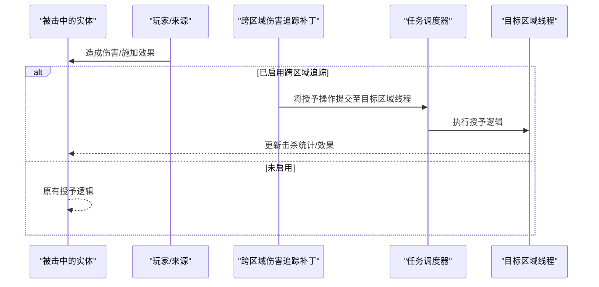
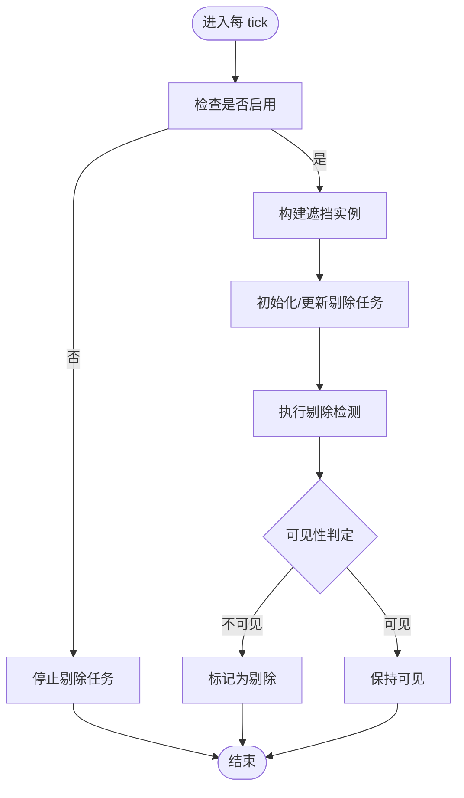
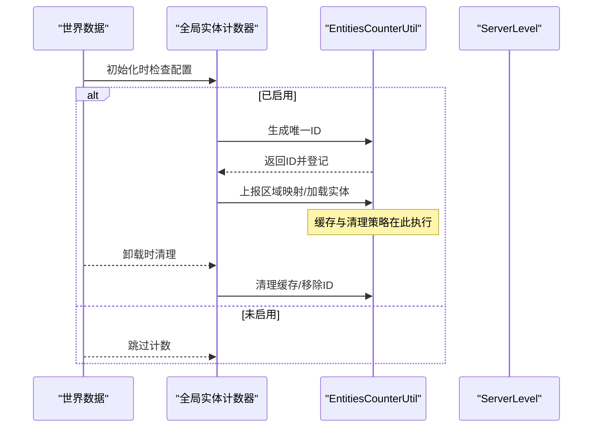
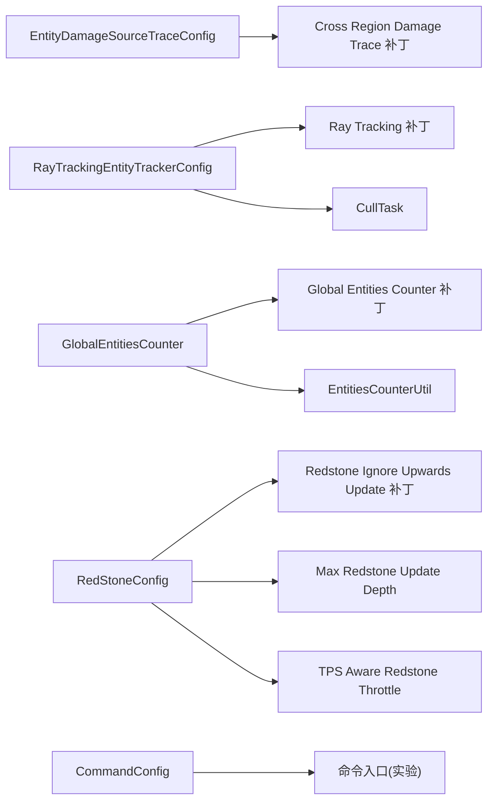

# 实验配置

<cite>
**本文引用的文件**
- [EntityDamageSourceTraceConfig.java](file://lophine-server/src/main/java/fun/bm/lophine/config/modules/experiment/EntityDamageSourceTraceConfig.java)
- [RayTrackingEntityTrackerConfig.java](file://lophine-server/src/main/java/fun/bm/lophine/config/modules/experiment/RayTrackingEntityTrackerConfig.java)
- [GlobalEntitiesCounter.java](file://lophine-server/src/main/java/fun/bm/lophine/config/modules/experiment/GlobalEntitiesCounter.java)
- [RedStoneConfig.java](file://lophine-server/src/main/java/fun/bm/lophine/config/modules/experiment/RedStoneConfig.java)
- [CommandConfig.java](file://lophine-server/src/main/java/fun/bm/lophine/config/modules/experiment/CommandConfig.java)
- [0002-Add-config-to-enable-cross-region-damage-trace.patch](file://lophine-server/minecraft-patches/features/0002-Add-config-to-enable-cross-region-damage-trace.patch)
- [0017-Compatibility-fix-for-Raid-Revert-and-Cross-Region-D.patch](file://lophine-server/minecraft-patches/features/0017-Compatibility-fix-for-Raid-Revert-and-Cross-Region-D.patch)
- [0003-Add-config-to-enable-raytracing-tracker.patch](file://lophine-server/minecraft-patches/features/0003-Add-config-to-enable-raytracing-tracker.patch)
- [0040-Global-Entities-Counter.patch](file://lophine-server/minecraft-patches/features/0040-Global-Entities-Counter.patch)
- [0034-Leaves-Redstone-ignore-upwards-update.patch](file://lophine-server/minecraft-patches/features/0034-Leaves-Redstone-ignore-upwards-update.patch)
- [CullTask.java](file://lophine-server/src/main/java/dev/tr7zw/entityculling/CullTask.java)
- [EntitiesCounterUtil.java](file://lophine-server/src/main/java/fun/bm/lophine/utils/EntitiesCounterUtil.java)
</cite>

## 目录
1. [简介](#简介)
2. [项目结构](#项目结构)
3. [核心组件](#核心组件)
4. [架构总览](#架构总览)
5. [详细组件分析](#详细组件分析)
6. [依赖关系分析](#依赖关系分析)
7. [性能考量](#性能考量)
8. [故障排查指南](#故障排查指南)
9. [结论](#结论)
10. [附录](#附录)

## 简介
本文件系统化梳理 Lophine 的"实验配置"模块，面向服务器管理员与开发者，解释各实验特性在设计上的权衡、启用方式、参数含义、运行机制、安全注意事项、性能影响与最佳实践，并提供常见问题排查思路。当前实验配置涵盖以下子模块：
- 实体伤害来源追踪（跨区域）
- 光线追踪实体追踪器
- 全局实体计数器
- 红石配置（实验级）
- 命令配置（实验级）

## 项目结构
实验配置位于服务端模块的实验配置目录下，采用"按功能分组"的模块化组织方式，每个配置类通过注解声明其分类与名称，统一由配置框架管理。

**图表来源**
- [EntityDamageSourceTraceConfig.java:1-14](file://lophine-server/src/main/java/fun/bm/lophine/config/modules/experiment/EntityDamageSourceTraceConfig.java#L1-L14)
- [RayTrackingEntityTrackerConfig.java:1-20](file://lophine-server/src/main/java/fun/bm/lophine/config/modules/experiment/RayTrackingEntityTrackerConfig.java#L1-L20)
- [GlobalEntitiesCounter.java:1-28](file://lophine-server/src/main/java/fun/bm/lophine/config/modules/experiment/GlobalEntitiesCounter.java#L1-L28)
- [RedStoneConfig.java:1-67](file://lophine-server/src/main/java/fun/bm/lophine/config/modules/experiment/RedStoneConfig.java#L1-L67)
- [CommandConfig.java:1-46](file://lophine-server/src/main/java/fun/bm/lophine/config/modules/experiment/CommandConfig.java#L1-L46)
- [0002-Add-config-to-enable-cross-region-damage-trace.patch:1-85](file://lophine-server/minecraft-patches/features/0002-Add-config-to-enable-cross-region-damage-trace.patch#L1-L85)
- [0003-Add-config-to-enable-raytracing-tracker.patch:1-158](file://lophine-server/minecraft-patches/features/0003-Add-config-to-enable-raytracing-tracker.patch#L1-L158)
- [0040-Global-Entities-Counter.patch:1-29](file://lophine-server/minecraft-patches/features/0040-Global-Entities-Counter.patch#L1-L29)
- [0034-Leaves-Redstone-ignore-upwards-update.patch:1-56](file://lophine-server/minecraft-patches/features/0034-Leaves-Redstone-ignore-upwards-update.patch#L1-L56)
- [CullTask.java:80-151](file://lophine-server/src/main/java/dev/tr7zw/entityculling/CullTask.java#L80-L151)
- [EntitiesCounterUtil.java:29-87](file://lophine-server/src/main/java/fun/bm/lophine/utils/EntitiesCounterUtil.java#L29-L87)

**章节来源**
- [EntityDamageSourceTraceConfig.java:1-14](file://lophine-server/src/main/java/fun/bm/lophine/config/modules/experiment/EntityDamageSourceTraceConfig.java#L1-L14)
- [RayTrackingEntityTrackerConfig.java:1-20](file://lophine-server/src/main/java/fun/bm/lophine/config/modules/experiment/RayTrackingEntityTrackerConfig.java#L1-L20)
- [GlobalEntitiesCounter.java:1-28](file://lophine-server/src/main/java/fun/bm/lophine/config/modules/experiment/GlobalEntitiesCounter.java#L1-L28)
- [RedStoneConfig.java:1-67](file://lophine-server/src/main/java/fun/bm/lophine/config/modules/experiment/RedStoneConfig.java#L1-L67)
- [CommandConfig.java:1-46](file://lophine-server/src/main/java/fun/bm/lophine/config/modules/experiment/CommandConfig.java#L1-L46)

## 核心组件
- 实验配置基座：所有实验配置类均实现统一接口并标注分类，便于集中加载与热重载策略控制。
- 配置注解体系：通过注解声明配置项名称、分类、是否支持热重载、是否需要转换映射等元信息。
- 补丁集成：实验配置通过补丁在原版逻辑中注入条件分支或行为变更，确保仅在启用时生效。

**章节来源**
- [EntityDamageSourceTraceConfig.java:8-14](file://lophine-server/src/main/java/fun/bm/lophine/config/modules/experiment/EntityDamageSourceTraceConfig.java#L8-L14)
- [RayTrackingEntityTrackerConfig.java:8-20](file://lophine-server/src/main/java/fun/bm/lophine/config/modules/experiment/RayTrackingEntityTrackerConfig.java#L8-L20)
- [GlobalEntitiesCounter.java:9-27](file://lophine-server/src/main/java/fun/bm/lophine/config/modules/experiment/GlobalEntitiesCounter.java#L9-L27)
- [RedStoneConfig.java:14-66](file://lophine-server/src/main/java/fun/bm/lophine/config/modules/experiment/RedStoneConfig.java#L14-L66)
- [CommandConfig.java:9-46](file://lophine-server/src/main/java/fun/bm/lophine/config/modules/experiment/CommandConfig.java#L9-L46)

## 架构总览
实验配置的运行链路遵循"配置声明 → 补丁注入 → 运行时判定 → 功能执行"的模式。下图展示关键交互：

**图表来源**
- [0002-Add-config-to-enable-cross-region-damage-trace.patch:15-82](file://lophine-server/minecraft-patches/features/0002-Add-config-to-enable-cross-region-damage-trace.patch#L15-L82)
- [0003-Add-config-to-enable-raytracing-tracker.patch:102-158](file://lophine-server/minecraft-patches/features/0003-Add-config-to-enable-raytracing-tracker.patch#L102-L158)
- [0040-Global-Entities-Counter.patch:25-29](file://lophine-server/minecraft-patches/features/0040-Global-Entities-Counter.patch#L25-L29)
- [0034-Leaves-Redstone-ignore-upwards-update.patch:10-56](file://lophine-server/minecraft-patches/features/0034-Leaves-Redstone-ignore-upwards-update.patch#L10-L56)
- [CullTask.java:80-151](file://lophine-server/src/main/java/dev/tr7zw/entityculling/CullTask.java#L80-L151)
- [EntitiesCounterUtil.java:50-87](file://lophine-server/src/main/java/fun/bm/lophine/utils/EntitiesCounterUtil.java#L50-L87)

## 详细组件分析

### 实体伤害来源追踪（跨区域）
- 设计理念
  - 在实体死亡或受影响时，若启用了跨区域伤害追踪，则将击杀/效果授予流程调度到正确的区域线程上下文，避免跨区域线程切换导致的异常或数据不一致。
- 关键参数
  - enabled：布尔开关，开启后在特定路径调用异步转移逻辑。
- 启用条件与集成点
  - 仅当配置开启时，原版逻辑在处理死亡、效果叠加、击杀统计等路径中插入条件分支，调用异步转移函数。
- 使用场景
  - 多区域/线程环境下，确保伤害来源与击杀归属在正确区域生效；配合某些模组或自定义逻辑时更稳定。
- 安全性与风险
  - 异步调度可能引入竞态或异常传播，需确保目标实体仍有效且线程安全。
- 性能影响
  - 调度与日志记录会带来额外开销；仅在必要时启用。
- 最佳实践
  - 仅在出现跨区域异常或需要严格归属时启用；避免在高负载场景长期开启。
- 故障排查
  - 若出现异常或击杀统计错乱，优先检查配置开关与对应补丁是否生效；查看相关日志定位异步路径。

**图表来源**
- [0002-Add-config-to-enable-cross-region-damage-trace.patch:15-82](file://lophine-server/minecraft-patches/features/0002-Add-config-to-enable-cross-region-damage-trace.patch#L15-L82)
- [0017-Compatibility-fix-for-Raid-Revert-and-Cross-Region-D.patch:16-54](file://lophine-server/minecraft-patches/features/0017-Compatibility-fix-for-Raid-Revert-and-Cross-Region-D.patch#L16-L54)

**章节来源**
- [EntityDamageSourceTraceConfig.java:10-13](file://lophine-server/src/main/java/fun/bm/lophine/config/modules/experiment/EntityDamageSourceTraceConfig.java#L10-L13)
- [0002-Add-config-to-enable-cross-region-damage-trace.patch:15-82](file://lophine-server/minecraft-patches/features/0002-Add-config-to-enable-cross-region-damage-trace.patch#L15-L82)
- [0017-Compatibility-fix-for-Raid-Revert-and-Cross-Region-D.patch:16-54](file://lophine-server/minecraft-patches/features/0017-Compatibility-fix-for-Raid-Revert-and-Cross-Region-D.patch#L16-L54)

### 光线追踪实体追踪器
- 设计理念
  - 基于视锥剔除与遮挡计算，动态决定实体是否可见，从而减少不必要的渲染与网络更新，提升性能。
- 关键参数
  - enabled：总开关
  - skipMarkerArmorStands：跳过标记型隐身盔甲架
  - checkIntervalMs：检测间隔（毫秒）
  - tracingDistance：追踪距离
  - hitboxLimit：最大包围盒尺寸阈值
- 启用条件与集成点
  - 当启用时，玩家实例化实体剔除任务，周期性基于相机位置进行遮挡检测；实体实现可剔除接口以接收可见性状态。
- 使用场景
  - 大量实体场景（如红石/机械/自动化）中降低客户端与服务端压力。
- 安全性与风险
  - 参数设置过大可能导致误判；过度剔除可能影响交互体验。
- 性能影响
  - 遮挡计算与缓存维护带来 CPU 开销；合理设置间隔与距离可平衡性能与体验。
- 最佳实践
  - 先启用再微调参数；结合实际地图规模与设备性能逐步优化。
- 故障排查
  - 若出现实体"消失/不更新"，检查剔除任务是否初始化、参数是否合理、是否命中大体积实体跳过规则。

**图表来源**
- [0003-Add-config-to-enable-raytracing-tracker.patch:102-158](file://lophine-server/minecraft-patches/features/0003-Add-config-to-enable-raytracing-tracker.patch#L102-L158)
- [CullTask.java:80-151](file://lophine-server/src/main/java/dev/tr7zw/entityculling/CullTask.java#L80-L151)

**章节来源**
- [RayTrackingEntityTrackerConfig.java:10-19](file://lophine-server/src/main/java/fun/bm/lophine/config/modules/experiment/RayTrackingEntityTrackerConfig.java#L10-L19)
- [0003-Add-config-to-enable-raytracing-tracker.patch:102-158](file://lophine-server/minecraft-patches/features/0003-Add-config-to-enable-raytracing-tracker.patch#L102-L158)
- [CullTask.java:80-151](file://lophine-server/src/main/java/dev/tr7zw/entityculling/CullTask.java#L80-L151)

### 全局实体计数器
- 设计理念
  - 在多区域线程环境中，为每个世界生成唯一 ID 并对加载的实体进行全局统计，辅助监控与调试。
- 关键参数
  - enabled：启用全局计数
  - async：异步计数（可能引入不稳定因素）
  - alwaysCount：始终计数（含区块加载器加载的实体）
- 启用条件与集成点
  - 启用后在世界数据初始化阶段分配唯一 ID、注册区域映射与加载实体数据，并在卸载时清理缓存。
- 使用场景
  - 需要跨区域统计实体数量、排查异常加载或性能瓶颈。
- 安全性与风险
  - 异步模式可能产生竞态；长时间运行需关注内存与缓存清理。
- 性能影响
  - 异步计数与缓存版本管理带来额外开销；建议仅在诊断阶段启用。
- 最佳实践
  - 默认关闭；仅在需要时临时开启；配合 alwaysCount 以覆盖特殊加载场景。
- 故障排查
  - 若计数异常或内存增长，检查是否启用异步模式、缓存清理是否正常触发。

**图表来源**
- [0040-Global-Entities-Counter.patch:25-29](file://lophine-server/minecraft-patches/features/0040-Global-Entities-Counter.patch#L25-L29)
- [EntitiesCounterUtil.java:50-87](file://lophine-server/src/main/java/fun/bm/lophine/utils/EntitiesCounterUtil.java#L50-L87)

**章节来源**
- [GlobalEntitiesCounter.java:11-27](file://lophine-server/src/main/java/fun/bm/lophine/config/modules/experiment/GlobalEntitiesCounter.java#L11-L27)
- [0040-Global-Entities-Counter.patch:25-29](file://lophine-server/minecraft-patches/features/0040-Global-Entities-Counter.patch#L25-L29)
- [EntitiesCounterUtil.java:50-87](file://lophine-server/src/main/java/fun/bm/lophine/utils/EntitiesCounterUtil.java#L50-L87)

### 红石配置（实验级）
**更新** 新增多个高级红石控制配置选项，包括向上更新忽略、更新深度限制、TPS感知节流等

- 设计理念
  - 提供若干尚未稳定迁移至正式模块的红石行为试验，允许回退或引入旧机制，同时保留热重载限制或转换映射。
- 关键参数
  - redstone-ignore-upwards-update：回退至旧版红石向上传递更新的行为
  - cce-update-suppression：允许使用类型转换异常来抑制更新
  - instant-block-updater：即时方块更新器（实验）
  - old-block-remove-behaviour：旧版方块移除行为
  - max-redstone-update-depth：红石邻居更新的最大深度限制
  - tps-aware-redstone-throttle：基于TPS的红石更新节流
  - tps-aware-redstone-threshold：TPS节流阈值
  - preserve-update-order-on-chunk-load：区块加载时保持更新顺序
- 启用条件与集成点
  - 部分参数通过转换映射指向实验目录下的独立开关；部分参数直接注入原版红石逻辑。
  - 新增的向上更新忽略功能通过补丁修改红石线、比较器和重定向器的更新逻辑。
- 使用场景
  - 与特定机制兼容、测试新旧行为差异、修复兼容性问题、优化大型红石电路性能。
- 安全性与风险
  - 回退旧机制可能破坏稳定性；抑制更新的异常路径存在副作用。
  - 更新深度限制有助于防止栈溢出，但可能影响复杂的红石链路。
  - TPS感知节流可能影响实时性要求高的红石装置。
- 性能影响
  - 不同行为对更新频率与传播路径有显著影响，需按需启用。
  - 更新深度限制和节流机制可提高服务器稳定性，但可能略微影响响应速度。
- 最佳实践
  - 逐项验证，先小范围测试；记录行为差异后再决定是否合并到正式模块。
  - 对于大型技术服务器，建议启用TPS感知节流和更新深度限制。
- 故障排查
  - 出现红石异常传播或更新缺失，检查对应实验开关与转换映射是否生效。
  - 如果遇到红石链路性能问题，检查更新深度限制和节流配置。

**新增配置选项详解**：

#### 向上更新忽略（redstone-ignore-upwards-update）
- 功能描述：回退到1.20.1之前的红石行为，允许红石粉在打开的活板门上连接
- 影响范围：红石线、重定向器、比较器的向下更新逻辑
- 兼容性：解决与旧版本红石装置的兼容性问题

#### 更新深度限制（max-redstone-update-depth）
- 功能描述：限制单tick内红石邻居更新的最大深度，防止栈溢出
- 默认值：0（无限制，兼容原版行为）
- 推荐值：512-1024（技术服务器推荐）
- 安全性：保护服务器免受深度更新链路导致的崩溃

#### TPS感知节流（tps-aware-redstone-throttle）
- 功能描述：当服务器TPS低于阈值时自动节流红石更新
- 适用场景：高负载服务器，防止红石装置占用过多tick时间
- 性能权衡：提高整体稳定性，可能影响红石响应速度

#### 区块加载更新顺序（preserve-update-order-on-chunk-load）
- 功能描述：区块加载触发的红石更新按确定性顺序处理
- 适用场景：需要可靠区块加载触发电路的技术玩家
- 性能影响：可能略微增加区块加载时的tick时间

**章节来源**
- [RedStoneConfig.java:16-66](file://lophine-server/src/main/java/fun/bm/lophine/config/modules/experiment/RedStoneConfig.java#L16-L66)
- [0034-Leaves-Redstone-ignore-upwards-update.patch:10-56](file://lophine-server/minecraft-patches/features/0034-Leaves-Redstone-ignore-upwards-update.patch#L10-L56)

### 命令配置（实验级）
- 设计理念
  - 控制若干实验性命令的可用性与行为，如 tick、function、waypoint、scoreboard、save-all 等。
- 关键参数
  - tick_command_enabled：启用 tick 命令
  - function_command_enabled：启用 function 命令
  - waypoint_command_enabled：启用 waypoint 与定位栏
  - scoreboard_command_enabled：启用 scoreboard 命令
  - save_all_command_enabled：启用 save-all 命令
  - log_all_process：记录 save-all 全过程日志
  - save_all_command_timeout：save-all 超时时间（秒）
- 启用条件与集成点
  - 通过配置控制命令入口；部分命令存在转换映射或目录别名。
- 使用场景
  - 调试、自动化脚本、导航与计分板管理。
- 安全性与风险
  - 某些命令（如 save-all）可能阻塞或产生大量 I/O，需谨慎设置超时。
- 性能影响
  - 命令执行本身开销较小，但 save-all 可能引发大规模落盘。
- 最佳实践
  - 仅开放必要命令；为 save-all 设置合理超时；记录日志以便审计。
- 故障排查
  - 命令不可用或超时，检查对应开关与超时配置；查看日志定位卡顿环节。

**章节来源**
- [CommandConfig.java:11-46](file://lophine-server/src/main/java/fun/bm/lophine/config/modules/experiment/CommandConfig.java#L11-L46)

## 依赖关系分析
实验配置与原版逻辑通过补丁建立松耦合依赖，配置类仅作为"开关与参数源"。实体剔除与计数依赖外部库与工具类，形成清晰的职责边界。

**图表来源**
- [EntityDamageSourceTraceConfig.java:8-14](file://lophine-server/src/main/java/fun/bm/lophine/config/modules/experiment/EntityDamageSourceTraceConfig.java#L8-L14)
- [RayTrackingEntityTrackerConfig.java:8-20](file://lophine-server/src/main/java/fun/bm/lophine/config/modules/experiment/RayTrackingEntityTrackerConfig.java#L8-L20)
- [GlobalEntitiesCounter.java:9-27](file://lophine-server/src/main/java/fun/bm/lophine/config/modules/experiment/GlobalEntitiesCounter.java#L9-L27)
- [RedStoneConfig.java:14-66](file://lophine-server/src/main/java/fun/bm/lophine/config/modules/experiment/RedStoneConfig.java#L14-L66)
- [CommandConfig.java:9-46](file://lophine-server/src/main/java/fun/bm/lophine/config/modules/experiment/CommandConfig.java#L9-L46)
- [0002-Add-config-to-enable-cross-region-damage-trace.patch:15-82](file://lophine-server/minecraft-patches/features/0002-Add-config-to-enable-cross-region-damage-trace.patch#L15-L82)
- [0003-Add-config-to-enable-raytracing-tracker.patch:102-158](file://lophine-server/minecraft-patches/features/0003-Add-config-to-enable-raytracing-tracker.patch#L102-L158)
- [0040-Global-Entities-Counter.patch:25-29](file://lophine-server/minecraft-patches/features/0040-Global-Entities-Counter.patch#L25-L29)
- [0034-Leaves-Redstone-ignore-upwards-update.patch:10-56](file://lophine-server/minecraft-patches/features/0034-Leaves-Redstone-ignore-upwards-update.patch#L10-L56)
- [CullTask.java:80-151](file://lophine-server/src/main/java/dev/tr7zw/entityculling/CullTask.java#L80-L151)
- [EntitiesCounterUtil.java:50-87](file://lophine-server/src/main/java/fun/bm/lophine/utils/EntitiesCounterUtil.java#L50-L87)

## 性能考量
- 跨区域伤害追踪
  - 异步调度与日志记录带来额外开销；仅在必要时启用。
- 光线追踪实体追踪器
  - 遮挡计算与缓存维护消耗 CPU；可通过调整间隔、距离与阈值平衡性能。
- 全局实体计数器
  - 异步模式与缓存版本管理增加复杂度；建议仅在诊断阶段启用。
- 红石配置
  - 向上更新忽略功能对红石传播逻辑有轻微影响
  - 更新深度限制可防止性能雪崩，但可能影响极长链路
  - TPS感知节流在高负载时提高稳定性，但可能影响实时性
  - 区块加载更新顺序保证可靠性，但可能增加加载时延
- 命令
  - 命令执行本身开销较小，但 save-all 可能引发 I/O 峰值。

## 故障排查指南
- 启用后无效果
  - 确认配置已写入并生效；检查补丁是否应用成功。
- 性能下降
  - 关闭实验特性或调低参数；观察 CPU/内存变化。
- 异常或崩溃
  - 逐项禁用实验特性定位问题；查看相关日志。
- 计数异常
  - 检查是否启用异步模式；确认缓存清理是否触发。
- 命令超时
  - 提高 save-all 超时阈值；减少同时保存的区域数量。
- 红石问题
  - 检查更新深度限制是否过低导致链路中断
  - 验证TPS节流配置是否影响了实时性要求
  - 确认区块加载顺序设置是否影响了电路可靠性

## 结论
实验配置模块为 Lophine 提供了可控的"试验场"，在不影响主线稳定性的前提下探索新行为与优化手段。新增的红石配置选项显著增强了红石行为的控制能力，特别是更新深度限制和TPS感知节流等高级功能，为大型技术服务器提供了更好的稳定性保障。建议以最小可行原则启用，结合监控与日志持续验证，并在验证成熟后迁移到正式模块。

## 附录
- 启用方法
  - 通过配置文件修改对应开关与参数；重启或执行热重载（受注解约束的配置项可能不支持热重载）。
- 配置示例
  - 实体伤害来源追踪：将开关设为启用。
  - 光线追踪实体追踪器：启用并设置合理的追踪距离、检测间隔与包围盒阈值。
  - 全局实体计数器：启用并在需要时开启异步与始终计数。
  - 红石配置：根据服务器需求启用相应的实验功能
    - 技术服务器推荐：启用TPS感知节流、更新深度限制、区块加载顺序保持
    - 兼容性需求：启用向上更新忽略
  - 命令配置：开放必要的命令并设置 save-all 超时。
- 效果演示
  - 实体伤害来源追踪：在多区域场景下确保击杀归属正确。
  - 光线追踪实体追踪器：在大量实体场景下减少可见实体数量，降低网络与渲染压力。
  - 全局实体计数器：提供跨区域实体统计，辅助性能与稳定性分析。
  - 红石配置：在兼容性测试中验证旧机制回退与新行为差异，优化大型红石电路性能。
  - 命令配置：在调试与自动化中提供便捷工具。