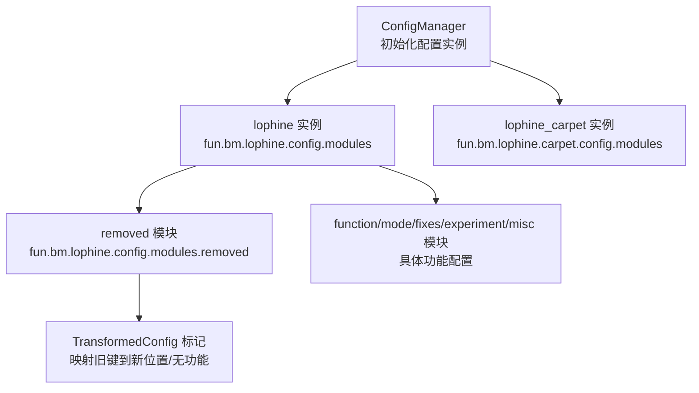
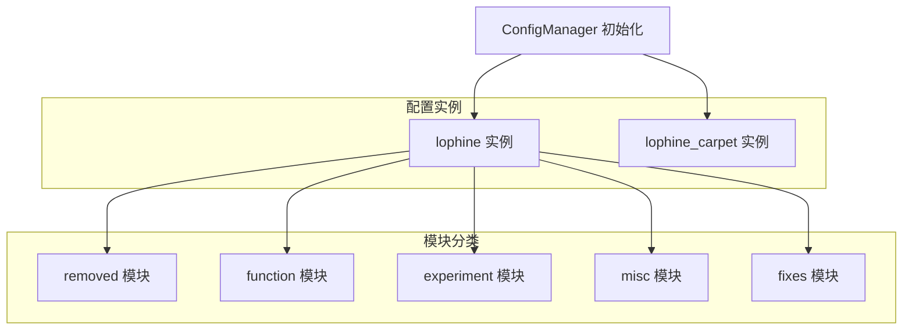
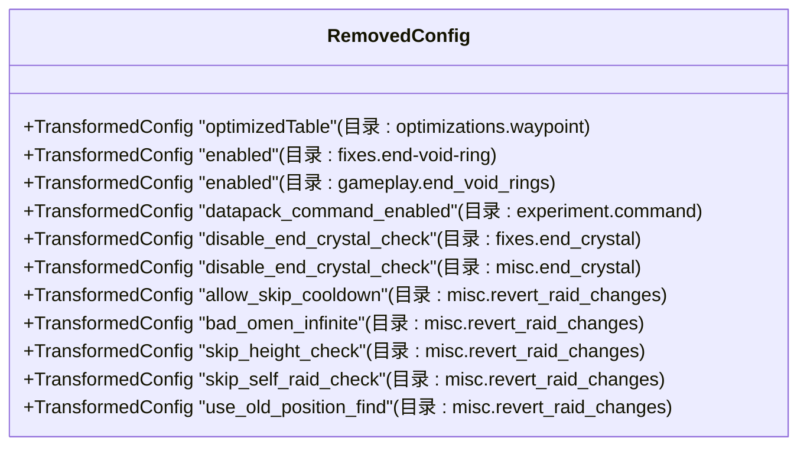
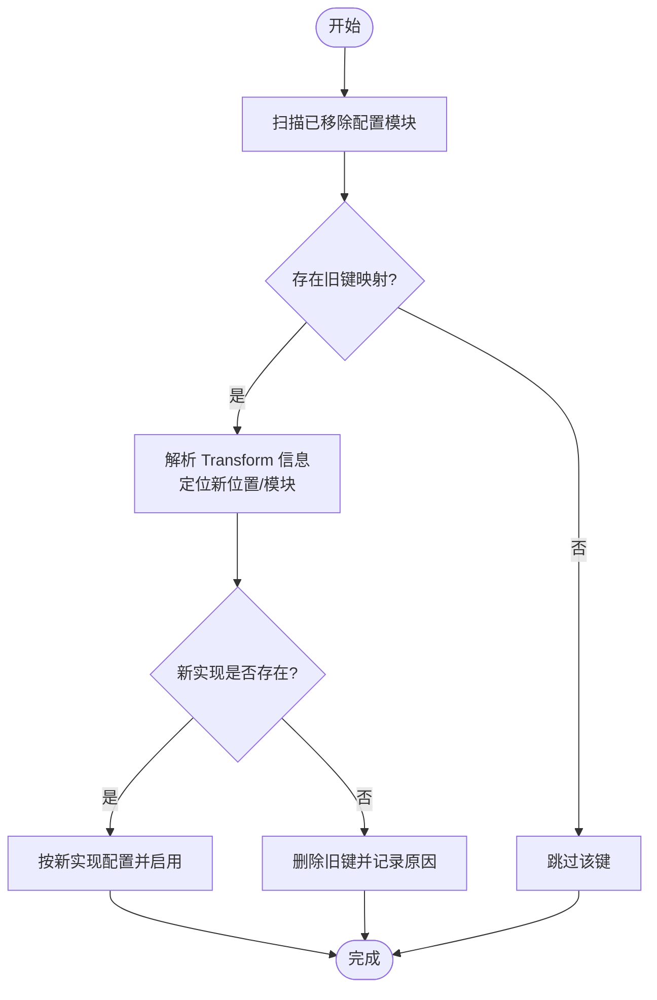
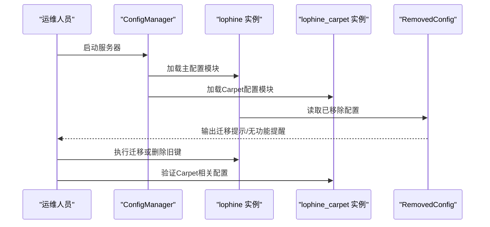
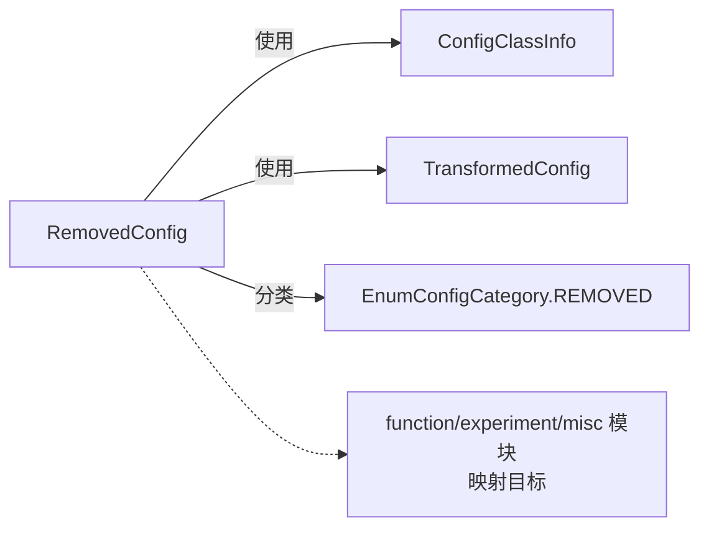

# 已移除配置

<cite>
**本文引用的文件**
- [RemovedConfig.java](file://lophine-server/src/main/java/fun/bm/lophine/config/modules/removed/RemovedConfig.java)
- [0002-Transformed-Configs.patch](file://lophine-server/luminol-patches/features/0002-Transformed-Configs.patch)
- [0006-Carpet-features.patch](file://lophine-server/luminol-patches/features/0006-Carpet-features.patch)
- [0001-Rebrand-to-Lophine.patch](file://lophine-server/luminol-patches/features/0001-Rebrand-to-Lophine.patch)
- [ConfigManager.java](file://lophine-server/src/main/java/me/earthme/luminol/config/ConfigManager.java)
- [AutoUpdateConfig.java](file://lophine-server/src/main/java/fun/bm/lophine/config/modules/misc/AutoUpdateConfig.java)
- [CoreConfig.java](file://lophine-server/src/main/java/fun/bm/lophine/carpet/config/modules/CoreConfig.java)
- [GeneralCompatConfig.java](file://lophine-server/src/main/java/fun/bm/lophine/carpet/config/modules/GeneralCompatConfig.java)
- [ContainerExpansionConfig.java](file://lophine-server/src/main/java/fun/bm/lophine/config/modules/function/ContainerExpansionConfig.java)
- [OldFeatureConfig.java](file://lophine-server/src/main/java/fun/bm/lophine/config/modules/function/OldFeatureConfig.java)
- [RedStoneConfig.java](file://lophine-server/src/main/java/fun/bm/lophine/config/modules/function/RedStoneConfig.java)
- [CommandConfig.java](file://lophine-server/src/main/java/fun/bm/lophine/config/modules/experiment/CommandConfig.java)
</cite>

## 目录
1. [简介](#简介)
2. [项目结构](#项目结构)
3. [核心组件](#核心组件)
4. [架构总览](#架构总览)
5. [详细组件分析](#详细组件分析)
6. [依赖关系分析](#依赖关系分析)
7. [性能考量](#性能考量)
8. [故障排查指南](#故障排查指南)
9. [结论](#结论)
10. [附录](#附录)

## 简介
本文件面向Lophine已移除配置模块的专项说明与迁移指南。目标包括：
- 解释已移除配置的设计目的与管理机制
- 列举被移除的配置项、移除原因及替代方案
- 提供配置迁移步骤与向后兼容性处理建议
- 说明版本升级过程中对已移除配置的处理方式
- 给出配置清理与兼容性检查方法
- 针对常见问题提供排查与解决方案
- 说明已移除配置对服务器运行的影响与注意事项

## 项目结构
Lophine的配置系统由Luminol配置框架驱动，支持多实例（如“lophine”、“lophine_carpet”等）。已移除配置通过独立模块集中声明，使用“转换配置”标记将旧路径映射到新位置或功能实现。

图示来源
- [0001-Rebrand-to-Lophine.patch:11-17](file://lophine-server/luminol-patches/features/0001-Rebrand-to-Lophine.patch#L11-L17)
- [0006-Carpet-features.patch:15-21](file://lophine-server/luminol-patches/features/0006-Carpet-features.patch#L15-L21)
- [ConfigManager.java:12-23](file://lophine-server/src/main/java/me/earthme/luminol/config/ConfigManager.java#L12-L23)

章节来源
- [0001-Rebrand-to-Lophine.patch:11-17](file://lophine-server/luminol-patches/features/0001-Rebrand-to-Lophine.patch#L11-L17)
- [0006-Carpet-features.patch:15-21](file://lophine-server/luminol-patches/features/0006-Carpet-features.patch#L15-L21)
- [ConfigManager.java:12-23](file://lophine-server/src/main/java/me/earthme/luminol/config/ConfigManager.java#L12-L23)

## 核心组件
- 已移除配置模块：集中声明不再生效的配置键，使用“转换配置”标记进行路径映射，便于用户识别与迁移。
- 转换配置机制：通过TransformedConfig将旧键名与目录映射到新位置或功能实现，若无对应实现则标记为“无功能”。

章节来源
- [RemovedConfig.java:9-21](file://lophine-server/src/main/java/fun/bm/lophine/config/modules/removed/RemovedConfig.java#L9-L21)

## 架构总览
下图展示Lophine配置系统中“已移除配置”的定位与交互：

图示来源
- [0001-Rebrand-to-Lophine.patch:11-17](file://lophine-server/luminol-patches/features/0001-Rebrand-to-Lophine.patch#L11-L17)
- [0006-Carpet-features.patch:15-21](file://lophine-server/luminol-patches/features/0006-Carpet-features.patch#L15-L21)
- [ConfigManager.java:12-23](file://lophine-server/src/main/java/me/earthme/luminol/config/ConfigManager.java#L12-L23)

## 详细组件分析

### 已移除配置模块（RemovedConfig）
- 设计目的：统一标识不再生效的配置键，避免用户误用；通过TransformedConfig标记提供迁移指引。
- 管理机制：以“REMOVED”分类注册，所有字段均为“转换配置”，且transform=false，表示不执行实际转换，仅用于提示。
- 影响范围：列举了多个旧键，覆盖优化、修复、实验、杂项等多个子系统。

图示来源
- [RemovedConfig.java:11-21](file://lophine-server/src/main/java/fun/bm/lophine/config/modules/removed/RemovedConfig.java#L11-L21)

章节来源
- [RemovedConfig.java:9-21](file://lophine-server/src/main/java/fun/bm/lophine/config/modules/removed/RemovedConfig.java#L9-L21)

### 转换配置与迁移策略
- 转换配置（TransformedConfig）：用于将旧键映射到新位置或新模块，部分键可能已无对应功能。
- 迁移策略：根据TransformedConfig的directory与name，定位到新的功能模块或配置项；若无对应实现，则应删除旧键并参考替代方案。

图示来源
- [0002-Transformed-Configs.patch:15-23](file://lophine-server/luminol-patches/features/0002-Transformed-Configs.patch#L15-L23)
- [RemovedConfig.java:11-21](file://lophine-server/src/main/java/fun/bm/lophine/config/modules/removed/RemovedConfig.java#L11-L21)

章节来源
- [0002-Transformed-Configs.patch:15-23](file://lophine-server/luminol-patches/features/0002-Transformed-Configs.patch#L15-L23)

### 兼容性与版本升级处理
- 多实例配置：Lophine引入“lophine_carpet”实例，与原“lophine”实例并行，确保Carpet相关配置可独立管理。
- 升级流程：升级时保留“lophine”与“lophine_carpet”两个实例，逐项比对RemovedConfig中的键，执行迁移或删除。

图示来源
- [0006-Carpet-features.patch:15-21](file://lophine-server/luminol-patches/features/0006-Carpet-features.patch#L15-L21)
- [ConfigManager.java:12-23](file://lophine-server/src/main/java/me/earthme/luminol/config/ConfigManager.java#L12-L23)
- [RemovedConfig.java:9-21](file://lophine-server/src/main/java/fun/bm/lophine/config/modules/removed/RemovedConfig.java#L9-L21)

章节来源
- [0006-Carpet-features.patch:15-21](file://lophine-server/luminol-patches/features/0006-Carpet-features.patch#L15-L21)
- [ConfigManager.java:12-23](file://lophine-server/src/main/java/me/earthme/luminol/config/ConfigManager.java#L12-L23)

## 依赖关系分析
- RemovedConfig依赖于Luminol配置框架的注解与枚举，通过ConfigClassInfo与TransformedConfig进行声明式配置。
- 与其他模块的关系：RemovedConfig作为“只读/提示”模块，不直接依赖其他功能模块；但其TransformedConfig指向的功能模块（如function、experiment、misc等）会承担原有功能。

图示来源
- [RemovedConfig.java:3-7](file://lophine-server/src/main/java/fun/bm/lophine/config/modules/removed/RemovedConfig.java#L3-L7)

章节来源
- [RemovedConfig.java:3-7](file://lophine-server/src/main/java/fun/bm/lophine/config/modules/removed/RemovedConfig.java#L3-L7)

## 性能考量
- 已移除配置本身不执行任何逻辑，仅用于提示与映射，对运行时性能影响可忽略。
- 建议在升级前清理无效键，减少配置文件体积与加载开销。

## 故障排查指南
- 现象：旧键仍存在于配置文件中，但无效果。
  - 排查：确认是否在RemovedConfig中列出；查看对应TransformedConfig的目标模块。
  - 处理：按迁移策略执行迁移或删除。
- 现象：Carpet相关配置异常。
  - 排查：确认“lophine_carpet”实例已正确初始化。
  - 处理：参考Carpet相关模块配置，确保与主配置隔离。
- 现象：自动更新配置无效。
  - 排查：AutoUpdateConfig明确指出功能由Luminol实现，需在Luminol配置中编辑。
  - 处理：在Luminol的misc.auto_update中启用并配置。

章节来源
- [AutoUpdateConfig.java:8-28](file://lophine-server/src/main/java/fun/bm/lophine/config/modules/misc/AutoUpdateConfig.java#L8-L28)
- [0006-Carpet-features.patch:15-21](file://lophine-server/luminol-patches/features/0006-Carpet-features.patch#L15-L21)

## 结论
- 已移除配置模块通过统一声明与转换配置机制，帮助用户识别并迁移旧键。
- 升级时应优先清理无效键，按映射目标迁移到新模块或功能实现。
- “lophine_carpet”实例的引入提升了配置管理的灵活性与兼容性。

## 附录

### 已移除配置清单与迁移建议
以下为RemovedConfig中声明的旧键及其迁移方向（基于TransformedConfig的directory与name）。请结合对应模块的实际实现进行迁移或删除。

- 优化与功能
  - optimizedTable → optimizations.waypoint
    - 迁移建议：检查Waypoint相关功能是否已内置或通过其他模块替代。
  - enabled → fixes.end-void-ring
    - 迁移建议：确认修复类功能是否已整合至其他模块。
  - enabled → gameplay.end_void_rings
    - 迁移建议：确认游戏玩法相关功能是否已迁移。
- 实验与命令
  - datapack_command_enabled → experiment.command
    - 迁移建议：参考实验模块中的命令相关配置。
  - enabled → experiment.force_enable_command_block_command_execution
    - 迁移建议：确认是否已有等效开关。
- 修复与末地
  - disable_end_crystal_check → fixes.end_crystal
  - disable_end_crystal_check → misc.end_crystal
    - 迁移建议：确认末地相关修复是否已默认开启或通过其他方式控制。
- 旧版行为与灾厄事件
  - allow_skip_cooldown / bad_omen_infinite / skip_height_check / skip_self_raid_check / use_old_position_find → misc.revert_raid_changes
    - 迁移建议：确认旧版灾厄行为是否已通过OldFeatureConfig或其他模块提供替代。

章节来源
- [RemovedConfig.java:11-21](file://lophine-server/src/main/java/fun/bm/lophine/config/modules/removed/RemovedConfig.java#L11-L21)

### 替代方案与对应模块
- 容器扩展
  - barrel_rows / enderchest_rows → function.container_expansion 或 misc.container_expansion
  - shulker_stackable_count / same_nbt_shulker_stackable → function.container_expansion 或 misc.container_expansion
  - 参考：[ContainerExpansionConfig.java:12-24](file://lophine-server/src/main/java/fun/bm/lophine/config/modules/function/ContainerExpansionConfig.java#L12-L24)
- 旧版特性
  - spawn_invulnerable_time / old_zombie_reinforcement / old_explosion_damage_calculator / old_raid_behavior → misc.old-feature
  - give_bad_omen_when_kill_raid_captain → misc.revert_raid_changes
  - 参考：[OldFeatureConfig.java:11-26](file://lophine-server/src/main/java/fun/bm/lophine/config/modules/function/OldFeatureConfig.java#L11-L26)
- 红石相关
  - shears_rotate / allow_skip_cooldown → misc.redstone
  - 参考：[RedStoneConfig.java:11-17](file://lophine-server/src/main/java/fun/bm/lophine/config/modules/function/RedStoneConfig.java#L11-L17)
- 命令与实验
  - enable_data_command / enable_command_block → experiment.command
  - 参考：[CommandConfig.java:15-22](file://lophine-server/src/main/java/fun/bm/lophine/config/modules/experiment/CommandConfig.java#L15-L22)

### 版本升级与兼容性检查清单
- 启动前
  - 备份当前配置文件
  - 记录RemovedConfig中所有旧键
- 升级后
  - 使用ConfigManager加载“lophine”与“lophine_carpet”
  - 对照RemovedConfig迁移或删除旧键
  - 验证各模块功能是否正常
- 后续维护
  - 定期清理无效键
  - 关注AutoUpdateConfig提示，按Luminol配置系统进行更新

章节来源
- [0001-Rebrand-to-Lophine.patch:11-17](file://lophine-server/luminol-patches/features/0001-Rebrand-to-Lophine.patch#L11-L17)
- [0006-Carpet-features.patch:15-21](file://lophine-server/luminol-patches/features/0006-Carpet-features.patch#L15-L21)
- [ConfigManager.java:12-23](file://lophine-server/src/main/java/me/earthme/luminol/config/ConfigManager.java#L12-L23)
- [AutoUpdateConfig.java:8-28](file://lophine-server/src/main/java/fun/bm/lophine/config/modules/misc/AutoUpdateConfig.java#L8-L28)