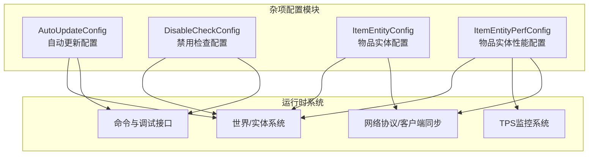
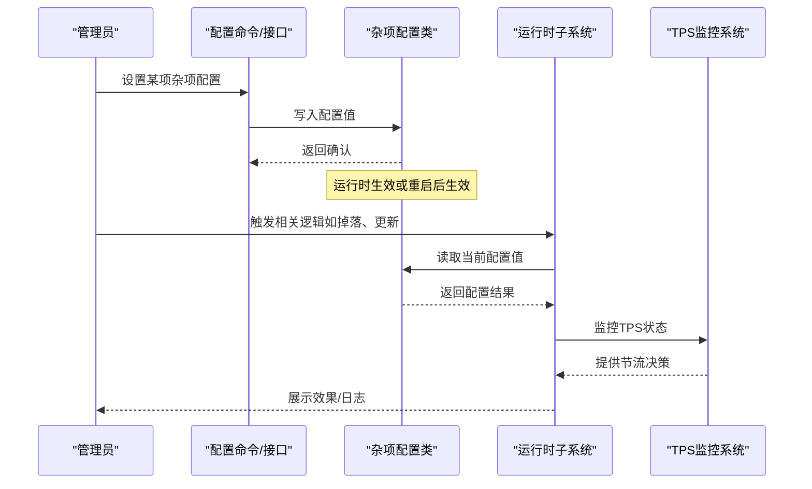
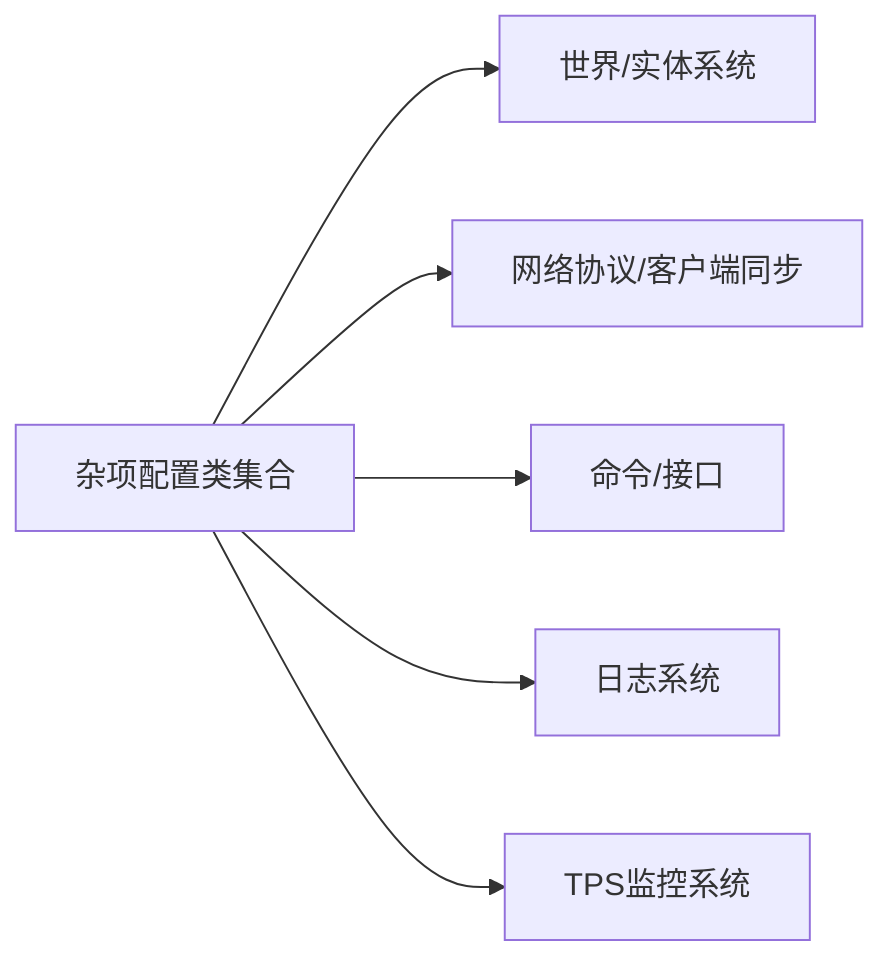

# 杂项配置

<cite>
**本文引用的文件**
- [AutoUpdateConfig.java](file://lophine-server/src/main/java/fun/bm/lophine/config/modules/misc/AutoUpdateConfig.java)
- [DisableCheckConfig.java](file://lophine-server/src/main/java/fun/bm/lophine/config/modules/misc/DisableCheckConfig.java)
- [ItemEntityConfig.java](file://lophine-server/src/main/java/fun/bm/lophine/config/modules/misc/ItemEntityConfig.java)
- [ItemEntityPerfConfig.java](file://lophine-server/src/main/java/fun/bm/lophine/config/modules/misc/ItemEntityPerfConfig.java)
</cite>

## 更新摘要
**所做更改**
- 新增物品实体性能配置模块(ItemEntityPerfConfig)，包含7个核心性能控制参数
- 更新物品实体性能配置章节，详细介绍新增的性能优化功能
- 增强性能考量与故障排除指南，涵盖新的TPS感知节流机制
- 补充新的配置参数说明与推荐值

## 目录
1. [简介](#简介)
2. [项目结构](#项目结构)
3. [核心组件](#核心组件)
4. [架构总览](#架构总览)
5. [详细组件分析](#详细组件分析)
6. [依赖关系分析](#依赖关系分析)
7. [性能考量](#性能考量)
8. [故障排除指南](#故障排除指南)
9. [结论](#结论)
10. [附录](#附录)

## 简介
本文件系统性梳理 Lophine 杂项配置模块，聚焦以下五类配置：自动更新配置、禁用检查配置、物品实体配置、物品实体性能配置、以及新增的物品实体性能配置。文档从功能作用、适用场景、配置方法、参数说明与推荐值、对服务器性能的影响与优化建议、最佳实践与注意事项、以及常见问题排查等方面进行深入说明，帮助管理员在保证稳定性的同时获得更优的游戏体验与运行效率。

## 项目结构
杂项配置位于 Lophine 服务端模块中，采用按功能域分层组织：
- 配置入口与模块化：各配置以独立类实现，统一归档于 misc 包下，便于维护与扩展。
- 功能边界清晰：每类配置仅负责自身领域的开关与阈值控制，避免耦合。
- 与核心系统集成：配置通过 Lophine 的配置框架加载，并在运行时被相关子系统读取与应用。

**图表来源**
- [AutoUpdateConfig.java](file://lophine-server/src/main/java/fun/bm/lophine/config/modules/misc/AutoUpdateConfig.java)
- [DisableCheckConfig.java](file://lophine-server/src/main/java/fun/bm/lophine/config/modules/misc/DisableCheckConfig.java)
- [ItemEntityConfig.java](file://lophine-server/src/main/java/fun/bm/lophine/config/modules/misc/ItemEntityConfig.java)
- [ItemEntityPerfConfig.java](file://lophine-server/src/main/java/fun/bm/lophine/config/modules/misc/ItemEntityPerfConfig.java)

**章节来源**
- [AutoUpdateConfig.java](file://lophine-server/src/main/java/fun/bm/lophine/config/modules/misc/AutoUpdateConfig.java)
- [DisableCheckConfig.java](file://lophine-server/src/main/java/fun/bm/lophine/config/modules/misc/DisableCheckConfig.java)
- [ItemEntityConfig.java](file://lophine-server/src/main/java/fun/bm/lophine/config/modules/misc/ItemEntityConfig.java)
- [ItemEntityPerfConfig.java](file://lophine-server/src/main/java/fun/bm/lophine/config/modules/misc/ItemEntityPerfConfig.java)

## 核心组件
- 自动更新配置（AutoUpdateConfig）
  - 职责：控制与"自动更新"相关的机制行为，如更新频率、触发条件、影响范围等。
  - 关键点：通常用于减少不必要的频繁更新，降低 tick 压力；可配合其他配置形成组合拳。
- 禁用检查配置（DisableCheckConfig）
  - 职责：提供若干"禁用检查"的开关，用于在特定场景下跳过某些校验或限制，换取更高的灵活性或性能。
  - 关键点：需谨慎开启，避免破坏游戏平衡或引入异常行为。
- 物品实体配置（ItemEntityConfig）
  - 职责：定义物品实体（掉落物）的行为规则，如合并策略、拾取延迟、共享范围、最大数量等。
  - 关键点：直接影响玩家拾取体验与服务器 tick 开销。
- 物品实体性能配置（ItemEntityPerfConfig）
  - 职责：针对物品实体处理的性能优化参数，包括合并范围增强、拾取冷却优化、合并尝试限制、TPS感知节流、漏斗传输加速等。
  - 关键点：在高密度掉落场景下尤为关键，能显著降低 CPU 与内存压力，支持技术型服务器的高性能需求。

**章节来源**
- [AutoUpdateConfig.java](file://lophine-server/src/main/java/fun/bm/lophine/config/modules/misc/AutoUpdateConfig.java)
- [DisableCheckConfig.java](file://lophine-server/src/main/java/fun/bm/lophine/config/modules/misc/DisableCheckConfig.java)
- [ItemEntityConfig.java](file://lophine-server/src/main/java/fun/bm/lophine/config/modules/misc/ItemEntityConfig.java)
- [ItemEntityPerfConfig.java](file://lophine-server/src/main/java/fun/bm/lophine/config/modules/misc/ItemEntityPerfConfig.java)

## 架构总览
杂项配置模块通过统一的配置框架加载，运行时由各子系统按需读取。其交互关系如下：

**图表来源**
- [AutoUpdateConfig.java](file://lophine-server/src/main/java/fun/bm/lophine/config/modules/misc/AutoUpdateConfig.java)
- [DisableCheckConfig.java](file://lophine-server/src/main/java/fun/bm/lophine/config/modules/misc/DisableCheckConfig.java)
- [ItemEntityConfig.java](file://lophine-server/src/main/java/fun/bm/lophine/config/modules/misc/ItemEntityConfig.java)
- [ItemEntityPerfConfig.java](file://lophine-server/src/main/java/fun/bm/lophine/config/modules/misc/ItemEntityPerfConfig.java)

## 详细组件分析

### 自动更新配置（AutoUpdateConfig）
- 功能作用
  - 控制自动更新的触发节奏与范围，避免过度更新导致的 tick 波峰。
  - 可与"禁用检查"等配置联动，形成更精细的更新策略。
- 适用场景
  - 高负载服务器：通过降低更新频率缓解 CPU 压力。
  - 大型红石/自动化农场：减少频繁状态变化带来的连锁更新。
- 配置方法
  - 通过配置命令或配置文件设置对应参数；部分参数可能需要重启生效。
- 参数说明与推荐值
  - 更新间隔：根据服务器 tick 时间与负载情况调整，建议从保守值起步，逐步调优。
  - 影响范围：限定到区块或区域，避免全局扫描造成抖动。
- 对性能的影响
  - 合理降低更新频率可显著减少 tick 开销；但过低可能导致响应迟滞。
- 最佳实践
  - 先启用最小化更新范围，再逐步扩大；结合监控指标观察效果。
  - 在高峰时段保持保守策略，在低峰时段适度放宽。
- 注意事项
  - 与"禁用检查"类配置协同使用时，需评估对游戏平衡的影响。

**章节来源**
- [AutoUpdateConfig.java](file://lophine-server/src/main/java/fun/bm/lophine/config/modules/misc/AutoUpdateConfig.java)

### 禁用检查配置（DisableCheckConfig）
- 功能作用
  - 提供若干"禁用检查"的开关，允许在特定情况下跳过某些校验或限制。
- 适用场景
  - 调试模式：临时关闭某些检查以便定位问题。
  - 特殊玩法：在自定义地图或模组环境中，关闭不适用的检查。
- 配置方法
  - 通过配置命令或配置文件设置；部分检查可能涉及安全风险，需谨慎开启。
- 参数说明与推荐值
  - 每个检查项应单独开关，建议默认关闭，按需开启。
- 对性能的影响
  - 关闭不必要的检查可减少判断开销；但可能掩盖潜在问题。
- 最佳实践
  - 仅在开发或测试环境长期开启；生产环境尽量保持默认。
  - 记录每次变更，便于回溯与审计。
- 注意事项
  - 不要盲目全量开启，优先选择与当前问题直接相关的检查项。

**章节来源**
- [DisableCheckConfig.java](file://lophine-server/src/main/java/fun/bm/lophine/config/modules/misc/DisableCheckConfig.java)

### 物品实体配置（ItemEntityConfig）
- 功能作用
  - 定义掉落物实体的行为规则，如合并、拾取延迟、共享范围、最大数量等。
- 适用场景
  - 高密度掉落（挖矿、刷怪、合成）场景：通过合并与范围控制提升体验。
  - 大规模多人服务器：通过限制单格掉落数量避免卡顿。
- 配置方法
  - 通过配置命令或配置文件设置；部分参数可能影响客户端显示一致性。
- 参数说明与推荐值
  - 合并半径/阈值：根据掉落密集度调整，避免过多小堆。
  - 拾取延迟：平衡公平性与流畅性，避免"抢夺"或"卡顿"。
  - 最大数量：防止极端情况下的内存与性能问题。
- 对性能的影响
  - 合理的合并与上限可显著降低实体数量与 tick 处理量。
- 最佳实践
  - 先观察玩家反馈与性能指标，再微调参数。
  - 结合"物品实体性能配置"共同优化。
- 注意事项
  - 与客户端协议/显示相关联的参数需谨慎修改，避免出现视觉错位。

**章节来源**
- [ItemEntityConfig.java](file://lophine-server/src/main/java/fun/bm/lophine/config/modules/misc/ItemEntityConfig.java)

### 物品实体性能配置（ItemEntityPerfConfig）

**更新** 新增物品实体性能配置模块，提供7个核心性能控制参数，专为技术型服务器优化设计。

- 功能作用
  - 提供精细化的物品实体性能控制，包括合并范围增强、拾取冷却优化、合并尝试限制、TPS感知节流、漏斗传输加速等功能。
  - 支持技术玩家构建高效的大规模自动化系统，如物品电梯、排序系统和超级熔炉。
- 适用场景
  - 技术型服务器：需要高性能物品处理的自动化农场和工业系统。
  - 高密度掉落场景：超级熔炉、批量物品电梯、复杂物流系统。
  - 高峰时段服务器：需要TPS感知的动态节流机制。
- 配置方法
  - 通过配置命令或配置文件设置各项参数；部分参数可能影响游戏平衡，需谨慎调整。
- 参数说明与推荐值

#### 合并范围增强（optimistic-merge-range-bonus）
- 类型：double
- 默认值：0.0
- 功能：在原版合并半径基础上增加额外方块范围
- 适用场景：跨越漏斗/水流间隙的紧凑物品电梯和水流排序器
- 推荐值：0-2（过高会导致无关通道错误合并）
- 性能影响：适度增加可减少合并计算，但过高会增加无效检测

#### 快速拾取冷却（fast-pickup-cooldown-ticks）
- 类型：int
- 默认值：0
- 功能：覆盖服务器端同位置物品生成的冷却时间（以tick计）
- 适用场景：物品电梯、自动化系统
- 推荐值：2-4（物品电梯），0（生存模式）
- 性能影响：降低冷却可提升响应速度，但可能增加CPU负载

#### 无限制拾取（unrestricted-pickup）
- 类型：boolean
- 默认值：false
- 功能：忽略玩家拾取冷却，允许瞬间拾取脚下任何物品
- 适用场景：技术服务器的品质提升
- 推荐值：false（生存服务器），true（技术服务器）
- 性能影响：完全跳过冷却检查，显著提升拾取速度

#### 每tick最大合并尝试次数（max-merge-attempts-per-tick）
- 类型：int
- 默认值：0（无限制）
- 功能：限制每个物品实体每tick的最大合并尝试次数
- 适用场景：超级熔炉、大批量物品电梯
- 推荐值：8-16（繁忙技术服务器）
- 性能影响：防止大量物品聚集导致的严重延迟

#### TPS感知合并节流（tps-aware-merge-throttle）
- 类型：boolean
- 默认值：false
- 功能：当服务器TPS低于阈值时对物品合并操作进行节流
- 适用场景：繁忙的技术服务器，防止延迟尖峰
- 推荐值：true（高负载服务器）
- 性能影响：动态保护系统稳定性，避免TPS崩溃

#### TPS感知合并阈值（tps-aware-merge-threshold）
- 类型：double
- 默认值：16.0
- 功能：TPS下降到此阈值以下开始节流
- 适用场景：需要精确控制节流时机的服务器
- 推荐值：16.0（TPS低于80%开始节流）
- 性能影响：与节流开关配合使用，提供细粒度控制

#### 漏斗传输增益（hopper-transfer-boost）
- 类型：double
- 默认值：1.0（原版速度）
- 功能：应用于漏斗传输冷却的乘数
- 适用场景：超级熔炉、存储系统
- 推荐值：0.5-2.0（0.5=两倍速度，2.0=一半速度）
- 性能影响：数值<1使漏斗更快，>1使其更慢，注意0.5以下可能产生意外行为

- 对性能的影响
  - 合并范围增强：适度增加可减少合并失败重试，提升整体效率
  - 快速拾取：显著提升拾取响应速度，但增加CPU检查频率
  - 无限制拾取：完全跳过冷却检查，最大化拾取效率
  - 合并尝试限制：防止超载场景下的性能灾难
  - TPS感知节流：动态保护系统稳定性，避免延迟尖峰
  - 漏斗传输增益：大幅影响漏斗系统的吞吐量
- 最佳实践
  - 从保守参数开始，逐步调优以适应服务器负载
  - 技术服务器优先考虑合并范围增强和合并尝试限制
  - 生存服务器谨慎使用无限制拾取和快速拾取
  - 高负载服务器务必启用TPS感知节流
  - 使用基准测试工具对比不同参数组合的效果
- 注意事项
  - 合并范围增强过高可能导致无关物品错误合并
  - 漏斗传输增益低于0.5可能产生不可预期的行为
  - 无限制拾取可能在生存服务器中被视为作弊
  - TPS感知阈值应根据服务器硬件配置合理设置

**章节来源**
- [ItemEntityPerfConfig.java](file://lophine-server/src/main/java/fun/bm/lophine/config/modules/misc/ItemEntityPerfConfig.java)

## 依赖关系分析
- 组件内聚与耦合
  - 五类配置各自职责明确，内部耦合度低，便于独立维护与演进。
- 直接与间接依赖
  - 与世界/实体系统存在直接依赖，用于读取与应用配置。
  - 与网络协议/客户端同步存在间接依赖，尤其是物品实体显示相关参数。
  - 与TPS监控系统存在直接依赖，用于实现TPS感知节流功能。
- 外部依赖与集成点
  - 依赖 Lophine 配置框架与命令系统；与日志系统集成以输出配置变更与运行状态。
- 接口契约
  - 配置类对外暴露统一的读写接口，确保运行时访问的一致性。

**图表来源**
- [AutoUpdateConfig.java](file://lophine-server/src/main/java/fun/bm/lophine/config/modules/misc/AutoUpdateConfig.java)
- [DisableCheckConfig.java](file://lophine-server/src/main/java/fun/bm/lophine/config/modules/misc/DisableCheckConfig.java)
- [ItemEntityConfig.java](file://lophine-server/src/main/java/fun/bm/lophine/config/modules/misc/ItemEntityConfig.java)
- [ItemEntityPerfConfig.java](file://lophine-server/src/main/java/fun/bm/lophine/config/modules/misc/ItemEntityPerfConfig.java)

**章节来源**
- [AutoUpdateConfig.java](file://lophine-server/src/main/java/fun/bm/lophine/config/modules/misc/AutoUpdateConfig.java)
- [DisableCheckConfig.java](file://lophine-server/src/main/java/fun/bm/lophine/config/modules/misc/DisableCheckConfig.java)
- [ItemEntityConfig.java](file://lophine-server/src/main/java/fun/bm/lophine/config/modules/misc/ItemEntityConfig.java)
- [ItemEntityPerfConfig.java](file://lophine-server/src/main/java/fun/bm/lophine/config/modules/misc/ItemEntityPerfConfig.java)

## 性能考量
- 自动更新配置
  - 降低更新频率可减少 tick 压力，但需注意响应性与一致性。
- 禁用检查配置
  - 关闭不必要检查可节省 CPU，但会增加风险，建议仅在可控环境下使用。
- 物品实体配置
  - 合理的合并与上限能显著减少实体数量，改善 TPS 与内存占用。
- 物品实体性能配置
  - 合并范围增强：适度增加可提升合并效率，但过高会增加无效检测。
  - 快速拾取：显著提升响应速度，但增加CPU检查频率。
  - 无限制拾取：完全跳过冷却检查，最大化拾取效率。
  - 合并尝试限制：防止超载场景下的性能灾难，建议8-16次。
  - TPS感知节流：动态保护系统稳定性，避免延迟尖峰，建议启用。
  - 漏斗传输增益：大幅影响漏斗系统吞吐量，需谨慎调整。
- 综合建议
  - 采用渐进式调优策略，先从保守参数开始，逐步逼近最优。
  - 建立基线指标（TPS、内存、延迟），定期回归测试，防止配置漂移。
  - 技术服务器优先启用TPS感知节流和合并尝试限制。
  - 生存服务器谨慎使用无限制拾取和快速拾取功能。

## 故障排除指南
- 常见问题与症状
  - 物品堆积过多：检查物品实体配置中的合并与上限参数是否过低。
  - 拾取延迟明显：适当降低拾取延迟或优化客户端显示相关参数。
  - TPS 波动：检查自动更新频率与禁用检查的组合是否过于激进。
  - 实体过多导致卡顿：启用或加大物品实体性能配置的批处理与缓存。
  - **新增** 合并范围过大：检查合并范围增强参数，避免无关物品错误合并。
  - **新增** 漏斗传输异常：检查漏斗传输增益参数，避免低于0.5的危险值。
  - **新增** TPS不稳定：检查TPS感知节流阈值设置，确保在合理范围内。
- 排查步骤
  - 逐项复现问题，缩小到具体配置项。
  - 修改单一参数并观察指标变化，避免多参数同时变动。
  - 查看日志中关于配置加载与运行时应用的信息。
  - **新增** 监控TPS变化，验证节流机制是否正常工作。
- 解决方案
  - 针对性地调整参数，必要时回退到上一个稳定版本的配置。
  - 在低峰期进行压测，验证修复效果后再推广到全服。
  - **新增** 使用TPS监控工具验证节流效果，调整阈值至合适范围。
  - **新增** 对于合并异常问题，适当降低合并范围增强或增加合并尝试限制。

## 结论
杂项配置模块通过精细化的参数控制，为服务器在性能与体验之间找到平衡提供了有效手段。新增的物品实体性能配置模块特别针对技术型服务器的需求，提供了全面的性能优化选项。建议管理员遵循"先保守、后放开"的原则，结合监控指标与玩家反馈持续迭代，确保配置始终贴合实际运行状况。

## 附录
- 快速参考
  - 自动更新：优先控制范围与频率，避免全局高频更新。
  - 禁用检查：默认关闭，仅在特殊场景短期启用。
  - 物品实体：以合并与上限为核心优化点，兼顾公平性与性能。
  - 物品实体性能：通过合并范围增强、合并尝试限制、TPS感知节流、漏斗传输增益等手段提升吞吐。
- 变更流程建议
  - 变更前备份配置；变更后至少观察 24 小时；建立变更记录与回滚预案。
  - **新增** 技术服务器建议优先启用TPS感知节流和合并尝试限制。
  - **新增** 生存服务器谨慎使用无限制拾取和快速拾取功能。
  - **新增** 监控TPS变化，确保节流机制正常工作。