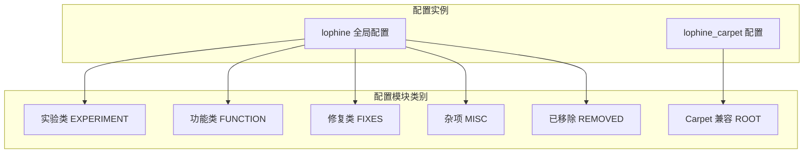
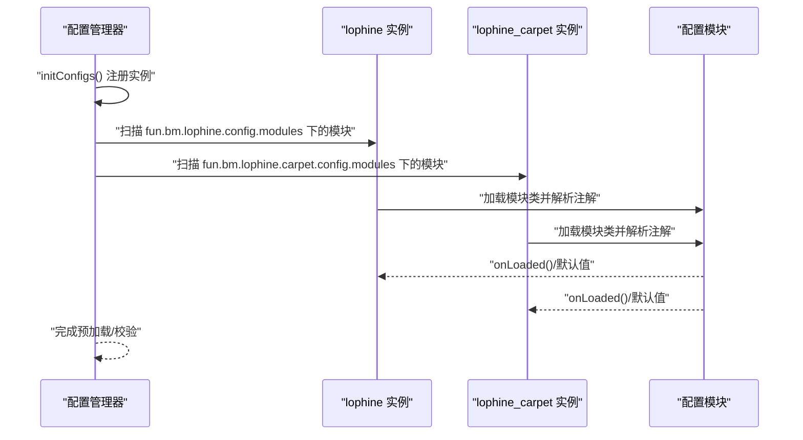
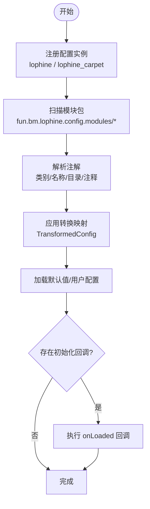
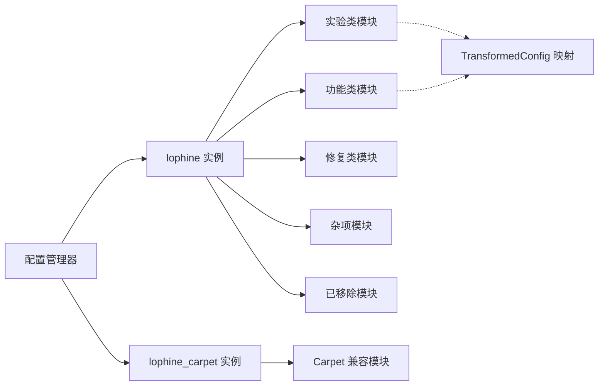

# 配置系统

<cite>
**本文引用的文件**
- [CommandConfig.java](file://lophine-server/src/main/java/fun/bm/lophine/config/modules/experiment/CommandConfig.java)
- [LanguageConfig.java](file://lophine-server/src/main/java/fun/bm/lophine/config/modules/function/LanguageConfig.java)
- [AutoUpdateConfig.java](file://lophine-server/src/main/java/fun/bm/lophine/config/modules/misc/AutoUpdateConfig.java)
- [RemovedConfig.java](file://lophine-server/src/main/java/fun/bm/lophine/config/modules/removed/RemovedConfig.java)
- [UpdateSuppressionCrashFixConfig.java](file://lophine-server/src/main/java/fun/bm/lophine/config/modules/fixes/UpdateSuppressionCrashFixConfig.java)
- [ServuxProtocolConfig.java](file://lophine-server/src/main/java/fun/bm/lophine/config/modules/function/protocol/ServuxProtocolConfig.java)
- [BBORProtocolConfig.java](file://lophine-server/src/main/java/fun/bm/lophine/config/modules/function/protocol/BBORProtocolConfig.java)
- [JadeProtocolConfig.java](file://lophine-server/src/main/java/fun/bm/lophine/config/modules/function/protocol/JadeProtocolConfig.java)
- [AppleSkinProtocolConfig.java](file://lophine-server/src/main/java/fun/bm/lophine/config/modules/function/protocol/AppleSkinProtocolConfig.java)
- [SyncmaticaProtocolConfig.java](file://lophine-server/src/main/java/fun/bm/lophine/config/modules/function/protocol/SyncmaticaProtocolConfig.java)
- [GeneralCompatConfig.java](file://lophine-server/src/main/java/fun/bm/lophine/carpet/config/modules/GeneralCompatConfig.java)
- [ConfigManager.java](file://lophine-server/luminol-patches/features/0006-Carpet-features.patch)
- [Transformed-Configs.patch](file://lophine-server/luminol-patches/features/0002-Transformed-Configs.patch)
- [LeavesConfig.java](file://lophine-server/src/main/java/org/leavesmc/leaves/LeavesConfig.java)
- [Configs.java](file://lophine-server/src/main/java/org/leavesmc/leaves/bot/agent/Configs.java)
</cite>

## 目录
1. [简介](#简介)
2. [项目结构](#项目结构)
3. [核心组件](#核心组件)
4. [架构总览](#架构总览)
5. [详细组件分析](#详细组件分析)
6. [依赖关系分析](#依赖关系分析)
7. [性能考虑](#性能考虑)
8. [故障排查指南](#故障排查指南)
9. [结论](#结论)
10. [附录](#附录)

## 简介
本指南面向服务器管理员与运维工程师，系统化介绍 Lophine 的配置体系：整体架构、配置分类、加载与动态更新机制、配置文件结构与语法、验证与回滚策略、版本兼容与迁移、最佳实践与性能优化，以及常见问题排查。Lophine 基于 Luminol 配置框架实现模块化配置管理，并通过“转换映射”（TransformedConfig）在不同配置实例之间保持向后兼容与统一入口。

## 项目结构
Lophine 将配置按“类别”组织在独立模块中，主要分为：
- 实验类（EXPERIMENT）：用于开启或限制实验性命令与行为
- 功能类（FUNCTION）：用于启用协议支持、语言、容器扩展等
- 修复类（FIXES）：用于修复已知崩溃或异常行为
- 杂项（MISC）：如自动更新提示等
- 已移除（REMOVED）：仅保留键名以兼容旧配置，无实际功能
- Carpet 兼容（ROOT）：桥接 Carpet/AMS/TIS/Org 的兼容规则到 Lophine

图表来源
- [ConfigManager.java](file://lophine-server/luminol-patches/features/0006-Carpet-features.patch)
- [CommandConfig.java](file://lophine-server/src/main/java/fun/bm/lophine/config/modules/experiment/CommandConfig.java)
- [LanguageConfig.java](file://lophine-server/src/main/java/fun/bm/lophine/config/modules/function/LanguageConfig.java)
- [AutoUpdateConfig.java](file://lophine-server/src/main/java/fun/bm/lophine/config/modules/misc/AutoUpdateConfig.java)
- [RemovedConfig.java](file://lophine-server/src/main/java/fun/bm/lophine/config/modules/removed/RemovedConfig.java)
- [GeneralCompatConfig.java](file://lophine-server/src/main/java/fun/bm/lophine/carpet/config/modules/GeneralCompatConfig.java)

章节来源
- [ConfigManager.java](file://lophine-server/luminol-patches/features/0006-Carpet-features.patch)
- [LeavesConfig.java](file://lophine-server/src/main/java/org/leavesmc/leaves/LeavesConfig.java)

## 核心组件
- 配置模块接口与注解
  - 模块需实现统一接口并在类上标注类别与名称等元信息
  - 支持注解驱动的字段级配置项定义与注释说明
- 转换映射（TransformedConfig）
  - 将新配置键映射到旧目录或旧实例，保证升级时平滑过渡
- 配置加载与初始化
  - 通过配置管理器注册多个配置实例（如 lophine、lophine_carpet），并按约定目录扫描加载
- 运行时访问
  - 提供静态字段直接读取当前值；部分模块在加载完成后触发初始化逻辑

章节来源
- [CommandConfig.java](file://lophine-server/src/main/java/fun/bm/lophine/config/modules/experiment/CommandConfig.java)
- [LanguageConfig.java](file://lophine-server/src/main/java/fun/bm/lophine/config/modules/function/LanguageConfig.java)
- [AutoUpdateConfig.java](file://lophine-server/src/main/java/fun/bm/lophine/config/modules/misc/AutoUpdateConfig.java)
- [RemovedConfig.java](file://lophine-server/src/main/java/fun/bm/lophine/config/modules/removed/RemovedConfig.java)
- [Transformed-Configs.patch](file://lophine-server/luminol-patches/features/0002-Transformed-Configs.patch)
- [ConfigManager.java](file://lophine-server/luminol-patches/features/0006-Carpet-features.patch)

## 架构总览
Lophine 的配置系统由“配置实例 + 模块类别 + 注解驱动 + 转换映射 + 初始化回调”构成，支持多实例并行加载与跨实例键映射。

图表来源
- [ConfigManager.java](file://lophine-server/luminol-patches/features/0006-Carpet-features.patch)
- [CommandConfig.java](file://lophine-server/src/main/java/fun/bm/lophine/config/modules/experiment/CommandConfig.java)
- [ServuxProtocolConfig.java](file://lophine-server/src/main/java/fun/bm/lophine/config/modules/function/protocol/ServuxProtocolConfig.java)

## 详细组件分析

### 实验类（EXPERIMENT）
- 命令相关
  - 开启 tick、function、waypoint、scoreboard、save-all 等命令
  - waypoint 同时映射到旧版键路径，确保兼容
- 行为特性
  - 部分命令可能不支持热重载，变更后需重启生效
- 使用场景
  - 测试环境开放高级命令；生产环境谨慎启用

章节来源
- [CommandConfig.java](file://lophine-server/src/main/java/fun/bm/lophine/config/modules/experiment/CommandConfig.java)
- [Transformed-Configs.patch](file://lophine-server/luminol-patches/features/0002-Transformed-Configs.patch)

### 功能类（FUNCTION）
- 语言与国际化
  - 设置语言键值；可选择阻塞式加载本地化资源（影响启动速度）
- 协议支持
  - AppleSkin、BBOR、Jade、Servux、Syncmatica 等协议开关与参数
  - Servux 提供实体数据、HUD 日志、结构协议、Litematics 等细项
- 容器扩展与红石优化
  - 容器容量扩展、红石行为调整等
- 使用场景
  - 与客户端模组联动；按需启用协议以降低开销

章节来源
- [LanguageConfig.java](file://lophine-server/src/main/java/fun/bm/lophine/config/modules/function/LanguageConfig.java)
- [ServuxProtocolConfig.java](file://lophine-server/src/main/java/fun/bm/lophine/config/modules/function/protocol/ServuxProtocolConfig.java)
- [BBORProtocolConfig.java](file://lophine-server/src/main/java/fun/bm/lophine/config/modules/function/protocol/BBORProtocolConfig.java)
- [JadeProtocolConfig.java](file://lophine-server/src/main/java/fun/bm/lophine/config/modules/function/protocol/JadeProtocolConfig.java)
- [AppleSkinProtocolConfig.java](file://lophine-server/src/main/java/fun/bm/lophine/config/modules/function/protocol/AppleSkinProtocolConfig.java)
- [SyncmaticaProtocolConfig.java](file://lophine-server/src/main/java/fun/bm/lophine/config/modules/function/protocol/SyncmaticaProtocolConfig.java)

### 修复类（FIXES）
- 更新抑制导致的崩溃防护
  - 可通过开关控制是否启用该修复
- 使用场景
  - 遇到异常崩溃或兼容性问题时优先启用

章节来源
- [UpdateSuppressionCrashFixConfig.java](file://lophine-server/src/main/java/fun/bm/lophine/config/modules/fixes/UpdateSuppressionCrashFixConfig.java)

### 杂项（MISC）
- 自动更新提示
  - 当前仅为占位展示，具体功能由上游实现
- 使用场景
  - 观察更新状态，配合其他流程使用

章节来源
- [AutoUpdateConfig.java](file://lophine-server/src/main/java/fun/bm/lophine/config/modules/misc/AutoUpdateConfig.java)

### 已移除（REMOVED）
- 作用
  - 仅保留键名以便从旧配置迁移，无实际功能
- 使用场景
  - 清理遗留配置键，避免报错

章节来源
- [RemovedConfig.java](file://lophine-server/src/main/java/fun/bm/lophine/config/modules/removed/RemovedConfig.java)

### Carpet 兼容（ROOT）
- 语言转发与崩溃修复映射
  - 将外部兼容层的设置映射到 Lophine 内部对应功能
- 使用场景
  - 在使用 Carpet/AMS/TIS/Org 时快速对齐行为

章节来源
- [GeneralCompatConfig.java](file://lophine-server/src/main/java/fun/bm/lophine/carpet/config/modules/GeneralCompatConfig.java)

### 配置加载与动态更新
- 多实例加载
  - 通过配置管理器注册多个实例，分别扫描不同包路径
- 注解驱动
  - 类级与字段级注解定义类别、名称、目录、注释与建议值
- 转换映射
  - 通过 Transform 注解将新键映射到旧目录或旧实例，实现平滑迁移
- 初始化回调
  - 部分模块在加载完成后执行初始化逻辑（如协议开关）

图表来源
- [ConfigManager.java](file://lophine-server/luminol-patches/features/0006-Carpet-features.patch)
- [Transformed-Configs.patch](file://lophine-server/luminol-patches/features/0002-Transformed-Configs.patch)
- [ServuxProtocolConfig.java](file://lophine-server/src/main/java/fun/bm/lophine/config/modules/function/protocol/ServuxProtocolConfig.java)

## 依赖关系分析
- 组件耦合
  - 配置模块依赖注解与枚举定义类别；部分模块依赖运行时协议初始化
- 外部依赖
  - 通过补丁扩展配置管理器，新增 lophine_carpet 实例
- 转换映射链路
  - 新键通过 Transform 注解指向旧目录或旧实例，形成跨实例依赖

图表来源
- [ConfigManager.java](file://lophine-server/luminol-patches/features/0006-Carpet-features.patch)
- [Transformed-Configs.patch](file://lophine-server/luminol-patches/features/0002-Transformed-Configs.patch)

章节来源
- [ConfigManager.java](file://lophine-server/luminol-patches/features/0006-Carpet-features.patch)
- [Transformed-Configs.patch](file://lophine-server/luminol-patches/features/0002-Transformed-Configs.patch)

## 性能考虑
- 协议启用策略
  - 仅启用必要的协议模块，减少网络与序列化开销
  - 对高频同步（如 AppleSkin、Servux HUD）合理设置同步间隔
- 语言加载
  - 非必要时关闭阻塞式本地化加载，避免启动延迟
- 命令与调试
  - 关闭未使用的实验类命令，避免额外检查与日志输出
- 热重载限制
  - 对不支持热重载的模块，集中变更后重启生效，减少反复重启

## 故障排查指南
- 崩溃与异常
  - 若出现更新抑制相关崩溃，优先确认修复模块已启用
- 协议不生效
  - 检查对应协议模块的开关与初始化回调是否正确执行
- 键名错误或缺失
  - 使用转换映射键名进行迁移；若仍报错，确认目标目录是否存在
- 自动更新无效
  - 当前自动更新模块为占位展示，需结合上游实现

章节来源
- [UpdateSuppressionCrashFixConfig.java](file://lophine-server/src/main/java/fun/bm/lophine/config/modules/fixes/UpdateSuppressionCrashFixConfig.java)
- [ServuxProtocolConfig.java](file://lophine-server/src/main/java/fun/bm/lophine/config/modules/function/protocol/ServuxProtocolConfig.java)
- [AutoUpdateConfig.java](file://lophine-server/src/main/java/fun/bm/lophine/config/modules/misc/AutoUpdateConfig.java)

## 结论
Lophine 的配置系统以模块化与注解为核心，辅以转换映射与多实例加载，既满足功能扩展又兼顾向后兼容。通过合理的启用策略、严格的验证与回滚流程，以及遵循最佳实践，可在保证稳定性的同时获得更优的性能与可观测性。

## 附录

### 配置分类与示例键
- 实验类（EXPERIMENT）
  - 命令开关：tick、function、waypoint、scoreboard、save-all
  - 示例键：experiment.command.tick_command_enabled
- 功能类（FUNCTION）
  - 语言：function.language.lang
  - 协议：protocol.servux.entity-protocol、protocol.jade.enabled 等
- 修复类（FIXES）
  - update-suppression-crash-fix.enabled
- 杂项（MISC）
  - auto_update.enabled
- 已移除（REMOVED）
  - 仅保留键名，无实际功能
- Carpet 兼容（ROOT）
  - general.language、general.amsUpdateSuppressionCrashFix 等

章节来源
- [CommandConfig.java](file://lophine-server/src/main/java/fun/bm/lophine/config/modules/experiment/CommandConfig.java)
- [LanguageConfig.java](file://lophine-server/src/main/java/fun/bm/lophine/config/modules/function/LanguageConfig.java)
- [ServuxProtocolConfig.java](file://lophine-server/src/main/java/fun/bm/lophine/config/modules/function/protocol/ServuxProtocolConfig.java)
- [UpdateSuppressionCrashFixConfig.java](file://lophine-server/src/main/java/fun/bm/lophine/config/modules/fixes/UpdateSuppressionCrashFixConfig.java)
- [AutoUpdateConfig.java](file://lophine-server/src/main/java/fun/bm/lophine/config/modules/misc/AutoUpdateConfig.java)
- [RemovedConfig.java](file://lophine-server/src/main/java/fun/bm/lophine/config/modules/removed/RemovedConfig.java)
- [GeneralCompatConfig.java](file://lophine-server/src/main/java/fun/bm/lophine/carpet/config/modules/GeneralCompatConfig.java)

### 配置文件结构与语法规范
- 文件类型
  - TOML（lophine_config/lophine_carpet_config.toml）
- 目录结构
  - 通过注解中的 directory 字段定义层级
- 语法要点
  - 键名区分大小写；布尔值与整数需符合 TOML 规范
  - 建议为每个键提供清晰注释，便于维护

章节来源
- [ConfigManager.java](file://lophine-server/luminol-patches/features/0006-Carpet-features.patch)

### 验证、回滚与版本兼容
- 验证
  - 加载完成后执行初始化回调，确保模块状态一致
- 回滚
  - 通过转换映射键名回退到旧配置目录，避免破坏性变更
- 版本兼容
  - 通过 Transform 注解将新键映射到旧目录或旧实例，实现平滑升级

章节来源
- [Transformed-Configs.patch](file://lophine-server/luminol-patches/features/0002-Transformed-Configs.patch)
- [ServuxProtocolConfig.java](file://lophine-server/src/main/java/fun/bm/lophine/config/modules/function/protocol/ServuxProtocolConfig.java)

### 最佳实践
- 分类启用：按功能需求启用模块，避免过度配置
- 合理命名：使用清晰的键名与注释，便于团队协作
- 逐步验证：变更后集中测试，确认无副作用再推广
- 文档留痕：记录每次变更的动机与影响范围